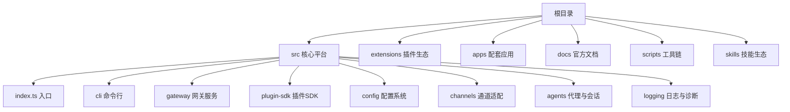
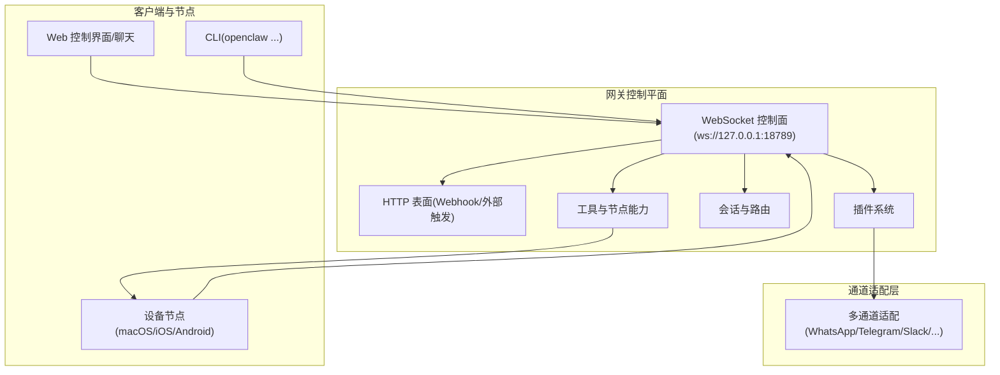
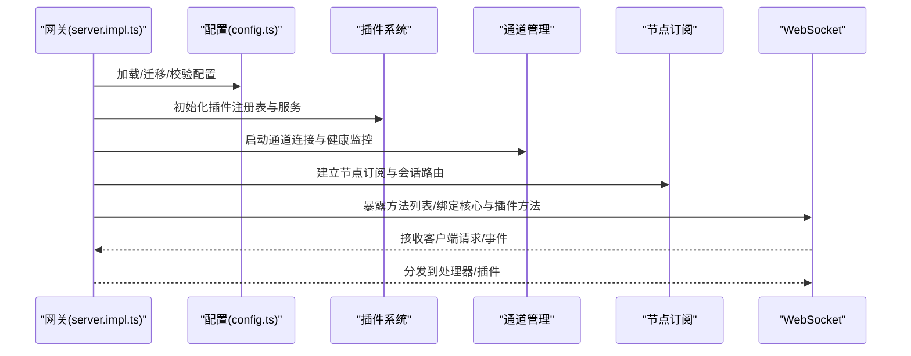
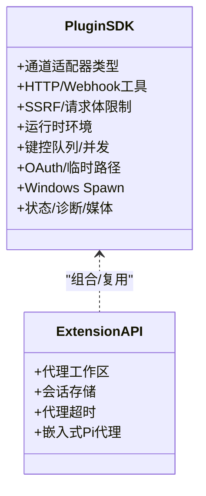
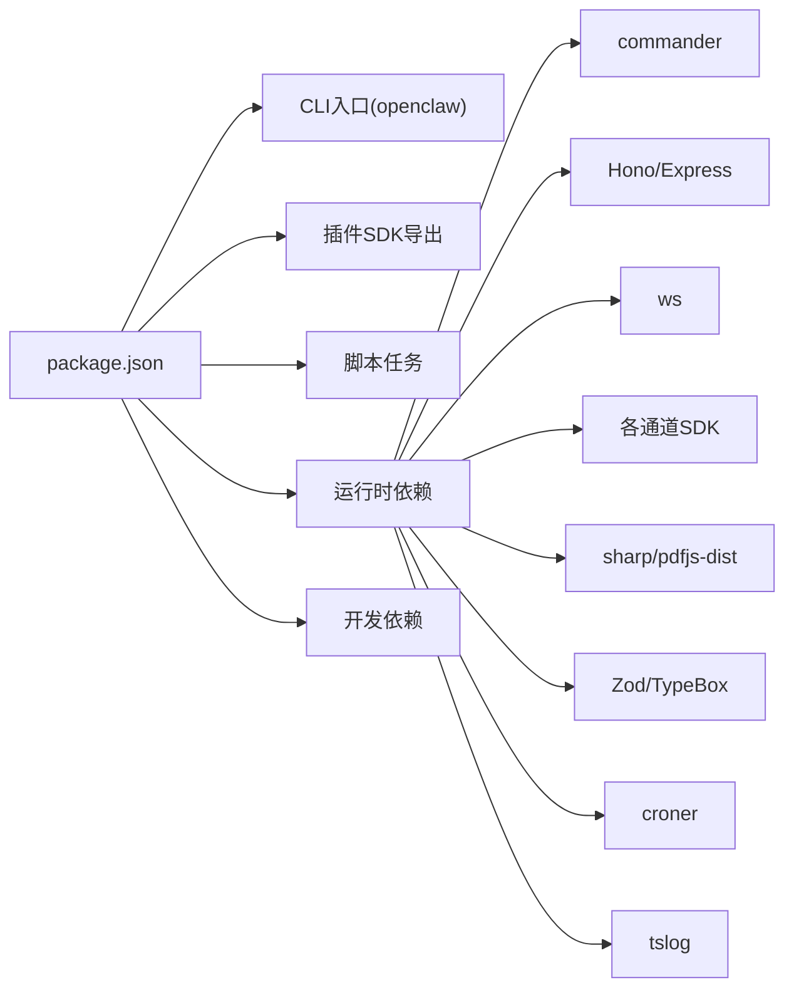

# 开发者文档

<cite>
**本文引用的文件**
- [README.md](file://README.md)
- [CONTRIBUTING.md](file://CONTRIBUTING.md)
- [package.json](file://package.json)
- [src/index.ts](file://src/index.ts)
- [src/runtime.ts](file://src/runtime.ts)
- [src/cli/program.ts](file://src/cli/program.ts)
- [src/cli/program/build-program.ts](file://src/cli/program/build-program.ts)
- [src/config/config.ts](file://src/config/config.ts)
- [src/plugin-sdk/index.ts](file://src/plugin-sdk/index.ts)
- [src/extensionAPI.ts](file://src/extensionAPI.ts)
- [src/gateway/server.ts](file://src/gateway/server.ts)
- [src/gateway/server.impl.ts](file://src/gateway/server.impl.ts)
</cite>

## 目录

1. [简介](#简介)
2. [项目结构](#项目结构)
3. [核心组件](#核心组件)
4. [架构总览](#架构总览)
5. [详细组件分析](#详细组件分析)
6. [依赖分析](#依赖分析)
7. [性能考虑](#性能考虑)
8. [故障排查指南](#故障排查指南)
9. [结论](#结论)
10. [附录](#附录)

## 简介

本文件面向OpenClaw开发者，提供系统架构设计、API参考、测试与贡献流程的完整技术文档。OpenClaw是一个在用户设备上运行的个人AI助手，通过统一的网关控制平面（Gateway）连接多通道消息渠道（如WhatsApp、Telegram、Slack、Discord等），支持会话管理、工具执行、节点能力调用、Canvas可视化工作区、语音唤醒与对话、以及可扩展的插件生态。

- 快速入口：[项目主页与文档索引](https://docs.openclaw.ai)
- 安装与入门：[安装与更新指南](https://docs.openclaw.ai/install)
- 架构概览：[网关与协议模型](https://docs.openclaw.ai/concepts/architecture)
- 配置参考：[完整配置键与示例](https://docs.openclaw.ai/gateway/configuration)

**章节来源**

- [README.md: 21-50:21-50](file://README.md#L21-L50)
- [README.md: 415-441:415-441](file://README.md#L415-L441)

## 项目结构

仓库采用多模块组织方式，核心目录与职责如下：

- src：核心平台代码（CLI、网关、通道适配、插件SDK、配置、日志、工具等）
- extensions：社区插件集合（按频道/功能拆分）
- apps：配套应用（macOS、iOS、Android）
- docs：官方文档（多语言）
- scripts：构建、测试、打包、发布脚本
- skills：技能（skills）与ClawHub生态
- packages：辅助包（如clawdbot、moltbot）

下图展示与开发者最相关的顶层结构与模块边界：

**图表来源**

- [package.json: 1-465:1-465](file://package.json#L1-L465)

**章节来源**

- [package.json: 1-465:1-465](file://package.json#L1-L465)

## 核心组件

- CLI入口与运行时
  - 入口文件负责加载环境变量、标准化环境、捕获控制台输出、运行时版本校验、构建命令行程序，并注册全局未处理异常处理器。
  - 运行时环境抽象提供统一的日志、错误输出与退出行为，便于测试与集成。
- 网关服务
  - 负责启动与管理WebSocket控制面、通道连接、插件系统、会话与节点订阅、健康检查、发现与暴露（含Tailscale）、浏览器控制、Canvas主机等。
- 插件SDK
  - 提供插件生命周期、HTTP路由注册、Webhook目标解析与鉴权、通道适配器类型、工具与会话API、SSRF防护、请求体限制与速率限制等能力。
- 配置系统
  - 支持配置读取、快照、校验、迁移与热重载；提供运行时覆盖与插件验证。

**章节来源**

- [src/index.ts: 1-94:1-94](file://src/index.ts#L1-L94)
- [src/runtime.ts: 1-54:1-54](file://src/runtime.ts#L1-L54)
- [src/gateway/server.ts: 1-4:1-4](file://src/gateway/server.ts#L1-L4)
- [src/gateway/server.impl.ts: 1-200:1-200](file://src/gateway/server.impl.ts#L1-L200)
- [src/plugin-sdk/index.ts: 1-826:1-826](file://src/plugin-sdk/index.ts#L1-L826)
- [src/config/config.ts: 1-29:1-29](file://src/config/config.ts#L1-L29)

## 架构总览

OpenClaw采用“单网关控制平面 + 多客户端/节点”的架构。网关通过WebSocket提供统一控制面，承载会话、通道、工具、事件与管理界面；同时提供HTTP表面用于Webhook与外部触发；插件体系扩展通道与工具能力；节点（macOS/iOS/Android）通过WebSocket接入并提供本地能力（如Canvas、相机、屏幕录制、通知等）。

**图表来源**

- [README.md: 185-202:185-202](file://README.md#L185-L202)
- [src/gateway/server.impl.ts: 1-200:1-200](file://src/gateway/server.impl.ts#L1-L200)

## 详细组件分析

### CLI与运行时

- CLI程序构建
  - 使用commander构建命令树，注册预动作钩子、帮助信息与命令集。
  - 入口文件在主模块时安装未处理异常处理器，捕获并格式化错误后优雅退出。
- 运行时环境
  - 统一日志/错误输出，支持测试场景下的非退出式退出，便于断言与恢复。

```mermaid
sequenceDiagram
participant Proc as "进程"
participant Entr as "入口(src/index.ts)"
participant CLI as "命令行(build-program.ts)"
participant RT as "运行时(runtime.ts)"
Proc->>Entr : 启动
Entr->>Entr : 加载环境/捕获控制台
Entr->>RT : 创建默认运行时
Entr->>CLI : 构建命令行程序
CLI-->>Entr : 返回program实例
Entr->>Proc : 注册未处理异常处理器
Entr->>CLI : 解析argv并执行命令
CLI-->>Entr : 命令完成或抛错
Entr->>Proc : 退出码(0或1)
```

**图表来源**

- [src/index.ts: 1-94:1-94](file://src/index.ts#L1-L94)
- [src/cli/program/build-program.ts: 1-21:1-21](file://src/cli/program/build-program.ts#L1-L21)
- [src/runtime.ts: 1-54:1-54](file://src/runtime.ts#L1-L54)

**章节来源**

- [src/index.ts: 1-94:1-94](file://src/index.ts#L1-L94)
- [src/cli/program/build-program.ts: 1-21:1-21](file://src/cli/program/build-program.ts#L1-L21)
- [src/runtime.ts: 1-54:1-54](file://src/runtime.ts#L1-L54)

### 网关服务

- 启动流程
  - 初始化配置、认证与授权、TLS、发现、维护定时器、插件与通道管理、节点注册、健康状态与诊断心跳、控制界面资源等。
  - 通过WebSocket暴露方法列表，绑定核心方法与插件方法，建立节点订阅与会话路由。
- 关键子系统
  - 插件系统：注册、自动启用、服务句柄、钩子运行。
  - 通道健康监控与重连策略。
  - 认证限流（含浏览器来源特例）。
  - 尾流（Tailscale）暴露与安全策略。
  - 浏览器控制与Canvas主机。
- 方法与事件
  - 列出可用方法、事件与更新可用事件，支持动态刷新。

**图表来源**

- [src/gateway/server.impl.ts: 1-200:1-200](file://src/gateway/server.impl.ts#L1-L200)
- [src/gateway/server.ts: 1-4:1-4](file://src/gateway/server.ts#L1-L4)
- [src/config/config.ts: 1-29:1-29](file://src/config/config.ts#L1-L29)

**章节来源**

- [src/gateway/server.impl.ts: 1-200:1-200](file://src/gateway/server.impl.ts#L1-L200)
- [src/gateway/server.ts: 1-4:1-4](file://src/gateway/server.ts#L1-L4)
- [src/config/config.ts: 1-29:1-29](file://src/config/config.ts#L1-L29)

### 插件SDK与API

- 导出范围
  - 通道适配器类型与常量（消息、群组、提及、线程、心跳、安全等）。
  - 插件运行时、HTTP路由注册、Webhook目标解析与鉴权、SSRF与请求体限制、速率限制、键控异步队列、OAuth工具、临时路径、Windows Spawn策略、运行时环境解析等。
  - 通道账户解析、目录配置、允许列表匹配、组策略评估、命令授权、入站信封构建、回复负载构造、媒体加载与文本分块、时间格式化、诊断事件、地理位置、命令门控、轮询输入等。
- 插件生态
  - 通过package.json导出多频道插件SDK命名空间，便于第三方插件按需引入。
- 扩展API
  - 对外暴露代理工作区、会话存储、代理超时、嵌入式Pi代理运行等能力。

**图表来源**

- [src/plugin-sdk/index.ts: 1-826:1-826](file://src/plugin-sdk/index.ts#L1-L826)
- [src/extensionAPI.ts: 1-15:1-15](file://src/extensionAPI.ts#L1-L15)
- [package.json: 37-216:37-216](file://package.json#L37-L216)

**章节来源**

- [src/plugin-sdk/index.ts: 1-826:1-826](file://src/plugin-sdk/index.ts#L1-L826)
- [src/extensionAPI.ts: 1-15:1-15](file://src/extensionAPI.ts#L1-L15)
- [package.json: 37-216:37-216](file://package.json#L37-L216)

### 配置系统

- 功能要点
  - 配置IO（读取、写入、快照）、运行时快照、校验与迁移、路径解析、运行时覆盖。
  - 与插件系统联动进行配置校验与自动启用。
- 使用建议
  - 在开发中使用运行时快照与覆盖，便于测试不同配置组合。

**章节来源**

- [src/config/config.ts: 1-29:1-29](file://src/config/config.ts#L1-L29)

## 依赖分析

- 包管理与导出
  - package.json定义了CLI二进制入口、多插件SDK命名空间导出、脚本任务与引擎要求（Node ≥22）。
- 关键依赖
  - CLI框架（commander）、HTTP服务器（Hono/Express）、WebSocket（ws）、通道SDK（Baileys、Grammy、Slack Bolt、discord.js等）、媒体与PDF处理（sharp、pdfjs-dist）、类型校验（Zod、TypeBox）、定时任务（croner）、日志（tslog）等。
- 仅构建依赖
  - TypeScript、Vitest、oxlint、tsdown等，用于类型生成、测试与代码质量。

**图表来源**

- [package.json: 1-465:1-465](file://package.json#L1-L465)

**章节来源**

- [package.json: 1-465:1-465](file://package.json#L1-L465)

## 性能考虑

- 令牌使用与上下文压缩
  - 参考概念文档中的“上下文压缩”与“会话修剪”，减少上下文长度以降低延迟与成本。
- 并发与队列
  - 键控异步队列与通道并发控制，避免热点竞争与资源争用。
- 媒体与网络
  - 媒体大小限制、临时文件生命周期、SSRF防护与请求体限制，防止资源滥用与攻击面扩大。
- 诊断与可观测性
  - 诊断事件与心跳，辅助定位瓶颈与异常。

[本节为通用指导，无需特定文件引用]

## 故障排查指南

- 常见问题定位
  - 使用“医生”命令（doctor）检查配置与运行状态，识别潜在风险与错误。
  - 查看网关健康状态、通道健康监控与尾流（Tailscale）暴露状态。
- 日志与诊断
  - 结构化日志输出，结合诊断事件与心跳，定位问题根因。
- 安全与权限
  - 默认DM配对策略与公开DM选项，确保未知发送方被正确拦截与批准。
- 端口占用
  - 网关端口占用时的错误描述与处理逻辑，确保端口可用性。

**章节来源**

- [README.md: 442-448:442-448](file://README.md#L442-L448)
- [README.md: 112-124:112-124](file://README.md#L112-L124)
- [src/gateway/server.impl.ts: 150-200:150-200](file://src/gateway/server.impl.ts#L150-L200)

## 结论

本文档从架构、组件、API与实践四个维度梳理了OpenClaw的核心实现与扩展点，既适合新贡献者快速上手，也为资深开发者提供了深入的技术参考。建议在贡献前先阅读贡献指南与开发环境搭建说明，遵循测试与代码规范，确保变更的稳定性与安全性。

[本节为总结，无需特定文件引用]

## 附录

### API参考（概览）

- WebSocket控制面
  - 方法列表与事件：通过网关方法清单与事件定义暴露，支持动态刷新。
  - 节点订阅与会话路由：节点能力描述与会话键解析。
- HTTP接口
  - Webhook：目标注册、鉴权、请求体限制与速率限制。
  - 插件HTTP路由：按插件命名空间导出，支持自定义路由注册。
- 插件API
  - 通道适配器类型、工具与会话API、SSRF与请求体限制、键控队列、OAuth工具、临时路径、Windows Spawn策略、运行时环境解析等。

**章节来源**

- [src/gateway/server.ts: 1-4:1-4](file://src/gateway/server.ts#L1-L4)
- [src/plugin-sdk/index.ts: 1-826:1-826](file://src/plugin-sdk/index.ts#L1-L826)
- [package.json: 37-216:37-216](file://package.json#L37-L216)

### 测试策略与代码规范

- 测试矩阵
  - 单元测试、端到端测试、Docker集成测试、实时模型与网关测试、UI测试等。
- 规范与工具
  - oxlint（TypeScript/JavaScript）、oxfmt（格式化）、SwiftLint/SwiftFormat（iOS/macOS）、markdownlint（文档）、jscpd（重复代码检测）、ts-prune/ts-unused-exports（死代码检测）。
- 贡献流程
  - 提交PR前本地测试、CI检查、保持PR聚焦、描述变更动机与影响、包含截图（UI/视觉变更）。

**章节来源**

- [CONTRIBUTING.md: 79-106:79-106](file://CONTRIBUTING.md#L79-L106)
- [CONTRIBUTING.md: 123-136:123-136](file://CONTRIBUTING.md#L123-L136)
- [package.json: 217-338:217-338](file://package.json#L217-L338)

### 开发环境搭建

- 运行时要求
  - Node ≥22，推荐使用pnpm进行构建与运行。
- 快速起步
  - 克隆仓库、安装依赖、构建UI与核心、运行向导安装守护进程、开发循环（监听TS变更）。
- 常用脚本
  - 构建、检查、测试、UI开发、Docker测试、协议生成与校验、UI构建与开发等。

**章节来源**

- [README.md: 92-111:92-111](file://README.md#L92-L111)
- [package.json: 217-338:217-338](file://package.json#L217-L338)
