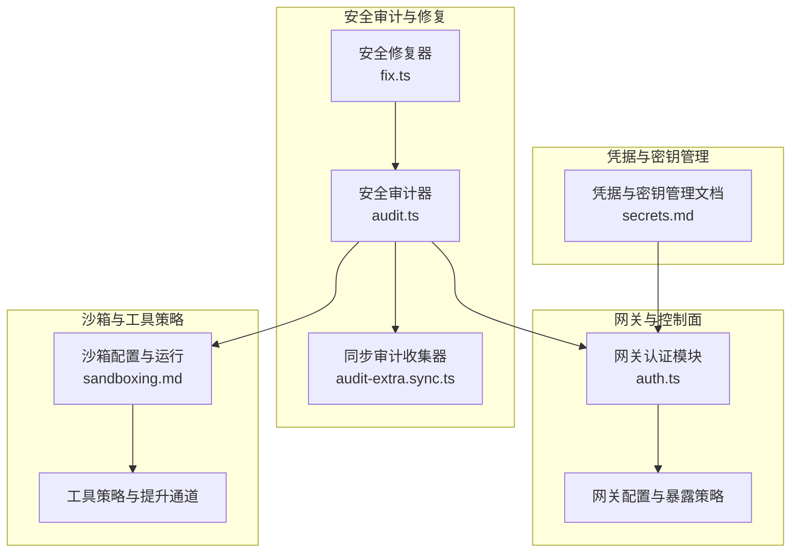
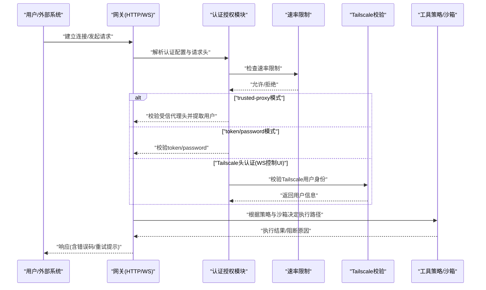
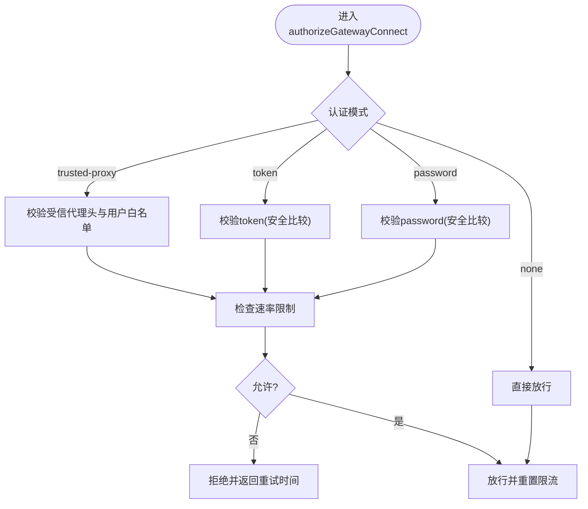
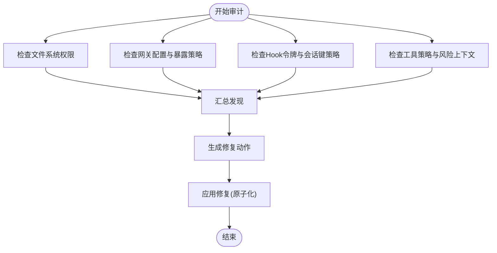
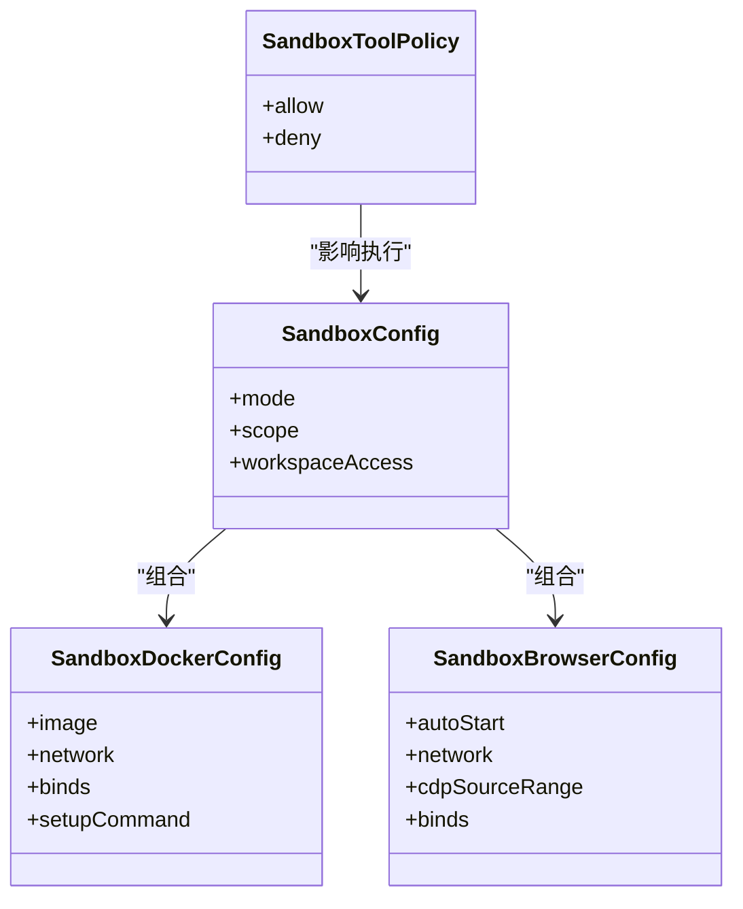
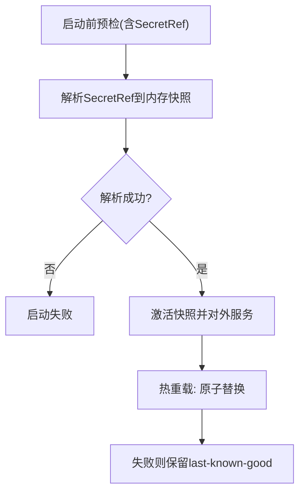
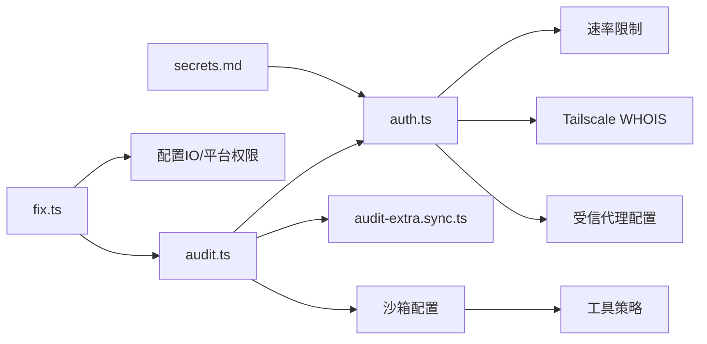

# 安全架构

<cite>
**本文引用的文件**
- [SECURITY.md](file://SECURITY.md)
- [audit.ts](file://src/security/audit.ts)
- [audit-extra.sync.ts](file://src/security/audit-extra.sync.ts)
- [fix.ts](file://src/security/fix.ts)
- [auth.ts](file://src/gateway/auth.ts)
- [secrets.md](file://docs/gateway/secrets.md)
- [sandboxing.md](file://docs/gateway/sandboxing.md)
- [authentication.md](file://docs/gateway/authentication.md)
- [security/README.md](file://docs/security/README.md)
</cite>

## 目录

1. [引言](#引言)
2. [项目结构](#项目结构)
3. [核心组件](#核心组件)
4. [架构总览](#架构总览)
5. [详细组件分析](#详细组件分析)
6. [依赖关系分析](#依赖关系分析)
7. [性能考量](#性能考量)
8. [故障排查指南](#故障排查指南)
9. [结论](#结论)
10. [附录](#附录)

## 引言

本文件面向OpenClaw的安全架构，系统化阐述其安全模型、认证授权机制、访问控制策略、网关安全协议、插件沙箱机制与敏感数据保护方案，并给出身份验证流程、权限管理、审计日志与威胁防护的实现要点。同时提供安全配置最佳实践、漏洞防护与应急响应机制、安全测试与渗透测试指南以及合规性要求与隐私保护实现细节。

## 项目结构

OpenClaw将安全能力分布在多个层面：

- 网关层：认证授权、速率限制、反向代理信任、Tailscale集成、受控UI暴露策略
- 安全审计与修复：配置与文件系统权限扫描、危险配置检测、自动修复建议
- 沙箱与工具策略：容器化执行、浏览器沙箱、绑定挂载与网络限制
- 凭据与密钥管理：SecretRef契约、运行时快照、一次性安全策略与重载行为
- 文档与策略：安全政策、威胁建模、报告与响应流程

图示来源

- [auth.ts:1-504](file://src/gateway/auth.ts#L1-L504)
- [audit.ts:1-800](file://src/security/audit.ts#L1-L800)
- [audit-extra.sync.ts:1-800](file://src/security/audit-extra.sync.ts#L1-L800)
- [fix.ts:1-478](file://src/security/fix.ts#L1-L478)
- [sandboxing.md:1-260](file://docs/gateway/sandboxing.md#L1-L260)
- [secrets.md:1-455](file://docs/gateway/secrets.md#L1-L455)

章节来源

- [audit.ts:1-800](file://src/security/audit.ts#L1-L800)
- [audit-extra.sync.ts:1-800](file://src/security/audit-extra.sync.ts#L1-L800)
- [fix.ts:1-478](file://src/security/fix.ts#L1-L478)
- [auth.ts:1-504](file://src/gateway/auth.ts#L1-L504)
- [sandboxing.md:1-260](file://docs/gateway/sandboxing.md#L1-L260)
- [secrets.md:1-455](file://docs/gateway/secrets.md#L1-L455)

## 核心组件

- 网关认证与授权
  - 支持token/password/trusted-proxy/none模式，结合速率限制、Tailscale用户校验与受信代理头校验，确保本地直连与远程受控访问的安全边界。
- 安全审计与修复
  - 基于配置与文件系统权限的静态检查，识别危险暴露、弱权限、未加密传输、Hook令牌复用等风险；提供自动修复建议与原子化变更。
- 沙箱与工具策略
  - 工具执行容器化、浏览器容器化、网络隔离、绑定挂载白名单与只读策略、作用域隔离（会话/代理/共享），并配合工具策略与“提升通道”限制。
- 凭据与密钥管理
  - SecretRef契约（env/file/exec）、运行时快照、启动失败中止、热重载原子替换、命令路径解析降级策略，避免明文持久化与泄露面扩大。

章节来源

- [auth.ts:217-292](file://src/gateway/auth.ts#L217-L292)
- [audit.ts:339-687](file://src/security/audit.ts#L339-L687)
- [audit-extra.sync.ts:528-770](file://src/security/audit-extra.sync.ts#L528-L770)
- [fix.ts:387-478](file://src/security/fix.ts#L387-L478)
- [sandboxing.md:1-260](file://docs/gateway/sandboxing.md#L1-L260)
- [secrets.md:1-455](file://docs/gateway/secrets.md#L1-L455)

## 架构总览

OpenClaw采用“个人助理”信任模型：单一可信操作者边界，网关作为控制面，节点作为扩展，工具调用与执行在受控边界内完成。安全边界由主机信任、认证、工具策略、沙箱与执行审批共同构成。

图示来源

- [auth.ts:378-485](file://src/gateway/auth.ts#L378-L485)
- [auth.ts:217-292](file://src/gateway/auth.ts#L217-L292)

章节来源

- [auth.ts:1-504](file://src/gateway/auth.ts#L1-L504)
- [SECURITY.md:88-172](file://SECURITY.md#L88-L172)

## 详细组件分析

### 组件A：网关认证与授权机制

- 认证模式与优先级
  - 支持显式覆盖、配置、密码、token与默认顺序解析；当配置为trusted-proxy时，必须提供userHeader与受信代理列表。
- 速率限制
  - 对共享密钥进行IP维度限流，失败计入，成功重置；支持自定义窗口与封禁时间。
- 受信代理与Tailscale
  - 受信代理需具备必需头与用户白名单；Tailscale头仅在WS控制UI场景启用，且需要客户端IP WHOIS匹配。
- 本地直连判定
  - 结合XFF/XRealIP与受信代理列表，判断是否为本地直连，避免转发伪造。

图示来源

- [auth.ts:378-485](file://src/gateway/auth.ts#L378-L485)
- [auth.ts:108-146](file://src/gateway/auth.ts#L108-L146)

章节来源

- [auth.ts:217-292](file://src/gateway/auth.ts#L217-L292)
- [auth.ts:378-485](file://src/gateway/auth.ts#L378-L485)

### 组件B：安全审计与修复

- 审计范围
  - 网关暴露与认证、Control UI跨域与设备身份、Hook令牌与会话键、工具策略与危险暴露、文件系统权限、状态目录与配置文件权限、多用户信号与风险上下文。
- 同步审计收集器
  - 收集攻击面摘要、Hook硬化工况、HTTP无认证暴露、沙箱Docker配置误用、模型与小模型风险、浏览器控制安全等。
- 自动修复
  - 对状态目录、配置文件、凭证目录与会话文件设置严格权限；对部分组策略从open切换到allowlist；对日志脱敏策略进行修正。

图示来源

- [audit.ts:208-337](file://src/security/audit.ts#L208-L337)
- [audit.ts:339-687](file://src/security/audit.ts#L339-L687)
- [audit-extra.sync.ts:528-770](file://src/security/audit-extra.sync.ts#L528-L770)
- [fix.ts:387-478](file://src/security/fix.ts#L387-L478)

章节来源

- [audit.ts:1-800](file://src/security/audit.ts#L1-L800)
- [audit-extra.sync.ts:1-800](file://src/security/audit-extra.sync.ts#L1-L800)
- [fix.ts:1-478](file://src/security/fix.ts#L1-L478)

### 组件C：插件沙箱机制与工具策略

- 沙箱模式与作用域
  - 模式：off/non-main/all；作用域：session/agent/shared；工作区访问：none/ro/rw。
- 浏览器沙箱
  - 默认使用专用网络，可限制容器边缘CDP入口，noVNC密码保护，支持自定义绑定挂载与网络。
- 绑定挂载与网络
  - 显式白名单绑定，阻止危险源；默认无网络，可通过配置开启；禁止host网络与容器命名空间加入。
- 工具策略与提升通道
  - 工具策略先于沙箱规则生效；elevated为明确的主机执行逃逸舱口，应严格限制。

图示来源

- [sandboxing.md:39-260](file://docs/gateway/sandboxing.md#L39-L260)

章节来源

- [sandboxing.md:1-260](file://docs/gateway/sandboxing.md#L1-L260)

### 组件D：敏感数据保护与凭据管理

- SecretRef契约
  - 支持env/file/exec三类来源，统一对象形状；提供提供者配置、并发与批大小限制、超时与输出限制。
- 运行时模型
  - 启动期预解析并失败中止；热重载采用原子替换；命令路径解析支持降级读取。
- 安全策略
  - 不写回滚备份含明文；对Windows路径ACL不可用时采取fail-closed；对过期/缺失凭据提供检查命令与监控脚本。

图示来源

- [secrets.md:16-65](file://docs/gateway/secrets.md#L16-L65)
- [secrets.md:312-364](file://docs/gateway/secrets.md#L312-L364)

章节来源

- [secrets.md:1-455](file://docs/gateway/secrets.md#L1-L455)

### 组件E：身份验证流程与权限管理

- 身份验证流程
  - 解析认证配置与环境变量，按优先级选择模式；trusted-proxy需校验代理头与用户白名单；token/password使用安全比较；Tailscale头仅在WS控制UI启用。
- 权限管理
  - 工具策略与沙箱模式共同决定执行权限；elevated为例外通道，需严格限制；Hook会话键可被请求覆盖但应限制前缀。
- 审计日志
  - 审计器记录严重级别与修复建议；修复器提供原子化变更与错误汇总。

章节来源

- [auth.ts:217-292](file://src/gateway/auth.ts#L217-L292)
- [audit.ts:339-687](file://src/security/audit.ts#L339-L687)
- [audit-extra.sync.ts:605-709](file://src/security/audit-extra.sync.ts#L605-L709)
- [fix.ts:387-478](file://src/security/fix.ts#L387-L478)

## 依赖关系分析

- 认证模块依赖速率限制、Tailscale WHOIS与受信代理配置，确保不同接入面的安全一致性。
- 审计模块依赖配置解析、工具策略与沙箱配置，形成静态风险画像。
- 修复模块依赖配置IO与平台特定权限工具（Windows ACL/Unix chmod），保证变更原子性与幂等性。
- 沙箱与工具策略相互约束，防止越权执行；SecretRef为凭据输入提供安全通道。

图示来源

- [auth.ts:1-504](file://src/gateway/auth.ts#L1-L504)
- [audit.ts:1-800](file://src/security/audit.ts#L1-L800)
- [audit-extra.sync.ts:1-800](file://src/security/audit-extra.sync.ts#L1-L800)
- [fix.ts:1-478](file://src/security/fix.ts#L1-L478)
- [sandboxing.md:1-260](file://docs/gateway/sandboxing.md#L1-L260)
- [secrets.md:1-455](file://docs/gateway/secrets.md#L1-L455)

章节来源

- [auth.ts:1-504](file://src/gateway/auth.ts#L1-L504)
- [audit.ts:1-800](file://src/security/audit.ts#L1-L800)
- [fix.ts:1-478](file://src/security/fix.ts#L1-L478)

## 性能考量

- 审计与修复为离线/低频操作，避免对热路径产生影响。
- SecretRef解析在启动期完成，热重载采用原子替换，减少运行期抖动。
- 沙箱容器按作用域创建，合理选择scope与workspaceAccess可平衡隔离强度与性能开销。
- 速率限制与Tailscale校验为轻量CPU操作，建议在高并发场景下适当放宽窗口但收紧阈值。

## 故障排查指南

- 常见问题定位
  - 网关暴露与认证：确认bind与auth模式、trusted-proxy配置与受信代理列表、Control UI允许来源与设备身份开关。
  - Hook安全：检查hooks.token长度与独立性、hooks.path非根路径、request sessionKey覆盖与前缀限制。
  - 文件系统权限：状态目录与配置文件权限、凭证目录权限、会话文件权限。
  - 沙箱误配：docker网络、绑定挂载危险源、作用域与工作区访问策略。
- 快速修复
  - 使用安全修复器自动设置权限与策略调整；必要时回滚至上一个已知良好配置。
- 应急响应
  - 立即降低暴露面（loopback/受信代理/Tailscale Serve）、撤销受影响令牌、收紧工具策略与沙箱配置、启用更强速率限制。

章节来源

- [SECURITY.md:75-172](file://SECURITY.md#L75-L172)
- [audit.ts:339-687](file://src/security/audit.ts#L339-L687)
- [audit-extra.sync.ts:605-770](file://src/security/audit-extra.sync.ts#L605-L770)
- [fix.ts:387-478](file://src/security/fix.ts#L387-L478)

## 结论

OpenClaw的安全架构围绕“个人助理”信任模型构建，通过严格的认证授权、细粒度的工具策略与容器化沙箱、完善的凭据管理与审计修复体系，形成多层次、可配置、可修复的安全防线。建议在生产环境中坚持最小暴露面、强认证、严格工具策略与沙箱隔离，并定期进行安全审计与渗透测试，以持续提升整体安全态势。

## 附录

- 安全配置最佳实践
  - 网关：优先token认证，启用速率限制；Control UI仅本地或受信代理；避免loopback外暴露；Hook令牌独立且足够随机。
  - 沙箱：启用容器化执行，限制网络与绑定挂载；作用域按需选择；工作区访问按需ro/rw。
  - 凭据：使用SecretRef，避免明文存储；提供者配置最小权限；热重载原子替换。
- 漏洞防护与应急响应
  - 严格遵循安全政策与威胁模型；对公开漏洞及时修补；建立GHSA更新与维护流程；发生事件时立即降级暴露面与撤销令牌。
- 渗透测试指南
  - 从最小暴露面开始，逐步验证受信代理头、Tailscale头、Hook会话键覆盖、工具策略绕过与沙箱逃逸路径。
- 合规性与隐私
  - 严格遵守个人助理信任模型，避免多租户共享边界；对日志脱敏与敏感头残留进行审计；对状态目录与配置文件权限进行加固。

章节来源

- [SECURITY.md:1-288](file://SECURITY.md#L1-L288)
- [security/README.md:1-18](file://docs/security/README.md#L1-L18)
- [authentication.md:1-180](file://docs/gateway/authentication.md#L1-L180)
- [sandboxing.md:1-260](file://docs/gateway/sandboxing.md#L1-L260)
- [secrets.md:1-455](file://docs/gateway/secrets.md#L1-L455)
