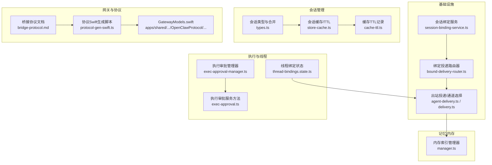
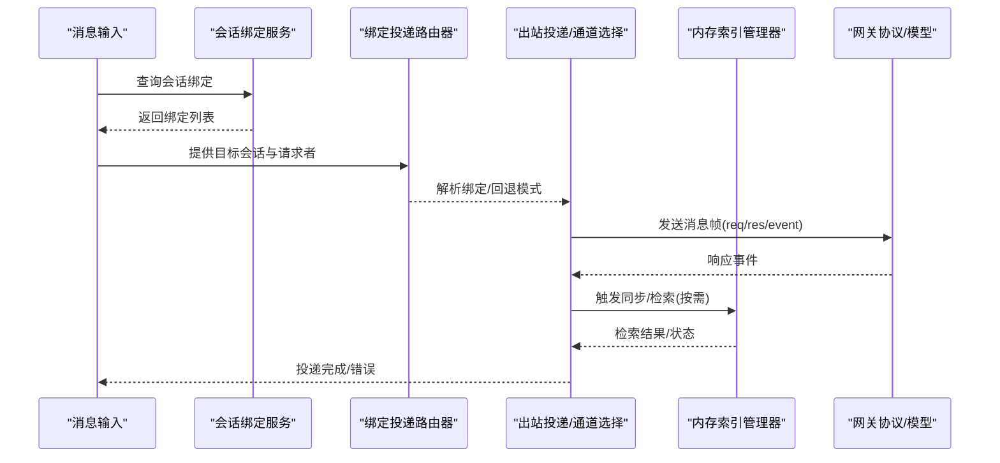
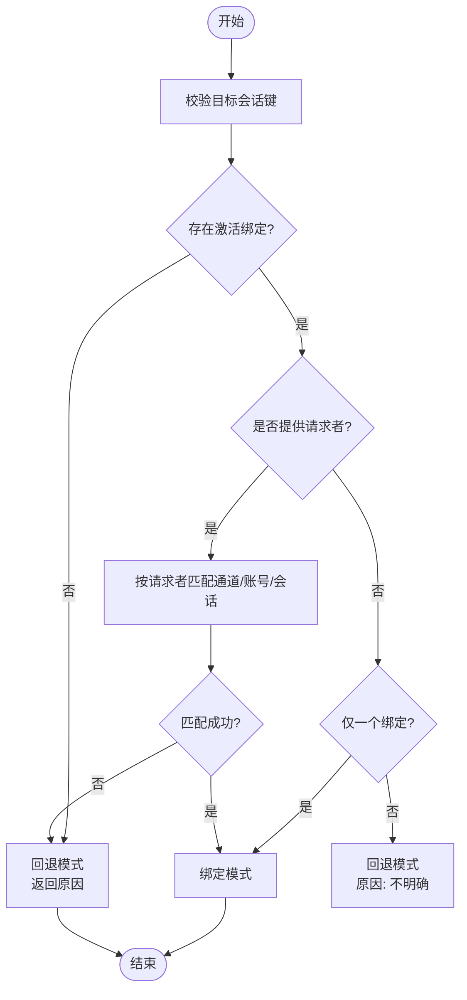
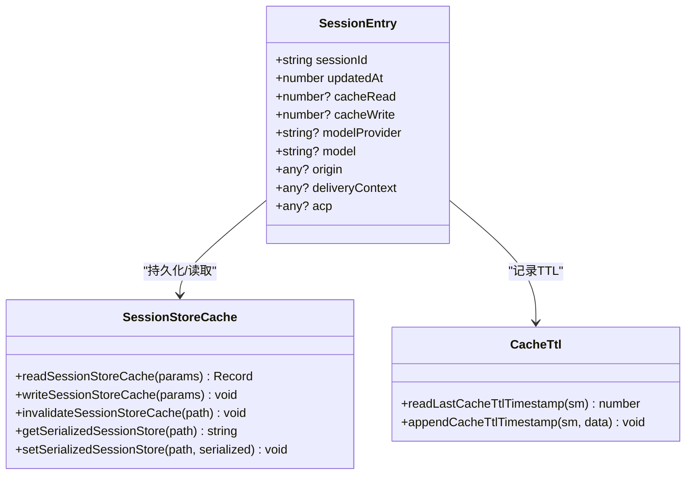
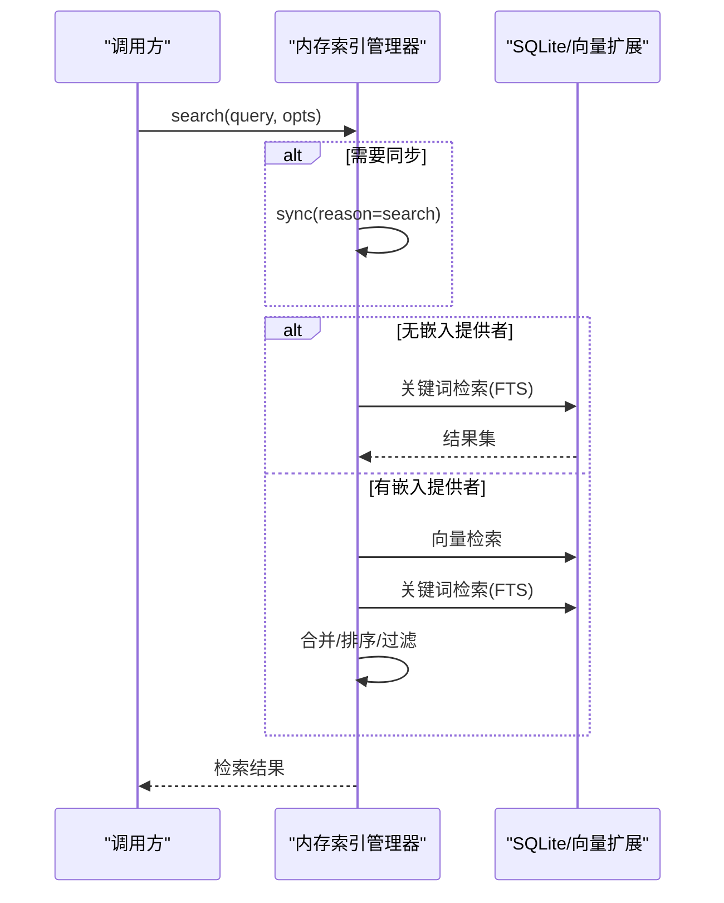
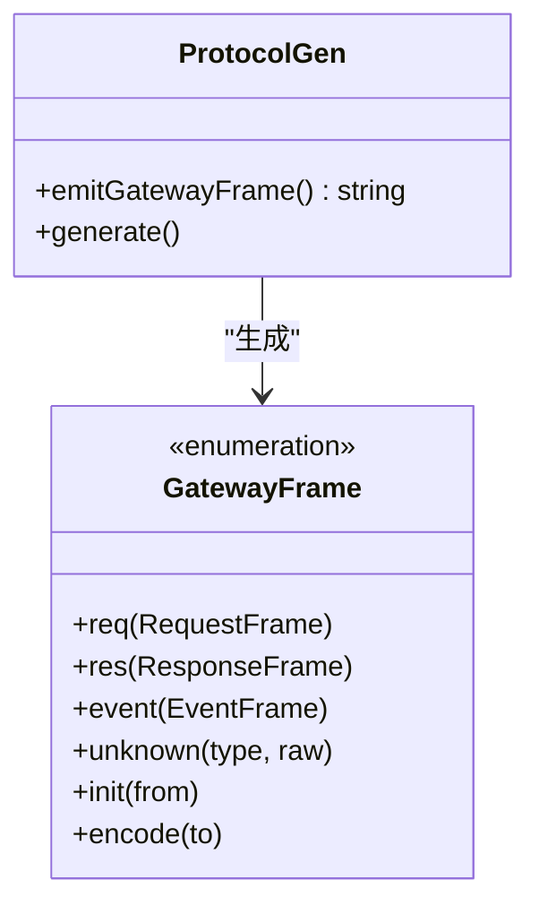
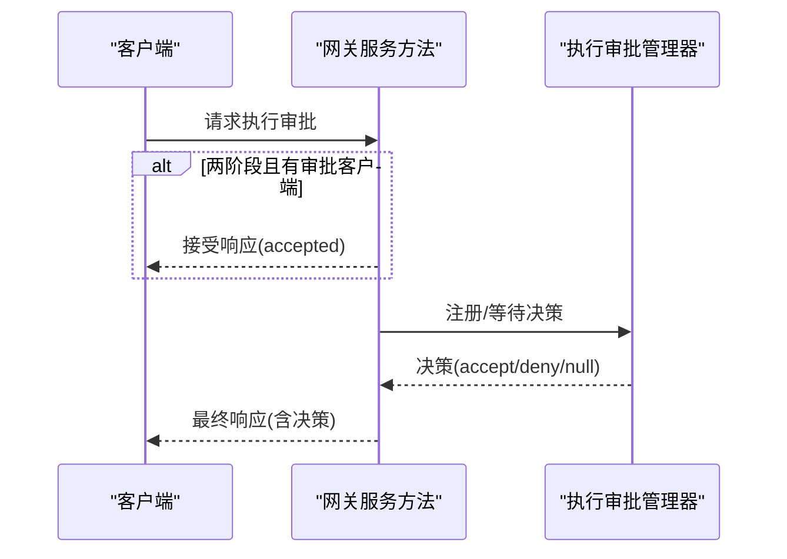
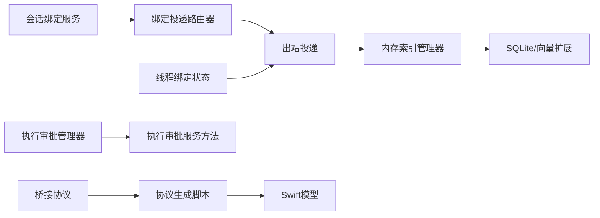

# 数据流设计

<cite>
**本文引用的文件**
- [bound-delivery-router.ts](file://src/infra/outbound/bound-delivery-router.ts)
- [session-binding-service.ts](file://src/infra/outbound/session-binding-service.ts)
- [store-cache.ts](file://src/config/sessions/store-cache.ts)
- [types.ts](file://src/config/sessions/types.ts)
- [manager.ts](file://src/memory/manager.ts)
- [cache-ttl.ts](file://src/agents/pi-embedded-runner/cache-ttl.ts)
- [bridge-protocol.md](file://docs/gateway/bridge-protocol.md)
- [GatewayModels.swift](file://apps/shared/OpenClawKit/Sources/OpenClawProtocol/GatewayModels.swift)
- [GatewayModels.swift](file://apps/macos/Sources/OpenClawProtocol/GatewayModels.swift)
- [protocol-gen-swift.ts](file://scripts/protocol-gen-swift.ts)
- [delivery.ts](file://src/commands/agent/delivery.ts)
- [agent-delivery.ts](file://src/infra/outbound/agent-delivery.ts)
- [agent.ts](file://src/gateway/server-methods/agent.ts)
- [exec-approval-manager.ts](file://src/gateway/exec-approval-manager.ts)
- [exec-approval.ts](file://src/gateway/server-methods/exec-approval.ts)
- [thread-bindings.state.ts](file://src/discord/monitor/thread-bindings.state.ts)
- [run.ts](file://src/agents/pi-embedded-runner/run.ts)
- [security.md](file://docs/cli/security.md)
- [formal-verification.md](file://docs/zh-CN/security/formal-verification.md)
</cite>

## 目录

1. [引言](#引言)
2. [项目结构](#项目结构)
3. [核心组件](#核心组件)
4. [架构总览](#架构总览)
5. [详细组件分析](#详细组件分析)
6. [依赖关系分析](#依赖关系分析)
7. [性能考量](#性能考量)
8. [故障排查指南](#故障排查指南)
9. [结论](#结论)
10. [附录](#附录)

## 引言

本技术文档面向OpenClaw数据流设计，系统阐述消息与会话在系统中的流转路径、转换规则、存储策略与一致性保障。重点覆盖：

- 消息路由与会话绑定机制
- 会话状态管理与持久化
- 内存索引与向量检索的数据通路
- 序列化格式与版本兼容策略
- 并发控制、缓存与只读恢复
- 监控、性能分析与优化建议
- 安全、隐私与合规要点

## 项目结构

OpenClaw采用分层与功能域结合的组织方式：

- 基础设施层：会话绑定服务、出站投递路由、通道插件对接
- 会话管理层：会话条目类型、缓存与TTL、合并策略
- 记忆/内存层：SQLite索引、向量与关键词混合检索、批处理与只读恢复
- 网关与协议：桥接协议、Swift模型生成与编码解码
- 执行审批与线程绑定：执行审批流程、线程绑定超时与生命周期
- CLI与安全：安全审计与敏感信息脱敏

图表来源

- [session-binding-service.ts:1-326](file://src/infra/outbound/session-binding-service.ts#L1-L326)
- [bound-delivery-router.ts:1-132](file://src/infra/outbound/bound-delivery-router.ts#L1-L132)
- [agent-delivery.ts:55-87](file://src/infra/outbound/agent-delivery.ts#L55-L87)
- [delivery.ts:96-117](file://src/commands/agent/delivery.ts#L96-L117)
- [types.ts:68-171](file://src/config/sessions/types.ts#L68-L171)
- [store-cache.ts:1-82](file://src/config/sessions/store-cache.ts#L1-L82)
- [cache-ttl.ts:38-76](file://src/agents/pi-embedded-runner/cache-ttl.ts#L38-L76)
- [manager.ts:1-800](file://src/memory/manager.ts#L1-L800)
- [bridge-protocol.md:88-92](file://docs/gateway/bridge-protocol.md#L88-L92)
- [protocol-gen-swift.ts:158-247](file://scripts/protocol-gen-swift.ts#L158-L247)
- [GatewayModels.swift:3543-3583](file://apps/shared/OpenClawKit/Sources/OpenClawProtocol/GatewayModels.swift#L3543-L3583)
- [exec-approval-manager.ts:94-127](file://src/gateway/exec-approval-manager.ts#L94-L127)
- [exec-approval.ts:193-266](file://src/gateway/server-methods/exec-approval.ts#L193-L266)
- [thread-bindings.state.ts:236-274](file://src/discord/monitor/thread-bindings.state.ts#L236-L274)

章节来源

- [session-binding-service.ts:1-326](file://src/infra/outbound/session-binding-service.ts#L1-L326)
- [bound-delivery-router.ts:1-132](file://src/infra/outbound/bound-delivery-router.ts#L1-L132)
- [agent-delivery.ts:55-87](file://src/infra/outbound/agent-delivery.ts#L55-L87)
- [delivery.ts:96-117](file://src/commands/agent/delivery.ts#L96-L117)
- [types.ts:68-171](file://src/config/sessions/types.ts#L68-L171)
- [store-cache.ts:1-82](file://src/config/sessions/store-cache.ts#L1-L82)
- [cache-ttl.ts:38-76](file://src/agents/pi-embedded-runner/cache-ttl.ts#L38-L76)
- [manager.ts:1-800](file://src/memory/manager.ts#L1-L800)
- [bridge-protocol.md:88-92](file://docs/gateway/bridge-protocol.md#L88-L92)
- [protocol-gen-swift.ts:158-247](file://scripts/protocol-gen-swift.ts#L158-L247)
- [GatewayModels.swift:3543-3583](file://apps/shared/OpenClawKit/Sources/OpenClawProtocol/GatewayModels.swift#L3543-L3583)
- [exec-approval-manager.ts:94-127](file://src/gateway/exec-approval-manager.ts#L94-L127)
- [exec-approval.ts:193-266](file://src/gateway/server-methods/exec-approval.ts#L193-L266)
- [thread-bindings.state.ts:236-274](file://src/discord/monitor/thread-bindings.state.ts#L236-L274)

## 核心组件

- 会话绑定服务：统一抽象不同通道/账号的绑定能力，支持查询、触活、解绑与适配器注册。
- 绑定投递路由器：基于目标会话与请求者上下文解析最佳投递绑定，支持回退模式。
- 出站投递与通道选择：根据内部/外部通道、显式目标与转源通道进行最终投递决策。
- 会话类型与合并策略：定义会话条目字段、运行时模型字段规范化、合并策略与新鲜度判定。
- 会话缓存与TTL：对象缓存与序列化缓存，带时间戳与元信息校验，支持失效与重建。
- 缓存TTL记录：在会话条目中追加/读取缓存TTL时间戳，用于一致性与可观测性。
- 内存索引管理器：SQLite索引、向量/关键词混合检索、批处理、只读数据库恢复、状态统计。
- 网关协议与Swift模型：桥接协议版本策略、动态枚举帧与编解码、跨平台模型生成。

章节来源

- [session-binding-service.ts:70-77](file://src/infra/outbound/session-binding-service.ts#L70-L77)
- [bound-delivery-router.ts:21-23](file://src/infra/outbound/bound-delivery-router.ts#L21-L23)
- [agent-delivery.ts:55-87](file://src/infra/outbound/agent-delivery.ts#L55-L87)
- [delivery.ts:96-117](file://src/commands/agent/delivery.ts#L96-L117)
- [types.ts:68-171](file://src/config/sessions/types.ts#L68-L171)
- [store-cache.ts:41-81](file://src/config/sessions/store-cache.ts#L41-L81)
- [cache-ttl.ts:38-76](file://src/agents/pi-embedded-runner/cache-ttl.ts#L38-L76)
- [manager.ts:61-132](file://src/memory/manager.ts#L61-L132)

## 架构总览

OpenClaw数据流从“消息输入”开始，经“会话绑定解析与路由”，进入“出站投递”，随后可能触发“内存索引同步/检索”，最终通过“网关协议”与“Swift模型”在客户端侧呈现。执行审批与线程绑定贯穿其中，确保并发安全与生命周期管理。

图表来源

- [session-binding-service.ts:262-275](file://src/infra/outbound/session-binding-service.ts#L262-L275)
- [bound-delivery-router.ts:55-131](file://src/infra/outbound/bound-delivery-router.ts#L55-L131)
- [agent-delivery.ts:55-87](file://src/infra/outbound/agent-delivery.ts#L55-L87)
- [delivery.ts:96-117](file://src/commands/agent/delivery.ts#L96-L117)
- [manager.ts:256-364](file://src/memory/manager.ts#L256-L364)
- [GatewayModels.swift:3543-3583](file://apps/shared/OpenClawKit/Sources/OpenClawProtocol/GatewayModels.swift#L3543-L3583)

## 详细组件分析

### 会话绑定与投递路由

- 会话绑定服务提供统一接口，聚合多个适配器，支持按会话列出、按对话解析、触活与解绑。
- 绑定投递路由器根据目标会话键与请求者三元组（通道/账号/会话ID）解析唯一绑定；若不唯一或无请求者，则进入回退模式并返回原因。
- 出站投递阶段，内部通道可被解析为外部通道；显式目标与转源通道（turnSource）参与最终投递目标计算。

图表来源

- [bound-delivery-router.ts:55-131](file://src/infra/outbound/bound-delivery-router.ts#L55-L131)
- [session-binding-service.ts:262-286](file://src/infra/outbound/session-binding-service.ts#L262-L286)

章节来源

- [session-binding-service.ts:70-77](file://src/infra/outbound/session-binding-service.ts#L70-L77)
- [bound-delivery-router.ts:21-23](file://src/infra/outbound/bound-delivery-router.ts#L21-L23)
- [agent-delivery.ts:55-87](file://src/infra/outbound/agent-delivery.ts#L55-L87)
- [delivery.ts:96-117](file://src/commands/agent/delivery.ts#L96-L117)

### 会话状态管理与持久化

- 会话条目类型定义了丰富的运行时字段（令牌用量、缓存读写、队列策略、模型覆盖、ACP元数据等），并提供规范化与合并策略。
- 会话缓存支持对象缓存与序列化缓存，带TTL与mtime/size校验；缓存失效后可重建。
- 缓存TTL记录在会话条目中追加/读取，便于观测与一致性判断。

图表来源

- [types.ts:68-171](file://src/config/sessions/types.ts#L68-L171)
- [store-cache.ts:41-81](file://src/config/sessions/store-cache.ts#L41-L81)
- [cache-ttl.ts:38-76](file://src/agents/pi-embedded-runner/cache-ttl.ts#L38-L76)

章节来源

- [types.ts:68-171](file://src/config/sessions/types.ts#L68-L171)
- [store-cache.ts:1-82](file://src/config/sessions/store-cache.ts#L1-L82)
- [cache-ttl.ts:38-76](file://src/agents/pi-embedded-runner/cache-ttl.ts#L38-L76)

### 内存索引与检索

- 内存索引管理器负责SQLite索引、向量/关键词混合检索、批处理与只读数据库恢复。
- 支持按会话预热、按需同步、状态查询与批处理失败计数与锁定。
- 只读数据库错误检测与自动重连，提升稳定性。

图表来源

- [manager.ts:256-364](file://src/memory/manager.ts#L256-L364)
- [manager.ts:451-499](file://src/memory/manager.ts#L451-L499)

章节来源

- [manager.ts:61-132](file://src/memory/manager.ts#L61-L132)
- [manager.ts:256-364](file://src/memory/manager.ts#L256-L364)
- [manager.ts:451-499](file://src/memory/manager.ts#L451-L499)

### 网关协议与序列化

- 桥接协议当前为隐式v1，期望向后兼容；如需破坏性变更，应添加协议版本字段。
- Swift端通过脚本生成GatewayFrame枚举与编解码逻辑，支持req/res/event与未知类型降级。

图表来源

- [bridge-protocol.md:88-92](file://docs/gateway/bridge-protocol.md#L88-L92)
- [protocol-gen-swift.ts:158-247](file://scripts/protocol-gen-swift.ts#L158-L247)
- [GatewayModels.swift:3543-3583](file://apps/shared/OpenClawKit/Sources/OpenClawProtocol/GatewayModels.swift#L3543-L3583)
- [GatewayModels.swift:3543-3583](file://apps/macos/Sources/OpenClawProtocol/GatewayModels.swift#L3543-L3583)

章节来源

- [bridge-protocol.md:88-92](file://docs/gateway/bridge-protocol.md#L88-L92)
- [protocol-gen-swift.ts:158-247](file://scripts/protocol-gen-swift.ts#L158-L247)
- [GatewayModels.swift:3543-3583](file://apps/shared/OpenClawKit/Sources/OpenClawProtocol/GatewayModels.swift#L3543-L3583)
- [GatewayModels.swift:3543-3583](file://apps/macos/Sources/OpenClawProtocol/GatewayModels.swift#L3543-L3583)

### 执行审批与线程绑定

- 执行审批管理器维护待决记录，支持超时与幂等解析，解析后延时删除以允许在宽限期内的查询。
- 网关服务方法支持两阶段接受响应与最终决策等待，保障单响应语义与后续决策。
- 线程绑定状态解析空闲超时与最大年龄，计算过期时间，避免无限期占用。

图表来源

- [exec-approval-manager.ts:94-127](file://src/gateway/exec-approval-manager.ts#L94-L127)
- [exec-approval.ts:193-266](file://src/gateway/server-methods/exec-approval.ts#L193-L266)

章节来源

- [exec-approval-manager.ts:94-127](file://src/gateway/exec-approval-manager.ts#L94-L127)
- [exec-approval.ts:193-266](file://src/gateway/server-methods/exec-approval.ts#L193-L266)
- [thread-bindings.state.ts:236-274](file://src/discord/monitor/thread-bindings.state.ts#L236-L274)

## 依赖关系分析

- 组件耦合与内聚
  - 会话绑定服务与绑定投递路由器低耦合，通过接口交互；路由器依赖服务提供的绑定列表。
  - 出站投递依赖通道插件与内部/外部通道解析，具备良好扩展性。
  - 内存索引管理器与SQLite/向量扩展强耦合，但通过只读恢复与批处理降低风险。
- 外部依赖与集成点
  - 网关协议与Swift模型生成脚本确保跨平台一致性。
  - 执行审批与线程绑定状态贯穿消息生命周期，保障并发与资源回收。

图表来源

- [session-binding-service.ts:262-286](file://src/infra/outbound/session-binding-service.ts#L262-L286)
- [bound-delivery-router.ts:55-131](file://src/infra/outbound/bound-delivery-router.ts#L55-L131)
- [agent-delivery.ts:55-87](file://src/infra/outbound/agent-delivery.ts#L55-L87)
- [manager.ts:256-364](file://src/memory/manager.ts#L256-L364)
- [bridge-protocol.md:88-92](file://docs/gateway/bridge-protocol.md#L88-L92)
- [protocol-gen-swift.ts:158-247](file://scripts/protocol-gen-swift.ts#L158-L247)
- [GatewayModels.swift:3543-3583](file://apps/shared/OpenClawKit/Sources/OpenClawProtocol/GatewayModels.swift#L3543-L3583)
- [exec-approval-manager.ts:94-127](file://src/gateway/exec-approval-manager.ts#L94-L127)
- [exec-approval.ts:193-266](file://src/gateway/server-methods/exec-approval.ts#L193-L266)
- [thread-bindings.state.ts:236-274](file://src/discord/monitor/thread-bindings.state.ts#L236-L274)

## 性能考量

- 缓存与TTL
  - 会话缓存使用对象缓存与序列化缓存，结合mtime/size校验与TTL，减少重复解析与IO。
  - 内存索引管理器启用批处理与只读恢复，降低写路径阻塞与错误影响。
- 检索策略
  - 向量/关键词混合检索，按候选倍数与权重融合，必要时放宽阈值以保留关键词命中。
- 运行时指标
  - 运行器累积输入/输出/缓存读写/总耗时等指标，用于成本与效率分析。
- 建议
  - 合理设置会话缓存TTL与内存索引批处理参数，平衡延迟与吞吐。
  - 对高并发场景启用只读连接池与超时设置，避免主路径阻塞。

章节来源

- [store-cache.ts:41-81](file://src/config/sessions/store-cache.ts#L41-L81)
- [manager.ts:256-364](file://src/memory/manager.ts#L256-L364)
- [manager.ts:451-499](file://src/memory/manager.ts#L451-L499)
- [run.ts:121-155](file://src/agents/pi-embedded-runner/run.ts#L121-L155)

## 故障排查指南

- 会话绑定问题
  - 目标会话键缺失、无激活绑定、请求者不匹配或不明确都会导致回退模式，需检查绑定服务与路由器输入。
- 内存索引异常
  - 只读数据库错误时，管理器会自动重开连接并重建状态；关注readonly恢复次数与最后错误。
- 执行审批
  - 解析幂等与超时处理，确认宽限期后记录清理；两阶段接受与最终响应需按约定实现。
- 线程绑定
  - 空闲超时与最大年龄计算过期时间，避免资源泄漏；检查活动时间与默认超时配置。

章节来源

- [bound-delivery-router.ts:55-131](file://src/infra/outbound/bound-delivery-router.ts#L55-L131)
- [manager.ts:468-499](file://src/memory/manager.ts#L468-L499)
- [exec-approval-manager.ts:94-127](file://src/gateway/exec-approval-manager.ts#L94-L127)
- [exec-approval.ts:193-266](file://src/gateway/server-methods/exec-approval.ts#L193-L266)
- [thread-bindings.state.ts:236-274](file://src/discord/monitor/thread-bindings.state.ts#L236-L274)

## 结论

OpenClaw通过“会话绑定—投递路由—出站投递—内存检索—网关协议”的闭环，实现了跨通道、多会话、高可用的数据流。配合缓存/TTL、批处理与只读恢复，系统在性能与稳定性之间取得平衡；执行审批与线程绑定进一步强化并发控制与资源管理。建议持续完善监控与告警，结合运行时指标进行容量与性能优化。

## 附录

- 安全与合规
  - 使用CLI安全审计与敏感信息脱敏策略，确保配置与状态文件权限最小化。
  - 形式化验证强调路由隔离、并发上限与幂等性，保障数据一致性与可追溯性。

章节来源

- [security.md:43-72](file://docs/cli/security.md#L43-L72)
- [formal-verification.md:103-138](file://docs/zh-CN/security/formal-verification.md#L103-L138)
