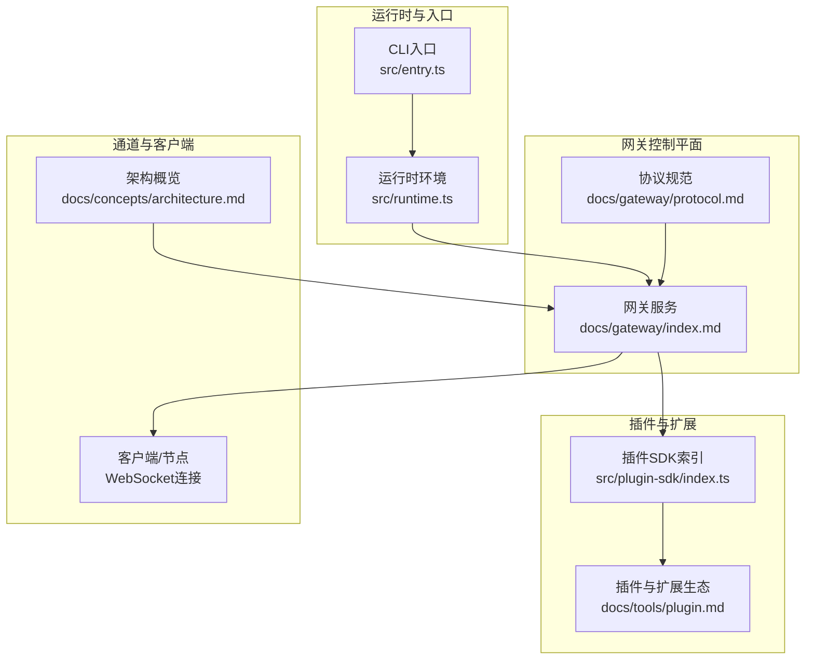
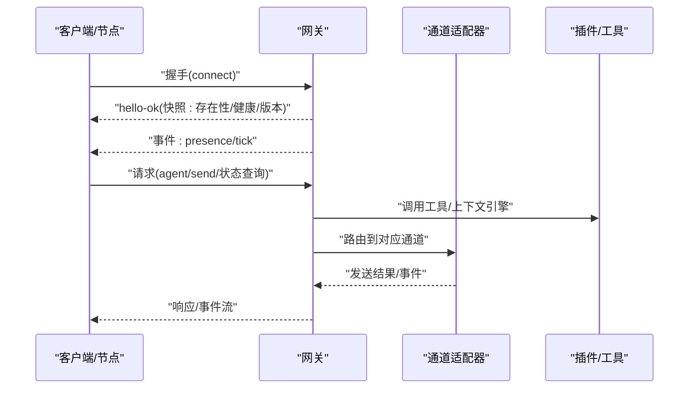
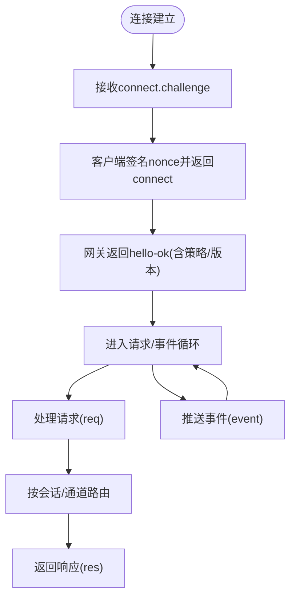
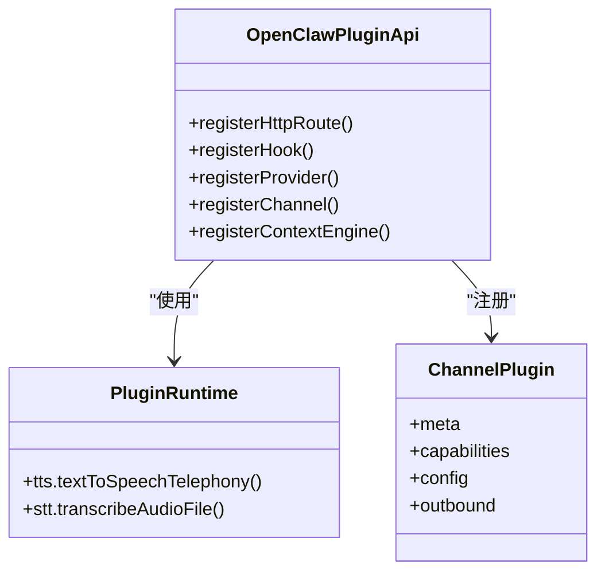
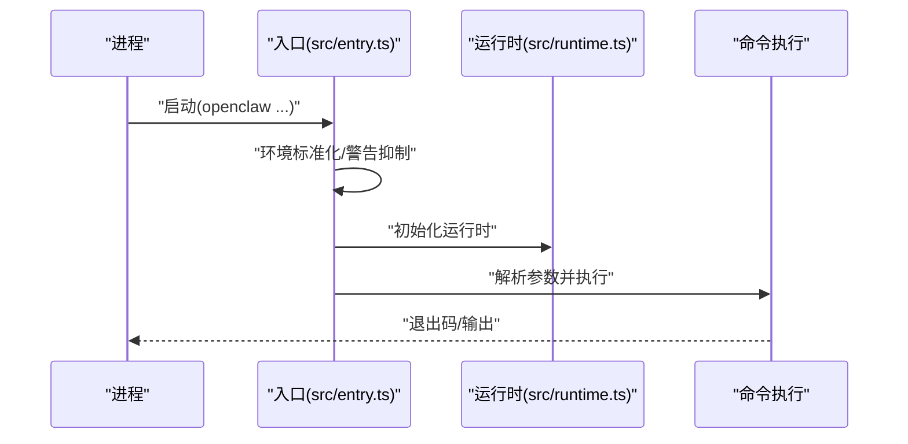
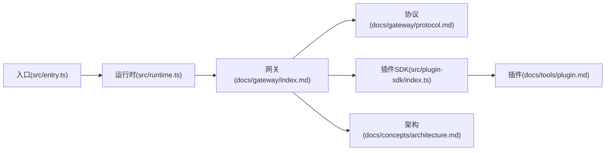

# 架构设计

<cite>
**本文引用的文件**
- [README.md](file://README.md)
- [VISION.md](file://VISION.md)
- [docs/concepts/architecture.md](file://docs/concepts/architecture.md)
- [docs/gateway/index.md](file://docs/gateway/index.md)
- [docs/gateway/protocol.md](file://docs/gateway/protocol.md)
- [docs/tools/plugin.md](file://docs/tools/plugin.md)
- [src/plugin-sdk/index.ts](file://src/plugin-sdk/index.ts)
- [src/entry.ts](file://src/entry.ts)
- [src/runtime.ts](file://src/runtime.ts)
</cite>

## 目录

1. [引言](#引言)
2. [项目结构](#项目结构)
3. [核心组件](#核心组件)
4. [架构总览](#架构总览)
5. [详细组件分析](#详细组件分析)
6. [依赖关系分析](#依赖关系分析)
7. [性能考量](#性能考量)
8. [故障排查指南](#故障排查指南)
9. [结论](#结论)
10. [附录](#附录)

## 引言

本技术文档面向OpenClaw的整体架构设计，聚焦于其“单网关控制平面+多客户端/节点”的WebSocket协议体系、插件化扩展机制、事件驱动与消息路由、以及安全与可观测性等横切关注点。文档旨在帮助开发者与运维人员快速理解系统边界、数据流与组件交互，并提供架构决策的技术背景与权衡。

## 项目结构

OpenClaw采用以“概念/子系统”为主线的模块化组织方式：核心运行时（CLI入口、运行时环境）、网关（WebSocket控制平面）、通道适配器（多聊天渠道）、插件SDK与扩展生态、工具与自动化、配置与安全策略等。下图给出高层结构示意（概念性）：

[此图为概念性结构示意，不直接映射具体源码文件，故无图表来源]

**章节来源**

- [README.md:1-560](file://README.md#L1-L560)
- [VISION.md:1-111](file://VISION.md#L1-L111)

## 核心组件

- 网关（Gateway）
  - 单一长连接控制平面，承载所有消息表面（WhatsApp/Telegram/Slack/Discord/Signal/iMessage/WebChat等），提供类型化WS API（请求/响应/事件推送），并维护会话、存在性、健康状态等。
  - 默认绑定回环地址，支持通过Tailscale或SSH隧道远程访问；默认启用认证。
- 客户端与节点
  - 控制面客户端（macOS应用/CLI/Web UI/自动化）与设备节点（macOS/iOS/Android/headless）均通过WebSocket接入，区分角色与权限范围。
- 插件系统
  - 基于TypeScript模块的在进程扩展，注册Gateway RPC方法、HTTP路由、Agent工具、CLI命令、上下文引擎、自动回复钩子等；支持“槽位”（slot）排他选择（如内存插件）。
- 运行时与入口
  - CLI入口负责环境标准化、实验性警告抑制、配置档解析与启动；运行时提供统一的日志/错误输出与退出语义。

**章节来源**

- [docs/gateway/index.md:1-262](file://docs/gateway/index.md#L1-L262)
- [docs/concepts/architecture.md:1-140](file://docs/concepts/architecture.md#L1-L140)
- [docs/tools/plugin.md:1-963](file://docs/tools/plugin.md#L1-L963)
- [src/entry.ts:1-195](file://src/entry.ts#L1-L195)
- [src/runtime.ts:1-54](file://src/runtime.ts#L1-L54)

## 架构总览

OpenClaw采用“单网关控制平面 + 多客户端/节点”的架构模式，强调本地优先、安全默认与可扩展的插件生态。下图展示典型连接生命周期与消息流：

**图表来源**

- [docs/concepts/architecture.md:59-78](file://docs/concepts/architecture.md#L59-L78)
- [docs/gateway/protocol.md:22-90](file://docs/gateway/protocol.md#L22-L90)

**章节来源**

- [docs/concepts/architecture.md:12-140](file://docs/concepts/architecture.md#L12-L140)
- [docs/gateway/protocol.md:10-268](file://docs/gateway/protocol.md#L10-L268)

## 详细组件分析

### 组件A：网关协议与消息路由

- 协议传输
  - WebSocket文本帧，首帧必须为connect；后续为请求/响应/事件三类帧。
- 握手与鉴权
  - 首先由网关下发connect.challenge，客户端签名后携带设备身份与令牌进行connect；支持设备令牌轮换/撤销。
- 角色与作用域
  - operator（控制面）与node（能力宿主）两类角色；operator具备读写/管理/审批等作用域；node声明能力类别、命令白名单与权限开关。
- 消息路由
  - 基于会话键、通道元数据与路由策略进行入站消息分发；支持群组路由、提及门控、回复标签、分块与路由等。
- 事件与幂等
  - 事件不重放，客户端需在序列断点刷新状态；有副作用方法要求幂等键去重缓存。

**图表来源**

- [docs/gateway/protocol.md:22-90](file://docs/gateway/protocol.md#L22-L90)
- [docs/concepts/architecture.md:135-140](file://docs/concepts/architecture.md#L135-L140)

**章节来源**

- [docs/gateway/protocol.md:10-268](file://docs/gateway/protocol.md#L10-L268)
- [docs/concepts/architecture.md:12-140](file://docs/concepts/architecture.md#L12-L140)

### 组件B：插件系统与扩展机制

- 发现与加载
  - 支持配置路径、工作区扩展、全局扩展与内置扩展四层发现顺序；可通过allow/deny与slots进行信任与排他控制。
- 能力注册
  - 可注册Gateway RPC方法、HTTP路由、Agent工具、CLI命令、上下文引擎、自动回复钩子、模型提供商认证流程等。
- 安全与合规
  - 对非内置扩展进行路径合法性检查与所有权校验；支持安装追踪与缓存窗口调整；严格配置校验与未知项报错。
- 典型场景
  - 新增消息通道（channel plugin）：定义元数据、能力、配置解析、出站发送等；可选注册设置向导、安全策略、状态诊断、提及/线程/流式等适配器。

**图表来源**

- [docs/tools/plugin.md:484-800](file://docs/tools/plugin.md#L484-L800)
- [src/plugin-sdk/index.ts:1-826](file://src/plugin-sdk/index.ts#L1-L826)

**章节来源**

- [docs/tools/plugin.md:1-963](file://docs/tools/plugin.md#L1-L963)
- [src/plugin-sdk/index.ts:1-826](file://src/plugin-sdk/index.ts#L1-L826)

### 组件C：运行时与CLI入口

- CLI入口职责
  - 环境标准化、实验性警告抑制（通过二次spawn）、配置档解析、帮助/版本快速路径、错误处理与退出码。
- 运行时环境
  - 提供统一日志/错误输出与退出封装；测试环境下可切换日志发射策略；支持非退出式运行时用于测试/集成。

**图表来源**

- [src/entry.ts:166-195](file://src/entry.ts#L166-L195)
- [src/runtime.ts:21-54](file://src/runtime.ts#L21-L54)

**章节来源**

- [src/entry.ts:1-195](file://src/entry.ts#L1-L195)
- [src/runtime.ts:1-54](file://src/runtime.ts#L1-L54)

## 依赖关系分析

- 组件耦合
  - 网关对通道适配器与插件生态存在强依赖；通道适配器与路由策略相互协作；插件通过SDK接口与网关解耦。
- 外部依赖
  - WebSocket传输、JSON Schema/TypeBox协议定义、平台权限（macOS TCC）、第三方通道API（各平台SDK）。
- 循环依赖
  - 代码层面通过模块化拆分避免循环导入；插件SDK作为统一抽象层降低上层耦合。

**图表来源**

- [src/entry.ts:1-195](file://src/entry.ts#L1-L195)
- [src/runtime.ts:1-54](file://src/runtime.ts#L1-L54)
- [docs/gateway/index.md:1-262](file://docs/gateway/index.md#L1-L262)
- [docs/gateway/protocol.md:10-268](file://docs/gateway/protocol.md#L10-L268)
- [docs/tools/plugin.md:1-963](file://docs/tools/plugin.md#L1-L963)
- [docs/concepts/architecture.md:1-140](file://docs/concepts/architecture.md#L1-L140)
- [src/plugin-sdk/index.ts:1-826](file://src/plugin-sdk/index.ts#L1-L826)

**章节来源**

- [docs/gateway/index.md:1-262](file://docs/gateway/index.md#L1-L262)
- [docs/tools/plugin.md:1-963](file://docs/tools/plugin.md#L1-L963)

## 性能考量

- 连接与事件
  - 事件不重放，客户端需在断连后刷新状态；建议在客户端侧实现轻量状态机与断点恢复。
- 幂等与去重
  - 有副作用方法使用幂等键与短期去重缓存，减少重复执行开销。
- 插件与HTTP路由
  - 插件HTTP路由需显式声明鉴权级别与匹配规则，避免冲突与重复处理。
- 缓存与发现
  - 插件发现与清单元数据支持短时缓存，可通过环境变量调节缓存窗口，平衡启动延迟与热更新体验。

[本节为通用性能指导，不直接分析具体文件，故无章节来源]

## 故障排查指南

- 健康检查
  - 使用网关健康命令与通道探测命令确认服务就绪；关注端口占用、认证配置与绑定模式。
- 常见问题
  - 非回环绑定未配置认证、端口冲突、配置被限制为远程模式、连接认证不匹配等。
- 诊断流程
  - 通过“症状-命令阶梯”定位问题，结合日志与错误详情码（如设备鉴权迁移相关错误码）进行修复。

**章节来源**

- [docs/gateway/index.md:216-244](file://docs/gateway/index.md#L216-L244)
- [docs/gateway/protocol.md:216-262](file://docs/gateway/protocol.md#L216-L262)

## 结论

OpenClaw以“单网关控制平面+WebSocket协议”为核心，结合严格的设备身份与作用域模型、可插拔的通道与工具生态，实现了本地优先、安全可控且高度可扩展的个人AI助理平台。通过清晰的协议定义、事件驱动的消息路由与完善的插件SDK，系统在功能丰富度与工程可维护性之间取得良好平衡。

[本节为总结性内容，不直接分析具体文件，故无章节来源]

## 附录

- 关键参考
  - 网关运行手册与配置参考：[docs/gateway/index.md](file://docs/gateway/index.md)
  - 协议规范与握手流程：[docs/gateway/protocol.md](file://docs/gateway/protocol.md)
  - 架构概览与组件流：[docs/concepts/architecture.md](file://docs/concepts/architecture.md)
  - 插件开发与扩展机制：[docs/tools/plugin.md](file://docs/tools/plugin.md)
  - 插件SDK导出与工具集：[src/plugin-sdk/index.ts](file://src/plugin-sdk/index.ts)
  - CLI入口与运行时：[src/entry.ts](file://src/entry.ts)、[src/runtime.ts](file://src/runtime.ts)

[本节为附录性内容，不直接分析具体文件，故无章节来源]
