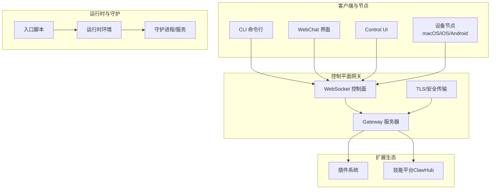
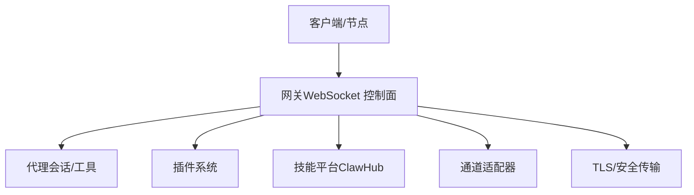
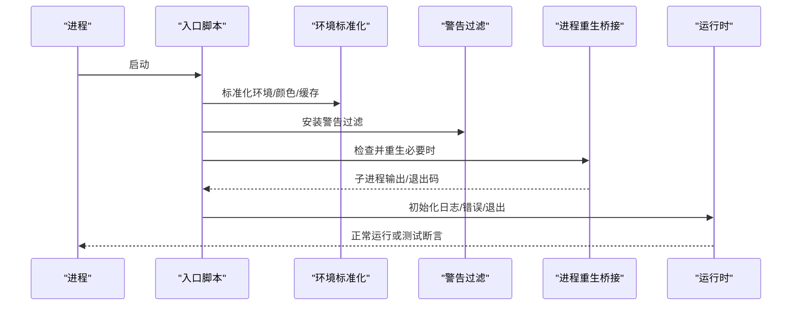
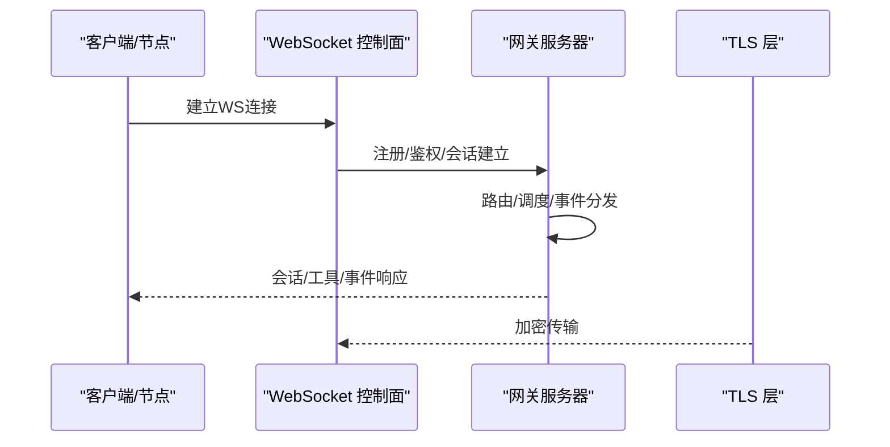
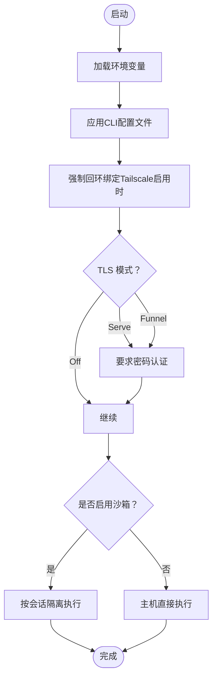
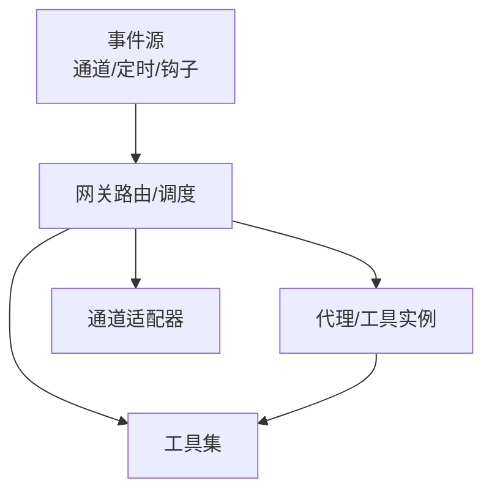
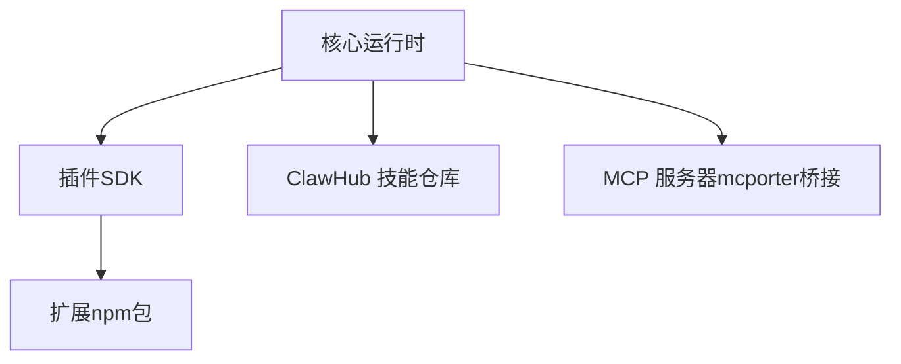
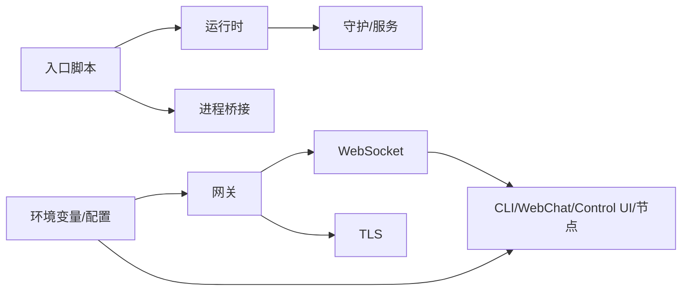

# 系统架构

<cite>
**本文引用的文件**
- [README.md](file://README.md)
- [VISION.md](file://VISION.md)
- [src/entry.ts](file://src/entry.ts)
- [src/runtime.ts](file://src/runtime.ts)
- [src/gateway/server.ts](file://src/gateway/server.ts)
- [src/gateway/server.impl.js](file://src/gateway/server.impl.js)
- [src/gateway/server/close-reason.js](file://src/gateway/server/close-reason.js)
- [src/infra/ws.ts](file://src/infra/ws.ts)
- [src/infra/env.js](file://src/infra/env.js)
- [src/cli/run-main.js](file://src/cli/run-main.js)
- [src/cli/program.js](file://src/cli/program.js)
- [src/version.js](file://src/version.js)
- [src/infra/git-commit.js](file://src/infra/git-commit.js)
- [src/process/child-process-bridge.js](file://src/process/child-process-bridge.js)
- [src/infra/openclaw-exec-env.js](file://src/infra/openclaw-exec-env.js)
- [src/infra/warning-filter.js](file://src/infra/warning-filter.js)
- [src/infra/is-main.js](file://src/infra/is-main.js)
- [src/cli/argv.js](file://src/cli/argv.js)
- [src/cli/profile.js](file://src/cli/profile.js)
- [src/cli/respawn-policy.js](file://src/cli/respawn-policy.js)
- [src/cli/windows-argv.js](file://src/cli/windows-argv.js)
- [src/infra/tls/gateway.ts](file://src/infra/tls/gateway.ts)
- [src/agents/tools/gateway.ts](file://src/agents/tools/gateway.ts)
- [src/commands/status-all/gateway.ts](file://src/commands/status-all/gateway.ts)
- [src/infra/tls/gateway.ts](file://src/infra/tls/gateway.ts)
- [src/infra/ws.ts](file://src/infra/ws.ts)
- [src/web/index.ts](file://src/web/index.ts)
- [src/web/ws.ts](file://src/web/ws.ts)
- [src/web/control-ui.ts](file://src/web/control-ui.ts)
- [src/web/dashboard.ts](file://src/web/dashboard.ts)
- [src/web/webchat.ts](file://src/web/webchat.ts)
- [src/web/channel-web.ts](file://src/channel-web.ts)
- [src/web/webchat.ts](file://src/web/webchat.ts)
- [src/web/index.ts](file://src/web/index.ts)
- [src/web/ws.ts](file://src/web/ws.ts)
- [src/web/control-ui.ts](file://src/web/control-ui.ts)
- [src/web/dashboard.ts](file://src/web/dashboard.ts)
- [src/web/webchat.ts](file://src/web/webchat.ts)
- [src/web/channel-web.ts](file://src/channel-web.ts)
- [src/web/webchat.ts](file://src/web/webchat.ts)
- [src/web/index.ts](file://src/web/index.ts)
- [src/web/ws.ts](file://src/web/ws.ts)
- [src/web/control-ui.ts](file://src/web/control-ui.ts)
- [src/web/dashboard.ts](file://src/web/dashboard.ts)
- [src/web/webchat.ts](file://src/web/webchat.ts)
- [src/web/channel-web.ts](file://src/channel-web.ts)
- [src/web/webchat.ts](file://src/web/webchat.ts)
- [src/web/index.ts](file://src/web/index.ts)
- [src/web/ws.ts](file://src/web/ws.ts)
- [src/web/control-ui.ts](file://src/web/control-ui.ts)
- [src/web/dashboard.ts](file://src/web/dashboard.ts)
- [src/web/webchat.ts](file://src/web/webchat.ts)
- [src/web/channel-web.ts](file://src/channel-web.ts)
- [src/web/webchat.ts](file://src/web/webchat.ts)
- [src/web/index.ts](file://src/web/index.ts)
- [src/web/ws.ts](file://src/web/ws.ts)
- [src/web/control-ui.ts](file://src/web/control-ui.ts)
- [src/web/dashboard.ts](file://src/web/dashboard.ts)
- [src/web/webchat.ts](file://src/web/webchat.ts)
- [src/web/channel-web.ts](file://src/channel-web.ts)
- [src/web/webchat.ts](file://src/web/webchat.ts)
- [src/web/index.ts](file://src/web/index.ts)
- [src/web/ws.ts](file://src/web/ws.ts)
- [src/web/control-ui.ts](file://src/web/control-ui.ts)
- [src/web/dashboard.ts](file://src/web/dashboard.ts)
- [src/web/webchat.ts](file://src/web/webchat.ts)
- [src/web/channel-web.ts](file://src/channel-web.ts)
- [src/web/webchat.ts](file://src/web/webchat.ts)
- [src/web/index.ts](file://src/web/index.ts)
- [src/web/ws.ts](file://src/web/ws.ts)
- [src/web/control-ui.ts](file://src/web/control-ui.ts)
- [src/web/dashboard.ts](file://src/web/dashboard.ts)
- [src/web/webchat.ts](file://src/web/webchat.ts)
- [src/web/channel-web.ts](file://src/channel......)
</cite>

## 目录

1. [引言](#引言)
2. [项目结构](#项目结构)
3. [核心组件](#核心组件)
4. [架构总览](#架构总览)
5. [详细组件分析](#详细组件分析)
6. [依赖关系分析](#依赖关系分析)
7. [性能考量](#性能考量)
8. [故障排查指南](#故障排查指南)
9. [结论](#结论)
10. [附录](#附录)

## 引言

本文件面向OpenClaw系统架构，聚焦于其控制平面（网关）与多客户端交互模型、运行时环境初始化、配置管理、进程与守护机制、微服务与事件驱动设计、以及插件化扩展机制。文档旨在帮助开发者与运维人员快速理解系统边界、数据流与关键依赖，并提供架构决策的技术背景、权衡与约束。

## 项目结构

OpenClaw采用以“控制平面（网关）+ 多客户端/节点 + 插件生态”为核心的分层架构：

- 控制平面：通过WebSocket提供统一的控制面，承载会话、通道路由、工具调用、事件与运维界面。
- 客户端与节点：CLI、WebChat、Control UI、macOS/iOS/Android节点通过WS连接网关；设备节点负责本地能力（如系统命令、相机、屏幕录制等）。
- 插件与技能：通过插件SDK与技能平台（ClawHub）扩展能力，保持核心轻量化。
- 运行时与守护：入口脚本负责环境标准化、实验性警告抑制、进程重生与守护策略；运行时封装日志与退出行为。

图表来源

- [src/entry.ts:1-195](file://src/entry.ts#L1-L195)
- [src/runtime.ts:1-54](file://src/runtime.ts#L1-L54)
- [src/gateway/server.ts:1-4](file://src/gateway/server.ts#L1-L4)
- [src/infra/ws.ts:1-200](file://src/infra/ws.ts#L1-L200)
- [src/infra/tls/gateway.ts:1-200](file://src/infra/tls/gateway.ts#L1-L200)

章节来源

- [README.md:185-238](file://README.md#L185-L238)
- [src/entry.ts:1-195](file://src/entry.ts#L1-L195)
- [src/runtime.ts:1-54](file://src/runtime.ts#L1-L54)
- [src/gateway/server.ts:1-4](file://src/gateway/server.ts#L1-L4)
- [src/infra/ws.ts:1-200](file://src/infra/ws.ts#L1-L200)
- [src/infra/tls/gateway.ts:1-200](file://src/infra/tls/gateway.ts#L1-L200)

## 核心组件

- 入口与守护
  - 入口脚本负责环境标准化、实验性警告抑制、参数解析与快速路径（版本/帮助）、进程重生桥接与守护标记。
  - 运行时封装日志输出、错误输出与退出行为，支持非退出式运行时用于测试。
- 网关服务器
  - 对外暴露WebSocket控制面，承载会话、通道、工具、事件与运维接口；提供TLS安全传输与关闭原因裁剪。
- 客户端与界面
  - CLI、WebChat、Control UI通过WebSocket与网关交互；通道适配器负责多渠道消息接入。
- 插件与技能
  - 插件SDK提供扩展点；技能平台（ClawHub）提供可发现、可安装的技能生态。
- 配置与安全
  - 环境变量与配置文件双轨；默认安全策略与沙箱隔离；远程访问可通过Tailscale Serve/Funnel或SSH隧道。

章节来源

- [src/entry.ts:1-195](file://src/entry.ts#L1-L195)
- [src/runtime.ts:1-54](file://src/runtime.ts#L1-L54)
- [src/gateway/server.ts:1-4](file://src/gateway/server.ts#L1-L4)
- [src/gateway/server.impl.js:1-200](file://src/gateway/server.impl.js#L1-L200)
- [src/gateway/server/close-reason.js:1-200](file://src/gateway/server/close-reason.js#L1-L200)
- [src/infra/ws.ts:1-200](file://src/infra/ws.ts#L1-L200)
- [src/infra/tls/gateway.ts:1-200](file://src/infra/tls/gateway.ts#L1-L200)

## 架构总览

OpenClaw的控制平面采用“单网关 + 多客户端”的微服务/事件驱动架构：

- 单一WS控制面：集中处理会话、通道、工具、事件与运维界面。
- 事件驱动：通道消息、定时任务、钩子触发等事件经由网关路由到对应代理/工具。
- 插件化：核心保持精简，能力通过插件与技能扩展。
- 安全与远程：默认安全策略、沙箱隔离；远程访问通过Tailscale或SSH隧道。

图表来源

- [README.md:185-238](file://README.md#L185-L238)
- [src/gateway/server.ts:1-4](file://src/gateway/server.ts#L1-L4)
- [src/infra/ws.ts:1-200](file://src/infra/ws.ts#L1-L200)
- [src/infra/tls/gateway.ts:1-200](file://src/infra/tls/gateway.ts#L1-L200)

## 详细组件分析

### 组件A：运行时环境初始化与守护

- 初始化流程
  - 入口脚本设置进程标题、注入执行标记、安装警告过滤、标准化环境变量。
  - 启用模块编译缓存（尽力而为），处理颜色与实验性警告抑制。
  - 解析CLI配置文件、应用配置环境、处理版本/帮助快速路径。
  - 通过进程重生桥接确保子进程与父进程的输出与退出码正确传递。
- 运行时封装
  - 日志与错误输出在进度线清理后输出，避免终端状态混乱。
  - 提供非退出式运行时用于测试场景，便于断言与模拟。

图表来源

- [src/entry.ts:1-195](file://src/entry.ts#L1-L195)
- [src/process/child-process-bridge.js:1-200](file://src/process/child-process-bridge.js#L1-L200)
- [src/runtime.ts:1-54](file://src/runtime.ts#L1-L54)

章节来源

- [src/entry.ts:1-195](file://src/entry.ts#L1-L195)
- [src/runtime.ts:1-54](file://src/runtime.ts#L1-L54)
- [src/infra/env.js:1-200](file://src/infra/env.js#L1-L200)
- [src/infra/warning-filter.js:1-200](file://src/infra/warning-filter.js#L1-L200)
- [src/infra/openclaw-exec-env.js:1-200](file://src/infra/openclaw-exec-env.js#L1-L200)

### 组件B：网关服务器与WebSocket控制面

- 网关启动与导出
  - 通过实现文件启动服务器，导出类型与重置方法；关闭原因进行裁剪以减少噪声。
- 控制面职责
  - 会话管理、通道路由、工具调用、事件分发、运维界面（Control UI/WebChat/Dashboard）。
- 安全传输
  - TLS封装，结合远程访问策略（Tailscale Serve/Funnel/SSH隧道）。

图表来源

- [src/gateway/server.ts:1-4](file://src/gateway/server.ts#L1-L4)
- [src/gateway/server.impl.js:1-200](file://src/gateway/server.impl.js#L1-L200)
- [src/gateway/server/close-reason.js:1-200](file://src/gateway/server/close-reason.js#L1-L200)
- [src/infra/ws.ts:1-200](file://src/infra/ws.ts#L1-L200)
- [src/infra/tls/gateway.ts:1-200](file://src/infra/tls/gateway.ts#L1-L200)

章节来源

- [src/gateway/server.ts:1-4](file://src/gateway/server.ts#L1-L4)
- [src/gateway/server.impl.js:1-200](file://src/gateway/server.impl.js#L1-L200)
- [src/gateway/server/close-reason.js:1-200](file://src/gateway/server/close-reason.js#L1-L200)
- [src/infra/ws.ts:1-200](file://src/infra/ws.ts#L1-L200)
- [src/infra/tls/gateway.ts:1-200](file://src/infra/tls/gateway.ts#L1-L200)

### 组件C：配置管理系统与安全策略

- 配置来源
  - 环境变量优先于配置文件；CLI配置文件解析与应用。
- 安全策略
  - 默认安全策略与沙箱隔离；远程访问需显式授权与密码保护（Tailscale Funnel）。
- 远程访问
  - 支持Tailscale Serve/Funnel与SSH隧道；强制绑定回环地址以提升安全性。

图表来源

- [README.md:213-238](file://README.md#L213-L238)
- [src/cli/profile.js:1-200](file://src/cli/profile.js#L1-L200)
- [src/infra/env.js:1-200](file://src/infra/env.js#L1-L200)

章节来源

- [README.md:213-238](file://README.md#L213-L238)
- [src/cli/profile.js:1-200](file://src/cli/profile.js#L1-L200)
- [src/infra/env.js:1-200](file://src/infra/env.js#L1-L200)

### 组件D：微服务与事件驱动设计

- 微服务拆分
  - 网关作为单一控制平面，代理/工具/通道适配器作为独立服务单元。
- 事件驱动
  - 通道消息、定时任务、钩子触发等事件经由网关路由至对应代理/工具，实现松耦合与可扩展。

图表来源

- [README.md:185-238](file://README.md#L185-L238)
- [src/gateway/server.ts:1-4](file://src/gateway/server.ts#L1-L4)

章节来源

- [README.md:185-238](file://README.md#L185-L238)
- [src/gateway/server.ts:1-4](file://src/gateway/server.ts#L1-L4)

### 组件E：插件化扩展机制

- 插件SDK
  - 提供统一扩展点，插件以npm包形式分发，开发时支持本地扩展加载。
- 技能平台（ClawHub）
  - 技能可先发布到ClawHub，再按需安装，避免核心臃肿。
- MCP支持
  - 通过mcporter桥接MCP服务器，保持核心稳定与灵活性。

图表来源

- [VISION.md:52-83](file://VISION.md#L52-L83)
- [README.md:185-238](file://README.md#L185-L238)

章节来源

- [VISION.md:52-83](file://VISION.md#L52-L83)
- [README.md:185-238](file://README.md#L185-L238)

## 依赖关系分析

- 入口脚本对运行时与守护的依赖
  - 入口脚本依赖运行时的日志/错误/退出封装；通过进程桥接确保父子进程一致行为。
- 网关对传输与安全的依赖
  - 网关依赖WebSocket与TLS；关闭原因裁剪降低噪音。
- 客户端/界面与网关的依赖
  - CLI、WebChat、Control UI均通过WebSocket与网关交互。
- 配置与安全策略的依赖
  - 环境变量与配置文件共同决定行为；远程访问策略与绑定策略强相关。

图表来源

- [src/entry.ts:1-195](file://src/entry.ts#L1-L195)
- [src/runtime.ts:1-54](file://src/runtime.ts#L1-L54)
- [src/gateway/server.ts:1-4](file://src/gateway/server.ts#L1-L4)
- [src/infra/ws.ts:1-200](file://src/infra/ws.ts#L1-L200)
- [src/infra/tls/gateway.ts:1-200](file://src/infra/tls/gateway.ts#L1-L200)

章节来源

- [src/entry.ts:1-195](file://src/entry.ts#L1-L195)
- [src/runtime.ts:1-54](file://src/runtime.ts#L1-L54)
- [src/gateway/server.ts:1-4](file://src/gateway/server.ts#L1-L4)
- [src/infra/ws.ts:1-200](file://src/infra/ws.ts#L1-L200)
- [src/infra/tls/gateway.ts:1-200](file://src/infra/tls/gateway.ts#L1-L200)

## 性能考量

- 启动与冷启动
  - 启用模块编译缓存以加速启动；快速路径（版本/帮助）减少不必要的初始化。
- 传输与并发
  - WebSocket单控制面承载多客户端，注意消息分片与背压处理；TLS加密带来额外CPU开销但保证安全。
- 执行隔离
  - 沙箱隔离可降低风险但增加上下文切换成本；按需启用以平衡安全与性能。
- 远程访问
  - Tailscale Serve/Funnel与SSH隧道的延迟与带宽取决于网络质量；建议在高并发场景下评估带宽与延迟。

## 故障排查指南

- 版本/帮助快速路径
  - 入口脚本提供版本与帮助的快速路径，便于快速诊断与展示信息。
- 实验性警告抑制
  - 自动抑制实验性警告，避免干扰用户；若已禁用则不重复抑制。
- 进程重生与桥接
  - 若因警告策略导致进程重生，确保子进程输出与退出码正确传递。
- 关闭原因裁剪
  - 网关关闭原因被裁剪，减少噪音；定位问题时可查看完整日志。

章节来源

- [src/entry.ts:128-164](file://src/entry.ts#L128-L164)
- [src/entry.ts:80-126](file://src/entry.ts#L80-L126)
- [src/process/child-process-bridge.js:1-200](file://src/process/child-process-bridge.js#L1-L200)
- [src/gateway/server/close-reason.js:1-200](file://src/gateway/server/close-reason.js#L1-L200)

## 结论

OpenClaw以“单网关 + 多客户端”的微服务/事件驱动架构为核心，通过严格的默认安全策略、可选沙箱隔离与灵活的远程访问方式，实现了本地优先、隐私友好的个人AI助手。插件化与技能平台进一步降低了核心复杂度，提升了可扩展性与可维护性。运行时与守护机制确保了启动效率与可观测性，适合在多平台与多客户端环境中稳定运行。

## 附录

- 系统边界
  - 控制平面：网关WS控制面、会话/通道/工具/事件、运维界面。
  - 客户端/节点：CLI、WebChat、Control UI、macOS/iOS/Android节点。
  - 扩展生态：插件SDK、ClawHub技能、MCP桥接。
- 数据流向
  - 客户端/节点 → WebSocket → 网关 → 代理/工具/通道 → 外部服务。
- 基础设施需求
  - Node ≥22；可选Docker（沙箱）；可选Tailscale/SSH隧道；可选浏览器控制（Chrome/Chromium）。
- 可扩展性与部署拓扑
  - 网关可部署在小型Linux实例上，客户端通过Tailscale Serve/Funnel或SSH隧道连接；设备节点就近执行本地动作。
- 横切关注点
  - 安全：默认安全策略、沙箱隔离、TLS传输、远程访问密码保护。
  - 监控：版本/帮助快速路径、日志输出、关闭原因裁剪。
  - 灾难恢复：守护进程/服务、进程重生桥接、远程访问策略。

章节来源

- [README.md:213-238](file://README.md#L213-L238)
- [VISION.md:52-83](file://VISION.md#L52-L83)
- [src/entry.ts:1-195](file://src/entry.ts#L1-L195)
- [src/runtime.ts:1-54](file://src/runtime.ts#L1-L54)
- [src/gateway/server.ts:1-4](file://src/gateway/server.ts#L1-L4)
- [src/infra/ws.ts:1-200](file://src/infra/ws.ts#L1-L200)
- [src/infra/tls/gateway.ts:1-200](file://src/infra/tls/gateway.ts#L1-L200)
