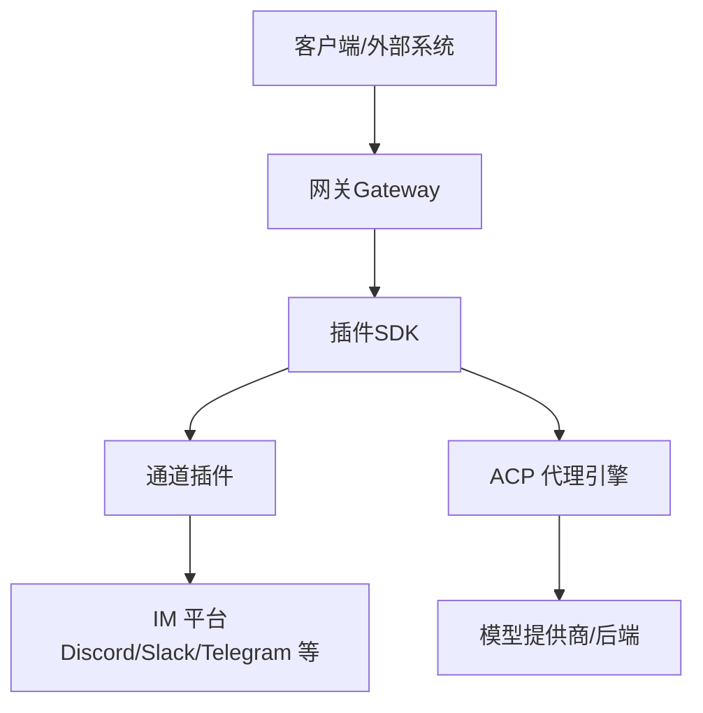
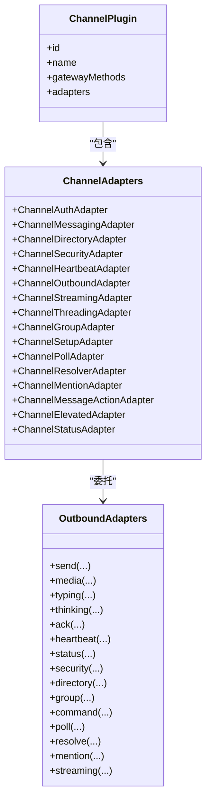
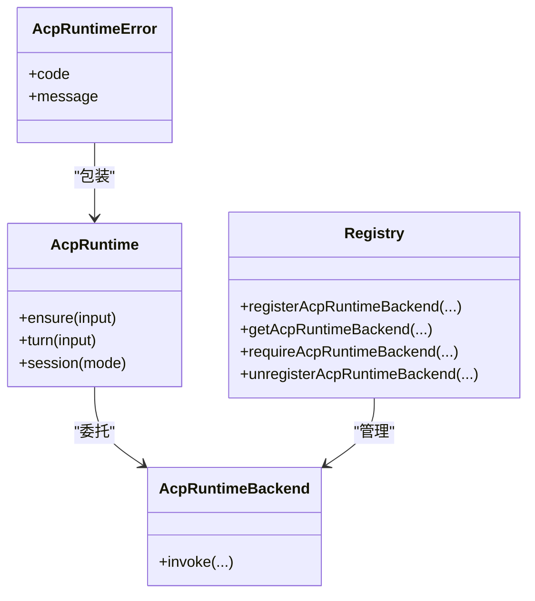
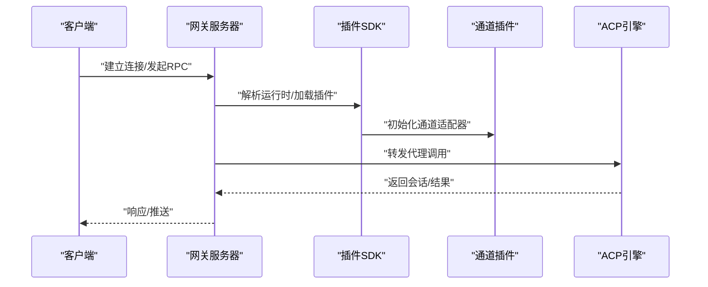
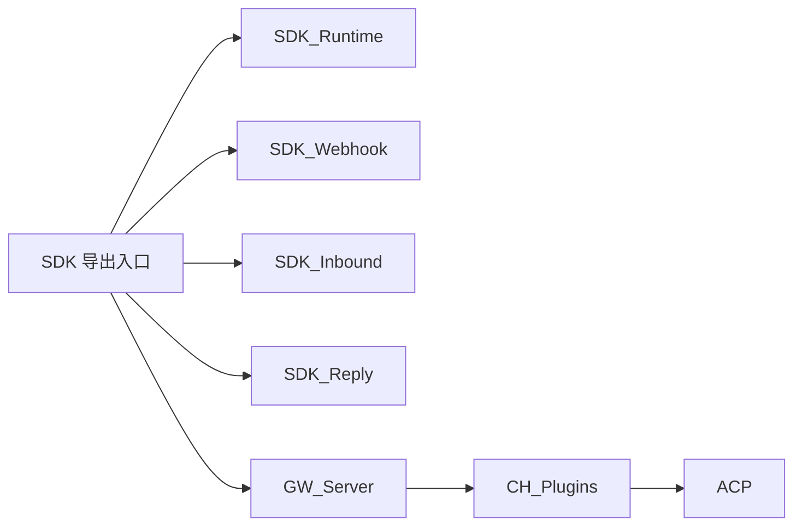
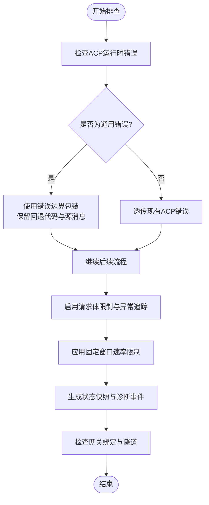

# 组件设计

<cite>
**本文引用的文件**
- [src/plugin-sdk/index.ts](file://src/plugin-sdk/index.ts)
- [src/plugin-sdk/runtime.ts](file://src/plugin-sdk/runtime.ts)
- [src/plugin-sdk/runtime-store.ts](file://src/plugin-sdk/runtime-store.ts)
- [src/plugin-sdk/webhook-targets.ts](file://src/plugin-sdk/webhook-targets.ts)
- [src/plugin-sdk/webhook-request-guards.ts](file://src/plugin-sdk/webhook-request-guards.ts)
- [src/plugin-sdk/keyed-async-queue.ts](file://src/plugin-sdk/keyed-async-queue.ts)
- [src/plugin-sdk/channel-lifecycle.ts](file://src/plugin-sdk/channel-lifecycle.ts)
- [src/plugin-sdk/status-helpers.ts](file://src/plugin-sdk/status-helpers.ts)
- [src/plugin-sdk/inbound-envelope.ts](file://src/plugin-sdk/inbound-envelope.ts)
- [src/plugin-sdk/inbound-reply-dispatch.ts](file://src/plugin-sdk/inbound-reply-dispatch.ts)
- [src/plugin-sdk/reply-payload.ts](file://src/plugin-sdk/reply-payload.ts)
- [src/plugin-sdk/outbound-media.ts](file://src/plugin-sdk/outbound-media.ts)
- [src/plugin-sdk/windows-spawn.ts](file://src/plugin-sdk/windows-spawn.ts)
- [src/plugin-sdk/webhook-memory-guards.ts](file://src/plugin-sdk/webhook-memory-guards.ts)
- [src/plugin-sdk/fetch-auth.ts](file://src/plugin-sdk/fetch-auth.ts)
- [src/plugin-sdk/ssrf-policy.ts](file://src/plugin-sdk/ssrf-policy.ts)
- [src/plugin-sdk/run-command.ts](file://src/plugin-sdk/run-command.ts)
- [src/plugin-sdk/shared/gateway-bind-url.ts](file://src/plugin-sdk/shared/gateway-bind-url.ts)
- [src/plugin-sdk/shared/tailscale-status.ts](file://src/plugin-sdk/shared/tailscale-status.ts)
- [src/gateway/server.impl.ts](file://src/gateway/server.impl.ts)
- [src/gateway/server.agent.gateway-server-agent-a.test.ts](file://src/gateway/server.agent.gateway-server-agent-a.test.ts)
- [src/acp/runtime/types.ts](file://src/acp/runtime/types.ts)
- [src/acp/runtime/registry.ts](file://src/acp/runtime/registry.ts)
- [src/acp/runtime/errors.ts](file://src/acp/runtime/errors.ts)
- [src/acp/runtime/errors.test.ts](file://src/acp/runtime/errors.test.ts)
- [src/channels/plugins/types.ts](file://src/channels/plugins/types.ts)
- [src/channels/plugins/types.plugin.ts](file://src/channels/plugins/types.plugin.ts)
- [src/channels/plugins/load.ts](file://src/channels/plugins/load.ts)
- [src/channels/plugins/registry-loader.ts](file://src/channels/plugins/registry-loader.ts)
- [src/channels/plugins/config-schema.ts](file://src/channels/plugins/config-schema.ts)
- [src/channels/plugins/message-actions.ts](file://src/channels/plugins/message-actions.ts)
- [src/channels/plugins/outbound/index.ts](file://src/channels/plugins/outbound/index.ts)
- [src/channels/plugins/outbound/normalize.ts](file://src/channels/plugins/outbound/normalize.ts)
- [src/channels/plugins/outbound/targets.ts](file://src/channels/plugins/outbound/targets.ts)
- [src/channels/plugins/outbound/media.ts](file://src/channels/plugins/outbound/media.ts)
- [src/channels/plugins/outbound/thinking.ts](file://src/channels/plugins/outbound/thinking.ts)
- [src/channels/plugins/outbound/typing.ts](file://src/channels/plugins/outbound/typing.ts)
- [src/channels/plugins/outbound/ack.ts](file://src/channels/plugins/outbound/ack.ts)
- [src/channels/plugins/outbound/heartbeat.ts](file://src/channels/plugins/outbound/heartbeat.ts)
- [src/channels/plugins/outbound/status.ts](file://src/channels/plugins/outbound/status.ts)
- [src/channels/plugins/outbound/security.ts](file://src/channels/plugins/outbound/security.ts)
- [src/channels/plugins/outbound/directory.ts](file://src/channels/plugins/outbound/directory.ts)
- [src/channels/plugins/outbound/group.ts](file://src/channels/plugins/outbound/group.ts)
- [src/channels/plugins/outbound/command.ts](file://src/channels/plugins/outbound/command.ts)
- [src/channels/plugins/outbound/poll.ts](file://src/channels/plugins/outbound/poll.ts)
- [src/channels/plugins/outbound/resolve.ts](file://src/channels/plugins/outbound/resolve.ts)
- [src/channels/plugins/outbound/mention.ts](file://src/channels/plugins/outbound/mention.ts)
- [src/channels/plugins/outbound/streaming.ts](file://src/channels/plugins/outbound/streaming.ts)
- [src/channels/plugins/outbound/thinking.ts](file://src/channels/plugins/outbound/thinking.ts)
- [src/channels/plugins/outbound/typing.ts](file://src/channels/plugins/outbound/typing.ts)
- [src/channels/plugins/outbound/ack.ts](file://src/channels/plugins/outbound/ack.ts)
- [src/channels/plugins/outbound/heartbeat.ts](file://src/channels/plugins/outbound/heartbeat.ts)
- [src/channels/plugins/outbound/status.ts](file://src/channels/plugins/outbound/status.ts)
- [src/channels/plugins/outbound/security.ts](file://src/channels/plugins/outbound/security.ts)
- [src/channels/plugins/outbound/directory.ts](file://src/channels/plugins/outbound/directory.ts)
- [src/channels/plugins/outbound/group.ts](file://src/channels/plugins/outbound/group.ts)
- [src/channels/plugins/outbound/command.ts](file://src/channels/plugins/outbound/command.ts)
- [src/channels/plugins/outbound/poll.ts](file://src/channels/plugins/outbound/poll.ts)
- [src/channels/plugins/outbound/resolve.ts](file://src/channels/plugins/outbound/resolve.ts)
- [src/channels/plugins/outbound/mention.ts](file://src/channels/plugins/outbound/mention.ts)
- [src/channels/plugins/outbound/streaming.ts](file://src/channels/plugins/outbound/streaming.ts)
- [src/channels/plugins/outbound/thinking.ts](file://src/channels/plugins/outbound/thinking.ts)
- [src/channels/plugins/outbound/typing.ts](file://src/channels/plugins/outbound/typing.ts)
- [src/channels/plugins/outbound/ack.ts](file://src/channels/plugins/outbound/ack.ts)
- [src/channels/plugins/outbound/heartbeat.ts](file://src/channels/plugins/outbound/heartbeat.ts)
- [src/channels/plugins/outbound/status.ts](file://src/channels/plugins/outbound/status.ts)
- [src/channels/plugins/outbound/security.ts](file://src/channels/plugins/outbound/security.ts)
- [src/channels/plugins/outbound/directory.ts](file://src/channels/plugins/outbound/directory.ts)
- [src/channels/plugins/outbound/group.ts](file://src/channels/plugins/outbound/group.ts)
- [src/channels/plugins/outbound/command.ts](file://src/channels/plugins/outbound/command.ts)
- [src/channels/plugins/outbound/poll.ts](file://src/channels/plugins/outbound/poll.ts)
- [src/channels/plugins/outbound/resolve.ts](file://src/channels/plugins/outbound/resolve.ts)
- [src/channels/plugins/outbound/mention.ts](file://src/channels/plugins/outbound/mention.ts)
- [src/channels/plugins/outbound/streaming.ts](file://src/channels/plugins/outbound/streaming.ts)
- [src/channels/plugins/outbound/thinking.ts](file://src/channels/plugins/outbound/thinking.ts)
- [src/channels/plugins/outbound/typing.ts](file://src/channels/plugins/outbound/typing.ts)
- [src/channels/plugins/outbound/ack.ts](file://src/channels/plugins/outbound/ack.ts)
- [src/channels/plugins/outbound/heartbeat.ts](file://src/channels/plugins/outbound/heartbeat.ts)
- [src/channels/plugins/outbound/status.ts](file://src/channels/plugins/outbound/status.ts)
- [src/channels/plugins/outbound/security.ts](file://src/channels/plugins/outbound/security.ts)
- [src/channels/plugins/outbound/directory.ts](file://src/channels/plugins/outbound/directory.ts)
- [src/channels/plugins/outbound/group.ts](file://src/channels/plugins/outbound/group.ts)
- [src/channels/plugins/outbound/command.ts](file://src/channels/plugins/outbound/command.ts)
- [src/channels/plugins/outbound/poll.ts](file://src/channels/plugins/outbound/poll.ts)
- [src/channels/plugins/outbound/resolve.ts](file://src/channels/plugins/outbound/resolve.ts)
- [src/channels/plugins/outbound/mention.ts](file://src/channels/plugins/outbound/mention.ts)
- [src/channels/plugins/outbound/streaming.ts](file://src/channels/plugins/outbound/streaming.ts)
- [src/channels/plugins/outbound/thinking.ts](file://src/channels/plugins/outbound/thinking.ts)
- [src/channels/plugins/outbound/typing.ts](file://src/channels/plugins/outbound/typing.ts)
- [src/channels/plugins/outbound/ack.ts](file://src/channels/plugins/outbound/ack.ts)
- [src/channels/plugins/outbound/heartbeat.ts](file://src/channels/plugins/outbound/heartbeat.ts)
- [src/channels/plugins/outbound/status.ts](file://src/channels/plugins/outbound/status.ts)
- [src/channels/plugins/outbound/security.ts](file://src/channels/plugins/outbound/security.ts)
- [src/channels/plugins/outbound/directory.ts](file://src/channels/plugins/outbound/directory.ts)
- [src/channels/plugins/outbound/group.ts](file://src/channels/plugins/outbound/group.ts)
- [src/channels/plugins/outbound/command.ts](file://src/channels/plugins/outbound/command.ts)
- [src/channels/plugins/outbound/poll.ts](file://src/channels/plugins/outbound/poll.ts)
- [src/channels/plugins/outbound/resolve.ts](file://src/channels/plugins/outbound/resolve.ts)
- [src/channels/plugins/outbound/mention.ts](file://src/channels/plugins/outbound/mention.ts)
- [src/channels/plugins/outbound/streaming.ts](file://src/channels/plugins/outbound/streaming.ts)
- [src/channels/plugins/outbound/thinking.ts](file://src/channels/plugins/outbound/thinking.ts)
- [src/channels/plugins/outbound/typing.ts](file://src/channels/plugins/outbound/typing.ts)
- [src/channels/plugins/outbound/ack.ts](file://src/channels/plugins/outbound/ack.ts)
- [src/channels/plugins/outbound/heartbeat.ts](file://src/channels/plugins/outbound/heartbeat.ts)
- [src/channels/plugins/outbound/status.ts](file://src/channels/plugins/outbound/status.ts)
- [src/channels/plugins/outbound/security.ts](file://src/channels/plugins/outbound/security.ts)
- [src/channels/plugins/outbound/directory.ts](file://src/channels/plugins/outbound/directory.ts)
- [src/channels/plugins/outbound/group.ts](file://src/channels/plugins/outbound/group.ts)
- [src/channels/plugins/outbound/command.ts](file://src/channels/plugins/outbound/command.ts)
- [src/channels/plugins/outbound/poll.ts](file://src/channels/plugins/outbound/poll.ts)
- [src/channels/plugins/outbound/resolve.ts](file://src/channels/plugins/outbound/resolve.ts)
- [src/channels/plugins/outbound/mention.ts](file://src/channels/plugins/outbound/mention.ts)
- [src/channels/plugins/outbound/streaming.ts](file://src/channels/plugins/outbound/streaming.ts)
- [src/channels/plugins/outbound/thinking.ts](file://src/channels/plugins/outbound/thinking.ts)
- [src/channels/plugins/outbound/typing.ts](file://src/channels/plugins/outbound/typing.ts)
- [src/channels/plugins/outbound/ack.ts](file://src/channels/plugins/outbound/ack.ts)
- [src/channels/plugins/outbound/heartbeat.ts](file://src/channels/plugins/outbound/heartbeat.ts)
-......
</cite>

## 目录

1. [引言](#引言)
2. [项目结构](#项目结构)
3. [核心组件](#核心组件)
4. [架构总览](#架构总览)
5. [组件详细分析](#组件详细分析)
6. [依赖关系分析](#依赖关系分析)
7. [性能考量](#性能考量)
8. [故障排除指南](#故障排除指南)
9. [结论](#结论)
10. [附录](#附录)

## 引言

本技术文档围绕 OpenClaw 的组件设计展开，重点阐述插件 SDK 架构、AI 代理引擎（ACP）、通道适配器与网关协议的设计模式与实现要点。文档从系统架构、组件关系、数据流与处理逻辑入手，结合接口契约、生命周期管理、错误处理策略与性能优化建议，帮助开发者理解并扩展 OpenClaw 的能力边界。同时提供测试策略、调试技巧与故障排除方法，确保在多平台与多通道场景下稳定运行。

## 项目结构

OpenClaw 采用模块化与分层组织方式：

- 插件 SDK：统一的插件开发与运行时抽象，提供通道适配器、消息路由、状态构建、Webhook 安全与限流等能力。
- 通道适配器：针对不同 IM 平台（如 Discord、Slack、Telegram 等）的适配层，负责消息收发、目录解析、权限控制与心跳维护。
- AI 代理引擎（ACP）：抽象代理运行时、会话管理、错误边界与后端注册表，支撑多模型与多会话并发。
- 网关（Gateway）：承载 RPC 方法、插件加载、通道运行时环境与会话存储，提供统一的对外服务入口。

```mermaid
graph TB
subgraph "插件SDK"
SDK_Index["SDK 导出入口<br/>src/plugin-sdk/index.ts"]
SDK_Runtime["运行时封装<br/>src/plugin-sdk/runtime.ts"]
SDK_Store["运行时存储<br/>src/plugin-sdk/runtime-store.ts"]
SDK_Webhook["Webhook 目标与请求处理<br/>src/plugin-sdk/webhook-targets.ts<br/>src/plugin-sdk/webhook-request-guards.ts"]
SDK_Queues["键控异步队列<br/>src/plugin-sdk/keyed-async-queue.ts"]
SDK_Lifecycle["通道生命周期<br/>src/plugin-sdk/channel-lifecycle.ts"]
SDK_Status["状态快照与汇总<br/>src/plugin-sdk/status-helpers.ts"]
SDK_Inbound["入站信封与路由<br/>src/plugin-sdk/inbound-envelope.ts<br/>src/plugin-sdk/inbound-reply-dispatch.ts"]
SDK_Reply["回复载荷与媒体<br/>src/plugin-sdk/reply-payload.ts<br/>src/plugin-sdk/outbound-media.ts"]
SDK_Spawn["Windows Spawn 工具<br/>src/plugin-sdk/windows-spawn.ts"]
SDK_Memory["内存守卫与限流<br/>src/plugin-sdk/webhook-memory-guards.ts"]
SDK_Auth["认证与作用域<br/>src/plugin-sdk/fetch-auth.ts"]
SDK_SSFR["SSRF 策略<br/>src/plugin-sdk/ssrf-policy.ts"]
SDK_RunCmd["命令执行工具<br/>src/plugin-sdk/run-command.ts"]
SDK_Network["网络绑定与隧道<br/>src/plugin-sdk/shared/gateway-bind-url.ts<br/>src/plugin-sdk/shared/tailscale-status.ts"]
end
subgraph "通道适配器"
Ch_Plugins["通道插件类型与加载<br/>src/channels/plugins/types.ts<br/>src/channels/plugins/types.plugin.ts<br/>src/channels/plugins/load.ts<br/>src/channels/plugins/registry-loader.ts"]
Ch_Outbound["出站适配器集合<br/>.../outbound/*.ts"]
Ch_Config["通道配置模式<br/>src/channels/plugins/config-schema.ts"]
Ch_MessageActions["消息动作与交互<br/>src/channels/plugins/message-actions.ts"]
end
subgraph "AI代理引擎ACP"
ACP_Types["运行时类型与错误<br/>src/acp/runtime/types.ts<br/>src/acp/runtime/errors.ts"]
ACP_Registry["后端注册表<br/>src/acp/runtime/registry.ts"]
end
subgraph "网关Gateway"
GW_Server["服务器实现<br/>src/gateway/server.impl.ts"]
GW_Test["端到端测试辅助<br/>src/gateway/server.agent.gateway-server-agent-a.test.ts"]
end
SDK_Index --> SDK_Runtime
SDK_Index --> SDK_Store
SDK_Index --> SDK_Webhook
SDK_Index --> SDK_Queues
SDK_Index --> SDK_Lifecycle
SDK_Index --> SDK_Status
SDK_Index --> SDK_Inbound
SDK_Index --> SDK_Reply
SDK_Index --> SDK_Spawn
SDK_Index --> SDK_Memory
SDK_Index --> SDK_Auth
SDK_Index --> SDK_SSFR
SDK_Index --> SDK_RunCmd
SDK_Index --> SDK_Network
SDK_Index --> Ch_Plugins
Ch_Plugins --> Ch_Outbound
Ch_Plugins --> Ch_Config
Ch_Plugins --> Ch_MessageActions
SDK_Index --> ACP_Types
ACP_Types --> ACP_Registry
SDK_Index --> GW_Server
GW_Server --> GW_Test
```

**图表来源**

- [src/plugin-sdk/index.ts:1-826](file://src/plugin-sdk/index.ts#L1-L826)
- [src/plugin-sdk/runtime.ts:1-45](file://src/plugin-sdk/runtime.ts#L1-L45)
- [src/plugin-sdk/runtime-store.ts:1-26](file://src/plugin-sdk/runtime-store.ts#L1-L26)
- [src/plugin-sdk/webhook-targets.ts:1-200](file://src/plugin-sdk/webhook-targets.ts#L1-L200)
- [src/plugin-sdk/webhook-request-guards.ts:1-200](file://src/plugin-sdk/webhook-request-guards.ts#L1-L200)
- [src/plugin-sdk/keyed-async-queue.ts:1-200](file://src/plugin-sdk/keyed-async-queue.ts#L1-L200)
- [src/plugin-sdk/channel-lifecycle.ts:1-200](file://src/plugin-sdk/channel-lifecycle.ts#L1-L200)
- [src/plugin-sdk/status-helpers.ts:1-200](file://src/plugin-sdk/status-helpers.ts#L1-L200)
- [src/plugin-sdk/inbound-envelope.ts:1-200](file://src/plugin-sdk/inbound-envelope.ts#L1-L200)
- [src/plugin-sdk/inbound-reply-dispatch.ts:1-200](file://src/plugin-sdk/inbound-reply-dispatch.ts#L1-L200)
- [src/plugin-sdk/reply-payload.ts:1-200](file://src/plugin-sdk/reply-payload.ts#L1-L200)
- [src/plugin-sdk/outbound-media.ts:1-200](file://src/plugin-sdk/outbound-media.ts#L1-L200)
- [src/plugin-sdk/windows-spawn.ts:1-200](file://src/plugin-sdk/windows-spawn.ts#L1-L200)
- [src/plugin-sdk/webhook-memory-guards.ts:1-200](file://src/plugin-sdk/webhook-memory-guards.ts#L1-L200)
- [src/plugin-sdk/fetch-auth.ts:1-200](file://src/plugin-sdk/fetch-auth.ts#L1-L200)
- [src/plugin-sdk/ssrf-policy.ts:1-200](file://src/plugin-sdk/ssrf-policy.ts#L1-L200)
- [src/plugin-sdk/run-command.ts:1-200](file://src/plugin-sdk/run-command.ts#L1-L200)
- [src/plugin-sdk/shared/gateway-bind-url.ts:1-200](file://src/plugin-sdk/shared/gateway-bind-url.ts#L1-L200)
- [src/plugin-sdk/shared/tailscale-status.ts:1-200](file://src/plugin-sdk/shared/tailscale-status.ts#L1-L200)
- [src/channels/plugins/types.ts:1-200](file://src/channels/plugins/types.ts#L1-L200)
- [src/channels/plugins/types.plugin.ts:1-200](file://src/channels/plugins/types.plugin.ts#L1-L200)
- [src/channels/plugins/load.ts:1-200](file://src/channels/plugins/load.ts#L1-L200)
- [src/channels/plugins/registry-loader.ts:1-200](file://src/channels/plugins/registry-loader.ts#L1-L200)
- [src/channels/plugins/config-schema.ts:1-200](file://src/channels/plugins/config-schema.ts#L1-L200)
- [src/channels/plugins/message-actions.ts:1-200](file://src/channels/plugins/message-actions.ts#L1-L200)
- [src/acp/runtime/types.ts:1-200](file://src/acp/runtime/types.ts#L1-L200)
- [src/acp/runtime/registry.ts:1-200](file://src/acp/runtime/registry.ts#L1-L200)
- [src/acp/runtime/errors.ts:1-200](file://src/acp/runtime/errors.ts#L1-L200)
- [src/gateway/server.impl.ts:465-493](file://src/gateway/server.impl.ts#L465-L493)
- [src/gateway/server.agent.gateway-server-agent-a.test.ts:1-42](file://src/gateway/server.agent.gateway-server-agent-a.test.ts#L1-L42)

**章节来源**

- [src/plugin-sdk/index.ts:1-826](file://src/plugin-sdk/index.ts#L1-L826)
- [src/gateway/server.impl.ts:465-493](file://src/gateway/server.impl.ts#L465-L493)

## 核心组件

本节聚焦 OpenClaw 的四大核心组件及其职责：

- 插件 SDK：提供统一的运行时、通道生命周期、状态构建、Webhook 处理、SSRF 与限流、命令执行与网络绑定等能力，是所有通道适配器与网关功能的基础。
- 通道适配器：以插件形式接入不同 IM 平台，负责消息收发、目录解析、权限控制、心跳与安全策略，并通过统一的适配器接口与网关对接。
- AI 代理引擎（ACP）：抽象代理运行时、会话管理、错误边界与后端注册表，支持多模型与多会话并发，提供统一的代理调用契约。
- 网关（Gateway）：加载插件与通道运行时，聚合基础方法与通道方法，提供 RPC 服务、会话存储与控制界面开关，承载对外服务入口。

**章节来源**

- [src/plugin-sdk/index.ts:1-826](file://src/plugin-sdk/index.ts#L1-L826)
- [src/channels/plugins/types.ts:1-200](file://src/channels/plugins/types.ts#L1-L200)
- [src/channels/plugins/types.plugin.ts:1-200](file://src/channels/plugins/types.plugin.ts#L1-L200)
- [src/acp/runtime/types.ts:1-200](file://src/acp/runtime/types.ts#L1-L200)
- [src/gateway/server.impl.ts:465-493](file://src/gateway/server.impl.ts#L465-L493)

## 架构总览

OpenClaw 的整体架构由“插件 SDK 层”“通道适配器层”“代理引擎层”“网关服务层”构成。插件 SDK 提供通用能力；通道适配器通过插件接口与 SDK 对接；ACP 负责代理运行时与会话；网关负责加载与编排，形成“插件—通道—代理—网关”的分层闭环。

**图表来源**

- [src/gateway/server.impl.ts:465-493](file://src/gateway/server.impl.ts#L465-L493)
- [src/plugin-sdk/index.ts:1-826](file://src/plugin-sdk/index.ts#L1-L826)
- [src/channels/plugins/types.ts:1-200](file://src/channels/plugins/types.ts#L1-L200)
- [src/acp/runtime/types.ts:1-200](file://src/acp/runtime/types.ts#L1-L200)

## 组件详细分析

### 插件 SDK 设计与实现

- 运行时封装与环境解析：提供基于日志器的运行时封装与环境解析函数，支持在不可用退出场景下抛出可诊断错误。
- 运行时存储：提供线程安全的运行时存储容器，支持设置、清理、获取与强制获取，用于插件在生命周期内共享上下文。
- Webhook 处理：提供 Webhook 目标注册、路径规范化、请求体读取与限流、异常追踪等能力，保障外部回调的安全与稳定性。
- 键控异步队列：提供按键排队的异步任务队列，避免并发冲突，提升吞吐与一致性。
- 通道生命周期：提供被动账户生命周期、HTTP 服务器保活与中断等待等工具，便于通道适配器在后台稳定运行。
- 状态构建：提供通道与账户状态快照、探测摘要、令牌摘要与运行时快照的构建工具，便于诊断与监控。
- 入站信封与回复派发：提供入站信封构建、路由解析与回复派发的工具链，确保消息在通道与代理之间正确流转。
- 出站载荷与媒体：提供回复载荷构建、文本分块、媒体加载与 URL 规范化，保证跨通道的一致性体验。
- Windows Spawn：提供 Windows 可执行程序解析与调用策略，满足特定平台的子进程执行需求。
- 内存守卫与限流：提供固定窗口速率限制、异常计数器与限流配置，降低突发流量对系统的冲击。
- 认证与作用域：提供基于 Bearer Token 的作用域回退与认证工具，增强外部调用的安全性。
- SSRF 策略：提供主机名后缀白名单与 HTTPS 合法性校验，降低 SSRF 风险。
- 命令执行：提供带超时的命令执行工具，便于在受限环境中安全地执行外部命令。
- 网络绑定与隧道：提供网关绑定地址解析与 Tailscale 主机解析，支持远程可达与安全隧道。

```mermaid
classDiagram
class RuntimeEnv {
+log(...)
+error(...)
+exit(code)
}
class LoggerBackedRuntime {
+createLoggerBackedRuntime(params)
+resolveRuntimeEnv(params)
+resolveRuntimeEnvWithUnavailableExit(params)
}
class PluginRuntimeStore {
+setRuntime(next)
+clearRuntime()
+tryGetRuntime()
+getRuntime()
}
class WebhookTargets {
+registerWebhookTarget(...)
+resolveWebhookTargetWithAuthOrReject(...)
+withResolvedWebhookRequestPipeline(...)
}
class WebhookRequestGuards {
+applyBasicWebhookRequestGuards(...)
+beginWebhookRequestPipelineOrReject(...)
+createWebhookInFlightLimiter(...)
}
class KeyedAsyncQueue {
+enqueueKeyedTask(...)
}
class ChannelLifecycle {
+runPassiveAccountLifecycle(...)
+keepHttpServerTaskAlive(...)
+waitUntilAbort(...)
}
class StatusHelpers {
+buildBaseAccountStatusSnapshot(...)
+buildProbeChannelStatusSummary(...)
+buildRuntimeAccountStatusSnapshot(...)
}
class InboundEnvelope {
+createInboundEnvelopeBuilder(...)
+resolveInboundRouteEnvelopeBuilder(...)
}
class InboundReplyDispatch {
+dispatchInboundReplyWithBase(...)
+recordInboundSessionAndDispatchReply(...)
}
class ReplyPayload {
+sendPayloadWithChunkedTextAndMedia(...)
+normalizeOutboundReplyPayload(...)
}
class OutboundMedia {
+loadOutboundMediaFromUrl(...)
}
class WindowsSpawn {
+resolveWindowsSpawnProgram(...)
}
class WebhookMemoryGuards {
+createFixedWindowRateLimiter(...)
+createWebhookAnomalyTracker(...)
}
class FetchAuth {
+fetchWithBearerAuthScopeFallback(...)
}
class SsrfPolicy {
+buildHostnameAllowlistPolicyFromSuffixAllowlist(...)
+isHttpsUrlAllowedByHostnameSuffixAllowlist(...)
}
class RunCommand {
+runPluginCommandWithTimeout(...)
}
class NetworkBind {
+resolveGatewayBindUrl(...)
+resolveTailnetHostWithRunner(...)
}
LoggerBackedRuntime --> RuntimeEnv : "返回"
PluginRuntimeStore --> RuntimeEnv : "使用"
WebhookTargets --> WebhookRequestGuards : "组合"
InboundEnvelope --> InboundReplyDispatch : "配合"
ReplyPayload --> OutboundMedia : "使用"
WebhookMemoryGuards --> WebhookTargets : "保护"
FetchAuth --> WebhookTargets : "认证"
SsrfPolicy --> WebhookTargets : "防护"
WindowsSpawn --> ChannelLifecycle : "工具"
RunCommand --> ChannelLifecycle : "执行"
NetworkBind --> Gateway : "绑定"
```

**图表来源**

- [src/plugin-sdk/runtime.ts:1-45](file://src/plugin-sdk/runtime.ts#L1-L45)
- [src/plugin-sdk/runtime-store.ts:1-26](file://src/plugin-sdk/runtime-store.ts#L1-L26)
- [src/plugin-sdk/webhook-targets.ts:1-200](file://src/plugin-sdk/webhook-targets.ts#L1-L200)
- [src/plugin-sdk/webhook-request-guards.ts:1-200](file://src/plugin-sdk/webhook-request-guards.ts#L1-L200)
- [src/plugin-sdk/keyed-async-queue.ts:1-200](file://src/plugin-sdk/keyed-async-queue.ts#L1-L200)
- [src/plugin-sdk/channel-lifecycle.ts:1-200](file://src/plugin-sdk/channel-lifecycle.ts#L1-L200)
- [src/plugin-sdk/status-helpers.ts:1-200](file://src/plugin-sdk/status-helpers.ts#L1-L200)
- [src/plugin-sdk/inbound-envelope.ts:1-200](file://src/plugin-sdk/inbound-envelope.ts#L1-L200)
- [src/plugin-sdk/inbound-reply-dispatch.ts:1-200](file://src/plugin-sdk/inbound-reply-dispatch.ts#L1-L200)
- [src/plugin-sdk/reply-payload.ts:1-200](file://src/plugin-sdk/reply-payload.ts#L1-L200)
- [src/plugin-sdk/outbound-media.ts:1-200](file://src/plugin-sdk/outbound-media.ts#L1-L200)
- [src/plugin-sdk/windows-spawn.ts:1-200](file://src/plugin-sdk/windows-spawn.ts#L1-L200)
- [src/plugin-sdk/webhook-memory-guards.ts:1-200](file://src/plugin-sdk/webhook-memory-guards.ts#L1-L200)
- [src/plugin-sdk/fetch-auth.ts:1-200](file://src/plugin-sdk/fetch-auth.ts#L1-L200)
- [src/plugin-sdk/ssrf-policy.ts:1-200](file://src/plugin-sdk/ssrf-policy.ts#L1-L200)
- [src/plugin-sdk/run-command.ts:1-200](file://src/plugin-sdk/run-command.ts#L1-L200)
- [src/plugin-sdk/shared/gateway-bind-url.ts:1-200](file://src/plugin-sdk/shared/gateway-bind-url.ts#L1-L200)
- [src/plugin-sdk/shared/tailscale-status.ts:1-200](file://src/plugin-sdk/shared/tailscale-status.ts#L1-L200)

**章节来源**

- [src/plugin-sdk/runtime.ts:1-45](file://src/plugin-sdk/runtime.ts#L1-L45)
- [src/plugin-sdk/runtime-store.ts:1-26](file://src/plugin-sdk/runtime-store.ts#L1-L26)
- [src/plugin-sdk/webhook-targets.ts:1-200](file://src/plugin-sdk/webhook-targets.ts#L1-L200)
- [src/plugin-sdk/webhook-request-guards.ts:1-200](file://src/plugin-sdk/webhook-request-guards.ts#L1-L200)
- [src/plugin-sdk/keyed-async-queue.ts:1-200](file://src/plugin-sdk/keyed-async-queue.ts#L1-L200)
- [src/plugin-sdk/channel-lifecycle.ts:1-200](file://src/plugin-sdk/channel-lifecycle.ts#L1-L200)
- [src/plugin-sdk/status-helpers.ts:1-200](file://src/plugin-sdk/status-helpers.ts#L1-L200)
- [src/plugin-sdk/inbound-envelope.ts:1-200](file://src/plugin-sdk/inbound-envelope.ts#L1-L200)
- [src/plugin-sdk/inbound-reply-dispatch.ts:1-200](file://src/plugin-sdk/inbound-reply-dispatch.ts#L1-L200)
- [src/plugin-sdk/reply-payload.ts:1-200](file://src/plugin-sdk/reply-payload.ts#L1-L200)
- [src/plugin-sdk/outbound-media.ts:1-200](file://src/plugin-sdk/outbound-media.ts#L1-L200)
- [src/plugin-sdk/windows-spawn.ts:1-200](file://src/plugin-sdk/windows-spawn.ts#L1-L200)
- [src/plugin-sdk/webhook-memory-guards.ts:1-200](file://src/plugin-sdk/webhook-memory-guards.ts#L1-L200)
- [src/plugin-sdk/fetch-auth.ts:1-200](file://src/plugin-sdk/fetch-auth.ts#L1-L200)
- [src/plugin-sdk/ssrf-policy.ts:1-200](file://src/plugin-sdk/ssrf-policy.ts#L1-L200)
- [src/plugin-sdk/run-command.ts:1-200](file://src/plugin-sdk/run-command.ts#L1-L200)
- [src/plugin-sdk/shared/gateway-bind-url.ts:1-200](file://src/plugin-sdk/shared/gateway-bind-url.ts#L1-L200)
- [src/plugin-sdk/shared/tailscale-status.ts:1-200](file://src/plugin-sdk/shared/tailscale-status.ts#L1-L200)

### 通道适配器设计与实现

- 类型与插件体系：定义通道适配器的核心类型（认证、消息、目录、安全、心跳等），并通过插件加载与注册表加载器完成动态装配。
- 出站适配器集合：覆盖消息发送、媒体上传、打字指示、思考提示、ACK、心跳、状态、安全、目录、群组、命令、轮询、解析、提及与流式输出等。
- 配置模式：提供通道配置的 Zod 模式与 Schema，确保配置项的合法性与可演进性。
- 消息动作：提供消息动作与交互处理，支持按钮、选择菜单、模态框等组件的事件解析与响应。

**图表来源**

- [src/channels/plugins/types.ts:1-200](file://src/channels/plugins/types.ts#L1-L200)
- [src/channels/plugins/types.plugin.ts:1-200](file://src/channels/plugins/types.plugin.ts#L1-L200)
- [src/channels/plugins/load.ts:1-200](file://src/channels/plugins/load.ts#L1-L200)
- [src/channels/plugins/registry-loader.ts:1-200](file://src/channels/plugins/registry-loader.ts#L1-L200)
- [src/channels/plugins/config-schema.ts:1-200](file://src/channels/plugins/config-schema.ts#L1-L200)
- [src/channels/plugins/message-actions.ts:1-200](file://src/channels/plugins/message-actions.ts#L1-L200)
- [src/channels/plugins/outbound/index.ts:1-200](file://src/channels/plugins/outbound/index.ts#L1-L200)

**章节来源**

- [src/channels/plugins/types.ts:1-200](file://src/channels/plugins/types.ts#L1-L200)
- [src/channels/plugins/types.plugin.ts:1-200](file://src/channels/plugins/types.plugin.ts#L1-L200)
- [src/channels/plugins/load.ts:1-200](file://src/channels/plugins/load.ts#L1-L200)
- [src/channels/plugins/registry-loader.ts:1-200](file://src/channels/plugins/registry-loader.ts#L1-L200)
- [src/channels/plugins/config-schema.ts:1-200](file://src/channels/plugins/config-schema.ts#L1-L200)
- [src/channels/plugins/message-actions.ts:1-200](file://src/channels/plugins/message-actions.ts#L1-L200)
- [src/channels/plugins/outbound/index.ts:1-200](file://src/channels/plugins/outbound/index.ts#L1-L200)

### AI 代理引擎（ACP）设计与实现

- 运行时类型：定义 ACP 运行时、控制、会话模式、提示模式、事件与错误码等类型，统一代理调用契约。
- 注册表：提供后端注册、查询与注销能力，支持多后端切换与动态管理。
- 错误边界：提供 ACP 运行时错误包装与边界处理，确保错误可诊断且可降级。

**图表来源**

- [src/acp/runtime/types.ts:1-200](file://src/acp/runtime/types.ts#L1-L200)
- [src/acp/runtime/registry.ts:1-200](file://src/acp/runtime/registry.ts#L1-L200)
- [src/acp/runtime/errors.ts:1-200](file://src/acp/runtime/errors.ts#L1-L200)

**章节来源**

- [src/acp/runtime/types.ts:1-200](file://src/acp/runtime/types.ts#L1-L200)
- [src/acp/runtime/registry.ts:1-200](file://src/acp/runtime/registry.ts#L1-L200)
- [src/acp/runtime/errors.ts:1-200](file://src/acp/runtime/errors.ts#L1-L200)
- [src/acp/runtime/errors.test.ts:1-33](file://src/acp/runtime/errors.test.ts#L1-L33)

### 网关协议与生命周期

- 服务器初始化：在启动时加载插件与通道运行时，构建基础方法与通道方法集合，初始化子代理注册表与运行时配置。
- 测试辅助：提供端到端测试的启动、连接与会话存储辅助，确保网关行为可验证。

**图表来源**

- [src/gateway/server.impl.ts:465-493](file://src/gateway/server.impl.ts#L465-L493)
- [src/gateway/server.agent.gateway-server-agent-a.test.ts:1-42](file://src/gateway/server.agent.gateway-server-agent-a.test.ts#L1-L42)

**章节来源**

- [src/gateway/server.impl.ts:465-493](file://src/gateway/server.impl.ts#L465-L493)
- [src/gateway/server.agent.gateway-server-agent-a.test.ts:1-42](file://src/gateway/server.agent.gateway-server-agent-a.test.ts#L1-L42)

## 依赖关系分析

- 松耦合与高内聚：插件 SDK 将通用能力抽象为独立模块，通道适配器通过插件接口与 SDK 解耦；网关仅负责编排与加载，不直接依赖具体通道实现。
- 接口契约：通道适配器遵循统一的适配器接口契约，确保消息、目录、安全、心跳等能力在不同平台间一致。
- 数据交换：入站信封与回复派发工具链保证消息在通道与代理之间的可靠传递；Webhook 目标与请求守卫保障外部回调的安全与稳定。
- 循环依赖规避：通过导出入口集中暴露能力，避免模块间循环引用；通道插件加载器与注册表分离，降低耦合度。

**图表来源**

- [src/plugin-sdk/index.ts:1-826](file://src/plugin-sdk/index.ts#L1-L826)
- [src/gateway/server.impl.ts:465-493](file://src/gateway/server.impl.ts#L465-L493)
- [src/channels/plugins/types.ts:1-200](file://src/channels/plugins/types.ts#L1-L200)
- [src/acp/runtime/types.ts:1-200](file://src/acp/runtime/types.ts#L1-L200)

**章节来源**

- [src/plugin-sdk/index.ts:1-826](file://src/plugin-sdk/index.ts#L1-L826)
- [src/gateway/server.impl.ts:465-493](file://src/gateway/server.impl.ts#L465-L493)

## 性能考量

- 键控异步队列：通过按键排队避免并发冲突，提升吞吐与一致性。
- 固定窗口速率限制：在 Webhook 入站场景中限制突发流量，降低系统压力。
- 文本分块与媒体加载：对长文本进行分块与媒体 URL 规范化，减少单次传输负载。
- Windows Spawn 策略：在 Windows 平台下优化可执行程序解析与调用，减少启动开销。
- SSRF 与请求体限制：通过主机名白名单与请求体大小限制，降低恶意请求对系统的影响。
- 命令执行超时：在受限环境中执行外部命令时设置超时，防止阻塞与资源泄露。

**章节来源**

- [src/plugin-sdk/keyed-async-queue.ts:1-200](file://src/plugin-sdk/keyed-async-queue.ts#L1-L200)
- [src/plugin-sdk/webhook-memory-guards.ts:1-200](file://src/plugin-sdk/webhook-memory-guards.ts#L1-L200)
- [src/plugin-sdk/reply-payload.ts:1-200](file://src/plugin-sdk/reply-payload.ts#L1-L200)
- [src/plugin-sdk/outbound-media.ts:1-200](file://src/plugin-sdk/outbound-media.ts#L1-L200)
- [src/plugin-sdk/windows-spawn.ts:1-200](file://src/plugin-sdk/windows-spawn.ts#L1-L200)
- [src/plugin-sdk/ssrf-policy.ts:1-200](file://src/plugin-sdk/ssrf-policy.ts#L1-L200)
- [src/plugin-sdk/webhook-request-guards.ts:1-200](file://src/plugin-sdk/webhook-request-guards.ts#L1-L200)
- [src/plugin-sdk/run-command.ts:1-200](file://src/plugin-sdk/run-command.ts#L1-L200)

## 故障排除指南

- ACP 运行时错误：通过错误边界包装通用错误为 ACP 运行时错误，保留回退代码与源消息，便于定位问题。
- 通道组件与模态框：在组件事件解析失败或过期时，及时反馈“组件无效/已过期”，避免用户困惑。
- Webhook 安全与限流：启用请求体大小限制与异常追踪，结合固定窗口速率限制，快速识别异常流量。
- 状态快照与诊断：利用状态快照与诊断事件，收集会话状态、消息队列、Webhook 处理等关键指标，辅助问题定位。
- 网络绑定与隧道：检查网关绑定地址与 Tailscale 主机解析，确保远程可达与安全隧道正常。

**图表来源**

- [src/acp/runtime/errors.ts:1-200](file://src/acp/runtime/errors.ts#L1-L200)
- [src/acp/runtime/errors.test.ts:1-33](file://src/acp/runtime/errors.test.ts#L1-L33)
- [src/plugin-sdk/webhook-request-guards.ts:1-200](file://src/plugin-sdk/webhook-request-guards.ts#L1-L200)
- [src/plugin-sdk/webhook-memory-guards.ts:1-200](file://src/plugin-sdk/webhook-memory-guards.ts#L1-L200)
- [src/plugin-sdk/status-helpers.ts:1-200](file://src/plugin-sdk/status-helpers.ts#L1-L200)
- [src/plugin-sdk/shared/gateway-bind-url.ts:1-200](file://src/plugin-sdk/shared/gateway-bind-url.ts#L1-L200)
- [src/plugin-sdk/shared/tailscale-status.ts:1-200](file://src/plugin-sdk/shared/tailscale-status.ts#L1-L200)

**章节来源**

- [src/acp/runtime/errors.ts:1-200](file://src/acp/runtime/errors.ts#L1-L200)
- [src/acp/runtime/errors.test.ts:1-33](file://src/acp/runtime/errors.test.ts#L1-L33)
- [src/plugin-sdk/webhook-request-guards.ts:1-200](file://src/plugin-sdk/webhook-request-guards.ts#L1-L200)
- [src/plugin-sdk/webhook-memory-guards.ts:1-200](file://src/plugin-sdk/webhook-memory-guards.ts#L1-L200)
- [src/plugin-sdk/status-helpers.ts:1-200](file://src/plugin-sdk/status-helpers.ts#L1-L200)
- [src/plugin-sdk/shared/gateway-bind-url.ts:1-200](file://src/plugin-sdk/shared/gateway-bind-url.ts#L1-L200)
- [src/plugin-sdk/shared/tailscale-status.ts:1-200](file://src/plugin-sdk/shared/tailscale-status.ts#L1-L200)

## 结论

OpenClaw 的组件设计以插件 SDK 为核心，通过统一的运行时、通道生命周期、状态构建与 Webhook 安全机制，实现了对多通道与多平台的抽象与集成。通道适配器遵循统一接口契约，网关负责编排与加载，ACP 提供代理运行时与错误边界。该架构具备良好的扩展性、可维护性与安全性，适合在复杂场景下持续演进与扩展。

## 附录

- 扩展点与自定义实现指南
  - 插件 SDK：通过运行时存储与键控队列扩展自定义上下文与并发控制；通过 Webhook 目标注册与请求守卫扩展外部回调处理。
  - 通道适配器：新增适配器需实现对应接口契约，并通过插件加载器注册；出站适配器可按需扩展媒体、打字指示、思考提示等功能。
  - ACP 引擎：通过后端注册表扩展新的模型后端；通过错误边界包装自定义错误类型。
  - 网关：通过基础方法与通道方法聚合扩展 RPC 能力；通过会话存储与控制界面开关扩展运维能力。
- 配置选项
  - 通道配置模式：参考通道配置 Schema，确保配置项合法与可演进。
  - 网络绑定与隧道：通过网关绑定地址解析与 Tailscale 主机解析配置远程可达。
- 测试策略
  - 单元测试：针对运行时存储、Webhook 请求守卫、状态构建等模块进行单元测试。
  - 集成测试：通过通道插件加载器与注册表加载器验证适配器装配与调用链路。
  - 端到端测试：通过网关测试辅助启动与连接，验证消息收发与会话存储。
- 调试技巧
  - 使用状态快照与诊断事件收集关键指标；在 Webhook 场景启用异常追踪与限流；在 Windows 平台使用 Spawn 策略优化执行性能。

**章节来源**

- [src/plugin-sdk/runtime-store.ts:1-26](file://src/plugin-sdk/runtime-store.ts#L1-L26)
- [src/plugin-sdk/keyed-async-queue.ts:1-200](file://src/plugin-sdk/keyed-async-queue.ts#L1-L200)
- [src/plugin-sdk/webhook-targets.ts:1-200](file://src/plugin-sdk/webhook-targets.ts#L1-L200)
- [src/plugin-sdk/webhook-request-guards.ts:1-200](file://src/plugin-sdk/webhook-request-guards.ts#L1-L200)
- [src/plugin-sdk/status-helpers.ts:1-200](file://src/plugin-sdk/status-helpers.ts#L1-L200)
- [src/channels/plugins/registry-loader.ts:1-200](file://src/channels/plugins/registry-loader.ts#L1-L200)
- [src/gateway/server.agent.gateway-server-agent-a.test.ts:1-42](file://src/gateway/server.agent.gateway-server-agent-a.test.ts#L1-L42)
