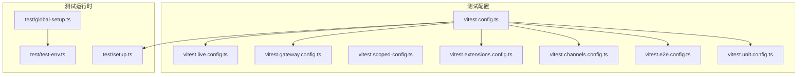
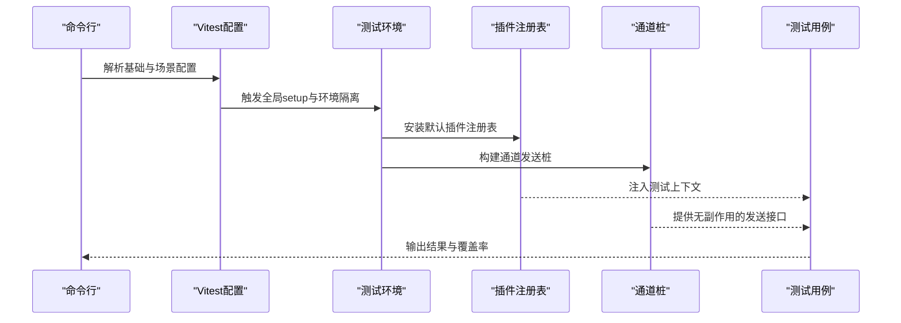
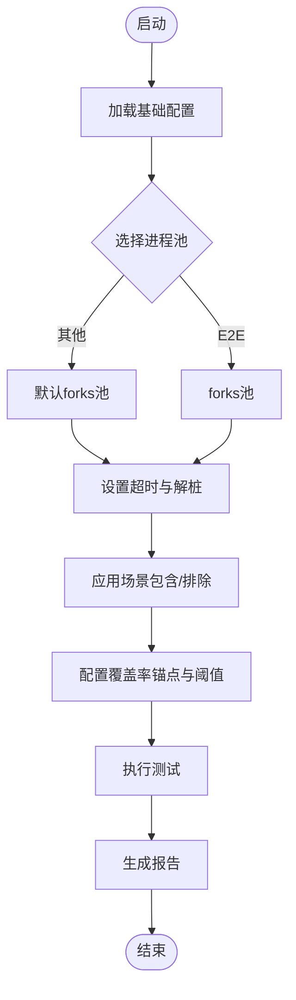
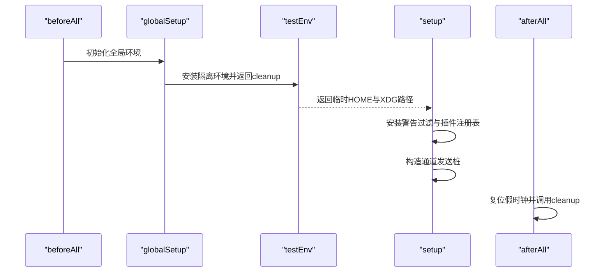
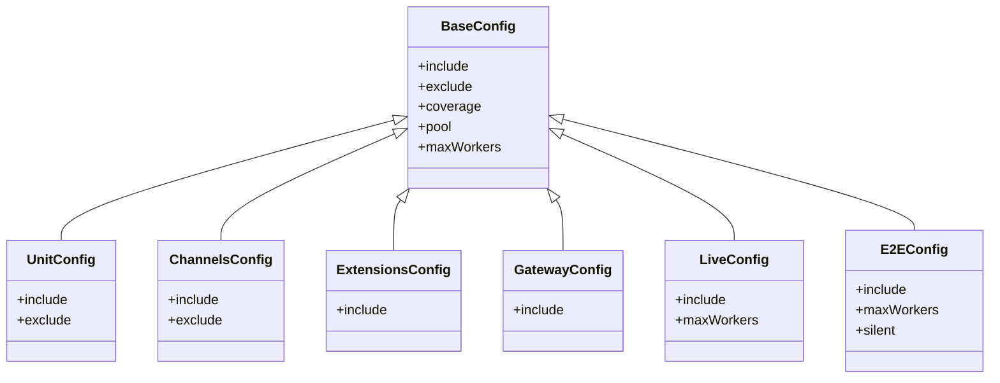
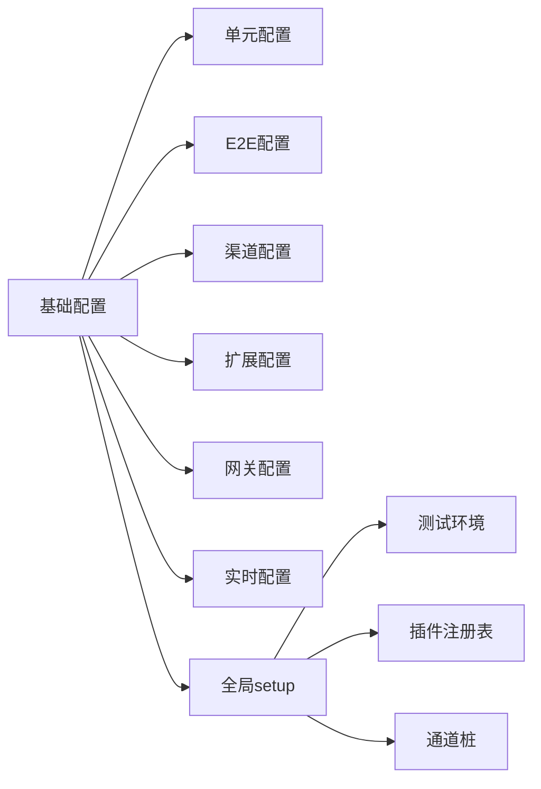

# 测试指南

<cite>
**本文引用的文件**
- [vitest.config.ts](file://vitest.config.ts)
- [vitest.unit.config.ts](file://vitest.unit.config.ts)
- [vitest.e2e.config.ts](file://vitest.e2e.config.ts)
- [vitest.scoped-config.ts](file://vitest.scoped-config.ts)
- [vitest.channels.config.ts](file://vitest.channels.config.ts)
- [vitest.extensions.config.ts](file://vitest.extensions.config.ts)
- [vitest.gateway.config.ts](file://vitest.gateway.config.ts)
- [vitest.live.config.ts](file://vitest.live.config.ts)
- [setup.ts](file://test/setup.ts)
- [global-setup.ts](file://test/global-setup.ts)
- [test-env.ts](file://test/test-env.ts)
- [appcast.test.ts](file://test/appcast.test.ts)
- [git-hooks-pre-commit.test.ts](file://test/git-hooks-pre-commit.test.ts)
</cite>

## 目录

1. [引言](#引言)
2. [项目结构](#项目结构)
3. [核心组件](#核心组件)
4. [架构总览](#架构总览)
5. [详细组件分析](#详细组件分析)
6. [依赖分析](#依赖分析)
7. [性能考虑](#性能考虑)
8. [故障排查指南](#故障排查指南)
9. [结论](#结论)
10. [附录](#附录)

## 引言

本指南面向OpenClaw的测试体系，系统阐述单元测试、集成测试与端到端（E2E）测试的策略与实施方法，覆盖Vitest配置与使用、测试环境搭建、测试工具链、断言与模拟策略、覆盖率与性能测试、并发与隔离、测试数据与夹具、调试与CI自动化等主题，并总结最佳实践与质量保障流程。文档内容严格基于仓库现有配置与测试实现，确保可操作性与可追溯性。

## 项目结构

OpenClaw采用多包工作区与分层模块化组织，测试分布于以下位置：

- 根级Vitest配置：统一基础配置与按场景拆分的专用配置
- 测试入口与全局设置：test/setup.ts、test/global-setup.ts、test/test-env.ts
- 具体测试用例：test/目录下的各类用例；src/与extensions/下按功能域划分的单元/集成测试
- UI测试：ui/src/下的前端视图与控制器测试，通过独立配置运行

**图表来源**

- [vitest.config.ts:1-203](file://vitest.config.ts#L1-L203)
- [vitest.unit.config.ts:1-31](file://vitest.unit.config.ts#L1-L31)
- [vitest.e2e.config.ts:1-33](file://vitest.e2e.config.ts#L1-L33)
- [vitest.scoped-config.ts:1-18](file://vitest.scoped-config.ts#L1-L18)
- [vitest.channels.config.ts:1-21](file://vitest.channels.config.ts#L1-L21)
- [vitest.extensions.config.ts:1-4](file://vitest.extensions.config.ts#L1-L4)
- [vitest.gateway.config.ts:1-4](file://vitest.gateway.config.ts#L1-L4)
- [vitest.live.config.ts:1-17](file://vitest.live.config.ts#L1-L17)
- [setup.ts:1-201](file://test/setup.ts#L1-L201)
- [global-setup.ts:1-7](file://test/global-setup.ts#L1-L7)
- [test-env.ts:1-148](file://test/test-env.ts#L1-L148)

**章节来源**

- [vitest.config.ts:1-203](file://vitest.config.ts#L1-L203)
- [setup.ts:1-201](file://test/setup.ts#L1-L201)
- [test-env.ts:1-148](file://test/test-env.ts#L1-L148)

## 核心组件

- 基础Vitest配置：统一别名解析、超时、钩子超时、环境/全局解桩、进程池与并发、包含/排除规则、覆盖率阈值与锚定范围
- 场景化配置：
  - 单元测试：过滤掉大型集成面，聚焦纯函数与小模块
  - E2E：进程池隔离、默认串行或低并发、显式包含E2E用例
  - 渠道测试：仅覆盖渠道相关模块
  - 扩展测试：仅覆盖扩展目录
  - 网关测试：仅覆盖网关相关模块
  - 实时测试：单工并发，仅运行带特定后缀的用例
- 运行时设置：
  - 全局setup：安装警告过滤、插件注册表、通道发送桩、隔离用户态状态
  - 全局环境：隔离HOME与XDG目录、清理敏感变量、支持“实时”测试加载真实用户环境

关键要点

- 并发与隔离：默认forks池，CI上按平台限制最大并发；VM fork在跨文件泄漏mock时禁用
- 覆盖率：仅统计被实际执行的源码，排除大型集成面与入口/桥接文件
- 环境隔离：临时HOME与XDG目录，避免污染真实配置与状态

**章节来源**

- [vitest.config.ts:57-202](file://vitest.config.ts#L57-L202)
- [vitest.unit.config.ts:11-30](file://vitest.unit.config.ts#L11-L30)
- [vitest.e2e.config.ts:20-32](file://vitest.e2e.config.ts#L20-L32)
- [vitest.scoped-config.ts:4-17](file://vitest.scoped-config.ts#L4-L17)
- [vitest.channels.config.ts:7-20](file://vitest.channels.config.ts#L7-L20)
- [vitest.extensions.config.ts:1-4](file://vitest.extensions.config.ts#L1-L4)
- [vitest.gateway.config.ts:1-4](file://vitest.gateway.config.ts#L1-L4)
- [vitest.live.config.ts:8-16](file://vitest.live.config.ts#L8-L16)
- [setup.ts:1-201](file://test/setup.ts#L1-L201)
- [test-env.ts:54-143](file://test/test-env.ts#L54-L143)

## 架构总览

下图展示测试运行的总体流程：配置加载 → 环境准备 → 插件注册表与桩构建 → 用例执行 → 覆盖率收集与报告。

**图表来源**

- [vitest.config.ts:71-100](file://vitest.config.ts#L71-L100)
- [setup.ts:188-200](file://test.setup.ts#L188-L200)
- [test-env.ts:54-143](file://test/test-env.ts#L54-L143)

## 详细组件分析

### 配置与运行时

- 别名与解析：为插件SDK子路径建立精确别名映射，避免模糊匹配导致的解析错误
- 池与并发：默认forks池，CI上按平台限制最大并发；E2E强制forks以避免VM上下文泄漏
- 超时与解桩：统一测试与钩子超时，启用unstubEnvs/unstubGlobals避免跨文件污染
- 包含/排除：按场景拆分include/exclude，确保覆盖率锚定在实际被测源码
- 覆盖率：仅统计src内被实际执行的模块，排除大型集成面与入口/桥接文件

**图表来源**

- [vitest.config.ts:71-202](file://vitest.config.ts#L71-L202)
- [vitest.e2e.config.ts:20-32](file://vitest.e2e.config.ts#L20-L32)

**章节来源**

- [vitest.config.ts:57-202](file://vitest.config.ts#L57-L202)
- [vitest.scoped-config.ts:4-17](file://vitest.scoped-config.ts#L4-L17)

### 测试环境与隔离

- 全局setup：安装进程警告过滤、设置插件注册表、构造通道桩、确保假定时钟复位
- 全局环境：隔离HOME与XDG目录，清理敏感变量，支持“实时”测试加载真实用户环境
- 作用域：通过withIsolatedTestHome在beforeAll阶段完成隔离，afterAll清理

**图表来源**

- [global-setup.ts:1-7](file://test/global-setup.ts#L1-L7)
- [test-env.ts:54-143](file://test/test-env.ts#L54-L143)
- [setup.ts:188-200](file://test/setup.ts#L188-L200)

**章节来源**

- [global-setup.ts:1-7](file://test/global-setup.ts#L1-L7)
- [test-env.ts:54-143](file://test/test-env.ts#L54-L143)
- [setup.ts:1-201](file://test/setup.ts#L1-L201)

### 场景化配置与用例组织

- 单元测试：排除大型集成面，聚焦纯逻辑与小模块
- 渠道测试：仅覆盖Telegram/Discord/Web/Browser/Line等渠道相关模块
- 扩展测试：仅覆盖extensions目录下的测试
- 网关测试：仅覆盖src/gateway相关模块
- 实时测试：单工并发，仅运行带特定后缀的用例
- E2E：进程池隔离、默认串行或低并发、显式包含E2E用例

**图表来源**

- [vitest.config.ts:71-202](file://vitest.config.ts#L71-L202)
- [vitest.unit.config.ts:11-30](file://vitest.unit.config.ts#L11-L30)
- [vitest.channels.config.ts:7-20](file://vitest.channels.config.ts#L7-L20)
- [vitest.extensions.config.ts:1-4](file://vitest.extensions.config.ts#L1-L4)
- [vitest.gateway.config.ts:1-4](file://vitest.gateway.config.ts#L1-L4)
- [vitest.live.config.ts:8-16](file://vitest.live.config.ts#L8-L16)
- [vitest.e2e.config.ts:20-32](file://vitest.e2e.config.ts#L20-L32)

**章节来源**

- [vitest.unit.config.ts:11-30](file://vitest.unit.config.ts#L11-L30)
- [vitest.channels.config.ts:7-20](file://vitest.channels.config.ts#L7-L20)
- [vitest.extensions.config.ts:1-4](file://vitest.extensions.config.ts#L1-L4)
- [vitest.gateway.config.ts:1-4](file://vitest.gateway.config.ts#L1-L4)
- [vitest.live.config.ts:8-16](file://vitest.live.config.ts#L8-L16)
- [vitest.e2e.config.ts:20-32](file://vitest.e2e.config.ts#L20-L32)

### 断言与模拟策略

- 断言：使用expect风格进行等值、存在性与正则匹配断言
- 模拟：
  - 环境变量：通过vi.stubEnv在测试范围内隔离
  - 通道发送：通过桩适配器提供无副作用的发送接口
  - 插件注册表：在beforeAll安装默认注册表，afterEach恢复
  - 假定时钟：确保跨文件不泄漏，afterEach统一复位

示例参考

- 应用更新信息断言与正则匹配
- Git钩子对文件名的处理行为验证

**章节来源**

- [appcast.test.ts:7-25](file://test/appcast.test.ts#L7-L25)
- [git-hooks-pre-commit.test.ts:21-68](file://test/git-hooks-pre-commit.test.ts#L21-L68)
- [setup.ts:65-88](file://test/setup.ts#L65-L88)
- [setup.ts:188-200](file://test/setup.ts#L188-L200)

### 测试数据管理与夹具

- 数据隔离：通过隔离HOME与XDG目录，避免真实配置与状态污染
- 夹具：通道桩作为夹具，提供统一的发送接口；插件注册表作为共享夹具
- 环境加载：实时测试可加载用户~/.profile以复现真实环境

**章节来源**

- [test-env.ts:54-143](file://test/test-env.ts#L54-L143)
- [setup.ts:137-182](file://test/setup.ts#L137-L182)

### 性能测试与并发技巧

- 并发控制：默认按CPU核数动态分配，CI上限制最大并发；E2E强制forks池
- 工作线程：可通过环境变量调整E2E工作线程数量
- 超时设置：根据平台与场景设置测试与钩子超时，避免误判

**章节来源**

- [vitest.config.ts:71-80](file://vitest.config.ts#L71-L80)
- [vitest.e2e.config.ts:6-14](file://vitest.e2e.config.ts#L6-L14)

### 覆盖率要求

- 报告器：文本与LCOV
- 锚点：仅统计src内被实际执行的模块
- 阈值：行/函数/分支/语句均不低于70%（行/语句70%，函数70%，分支55%）
- 排除：大型集成面、入口/桥接文件、UI与部分交互模块

**章节来源**

- [vitest.config.ts:101-199](file://vitest.config.ts#L101-L199)

### 端到端测试（E2E）

- 目标：验证真实或近似真实环境下的完整流程
- 隔离：进程池隔离，避免VM上下文泄漏
- 并发：默认串行或低并发，可通过环境变量调整
- 可见性：可通过环境变量控制输出详细程度

**章节来源**

- [vitest.e2e.config.ts:20-32](file://vitest.e2e.config.ts#L20-L32)

## 依赖分析

- 配置耦合：各场景配置均基于基础配置派生，保持一致性与可维护性
- 运行时依赖：setup依赖test-env进行环境隔离，依赖插件注册表与通道桩
- 外部依赖：Vitest核心能力、Node进程模型、Git钩子脚本

**图表来源**

- [vitest.config.ts:57-202](file://vitest.config.ts#L57-L202)
- [setup.ts:1-201](file://test/setup.ts#L1-L201)
- [test-env.ts:54-143](file://test/test-env.ts#L54-L143)

**章节来源**

- [vitest.config.ts:57-202](file://vitest.config.ts#L57-L202)
- [setup.ts:1-201](file://test/setup.ts#L1-L201)
- [test-env.ts:54-143](file://test/test-env.ts#L54-L143)

## 性能考虑

- 并发与资源：在本地按CPU核数动态分配，CI上限制并发以稳定吞吐
- 进程池选择：默认forks池；E2E强制forks避免VM上下文泄漏
- 超时与稳定性：合理设置测试与钩子超时，避免误报失败
- 覆盖率采样：仅统计被实际执行的源码，减少无效扫描开销

[本节为通用指导，无需具体文件来源]

## 故障排查指南

常见问题与对策

- 跨文件mock泄漏：启用unstubEnvs/unstubGlobals；必要时切换到forks池
- 真实环境变量污染：通过隔离环境与清理敏感变量；实时测试可加载用户环境
- 假定时钟泄漏：afterEach统一复位
- 并发不稳定：在CI上降低最大并发；E2E使用低并发或串行
- 覆盖率异常：检查排除列表与覆盖率锚点是否覆盖实际执行模块

**章节来源**

- [vitest.config.ts:74-78](file://vitest.config.ts#L74-L78)
- [test-env.ts:94-121](file://test/test-env.ts#L94-L121)
- [setup.ts:196-200](file://test/setup.ts#L196-L200)
- [vitest.e2e.config.ts:6-14](file://vitest.e2e.config.ts#L6-L14)

## 结论

OpenClaw的测试体系以Vitest为核心，通过基础配置与场景化配置实现清晰的测试分层，结合严格的环境隔离与插件桩，确保单元、集成与E2E测试的稳定性与可重复性。覆盖率阈值与排除策略使质量度量聚焦于实际被测逻辑，配合并发与超时策略提升CI效率。建议在新增模块时遵循既有配置与夹具约定，优先编写单元测试，再逐步引入集成与E2E验证。

[本节为总结，无需具体文件来源]

## 附录

- 测试用例编写规范（建议）
  - 使用明确的描述性标题，区分“行为”与“场景”
  - 将断言集中在用例末尾，避免在断言前有副作用
  - 对外部依赖使用桩或夹具，避免真实网络/IO
  - 在setup中集中初始化，避免重复代码
- 持续集成配置（建议）
  - 在CI上固定覆盖率阈值，失败即阻断
  - 分阶段运行：单元（快速）、集成（中速）、E2E（慢速）
  - 为E2E设置专用工作线程与日志开关
- 自动化测试流程（建议）
  - 本地：先运行单元测试，再运行渠道/扩展/网关专项
  - CI：按模块分批运行，失败重试一次，保留Artifacts便于排障

[本节为通用指导，无需具体文件来源]
