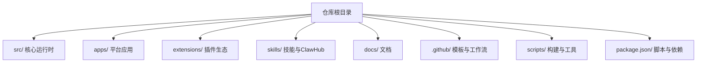
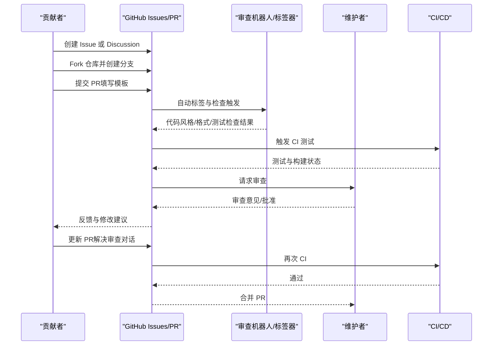
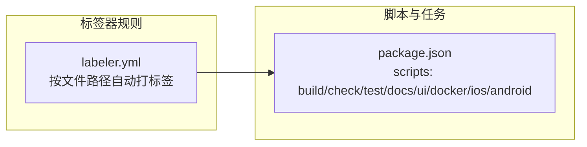

# 贡献指南

<cite>
**本文档引用的文件**
- [CONTRIBUTING.md](file://CONTRIBUTING.md)
- [SECURITY.md](file://SECURITY.md)
- [VISION.md](file://VISION.md)
- [.github/pull_request_template.md](file://.github/pull_request_template.md)
- [.github/ISSUE_TEMPLATE/bug_report.yml](file://.github/ISSUE_TEMPLATE/bug_report.yml)
- [.github/ISSUE_TEMPLATE/feature_request.yml](file://.github/ISSUE_TEMPLATE/feature_request.yml)
- [.github/labeler.yml](file://.github/labeler.yml)
- [package.json](file://package.json)
- [README.md](file://README.md)
- [LICENSE](file://LICENSE)
</cite>

## 目录

1. [简介](#简介)
2. [项目结构](#项目结构)
3. [核心组件](#核心组件)
4. [架构总览](#架构总览)
5. [详细组件分析](#详细组件分析)
6. [依赖关系分析](#依赖关系分析)
7. [性能考虑](#性能考虑)
8. [故障排除指南](#故障排除指南)
9. [结论](#结论)
10. [附录](#附录)

## 简介

本指南面向所有希望参与 OpenClaw 开发与改进的贡献者，覆盖从环境搭建、代码与文档规范、PR 流程、代码审查标准到问题报告、安全漏洞上报、社区行为准则、维护者职责、贡献者认可机制、路线图参与以及许可证与法律合规等全流程内容。OpenClaw 是一个个人 AI 助手，可在本地设备上运行，连接多种消息渠道，并支持多平台应用与插件生态。

## 项目结构

OpenClaw 采用多模块、多语言混合的工程组织方式：

- 核心运行时与网关：TypeScript 实现，位于 src/ 下，包含通道集成、工具系统、会话与代理循环、安全与沙箱等子系统。
- 平台应用：iOS、Android、macOS 应用位于 apps/ 下，使用 Swift/Kotlin 等语言实现。
- 插件与技能：extensions/ 与 skills/ 提供可扩展的能力与技能注册中心（ClawHub）。
- 文档与工具链：docs/ 提供详尽文档；scripts/ 与 package.json 定义构建、测试、格式化、检查等脚本。
- GitHub 工作流与模板：.github/ 包含 PR 模板、Issue 模板、标签器规则与自动化工作流。

**图表来源**

- [README.md: 92-111:92-111](file://README.md#L92-L111)
- [package.json: 217-339:217-339](file://package.json#L217-L339)

**章节来源**

- [README.md: 92-111:92-111](file://README.md#L92-L111)
- [package.json: 217-339:217-339](file://package.json#L217-L339)

## 核心组件

- 贡献入口与沟通渠道
  - GitHub 讨论区与问题：用于新特性讨论、问题报告与需求收集。
  - Discord 社区：帮助与互助频道，快速交流。
  - 维护者团队：负责方向把控、审查与合并。
- PR 前准备与质量门禁
  - 在本地实例中验证变更；执行构建、类型检查与测试。
  - 使用 AI 审查工具进行自审；确保 CI 通过。
  - 保持 PR 聚焦单一主题，描述“做了什么”和“为什么做”，必要时附带前后对比截图。
- 作者拥有审查对话
  - 对机器人审查对话的跟进由作者负责，需在解决后自行关闭或解释不适用原因。
- 控制 UI 装饰器约定
  - 使用遗留装饰器语法以兼容当前构建管线；避免在未更新 UI 构建工具链的情况下切换标准装饰器。
- AI/灵感型 PR 欢迎
  - 使用 AI 辅助编写代码时，请在 PR 中标注、说明测试程度、提供提示词或会话日志，并确认理解所改代码。

**章节来源**

- [CONTRIBUTING.md: 79-137:79-137](file://CONTRIBUTING.md#L79-L137)

## 架构总览

OpenClaw 的贡献流程围绕“问题发现—讨论—设计—实现—审查—合并—发布”的闭环展开。贡献者通过 GitHub Issues/ Discussions 进行问题与需求管理，使用 PR 模板与脚本保证质量门禁，借助标签器自动分类与分配责任人，最终由维护者进行审查与合并。

**图表来源**

- [.github/pull_request_template.md: 1-116:1-116](file://.github/pull_request_template.md#L1-L116)
- [.github/labeler.yml: 1-259:1-259](file://.github/labeler.yml#L1-L259)
- [CONTRIBUTING.md: 85-106:85-106](file://CONTRIBUTING.md#L85-L106)

## 详细组件分析

### 开发环境搭建与本地验证

- 运行时要求：Node.js ≥ 22（包含关键安全补丁）。
- 推荐包管理器：pnpm；支持 bun 直接运行 TypeScript。
- 建议步骤：
  - 克隆仓库并安装依赖；
  - 构建 UI 依赖（首次运行自动安装）；
  - 执行构建与测试；
  - 通过向导安装守护进程并启动网关；
  - 使用 watch 模式进行开发迭代。
- 安全默认：入站私信视为不受信任输入，默认需要配对授权；可通过配置调整策略。

**章节来源**

- [README.md: 50-111:50-111](file://README.md#L50-L111)
- [SECURITY.md: 246-259:246-259](file://SECURITY.md#L246-L259)

### 代码规范与提交规范

- 代码风格与格式化
  - 使用统一格式化工具与 linter；提供检查与修复脚本。
  - 针对 Swift 与 Kotlin 分别有格式化与静态检查脚本。
- 类型与质量门禁
  - 构建前执行类型检查与多项 lint 规则（如临时文件路径、通道边界、鉴权策略等）。
  - 提供重复代码检测、链接检查、拼写检查等专项脚本。
- 提交信息与 PR 模板
  - PR 必须填写摘要、变更类型、范围、关联问题、用户可见变更、安全影响、复现与验证、证据、人工验证、兼容性迁移、失败恢复、风险与缓解等字段。
  - 作者需回复或解决机器人审查对话，不得留待维护者清理。

**章节来源**

- [package.json: 231-339:231-339](file://package.json#L231-L339)
- [.github/pull_request_template.md: 1-116:1-116](file://.github/pull_request_template.md#L1-L116)
- [CONTRIBUTING.md: 85-106:85-106](file://CONTRIBUTING.md#L85-L106)

### PR 流程、审查标准与合并要求

- PR 流程
  - 问题/讨论先行：新特性与架构变更先发起讨论或在 Discord 中沟通。
  - 本地验证：在本地实例中验证变更；运行构建、检查与测试。
  - AI 审查：在本地使用 AI 审查工具进行自审，作为最高标准。
  - CI 通过：确保所有检查与测试通过。
  - 单一主题：每个 PR 专注一个议题，避免混杂无关改动。
  - 截图证据：UI/视觉变更需附带问题前后对比截图。
- 审查标准
  - 逻辑正确性与安全性：尤其关注工具执行面、网络调用、权限与密钥处理。
  - 用户可见变更：明确默认值与配置变化。
  - 兼容性与迁移：评估回退兼容性与升级步骤。
  - 风险与缓解：列出真实风险并给出缓解措施。
- 合并要求
  - 审查通过且无阻塞评论；
  - 机器人审查对话已解决或仅保留需维护者判断项；
  - CI 通过；
  - 维护者批准。

**章节来源**

- [CONTRIBUTING.md: 79-106:79-106](file://CONTRIBUTING.md#L79-L106)
- [.github/pull_request_template.md: 40-116:40-116](file://.github/pull_request_template.md#L40-L116)

### 问题报告、功能请求与讨论参与

- Bug 报告
  - 使用 GitHub Issue 模板，提供可复现步骤、期望与实际行为、版本、操作系统、安装方式、模型与路由链、配置位置、日志与截图、影响与严重性、附加信息等。
- 功能请求
  - 使用 GitHub Issue 模板，描述需求、痛点、解决方案、替代方案、影响与证据、附加约束等。
- 讨论参与
  - 新特性与架构变更优先在 GitHub Discussions 或 Discord 中讨论，再决定是否开 PR。

**章节来源**

- [.github/ISSUE_TEMPLATE/bug_report.yml: 1-138:1-138](file://.github/ISSUE_TEMPLATE/bug_report.yml#L1-L138)
- [.github/ISSUE_TEMPLATE/feature_request.yml: 1-71:1-71](file://.github/ISSUE_TEMPLATE/feature_request.yml#L1-L71)
- [CONTRIBUTING.md: 79-83:79-83](file://CONTRIBUTING.md#L79-L83)

### 社区行为准则、沟通渠道与维护者职责

- 行为准则
  - 尊重与包容：维护开放、尊重、包容的社区氛围。
  - 明确贡献边界：遵循“一个 PR 一个议题”的原则，避免大而全或混杂变更。
- 沟通渠道
  - GitHub：Issues/PR/Discussions。
  - Discord：帮助与互助频道。
- 维护者职责
  - 积极 triage 问题与 PR；
  - 审查代码质量与安全影响；
  - 引导贡献方向，推动项目演进；
  - 严格控制合并节奏，确保稳定性与安全性。

**章节来源**

- [CONTRIBUTING.md: 12-78:12-78](file://CONTRIBUTING.md#L12-L78)

### 贡献者认可机制、里程碑规划与路线图参与

- 贡献者认可
  - 通过贡献记录与社区展示（如贡献者列表）认可贡献者。
- 里程碑与路线图
  - 当前聚焦：稳定性（通道连接）、用户体验（引导与错误信息）、技能生态（ClawHub）、性能优化（令牌使用与压缩逻辑）。
  - 路线图参与：通过 Issues/PR/Discussion 参与讨论，贡献高质量实现与文档。
- 维护者扩展
  - 对积极贡献者开放维护者申请，需邮件说明背景、经验、兴趣与时间投入。

**章节来源**

- [CONTRIBUTING.md: 138-167:138-167](file://CONTRIBUTING.md#L138-L167)
- [VISION.md: 17-40:17-40](file://VISION.md#L17-L40)

### 安全漏洞报告与处理流程

- 报告渠道
  - 按受影响子系统分别报告至对应仓库或通过安全邮箱汇总转交。
  - 必填要素：标题、严重性评估、影响、受影响组件、技术复现、演示影响、环境、修复建议。
- 快速分流
  - 提供精确脆弱路径、受测版本、可复现 PoC、与受托边界相关的实际影响、暴露凭据证明、非对抗方共享同一网关主机的声明、范围说明、命令风险/一致性差异的明确越界路径等。
- 常见误报模式
  - 仅提示注入链、受信操作表面、授权用户触发本地动作、多租户假设、仅显示启发式差异、依赖受信本地状态、仅暴露签名等场景通常不构成漏洞。
- 信任模型与安全边界
  - 不将单网关视为多租户对抗边界；认证调用者被视为该实例的信任操作员；会话标识符仅为路由控制而非按用户授权边界；推荐每用户/每机器/每 VPS 的隔离部署。
- 运维与扫描
  - 使用 detect-secrets 进行机密检测；提供扫描与基线配置。

**章节来源**

- [CONTRIBUTING.md: 169-194:169-194](file://CONTRIBUTING.md#L169-L194)
- [SECURITY.md: 5-31:5-31](file://SECURITY.md#L5-L31)
- [SECURITY.md: 33-67:33-67](file://SECURITY.md#L33-L67)
- [SECURITY.md: 88-131:88-131](file://SECURITY.md#L88-L131)
- [SECURITY.md: 277-288:277-288](file://SECURITY.md#L277-L288)

### 许可证要求、知识产权与法律合规

- 许可证
  - 项目采用 MIT 许可证，允许自由使用、复制、修改、分发与再许可，但需保留版权与许可声明。
- 知识产权
  - 贡献者需确保对所提交内容拥有相应权利，不侵犯第三方知识产权。
- 法律合规
  - 遵守所在司法管辖区法律法规；涉及数据处理与隐私保护时，遵循相关合规要求。

**章节来源**

- [LICENSE: 1-22:1-22](file://LICENSE#L1-L22)

## 依赖关系分析

- 标签器规则
  - 基于变更文件路径自动为 PR 添加标签，便于定向分配给相关子系统维护者。
- 脚本与任务
  - package.json 定义了构建、检查、测试、文档、UI、Docker、iOS/Android 等多类脚本，形成完整的开发与发布流水线。

**图表来源**

- [.github/labeler.yml: 1-259:1-259](file://.github/labeler.yml#L1-L259)
- [package.json: 217-339:217-339](file://package.json#L217-L339)

**章节来源**

- [.github/labeler.yml: 1-259:1-259](file://.github/labeler.yml#L1-L259)
- [package.json: 217-339:217-339](file://package.json#L217-L339)

## 性能考虑

- 代码体积与复杂度
  - 限制单个 PR 的变更规模，避免超过阈值的大批量 PR；鼓励将小而相关的修复合并到一个聚焦的 PR 中。
- 测试与覆盖率
  - 通过并行测试与覆盖率工具保障质量；在 CI 中执行端到端与容器化测试。
- 性能预算与热点分析
  - 提供性能预算与热点分析脚本，帮助识别潜在性能瓶颈。

**章节来源**

- [VISION.md: 34-40:34-40](file://VISION.md#L34-L40)
- [package.json: 303-339:303-339](file://package.json#L303-L339)

## 故障排除指南

- 常见问题定位
  - 使用诊断命令与健康检查工具；查看日志与错误输出。
  - 在本地实例中复现问题，附带最小可复现实例与环境信息。
- 安全问题
  - 遵循安全政策与报告流程；提供可复现 PoC 与影响说明。
- 社区支持
  - 在 Discord 帮助频道寻求协助；参考文档与常见问题页面。

**章节来源**

- [README.md: 442-449:442-449](file://README.md#L442-L449)
- [SECURITY.md: 5-31:5-31](file://SECURITY.md#L5-L31)

## 结论

通过遵循本贡献指南，贡献者可以高效地参与 OpenClaw 的开发与改进。请始终将安全性、稳定性与用户体验放在首位，严格遵守代码与文档规范，积极参与讨论与审查，共同推动项目朝着既定愿景稳步前进。

## 附录

- 快速链接
  - GitHub：https://github.com/openclaw/openclaw
  - Discord：https://discord.gg/qkhbAGHRBT
  - X/Twitter：[@steipete](https://x.com/steipete) / [@openclaw](https://x.com/openclaw)
  - 维护者名单与联系方式详见贡献指南。
