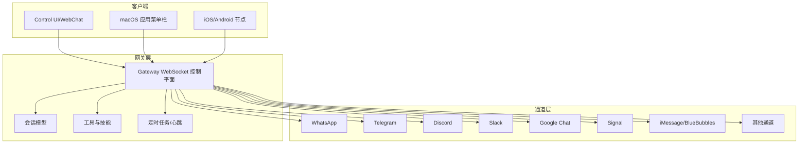
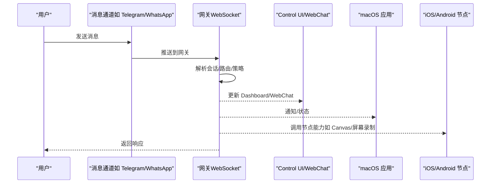
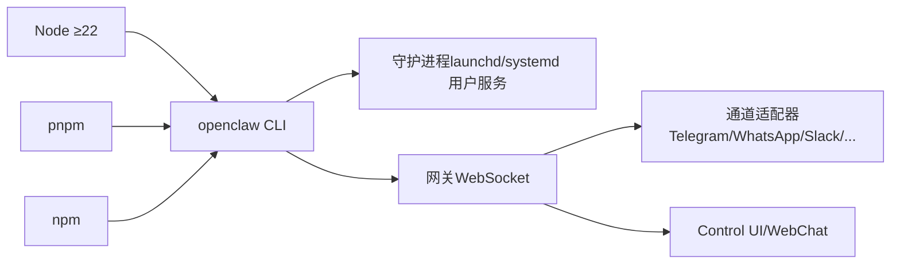

# 快速开始

<cite>
**本文引用的文件**
- [README.md](file://README.md)
- [package.json](file://package.json)
- [docs/start/getting-started.md](file://docs/start/getting-started.md)
- [docs/install/index.md](file://docs/install/index.md)
- [docs/install/node.md](file://docs/install/node.md)
- [docs/platforms/index.md](file://docs/platforms/index.md)
- [docs/platforms/macos.md](file://docs/platforms/macos.md)
- [docs/platforms/windows.md](file://docs/platforms/windows.md)
- [docs/platforms/linux.md](file://docs/platforms/linux.md)
- [docs/cli/onboard.md](file://docs/cli/onboard.md)
- [docs/help/troubleshooting.md](file://docs/help/troubleshooting.md)
- [docs/help/faq.md](file://docs/help/faq.md)
- [docs/install/updating.md](file://docs/install/updating.md)
</cite>

## 目录

1. [简介](#简介)
2. [项目结构](#项目结构)
3. [核心组件](#核心组件)
4. [架构总览](#架构总览)
5. [详细组件分析](#详细组件分析)
6. [依赖分析](#依赖分析)
7. [性能考虑](#性能考虑)
8. [故障排除指南](#故障排除指南)
9. [结论](#结论)
10. [附录](#附录)

## 简介

本指南面向首次接触 OpenClaw 的用户，目标是在约 30 分钟内完成从环境准备、安装、基础配置到首次体验核心功能的全流程。内容覆盖：

- 环境要求与系统兼容性
- 推荐安装方式（npm/pnpm/bun）与脚本安装
- onboarding 向导的使用方法（网关安装、工作空间设置、渠道配置）
- 常见安装问题与故障排除
- 首次使用体验与下一步建议

## 项目结构

OpenClaw 是一个以 TypeScript 编写的多通道 AI 助手网关，支持 macOS、Linux、Windows（WSL2）等平台，并提供 CLI、Control UI、WebChat 等多种交互入口。核心子系统包括：

- 网关（Gateway）：控制平面，负责会话、通道、工具与事件管理
- 多通道集成：WhatsApp、Telegram、Discord、Slack、Google Chat、Signal、iMessage、BlueBubbles、IRC、Microsoft Teams、Matrix、Feishu、LINE、Mattermost、Nextcloud Talk、Nostr、Synology Chat、Tlon、Twitch、Zalo、Zalo Personal、WebChat 等
- 工具与自动化：浏览器控制、Canvas、节点（nodes）、定时任务（cron）、心跳（heartbeat）、Webhook
- 守护进程与远程访问：通过 launchd/systemd 用户服务或 SSH 隧道/ Tailscale Serve/Funnel 远程访问

图表来源

- [README.md:185-238](file://README.md#L185-L238)

章节来源

- [README.md:1-560](file://README.md#L1-L560)

## 核心组件

- 网关（Gateway）：单点 WebSocket 控制平面，承载会话、通道、工具、事件与运维界面（Dashboard/Control UI/WebChat）。
- CLI：openclaw 命令集，包含 onboarding、gateway、dashboard、message、agent、configure、doctor 等子命令。
- macOS 应用：菜单栏应用，负责权限管理、本地/远程模式下的网关连接、节点能力暴露。
- 通道适配器：针对各消息平台的连接与消息路由。
- 工具与技能：浏览器控制、Canvas、节点工具、定时任务、Webhook、技能平台。

章节来源

- [README.md:140-238](file://README.md#L140-L238)
- [docs/platforms/macos.md:1-227](file://docs/platforms/macos.md#L1-L227)

## 架构总览

下图展示了从消息通道到网关再到客户端的整体交互路径，以及远程访问与本地节点的协同方式。

图表来源

- [README.md:185-238](file://README.md#L185-L238)
- [docs/platforms/macos.md:26-65](file://docs/platforms/macos.md#L26-L65)

章节来源

- [README.md:185-238](file://README.md#L185-L238)
- [docs/platforms/macos.md:26-65](file://docs/platforms/macos.md#L26-L65)

## 详细组件分析

### 环境要求与系统兼容性

- Node.js 版本：要求 Node ≥22；推荐使用 npm 或 pnpm 管理全局安装。
- 平台支持：
  - macOS：官方菜单栏应用与权限管理，支持本地/远程模式。
  - Linux：推荐 Node 运行时，支持 systemd 用户服务。
  - Windows：强烈推荐 WSL2（Ubuntu），在 Linux 子系统中运行 CLI 与网关。
  - Bun：不推荐用于网关运行（存在 WhatsApp/Telegram 兼容性问题）。

章节来源

- [docs/install/node.md:1-139](file://docs/install/node.md#L1-L139)
- [docs/platforms/index.md:1-54](file://docs/platforms/index.md#L1-L54)
- [docs/platforms/macos.md:1-227](file://docs/platforms/macos.md#L1-L227)
- [docs/platforms/windows.md:1-204](file://docs/platforms/windows.md#L1-L204)
- [docs/platforms/linux.md:1-95](file://docs/platforms/linux.md#L1-L95)
- [package.json:424-426](file://package.json#L424-L426)

### 推荐安装方式与脚本安装

- 脚本安装（推荐）：一键检测/安装 Node、全局安装 openclaw 并启动 onboarding 向导。
- npm/pnpm：适合已有 Node 环境的用户，可选择跳过 onboarding 直接安装二进制。
- 从源码安装：适合开发者，需要先安装 pnpm，再构建 UI 与网关。
- Windows：强烈建议使用 WSL2，避免原生 Windows 的工具链兼容性问题。

章节来源

- [docs/start/getting-started.md:28-77](file://docs/start/getting-started.md#L28-L77)
- [docs/install/index.md:24-141](file://docs/install/index.md#L24-L141)
- [docs/platforms/windows.md:19-50](file://docs/platforms/windows.md#L19-L50)

### onboarding 向导使用指南

- 启动向导：openclaw onboard --install-daemon
- 主要步骤：
  - 模型与认证配置（支持 OAuth/setup-token/API key/本地模型）
  - 工作空间位置与引导文件
  - 网关设置（绑定地址/端口/鉴权/Tailscale）
  - 渠道配置（可选）
  - 守护进程安装（macOS launchd / Linux systemd 用户服务）
  - 健康检查与技能选择
- 非交互模式：支持通过参数批量配置认证、网关令牌、参考密钥等，便于自动化部署。

章节来源

- [docs/cli/onboard.md:1-139](file://docs/cli/onboard.md#L1-L139)
- [docs/start/getting-started.md:55-77](file://docs/start/getting-started.md#L55-L77)

### 首次使用体验

- 打开 Dashboard：openclaw dashboard（无需配置任何通道即可进行首次聊天）
- 查看网关状态：openclaw gateway status
- 发送测试消息（需已配置通道）：openclaw message send --target +15555550123 --message "Hello from OpenClaw"
- macOS 应用：完成权限提示后，可在本地或远程模式下连接网关，使用菜单栏应用进行状态查看与操作。

章节来源

- [docs/start/getting-started.md:72-102](file://docs/start/getting-started.md#L72-L102)
- [docs/platforms/macos.md:139-145](file://docs/platforms/macos.md#L139-L145)

## 依赖分析

- 运行时与包管理：
  - Node ≥22（engines 字段）
  - 包管理器：pnpm（推荐）；npm/pnpm 可用于全局安装
  - Bun 不推荐用于网关运行
- 关键依赖（示例）：@mariozechner/pi-agent-core、@mariozechner/pi-ai、@whiskeysockets/baileys（WhatsApp）、grammy（Telegram）、@slack/bolt（Slack）、discord.js（Discord）、@lydell/node-pty（终端/执行）、@napi-rs/canvas、sharp（图像处理）、sqlite-vec（向量检索）等
- 服务安装与控制：
  - macOS：launchd 用户代理
  - Linux/WSL2：systemd 用户服务
  - Windows：WSL2 + systemd 用户服务

图表来源

- [package.json:342-396](file://package.json#L342-L396)
- [docs/platforms/index.md:41-54](file://docs/platforms/index.md#L41-L54)
- [docs/platforms/macos.md:35-48](file://docs/platforms/macos.md#L35-L48)
- [docs/platforms/linux.md:65-95](file://docs/platforms/linux.md#L65-L95)

章节来源

- [package.json:342-396](file://package.json#L342-L396)
- [docs/platforms/index.md:41-54](file://docs/platforms/index.md#L41-L54)
- [docs/platforms/macos.md:35-48](file://docs/platforms/macos.md#L35-L48)
- [docs/platforms/linux.md:65-95](file://docs/platforms/linux.md#L65-L95)

## 性能考虑

- 网关默认为轻量级，个人使用建议 512MB-1GB 内存起步，Raspberry Pi 4 可运行。
- 在资源受限设备上，优先使用本地模型或降低上下文/思考级别。
- 使用 Tailscale Serve/Funnel 或 SSH 隧道远程访问时，注意网络延迟与带宽对交互体验的影响。
- 对于媒体处理（图像/视频），建议在具备足够内存与磁盘空间的主机上运行，避免频繁临时文件写入导致性能下降。

章节来源

- [docs/help/faq.md:366-386](file://docs/help/faq.md#L366-L386)

## 故障排除指南

- 快速诊断清单（前 60 秒）：
  - openclaw status
  - openclaw status --all
  - openclaw gateway probe
  - openclaw gateway status
  - openclaw doctor
  - openclaw channels status --probe
  - openclaw logs --follow
- 常见问题与定位思路：
  - Dashboard/Control UI 无法连接：检查网关绑定地址/端口、鉴权令牌、Tailscale/SSH 隧道是否正常。
  - 网关未启动或服务未运行：检查服务安装状态、端口占用、非回环绑定缺少令牌/密码。
  - 渠道连接但消息不流动：检查 mention gating、DM pairing/allowlist、权限/作用域错误。
  - Cron/心跳未触发：检查 cron 是否启用、活跃时段、并发限制。
  - 节点工具失败：检查节点是否在线、权限状态、exec 审批与允许列表。
  - 浏览器工具失败：检查浏览器可执行路径、扩展附加状态、CDP 目标可达性。
- 安装相关问题：
  - openclaw 命令不可用：确认 npm 全局 bin 目录已加入 PATH。
  - 权限错误（Linux）：将 npm prefix 设置为用户可写目录并更新 PATH。
  - Windows：建议使用 WSL2；若必须原生 Windows，请确保 Git 在 PATH 中且 npm 全局 bin 目录已加入 PATH。

章节来源

- [docs/help/troubleshooting.md:13-299](file://docs/help/troubleshooting.md#L13-L299)
- [docs/install/node.md:89-139](file://docs/install/node.md#L89-L139)
- [docs/help/faq.md:203-316](file://docs/help/faq.md#L203-L316)

## 结论

通过本快速开始指南，您可以在约 30 分钟内完成 OpenClaw 的安装与首次体验。建议优先使用脚本安装与 onboarding 向导，结合 Dashboard 进行无通道首聊验证，随后根据需要逐步配置通道与技能。遇到问题时，按“快速诊断清单”逐项排查，通常能迅速定位并解决问题。

## 附录

### 常用命令速查

- 安装与初始化
  - curl -fsSL https://openclaw.ai/install.sh | bash
  - openclaw onboard --install-daemon
- 基础验证
  - openclaw gateway status
  - openclaw dashboard
  - openclaw logs --follow
- 配置与维护
  - openclaw configure
  - openclaw doctor
  - openclaw update

章节来源

- [docs/start/getting-started.md:28-102](file://docs/start/getting-started.md#L28-L102)
- [docs/install/updating.md:13-106](file://docs/install/updating.md#L13-L106)
