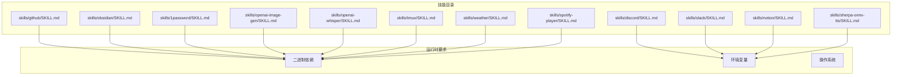
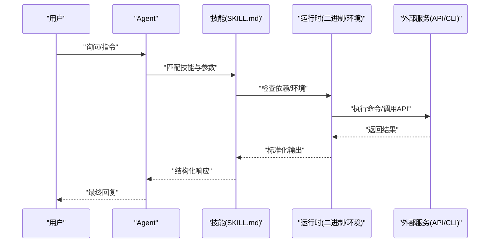
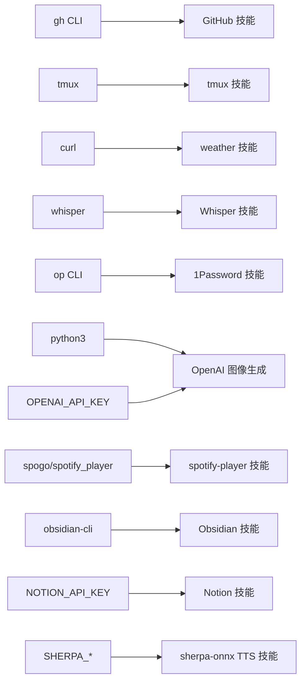

# 内置技能

<cite>
**本文引用的文件**
- [skills/github/SKILL.md](file://skills/github/SKILL.md)
- [skills/discord/SKILL.md](file://skills/discord/SKILL.md)
- [skills/slack/SKILL.md](file://skills/slack/SKILL.md)
- [skills/notion/SKILL.md](file://skills/notion/SKILL.md)
- [skills/obsidian/SKILL.md](file://skills/obsidian/SKILL.md)
- [skills/1password/SKILL.md](file://skills/1password/SKILL.md)
- [skills/openai-image-gen/SKILL.md](file://skills/openai-image-gen/SKILL.md)
- [skills/openai-whisper/SKILL.md](file://skills/openai-whisper/SKILL.md)
- [skills/sherpa-onnx-tts/SKILL.md](file://skills/sherpa-onnx-tts/SKILL.md)
- [skills/tmux/SKILL.md](file://skills/tmux/SKILL.md)
- [skills/weather/SKILL.md](file://skills/weather/SKILL.md)
- [skills/spotify-player/SKILL.md](file://skills/spotify-player/SKILL.md)
</cite>

## 目录

1. [简介](#简介)
2. [项目结构](#项目结构)
3. [核心组件](#核心组件)
4. [架构总览](#架构总览)
5. [详细组件分析](#详细组件分析)
6. [依赖关系分析](#依赖关系分析)
7. [性能考量](#性能考量)
8. [故障排除指南](#故障排除指南)
9. [结论](#结论)
10. [附录](#附录)

## 简介

本文件系统性梳理 OpenClaw 提供的内置技能，覆盖消息平台类（GitHub、Discord、Telegram、Slack、WhatsApp、iMessage）、生产力工具类（Notion、Obsidian、1Password）、媒体处理类（OpenAI 图像生成、Whisper 语音转文字、TTS 语音合成）与系统工具类（tmux、weather、spotify 等），为使用者提供功能特性、配置参数、使用场景、最佳实践、调用示例、权限要求与故障排除指引。

## 项目结构

内置技能以“技能目录 + SKILL.md”的形式组织，SKILL.md 中包含：

- 技能元数据：名称、描述、图标、运行时依赖（二进制、环境变量、操作系统）
- 安装指引：官方安装方式或自动安装步骤
- 使用场景与限制：何时使用、何时不使用
- 常用命令/动作：示例与模板
- 输出与注意事项：返回格式、速率限制、缓存策略等

图表来源

- [skills/github/SKILL.md:1-164](file://skills/github/SKILL.md#L1-L164)
- [skills/discord/SKILL.md:1-198](file://skills/discord/SKILL.md#L1-L198)
- [skills/slack/SKILL.md:1-145](file://skills/slack/SKILL.md#L1-L145)
- [skills/notion/SKILL.md:1-175](file://skills/notion/SKILL.md#L1-L175)
- [skills/obsidian/SKILL.md:1-82](file://skills/obsidian/SKILL.md#L1-L82)
- [skills/1password/SKILL.md:1-71](file://skills/1password/SKILL.md#L1-L71)
- [skills/openai-image-gen/SKILL.md:1-93](file://skills/openai-image-gen/SKILL.md#L1-L93)
- [skills/openai-whisper/SKILL.md:1-39](file://skills/openai-whisper/SKILL.md#L1-L39)
- [skills/sherpa-onnx-tts/SKILL.md:1-104](file://skills/sherpa-onnx-tts/SKILL.md#L1-L104)
- [skills/tmux/SKILL.md:1-154](file://skills/tmux/SKILL.md#L1-L154)
- [skills/weather/SKILL.md:1-113](file://skills/weather/SKILL.md#L1-L113)
- [skills/spotify-player/SKILL.md:1-65](file://skills/spotify-player/SKILL.md#L1-L65)

章节来源

- [skills/github/SKILL.md:1-164](file://skills/github/SKILL.md#L1-L164)
- [skills/discord/SKILL.md:1-198](file://skills/discord/SKILL.md#L1-L198)
- [skills/slack/SKILL.md:1-145](file://skills/slack/SKILL.md#L1-L145)
- [skills/notion/SKILL.md:1-175](file://skills/notion/SKILL.md#L1-L175)
- [skills/obsidian/SKILL.md:1-82](file://skills/obsidian/SKILL.md#L1-L82)
- [skills/1password/SKILL.md:1-71](file://skills/1password/SKILL.md#L1-L71)
- [skills/openai-image-gen/SKILL.md:1-93](file://skills/openai-image-gen/SKILL.md#L1-L93)
- [skills/openai-whisper/SKILL.md:1-39](file://skills/openai-whisper/SKILL.md#L1-L39)
- [skills/sherpa-onnx-tts/SKILL.md:1-104](file://skills/sherpa-onnx-tts/SKILL.md#L1-L104)
- [skills/tmux/SKILL.md:1-154](file://skills/tmux/SKILL.md#L1-L154)
- [skills/weather/SKILL.md:1-113](file://skills/weather/SKILL.md#L1-L113)
- [skills/spotify-player/SKILL.md:1-65](file://skills/spotify-player/SKILL.md#L1-L65)

## 核心组件

- 消息平台技能
  - GitHub：通过 gh CLI 进行仓库、问题、拉取请求、CI 运行等操作；需本地已配置认证与仓库上下文。
  - Discord：通过 message 工具发送/编辑/删除消息、反应、读取、投票、置顶、线程、搜索与状态设置；需配置令牌与权限。
  - Slack：通过 slack 工具进行反应、消息管理、读取、置顶/取消置顶、成员信息与表情列表；需配置 bot 令牌。
- 生产力工具技能
  - Notion：通过 Notion API 创建/查询页面、数据库项与块；需集成密钥与共享目标页面/数据库。
  - Obsidian：通过 obsidian-cli 管理笔记（搜索、创建、移动/重命名、删除）；需默认库与配置解析。
  - 1Password：通过 op CLI 管理登录、账户切换与注入；需桌面应用集成与 tmux 会话。
- 媒体处理技能
  - OpenAI 图像生成：批量生成图片，支持多种模型与输出格式；需 Python 与 API 密钥，注意较长执行时间。
  - Whisper：本地语音转文字，无需 API 密钥；首次下载模型缓存。
  - sherpa-onnx TTS：离线文本转语音，需运行时与模型目录配置。
- 系统工具技能
  - tmux：远程控制 tmux 会话，发送按键、抓取输出、窗口/窗格导航与会话管理；需 tmux 可用。
  - weather：通过 wttr.in 或 Open-Meteo 获取天气与预报；无需密钥。
  - spotify-player：终端播放器控制，优先使用 spogo；需 Spotify Premium 与相应客户端配置。

章节来源

- [skills/github/SKILL.md:1-164](file://skills/github/SKILL.md#L1-L164)
- [skills/discord/SKILL.md:1-198](file://skills/discord/SKILL.md#L1-L198)
- [skills/slack/SKILL.md:1-145](file://skills/slack/SKILL.md#L1-L145)
- [skills/notion/SKILL.md:1-175](file://skills/notion/SKILL.md#L1-L175)
- [skills/obsidian/SKILL.md:1-82](file://skills/obsidian/SKILL.md#L1-L82)
- [skills/1password/SKILL.md:1-71](file://skills/1password/SKILL.md#L1-L71)
- [skills/openai-image-gen/SKILL.md:1-93](file://skills/openai-image-gen/SKILL.md#L1-L93)
- [skills/openai-whisper/SKILL.md:1-39](file://skills/openai-whisper/SKILL.md#L1-L39)
- [skills/sherpa-onnx-tts/SKILL.md:1-104](file://skills/sherpa-onnx-tts/SKILL.md#L1-L104)
- [skills/tmux/SKILL.md:1-154](file://skills/tmux/SKILL.md#L1-L154)
- [skills/weather/SKILL.md:1-113](file://skills/weather/SKILL.md#L1-L113)
- [skills/spotify-player/SKILL.md:1-65](file://skills/spotify-player/SKILL.md#L1-L65)

## 架构总览

下图展示 OpenClaw 调用内置技能的整体流程：Agent 解析用户意图后选择合适技能，依据 SKILL.md 的元数据与要求准备运行环境（二进制、环境变量、配置），随后执行具体命令或动作，并返回结果。

图表来源

- [skills/github/SKILL.md:1-164](file://skills/github/SKILL.md#L1-L164)
- [skills/discord/SKILL.md:1-198](file://skills/discord/SKILL.md#L1-L198)
- [skills/slack/SKILL.md:1-145](file://skills/slack/SKILL.md#L1-L145)
- [skills/notion/SKILL.md:1-175](file://skills/notion/SKILL.md#L1-L175)
- [skills/obsidian/SKILL.md:1-82](file://skills/obsidian/SKILL.md#L1-L82)
- [skills/1password/SKILL.md:1-71](file://skills/1password/SKILL.md#L1-L71)
- [skills/openai-image-gen/SKILL.md:1-93](file://skills/openai-image-gen/SKILL.md#L1-L93)
- [skills/openai-whisper/SKILL.md:1-39](file://skills/openai-whisper/SKILL.md#L1-L39)
- [skills/sherpa-onnx-tts/SKILL.md:1-104](file://skills/sherpa-onnx-tts/SKILL.md#L1-L104)
- [skills/tmux/SKILL.md:1-154](file://skills/tmux/SKILL.md#L1-L154)
- [skills/weather/SKILL.md:1-113](file://skills/weather/SKILL.md#L1-L113)
- [skills/spotify-player/SKILL.md:1-65](file://skills/spotify-player/SKILL.md#L1-L65)

## 详细组件分析

### GitHub 技能

- 功能特性
  - 通过 gh CLI 执行仓库、问题、PR、CI 运行等操作；支持结构化 JSON 输出与 jq 过滤。
- 配置参数
  - 二进制依赖：gh
  - 认证：一次性 gh auth login 并验证状态
  - 仓库上下文：在非仓库目录时必须显式指定 --repo owner/repo
- 使用场景
  - PR 状态/合并就绪检查、CI 日志查看与重试、问题创建/关闭/评论、API 查询与统计
- 最佳实践
  - 复用 URL 直接定位资源；对高频查询使用缓存头；避免在非 GitHub 平台使用
- 示例路径
  - PR 列表/详情/检查/合并：[skills/github/SKILL.md:70-85](file://skills/github/SKILL.md#L70-L85)
  - 问题列表/创建/关闭：[skills/github/SKILL.md:89-98](file://skills/github/SKILL.md#L89-L98)
  - CI 运行列表/查看/失败重试：[skills/github/SKILL.md:102-114](file://skills/github/SKILL.md#L102-L114)
  - API 查询与 JSON 结果过滤：[skills/github/SKILL.md:118-136](file://skills/github/SKILL.md#L118-L136)
- 权限要求
  - 需要 gh CLI 已认证；仓库访问权限取决于团队/组织设置
- 故障排除
  - 未配置认证：执行 gh auth login 并 gh auth status 验证
  - 速率限制：使用缓存头或降低请求频率

章节来源

- [skills/github/SKILL.md:1-164](file://skills/github/SKILL.md#L1-L164)

### Discord 技能（通过 message 工具）

- 功能特性
  - 发送/编辑/删除消息、添加反应、读取消息、发送媒体、投票、置顶、线程、搜索、状态设置
- 配置参数
  - 必需配置：channels.discord.token
  - 行为门控：channels.discord.actions.\*（如 roles、moderation、presence、channels 默认可能关闭）
- 使用场景
  - 团队沟通、公告发布、工单流转、状态汇报、活动组织
- 最佳实践
  - 优先使用明确 ID；避免在消息中使用 Markdown 表格；推荐使用组件 v2；不要同时混用组件 v2 与 embeds
- 示例路径
  - 发送消息/带媒体/静默通知：[skills/discord/SKILL.md:34-54](file://skills/discord/SKILL.md#L34-L54)
  - 组件 v2 与传统 embeds：[skills/discord/SKILL.md:60-83](file://skills/discord/SKILL.md#L60-L83)
  - 反应/读取/编辑/删除：[skills/discord/SKILL.md:89-129](file://skills/discord/SKILL.md#L89-L129)
  - 投票/置顶/线程/搜索/状态：[skills/discord/SKILL.md:133-191](file://skills/discord/SKILL.md#L133-L191)
- 权限要求
  - 需具备对应频道的发送、管理、读取、投票、置顶等权限
- 故障排除
  - 无权限：检查门控开关与机器人角色；确保使用明确 ID
  - 消息被拒：避免同时提供 components 与 embeds

章节来源

- [skills/discord/SKILL.md:1-198](file://skills/discord/SKILL.md#L1-L198)

### Slack 技能

- 功能特性
  - 反应、列出反应、发送/编辑/删除消息、读取最近消息、置顶/取消置顶、列出置顶、成员信息、自定义表情列表
- 配置参数
  - 必需配置：channels.slack（bot token）
- 使用场景
  - 快速反馈、任务标记、知识沉淀、团队协作
- 最佳实践
  - 复用消息上下文中的 channelId 与 messageId；合理使用 emoji 与内容
- 示例路径
  - 反应/列出反应：[skills/slack/SKILL.md:35-52](file://skills/slack/SKILL.md#L35-L52)
  - 发送/编辑/删除消息：[skills/slack/SKILL.md:55-83](file://skills/slack/SKILL.md#L55-L83)
  - 读取消息/置顶/取消置顶/列出置顶：[skills/slack/SKILL.md:85-122](file://skills/slack/SKILL.md#L85-L122)
  - 成员信息/表情列表：[skills/slack/SKILL.md:124-139](file://skills/slack/SKILL.md#L124-L139)
- 权限要求
  - 需具备相应 scopes（reaction、messages、pins、users.profile 等）
- 故障排除
  - 403/权限不足：确认 scopes 与邀请机器人到频道

章节来源

- [skills/slack/SKILL.md:1-145](file://skills/slack/SKILL.md#L1-L145)

### Notion 技能

- 功能特性
  - 搜索页面/数据库、获取页面与块、创建页面/数据库、查询数据库、更新页面属性、追加块
- 配置参数
  - 环境变量：NOTION_API_KEY（主密钥）
- 使用场景
  - 文档管理、任务看板、知识库维护、自动化录入
- 最佳实践
  - 先搜索/查询再创建；使用 data_source_id 进行查询；注意属性类型与 payload 限制
- 示例路径
  - 搜索/获取页面/块：[skills/notion/SKILL.md:47-69](file://skills/notion/SKILL.md#L47-L69)
  - 创建页面/数据库/查询：[skills/notion/SKILL.md:71-98](file://skills/notion/SKILL.md#L71-L98)
  - 更新属性/追加块：[skills/notion/SKILL.md:118-140](file://skills/notion/SKILL.md#L118-L140)
  - 属性类型与版本差异：[skills/notion/SKILL.md:142-175](file://skills/notion/SKILL.md#L142-L175)
- 权限要求
  - 需要在 Notion 中将集成分享到目标页面/数据库
- 故障排除
  - 401/403：检查密钥与分享；429：遵循 Retry-After 并降低频率

章节来源

- [skills/notion/SKILL.md:1-175](file://skills/notion/SKILL.md#L1-L175)

### Obsidian 技能

- 功能特性
  - 搜索笔记、按内容搜索、创建笔记、移动/重命名、删除笔记；支持安全重构（自动更新链接）
- 配置参数
  - 二进制依赖：obsidian-cli
  - 默认库：通过配置文件解析当前打开的库
- 使用场景
  - 日常笔记整理、知识迁移、批量维护
- 最佳实践
  - 优先使用默认库；避免硬编码路径；使用移动/重命名以保持链接一致性
- 示例路径
  - 查找默认库/搜索/创建/移动/删除：[skills/obsidian/SKILL.md:44-82](file://skills/obsidian/SKILL.md#L44-L82)
- 权限要求
  - 需要可读写 Obsidian 库所在磁盘
- 故障排除
  - 无法解析默认库：检查配置文件；URI 创建受限于 Obsidian 设置

章节来源

- [skills/obsidian/SKILL.md:1-82](file://skills/obsidian/SKILL.md#L1-L82)

### 1Password 技能

- 功能特性
  - 安装与初始化、登录、账户切换、列出保险库、读取/注入/运行敏感信息
- 配置参数
  - 二进制依赖：op
  - 运行环境：需要桌面应用集成与解锁；必须在 tmux 会话内执行
- 使用场景
  - 自动化脚本中安全地读取/注入凭据
- 最佳实践
  - 在专用 tmux socket 会话中执行 op；避免明文日志；优先 op run/op inject
- 示例路径
  - 工作流与 tmux 会话示例：[skills/1password/SKILL.md:34-71](file://skills/1password/SKILL.md#L34-L71)
- 权限要求
  - 需要 1Password 桌面应用授权与解锁
- 故障排除
  - “未登录”：在 tmux 会话内重新 op signin 并授权；不要在 tmux 外直接运行

章节来源

- [skills/1password/SKILL.md:1-71](file://skills/1password/SKILL.md#L1-L71)

### OpenAI 图像生成技能

- 功能特性
  - 批量生成图片，支持多模型与输出格式；生成索引页画廊
- 配置参数
  - 二进制依赖：python3
  - 环境变量：OPENAI_API_KEY（主密钥）
- 使用场景
  - 视觉素材生成、创意探索、批量预览
- 最佳实践
  - 为长耗时任务设置更高 exec 超时；根据模型选择尺寸/质量/风格
- 示例路径
  - 运行与常用参数：[skills/openai-image-gen/SKILL.md:30-55](file://skills/openai-image-gen/SKILL.md#L30-L55)
  - 模型参数与输出：[skills/openai-image-gen/SKILL.md:57-93](file://skills/openai-image-gen/SKILL.md#L57-L93)
- 权限要求
  - 需要有效 OPENAI_API_KEY 与配额
- 故障排除
  - 超时/中断：提高 exec 超时；检查网络与配额

章节来源

- [skills/openai-image-gen/SKILL.md:1-93](file://skills/openai-image-gen/SKILL.md#L1-L93)

### Whisper 语音转文字技能

- 功能特性
  - 本地语音转文字，无需 API 密钥；首次运行自动下载模型
- 配置参数
  - 二进制依赖：whisper
- 使用场景
  - 会议记录、播客转录、学习资料整理
- 最佳实践
  - 根据准确度与速度选择模型；使用合适的输出格式
- 示例路径
  - 快速开始与模型选择：[skills/openai-whisper/SKILL.md:29-39](file://skills/openai-whisper/SKILL.md#L29-L39)
- 权限要求
  - 本地音频文件读取权限
- 故障排除
  - 首次运行慢：等待模型下载完成；选择更小模型提升速度

章节来源

- [skills/openai-whisper/SKILL.md:1-39](file://skills/openai-whisper/SKILL.md#L1-L39)

### sherpa-onnx TTS 技能

- 功能特性
  - 离线文本转语音，支持多平台与多模型
- 配置参数
  - 环境变量：SHERPA_ONNX_RUNTIME_DIR、SHERPA_ONNX_MODEL_DIR
- 使用场景
  - 本地播报、隐私保护、离线场景
- 最佳实践
  - 下载对应平台运行时与语音模型；必要时指定模型文件路径
- 示例路径
  - 安装与环境配置：[skills/sherpa-onnx-tts/SKILL.md:64-84](file://skills/sherpa-onnx-tts/SKILL.md#L64-L84)
  - 使用示例：[skills/sherpa-onnx-tts/SKILL.md:92-104](file://skills/sherpa-onnx-tts/SKILL.md#L92-L104)
- 权限要求
  - 本地可执行权限与模型文件读取
- 故障排除
  - 无法加载模型：检查模型目录与文件；Windows 使用 Node 包装器

章节来源

- [skills/sherpa-onnx-tts/SKILL.md:1-104](file://skills/sherpa-onnx-tts/SKILL.md#L1-L104)

### tmux 技能

- 功能特性
  - 控制现有 tmux 会话，发送按键、抓取输出、导航窗口/窗格、管理会话
- 配置参数
  - 二进制依赖：tmux
- 使用场景
  - 监控交互式 CLI、向 Claude/Codex 发送输入、抓取长时间运行进程输出
- 最佳实践
  - 将长文本拆分为多段发送以避免粘贴边界问题；使用 capture-pane 打印到 stdout
- 示例路径
  - 会话/输出/按键/导航：[skills/tmux/SKILL.md:41-103](file://skills/tmux/SKILL.md#L41-L103)
  - Claude Code 场景模式：[skills/tmux/SKILL.md:114-147](file://skills/tmux/SKILL.md#L114-L147)
- 权限要求
  - 当前用户可访问 tmux 会话
- 故障排除
  - 无法找到会话：确认会话名与格式 session:window.pane；会话持久化不受 SSH 断开影响

章节来源

- [skills/tmux/SKILL.md:1-154](file://skills/tmux/SKILL.md#L1-L154)

### weather 技能

- 功能特性
  - 获取当前天气与预报；支持多种格式与图像输出
- 配置参数
  - 二进制依赖：curl
- 使用场景
  - 出行规划、日常问候、旅行提醒
- 最佳实践
  - 总是包含城市/地区/机场代码；注意速率限制
- 示例路径
  - 当前天气/预报/格式选项：[skills/weather/SKILL.md:38-76](file://skills/weather/SKILL.md#L38-L76)
  - 快速问答模板：[skills/weather/SKILL.md:87-106](file://skills/weather/SKILL.md#L87-L106)
- 权限要求
  - 外网访问能力
- 故障排除
  - 429/限流：降低请求频率；使用缓存友好参数

章节来源

- [skills/weather/SKILL.md:1-113](file://skills/weather/SKILL.md#L1-L113)

### spotify-player 技能

- 功能特性
  - 终端播放器控制，支持搜索、播放/暂停、设备切换、状态查询
- 配置参数
  - 二进制依赖：spogo 或 spotify_player
- 使用场景
  - 演讲/工作时背景音乐、演示播放控制
- 最佳实践
  - 优先使用 spogo；确保 Spotify Premium 与客户端配置正确
- 示例路径
  - spogo 与 fallback 命令：[skills/spotify-player/SKILL.md:42-65](file://skills/spotify-player/SKILL.md#L42-L65)
- 权限要求
  - 需要有效的 Spotify Premium 账户与客户端授权
- 故障排除
  - 无法连接设备：检查客户端配置与网络；导入浏览器 Cookie

章节来源

- [skills/spotify-player/SKILL.md:1-65](file://skills/spotify-player/SKILL.md#L1-L65)

## 依赖关系分析

- 运行时依赖
  - 二进制依赖：gh、tmux、curl、whisper、spogo/spy-spotify_player、obsidian-cli、python3、op
  - 环境变量：NOTION_API_KEY、OPENAI_API_KEY、SHERPA_ONNX_RUNTIME_DIR、SHERPA_ONNX_MODEL_DIR
  - 操作系统：部分技能限定 macOS/Linux/Windows
- 配置与权限
  - 令牌/密钥：Discord、Slack、Notion、1Password、OpenAI、Spotify
  - 门控：Discord actions.\* 默认可能关闭
- 外部服务
  - GitHub API、Discord API、Slack API、Notion API、OpenAI API、Spotify Web API、wttr.in

图表来源

- [skills/github/SKILL.md:1-164](file://skills/github/SKILL.md#L1-L164)
- [skills/tmux/SKILL.md:1-154](file://skills/tmux/SKILL.md#L1-L154)
- [skills/weather/SKILL.md:1-113](file://skills/weather/SKILL.md#L1-L113)
- [skills/openai-whisper/SKILL.md:1-39](file://skills/openai-whisper/SKILL.md#L1-L39)
- [skills/1password/SKILL.md:1-71](file://skills/1password/SKILL.md#L1-L71)
- [skills/openai-image-gen/SKILL.md:1-93](file://skills/openai-image-gen/SKILL.md#L1-L93)
- [skills/spotify-player/SKILL.md:1-65](file://skills/spotify-player/SKILL.md#L1-L65)
- [skills/obsidian/SKILL.md:1-82](file://skills/obsidian/SKILL.md#L1-L82)
- [skills/notion/SKILL.md:1-175](file://skills/notion/SKILL.md#L1-L175)
- [skills/sherpa-onnx-tts/SKILL.md:1-104](file://skills/sherpa-onnx-tts/SKILL.md#L1-L104)

## 性能考量

- 速率限制
  - Notion：约 3 请求/秒平均，注意 429 与 Retry-After
  - GitHub：受速率限制影响，建议使用缓存头
  - weather：wttr.in 有速率限制，避免频繁请求
- 执行时间
  - OpenAI 图像生成：可能超过常规执行超时，需适当放宽
- 资源占用
  - Whisper 首次运行需下载模型；sherpa-onnx 需要磁盘空间存放模型
- 并发与会话
  - tmux 支持并行 worker 会话；1Password 强制 tmux 会话以避免重复提示

## 故障排除指南

- 通用排查
  - 检查二进制是否可用：which <binary>
  - 检查环境变量是否存在且正确
  - 确认网络连通与代理设置
- 技能特定
  - GitHub：认证失败时重新 gh auth login；非 GitHub 平台请改用其他工具
  - Discord：核对 channels.discord.actions.\* 门控；避免同时提供 components 与 embeds
  - Slack：确认 scopes 与机器人加入频道
  - Notion：检查密钥与页面/数据库分享；关注 429 并遵循 Retry-After
  - 1Password：在专用 tmux 会话内执行 op；若提示未登录则重新 signin
  - OpenAI 图像生成：提高 exec 超时；检查 OPENAI_API_KEY 与配额
  - Whisper：等待模型下载完成；选择合适模型
  - sherpa-onnx TTS：检查模型目录与文件；Windows 使用 Node 包装器
  - tmux：确认会话名与格式；使用 capture-pane 打印输出
  - weather：提供完整位置信息；避免频繁请求
  - spotify-player：确保 Premium 与客户端配置；导入浏览器 Cookie

章节来源

- [skills/github/SKILL.md:1-164](file://skills/github/SKILL.md#L1-L164)
- [skills/discord/SKILL.md:1-198](file://skills/discord/SKILL.md#L1-L198)
- [skills/slack/SKILL.md:1-145](file://skills/slack/SKILL.md#L1-L145)
- [skills/notion/SKILL.md:1-175](file://skills/notion/SKILL.md#L1-L175)
- [skills/1password/SKILL.md:1-71](file://skills/1password/SKILL.md#L1-L71)
- [skills/openai-image-gen/SKILL.md:1-93](file://skills/openai-image-gen/SKILL.md#L1-L93)
- [skills/openai-whisper/SKILL.md:1-39](file://skills/openai-whisper/SKILL.md#L1-L39)
- [skills/sherpa-onnx-tts/SKILL.md:1-104](file://skills/sherpa-onnx-tts/SKILL.md#L1-L104)
- [skills/tmux/SKILL.md:1-154](file://skills/tmux/SKILL.md#L1-L154)
- [skills/weather/SKILL.md:1-113](file://skills/weather/SKILL.md#L1-L113)
- [skills/spotify-player/SKILL.md:1-65](file://skills/spotify-player/SKILL.md#L1-L65)

## 结论

OpenClaw 的内置技能覆盖消息平台、生产力工具、媒体处理与系统工具四大类，通过 SKILL.md 明确了运行时依赖、配置要求与使用边界。遵循各技能的最佳实践与故障排除建议，可在保证安全性与稳定性的前提下高效完成自动化任务。

## 附录

- 快速参考
  - 安装与认证：按各技能的“安装指引”与“Setup/Workflow”执行
  - 参数收集：按技能“Inputs to collect”或“When to Use”收集必要字段
  - 输出格式：关注 JSON 输出与格式化选项（如 jq、format、j1、PNG）
  - 权限与门控：检查令牌/密钥与门控开关（如 Discord actions.\*）
