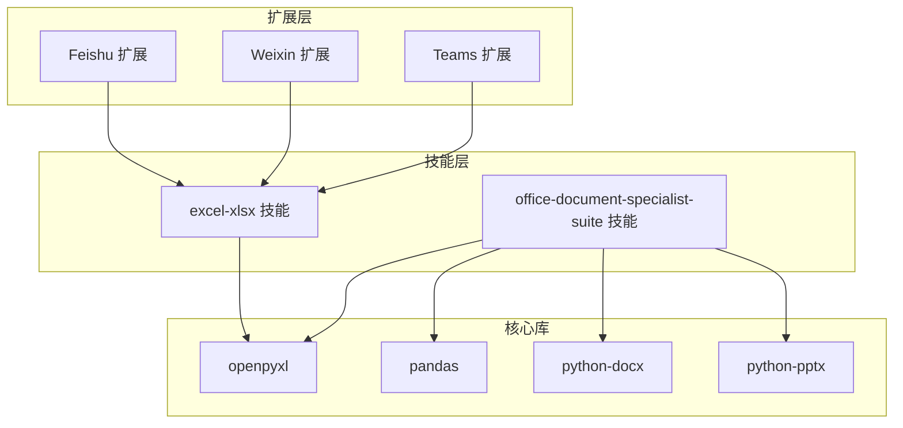
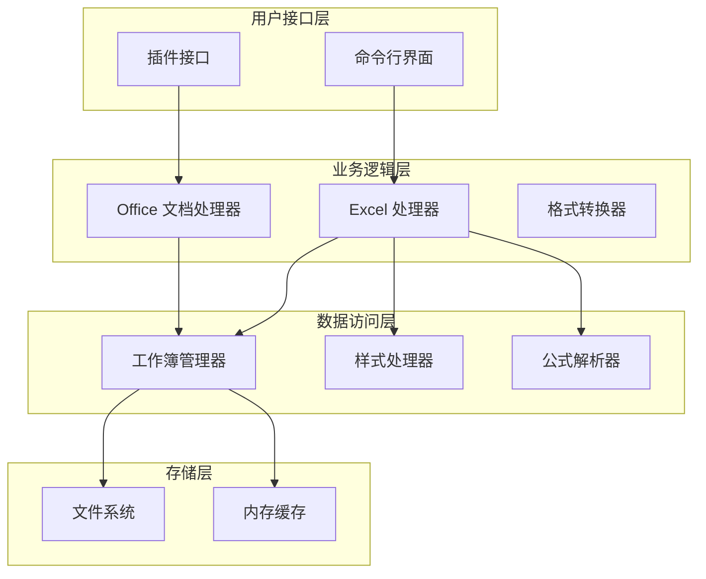
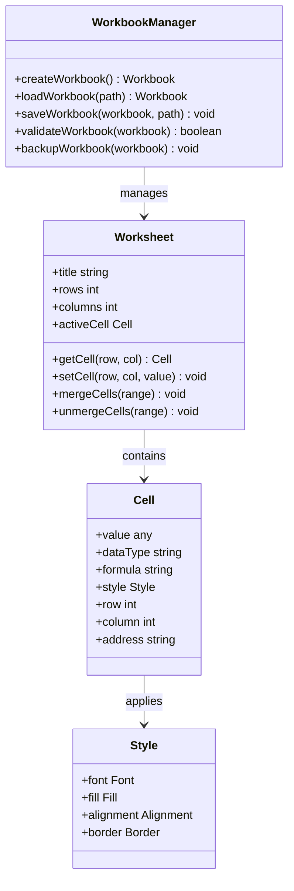
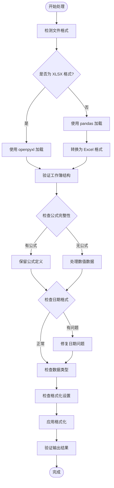
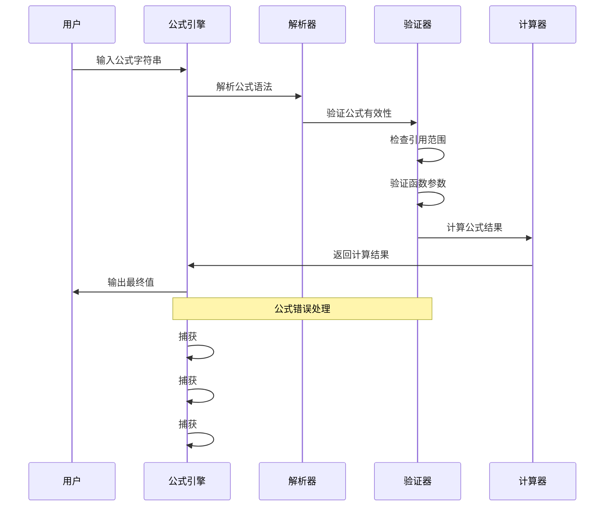
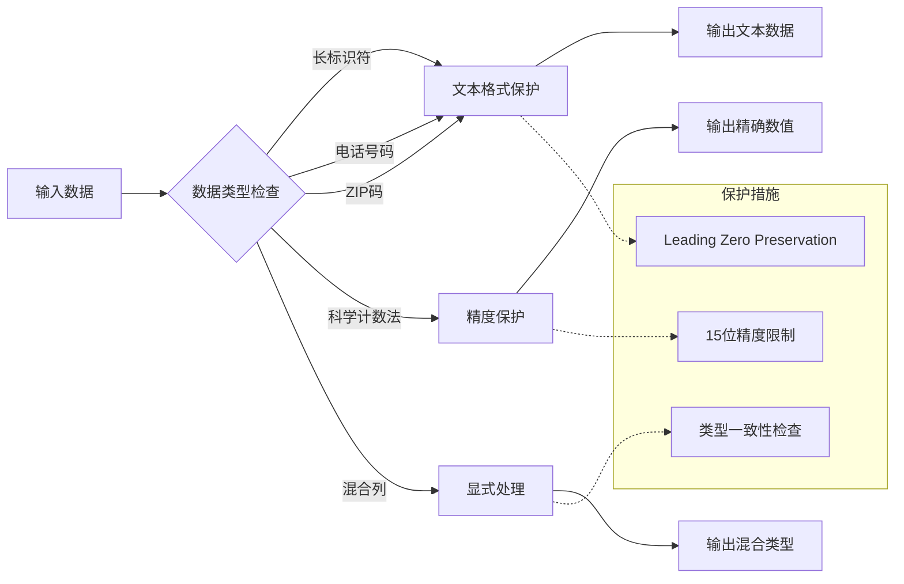
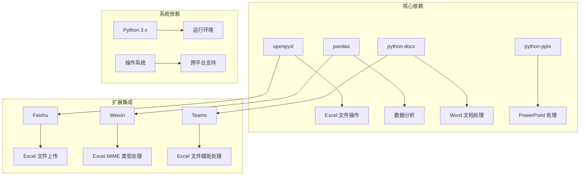
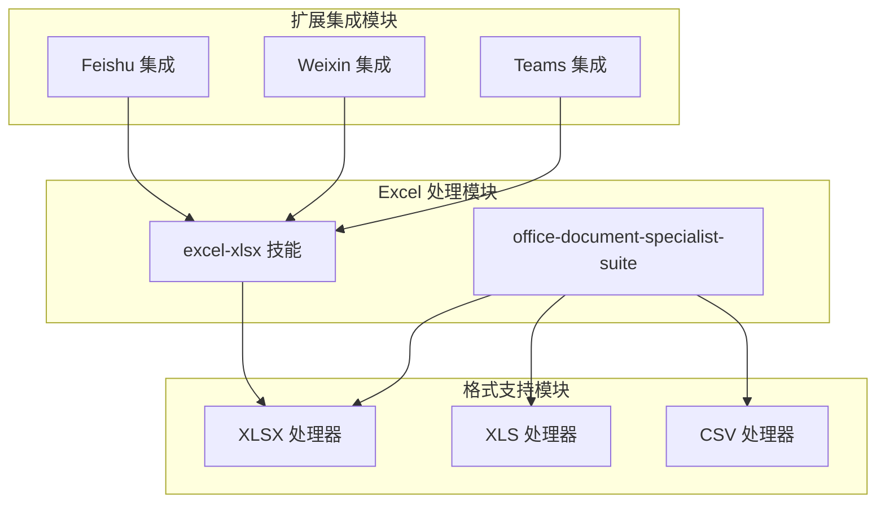

# Excel 表格处理技能

<cite>
**本文档中引用的文件**
- [excel-xlsx/SKILL.md](file://skills/excel-xlsx/SKILL.md)
- [office-document-specialist-suite/SKILL.md](file://skills/office-document-specialist-suite/SKILL.md)
- [media.ts](file://extensions/feishu/src/media.ts)
- [mime.ts](file://extensions/openclaw-weixin/src/media/mime.ts)
- [media-helpers.test.ts](file://extensions/msteams/src/media-helpers.test.ts)
- [media.test.ts](file://extensions/feishu/src/media.test.ts)
</cite>

## 目录
1. [简介](#简介)
2. [项目结构](#项目结构)
3. [核心组件](#核心组件)
4. [架构概览](#架构概览)
5. [详细组件分析](#详细组件分析)
6. [依赖关系分析](#依赖关系分析)
7. [性能考虑](#性能考虑)
8. [故障排除指南](#故障排除指南)
9. [结论](#结论)

## 简介

本文件系统性地梳理了 OpenClaw 项目中的 Excel 表格处理能力，重点分析了两个核心技能模块：`excel-xlsx` 和 `office-document-specialist-suite`。这些技能提供了从基础的 Excel 文件读写到复杂的公式计算、格式化、模板保护等全方位的处理能力。

项目中的 Excel 处理能力主要通过以下方式实现：
- 使用 `openpyxl` 库进行 XLSX 文件的创建、编辑和读取
- 使用 `pandas` 进行数据分析和 CSV 转换
- 实现了完整的 Excel 工作簿生命周期管理
- 提供了跨平台的 Excel 文件兼容性处理

## 项目结构

OpenClaw 项目采用模块化的组织方式，Excel 处理功能分布在多个层次：

**图表来源**
- [excel-xlsx/SKILL.md:1-97](file://skills/excel-xlsx/SKILL.md#L1-L97)
- [office-document-specialist-suite/SKILL.md:1-192](file://skills/office-document-specialist-suite/SKILL.md#L1-L192)

**章节来源**
- [excel-xlsx/SKILL.md:1-97](file://skills/excel-xlsx/SKILL.md#L1-L97)
- [office-document-specialist-suite/SKILL.md:1-192](file://skills/office-document-specialist-suite/SKILL.md#L1-L192)

## 核心组件

### Excel-XLSX 技能

`excel-xlsx` 技能是专门针对 Excel 文件处理的核心模块，提供了以下关键功能：

#### 主要特性
- **工作簿创建与编辑**：支持新建 Excel 工作簿和现有文件的编辑
- **公式处理**：保持公式的完整性，避免缓存值覆盖
- **格式化支持**：字体、颜色、对齐等样式设置
- **模板保护**：维护现有模板的结构和样式
- **日期处理**：正确处理 Excel 的序列号日期系统

#### 技术规范
- 支持 `.xlsx`、`.xlsm`、`.xls`、`.csv`、`.tsv` 格式
- 跨平台兼容（Linux、macOS、Windows）
- 针对大型文件的流式处理能力

**章节来源**
- [excel-xlsx/SKILL.md:15-97](file://skills/excel-xlsx/SKILL.md#L15-L97)

### Office 文档专家套件

`office-document-specialist-suite` 是一个综合性的办公文档处理工具集，其中包含 Excel 处理功能：

#### 功能范围
- **Excel 处理**：自动化报表生成、复杂格式化
- **Word 处理**：专业文档创建和编辑
- **PowerPoint 处理**：基于结构化数据的幻灯片创建
- **格式转换**：DOCX ↔ PDF、XLSX ↔ CSV 等

#### 依赖要求
- Python 3 环境
- `python-docx`、`openpyxl`、`python-pptx` 库

**章节来源**
- [office-document-specialist-suite/SKILL.md:17-33](file://skills/office-document-specialist-suite/SKILL.md#L17-L33)

## 架构概览

Excel 处理功能的整体架构采用分层设计：

**图表来源**
- [excel-xlsx/SKILL.md:21-45](file://skills/excel-xlsx/SKILL.md#L21-L45)
- [office-document-specialist-suite/SKILL.md:70-111](file://skills/office-document-specialist-suite/SKILL.md#L70-L111)

## 详细组件分析

### Excel 工作簿管理器

Excel 工作簿管理器是整个 Excel 处理系统的核心组件：

**图表来源**
- [excel-xlsx/SKILL.md:28-63](file://skills/excel-xlsx/SKILL.md#L28-L63)

#### 工作流程

Excel 文件处理遵循严格的流程控制：

**图表来源**
- [excel-xlsx/SKILL.md:28-72](file://skills/excel-xlsx/SKILL.md#L28-L72)

**章节来源**
- [excel-xlsx/SKILL.md:28-72](file://skills/excel-xlsx/SKILL.md#L28-L72)

### 公式处理引擎

公式处理是 Excel 处理的核心难点之一，系统实现了完整的公式解析和验证机制：

**图表来源**
- [excel-xlsx/SKILL.md:35-45](file://skills/excel-xlsx/SKILL.md#L35-L45)

#### 公式处理规则

系统遵循严格的公式处理原则：

1. **公式优先策略**：始终优先保持公式而非硬编码值
2. **引用准确性**：确保绝对和相对引用的正确性
3. **错误预防**：在交付前验证无任何公式错误
4. **循环引用检测**：防止循环依赖导致的计算问题

**章节来源**
- [excel-xlsx/SKILL.md:35-45](file://skills/excel-xlsx/SKILL.md#L35-L45)

### 数据类型保护机制

Excel 在数据处理过程中存在多种数据类型转换风险，系统实现了多重保护措施：

**图表来源**
- [excel-xlsx/SKILL.md:47-53](file://skills/excel-xlsx/SKILL.md#L47-L53)

**章节来源**
- [excel-xlsx/SKILL.md:47-53](file://skills/excel-xlsx/SKILL.md#L47-L53)

## 依赖关系分析

### 外部依赖关系

Excel 处理功能依赖于多个外部库和工具：

**图表来源**
- [office-document-specialist-suite/SKILL.md:27-33](file://skills/office-document-specialist-suite/SKILL.md#L27-L33)
- [media.ts:400-410](file://extensions/feishu/src/media.ts#L400-L410)
- [mime.ts:1-10](file://extensions/openclaw-weixin/src/media/mime.ts#L1-L10)

### 内部模块依赖

系统内部模块之间的依赖关系：

**图表来源**
- [excel-xlsx/SKILL.md:15-27](file://skills/excel-xlsx/SKILL.md#L15-L27)
- [office-document-specialist-suite/SKILL.md:70-111](file://skills/office-document-specialist-suite/SKILL.md#L70-L111)

**章节来源**
- [excel-xlsx/SKILL.md:15-27](file://skills/excel-xlsx/SKILL.md#L15-L27)
- [office-document-specialist-suite/SKILL.md:70-111](file://skills/office-document-specialist-suite/SKILL.md#L70-L111)

## 性能考虑

### 大文件处理优化

对于大型 Excel 文件，系统采用了多种性能优化策略：

1. **流式读取**：使用 `openpyxl` 的流式读取模式处理大文件
2. **分块处理**：将大数据集分割为更小的处理块
3. **内存管理**：及时释放不再使用的内存资源
4. **并行处理**：对独立的数据块进行并行处理

### 缓存策略

系统实现了多层次的缓存机制：

- **工作簿缓存**：缓存已加载的工作簿以提高重复访问速度
- **样式缓存**：缓存常用的样式定义以减少重复计算
- **公式缓存**：缓存计算结果以避免重复计算

## 故障排除指南

### 常见问题及解决方案

#### 公式错误处理

| 错误类型 | 描述 | 解决方案 |
|---------|------|----------|
| #REF! | 引用无效 | 检查单元格引用范围，确保目标单元格存在 |
| #DIV/0! | 除零错误 | 验证分母不为零，添加条件判断 |
| #VALUE! | 参数类型错误 | 确保函数参数类型正确，检查数据格式 |
| #NAME? | 函数名错误 | 检查函数拼写，确认函数名称有效 |

#### 数据类型问题

- **精度丢失**：使用文本格式保存超过15位的数字
- **日期显示异常**：检查日期格式设置，确保显示格式与存储格式一致
- **科学计数法**：对于标识符使用文本格式，避免自动转换

#### 性能问题

- **内存溢出**：对大文件使用流式处理，分批读取数据
- **处理缓慢**：启用并行处理，优化算法复杂度
- **磁盘空间不足**：及时清理临时文件，使用压缩存储

**章节来源**
- [excel-xlsx/SKILL.md:80-97](file://skills/excel-xlsx/SKILL.md#L80-L97)

### 调试技巧

1. **日志记录**：启用详细的日志记录以追踪处理过程
2. **单元测试**：编写针对特定场景的单元测试
3. **性能监控**：监控内存使用和处理时间
4. **错误恢复**：实现自动错误恢复机制

## 结论

OpenClaw 项目中的 Excel 表格处理技能展现了高度的专业性和完整性。通过 `excel-xlsx` 和 `office-document-specialist-suite` 两个核心技能模块，系统提供了从基础的文件操作到复杂的公式计算、格式化和模板保护的全方位能力。

### 主要优势

1. **技术栈成熟**：基于经过验证的 `openpyxl` 和 `pandas` 库
2. **功能完整**：涵盖 Excel 处理的所有关键环节
3. **质量保证**：严格的错误处理和数据保护机制
4. **扩展性强**：良好的模块化设计便于功能扩展

### 应用场景

- 企业报表自动化生成
- 数据分析和可视化
- 模板驱动的文档创建
- 跨格式的数据转换

该技能体系为用户提供了可靠、高效的 Excel 处理解决方案，能够满足从简单数据操作到复杂商业应用的各种需求。