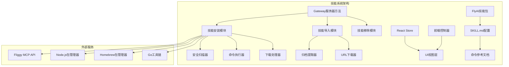
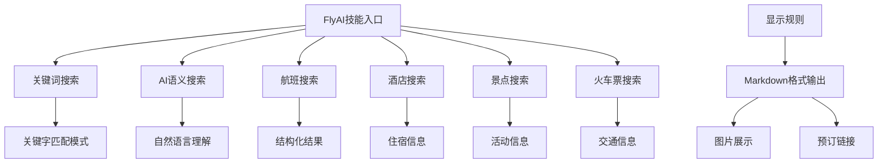
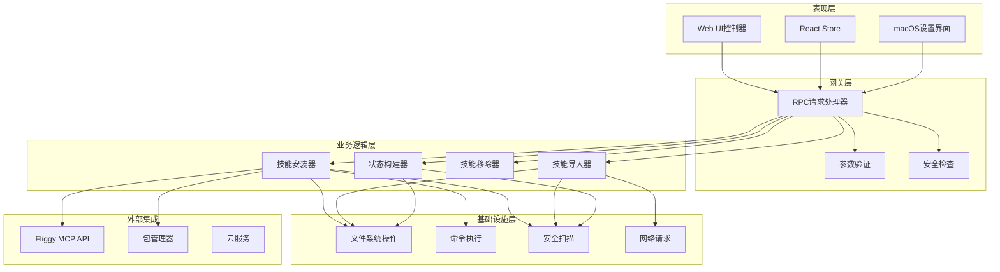
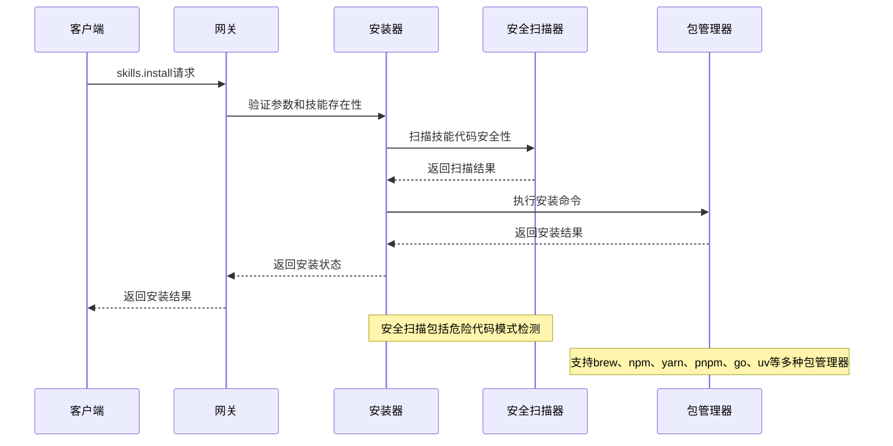
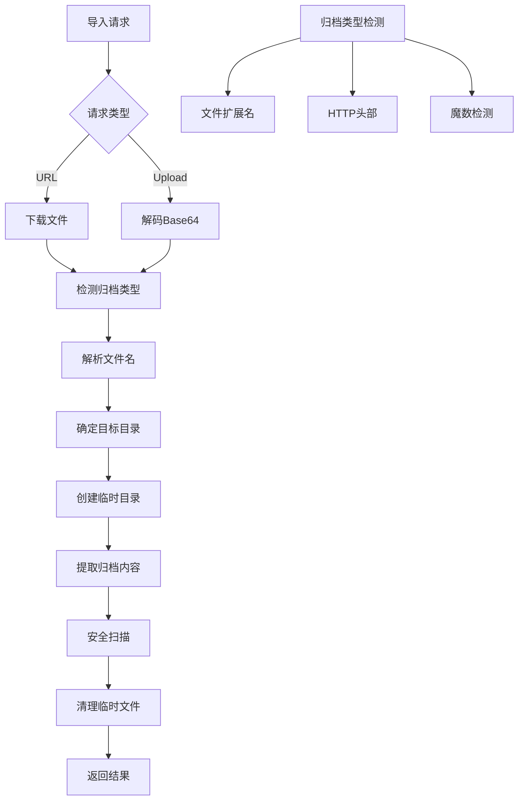
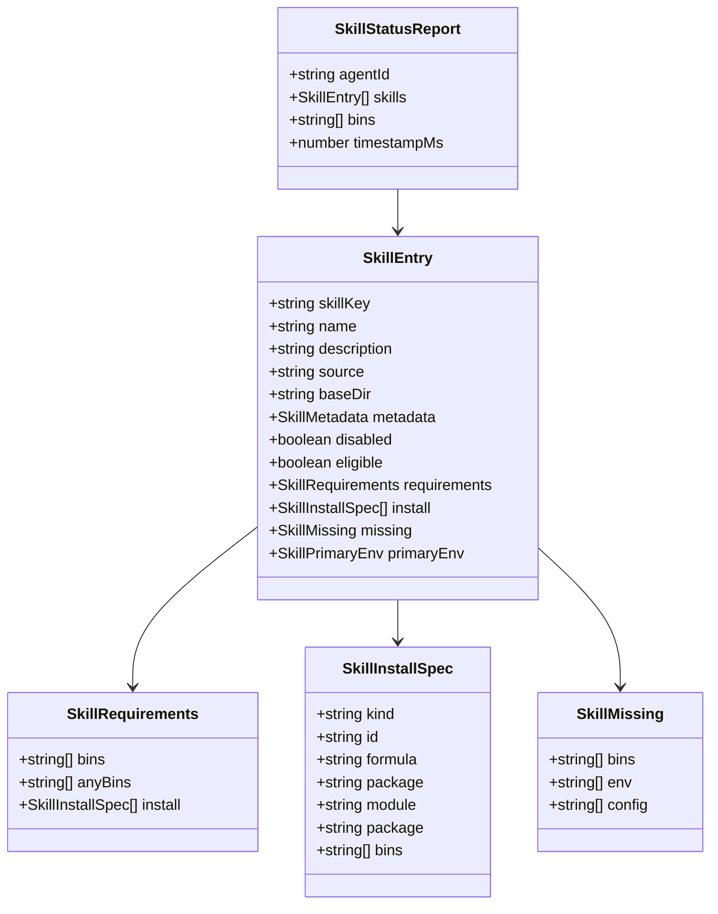
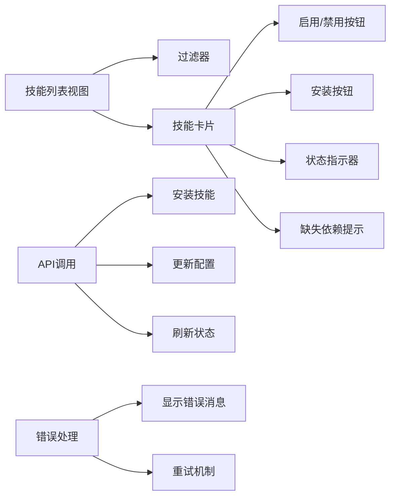
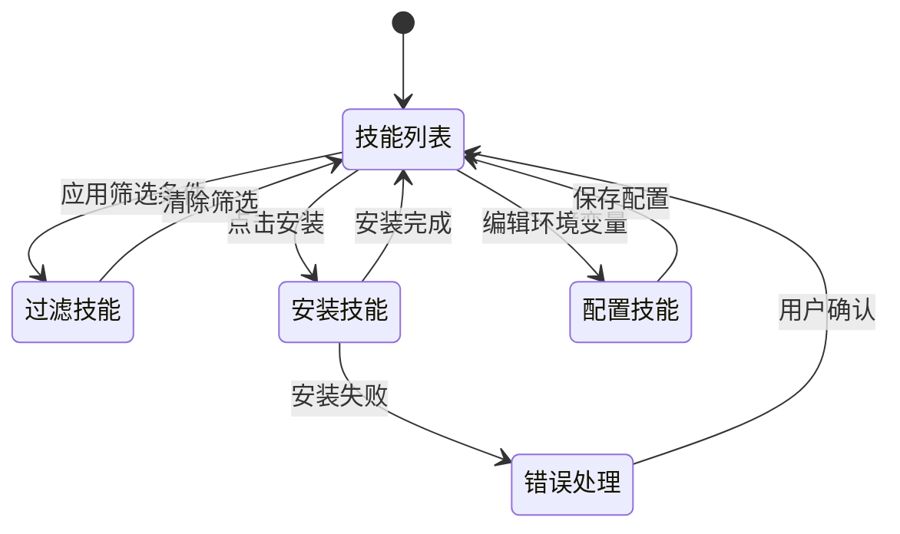
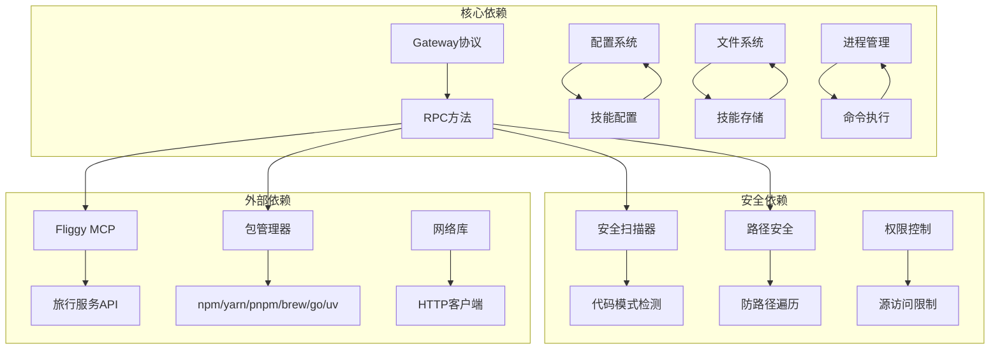

# FlyAI技能系统

<cite>
**本文档引用的文件**
- [skills.ts](file://src/gateway/server-methods/skills.ts)
- [skills-install.ts](file://src/agents/skills-install.ts)
- [skills-import.ts](file://src/agents/skills-import.ts)
- [skills-remove.ts](file://src/agents/skills-remove.ts)
- [skills.ts](file://src/agents/skills.ts)
- [SKILL.md](file://skills/flyai/SKILL.md)
- [ai-search.md](file://skills/flyai/references/ai-search.md)
- [keyword-search.md](file://skills/flyai/references/keyword-search.md)
- [search-flight.md](file://skills/flyai/references/search-flight.md)
- [search-hotel.md](file://skills/flyai/references/search-hotel.md)
- [skills.ts](file://ui/src/ui/controllers/skills.ts)
- [skills.ts](file://ui-react/src/store/skills.store.ts)
- [skills.ts](file://ui/src/ui/views/skills.ts)
- [SkillsSettings.swift](file://apps/macos/Sources/OpenClaw/SkillsSettings.swift)
</cite>

## 目录
1. [简介](#简介)
2. [项目结构](#项目结构)
3. [核心组件](#核心组件)
4. [架构概览](#架构概览)
5. [详细组件分析](#详细组件分析)
6. [依赖关系分析](#依赖关系分析)
7. [性能考虑](#性能考虑)
8. [故障排除指南](#故障排除指南)
9. [结论](#结论)

## 简介

FlyAI技能系统是OpenClaw平台中的一个核心功能模块，专门用于处理旅行、航班和酒店搜索及预订场景。该系统基于Fliggy MCP服务，提供自然语言查询能力，支持多种旅行相关的搜索和预订操作。

该技能系统具有以下特点：
- 支持多种旅行场景：航班搜索、酒店搜索、景点搜索、火车票搜索等
- 提供自然语言处理能力，理解复杂的旅行意图
- 具备安全扫描机制，确保技能代码的安全性
- 支持多种安装方式：包管理器、Node.js包、Go模块等
- 提供完整的UI界面进行技能管理和配置

## 项目结构

FlyAI技能系统在OpenClaw项目中的组织结构如下：

**图表来源**
- [skills.ts:95-446](file://src/gateway/server-methods/skills.ts#L95-L446)
- [skills-install.ts:392-471](file://src/agents/skills-install.ts#L392-L471)
- [skills-import.ts:224-366](file://src/agents/skills-import.ts#L224-L366)

**章节来源**
- [skills.ts:1-446](file://src/gateway/server-methods/skills.ts#L1-L446)
- [skills.ts:1-47](file://src/agents/skills.ts#L1-L47)

## 核心组件

### 技能管理服务器端点

技能系统的核心是Gateway服务器提供的RPC方法，这些方法通过统一的协议进行通信：

| 方法名 | 功能描述 | 参数类型 | 返回值 |
|--------|----------|----------|--------|
| `skills.status` | 获取技能状态报告 | `{ agentId?: string }` | `SkillStatusReport` |
| `skills.install` | 安装技能 | `{ name: string, installId: string, timeoutMs?: number }` | `SkillInstallResult` |
| `skills.update` | 更新技能配置 | `{ skillKey: string, enabled?: boolean, apiKey?: string, env?: Record<string,string> }` | `{ ok: boolean, skillKey: string, config: any }` |
| `skills.import` | 导入技能 | `{ kind: 'url' \| 'upload', target?: 'workspace' \| 'managed', url?: string, data?: string, filename?: string, skillName?: string, timeoutMs?: number }` | `SkillImportResult` |
| `skills.remove` | 移除技能 | `{ baseDir: string, source: string }` | `{ ok: boolean, message: string }` |

### FlyAI技能特性

FlyAI技能包提供了丰富的旅行搜索功能：

**图表来源**
- [SKILL.md:70-144](file://skills/flyai/SKILL.md#L70-L144)

**章节来源**
- [SKILL.md:1-144](file://skills/flyai/SKILL.md#L1-L144)

## 架构概览

FlyAI技能系统采用分层架构设计，确保了良好的可维护性和扩展性：

**图表来源**
- [skills.ts:95-446](file://src/gateway/server-methods/skills.ts#L95-L446)
- [skills-install.ts:392-471](file://src/agents/skills-install.ts#L392-L471)
- [skills-import.ts:224-366](file://src/agents/skills-import.ts#L224-L366)

## 详细组件分析

### 技能安装组件

技能安装组件负责处理各种类型的技能安装请求，支持多种安装方式：

**图表来源**
- [skills.ts:280-311](file://src/gateway/server-methods/skills.ts#L280-L311)
- [skills-install.ts:392-471](file://src/agents/skills-install.ts#L392-L471)

#### 安装流程复杂度分析

技能安装过程的时间复杂度主要取决于以下因素：

- **包管理器操作**: O(n) - n为依赖包数量
- **安全扫描**: O(m) - m为文件数量和代码行数
- **网络下载**: O(k) - k为文件大小
- **整体复杂度**: O(n + m + k)

**章节来源**
- [skills-install.ts:392-471](file://src/agents/skills-install.ts#L392-L471)

### 技能导入组件

技能导入组件支持从URL或上传文件导入技能包：

**图表来源**
- [skills-import.ts:224-366](file://src/agents/skills-import.ts#L224-L366)

**章节来源**
- [skills-import.ts:224-366](file://src/agents/skills-import.ts#L224-L366)

### 技能状态管理

技能状态管理组件负责构建和维护技能的完整状态报告：

**图表来源**
- [skills.ts:17-34](file://src/agents/skills.ts#L17-L34)

**章节来源**
- [skills.ts:1-47](file://src/agents/skills.ts#L1-L47)

### FlyAI技能功能详解

#### 关键词搜索功能

FlyAI的关键词搜索支持多种查询模式：

| 查询类型 | 示例 | 支持的功能 |
|----------|------|------------|
| 位置查询 | "nearby attractions", "restaurants near {POI}" | 周边景点、餐厅推荐 |
| 景点查询 | "{POI} free travel", "{POI} routes" | 景点路线规划 |
| 活动查询 | "attraction tickets", "photo tours near {POI}" | 活动门票、摄影游 |
| 目的地查询 | "destination guide", "destination hotels" | 目的地攻略、住宿推荐 |
| 娱乐体验 | "hot spring spa", "skiing" | 度假娱乐项目 |
| 团队行程 | "group tour", "custom tour" | 团体定制游 |
| 美食餐饮 | "food guide", "buffet" | 美食指南、自助餐 |
| 证件服务 | "visa", "travel insurance" | 签证、保险服务 |
| 通讯服务 | "wifi rental", "SIM card" | 通讯设备租赁 |
| 游轮服务 | "cruise", "ocean sightseeing" | 海上游轮体验 |

#### 航班搜索参数

| 参数名称 | 类型 | 必需 | 描述 | 示例值 |
|----------|------|------|------|--------|
| `--origin` | string | 是 | 出发城市或机场 | "北京" |
| `--destination` | string | 否 | 目的城市或机场 | "上海" |
| `--dep-date` | string | 否 | 出发日期 (YYYY-MM-DD) | "2026-03-15" |
| `--dep-date-start` | string | 否 | 出发日期范围开始 | "2026-03-15" |
| `--dep-date-end` | string | 否 | 出发日期范围结束 | "2026-03-20" |
| `--back-date` | string | 否 | 返回日期 | "2026-03-25" |
| `--journey-type` | number | 否 | 航程类型 | 1=直飞, 2=转机 |
| `--seat-class-name` | string | 否 | 舱位等级 | "经济舱" |
| `--transport-no` | string | 否 | 航班号 | "CA1883" |
| `--transfer-city` | string | 否 | 中转城市 | "东京" |
| `--max-price` | number | 否 | 最高价格(CNY) | 4000 |

#### 酒店搜索参数

| 参数名称 | 类型 | 必需 | 描述 | 示例值 |
|----------|------|------|------|--------|
| `--dest-name` | string | 是 | 目的地 | "杭州" |
| `--key-words` | string | 否 | 搜索关键词 | "西湖" |
| `--poi-name` | string | 否 | 周边景点名称 | "西湖" |
| `--hotel-types` | string | 否 | 酒店类型 | "酒店,民宿" |
| `--sort` | string | 否 | 排序方式 | "price_asc" |
| `--check-in-date` | string | 否 | 入住日期 | "2026-03-10" |
| `--check-out-date` | string | 否 | 离店日期 | "2026-03-12" |
| `--hotel-stars` | string | 否 | 星级范围 | "4,5" |
| `--max-price` | number | 否 | 每晚最高价格 | 800 |

**章节来源**
- [ai-search.md:1-27](file://skills/flyai/references/ai-search.md#L1-L27)
- [keyword-search.md:1-54](file://skills/flyai/references/keyword-search.md#L1-L54)
- [search-flight.md:1-87](file://skills/flyai/references/search-flight.md#L1-L87)
- [search-hotel.md:1-57](file://skills/flyai/references/search-hotel.md#L1-L57)

### 用户界面组件

#### Web UI技能管理

前端提供了完整的技能管理界面：

**图表来源**
- [skills.ts:28-193](file://ui/src/ui/views/skills.ts#L28-L193)
- [skills.ts:125-157](file://ui/src/ui/controllers/skills.ts#L125-L157)

#### macOS设置界面

macOS应用提供了专门的技能设置界面：

**图表来源**
- [SkillsSettings.swift:168-344](file://apps/macos/Sources/OpenClaw/SkillsSettings.swift#L168-L344)

**章节来源**
- [skills.ts:1-193](file://ui/src/ui/views/skills.ts#L1-L193)
- [skills.ts:125-157](file://ui/src/ui/controllers/skills.ts#L125-L157)
- [SkillsSettings.swift:111-344](file://apps/macos/Sources/OpenClaw/SkillsSettings.swift#L111-L344)

## 依赖关系分析

FlyAI技能系统与其他OpenClaw组件的依赖关系：

**图表来源**
- [skills.ts:1-38](file://src/gateway/server-methods/skills.ts#L1-L38)
- [skills-install.ts:1-17](file://src/agents/skills-install.ts#L1-L17)

**章节来源**
- [skills.ts:1-38](file://src/gateway/server-methods/skills.ts#L1-L38)
- [skills-install.ts:1-17](file://src/agents/skills-install.ts#L1-L17)

## 性能考虑

### 安装性能优化

1. **并发安装**: 支持多个技能并行安装，提高效率
2. **缓存机制**: 利用包管理器缓存减少重复下载
3. **超时控制**: 合理设置超时时间，避免长时间阻塞
4. **进度反馈**: 实时显示安装进度，提升用户体验

### 内存使用优化

1. **流式处理**: 对大型文件使用流式处理避免内存溢出
2. **垃圾回收**: 及时释放临时文件和进程资源
3. **批量操作**: 支持批量技能操作减少内存开销

### 网络性能

1. **连接复用**: 复用HTTP连接减少握手开销
2. **压缩传输**: 支持GZIP压缩减少带宽使用
3. **断点续传**: 支持大文件断点续传功能

## 故障排除指南

### 常见安装问题

| 问题类型 | 症状 | 解决方案 |
|----------|------|----------|
| 包管理器不可用 | "brew not installed" | 安装Homebrew或手动安装所需包 |
| 权限不足 | "Permission denied" | 使用sudo或调整用户权限 |
| 网络超时 | "Network timeout" | 检查网络连接或增加超时时间 |
| 依赖冲突 | "Dependency conflict" | 卸载冲突版本或使用隔离环境 |

### 安全扫描问题

1. **扫描失败**: 检查文件权限和磁盘空间
2. **误报警告**: 审核代码模式并调整扫描规则
3. **性能影响**: 调整扫描深度和忽略特定文件类型

### UI交互问题

1. **技能状态不同步**: 刷新页面或重启应用
2. **安装按钮无响应**: 检查网络连接和权限设置
3. **错误消息不明确**: 查看开发者工具控制台日志

**章节来源**
- [skills-install.ts:247-254](file://src/agents/skills-install.ts#L247-L254)
- [skills-install.ts:338-367](file://src/agents/skills-install.ts#L338-L367)

## 结论

FlyAI技能系统是OpenClaw平台中功能最完善的技能之一，它成功地将复杂的旅行搜索需求转化为简单易用的自然语言接口。该系统的设计体现了以下优势：

1. **功能完整性**: 支持多种旅行场景的搜索和预订功能
2. **用户体验**: 提供直观的UI界面和清晰的状态反馈
3. **安全性**: 内置安全扫描机制，确保技能代码的安全性
4. **可扩展性**: 模块化的架构设计便于功能扩展和维护
5. **可靠性**: 完善的错误处理和故障恢复机制

通过FlyAI技能系统，用户可以轻松地进行旅行规划和预订，大大简化了复杂的旅行服务查询过程。该系统为OpenClaw平台的技能生态系统奠定了坚实的基础，展示了如何将专业服务与AI技术有机结合，为用户提供智能化的服务体验。