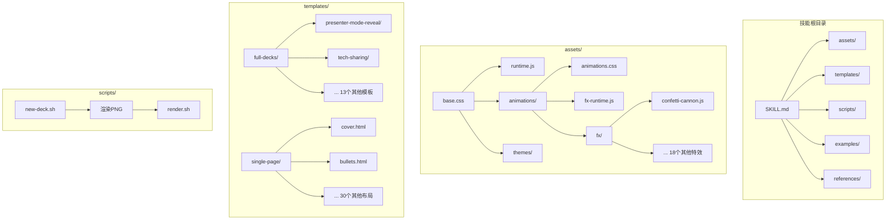
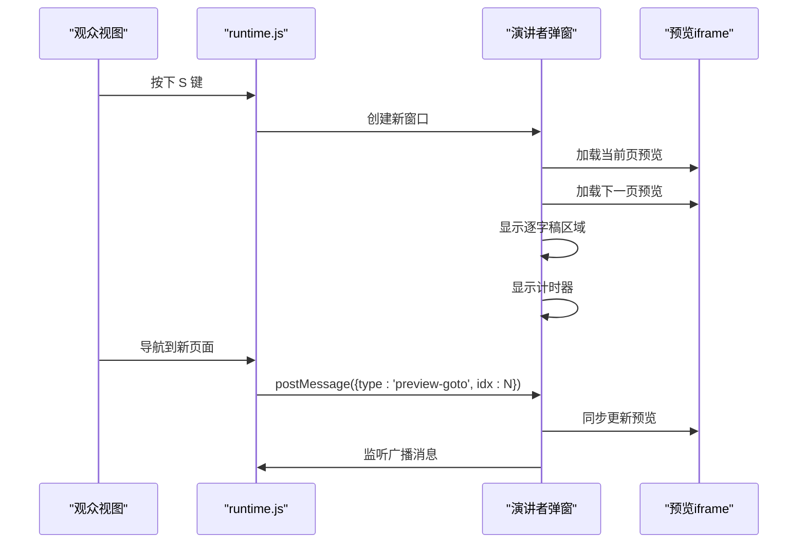
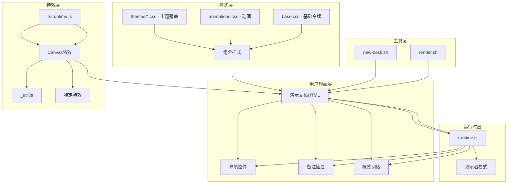
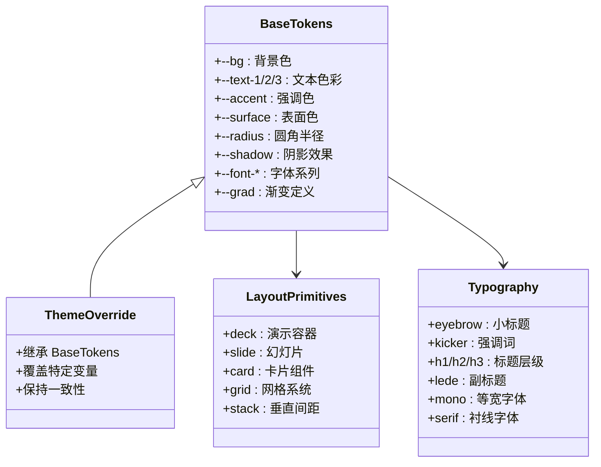
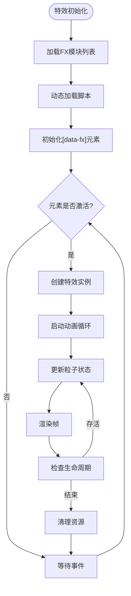
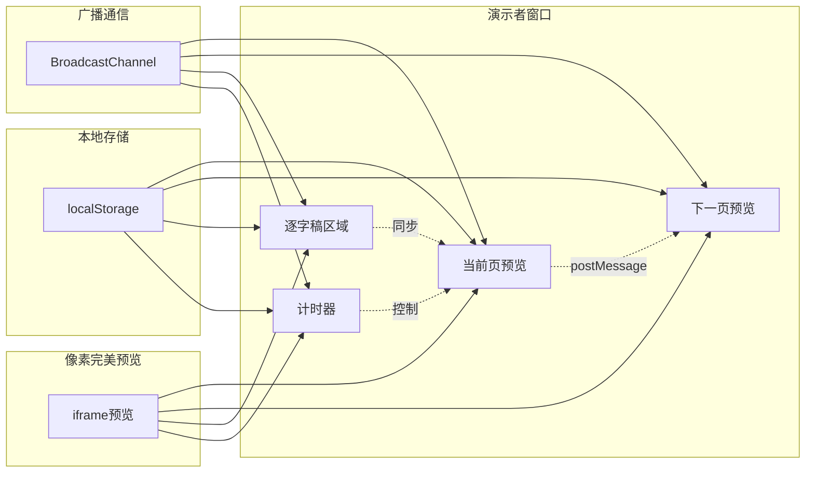
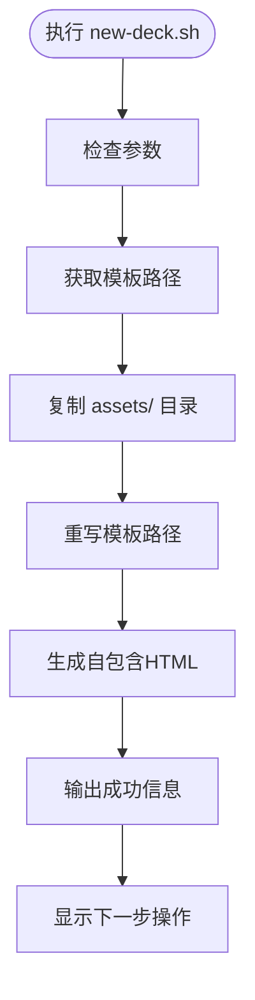
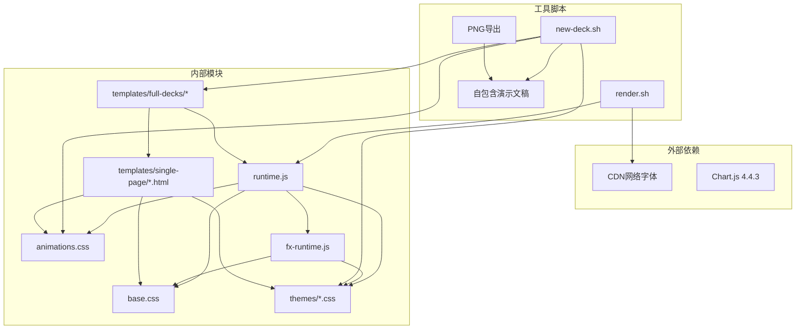

# HTML PPT Studio演示文稿技能

<cite>
**本文档引用的文件**
- [SKILL.md](file://skills/html-ppt-skill/SKILL.md)
- [runtime.js](file://skills/html-ppt-skill/assets/runtime.js)
- [base.css](file://skills/html-ppt-skill/assets/base.css)
- [animations.css](file://skills/html-ppt-skill/assets/animations/animations.css)
- [fx-runtime.js](file://skills/html-ppt-skill/assets/animations/fx-runtime.js)
- [confetti-cannon.js](file://skills/html-ppt-skill/assets/animations/fx/confetti-cannon.js)
- [themes.md](file://skills/html-ppt-skill/references/themes.md)
- [layouts.md](file://skills/html-ppt-skill/references/layouts.md)
- [new-deck.sh](file://skills/html-ppt-skill/scripts/new-deck.sh)
- [render.sh](file://skills/html-ppt-skill/scripts/render.sh)
- [demo-deck/index.html](file://skills/html-ppt-skill/examples/demo-deck/index.html)
- [presenter-mode-reveal/index.html](file://skills/html-ppt-skill/templates/full-decks/presenter-mode-reveal/index.html)
- [deck.html](file://skills/html-ppt-skill/templates/deck.html)
</cite>

## 更新摘要
**所做更改**
- 更新了资产管理和部署能力章节，反映新的自包含演示文稿生成机制
- 新增了脚本增强功能的详细说明
- 更新了演示者模式的部署能力和自包含特性
- 增强了PNG导出和渲染流程的描述

## 目录
1. [简介](#简介)
2. [项目结构](#项目结构)
3. [核心组件](#核心组件)
4. [架构概览](#架构概览)
5. [详细组件分析](#详细组件分析)
6. [资产管理和部署能力](#资产管理和部署能力)
7. [依赖关系分析](#依赖关系分析)
8. [性能考虑](#性能考虑)
9. [故障排除指南](#故障排除指南)
10. [结论](#结论)

## 简介

HTML PPT Studio是一个专业的HTML演示文稿制作技能，允许用户创建美观、可交互的静态HTML演示文稿。该项目提供了36种主题、15个完整的演示文稿模板、31种布局和27种CSS动画效果，以及20种Canvas画布特效。

该技能的核心特点包括：
- **零构建需求**：纯静态HTML/CSS/JavaScript，仅使用CDN网络字体
- **主题系统**：基于CSS变量的令牌设计系统，支持主题切换
- **演示者模式**：内置演讲者视图，包含当前页预览、下一页预览、逐字稿和计时器
- **键盘导航**：完整的键盘快捷键支持，包括主题切换、动画演示等
- **PNG导出**：支持无头Chrome渲染为PNG图像

## 项目结构

HTML PPT Studio采用模块化的文件组织结构：

**图表来源**
- [SKILL.md:165-192](file://skills/html-ppt-skill/SKILL.md#L165-L192)

**章节来源**
- [SKILL.md:165-192](file://skills/html-ppt-skill/SKILL.md#L165-L192)

## 核心组件

### 主题系统 (Theme System)

HTML PPT Studio使用基于CSS变量的令牌系统，每个主题都是一个简短的CSS文件，覆盖`assets/base.css`中定义的`:root`块中的变量。

**主题分类**：
- **明亮与平静**：minimal-white、editorial-serif、soft-pastel等
- **大胆声明**：sharp-mono、neo-brutalism、bauhaus等  
- **酷感深色**：catppuccin-mocha、dracula、tokyo-night等
- **温暖活力**：sunset-warm等
- **特效丰富**：glassmorphism、aurora、rainbow-gradient等

**章节来源**
- [themes.md:1-108](file://skills/html-ppt-skill/references/themes.md#L1-L108)

### 动画系统 (Animation System)

系统提供两种类型的动画：

1. **CSS动画**（27种）：通过`data-anim`属性或`class="anim-<name>"`应用
2. **Canvas特效**（20种）：通过`data-fx`属性应用，需要额外的运行时管理

**CSS动画示例**：
- 方向性淡入：fade-up、fade-down、fade-left、fade-right
- 特效动画：rise-in、zoom-pop、neon-glow、typewriter
- 3D效果：card-flip-3d、cube-rotate-3d、page-turn-3d

**章节来源**
- [animations.css:1-139](file://skills/html-ppt-skill/assets/animations/animations.css#L1-L139)

### 演示者模式 (Presenter Mode)

这是HTML PPT Studio最具特色的功能，提供演讲者专用视图：

**图表来源**
- [runtime.js:17-200](file://skills/html-ppt-skill/assets/runtime.js#L17-L200)

**章节来源**
- [runtime.js:17-200](file://skills/html-ppt-skill/assets/runtime.js#L17-L200)

## 架构概览

HTML PPT Studio采用分层架构设计，确保主题、布局和动画的解耦：

**图表来源**
- [base.css:1-151](file://skills/html-ppt-skill/assets/base.css#L1-L151)
- [runtime.js:17-200](file://skills/html-ppt-skill/assets/runtime.js#L17-L200)
- [fx-runtime.js:1-100](file://skills/html-ppt-skill/assets/animations/fx-runtime.js#L1-L100)

## 详细组件分析

### 基础样式系统 (Base Styles)

基础样式系统定义了完整的CSS变量令牌系统：

**图表来源**
- [base.css:1-151](file://skills/html-ppt-skill/assets/base.css#L1-L151)

**章节来源**
- [base.css:1-151](file://skills/html-ppt-skill/assets/base.css#L1-L151)

### Canvas特效系统 (Canvas FX System)

Canvas特效系统提供了丰富的视觉效果，通过动态加载机制实现：

**图表来源**
- [fx-runtime.js:1-100](file://skills/html-ppt-skill/assets/animations/fx-runtime.js#L1-L100)

**章节来源**
- [fx-runtime.js:1-100](file://skills/html-ppt-skill/assets/animations/fx-runtime.js#L1-L100)

### 演示者模式实现

演示者模式通过以下组件协同工作：

**图表来源**
- [runtime.js:111-200](file://skills/html-ppt-skill/assets/runtime.js#L111-L200)

**章节来源**
- [runtime.js:111-200](file://skills/html-ppt-skill/assets/runtime.js#L111-L200)

### 模板系统 (Template System)

HTML PPT Studio提供了15个完整的演示文稿模板，每个模板都是自包含的：

**模板类型**：
- **技术分享**：`tech-sharing/` - 适合技术演讲
- **产品发布**：`product-launch/` - 适合新产品介绍
- **演示者模式**：`presenter-mode-reveal/` - 专为演讲者设计
- **课程模块**：`course-module/` - 适合教育培训
- **周报**：`weekly-report/` - 适合团队汇报

**章节来源**
- [presenter-mode-reveal/index.html:1-188](file://skills/html-ppt-skill/templates/full-decks/presenter-mode-reveal/index.html#L1-L188)

## 资产管理和部署能力

### 自包含演示文稿生成

HTML PPT Studio的最新更新实现了真正自包含的演示文稿生成能力。新的`new-deck.sh`脚本不仅复制资产文件，还智能重写模板路径，确保生成的演示文稿完全独立。

**核心功能**：
- **资产复制**：自动复制`assets/`目录到新项目
- **路径重写**：将模板中的相对路径转换为本地相对路径
- **自包含输出**：生成的HTML文件不再依赖外部资源

**更新**：新增的资产管理和部署能力显著提升了演示文稿的便携性和独立性

**章节来源**
- [new-deck.sh:1-85](file://skills/html-ppt-skill/scripts/new-deck.sh#L1-L85)

### 脚本增强功能

#### new-deck.sh 脚本改进

新的脚本实现了更智能的资产管理和路径处理：

**图表来源**
- [new-deck.sh:60-75](file://skills/html-ppt-skill/scripts/new-deck.sh#L60-L75)

#### render.sh 脚本优化

渲染脚本现在支持更灵活的输出配置：

- **自动幻灯片计数**：支持`all`参数自动检测幻灯片数量
- **自定义输出目录**：支持指定自定义输出目录
- **跨平台兼容**：改进了Windows和macOS的路径处理

**章节来源**
- [render.sh:1-96](file://skills/html-ppt-skill/scripts/render.sh#L1-L96)

### 演示者模式部署增强

演示者模式现在支持更好的部署和共享能力：

- **独立窗口管理**：每个演示者窗口独立管理，支持多显示器环境
- **主题同步**：演示者窗口和观众窗口之间的主题同步机制
- **布局持久化**：卡片布局和尺寸自动保存到localStorage

**章节来源**
- [runtime.js:223-265](file://skills/html-ppt-skill/assets/runtime.js#L223-L265)

## 依赖关系分析

HTML PPT Studio的依赖关系相对简单，主要依赖关系如下：

**图表来源**
- [demo-deck/index.html:1-162](file://skills/html-ppt-skill/examples/demo-deck/index.html#L1-L162)
- [new-deck.sh:1-94](file://skills/html-ppt-skill/scripts/new-deck.sh#L1-L94)
- [render.sh:1-96](file://skills/html-ppt-skill/scripts/render.sh#L1-L96)

**章节来源**
- [demo-deck/index.html:1-162](file://skills/html-ppt-skill/examples/demo-deck/index.html#L1-L162)
- [new-deck.sh:1-94](file://skills/html-ppt-skill/scripts/new-deck.sh#L1-L94)
- [render.sh:1-96](file://skills/html-ppt-skill/scripts/render.sh#L1-L96)

## 性能考虑

### 加载优化

1. **延迟加载**：Canvas特效采用动态加载机制，只在需要时加载
2. **缓存策略**：主题CSS文件可以被浏览器缓存
3. **最小化依赖**：除了必要的CDN字体和Chart.js外，尽量减少外部依赖

### 运行时优化

1. **MutationObserver**：监听DOM变化，只在必要时重新初始化特效
2. **生命周期管理**：特效在幻灯片离开时自动清理，避免内存泄漏
3. **动画优化**：CSS动画使用硬件加速，Canvas动画使用requestAnimationFrame

### 渲染优化

1. **无头Chrome渲染**：使用虚拟时间预算限制渲染时间
2. **批量处理**：PNG导出时批量处理多个幻灯片
3. **路径优化**：生成相对路径，减少文件大小

## 故障排除指南

### 常见问题及解决方案

**问题1：主题切换无效**
- 检查`<body>`或`<html>`标签是否包含`data-themes`属性
- 确认`data-theme-base`指向正确的主题目录
- 验证主题CSS文件是否存在

**问题2：Canvas特效不显示**
- 确认``已正确引入
- 检查`data-fx`属性是否正确设置
- 验证浏览器是否支持Canvas

**问题3：演示者模式无法同步**
- 检查浏览器是否支持BroadcastChannel API
- 确认两个窗口在同一域名下
- 验证localStorage是否可用

**问题4：PNG导出失败**
- 确认Google Chrome已安装在默认位置
- 检查HTML文件路径是否正确
- 验证是否有足够的磁盘空间

**问题5：自包含演示文稿无法加载资产**
- 确认`assets/`目录已正确复制到输出目录
- 检查生成的HTML文件中的相对路径是否正确
- 验证文件权限和路径分隔符

**章节来源**
- [runtime.js:111-200](file://skills/html-ppt-skill/assets/runtime.js#L111-L200)
- [render.sh:14-18](file://skills/html-ppt-skill/scripts/render.sh#L14-L18)

## 结论

HTML PPT Studio是一个功能强大且设计精良的演示文稿制作技能。其核心优势包括：

1. **设计理念先进**：基于CSS变量的令牌系统，实现了真正的主题可定制性
2. **用户体验优秀**：完整的键盘导航、演示者模式和实时预览
3. **扩展性强**：模块化设计，易于添加新的主题、布局和特效
4. **性能优化**：合理的资源管理和渲染优化

**最新更新亮点**：
- **自包含演示文稿生成**：通过增强的脚本实现真正的自包含演示文稿
- **资产管理和部署能力**：提升了演示文稿的便携性和独立性
- **演示者模式增强**：改进了部署和共享能力

该技能特别适合需要高质量演示文稿的技术团队和内容创作者，能够显著提高演示文稿制作效率和质量。通过其丰富的模板系统和特效库，用户可以快速创建专业级的演示文稿，满足各种场合的需求。