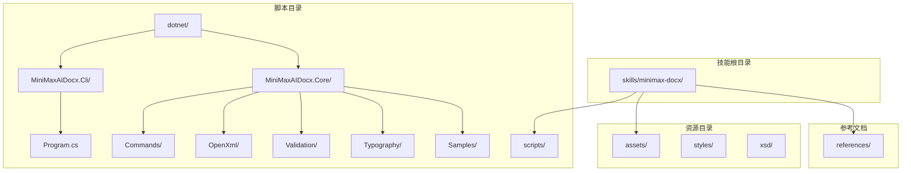
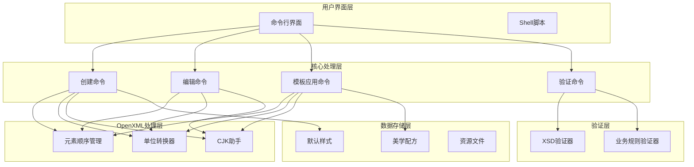
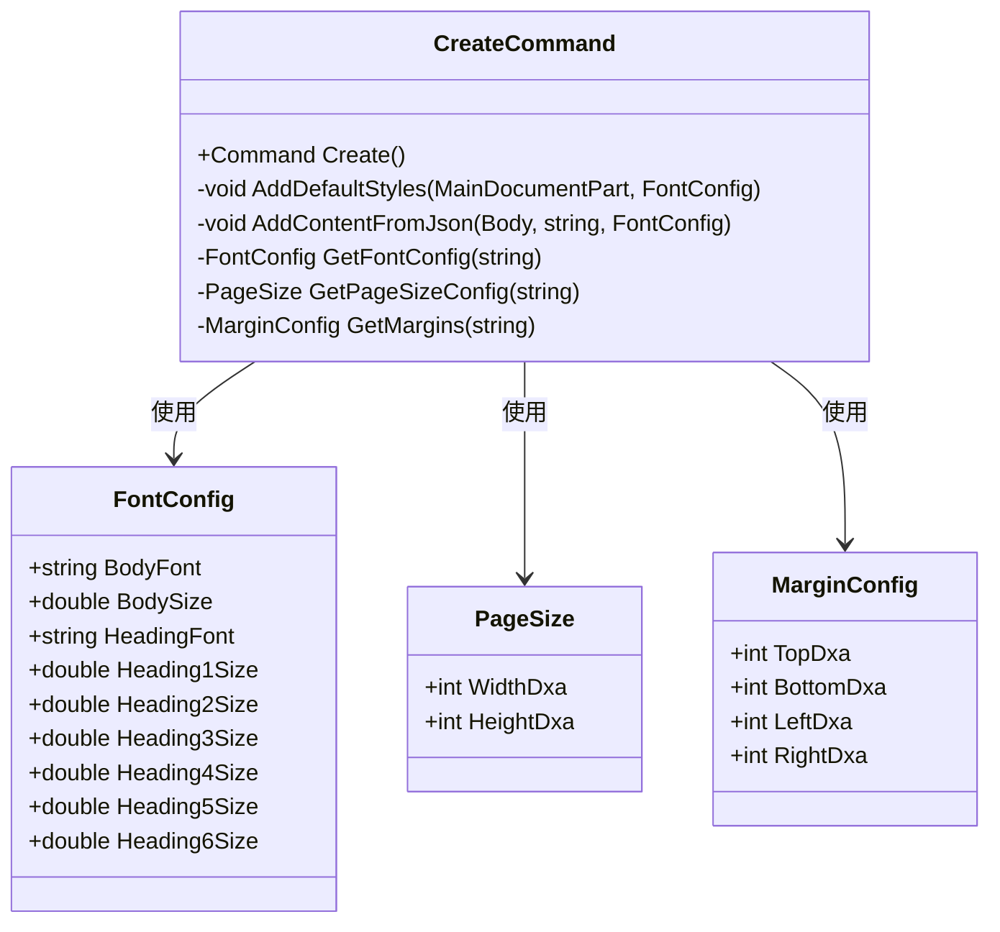
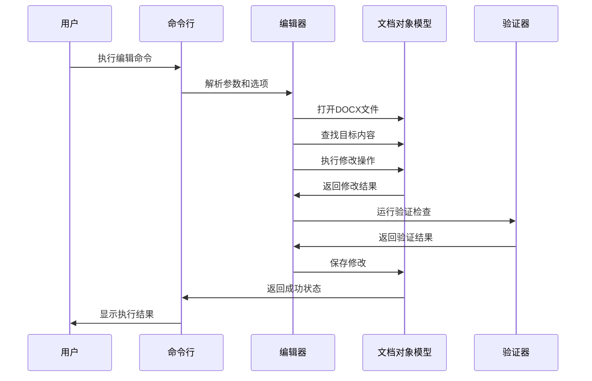
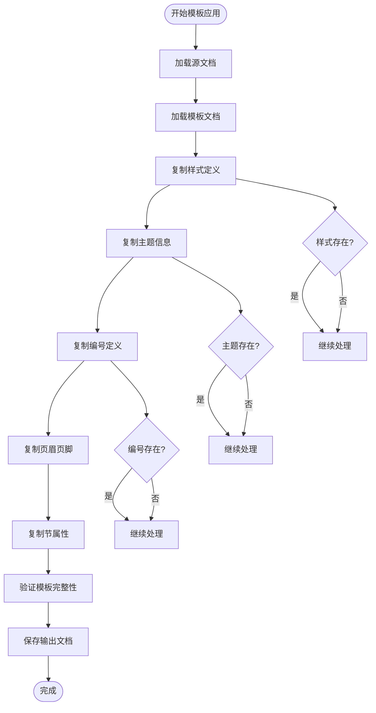
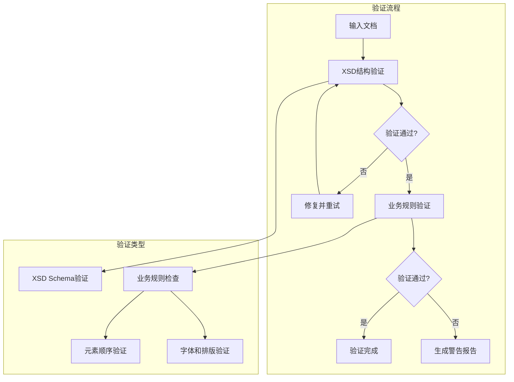
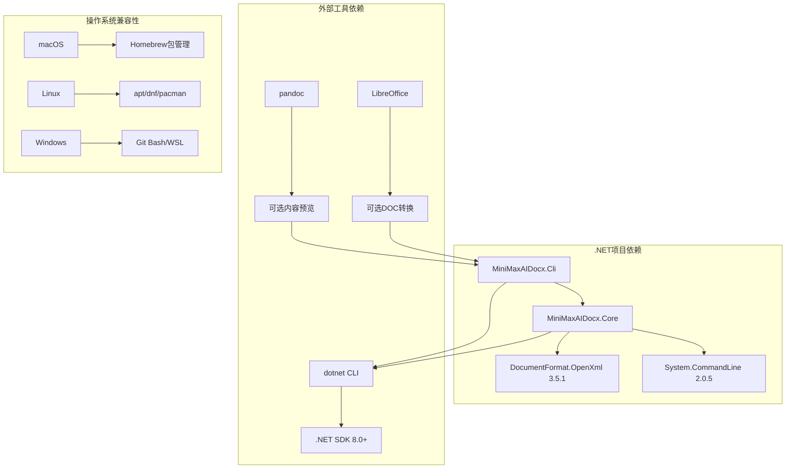
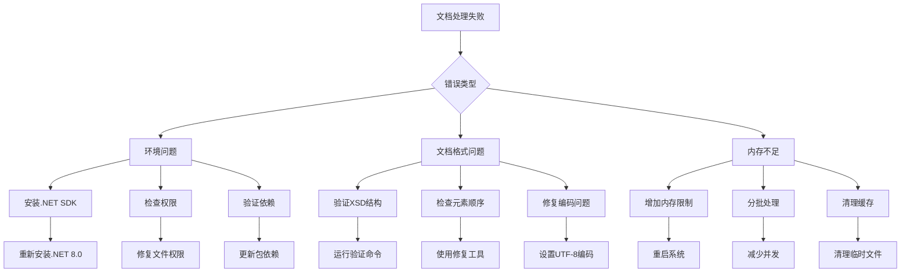

# MiniMax AI DOCX文档处理技能

<cite>
**本文档引用的文件**
- [SKILL.md](file://skills/minimax-docx/SKILL.md)
- [Program.cs](file://skills/minimax-docx/scripts/dotnet/MiniMaxAIDocx.Cli/Program.cs)
- [MiniMaxAIDocx.Core.csproj](file://skills/minimax-docx/scripts/dotnet/MiniMaxAIDocx.Core/MiniMaxAIDocx.Core.csproj)
- [CreateCommand.cs](file://skills/minimax-docx/scripts/dotnet/MiniMaxAIDocx.Core/Commands/CreateCommand.cs)
- [EditContentCommand.cs](file://skills/minimax-docx/scripts/dotnet/MiniMaxAIDocx.Core/Commands/EditContentCommand.cs)
- [ApplyTemplateCommand.cs](file://skills/minimax-docx/scripts/dotnet/MiniMaxAIDocx.Core/Commands/ApplyTemplateCommand.cs)
- [ElementOrder.cs](file://skills/minimax-docx/scripts/dotnet/MiniMaxAIDocx.Core/OpenXml/ElementOrder.cs)
- [UnitConverter.cs](file://skills/minimax-docx/scripts/dotnet/MiniMaxAIDocx.Core/OpenXml/UnitConverter.cs)
- [XsdValidator.cs](file://skills/minimax-docx/scripts/dotnet/MiniMaxAIDocx.Core/Validation/XsdValidator.cs)
- [BusinessRuleValidator.cs](file://skills/minimax-docx/scripts/dotnet/MiniMaxAIDocx.Core/Validation/BusinessRuleValidator.cs)
- [CjkHelper.cs](file://skills/minimax-docx/scripts/dotnet/MiniMaxAIDocx.Core/Typography/CjkHelper.cs)
- [AestheticRecipeSamples.cs](file://skills/minimax-docx/scripts/dotnet/MiniMaxAIDocx.Core/Samples/AestheticRecipeSamples.cs)
- [default_styles.xml](file://skills/minimax-docx/assets/styles/default_styles.xml)
- [setup.sh](file://skills/minimax-docx/scripts/setup.sh)
- [env_check.sh](file://skills/minimax-docx/scripts/env_check.sh)
</cite>

## 目录
1. [简介](#简介)
2. [项目结构](#项目结构)
3. [核心组件](#核心组件)
4. [架构概览](#架构概览)
5. [详细组件分析](#详细组件分析)
6. [依赖关系分析](#依赖关系分析)
7. [性能考虑](#性能考虑)
8. [故障排除指南](#故障排除指南)
9. [结论](#结论)

## 简介

MiniMax AI DOCX文档处理技能是一个基于OpenXML SDK (.NET)的专业Word文档创建、编辑和格式化工具集。该技能提供了三种处理管道：从零创建新文档(A管道)、编辑现有内容(B管道)、应用模板格式(C管道)。

该技能支持多种文档类型，包括报告、信函、备忘录、学术论文等，并提供完整的样式系统、字体管理、页面布局和高级排版功能。通过严格的OpenXML元素顺序规则和验证机制，确保生成的文档符合标准规范。

## 项目结构

**图表来源**
- [SKILL.md](file://skills/minimax-docx/SKILL.md)
- [Program.cs](file://skills/minimax-docx/scripts/dotnet/MiniMaxAIDocx.Cli/Program.cs)

**章节来源**
- [SKILL.md](file://skills/minimax-docx/SKILL.md)
- [setup.sh](file://skills/minimax-docx/scripts/setup.sh)

## 核心组件

### 命令行接口架构

该技能采用命令行界面设计，提供三个主要场景：

1. **创建场景 (Scenario A)**: 从零开始创建新文档
2. **编辑场景 (Scenario B)**: 修改现有文档内容
3. **模板应用场景 (Scenario C)**: 应用格式模板

每个场景都包含多个子命令，支持不同的文档处理需求。

### 核心验证系统

系统内置多层次验证机制：

- **XSD结构验证**: 基于ECMA-376标准的XML结构验证
- **业务规则验证**: 自定义业务逻辑检查
- **元素顺序验证**: OpenXML严格元素顺序要求
- **字体和排版验证**: 字体大小、边距、间距等约束

**章节来源**
- [Program.cs](file://skills/minimax-docx/scripts/dotnet/MiniMaxAIDocx.Cli/Program.cs)
- [XsdValidator.cs](file://skills/minimax-docx/scripts/dotnet/MiniMaxAIDocx.Core/Validation/XsdValidator.cs)
- [BusinessRuleValidator.cs](file://skills/minimax-docx/scripts/dotnet/MiniMaxAIDocx.Core/Validation/BusinessRuleValidator.cs)

## 架构概览

**图表来源**
- [Program.cs](file://skills/minimax-docx/scripts/dotnet/MiniMaxAIDocx.Cli/Program.cs)
- [CreateCommand.cs](file://skills/minimax-docx/scripts/dotnet/MiniMaxAIDocx.Core/Commands/CreateCommand.cs)
- [EditContentCommand.cs](file://skills/minimax-docx/scripts/dotnet/MiniMaxAIDocx.Core/Commands/EditContentCommand.cs)
- [ApplyTemplateCommand.cs](file://skills/minimax-docx/scripts/dotnet/MiniMaxAIDocx.Core/Commands/ApplyTemplateCommand.cs)

## 详细组件分析

### 创建命令 (CreateCommand)

创建命令负责从零开始构建新的DOCX文档，支持多种文档类型和自定义配置。

**图表来源**
- [CreateCommand.cs](file://skills/minimax-docx/scripts/dotnet/MiniMaxAIDocx.Core/Commands/CreateCommand.cs)

#### 支持的文档类型

| 类型 | 特点 | 默认字体 | 适用场景 |
|------|------|----------|----------|
| report | 商务报告 | Calibri 11pt | 企业报告、总结 |
| letter | 信函 | Times New Roman 12pt | 正式信件、邀请函 |
| memo | 备忘录 | Arial 11pt | 内部备忘、会议纪要 |
| academic | 学术论文 | Times New Roman 12pt | 学术论文、研究报告 |

#### 样式系统

系统提供完整的样式定义，包括：

- **标题样式**: Heading1-6，支持大纲级别设置
- **正文样式**: Normal，支持段落间距和缩进
- **特殊样式**: Title、Subtitle、Quote、Hyperlink等
- **表格样式**: TableNormal、TableGrid等预设样式

**章节来源**
- [CreateCommand.cs](file://skills/minimax-docx/scripts/dotnet/MiniMaxAIDocx.Core/Commands/CreateCommand.cs)

### 编辑命令 (EditContentCommand)

编辑命令提供精确的内容修改能力，保持现有格式不变。

**图表来源**
- [EditContentCommand.cs](file://skills/minimax-docx/scripts/dotnet/MiniMaxAIDocx.Core/Commands/EditContentCommand.cs)

#### 支持的编辑操作

| 操作类型 | 命令 | 功能描述 | 使用场景 |
|----------|------|----------|----------|
| 文本替换 | replace-text | 替换指定文本内容 | 通用文本修改 |
| 表格填充 | fill-table | 从CSV数据填充表格 | 数据报表、统计表格 |
| 段落插入 | insert-paragraph | 在指定位置插入新段落 | 结构性内容添加 |
| 字段更新 | update-field | 更新文档属性字段 | 元数据修改 |
| 占位符填充 | fill-placeholders | 批量替换占位符 | 模板化内容生成 |
| 占位符列表 | list-placeholders | 列出所有占位符 | 内容审查 |

**章节来源**
- [EditContentCommand.cs](file://skills/minimax-docx/scripts/dotnet/MiniMaxAIDocx.Core/Commands/EditContentCommand.cs)

### 模板应用命令 (ApplyTemplateCommand)

模板应用命令负责将格式模板应用到源文档，同时保留内容。

**图表来源**
- [ApplyTemplateCommand.cs](file://skills/minimax-docx/scripts/dotnet/MiniMaxAIDocx.Core/Commands/ApplyTemplateCommand.cs)

#### 模板应用策略

| 应用组件 | 处理方式 | 作用范围 |
|----------|----------|----------|
| 样式定义 | 完整替换 | 所有段落和字符样式 |
| 主题信息 | 完整替换 | 颜色方案、字体主题 |
| 编号定义 | ID映射重定向 | 重新关联现有编号引用 |
| 页眉页脚 | 关系ID重映射 | 维护图像和其他嵌入内容 |
| 节属性 | 属性值复制 | 页面尺寸、边距、分栏设置 |

**章节来源**
- [ApplyTemplateCommand.cs](file://skills/minimax-docx/scripts/dotnet/MiniMaxAIDocx.Core/Commands/ApplyTemplateCommand.cs)

### 验证系统

系统提供多层验证确保文档质量：

**图表来源**
- [XsdValidator.cs](file://skills/minimax-docx/scripts/dotnet/MiniMaxAIDocx.Core/Validation/XsdValidator.cs)
- [BusinessRuleValidator.cs](file://skills/minimax-docx/scripts/dotnet/MiniMaxAIDocx.Core/Validation/BusinessRuleValidator.cs)

#### 验证规则

| 验证类别 | 检查项目 | 阈值/标准 | 错误级别 |
|----------|----------|-----------|----------|
| 结构验证 | 元素顺序 | ECMA-376标准 | 错误 |
| 结构验证 | 必需元素 | 完整性检查 | 错误 |
| 结构验证 | 关系引用 | 引用一致性 | 错误 |
| 格式验证 | 边距范围 | 0.25-3英寸 | 警告 |
| 格式验证 | 字体大小 | 8-72pt范围 | 警告 |
| 格式验证 | 标题层级 | 连续性检查 | 警告 |
| 格式验证 | 表格宽度 | 内容宽度匹配 | 警告 |

**章节来源**
- [XsdValidator.cs](file://skills/minimax-docx/scripts/dotnet/MiniMaxAIDocx.Core/Validation/XsdValidator.cs)
- [BusinessRuleValidator.cs](file://skills/minimax-docx/scripts/dotnet/MiniMaxAIDocx.Core/Validation/BusinessRuleValidator.cs)

## 依赖关系分析

**图表来源**
- [MiniMaxAIDocx.Core.csproj](file://skills/minimax-docx/scripts/dotnet/MiniMaxAIDocx.Core/MiniMaxAIDocx.Core.csproj)
- [setup.sh](file://skills/minimax-docx/scripts/setup.sh)

### 核心库依赖

| 依赖项 | 版本 | 用途 | 必需性 |
|--------|------|------|--------|
| DocumentFormat.OpenXml | 3.5.1 | OpenXML文档处理 | 必需 |
| System.CommandLine | 2.0.5 | 命令行解析 | 必需 |
| Microsoft.NET.Sdk | net8.0 | .NET开发框架 | 必需 |
| NuGet包管理器 | 自动 | 依赖包下载 | 必需 |

### 环境要求

| 系统 | 最低要求 | 推荐配置 |
|------|----------|----------|
| macOS | macOS 10.15+ | macOS 11.0+ |
| Linux | Ubuntu 18.04+ | Ubuntu 20.04+ |
| Windows | Windows 10 | Windows 11 |
| .NET | 8.0+ | 8.0+ |
| 内存 | 4GB | 8GB+ |
| 磁盘空间 | 500MB | 1GB+ |

**章节来源**
- [MiniMaxAIDocx.Core.csproj](file://skills/minimax-docx/scripts/dotnet/MiniMaxAIDocx.Core/MiniMaxAIDocx.Core.csproj)
- [setup.sh](file://skills/minimax-docx/scripts/setup.sh)
- [env_check.sh](file://skills/minimax-docx/scripts/env_check.sh)

## 性能考虑

### 文档处理优化

1. **内存管理**: 使用流式处理避免大文档内存溢出
2. **增量更新**: 只修改必要的部分，保持其他内容不变
3. **批量操作**: 支持批量替换和批量填充操作
4. **缓存机制**: 缓存常用样式和配置信息

### 处理效率

| 操作类型 | 处理速度 | 内存使用 | 适用场景 |
|----------|----------|----------|----------|
| 小文档创建 | 快速 | 低 | 简单报告、快速草稿 |
| 中等文档编辑 | 中等 | 中等 | 复杂文档修改、批量处理 |
| 大文档模板应用 | 较慢 | 高 | 长篇文档格式化 |
| 多文档批量处理 | 可并行 | 中等 | 批量文档标准化 |

### 性能优化建议

1. **合理使用缓存**: 对重复使用的样式和配置进行缓存
2. **分批处理**: 大量文档处理时采用分批策略
3. **异步操作**: 支持异步处理提高响应性
4. **资源池管理**: 管理OpenXML文档对象生命周期

## 故障排除指南

### 常见问题及解决方案

### 环境诊断

#### 必需依赖检查

| 依赖项 | 检查命令 | 期望输出 | 状态判断 |
|--------|----------|----------|----------|
| dotnet CLI | `dotnet --version` | 8.0.x | ≥8.0为正常 |
| NuGet包 | `dotnet restore` | 成功 | 无错误消息 |
| OpenXML SDK | `dotnet build` | 成功 | 无编译错误 |
| 脚本权限 | `ls -la scripts/*.sh` | -rwxr-xr-x | 可执行权限 |

#### 可选依赖检查

| 工具 | 检查命令 | 作用 | 建议 |
|------|----------|------|------|
| pandoc | `pandoc --version` | 文档预览 | 提升用户体验 |
| soffice | `soffice --version` | DOC转换 | 扩展格式支持 |
| zip/unzip | `which zip` | 压缩支持 | 提高处理效率 |

### 错误处理机制

系统提供多层次的错误处理：

1. **语法错误**: XSD验证失败，显示具体位置
2. **逻辑错误**: 业务规则违反，提供修复建议
3. **运行时错误**: 文件访问失败，检查权限和路径
4. **系统错误**: 内存不足，提示优化策略

**章节来源**
- [env_check.sh](file://skills/minimax-docx/scripts/env_check.sh)
- [XsdValidator.cs](file://skills/minimax-docx/scripts/dotnet/MiniMaxAIDocx.Core/Validation/XsdValidator.cs)
- [BusinessRuleValidator.cs](file://skills/minimax-docx/scripts/dotnet/MiniMaxAIDocx.Core/Validation/BusinessRuleValidator.cs)

## 结论

MiniMax AI DOCX文档处理技能是一个功能完整、架构清晰的专业文档处理工具集。其特点包括：

### 核心优势

1. **专业级功能**: 基于OpenXML SDK，支持复杂的文档结构和格式
2. **严格的质量控制**: 多层次验证确保文档质量
3. **灵活的处理模式**: 支持从零创建、编辑修改、模板应用三种模式
4. **跨平台兼容**: 支持macOS、Linux、Windows等多种操作系统
5. **完善的生态系统**: 包含验证工具、样式系统、示例代码等

### 技术特色

- **元素顺序严格控制**: 遵循ECMA-376标准，防止文档损坏
- **智能验证系统**: 自动检测和修复常见问题
- **丰富的样式库**: 提供多种预设样式和美学配方
- **CJK语言支持**: 专门的中日韩字体和排版优化
- **批量处理能力**: 支持大规模文档处理需求

### 应用价值

该技能特别适用于需要高质量文档生成的企业应用场景，如：

- 企业报告和财务报表
- 法律合同和合规文档
- 学术论文和研究资料
- 产品说明书和技术文档
- 市场营销材料和演示文稿

通过严格的标准化处理流程和质量保证机制，确保生成的文档既美观又实用，满足各种正式场合的使用需求。