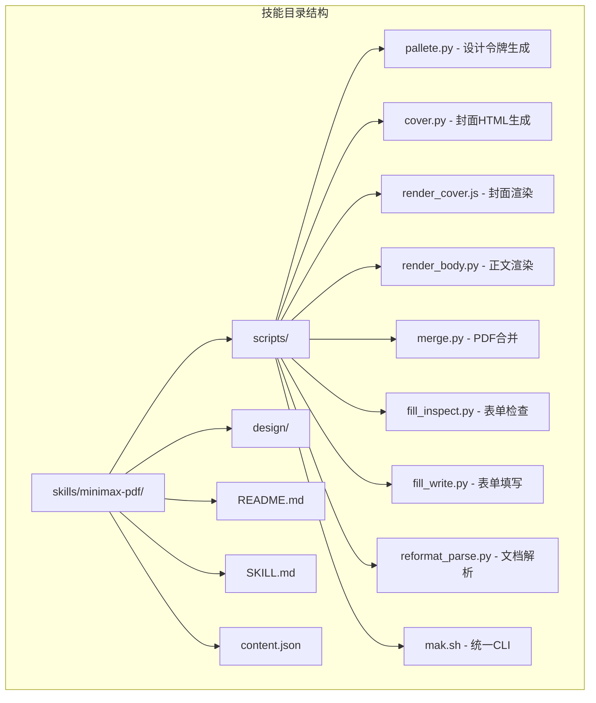
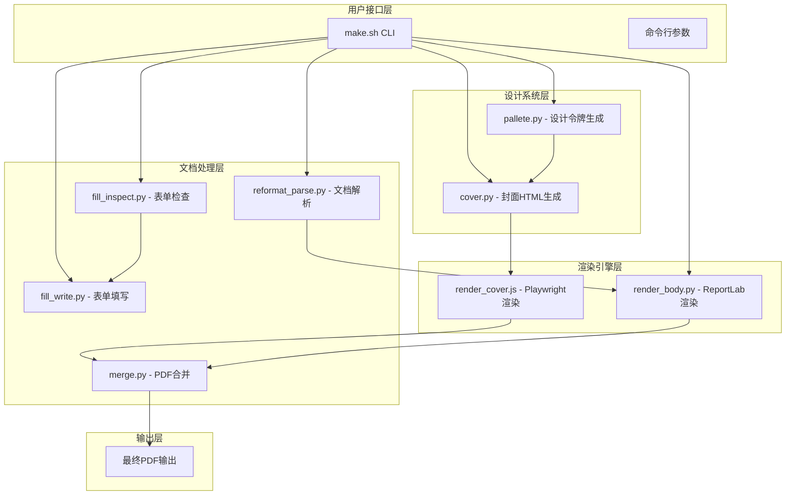
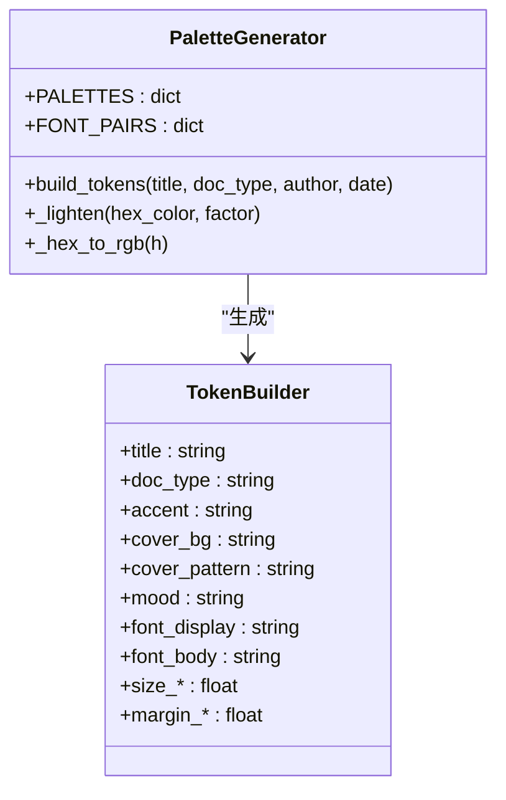
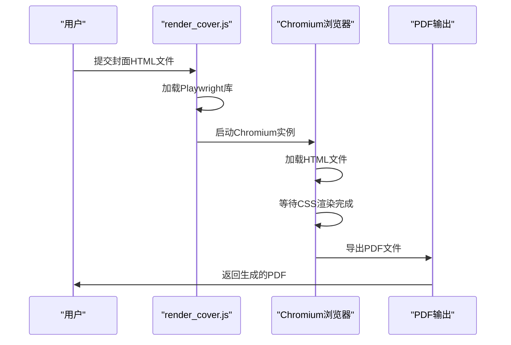
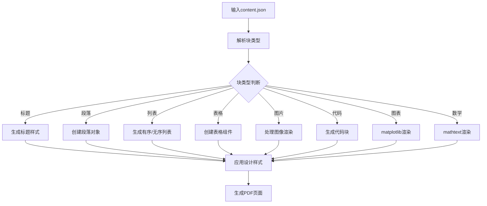
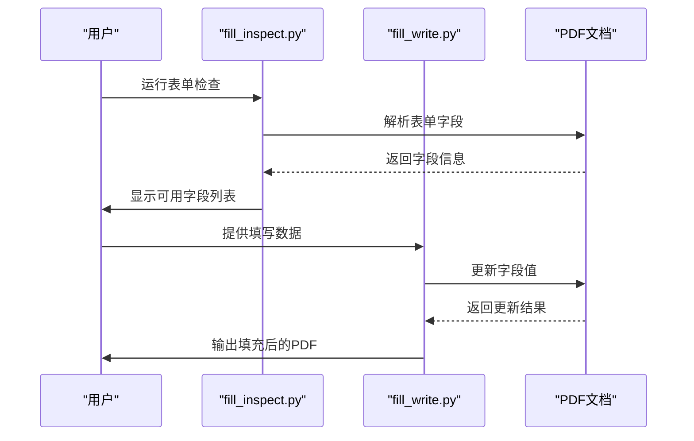
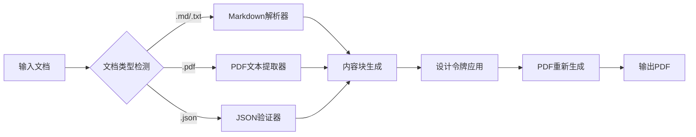
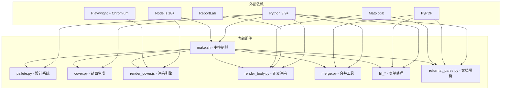

# MiniMax AI PDF文档处理技能

<cite>
**本文档引用的文件**
- [SKILL.md](file://skills/minimax-pdf/SKILL.md)
- [make.sh](file://skills/minimax-pdf/scripts/make.sh)
- [palette.py](file://skills/minimax-pdf/scripts/palette.py)
- [cover.py](file://skills/minimax-pdf/scripts/cover.py)
- [render_cover.js](file://skills/minimax-pdf/scripts/render_cover.js)
- [render_body.py](file://skills/minimax-pdf/scripts/render_body.py)
- [merge.py](file://skills/minimax-pdf/scripts/merge.py)
- [fill_inspect.py](file://skills/minimax-pdf/scripts/fill_inspect.py)
- [fill_write.py](file://skills/minimax-pdf/scripts/fill_write.py)
- [reformat_parse.py](file://skills/minimax-pdf/scripts/reformat_parse.py)
- [content.json](file://skills/minimax-pdf/content.json)
</cite>

## 目录
1. [简介](#简介)
2. [项目结构](#项目结构)
3. [核心组件](#核心组件)
4. [架构概览](#架构概览)
5. [详细组件分析](#详细组件分析)
6. [依赖关系分析](#依赖关系分析)
7. [性能考虑](#性能考虑)
8. [故障排除指南](#故障排除指南)
9. [结论](#结论)

## 简介

MiniMax AI PDF文档处理技能是一个功能强大的PDF生成和处理系统，专注于创建视觉上精美的PDF文档。该技能提供了三种主要工作流程：从零创建新文档（CREATE）、填写现有PDF表单字段（FILL）和重新格式化现有文档（REFORMAT）。

该系统采用基于令牌的设计管道，确保每个设计决策都根植于文档类型和内容，而非通用模板。通过token-based设计系统，颜色、排版和间距从文档类型中推导出来，并贯穿每一页，输出符合打印标准的高质量PDF。

## 项目结构

MiniMax PDF技能采用模块化架构，包含以下核心组件：

**图表来源**
- [make.sh:1-525](file://skills/minimax-pdf/scripts/make.sh#L1-L525)
- [SKILL.md:1-210](file://skills/minimax-pdf/SKILL.md#L1-L210)

**章节来源**
- [SKILL.md:1-210](file://skills/minimax-pdf/SKILL.md#L1-L210)
- [make.sh:1-525](file://skills/minimax-pdf/scripts/make.sh#L1-L525)

## 核心组件

### 设计令牌系统

设计令牌系统是整个PDF生成管道的核心，负责从文档元数据推导出完整的视觉设计规范：

- **颜色方案**：基于文档类型自动选择主色调、浅色强调色、文本颜色等
- **字体组合**：为封面和正文分别选择合适的字体对
- **封面模式**：根据文档类型选择相应的视觉模式（全 bleed、分割面板、极简等）
- **排版参数**：定义标题大小、段落间距、边距等排版规范

### 多种工作流程支持

系统提供三种主要的工作流程：

1. **CREATE流程**：从零开始创建新文档，完整执行设计令牌生成→封面渲染→正文渲染→PDF合并
2. **FILL流程**：检查并填写现有PDF表单字段，保持原始布局不变
3. **REFORMAT流程**：解析现有文档内容，应用设计系统重新生成PDF

**章节来源**
- [palette.py:1-522](file://skills/minimax-pdf/scripts/palette.py#L1-L522)
- [SKILL.md:39-186](file://skills/minimax-pdf/SKILL.md#L39-L186)

## 架构概览

MiniMax PDF技能采用分层架构设计，确保每个组件职责明确且可独立扩展：

**图表来源**
- [make.sh:492-525](file://skills/minimax-pdf/scripts/make.sh#L492-L525)
- [palette.py:468-522](file://skills/minimax-pdf/scripts/palette.py#L468-L522)
- [render_cover.js:53-120](file://skills/minimax-pdf/scripts/render_cover.js#L53-L120)
- [render_body.py:1-800](file://skills/minimax-pdf/scripts/render_body.py#L1-L800)
- [merge.py:31-79](file://skills/minimax-pdf/scripts/merge.py#L31-L79)

## 详细组件分析

### 设计令牌生成器（palette.py）

设计令牌生成器是整个系统的创意核心，负责将抽象的文档元数据转换为具体的视觉设计规范：

**图表来源**
- [palette.py:394-466](file://skills/minimax-pdf/scripts/palette.py#L394-L466)

设计令牌生成器支持15种不同的文档类型，每种类型都有独特的色彩方案、字体组合和视觉模式：

| 文档类型 | 色彩方案 | 字体组合 | 视觉特征 |
|---------|---------|---------|---------|
| report | 深蓝灰背景，钢蓝色强调 | Playfair Display + IBM Plex Sans | 权威正式，点阵纹理 |
| proposal | 深炭灰色背景，灰蓝强调 | Syne + Nunito Sans | 自信稳重，左右分割 |
| resume | 白色背景，深海军蓝强调 | DM Serif Display + DM Sans | 干净简洁，首字强调 |
| portfolio | 近黑色背景，冷灰强调 | Fraunces + Inter | 表达力强，径向光晕 |
| academic | 温暖白色背景，经典海军蓝强调 | EB Garamond + Source Sans 3 | 学术严谨，古典风格 |

**章节来源**
- [palette.py:21-220](file://skills/minimax-pdf/scripts/palette.py#L21-L220)

### 封面渲染系统

封面渲染系统采用HTML+CSS+JavaScript的混合架构，确保跨平台一致性和高质量输出：

**图表来源**
- [render_cover.js:54-120](file://skills/minimax-pdf/scripts/render_cover.js#L54-L120)

系统支持8种不同的封面模式，每种模式都有独特的视觉语言：

1. **Full Bleed模式**：全页面背景纹理，适合报告类文档
2. **Split模式**：左右分割布局，适合提案文档
3. **Typographic模式**：文字主导设计，适合简历和学术文档
4. **Minimal模式**：极简主义，8像素强调条和大标题
5. **Stripe模式**：水平条纹分层，具有报纸风格
6. **Diagonal模式**：对角线分割，现代几何美学
7. **Frame模式**：经典框架边框，适合正式文档
8. **Terminal模式**：技术风格，等宽字体配绿色强调

**章节来源**
- [cover.py:77-800](file://skills/minimax-pdf/scripts/cover.py#L77-L800)
- [render_cover.js:1-120](file://skills/minimax-pdf/scripts/render_cover.js#L1-L120)

### 正文渲染引擎

正文渲染引擎基于ReportLab构建，专门处理复杂的文档布局和内容：

**图表来源**
- [render_body.py:642-800](file://skills/minimax-pdf/scripts/render_body.py#L642-L800)

系统支持25种不同的内容块类型，每种都有特定的渲染逻辑：

| 块类型 | 功能描述 | 特殊特性 |
|-------|---------|---------|
| h1/h2/h3 | 标题层级 | h1自动添加强调横线 |
| body | 正文段落 | 支持两端对齐和内联标记 |
| bullet | 无序列表 | • 前缀和缩进处理 |
| numbered | 有序列表 | 自动编号和计数器管理 |
| callout | 强调框 | 左侧强调色条和背景 |
| table | 数据表格 | 交替行颜色和表头样式 |
| image | 内嵌图像 | 宽度自适应和居中对齐 |
| figure | 带编号图像 | 自动生成Figure N: 标签 |
| code | 代码块 | 等宽字体和左侧强调条 |
| math | 数学公式 | matplotlib mathtext渲染 |
| chart | 图表 | 柱状图、折线图、饼图 |
| flowchart | 流程图 | 节点和连接线绘制 |
| bibliography | 参考文献 | 编号悬挂缩进格式 |
| divider | 分隔线 | 全宽强调色线 |
| caption | 小字说明 | 柔和颜色和居中对齐 |
| pagebreak | 强制分页 | 页面中断符 |
| spacer | 垂直间距 | 可配置的pt值 |

**章节来源**
- [render_body.py:1-800](file://skills/minimax-pdf/scripts/render_body.py#L1-L800)

### 表单处理系统

表单处理系统提供完整的PDF表单检查和填写功能：

**图表来源**
- [fill_inspect.py:130-160](file://skills/minimax-pdf/scripts/fill_inspect.py#L130-L160)
- [fill_write.py:147-194](file://skills/minimax-pdf/scripts/fill_write.py#L147-L194)

系统支持四种主要的表单字段类型：

1. **文本字段（Text）**：支持任意字符串输入
2. **复选框（Checkbox）**：布尔值（true/false）
3. **下拉框（Dropdown）**：必须匹配预定义的选择值
4. **单选按钮（Radio）**：必须匹配单选按钮的内部值

**章节来源**
- [fill_inspect.py:1-201](file://skills/minimax-pdf/scripts/fill_inspect.py#L1-L201)
- [fill_write.py:1-243](file://skills/minimax-pdf/scripts/fill_write.py#L1-L243)

### 文档重构系统

文档重构系统能够将现有文档转换为content.json格式，然后应用设计系统重新生成PDF：

**图表来源**
- [reformat_parse.py:287-313](file://skills/minimax-pdf/scripts/reformat_parse.py#L287-L313)

系统支持三种输入格式的最佳实践：

1. **Markdown格式**：支持标题、列表、表格、代码块等标准Markdown元素
2. **纯文本格式**：通过启发式算法识别标题和段落
3. **PDF格式**：提取文本内容并进行最佳努力的格式重建

**章节来源**
- [reformat_parse.py:1-375](file://skills/minimax-pdf/scripts/reformat_parse.py#L1-L375)

## 依赖关系分析

MiniMax PDF技能的依赖关系呈现清晰的层次结构：

**图表来源**
- [make.sh:68-127](file://skills/minimax-pdf/scripts/make.sh#L68-L127)
- [SKILL.md:196-203](file://skills/minimax-pdf/SKILL.md#L196-L203)

**章节来源**
- [make.sh:68-157](file://skills/minimax-pdf/scripts/make.sh#L68-L157)
- [SKILL.md:196-210](file://skills/minimax-pdf/SKILL.md#L196-L210)

## 性能考虑

MiniMax PDF技能在设计时充分考虑了性能优化：

### 内存管理
- 使用临时目录隔离中间文件，避免内存泄漏
- PDF渲染后及时清理临时文件
- 流式处理大型文档，避免一次性加载到内存

### 渲染优化
- 封面渲染使用Playwright的异步渲染机制
- 正文渲染采用ReportLab的高效PDF生成
- 图表和数学公式的渲染使用matplotlib的Agg后端

### 依赖管理
- 自动检测和安装缺失的依赖项
- 支持多种安装方式（pip、npm全局安装）
- 降级策略：缺少matplotlib时自动禁用高级功能

## 故障排除指南

### 常见问题及解决方案

**依赖安装问题**
- 症状：运行`make.sh check`显示缺少依赖
- 解决：运行`make.sh fix`自动安装缺失的包
- 预防：确保Python和Node.js环境正确配置

**封面渲染失败**
- 症状：封面PDF为空或空白
- 解决：检查Chrome浏览器是否正确安装，运行`npx playwright install chromium`
- 预防：确保网络连接正常以下载Chromium

**表单填写错误**
- 症状：表单字段值未正确填写
- 解决：先运行`fill_inspect.py`检查字段名称，确保值格式正确
- 预防：使用正确的字段类型和值格式

**中文显示问题**
- 症状：中文字符显示为方块或乱码
- 解决：系统会自动注册CJK字体，如失败则使用内置CID字体
- 预防：确保系统有可用的中文字体

**章节来源**
- [make.sh:129-157](file://skills/minimax-pdf/scripts/make.sh#L129-L157)
- [render_cover.js:38-51](file://skills/minimax-pdf/scripts/render_cover.js#L38-L51)
- [fill_inspect.py:162-201](file://skills/minimax-pdf/scripts/fill_inspect.py#L162-L201)

## 结论

MiniMax AI PDF文档处理技能是一个功能完整、设计精良的PDF生成系统。它通过创新的token-based设计管道，实现了从概念到成品的完整自动化流程。

该技能的主要优势包括：

1. **设计理念先进**：基于文档类型和内容的动态设计系统，而非静态模板
2. **功能全面**：支持创建、填写、重构三种主要工作流程
3. **质量保证**：严格的QA检查和错误处理机制
4. **跨平台兼容**：支持macOS、Linux和Windows系统
5. **扩展性强**：模块化架构便于功能扩展和定制

通过合理使用该技能，用户可以轻松创建专业级别的PDF文档，满足各种商业和学术场景的需求。无论是生成报告、填写表单还是重新格式化现有文档，该系统都能提供高质量的解决方案。