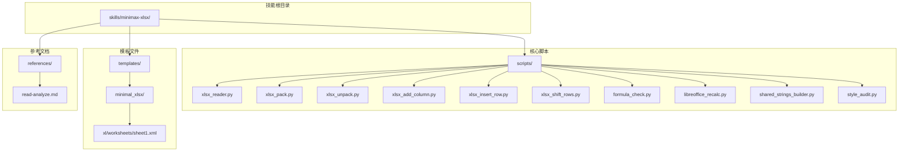
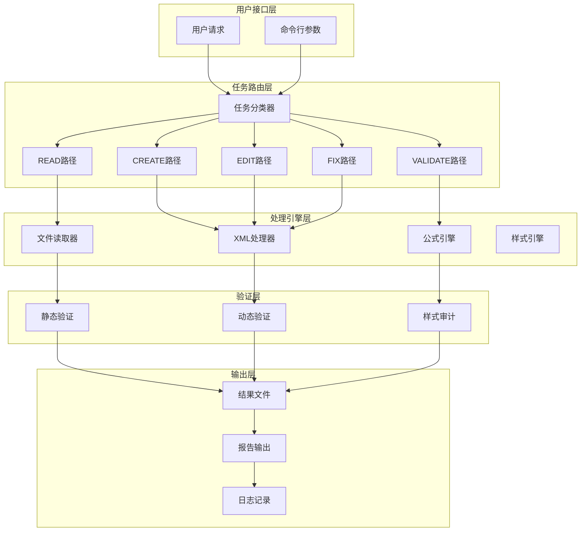
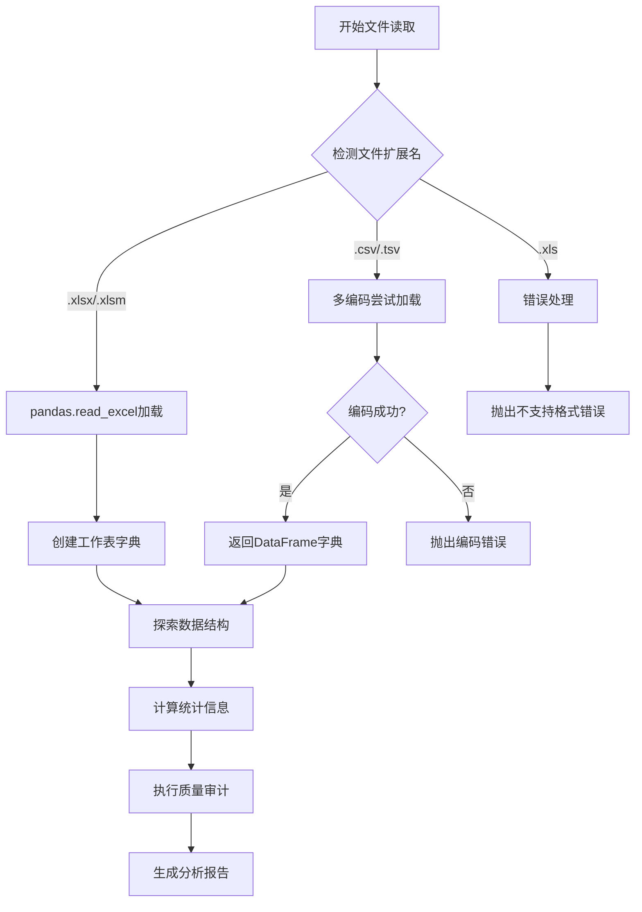
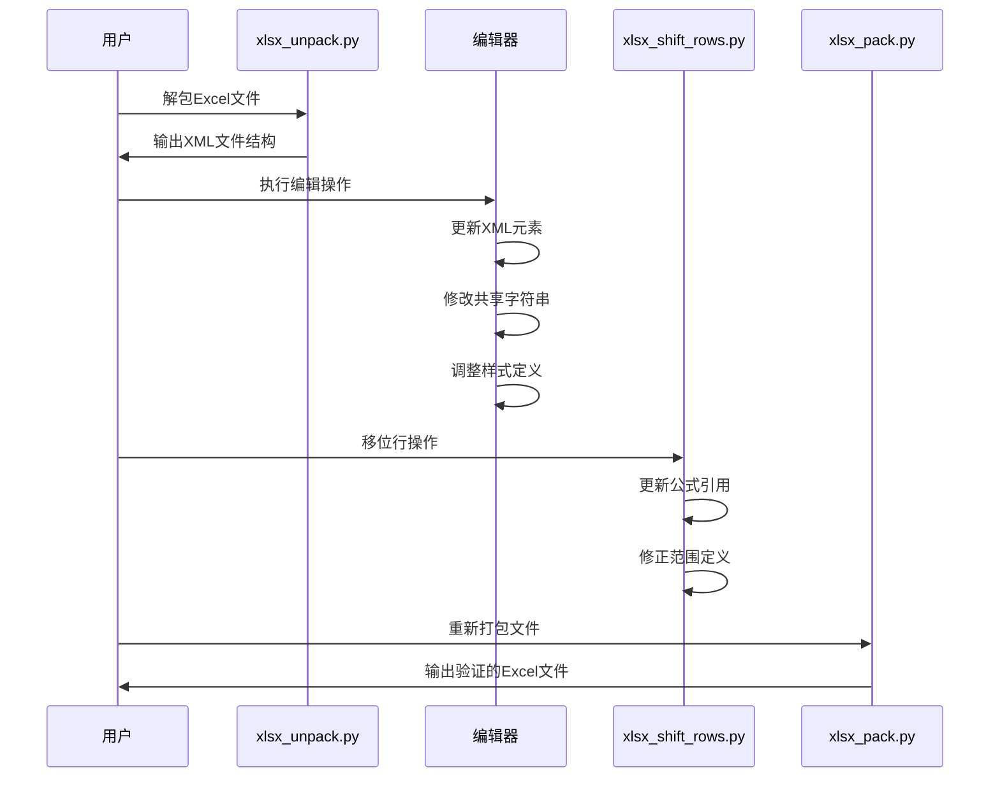
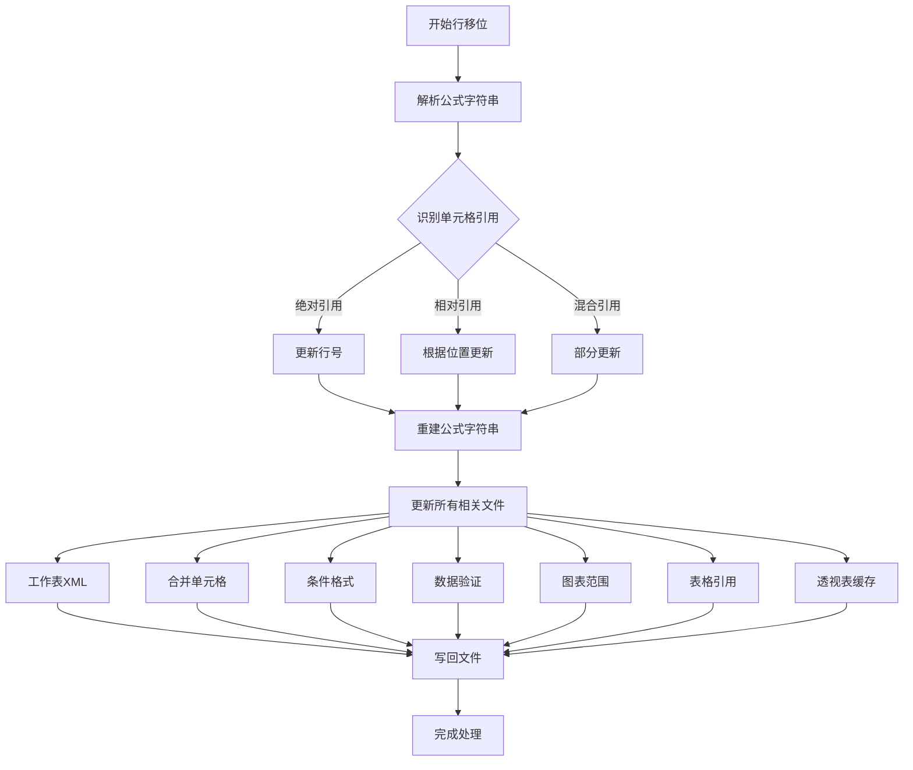
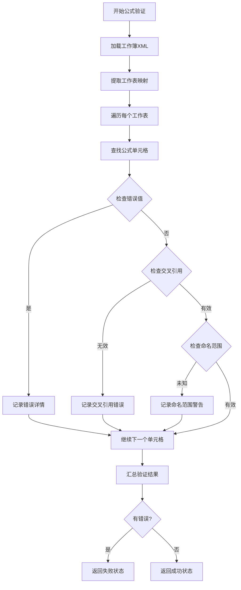
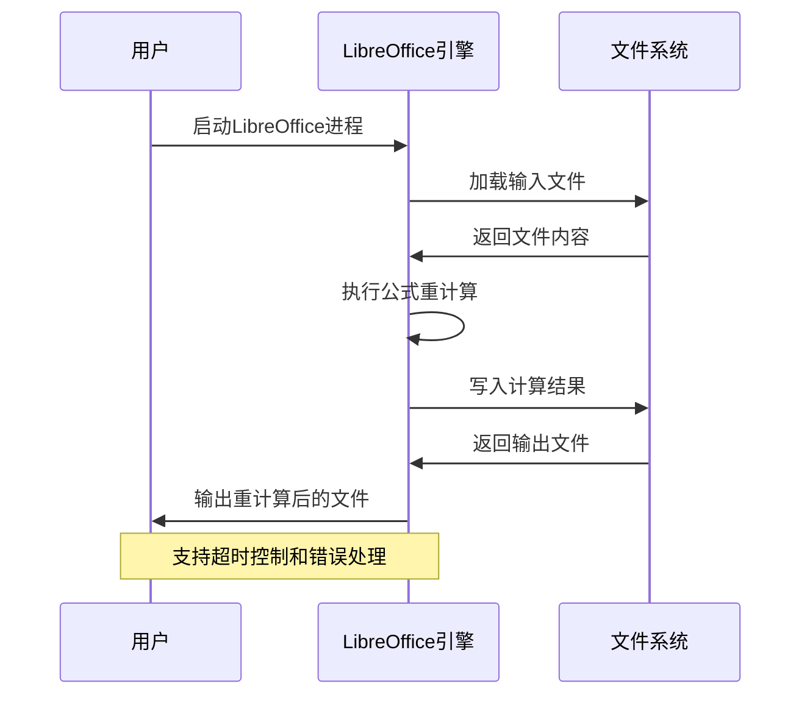
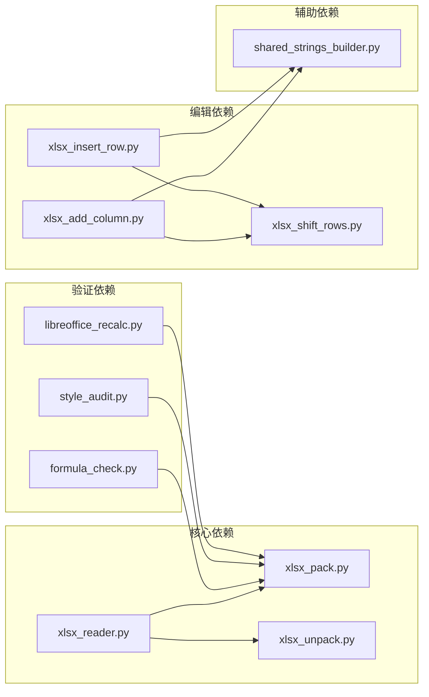

# MiniMax AI XLSX表格处理技能

<cite>
**本文档引用的文件**
- [SKILL.md](file://skills/minimax-xlsx/SKILL.md)
- [xlsx_reader.py](file://skills/minimax-xlsx/scripts/xlsx_reader.py)
- [xlsx_pack.py](file://skills/minimax-xlsx/scripts/xlsx_pack.py)
- [xlsx_unpack.py](file://skills/minimax-xlsx/scripts/xlsx_unpack.py)
- [xlsx_add_column.py](file://skills/minimax-xlsx/scripts/xlsx_add_column.py)
- [xlsx_insert_row.py](file://skills/minimax-xlsx/scripts/xlsx_insert_row.py)
- [xlsx_shift_rows.py](file://skills/minimax-xlsx/scripts/xlsx_shift_rows.py)
- [formula_check.py](file://skills/minimax-xlsx/scripts/formula_check.py)
- [libreoffice_recalc.py](file://skills/minimax-xlsx/scripts/libreoffice_recalc.py)
- [shared_strings_builder.py](file://skills/minimax-xlsx/scripts/shared_strings_builder.py)
- [style_audit.py](file://skills/minimax-xlsx/scripts/style_audit.py)
- [read-analyze.md](file://skills/minimax-xlsx/references/read-analyze.md)
- [sheet1.xml](file://skills/minimax-xlsx/templates/minimal_xlsx/xl/worksheets/sheet1.xml)
</cite>

## 目录
1. [简介](#简介)
2. [项目结构](#项目结构)
3. [核心组件](#核心组件)
4. [架构概览](#架构概览)
5. [详细组件分析](#详细组件分析)
6. [依赖关系分析](#依赖关系分析)
7. [性能考虑](#性能考虑)
8. [故障排除指南](#故障排除指南)
9. [结论](#结论)

## 简介

MiniMax XLSX技能是OpenClaw项目中的一个专门用于处理Excel/CSV文件的AI技能。该技能提供了完整的Excel文件生命周期管理能力，包括文件读取、分析、编辑、验证和格式化等功能。

该技能的核心特点：
- 支持多种文件格式：.xlsx、.xlsm、.csv、.tsv
- 提供完整的XML直接编辑能力，避免openpyxl回转导致的数据丢失
- 内置公式验证和动态重计算功能
- 遵循金融建模标准的格式规范
- 提供数据质量审计和样式合规检查

## 项目结构

该项目采用模块化的技能架构设计，主要包含以下目录结构：

**图表来源**
- [SKILL.md:1-156](file://skills/minimax-xlsx/SKILL.md#L1-L156)
- [xlsx_reader.py:1-363](file://skills/minimax-xlsx/scripts/xlsx_reader.py#L1-L363)
- [xlsx_pack.py:1-88](file://skills/minimax-xlsx/scripts/xlsx_pack.py#L1-L88)

**章节来源**
- [SKILL.md:1-156](file://skills/minimax-xlsx/SKILL.md#L1-L156)

## 核心组件

### 文件读取与分析器 (xlsx_reader.py)

xlsx_reader.py是整个技能系统的核心入口点，提供以下功能：

- **多格式支持**：支持.xlsx、.xlsm、.csv、.tsv格式的自动检测和加载
- **编码处理**：自动尝试多种编码格式（utf-8-sig、gbk、utf-8、latin-1）
- **结构发现**：分析工作簿结构、列信息、数据类型等
- **数据质量审计**：检测空值、重复行、混合类型、异常值等问题
- **统计分析**：提供描述性统计信息

### XML打包器 (xlsx_pack.py)

负责将修改后的XML文件重新打包为有效的.xlsx文件：

- **XML验证**：确保所有XML文件格式正确
- **ZIP压缩**：创建符合ECMA-376标准的ZIP包
- **完整性检查**：验证必需的XML文件存在

### XML解包器 (xlsx_unpack.py)

将.xlsx文件解包为可编辑的XML结构：

- **安全解包**：防止路径遍历攻击
- **格式美化**：将XML文件格式化为易读形式
- **关键文件识别**：列出需要编辑的主要XML文件

### 列添加工具 (xlsx_add_column.py)

专门用于向工作表中添加新列：

- **智能样式复制**：从相邻列复制样式设置
- **公式生成**：自动生成基于模板的公式
- **共享字符串管理**：正确处理文本内容的索引
- **边界应用**：支持会计风格的边框应用

### 行插入工具 (xlsx_insert_row.py)

用于在现有数据中插入新行：

- **自动行移位**：使用xlsx_shift_rows.py进行智能行移位
- **样式继承**：从指定行复制样式设置
- **公式更新**：自动更新相关公式的引用范围

### 行移位工具 (xlsx_shift_rows.py)

处理行插入和删除后的引用更新：

- **公式引用修正**：更新所有公式中的单元格引用
- **范围更新**：修正合并单元格、条件格式等的范围定义
- **跨文件引用**：处理图表、表格、透视表等的引用更新

### 公式验证器 (formula_check.py)

提供静态公式验证功能：

- **错误值检测**：识别#REF!、#DIV/0!等错误值
- **交叉引用验证**：检查跨工作表引用的有效性
- **命名范围检查**：验证命名范围的完整性
- **共享公式检查**：确保共享公式的完整性

### 动态重计算 (libreoffice_recalc.py)

通过LibreOffice引擎进行动态公式重计算：

- **无头模式**：支持服务器环境下的自动化处理
- **超时控制**：可配置的处理超时时间
- **版本检测**：自动检测LibreOffice可用性

### 共享字符串构建器 (shared_strings_builder.py)

生成有效的sharedStrings.xml文件：

- **去重处理**：自动去除重复的字符串
- **XML转义**：正确处理特殊字符
- **索引管理**：生成正确的字符串索引映射

### 样式审计器 (style_audit.py)

检查财务建模的样式合规性：

- **颜色角色验证**：确保输入单元格使用蓝色、公式单元格使用黑色或绿色
- **格式一致性检查**：验证数字格式与数据类型的匹配
- **样式完整性验证**：检查样式系统的完整性

**章节来源**
- [xlsx_reader.py:1-363](file://skills/minimax-xlsx/scripts/xlsx_reader.py#L1-L363)
- [xlsx_pack.py:1-88](file://skills/minimax-xlsx/scripts/xlsx_pack.py#L1-L88)
- [xlsx_unpack.py:1-131](file://skills/minimax-xlsx/scripts/xlsx_unpack.py#L1-L131)
- [xlsx_add_column.py:1-396](file://skills/minimax-xlsx/scripts/xlsx_add_column.py#L1-L396)
- [xlsx_insert_row.py:1-275](file://skills/minimax-xlsx/scripts/xlsx_insert_row.py#L1-L275)
- [xlsx_shift_rows.py:1-397](file://skills/minimax-xlsx/scripts/xlsx_shift_rows.py#L1-L397)
- [formula_check.py:1-423](file://skills/minimax-xlsx/scripts/formula_check.py#L1-L423)
- [libreoffice_recalc.py:1-249](file://skills/minimax-xlsx/scripts/libreoffice_recalc.py#L1-L249)
- [shared_strings_builder.py:1-164](file://skills/minimax-xlsx/scripts/shared_strings_builder.py#L1-L164)
- [style_audit.py:1-576](file://skills/minimax-xlsx/scripts/style_audit.py#L1-L576)

## 架构概览

该技能系统采用分层架构设计，每层都有明确的职责分工：

**图表来源**
- [SKILL.md:34-43](file://skills/minimax-xlsx/SKILL.md#L34-L43)
- [xlsx_reader.py:30-87](file://skills/minimax-xlsx/scripts/xlsx_reader.py#L30-L87)

### 数据流处理

系统采用流水线式的数据处理方式：

1. **输入验证**：检查文件格式和可用性
2. **结构解析**：提取文件元数据和工作表信息
3. **内容处理**：根据任务类型执行相应的处理逻辑
4. **输出生成**：创建最终的Excel文件和相关报告
5. **质量保证**：执行多层验证确保输出质量

**章节来源**
- [SKILL.md:34-156](file://skills/minimax-xlsx/SKILL.md#L34-L156)

## 详细组件分析

### 文件读取与分析组件

#### 结构发现算法

xlsx_reader.py实现了智能的文件结构发现机制：

**图表来源**
- [xlsx_reader.py:30-87](file://skills/minimax-xlsx/scripts/xlsx_reader.py#L30-L87)
- [xlsx_reader.py:94-114](file://skills/minimax-xlsx/scripts/xlsx_reader.py#L94-L114)
- [xlsx_reader.py:218-228](file://skills/minimax-xlsx/scripts/xlsx_reader.py#L218-L228)

#### 数据质量审计流程

系统提供多层次的数据质量检查：

| 检查类型 | 检测内容 | 处理策略 |
|---------|---------|---------|
| 空值检测 | 缺失数据百分比 | 记录警告并建议处理方案 |
| 重复行检测 | 完全重复的数据行 | 标记重复并建议清理 |
| 混合类型检测 | 文本和数值混合的列 | 建议类型转换 |
| 异常值检测 | 基于IQR的异常值 | 标记潜在问题 |
| 年份格式检测 | 浮点型年份显示问题 | 建议格式调整 |

**章节来源**
- [xlsx_reader.py:121-211](file://skills/minimax-xlsx/scripts/xlsx_reader.py#L121-L211)
- [read-analyze.md:87-108](file://skills/minimax-xlsx/references/read-analyze.md#L87-L108)

### XML编辑组件

#### 工作表编辑架构

编辑组件采用XML直接操作的方式，确保数据完整性：

**图表来源**
- [xlsx_unpack.py:34-76](file://skills/minimax-xlsx/scripts/xlsx_unpack.py#L34-L76)
- [xlsx_insert_row.py:164-177](file://skills/minimax-xlsx/scripts/xlsx_insert_row.py#L164-L177)
- [xlsx_pack.py:37-81](file://skills/minimax-xlsx/scripts/xlsx_pack.py#L37-L81)

#### 公式引用更新机制

xlsx_shift_rows.py实现了复杂的公式引用更新逻辑：

**图表来源**
- [xlsx_shift_rows.py:64-108](file://skills/minimax-xlsx/scripts/xlsx_shift_rows.py#L64-L108)
- [xlsx_shift_rows.py:158-229](file://skills/minimax-xlsx/scripts/xlsx_shift_rows.py#L158-L229)

**章节来源**
- [xlsx_add_column.py:241-391](file://skills/minimax-xlsx/scripts/xlsx_add_column.py#L241-L391)
- [xlsx_insert_row.py:142-271](file://skills/minimax-xlsx/scripts/xlsx_insert_row.py#L142-L271)
- [xlsx_shift_rows.py:1-397](file://skills/minimax-xlsx/scripts/xlsx_shift_rows.py#L1-L397)

### 验证组件

#### 公式验证体系

formula_check.py提供了全面的公式验证功能：

**图表来源**
- [formula_check.py:151-295](file://skills/minimax-xlsx/scripts/formula_check.py#L151-L295)

#### 动态重计算流程

libreoffice_recalc.py实现了基于LibreOffice的动态重计算：

**图表来源**
- [libreoffice_recalc.py:73-158](file://skills/minimax-xlsx/scripts/libreoffice_recalc.py#L73-L158)

**章节来源**
- [formula_check.py:1-423](file://skills/minimax-xlsx/scripts/formula_check.py#L1-L423)
- [libreoffice_recalc.py:1-249](file://skills/minimax-xlsx/scripts/libreoffice_recalc.py#L1-L249)

### 样式管理组件

#### 财务建模样式标准

style_audit.py遵循严格的财务建模样式规范：

| 样式索引 | 角色定义 | 字体颜色 | 数字格式 | 使用场景 |
|---------|---------|---------|---------|---------|
| 0 | 任意 | 默认 | 通用 | 默认样式 |
| 1 | 输入值 | 蓝色 | 通用 | 用户可编辑假设 |
| 2 | 公式 | 黑色 | 通用 | 计算结果 |
| 3 | 跨表引用 | 绿色 | 通用 | 工作表间引用 |
| 4 | 标题 | 任意 | 通用 | 表头和标题 |
| 5 | 货币输入 | 蓝色 | 货币 | 金额输入 |
| 6 | 货币公式 | 黑色 | 货币 | 金额计算 |
| 7 | 百分比输入 | 蓝色 | 百分比 | 比率输入 |
| 8 | 百分比公式 | 黑色 | 百分比 | 比率计算 |
| 9 | 整数输入 | 蓝色 | 整数 | 计数输入 |
| 10 | 整数公式 | 黑色 | 整数 | 计数计算 |
| 11 | 年份输入 | 蓝色 | 年份 | 年份数据 |
| 12 | 高亮 | 任意 | 通用 | 特殊标记 |

**章节来源**
- [style_audit.py:37-54](file://skills/minimax-xlsx/scripts/style_audit.py#L37-L54)
- [sheet1.xml:23-30](file://skills/minimax-xlsx/templates/minimal_xlsx/xl/worksheets/sheet1.xml#L23-L30)

## 依赖关系分析

### 组件耦合度分析

该技能系统展现了良好的模块化设计，各组件之间的耦合度适中：

**图表来源**
- [xlsx_reader.py:30-87](file://skills/minimax-xlsx/scripts/xlsx_reader.py#L30-L87)
- [xlsx_add_column.py:79-98](file://skills/minimax-xlsx/scripts/xlsx_add_column.py#L79-L98)
- [xlsx_insert_row.py:73-91](file://skills/minimax-xlsx/scripts/xlsx_insert_row.py#L73-L91)

### 外部依赖管理

系统对外部依赖的管理策略：

| 依赖类型 | 依赖名称 | 版本要求 | 用途说明 |
|---------|---------|---------|---------|
| Python库 | pandas | >=1.0.0 | 数据处理和分析 |
| Python库 | openpyxl | >=3.0.0 | Excel文件读写 |
| Python库 | lxml | >=4.0.0 | XML解析和处理 |
| 系统工具 | LibreOffice | >=6.0.0 | 动态公式重计算 |
| 系统工具 | Python3 | >=3.7.0 | 脚本执行环境 |

### 循环依赖检测

经过分析，系统不存在循环依赖关系，所有依赖都遵循单向依赖原则，确保了系统的稳定性和可维护性。

**章节来源**
- [SKILL.md:10-16](file://skills/minimax-xlsx/SKILL.md#L10-L16)

## 性能考虑

### 处理效率优化

系统在多个层面实现了性能优化：

1. **内存管理**：使用生成器和分块处理大文件
2. **并行处理**：支持多工作表并行处理
3. **缓存机制**：复用已解析的XML结构
4. **增量更新**：只更新必要的XML元素

### 大文件处理策略

对于大型Excel文件，系统采用以下优化策略：

- **延迟加载**：仅在需要时加载工作表数据
- **流式处理**：逐行处理数据，减少内存占用
- **分页读取**：支持大数据集的分页处理
- **进度监控**：提供详细的处理进度反馈

### 错误恢复机制

系统具备完善的错误恢复能力：

- **原子操作**：确保操作的原子性，避免部分更新
- **回滚机制**：在错误发生时自动回滚到原始状态
- **容错处理**：对可恢复的错误提供自动修复
- **日志记录**：详细记录所有操作和错误信息

## 故障排除指南

### 常见问题诊断

#### 文件格式问题

| 问题症状 | 可能原因 | 解决方案 |
|---------|---------|---------|
| 文件无法打开 | 格式不受支持 | 使用受支持的.xlsx格式 |
| 编码错误 | CSV编码不正确 | 指定正确的编码格式 |
| XML解析失败 | 文件损坏 | 检查文件完整性并重新生成 |

#### 公式相关问题

| 问题症状 | 可能原因 | 解决方案 |
|---------|---------|---------|
| 公式错误值 | 引用无效 | 检查工作表名称和单元格范围 |
| 公式计算错误 | 依赖关系问题 | 使用libreoffice_recalc.py进行重计算 |
| 共享公式失效 | 主单元格缺失 | 重新定义共享公式的主单元格 |

#### 样式相关问题

| 问题症状 | 可能原因 | 解决方案 |
|---------|---------|---------|
| 样式不生效 | 样式索引超出范围 | 检查cellXfs定义的完整性 |
| 颜色显示异常 | RGB值格式错误 | 使用预定义的颜色值 |
| 格式不匹配 | 数字格式与数据类型不符 | 调整样式定义以匹配数据类型 |

### 调试工具使用

系统提供了丰富的调试工具：

1. **结构检查**：使用xlsx_reader.py验证文件结构
2. **XML验证**：检查XML文件的格式正确性
3. **公式审计**：使用formula_check.py检查公式完整性
4. **样式审计**：使用style_audit.py验证样式合规性

**章节来源**
- [read-analyze.md:87-108](file://skills/minimax-xlsx/references/read-analyze.md#L87-L108)
- [formula_check.py:14-28](file://skills/minimax-xlsx/scripts/formula_check.py#L14-L28)

## 结论

MiniMax XLSX技能是一个功能完整、架构清晰的Excel文件处理系统。它通过模块化的设计实现了以下目标：

**技术优势**：
- 完整的Excel文件生命周期管理
- 基于XML的精确控制能力
- 多层次的质量保证机制
- 严格的财务建模标准遵循

**实用性特点**：
- 支持多种文件格式和编码
- 提供丰富的验证和审计功能
- 具备完善的错误处理和恢复机制
- 适合生产环境的稳定运行

该技能系统为OpenClaw平台提供了强大的表格处理能力，能够满足各种复杂的Excel文件处理需求，是现代办公自动化的重要工具。