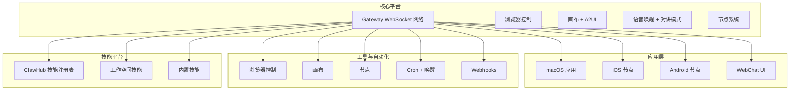
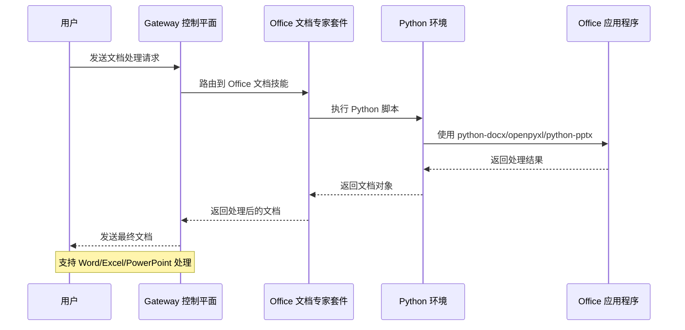
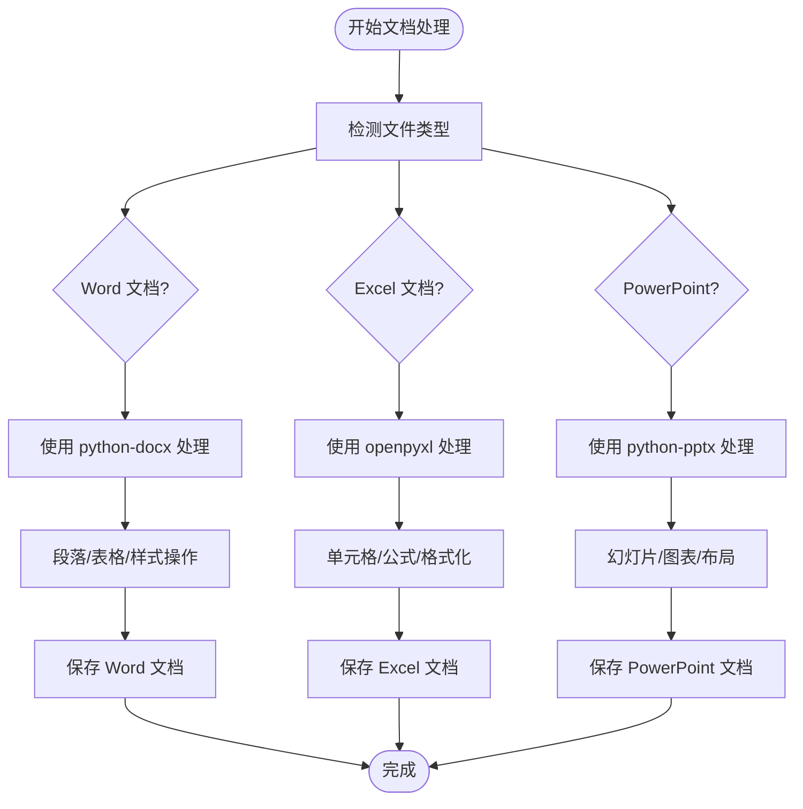
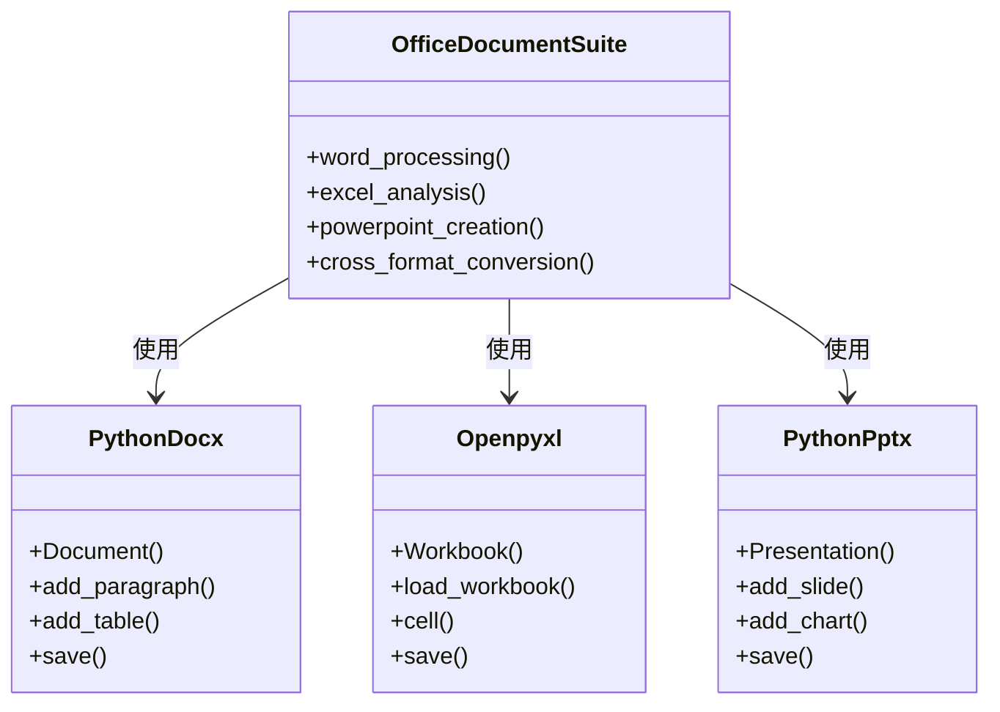
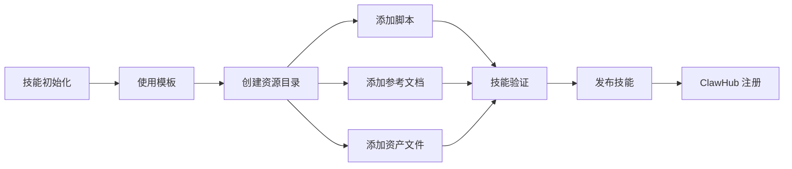
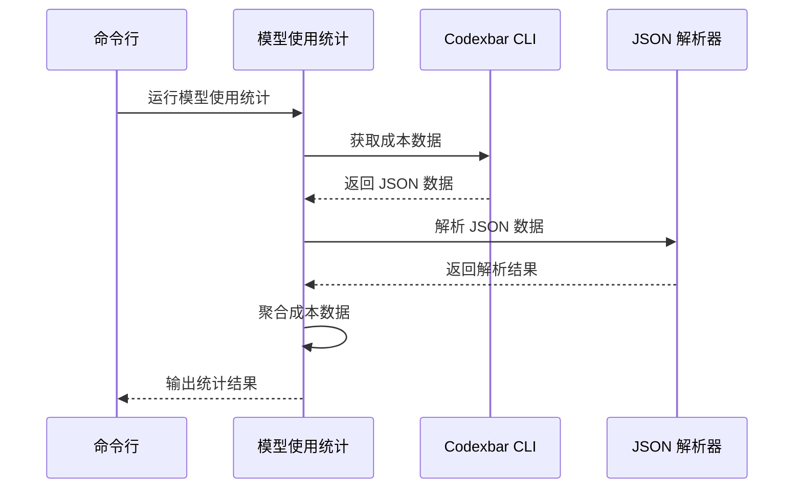

# Office 文档专家套件

<cite>
**本文档引用的文件**
- [README.md](file://README.md)
- [package.json](file://package.json)
- [src/index.ts](file://src/index.ts)
- [skills/office-document-specialist-suite/SKILL.md](file://skills/office-document-specialist-suite/SKILL.md)
- [skills/model-usage/scripts/model_usage.py](file://skills/model-usage/scripts/model_usage.py)
- [skills/skill-creator/scripts/init_skill.py](file://skills/skill-creator/scripts/init_skill.py)
</cite>

## 目录
1. [项目概述](#项目概述)
2. [项目结构](#项目结构)
3. [核心组件](#核心组件)
4. [架构概览](#架构概览)
5. [详细组件分析](#详细组件分析)
6. [依赖关系分析](#依赖关系分析)
7. [性能考虑](#性能考虑)
8. [故障排除指南](#故障排除指南)
9. [结论](#结论)

## 项目概述

Office 文档专家套件是 OpenClaw 个人 AI 助手项目中的一个专业技能套件，专注于 Microsoft Office 文档的创建、编辑和分析。该项目是一个多通道 AI 网关平台，支持多种消息渠道和设备集成。

OpenClaw 是一个运行在用户本地设备上的个人 AI 助手，支持 WhatsApp、Telegram、Slack、Discord、Google Chat、Signal、iMessage、BlueBubbles、IRC、Microsoft Teams、Matrix、Feishu、LINE、Mattermost、Nextcloud Talk、Nostr、Synology Chat、Tlon、Twitch、Zalo、Zalo Personal 和 WebChat 等多种通信渠道。它可以在 macOS/iOS/Android 上进行语音交互，并能够渲染实时画布界面。

## 项目结构



**图表来源**
- [README.md: 185-240:185-240](file://README.md#L185-L240)
- [README.md: 415-432:415-432](file://README.md#L415-L432)

**章节来源**
- [README.md: 1-560:1-560](file://README.md#L1-L560)
- [package.json: 1-474:1-474](file://package.json#L1-L474)

## 核心组件

### Office 文档专家套件

Office 文档专家套件是一个专门用于处理 Microsoft Office 文档的技能套件，提供以下核心功能：

- **Word (.docx) 处理**：创建和编辑专业报告，管理样式，插入表格和图片
- **Excel (.xlsx) 分析**：数据分析、自动化电子表格生成和复杂格式化
- **PowerPoint (.pptx) 制作**：从结构化数据自动生成幻灯片演示文稿

该套件需要 Python 环境和特定的 Python 包支持：
- python-docx：用于 Word 文档处理
- openpyxl：用于 Excel 电子表格操作  
- python-pptx：用于 PowerPoint 演示文稿创建

**章节来源**
- [skills/office-document-specialist-suite/SKILL.md: 1-192:1-192](file://skills/office-document-specialist-suite/SKILL.md#L1-L192)

### 技能生态系统

OpenClaw 提供了完整的技能生态系统，包括：

- **ClawHub 技能注册表**：最小化的技能注册表，支持自动搜索和拉取新技能
- **工作空间技能**：用户自定义的工作空间技能
- **内置技能**：项目自带的各种实用技能
- **技能创建器**：提供模板化的技能初始化工具

**章节来源**
- [README.md: 264-270:264-270](file://README.md#L264-L270)
- [skills/skill-creator/scripts/init_skill.py: 1-379:1-379](file://skills/skill-creator/scripts/init_skill.py#L1-L379)

## 架构概览



**图表来源**
- [src/index.ts: 1-94:1-94](file://src/index.ts#L1-L94)
- [skills/office-document-specialist-suite/SKILL.md: 27-33:27-33](file://skills/office-document-specialist-suite/SKILL.md#L27-L33)

## 详细组件分析

### Office 文档处理流程



**图表来源**
- [skills/office-document-specialist-suite/SKILL.md: 35-156:35-156](file://skills/office-document-specialist-suite/SKILL.md#L35-L156)

### Python 依赖管理

Office 文档专家套件依赖于以下 Python 包：



**图表来源**
- [skills/office-document-specialist-suite/SKILL.md: 37-155:37-155](file://skills/office-document-specialist-suite/SKILL.md#L37-L155)

**章节来源**
- [skills/office-document-specialist-suite/SKILL.md: 27-192:27-192](file://skills/office-document-specialist-suite/SKILL.md#L27-L192)

### 技能创建与管理



**图表来源**
- [skills/skill-creator/scripts/init_skill.py: 23-108:23-108](file://skills/skill-creator/scripts/init_skill.py#L23-L108)

**章节来源**
- [skills/skill-creator/scripts/init_skill.py: 1-379:1-379](file://skills/skill-creator/scripts/init_skill.py#L1-L379)

### 模型使用统计工具



**图表来源**
- [skills/model-usage/scripts/model_usage.py: 34-48:34-48](file://skills/model-usage/scripts/model_usage.py#L34-L48)

**章节来源**
- [skills/model-usage/scripts/model_usage.py: 1-321:1-321](file://skills/model-usage/scripts/model_usage.py#L1-L321)

## 依赖关系分析

```mermaid
graph TB
subgraph "Node.js 依赖"
A[@mariozechner/pi-agent-core]
B[@mariozechner/pi-ai]
C[@mariozechner/pi-coding-agent]
D[@mariozechner/pi-tui]
E[commander]
F[chokidar]
G[ws]
H[yaml]
I[zod]
end
subgraph "Python 依赖"
J[python-docx]
K[openpyxl]
L[python-pptx]
M[pandas]
N[PyPDF2]
end
subgraph "平台特定依赖"
O[@whiskeysockets/baileys]
P[@grammyjs/transformer-throttler]
Q[@slack/bolt]
R[@discordjs/voice]
S[@line/bot-sdk]
end
subgraph "开发工具"
T[typescript]
U[vitest]
V[oxlint]
W[tsx]
end
A --> J
B --> K
C --> L
D --> M
E --> N
```

**图表来源**
- [package.json: 344-402:344-402](file://package.json#L344-L402)
- [skills/office-document-specialist-suite/SKILL.md: 29-33:29-33](file://skills/office-document-specialist-suite/SKILL.md#L29-L33)

**章节来源**
- [package.json: 344-474:344-474](file://package.json#L344-L474)

## 性能考虑

### 文档处理优化

1. **内存管理**：对于大型 Office 文档，建议分块处理以避免内存溢出
2. **并发处理**：多个独立文档可以并行处理以提高吞吐量
3. **缓存策略**：频繁访问的模板和样式可以缓存以减少重复加载时间
4. **增量更新**：对于已存在的文档，只处理变更部分而非整个文档

### Python 环境优化

1. **虚拟环境**：为 Office 文档处理创建独立的 Python 虚拟环境
2. **包版本锁定**：固定 Python 包版本以确保一致性
3. **预编译模块**：利用 Python 的 .pyc 编译文件提高加载速度

## 故障排除指南

### 常见问题及解决方案

1. **Python 包安装失败**
   - 确保网络连接正常
   - 检查 pip 版本和权限
   - 尝试使用国内镜像源

2. **LibreOffice 转换失败**
   - 确认 LibreOffice 已正确安装
   - 检查文件路径和权限
   - 验证输入文件格式的有效性

3. **Excel 公式计算问题**
   - 使用 `data_only=True` 参数读取缓存值
   - 检查公式依赖关系
   - 确认单元格引用的正确性

4. **PowerPoint 图表创建失败**
   - 确保 lxml 库已安装
   - 验证图表数据格式
   - 检查幻灯片布局兼容性

**章节来源**
- [skills/office-document-specialist-suite/SKILL.md: 184-192:184-192](file://skills/office-document-specialist-suite/SKILL.md#L184-L192)

## 结论

Office 文档专家套件作为 OpenClaw 生态系统的重要组成部分，提供了专业级的 Office 文档处理能力。通过集成 Python 生态系统的强大库，该套件能够处理复杂的文档操作需求，包括创建、编辑、分析和转换各种格式的 Office 文件。

该套件的设计体现了 OpenClaw 平台的核心理念：通过技能系统实现功能的模块化和可扩展性。开发者可以通过类似的模式创建更多专业的文档处理技能，进一步丰富平台的功能生态。

随着 AI 技术的发展，Office 文档专家套件有望与 OpenClaw 的其他组件深度集成，为用户提供更加智能化和自动化的文档处理体验。