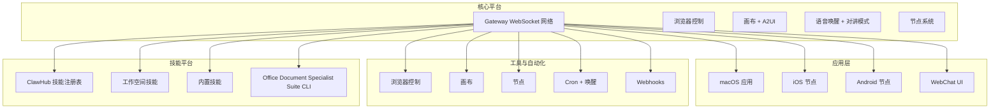
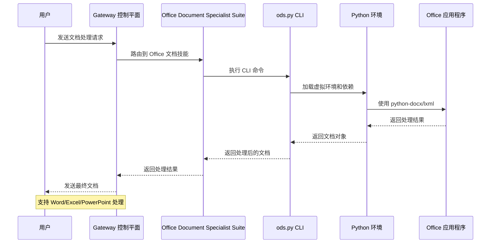
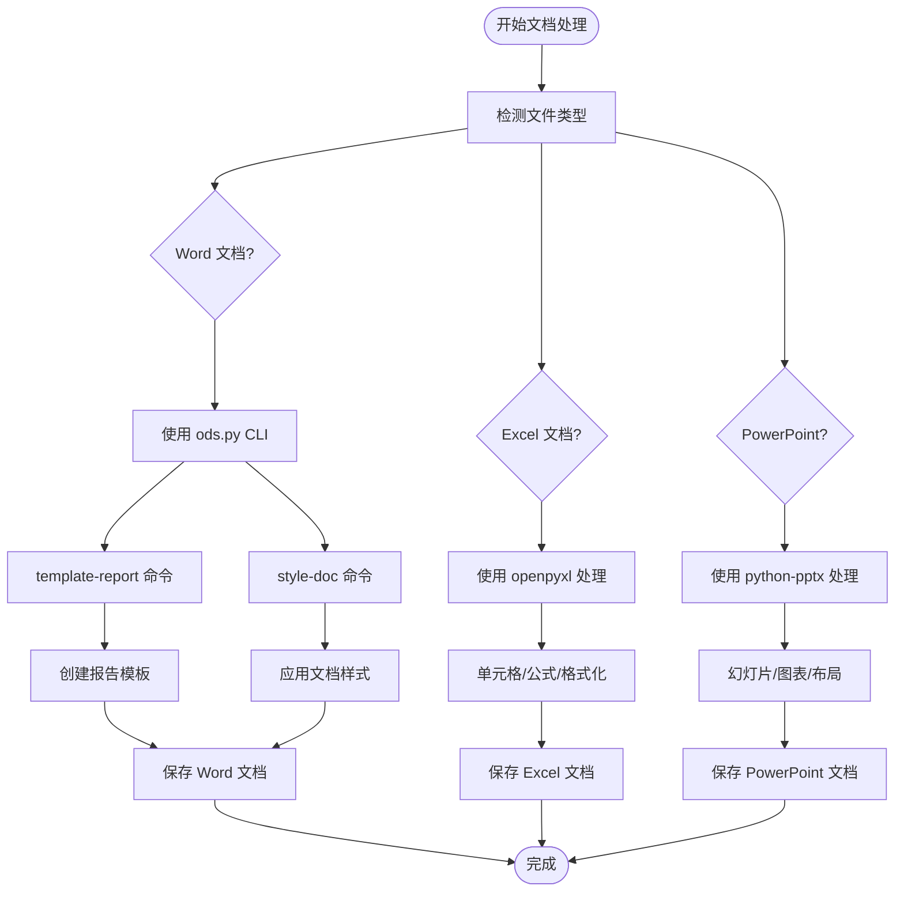
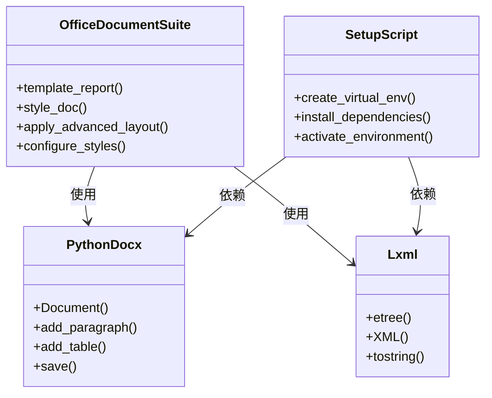
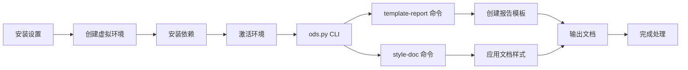
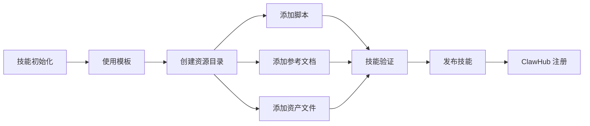
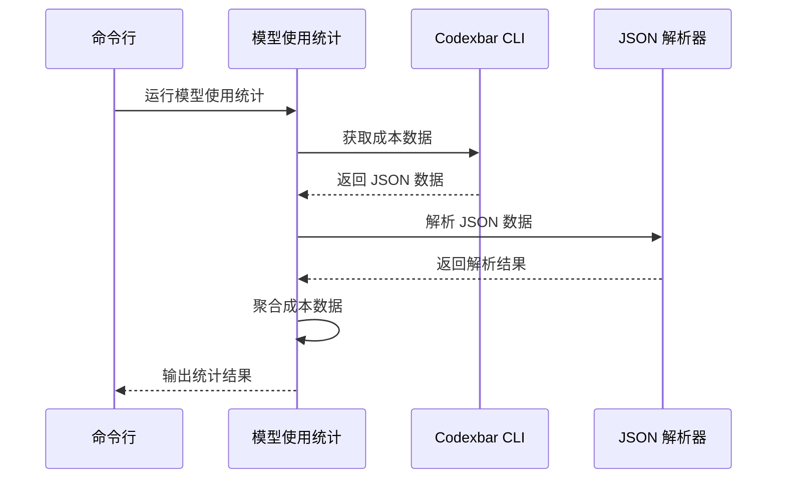

# Office 文档专家套件

<cite>
**本文档引用的文件**
- [README.md](file://README.md)
- [package.json](file://package.json)
- [src/index.ts](file://src/index.ts)
- [skills/office-document-specialist-suite/SKILL.md](file://skills/office-document-specialist-suite/SKILL.md)
- [skills/office-document-specialist-suite/ods.py](file://skills/office-document-specialist-suite/ods.py)
- [skills/office-document-specialist-suite/requirements.txt](file://skills/office-document-specialist-suite/requirements.txt)
- [skills/office-document-specialist-suite/setup.sh](file://skills/office-document-specialist-suite/setup.sh)
- [skills/model-usage/scripts/model_usage.py](file://skills/model-usage/scripts/model_usage.py)
- [skills/skill-creator/scripts/init_skill.py](file://skills/skill-creator/scripts/init_skill.py)
</cite>

## 更新摘要
**变更内容**
- 新增 Office Document Specialist Suite Python CLI 工具套件
- 添加 ods.py 主要 CLI 脚本，提供模板报告生成和文档样式应用功能
- 新增 requirements.txt 依赖管理文件，明确指定 python-docx 和 lxml 依赖
- 新增 setup.sh 安装设置脚本，支持虚拟环境创建和依赖安装
- 更新技能描述，强调新的 CLI 工具套件和专业文档处理能力

## 目录
1. [项目概述](#项目概述)
2. [项目结构](#项目结构)
3. [核心组件](#核心组件)
4. [架构概览](#架构概览)
5. [详细组件分析](#详细组件分析)
6. [依赖关系分析](#依赖关系分析)
7. [性能考虑](#性能考虑)
8. [故障排除指南](#故障排除指南)
9. [结论](#结论)

## 项目概述

Office 文档专家套件是 OpenClaw 个人 AI 助手项目中的一个专业技能套件，专注于 Microsoft Office 文档的创建、编辑和分析。该项目是一个多通道 AI 网关平台，支持多种消息渠道和设备集成。

OpenClaw 是一个运行在用户本地设备上的个人 AI 助手，支持 WhatsApp、Telegram、Slack、Discord、Google Chat、Signal、iMessage、BlueBubbles、IRC、Microsoft Teams、Matrix、Feishu、LINE、Mattermost、Nextcloud Talk、Nostr、Synology Chat、Tlon、Twitch、Zalo、Zalo Personal 和 WebChat 等多种通信渠道。它可以在 macOS/iOS/Android 上进行语音交互，并能够渲染实时画布界面。

**更新** 新增了完整的 Python CLI 工具套件，提供专业级的文档处理能力和自动化工作流程。

## 项目结构



**图表来源**
- [README.md: 185-240:185-240](file://README.md#L185-L240)
- [README.md: 415-432:415-432](file://README.md#L415-L432)

**章节来源**
- [README.md: 1-560:1-560](file://README.md#L1-L560)
- [package.json: 1-474:1-474](file://package.json#L1-L474)

## 核心组件

### Office Document Specialist Suite CLI 工具套件

Office 文档专家套件现在包含一个完整的 Python CLI 工具套件，提供以下核心功能：

#### 主要 CLI 脚本：ods.py

**template-report 命令**：创建专业的报告模板
- 生成带页眉、页脚和自动页码的专业报告
- 支持自定义标题和作者信息
- 创建标准的目录结构和内容框架

**style-doc 命令**：应用高级文档样式
- 为现有文档应用专业布局和样式
- 支持横向/纵向页面方向切换
- 自动添加页码和专业排版

#### 依赖管理系统

- **python-docx >= 1.1.2**：用于 Word 文档处理和样式管理
- **lxml >= 5.3.0**：用于 XML 处理和图表创建

#### 安装设置脚本：setup.sh

提供一键安装和配置功能：
- 创建独立的 Python 虚拟环境
- 自动安装所需依赖包
- 激活虚拟环境并显示使用说明

**章节来源**
- [skills/office-document-specialist-suite/SKILL.md: 42-66:42-66](file://skills/office-document-specialist-suite/SKILL.md#L42-L66)
- [skills/office-document-specialist-suite/ods.py: 138-152:138-152](file://skills/office-document-specialist-suite/ods.py#L138-L152)
- [skills/office-document-specialist-suite/requirements.txt: 1-3:1-3](file://skills/office-document-specialist-suite/requirements.txt#L1-L3)
- [skills/office-document-specialist-suite/setup.sh: 1-14:1-14](file://skills/office-document-specialist-suite/setup.sh#L1-L14)

### 技能生态系统

OpenClaw 提供了完整的技能生态系统，包括：

- **ClawHub 技能注册表**：最小化的技能注册表，支持自动搜索和拉取新技能
- **工作空间技能**：用户自定义的工作空间技能
- **内置技能**：项目自带的各种实用技能
- **技能创建器**：提供模板化的技能初始化工具
- **Office Document Specialist Suite**：新增的专业文档处理技能套件

**章节来源**
- [README.md: 264-270:264-270](file://README.md#L264-L270)
- [skills/skill-creator/scripts/init_skill.py: 1-379:1-379](file://skills/skill-creator/scripts/init_skill.py#L1-L379)

## 架构概览



**图表来源**
- [src/index.ts: 1-94:1-94](file://src/index.ts#L1-L94)
- [skills/office-document-specialist-suite/SKILL.md: 42-66:42-66](file://skills/office-document-specialist-suite/SKILL.md#L42-L66)

## 详细组件分析

### Office 文档处理流程



**图表来源**
- [skills/office-document-specialist-suite/SKILL.md: 42-66:42-66](file://skills/office-document-specialist-suite/SKILL.md#L42-L66)
- [skills/office-document-specialist-suite/ods.py: 99-136:99-136](file://skills/office-document-specialist-suite/ods.py#L99-L136)

### Python 依赖管理

Office 文档专家套件依赖于以下 Python 包：



**图表来源**
- [skills/office-document-specialist-suite/ods.py: 76-97:76-97](file://skills/office-document-specialist-suite/ods.py#L76-L97)
- [skills/office-document-specialist-suite/requirements.txt: 1-3:1-3](file://skills/office-document-specialist-suite/requirements.txt#L1-L3)

**章节来源**
- [skills/office-document-specialist-suite/SKILL.md: 27-40:27-40](file://skills/office-document-specialist-suite/SKILL.md#L27-L40)
- [skills/office-document-specialist-suite/ods.py: 1-167:1-167](file://skills/office-document-specialist-suite/ods.py#L1-L167)

### CLI 工具套件



**图表来源**
- [skills/office-document-specialist-suite/setup.sh: 6-9:6-9](file://skills/office-document-specialist-suite/setup.sh#L6-L9)
- [skills/office-document-specialist-suite/ods.py: 138-152:138-152](file://skills/office-document-specialist-suite/ods.py#L138-L152)

**章节来源**
- [skills/office-document-specialist-suite/setup.sh: 1-14:1-14](file://skills/office-document-specialist-suite/setup.sh#L1-L14)
- [skills/office-document-specialist-suite/ods.py: 155-167:155-167](file://skills/office-document-specialist-suite/ods.py#L155-L167)

### 技能创建与管理



**图表来源**
- [skills/skill-creator/scripts/init_skill.py: 23-108:23-108](file://skills/skill-creator/scripts/init_skill.py#L23-L108)

**章节来源**
- [skills/skill-creator/scripts/init_skill.py: 1-379:1-379](file://skills/skill-creator/scripts/init_skill.py#L1-L379)

### 模型使用统计工具



**图表来源**
- [skills/model-usage/scripts/model_usage.py: 34-48:34-48](file://skills/model-usage/scripts/model_usage.py#L34-L48)

**章节来源**
- [skills/model-usage/scripts/model_usage.py: 1-321:1-321](file://skills/model-usage/scripts/model_usage.py#L1-L321)

## 依赖关系分析

```mermaid
graph TB
subgraph "Node.js 依赖"
A[@mariozechner/pi-agent-core]
B[@mariozechner/pi-ai]
C[@mariozechner/pi-coding-agent]
D[@mariozechner/pi-tui]
E[commander]
F[chokidar]
G[ws]
H[yaml]
I[zod]
end
subgraph "Python 依赖"
J[python-docx]
K[openpyxl]
L[python-pptx]
M[pandas]
N[PyPDF2]
O[lxml]
P[docxtpl]
end
subgraph "平台特定依赖"
Q[@whiskeysockets/baileys]
R[@grammyjs/transformer-throttler]
S[@slack/bolt]
T[@discordjs/voice]
U[@line/bot-sdk]
end
subgraph "开发工具"
V[typescript]
W[vitest]
X[oxlint]
Y[tsx]
end
A --> J
B --> K
C --> L
D --> M
E --> N
J --> O
K --> P
```

**图表来源**
- [package.json: 344-402:344-402](file://package.json#L344-L402)
- [skills/office-document-specialist-suite/requirements.txt: 1-3:1-3](file://skills/office-document-specialist-suite/requirements.txt#L1-L3)

**章节来源**
- [package.json: 344-474:344-474](file://package.json#L344-L474)

## 性能考虑

### 文档处理优化

1. **内存管理**：对于大型 Office 文档，建议分块处理以避免内存溢出
2. **并发处理**：多个独立文档可以并行处理以提高吞吐量
3. **缓存策略**：频繁访问的模板和样式可以缓存以减少重复加载时间
4. **增量更新**：对于已存在的文档，只处理变更部分而非整个文档

### Python 环境优化

1. **虚拟环境**：为 Office 文档处理创建独立的 Python 虚拟环境
2. **包版本锁定**：固定 Python 包版本以确保一致性
3. **预编译模块**：利用 Python 的 .pyc 编译文件提高加载速度
4. **CLI 工具优化**：ods.py 脚本采用命令行参数解析，支持快速批量处理

**更新** 新增了 CLI 工具套件的性能优化考虑，包括虚拟环境管理和依赖包版本控制。

## 故障排除指南

### 常见问题及解决方案

1. **Python 包安装失败**
   - 确保网络连接正常
   - 检查 pip 版本和权限
   - 尝试使用国内镜像源
   - 使用 setup.sh 脚本创建隔离环境

2. **LibreOffice 转换失败**
   - 确认 LibreOffice 已正确安装
   - 检查文件路径和权限
   - 验证输入文件格式的有效性

3. **Excel 公式计算问题**
   - 使用 `data_only=True` 参数读取缓存值
   - 检查公式依赖关系
   - 确认单元格引用的正确性

4. **PowerPoint 图表创建失败**
   - 确保 lxml 库已安装
   - 验证图表数据格式
   - 检查幻灯片布局兼容性

5. **CLI 工具执行错误**
   - 确认已激活虚拟环境
   - 检查 Python 版本兼容性
   - 验证输入文件路径和权限

**章节来源**
- [skills/office-document-specialist-suite/SKILL.md: 184-192:184-192](file://skills/office-document-specialist-suite/SKILL.md#L184-L192)
- [skills/office-document-specialist-suite/setup.sh: 11-14:11-14](file://skills/office-document-specialist-suite/setup.sh#L11-L14)

## 结论

Office 文档专家套件作为 OpenClaw 生态系统的重要组成部分，现在提供了一个完整的 Python CLI 工具套件，显著增强了专业级的 Office 文档处理能力。通过集成 ods.py CLI 脚本、requirements.txt 依赖管理和 setup.sh 安装脚本，该套件能够：

1. **自动化报告生成**：通过 template-report 命令快速创建专业的报告模板
2. **批量文档样式应用**：通过 style-doc 命令为大量文档应用统一的专业样式
3. **隔离环境管理**：通过虚拟环境确保依赖包的稳定性和安全性
4. **标准化工作流程**：提供一致的命令行接口和参数规范

该套件的设计体现了 OpenClaw 平台的核心理念：通过技能系统实现功能的模块化和可扩展性。新增的 CLI 工具套件为开发者和用户提供了更高效、更专业的文档处理解决方案，进一步丰富了平台的功能生态。

随着 AI 技术的发展，Office 文档专家套件有望与 OpenClaw 的其他组件深度集成，为用户提供更加智能化和自动化的文档处理体验。新的 CLI 工具套件为未来的功能扩展奠定了坚实的基础，支持更多的自动化工作流程和批量处理场景。