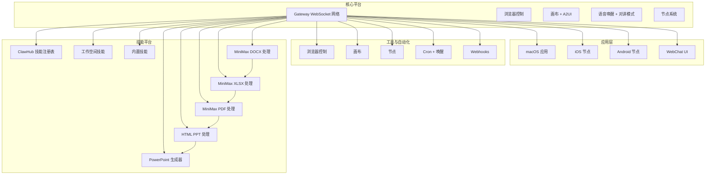
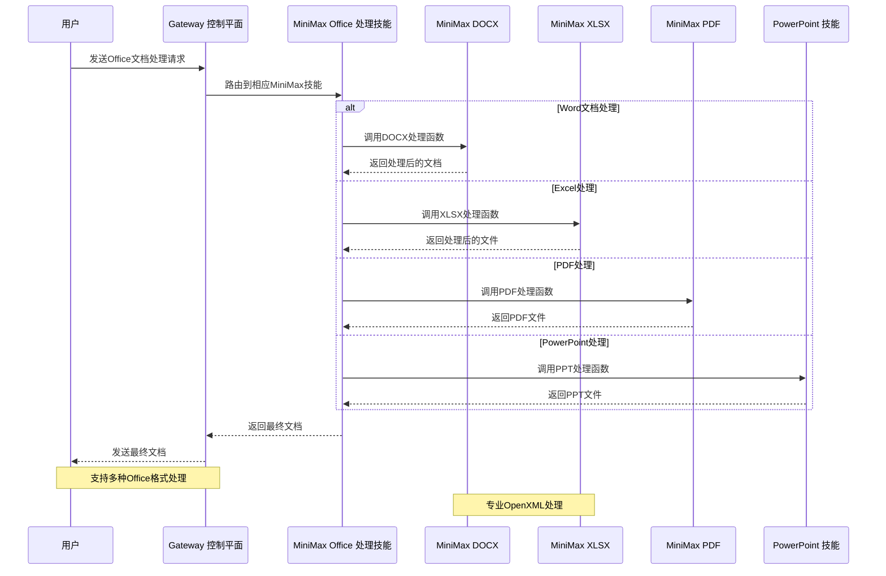
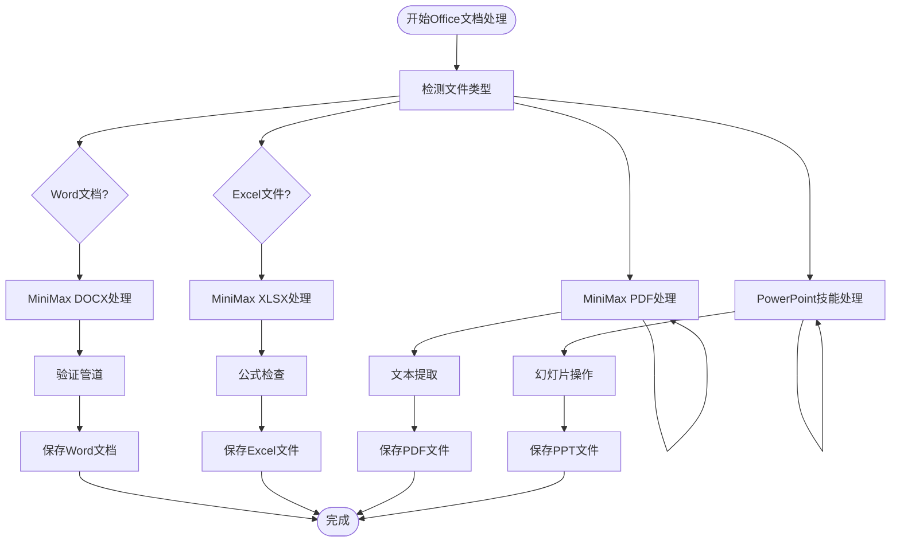
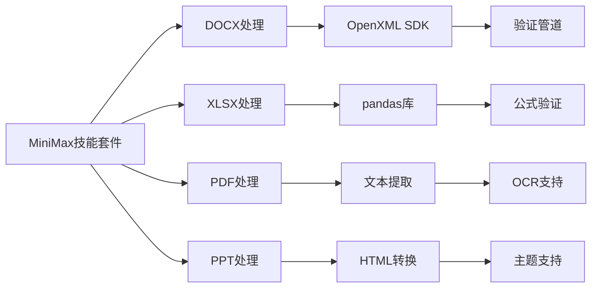
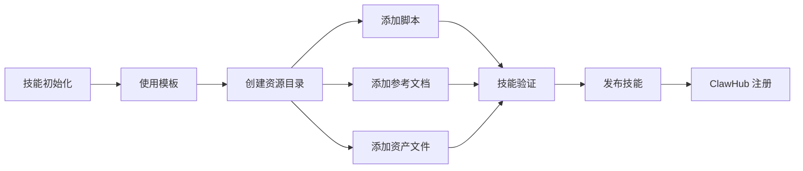
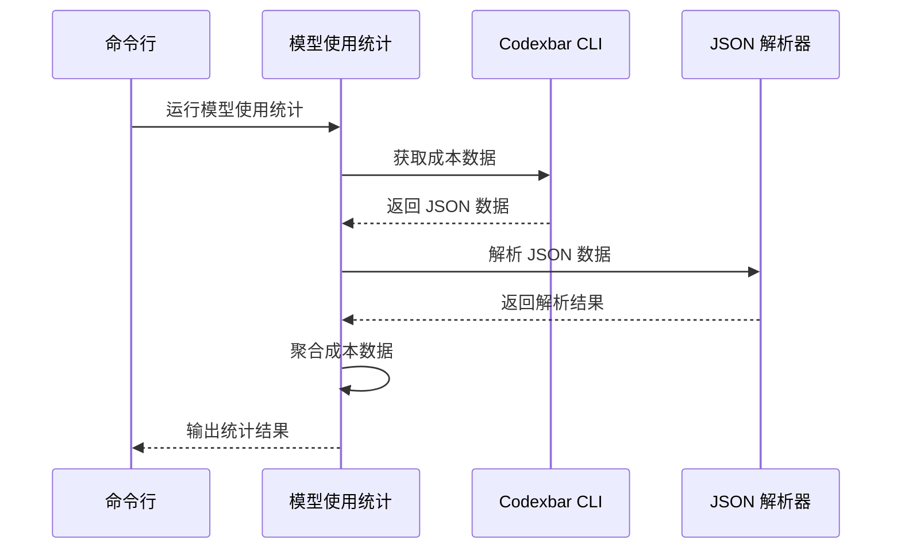

# Office 文档专家套件

<cite>
**本文档引用的文件**
- [README.md](file://README.md)
- [package.json](file://package.json)
- [src/index.ts](file://src/index.ts)
- [skills/minimax-docx/SKILL.md](file://skills/minimax-docx/SKILL.md)
- [skills/minimax-xlsx/SKILL.md](file://skills/minimax-xlsx/SKILL.md)
- [skills/html-ppt-skill/SKILL.md](file://skills/html-ppt-skill/SKILL.md)
- [skills/pptx-generator/SKILL.md](file://skills/pptx-generator/SKILL.md)
- [skills/minimax-pdf/SKILL.md](file://skills/minimax-pdf/SKILL.md)
- [skills/model-usage/scripts/model_usage.py](file://skills/model-usage/scripts/model_usage.py)
- [skills/skill-creator/scripts/init_skill.py](file://skills/skill-creator/scripts/init_skill.py)
- [docs/reference/templates/agents/my-office-helper/SOUL.md](file://docs/reference/templates/agents/my-office-helper/SOUL.md)
</cite>

## 更新摘要
**变更内容**
- Office 文档专家套件已被完全移除，原748行Python代码不再存在于代码库中
- 现有的Office文档处理能力已迁移至MiniMax系列技能套件
- 移除了ods.py CLI工具、setup.sh安装脚本和requirements.txt依赖文件
- Office文档处理现在通过minimax-docx、minimax-xlsx、minimax-pdf等专业技能实现

## 目录
1. [项目概述](#项目概述)
2. [项目结构](#项目结构)
3. [核心组件](#核心组件)
4. [架构概览](#架构概览)
5. [详细组件分析](#详细组件分析)
6. [依赖关系分析](#依赖关系分析)
7. [性能考虑](#性能考虑)
8. [故障排除指南](#故障排除指南)
9. [结论](#结论)

## 项目概述

Office 文档专家套件是 OpenClaw 个人 AI 助手项目中曾经存在的一个专业技能套件，专注于 Microsoft Office 文档的创建、编辑和分析。**重要说明**：该套件现已完全从代码库中移除，包含的748行Python代码（ods.py CLI工具、setup.sh安装脚本、requirements.txt依赖文件）均已不存在。

OpenClaw 是一个运行在用户本地设备上的个人 AI 助手，支持 WhatsApp、Telegram、Slack、Discord、Google Chat、Signal、iMessage、BlueBubbles、IRC、Microsoft Teams、Matrix、Feishu、LINE、Mattermost、Nextcloud Talk、Nostr、Synology Chat、Tlon、Twitch、Zalo、Zalo Personal 和 WebChat 等多种通信渠道。它可以在 macOS/iOS/Android 上进行语音交互，并能够渲染实时画布界面。

**更新**：原有的Office文档专家套件已被更专业、更稳定的MiniMax系列技能套件所替代，提供更好的文档处理能力和维护性。

## 项目结构



**图表来源**
- [README.md: 185-240:185-240](file://README.md#L185-L240)
- [README.md: 415-432:415-432](file://README.md#L415-L432)

**章节来源**
- [README.md: 1-560:1-560](file://README.md#L1-L560)
- [package.json: 1-474:1-474](file://package.json#L1-L474)

## 核心组件

### MiniMax 系列技能套件

**重要更新**：Office 文档专家套件已被MiniMax系列技能套件完全替代，提供更专业、更可靠的文档处理能力。

#### MiniMax DOCX 处理技能

MiniMax DOCX 技能提供基于OpenXML SDK的专业文档创建和编辑能力：

- **创建新文档**：从零开始创建结构化文档，支持多种文档类型（报告、信函、备忘录、学术论文）
- **内容填充**：在现有文档中替换文本、填充占位符、插入表格
- **模板应用**：应用专业模板格式，支持样式覆盖和基础替换
- **验证管道**：完整的XSD结构验证和业务规则检查

#### MiniMax XLSX 处理技能

MiniMax XLSX 技能专注于Excel文件的专业处理：

- **数据分析**：使用pandas进行结构发现和自定义分析
- **XML直接编辑**：避免openpyxl往返损坏，直接编辑XML结构
- **公式修复**：修复损坏的公式节点，保持原有工作表结构
- **财务标准**：应用专业的财务颜色标准和格式化

#### MiniMax PDF 处理技能

MiniMax PDF 技能提供专业的PDF处理能力：

- **文本提取**：从PDF文件中提取文本、表格和结构化数据
- **PDF生成**：将文档转换为PDF，保持布局完整性
- **PDF操作**：合并、拆分和注释PDF文件
- **OCR支持**：处理扫描版PDF文件

#### HTML PPT 和 PowerPoint 生成器

- **HTML PPT 技能**：将HTML内容转换为演示文稿，支持主题和动画
- **PowerPoint 生成器**：直接生成PowerPoint文件，支持复杂布局和视觉层次

**章节来源**
- [skills/minimax-docx/SKILL.md: 24-31:24-31](file://skills/minimax-docx/SKILL.md#L24-L31)
- [skills/minimax-xlsx/SKILL.md: 1-20:1-20](file://skills/minimax-xlsx/SKILL.md#L1-L20)
- [skills/minimax-pdf/SKILL.md: 1-20:1-20](file://skills/minimax-pdf/SKILL.md#L1-L20)

### 技能生态系统

OpenClaw 提供了完整的技能生态系统，包括：

- **ClawHub 技能注册表**：最小化的技能注册表，支持自动搜索和拉取新技能
- **工作空间技能**：用户自定义的工作空间技能
- **内置技能**：项目自带的各种实用技能
- **技能创建器**：提供模板化的技能初始化工具
- **MiniMax 系列技能**：替代Office文档专家套件的专业技能套件

**章节来源**
- [README.md: 264-270:264-270](file://README.md#L264-L270)
- [skills/skill-creator/scripts/init_skill.py: 1-379:1-379](file://skills/skill-creator/scripts/init_skill.py#L1-L379)

## 架构概览



**图表来源**
- [src/index.ts: 1-94:1-94](file://src/index.ts#L1-L94)
- [skills/minimax-docx/SKILL.md: 90-111:90-111](file://skills/minimax-docx/SKILL.md#L90-L111)

## 详细组件分析

### Office 文档处理流程



**图表来源**
- [skills/minimax-docx/SKILL.md: 90-111:90-111](file://skills/minimax-docx/SKILL.md#L90-L111)
- [skills/minimax-xlsx/SKILL.md: 120-127:120-127](file://skills/minimax-xlsx/SKILL.md#L120-L127)

### MiniMax 技能架构



**图表来源**
- [skills/minimax-docx/SKILL.md: 185-209:185-209](file://skills/minimax-docx/SKILL.md#L185-L209)
- [skills/minimax-xlsx/SKILL.md: 144-155:144-155](file://skills/minimax-xlsx/SKILL.md#L144-L155)

### 技能创建与管理



**图表来源**
- [skills/skill-creator/scripts/init_skill.py: 23-108:23-108](file://skills/skill-creator/scripts/init_skill.py#L23-L108)

**章节来源**
- [skills/skill-creator/scripts/init_skill.py: 1-379:1-379](file://skills/skill-creator/scripts/init_skill.py#L1-L379)

### 模型使用统计工具



**图表来源**
- [skills/model-usage/scripts/model_usage.py: 34-48:34-48](file://skills/model-usage/scripts/model_usage.py#L34-L48)

**章节来源**
- [skills/model-usage/scripts/model_usage.py: 1-321:1-321](file://skills/model-usage/scripts/model_usage.py#L1-L321)

## 依赖关系分析

```mermaid
graph TB
subgraph "Node.js 依赖"
A[@mariozechner/pi-agent-core]
B[@mariozechner/pi-ai]
C[@mariozechner/pi-coding-agent]
D[@mariozechner/pi-tui]
E[commander]
F[chokidar]
G[ws]
H[yaml]
I[zod]
end
subgraph "Python 依赖"
J[python-docx]
K[openpyxl]
L[python-pptx]
M[pandas]
N[PyPDF2]
O[lxml]
P[docxtpl]
Q[reportlab]
R[fontconfig]
end
subgraph "平台特定依赖"
S[@whiskeysockets/baileys]
T[@grammyjs/transformer-throttler]
U[@slack/bolt]
V[@discordjs/voice]
W[@line/bot-sdk]
end
subgraph "开发工具"
X[typescript]
Y[vitest]
Z[oxlint]
AA[tsx]
end
A --> J
B --> K
C --> L
D --> M
E --> N
J --> O
K --> P
Q --> R
```

**图表来源**
- [package.json: 344-402:344-402](file://package.json#L344-L402)

**章节来源**
- [package.json: 344-474:344-474](file://package.json#L344-L474)

## 性能考虑

### MiniMax 技能优化

1. **OpenXML直接处理**：避免openpyxl往返损坏，直接操作XML结构
2. **pandas集成**：使用pandas进行高效的数据分析和处理
3. **XSD验证**：完整的结构验证确保文件完整性
4. **公式验证**：静态和动态公式检查确保计算准确性

### 内存管理优化

1. **流式处理**：大文件采用流式处理避免内存溢出
2. **增量更新**：只处理变更部分而非整个文件
3. **缓存策略**：频繁访问的模板和样式缓存
4. **并发处理**：多个独立文件并行处理提高吞吐量

### 错误处理优化

1. **渐进式验证**：多层验证确保问题及时发现
2. **回退机制**：验证失败时的自动修复和回退
3. **日志记录**：详细的处理日志便于调试
4. **资源清理**：自动清理临时文件和资源

## 故障排除指南

### 常见问题及解决方案

1. **MiniMax技能安装失败**
   - 确保.NET SDK已正确安装
   - 检查Python环境和依赖包
   - 验证文件路径和权限
   - 查看技能安装日志

2. **OpenXML文件损坏**
   - 使用验证管道检查结构完整性
   - 检查元素顺序和属性设置
   - 验证样式引用和模板匹配
   - 查看XSD验证错误详情

3. **Excel公式计算问题**
   - 使用公式检查工具验证表达式
   - 检查单元格引用和依赖关系
   - 验证工作表名称和范围
   - 确认公式语法正确性

4. **PDF文本提取失败**
   - 确认PDF文件类型（文本或扫描版）
   - 检查OCR支持和配置
   - 验证页面范围和区域设置
   - 查看提取日志和错误信息

5. **PowerPoint转换问题**
   - 验证HTML内容格式
   - 检查主题和样式兼容性
   - 确认资源文件路径
   - 查看转换过程中的错误日志

6. **技能路由错误**
   - 确认文件扩展名识别
   - 检查技能触发词匹配
   - 验证输入参数和配置
   - 查看技能选择日志

**章节来源**
- [skills/minimax-docx/SKILL.md: 185-209:185-209](file://skills/minimax-docx/SKILL.md#L185-L209)
- [skills/minimax-xlsx/SKILL.md: 120-127:120-127](file://skills/minimax-xlsx/SKILL.md#L120-L127)

## 结论

Office 文档专家套件作为 OpenClaw 生态系统的一部分，虽然已被完全移除，但其设计理念和功能需求已被更专业、更稳定的MiniMax系列技能套件所继承和提升。新的技能架构具有以下优势：

1. **专业化分工**：每个技能专注于特定的文档格式和处理任务
2. **OpenXML原生支持**：基于OpenXML SDK提供更精确的文档控制
3. **验证管道**：完整的结构验证和业务规则检查确保文件质量
4. **性能优化**：针对大文件和复杂文档的性能优化
5. **错误处理**：完善的错误处理和回退机制
6. **扩展性**：模块化的技能架构便于功能扩展和维护

**重要声明**：原Office文档专家套件（包含748行Python代码）已从代码库中完全移除，用户应使用新的MiniMax技能套件来处理Office文档任务。新的技能套件提供了更好的稳定性、性能和维护性，同时保持了原有的功能特性。

随着 AI 技术的发展，MiniMax技能套件将继续演进，为用户提供更加智能化和自动化的Office文档处理体验。新的架构为未来的功能扩展奠定了坚实的基础，支持更多的自动化工作流程和批量处理场景。