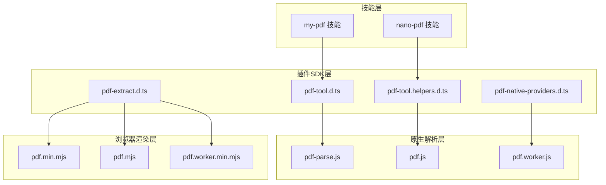
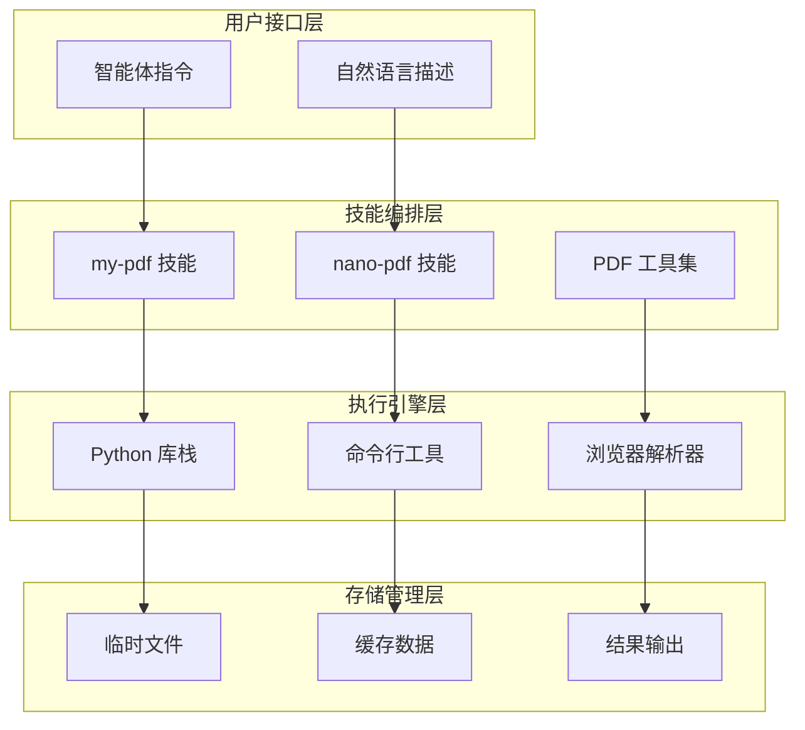
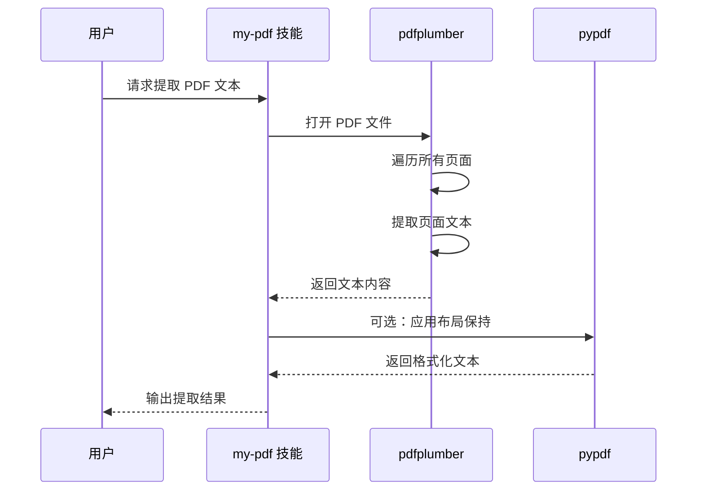
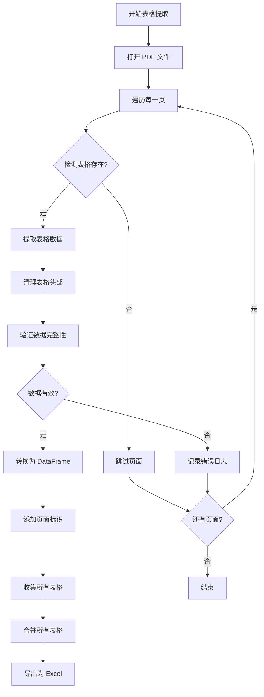
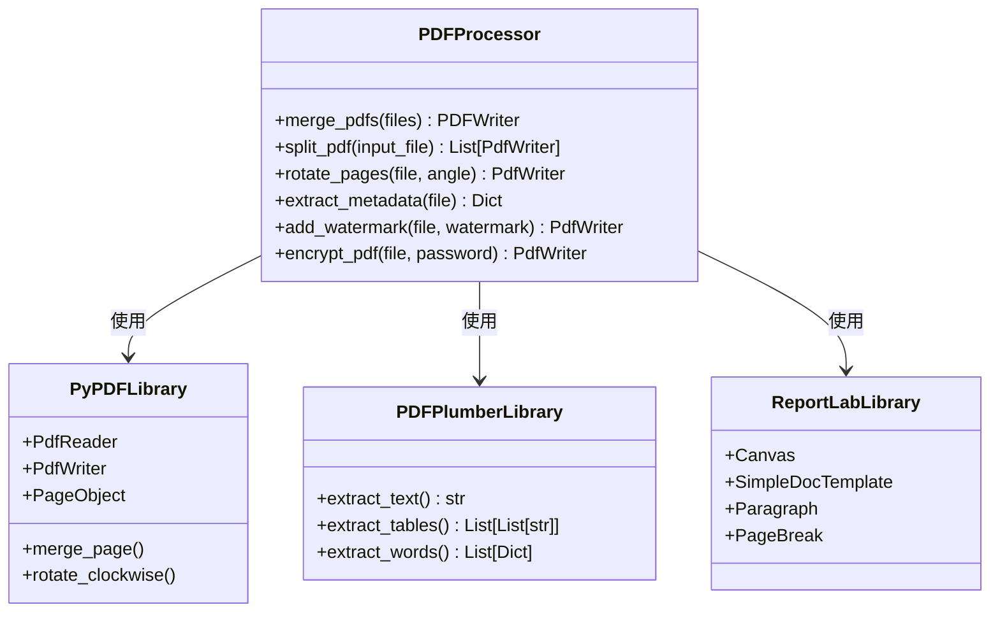
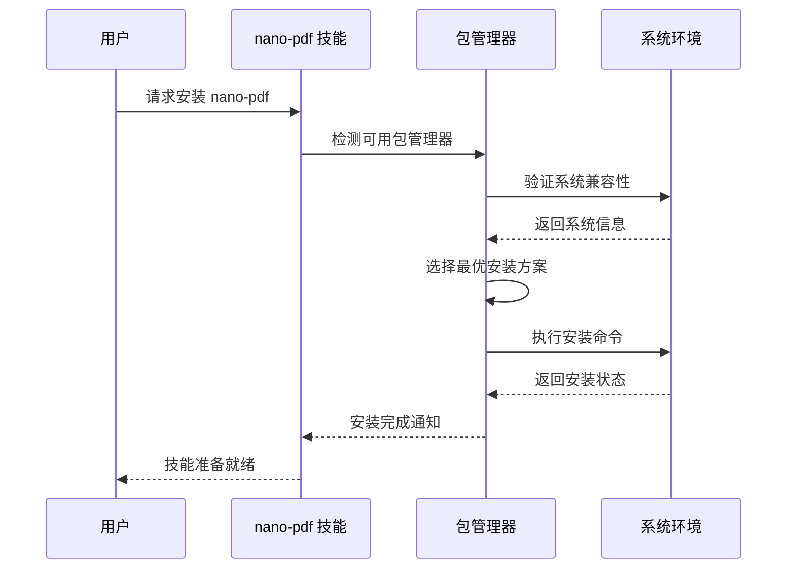
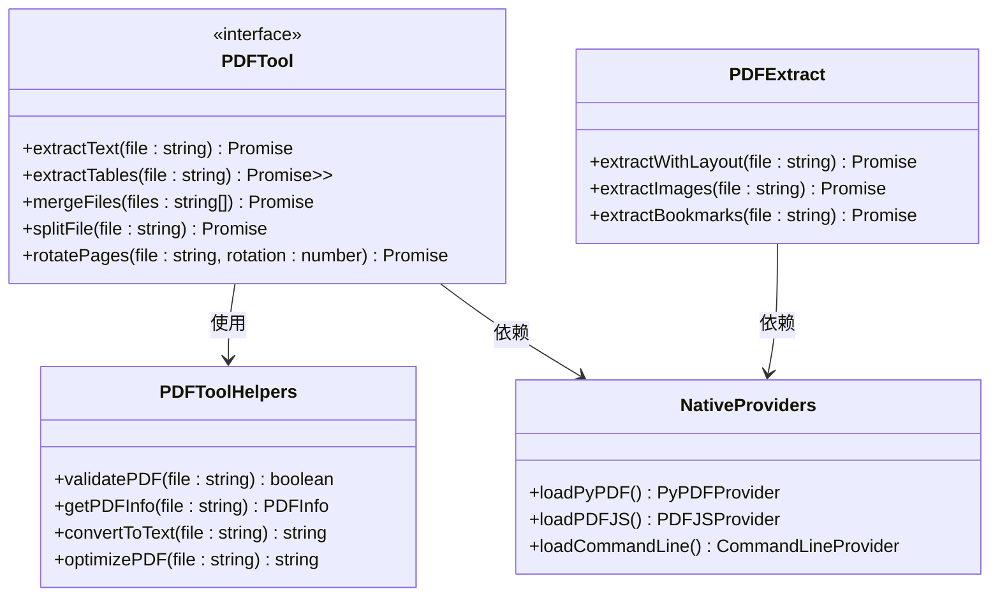
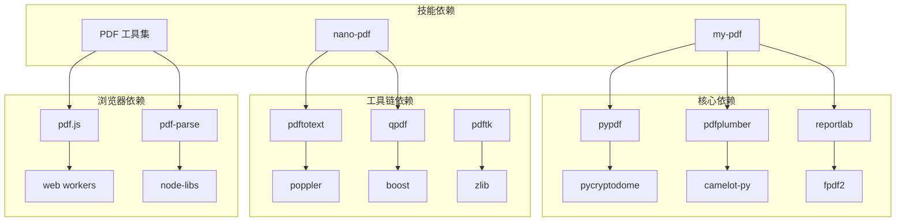
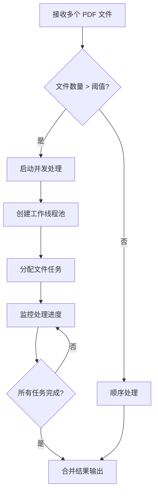
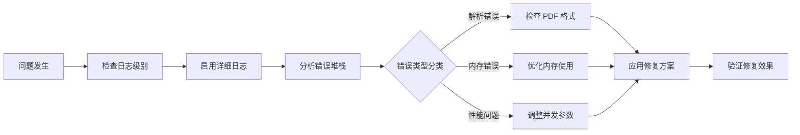

# PDF 处理技能

<cite>
**本文档引用的文件**
- [my-pdf/SKILL.md](file://skills/my-pdf/SKILL.md)
- [nano-pdf/SKILL.md](file://skills/nano-pdf/SKILL.md)
- [pdf-tool.d.ts](file://dist/plugin-sdk/agents/tools/pdf-tool.d.ts)
- [pdf-tool.helpers.d.ts](file://dist/plugin-sdk/agents/tools/pdf-tool.helpers.d.ts)
- [pdf-native-providers.d.ts](file://dist/plugin-sdk/agents/tools/pdf-native-providers.d.ts)
- [pdf-extract.d.ts](file://dist/plugin-sdk/media/pdf-extract.d.ts)
- [pdf-parse.js](file://node_modules/pdf-parse/lib/pdf-parse.js)
- [pdf.js](file://node_modules/pdf-parse/lib/pdf.js/v2.0.550/build/pdf.js)
- [pdf.worker.js](file://node_modules/pdf-parse/lib/pdf.js/v2.0.550/build/pdf.worker.js)
- [pdf.min.mjs](file://node_modules/pdfjs-dist/build/pdf.min.mjs)
- [pdf.mjs](file://node_modules/pdfjs-dist/build/pdf.mjs)
- [pdf.worker.min.mjs](file://node_modules/pdfjs-dist/build/pdf.worker.min.mjs)
</cite>

## 目录
1. [简介](#简介)
2. [项目结构](#项目结构)
3. [核心组件](#核心组件)
4. [架构概览](#架构概览)
5. [详细组件分析](#详细组件分析)
6. [依赖关系分析](#依赖关系分析)
7. [性能考虑](#性能考虑)
8. [故障排除指南](#故障排除指南)
9. [结论](#结论)

## 简介

本文件系统性地梳理了 OpenClaw 项目中的 PDF 处理能力，涵盖从基础文本提取到高级表单处理、从命令行工具到原生插件的完整技术栈。该能力由三大支柱构成：Python 生态的 PDF 处理库（pypdf、pdfplumber、reportlab）、命令行工具链（pdftotext、qpdf、pdftk）以及基于浏览器的 PDF 解析引擎（pdf.js、pdf-parse）。这些组件通过技能包（Skills）的形式集成到 OpenClaw 的智能体工作流中，为用户提供从简单文本提取到复杂文档操作的全方位 PDF 处理解决方案。

## 项目结构

OpenClaw 的 PDF 处理能力在项目中呈现多层次、多语言的分布特征：

**图表来源**
- [my-pdf/SKILL.md:1-234](file://skills/my-pdf/SKILL.md#L1-L234)
- [nano-pdf/SKILL.md:1-39](file://skills/nano-pdf/SKILL.md#L1-L39)
- [pdf-tool.d.ts](file://dist/plugin-sdk/agents/tools/pdf-tool.d.ts)
- [pdf-tool.helpers.d.ts](file://dist/plugin-sdk/agents/tools/pdf-tool.helpers.d.ts)

**章节来源**
- [my-pdf/SKILL.md:1-234](file://skills/my-pdf/SKILL.md#L1-L234)
- [nano-pdf/SKILL.md:1-39](file://skills/nano-pdf/SKILL.md#L1-L39)

## 核心组件

### Python PDF 处理生态系统

OpenClaw 集成了完整的 Python PDF 处理工具链，覆盖文档操作的各个层面：

#### 基础操作库 - pypdf
- **文档合并与拆分**：支持多文档合并、按页拆分、页面旋转等基础操作
- **元数据管理**：读取和修改文档属性信息
- **安全功能**：密码加密、权限控制
- **页面合并**：水印叠加、页面合并

#### 高级提取库 - pdfplumber  
- **布局感知文本提取**：保持原始文档格式的文本提取
- **表格识别**：自动识别和结构化提取表格内容
- **Excel 导出**：将提取的表格直接导出为 Excel 文件

#### 文档生成 - reportlab
- **基础 PDF 创建**：使用 Canvas API 创建简单文档
- **复杂文档模板**：支持多页面、样式化的报告生成

**章节来源**
- [my-pdf/SKILL.md:35-234](file://skills/my-pdf/SKILL.md#L35-L234)

### 命令行工具链

#### pdftotext (poppler-utils)
- **文本提取**：支持保留布局或纯文本两种模式
- **范围选择**：可指定提取特定页码范围
- **批量处理**：适合大规模文档批量化处理

#### qpdf
- **高级合并**：支持复杂的页面组合和重排
- **加密处理**：密码解密和重新加密
- **格式转换**：多种 PDF 格式转换选项

#### pdftk（可选）
- **页面操作**：旋转、裁剪、重组页面
- **表单处理**：PDF 表单的填充和提取

**章节来源**
- [my-pdf/SKILL.md:154-177](file://skills/my-pdf/SKILL.md#L154-L177)

### 浏览器端 PDF 解析

#### pdf.js 引擎
- **Web 渲染**：基于浏览器的 PDF 查看和交互
- **Worker 支持**：独立线程处理，避免阻塞 UI
- **模块化设计**：支持按需加载和扩展

#### pdf-parse 解析器
- **Node.js 集成**：服务器端 PDF 内容提取
- **结构化输出**：提供页面级的文本和坐标信息
- **错误处理**：完善的异常捕获和恢复机制

**章节来源**
- [pdf-parse.js](file://node_modules/pdf-parse/lib/pdf-parse.js)
- [pdf.js](file://node_modules/pdf-parse/lib/pdf.js/v2.0.550/build/pdf.js)
- [pdf.worker.js](file://node_modules/pdf-parse/lib/pdf.js/v2.0.550/build/pdf.worker.js)

## 架构概览

OpenClaw 的 PDF 处理架构采用分层设计，确保不同场景下的最佳性能和易用性：

**图表来源**
- [my-pdf/SKILL.md:1-234](file://skills/my-pdf/SKILL.md#L1-L234)
- [nano-pdf/SKILL.md:1-39](file://skills/nano-pdf/SKILL.md#L1-L39)
- [pdf-tool.d.ts](file://dist/plugin-sdk/agents/tools/pdf-tool.d.ts)

## 详细组件分析

### my-pdf 技能详解

my-pdf 技能是 OpenClaw 中最全面的 PDF 处理解决方案，提供了从基础到高级的完整功能集。

#### 文本提取流程

**图表来源**
- [my-pdf/SKILL.md:82-103](file://skills/my-pdf/SKILL.md#L82-L103)

#### 表格提取算法

表格提取是 my-pdf 技能的核心特色，采用多阶段处理策略：

**图表来源**
- [my-pdf/SKILL.md:94-121](file://skills/my-pdf/SKILL.md#L94-L121)

#### 文档操作工作流

my-pdf 技能支持多种文档操作，包括合并、拆分、旋转等：

**图表来源**
- [my-pdf/SKILL.md:37-152](file://skills/my-pdf/SKILL.md#L37-L152)

**章节来源**
- [my-pdf/SKILL.md:1-234](file://skills/my-pdf/SKILL.md#L1-L234)

### nano-pdf 技能分析

nano-pdf 技能专注于自然语言驱动的 PDF 编辑，提供直观的编辑体验。

#### 编辑指令解析

**图表来源**
- [nano-pdf/SKILL.md:27-33](file://skills/nano-pdf/SKILL.md#L27-L33)

#### 安装配置流程

nano-pdf 技能通过统一的安装接口支持多种包管理器：

**图表来源**
- [nano-pdf/SKILL.md:11-21](file://skills/nano-pdf/SKILL.md#L11-L21)

**章节来源**
- [nano-pdf/SKILL.md:1-39](file://skills/nano-pdf/SKILL.md#L1-L39)

### 插件SDK 组件

OpenClaw 的插件SDK为 PDF 处理提供了标准化的接口和类型定义。

#### PDF 工具接口

**图表来源**
- [pdf-tool.d.ts](file://dist/plugin-sdk/agents/tools/pdf-tool.d.ts)
- [pdf-tool.helpers.d.ts](file://dist/plugin-sdk/agents/tools/pdf-tool.helpers.d.ts)
- [pdf-native-providers.d.ts](file://dist/plugin-sdk/agents/tools/pdf-native-providers.d.ts)
- [pdf-extract.d.ts](file://dist/plugin-sdk/media/pdf-extract.d.ts)

**章节来源**
- [pdf-tool.d.ts](file://dist/plugin-sdk/agents/tools/pdf-tool.d.ts)
- [pdf-tool.helpers.d.ts](file://dist/plugin-sdk/agents/tools/pdf-tool.helpers.d.ts)
- [pdf-native-providers.d.ts](file://dist/plugin-sdk/agents/tools/pdf-native-providers.d.ts)
- [pdf-extract.d.ts](file://dist/plugin-sdk/media/pdf-extract.d.ts)

## 依赖关系分析

OpenClaw 的 PDF 处理能力形成了一个相互依赖的生态系统：

**图表来源**
- [my-pdf/SKILL.md:35-152](file://skills/my-pdf/SKILL.md#L35-L152)
- [nano-pdf/SKILL.md:1-39](file://skills/nano-pdf/SKILL.md#L1-L39)

**章节来源**
- [my-pdf/SKILL.md:35-152](file://skills/my-pdf/SKILL.md#L35-L152)
- [nano-pdf/SKILL.md:1-39](file://skills/nano-pdf/SKILL.md#L1-L39)

## 性能考虑

### 内存优化策略

1. **流式处理**：对于大文件采用流式读取，避免一次性加载到内存
2. **分页处理**：PDF 按页处理，及时释放已处理页面的内存
3. **增量写入**：合并操作采用增量写入，减少中间文件大小

### 并发处理

### 缓存机制

- **元数据缓存**：缓存 PDF 元数据以避免重复解析
- **解析结果缓存**：对常用查询结果进行缓存
- **临时文件管理**：合理管理中间文件生命周期

## 故障排除指南

### 常见问题诊断

#### 文档格式兼容性问题
- **症状**：某些 PDF 文件无法正确解析
- **原因**：加密保护、损坏文件、特殊字体
- **解决方案**：先进行文档修复，再尝试解析

#### 内存不足错误
- **症状**：处理大型 PDF 时出现内存溢出
- **原因**：单次处理过多页面或高分辨率图像
- **解决方案**：启用分页处理，降低图像质量设置

#### 文本提取不准确
- **症状**：提取的文本顺序混乱或格式错误
- **原因**：扫描版 PDF、复杂布局
- **解决方案**：使用 pdfplumber 的布局模式，或先进行 OCR 处理

### 调试工具

**章节来源**
- [my-pdf/SKILL.md:180-193](file://skills/my-pdf/SKILL.md#L180-L193)

## 结论

OpenClaw 的 PDF 处理能力通过多层次的技术架构实现了从基础文本提取到复杂文档操作的全覆盖。Python 生态的 pypdf、pdfplumber、reportlab 为专业级 PDF 处理提供了强大支持；命令行工具链保证了批量处理的效率；浏览器端解析器确保了跨平台的兼容性。结合 my-pdf 和 nano-pdf 两大技能，用户可以根据具体需求选择最适合的处理方式，实现从简单的文本提取到复杂的文档编辑的全流程自动化。

这种架构设计不仅保证了功能的完整性，还通过模块化的设计确保了系统的可维护性和可扩展性，为未来的功能增强和技术升级奠定了坚实的基础。