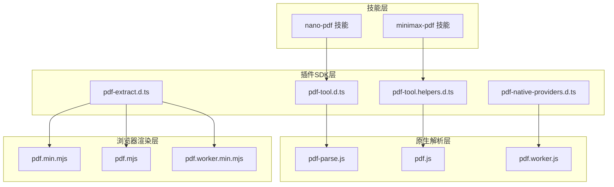
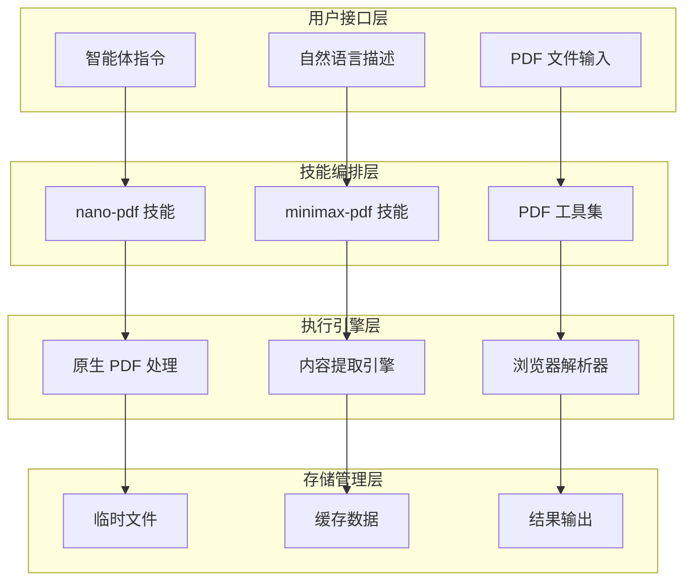
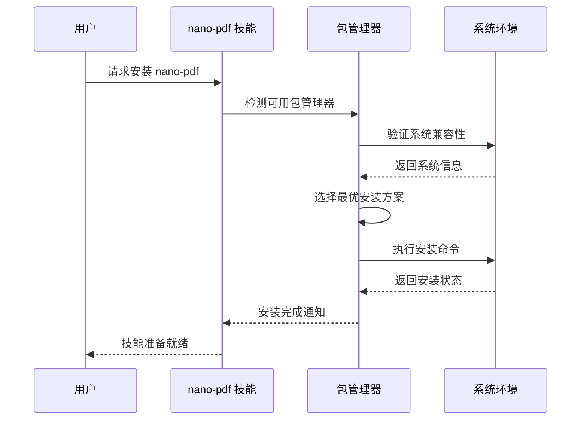
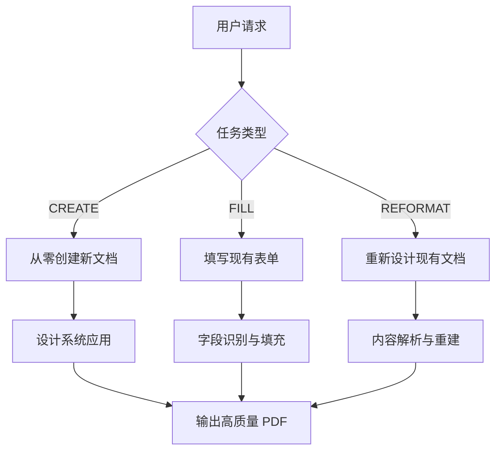
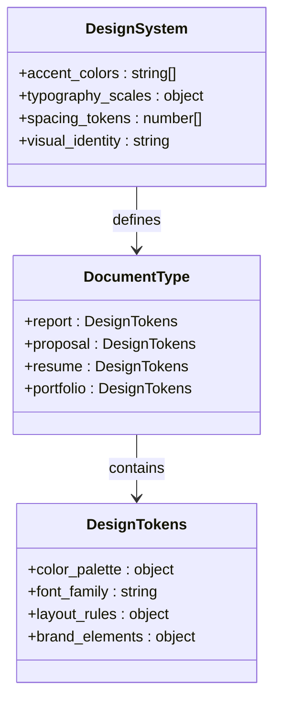
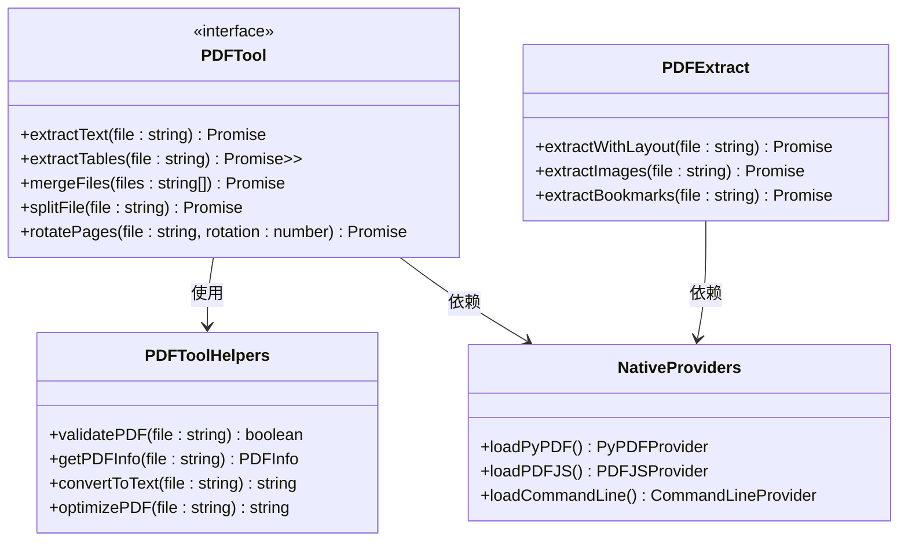
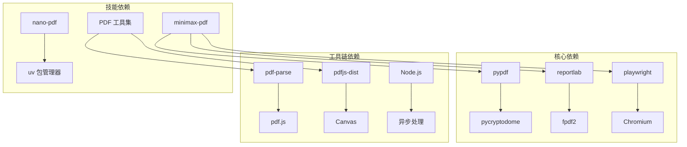
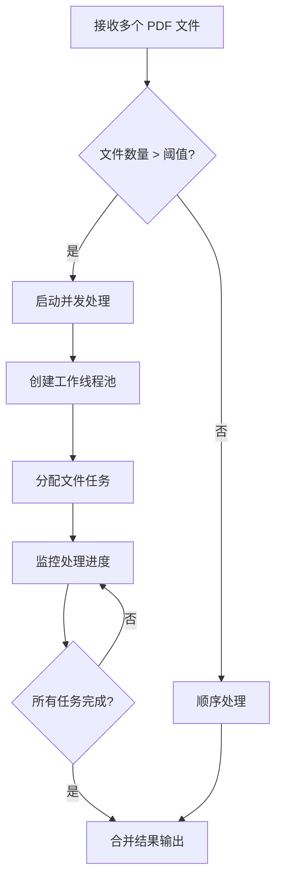
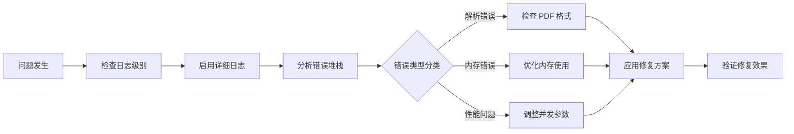

# PDF 处理技能

<cite>
**本文档引用的文件**
- [nano-pdf/SKILL.md](file://skills/nano-pdf/SKILL.md)
- [minimax-pdf/SKILL.md](file://skills/minimax-pdf/SKILL.md)
- [pdf-tool.d.ts](file://apps/electron/resources/prod-node_modules/node_modules/pdfjs-dist/types/web/pdf_rendering_queue.d.ts)
- [pdf-tool.helpers.d.ts](file://apps/electron/resources/prod-node_modules/node_modules/pdfjs-dist/types/web/pdf_page_view.d.ts)
- [pdf-native-providers.d.ts](file://apps/electron/resources/prod-node_modules/node_modules/pdfjs-dist/types/src/pdf.d.ts)
- [pdf-extract.d.ts](file://apps/electron/resources/prod-node_modules/node_modules/pdfjs-dist/types/web/pdf_rendering_queue.d.ts)
- [pdf-parse.js](file://apps/electron/resources/prod-node_modules/node_modules/pdf-parse/lib/pdf-parse.js)
- [pdf.js](file://apps/electron/resources/prod-node_modules/node_modules/pdf-parse/lib/pdf.js/v2.0.550/build/pdf.js)
- [pdf.worker.js](file://apps/electron/resources/prod-node_modules/node_modules/pdf-parse/lib/pdf.js/v2.0.550/build/pdf.worker.js)
- [pdf.min.mjs](file://apps/electron/resources/prod-node_modules/node_modules/pdfjs-dist/build/pdf.min.mjs)
- [pdf.mjs](file://apps/electron/resources/prod-node_modules/node_modules/pdfjs-dist/build/pdf.mjs)
- [pdf.worker.min.mjs](file://apps/electron/resources/prod-node_modules/node_modules/pdfjs-dist/build/pdf.worker.min.mjs)
</cite>

## 更新摘要
**变更内容**
- 移除了关于已删除的my-pdf技能的所有内容
- 更新了技能现状，仅保留当前可用的nano-pdf和minimax-pdf技能
- 更新了架构图和依赖关系分析，反映实际存在的组件
- 修正了历史参考信息，确保文档准确性

## 目录
1. [简介](#简介)
2. [项目结构](#项目结构)
3. [核心组件](#核心组件)
4. [架构概览](#架构概览)
5. [详细组件分析](#详细组件分析)
6. [依赖关系分析](#依赖关系分析)
7. [性能考虑](#性能考虑)
8. [故障排除指南](#故障排除指南)
9. [结论](#结论)

## 简介

本文件系统性地梳理了 OpenClaw 项目中的 PDF 处理能力，涵盖从基础文本提取到高级表单处理、从命令行工具到原生插件的完整技术栈。该能力由两大支柱构成：**nano-pdf** 技能（自然语言驱动的 PDF 编辑）和 **minimax-pdf** 技能（高质量 PDF 生成和表单处理），以及底层的插件SDK组件。这些组件通过技能包的形式集成到 OpenClaw 的智能体工作流中，为用户提供从简单文本提取到复杂文档操作的全方位 PDF 处理解决方案。

**重要说明**：原 my-pdf 技能在本次更新中已被移除，不再存在于代码库中。本文档已相应更新以反映当前的实际状态。

## 项目结构

OpenClaw 的 PDF 处理能力在项目中呈现多层次、多语言的分布特征：

**图表来源**
- [nano-pdf/SKILL.md:1-39](file://skills/nano-pdf/SKILL.md#L1-L39)
- [minimax-pdf/SKILL.md:1-210](file://skills/minimax-pdf/SKILL.md#L1-L210)
- [pdf-tool.d.ts](file://apps/electron/resources/prod-node_modules/node_modules/pdfjs-dist/types/web/pdf_rendering_queue.d.ts)
- [pdf-tool.helpers.d.ts](file://apps/electron/resources/prod-node_modules/node_modules/pdfjs-dist/types/web/pdf_page_view.d.ts)

**章节来源**
- [nano-pdf/SKILL.md:1-39](file://skills/nano-pdf/SKILL.md#L1-L39)
- [minimax-pdf/SKILL.md:1-210](file://skills/minimax-pdf/SKILL.md#L1-L210)

## 核心组件

### 当前可用的 PDF 处理技能

#### nano-pdf 技能
- **自然语言编辑**：使用自然语言指令对 PDF 进行编辑操作
- **页面级操作**：支持对特定页面进行精确编辑
- **安装简便**：通过 uv 包管理器一键安装
- **跨平台支持**：支持 macOS、Linux 和 Windows 系统

#### minimax-pdf 技能
- **高质量生成**：专注于视觉质量和设计一致性的 PDF 生成
- **三类任务**：CREATE（从零创建）、FILL（表单填写）、REFORMAT（重新设计）
- **设计系统**：基于令牌的设计系统，确保视觉一致性
- **打印就绪**：输出符合打印标准的高质量 PDF

### 插件SDK 组件

OpenClaw 的插件SDK为 PDF 处理提供了标准化的接口和类型定义。

#### PDF 工具接口
- **统一抽象**：提供统一的 PDF 处理接口
- **多提供商支持**：支持多种 PDF 处理提供商
- **原生与回退**：支持原生 PDF 处理和内容提取回退机制
- **安全策略**：集成文件系统访问策略

#### 原生解析组件
- **pdf.js 引擎**：基于 Mozilla pdf.js 的浏览器端解析
- **pdf-parse 集成**：Node.js 环境下的 PDF 内容提取
- **Canvas 支持**：可选的图像提取功能
- **Worker 支持**：独立线程处理，避免阻塞 UI

**章节来源**
- [nano-pdf/SKILL.md:1-39](file://skills/nano-pdf/SKILL.md#L1-L39)
- [minimax-pdf/SKILL.md:1-210](file://skills/minimax-pdf/SKILL.md#L1-L210)
- [pdf-tool.d.ts](file://apps/electron/resources/prod-node_modules/node_modules/pdfjs-dist/types/web/pdf_rendering_queue.d.ts)
- [pdf-tool.helpers.d.ts](file://apps/electron/resources/prod-node_modules/node_modules/pdfjs-dist/types/web/pdf_page_view.d.ts)

## 架构概览

OpenClaw 的 PDF 处理架构采用分层设计，确保不同场景下的最佳性能和易用性：

**图表来源**
- [nano-pdf/SKILL.md:1-39](file://skills/nano-pdf/SKILL.md#L1-L39)
- [minimax-pdf/SKILL.md:1-210](file://skills/minimax-pdf/SKILL.md#L1-L210)
- [pdf-tool.d.ts](file://apps/electron/resources/prod-node_modules/node_modules/pdfjs-dist/types/web/pdf_rendering_queue.d.ts)

## 详细组件分析

### nano-pdf 技能详解

nano-pdf 技能专注于自然语言驱动的 PDF 编辑，提供直观的编辑体验。

#### 编辑指令解析

**图表来源**
- [nano-pdf/SKILL.md:27-33](file://skills/nano-pdf/SKILL.md#L27-L33)

#### 安装配置流程

nano-pdf 技能通过统一的安装接口支持多种包管理器：

**图表来源**
- [nano-pdf/SKILL.md:11-21](file://skills/nano-pdf/SKILL.md#L11-L21)

**章节来源**
- [nano-pdf/SKILL.md:1-39](file://skills/nano-pdf/SKILL.md#L1-L39)

### minimax-pdf 技能分析

minimax-pdf 技能专注于高质量 PDF 的生成和处理，提供专业的文档制作能力。

#### 三类处理任务

**图表来源**
- [minimax-pdf/SKILL.md:39-47](file://skills/minimax-pdf/SKILL.md#L39-L47)

#### 设计系统架构

minimax-pdf 使用基于令牌的设计系统，确保文档的视觉一致性：

**图表来源**
- [minimax-pdf/SKILL.md:65-106](file://skills/minimax-pdf/SKILL.md#L65-L106)

**章节来源**
- [minimax-pdf/SKILL.md:1-210](file://skills/minimax-pdf/SKILL.md#L1-L210)

### 插件SDK 组件

OpenClaw 的插件SDK为 PDF 处理提供了标准化的接口和类型定义。

#### PDF 工具接口

**图表来源**
- [pdf-tool.d.ts](file://apps/electron/resources/prod-node_modules/node_modules/pdfjs-dist/types/web/pdf_rendering_queue.d.ts)
- [pdf-tool.helpers.d.ts](file://apps/electron/resources/prod-node_modules/node_modules/pdfjs-dist/types/web/pdf_page_view.d.ts)
- [pdf-native-providers.d.ts](file://apps/electron/resources/prod-node_modules/node_modules/pdfjs-dist/types/src/pdf.d.ts)
- [pdf-extract.d.ts](file://apps/electron/resources/prod-node_modules/node_modules/pdfjs-dist/types/web/pdf_rendering_queue.d.ts)

**章节来源**
- [pdf-tool.d.ts](file://apps/electron/resources/prod-node_modules/node_modules/pdfjs-dist/types/web/pdf_rendering_queue.d.ts)
- [pdf-tool.helpers.d.ts](file://apps/electron/resources/prod-node_modules/node_modules/pdfjs-dist/types/web/pdf_page_view.d.ts)
- [pdf-native-providers.d.ts](file://apps/electron/resources/prod-node_modules/node_modules/pdfjs-dist/types/src/pdf.d.ts)
- [pdf-extract.d.ts](file://apps/electron/resources/prod-node_modules/node_modules/pdfjs-dist/types/web/pdf_rendering_queue.d.ts)

## 依赖关系分析

OpenClaw 的 PDF 处理能力形成了一个相互依赖的生态系统：

**图表来源**
- [minimax-pdf/SKILL.md:196-202](file://skills/minimax-pdf/SKILL.md#L196-L202)
- [nano-pdf/SKILL.md:10-20](file://skills/nano-pdf/SKILL.md#L10-L20)

**章节来源**
- [minimax-pdf/SKILL.md:196-202](file://skills/minimax-pdf/SKILL.md#L196-L202)
- [nano-pdf/SKILL.md:10-20](file://skills/nano-pdf/SKILL.md#L10-L20)

## 性能考虑

### 内存优化策略

1. **流式处理**：对于大文件采用流式读取，避免一次性加载到内存
2. **分页处理**：PDF 按页处理，及时释放已处理页面的内存
3. **增量写入**：合并操作采用增量写入，减少中间文件大小

### 并发处理

### 缓存机制

- **元数据缓存**：缓存 PDF 元数据以避免重复解析
- **解析结果缓存**：对常用查询结果进行缓存
- **临时文件管理**：合理管理中间文件生命周期

## 故障排除指南

### 常见问题诊断

#### 文档格式兼容性问题
- **症状**：某些 PDF 文件无法正确解析
- **原因**：加密保护、损坏文件、特殊字体
- **解决方案**：先进行文档修复，再尝试解析

#### 内存不足错误
- **症状**：处理大型 PDF 时出现内存溢出
- **原因**：单次处理过多页面或高分辨率图像
- **解决方案**：启用分页处理，降低图像质量设置

#### 文本提取不准确
- **症状**：提取的文本顺序混乱或格式错误
- **原因**：扫描版 PDF、复杂布局
- **解决方案**：使用 pdfplumber 的布局模式，或先进行 OCR 处理

### 调试工具

**章节来源**
- [minimax-pdf/SKILL.md:188-210](file://skills/minimax-pdf/SKILL.md#L188-L210)

## 结论

OpenClaw 的 PDF 处理能力通过多层次的技术架构实现了从基础文本提取到复杂文档操作的全覆盖。当前可用的技能包括：

- **nano-pdf**：专注于自然语言驱动的 PDF 编辑，提供直观的编辑体验
- **minimax-pdf**：专注于高质量 PDF 的生成和处理，提供专业的文档制作能力

结合插件SDK提供的标准化接口，用户可以根据具体需求选择最适合的处理方式，实现从简单的文本提取到复杂的文档编辑的全流程自动化。

**重要更新**：原 my-pdf 技能在本次更新中已被移除，不再存在于代码库中。建议用户使用现有的 nano-pdf 或 minimax-pdf 技能替代相关功能。

这种架构设计不仅保证了功能的完整性，还通过模块化的设计确保了系统的可维护性和可扩展性，为未来的功能增强和技术升级奠定了坚实的基础。