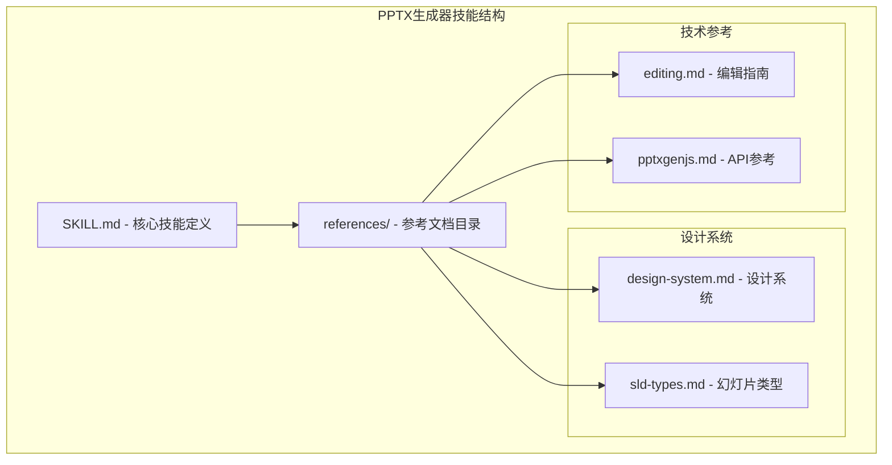
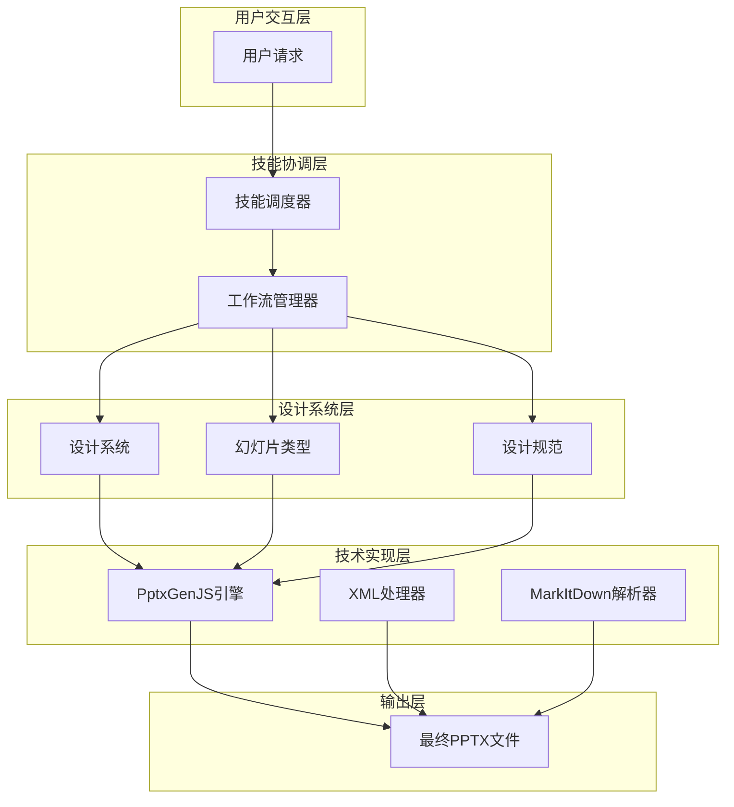
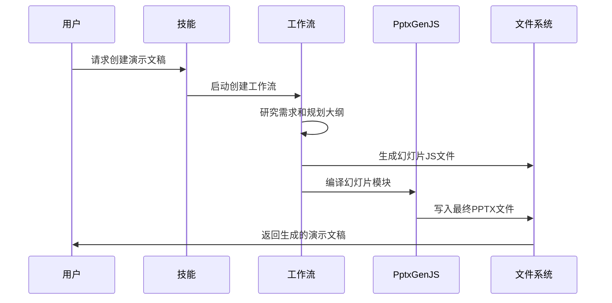
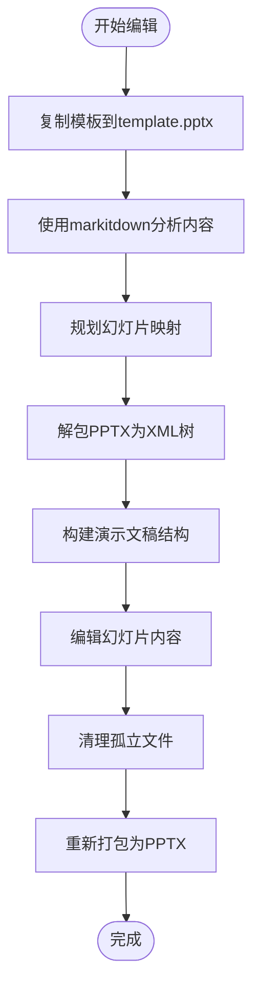
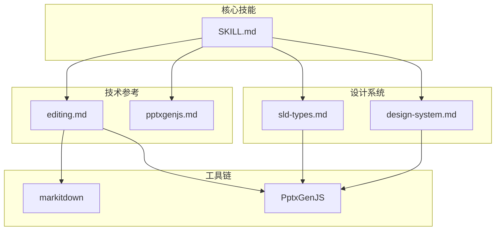

# PPTX生成器技能

<cite>
**本文档引用的文件**
- [SKILL.md](file://skills/pptx-generator/SKILL.md)
- [design-system.md](file://skills/pptx-generator/references/design-system.md)
- [slide-types.md](file://skills/pptx-generator/references/slide-types.md)
- [editing.md](file://skills/pptx-generator/references/editing.md)
- [pptxgenjs.md](file://skills/pptx-generator/references/pptxgenjs.md)
- [package.json](file://package.json)
</cite>

## 目录
1. [简介](#简介)
2. [项目结构](#项目结构)
3. [核心组件](#核心组件)
4. [架构概览](#架构概览)
5. [详细组件分析](#详细组件分析)
6. [依赖关系分析](#依赖关系分析)
7. [性能考虑](#性能考虑)
8. [故障排除指南](#故障排除指南)
9. [结论](#结论)

## 简介

PPTX生成器技能是一个基于OpenClaw平台的专业PowerPoint演示文稿生成解决方案。该技能提供了三种主要功能：从零开始创建演示文稿、编辑现有模板演示文稿，以及提取PPTX内容。

该技能的核心优势在于其完整的视觉设计系统、详细的幻灯片类型指导，以及与PptxGenJS库的深度集成。通过标准化的设计规范和工作流程，确保生成的演示文稿具有专业的一致性和视觉吸引力。

## 项目结构

PPTX生成器技能采用模块化设计，包含核心技能定义和多个参考文档：



**图表来源**
- [SKILL.md:1-291](file://skills/pptx-generator/SKILL.md#L1-L291)
- [design-system.md:1-393](file://skills/pptx-generator/references/design-system.md#L1-L393)

**章节来源**
- [SKILL.md:1-291](file://skills/pptx-generator/SKILL.md#L1-L291)

## 核心组件

### 设计系统组件

PPTX生成器技能的核心是其完整的视觉设计系统，包含以下关键要素：

#### 配色方案
- **18种专业配色方案**：从现代健康到奢华神秘等不同主题
- **严格调色板规则**：必须使用预定义颜色，不得创建或修改颜色
- **透明度支持**：通过transparency属性添加透明效果

#### 字体系统
- **中文字体**：Microsoft YaHei（推荐）
- **英文字体**：Arial或其他批准的替代字体
- **字体配对指南**：提供多种字体组合建议

#### 风格配方
- **Sharp & Compact**：几何形状，高信息密度
- **Soft & Balanced**：中等圆角，舒适空白
- **Rounded & Spacious**：大圆角，充足空白
- **Pill & Airy**：胶囊形状，开放空间

**章节来源**
- [design-system.md:1-393](file://skills/pptx-generator/references/design-system.md#L1-L393)

### 幻灯片类型系统

技能定义了五种标准幻灯片类型，每种都有特定的用途和设计要求：

#### 1. 封面页 (Cover Page)
- **用途**：开场定调
- **内容**：主标题、副标题、呈现者、日期/场合
- **布局选项**：非对称左右布局、居中对齐布局

#### 2. 目录页 (Table of Contents)
- **用途**：导航和期望设置
- **内容**：章节列表（可选图标/页码）
- **布局选项**：垂直列表、两列网格、侧边栏导航、卡片式布局

#### 3. 章节分隔页 (Section Divider)
- **用途**：清晰的章节转换
- **内容**：章节编号+标题（可选1-2行介绍）
- **设计原则**：章节编号最突出，标题次之

#### 4. 内容页 (Content Page)
- **子类型**：文本、混合媒体、数据可视化、比较、时间线、图片展示
- **设计要求**：每个内容页必须包含至少一个非文本元素

#### 5. 总结页 (Summary/Closing)
- **用途**：总结和行动号召
- **布局选项**：要点摘要、下一步行动、感谢页面、分割回顾

**章节来源**
- [slide-types.md:1-414](file://skills/pptx-generator/references/slide-types.md#L1-L414)

### 技术组件

#### PptxGenJS集成
- **API参考**：完整的PptxGenJS API文档
- **常见陷阱**：避免文件损坏和视觉错误
- **最佳实践**：现代外观的图表样式选项

#### 模板编辑工作流
- **XML操作**：使用Python的zipfile模块解包和打包
- **格式化规则**：严格的文本格式化要求
- **常见陷阱**：模板适配和多项目内容处理

**章节来源**
- [pptxgenjs.md:1-421](file://skills/pptx-generator/references/pptxgenjs.md#L1-L421)
- [editing.md:1-163](file://skills/pptx-generator/references/editing.md#L1-L163)

## 架构概览

PPTX生成器技能采用分层架构设计，从概念到实现分为多个层次：



**图表来源**
- [SKILL.md:69-166](file://skills/pptx-generator/SKILL.md#L69-L166)
- [design-system.md:219-393](file://skills/pptx-generator/references/design-system.md#L219-L393)

## 详细组件分析

### 创建从零开始的演示文稿工作流

#### 步骤1：研究与需求分析
- 搜索理解用户需求：主题、受众、目的、语调、内容深度
- 确定演示文稿的整体方向和目标

#### 步骤2：选择配色方案和字体
- 使用配色方案参考选择匹配主题和受众的颜色
- 使用字体参考选择字体配对
- 遵循严格的字体使用规则

#### 步骤3：选择设计风格
- 使用风格配方选择视觉风格（Sharp、Soft、Rounded、Pill）
- 匹配演示文稿的语调和内容类型

#### 步骤4：规划幻灯片大纲
- 将**每个幻灯片**精确分类为5种页面类型之一
- 为每张幻灯片计划内容和布局
- 确保视觉多样性——不要在同一幻灯片上重复相同布局

#### 步骤5：生成幻灯片JS文件
- 在`slides/`目录中为每张幻灯片创建一个JS文件
- 每个文件必须导出同步的`createSlide(pres, theme)`函数
- 遵循幻灯片输出格式和slide-types.md中的类型特定指导

#### 步骤6：编译为最终PPTX
- 创建`slides/compile.cjs`来组合所有幻灯片模块
- 使用Bossim运行时行为：默认导出到`~/Documents/Bossim/Presentations`



**图表来源**
- [SKILL.md:69-166](file://skills/pptx-generator/SKILL.md#L69-L166)

**章节来源**
- [SKILL.md:69-166](file://skills/pptx-generator/SKILL.md#L69-L166)

### 编辑现有演示文稿工作流

#### 模板基础工作流
当使用现有演示文稿作为模板时：

1. **复制和分析**：复制用户提供的PPTX到`template.pptx`，使用markitdown提取内容
2. **规划幻灯片映射**：为每个内容部分选择模板幻灯片
3. **解包**：使用Python的zipfile模块解包PPTX为可编辑的XML树
4. **构建演示文稿**：删除不需要的幻灯片、复制要重用的幻灯片、重新排序
5. **编辑内容**：更新每个`slide{N}.xml`中的文本
6. **清理**：删除孤立文件
7. **打包**：将XML树重新打包为PPTX文件



**图表来源**
- [editing.md:3-45](file://skills/pptx-generator/references/editing.md#L3-L45)

**章节来源**
- [editing.md:1-163](file://skills/pptx-generator/references/editing.md#L1-L163)

### 设计系统详细分析

#### 配色方案详解

设计系统提供了18种专业的配色方案，每种都有特定的使用场景和设计原则：

| 方案名称 | 使用场景 | 主要颜色 | 设计特征 |
|---------|----------|----------|----------|
| 现代健康 | 医疗保健、咨询、护肤、瑜伽/水疗 | 深青绿色、浅蓝绿色、浅蓝色背景、粉橙色强调 | 清新、舒缓 |
| 商务权威 | 年报、财务分析、企业介绍、政府 | 深蓝色、浅灰蓝、浅灰色背景、亮红色强调 | 正式、经典 |
| 自然户外 | 户外装备、环境、农业、历史文化 | 深绿色、深棕色、米色背景、橙褐色强调 | 基础、自然 |
| 复古学术 | 学术讲座、历史回顾、博物馆、文化遗产品牌 | 深酒红色、鲜红色、米色背景、深蓝色强调 | 经典、学术 |

#### 字体使用规范

- **中文字体**：Microsoft YaHei（唯一推荐）
- **英文字体**：Arial或其他批准的替代字体
- **字体配对**：提供多种字体组合建议，如Georgia+Calibri、Arial Black+Arial
- **使用限制**：正文和说明文字不得使用粗体，仅标题和副标题可以使用粗体

#### 风格配方应用

每种风格配方都针对不同的内容类型和受众：

- **Sharp & Compact**：适合数据密集型报告，正式严肃
- **Soft & Balanced**：适合商务和企业演示，平衡专业性和亲和力
- **Rounded & Spacious**：适合产品介绍和营销，现代友好
- **Pill & Airy**：适合品牌展示和发布活动，高端有影响力

**章节来源**
- [design-system.md:1-393](file://skills/pptx-generator/references/design-system.md#L1-L393)

## 依赖关系分析

### 外部依赖

PPTX生成器技能依赖于以下关键外部库：

```mermaid
graph LR
subgraph "核心依赖"
A[pptxgenjs ^4.0.1]
B[markitdown[pptx] - 文本提取]
C[react-icons - 图标生成]
D[sharp - 图像处理]
end
subgraph "运行时环境"
E[node.js - JavaScript运行时]
F[python3 - Python解释器]
end
subgraph "操作系统支持"
G[macOS - Darwin]
H[Linux - Linux]
I[Windows - Win32]
end
A --> E
B --> F
C --> E
D --> E
E --> G
E --> H
E --> I
```

**图表来源**
- [package.json:393-393](file://package.json#L393-L393)
- [SKILL.md:12-17](file://skills/pptx-generator/SKILL.md#L12-L17)

### 内部组件依赖

技能内部组件之间存在明确的依赖关系：



**图表来源**
- [SKILL.md:48-56](file://skills/pptx-generator/SKILL.md#L48-L56)
- [package.json:393-393](file://package.json#L393-L393)

**章节来源**
- [package.json:344-404](file://package.json#L344-L404)

## 性能考虑

### 生成性能优化

1. **并发处理**：支持最多5个幻灯片同时生成，提高大型演示文稿的生成效率
2. **内存管理**：使用PptxGenJS的内存高效特性，避免重复对象创建
3. **文件I/O优化**：中间文件自动清理，减少磁盘空间占用

### 渲染性能

1. **图像处理**：使用sharp库进行高效的图像处理和转换
2. **图标生成**：React组件渲染后立即转换为PNG，避免重复计算
3. **缓存策略**：临时文件写入本地/临时路径，避免网络挂载问题

### 内存使用

1. **渐进式处理**：幻灯片按顺序处理，避免同时加载所有内容
2. **垃圾回收**：及时释放不再使用的对象引用
3. **资源监控**：大型演示文稿的内存使用需要额外关注

## 故障排除指南

### 常见问题及解决方案

#### PptxGenJS相关问题

1. **文件损坏问题**
   - **症状**：生成的PPTX无法打开或显示错误
   - **原因**：使用了错误的颜色格式或共享了option对象
   - **解决方案**：确保使用6字符十六进制颜色（无#前缀），不要复用option对象

2. **图表显示问题**
   - **症状**：图表看起来过时或不美观
   - **解决方案**：使用现代化的图表样式选项，包括颜色、网格线和数据标签

#### 模板编辑问题

1. **内容溢出**
   - **症状**：长文本内容超出幻灯片边界
   - **解决方案**：使用markitdown验证内容长度，必要时截断或拆分内容

2. **XML解析错误**
   - **症状**：编辑后的PPTX无法正常显示
   - **解决方案**：使用defusedxml.minidom进行XML解析，确保正确的命名空间

#### 设计系统违规

1. **颜色不合规**
   - **症状**：颜色不符合设计规范
   - **解决方案**：严格使用设计系统提供的配色方案，不要创建自定义颜色

2. **字体使用错误**
   - **症状**：字体显示异常或不符合要求
   - **解决方案**：遵循字体使用规则，正文不得使用粗体

**章节来源**
- [pptxgenjs.md:366-412](file://skills/pptx-generator/references/pptxgenjs.md#L366-L412)
- [editing.md:97-163](file://skills/pptx-generator/references/editing.md#L97-L163)
- [design-system.md:142-169](file://skills/pptx-generator/references/design-system.md#L142-L169)

## 结论

PPTX生成器技能是一个功能完整、设计严谨的演示文稿生成解决方案。通过其标准化的设计系统、详细的幻灯片类型指导和强大的技术实现，能够为用户提供高质量的PowerPoint演示文稿。

该技能的主要优势包括：

1. **设计一致性**：通过严格的配色方案和字体规范确保视觉一致性
2. **工作流程标准化**：从需求分析到最终输出的完整工作流程
3. **技术可靠性**：基于成熟的PptxGenJS库和Python工具链
4. **扩展性**：支持并发处理和自定义扩展

对于需要快速生成专业演示文稿的用户来说，PPTX生成器技能提供了一个可靠、高效且易于使用的解决方案。通过遵循设计规范和工作流程，用户可以获得符合专业标准的演示文稿，满足各种商务和技术演示需求。