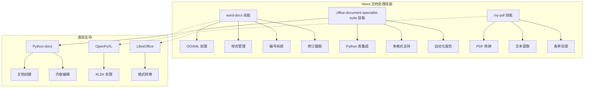
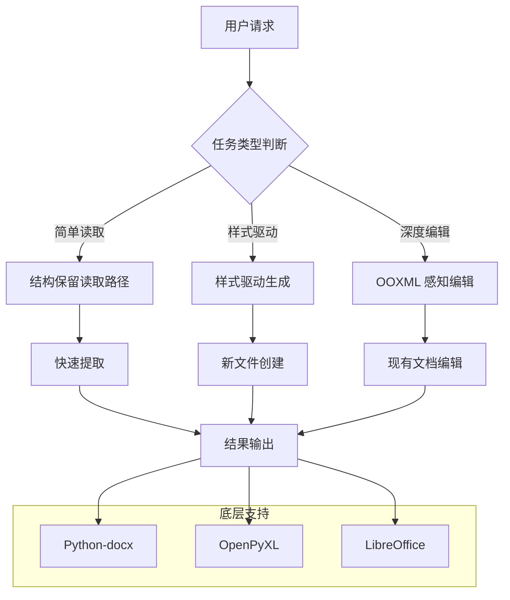
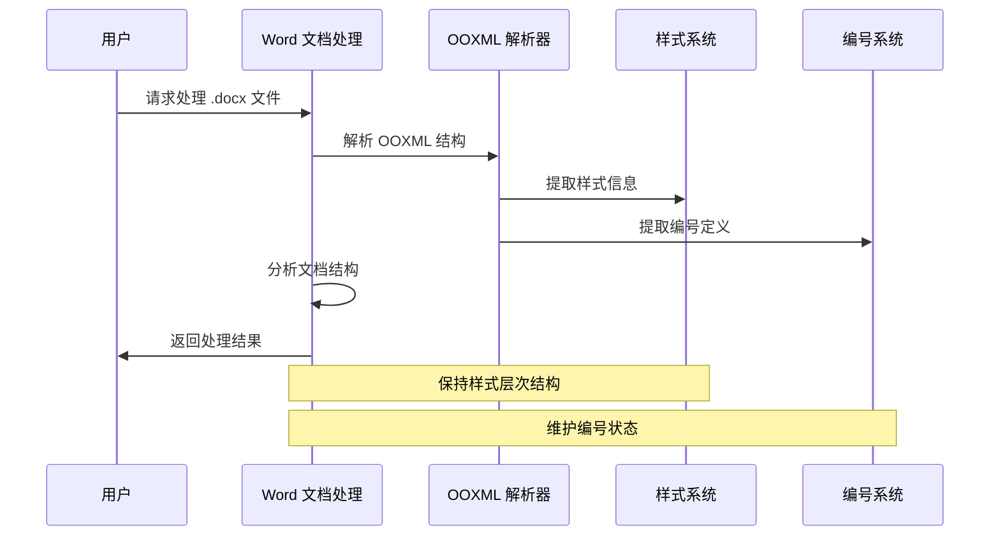
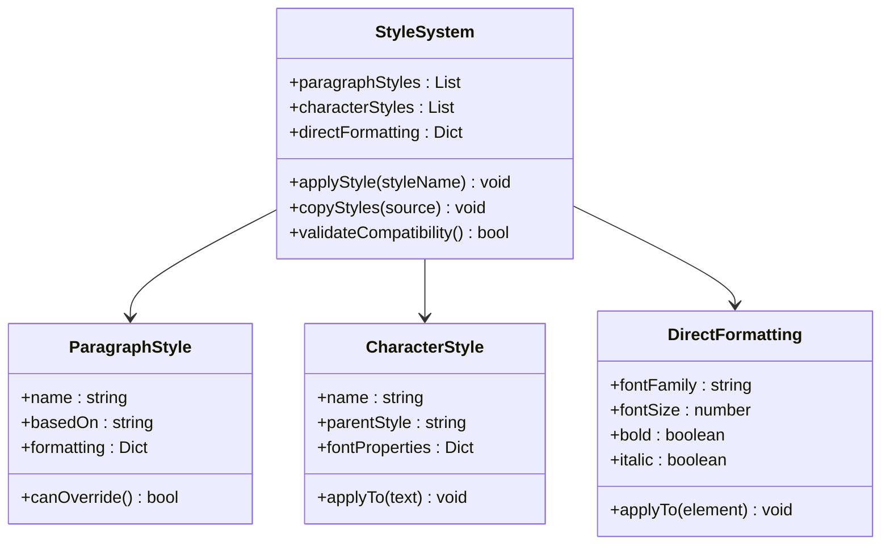
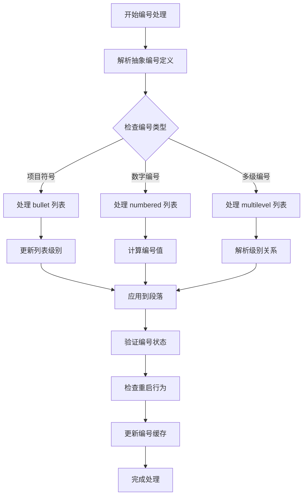
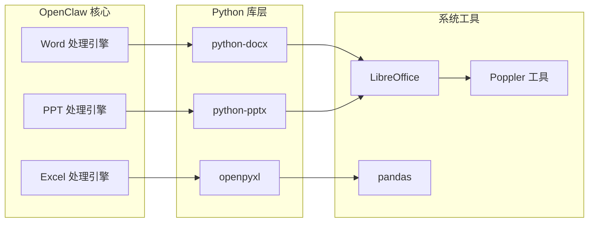
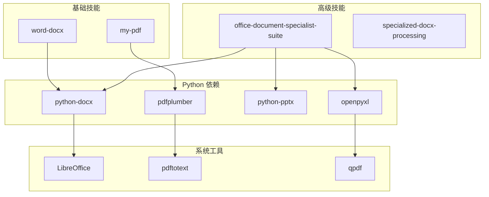
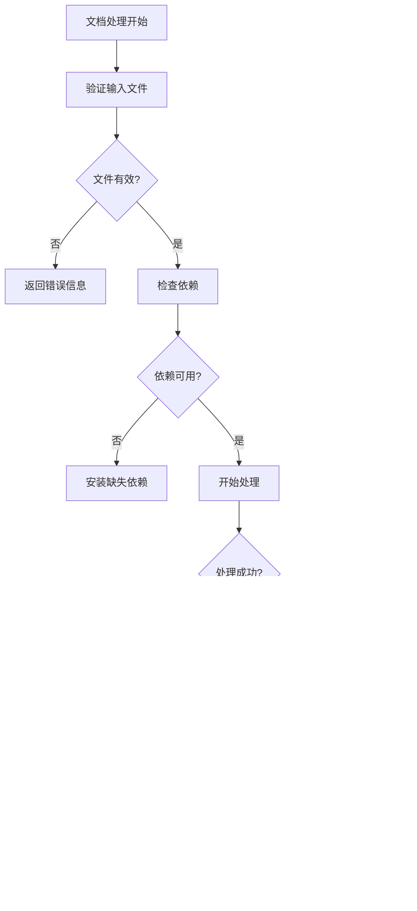
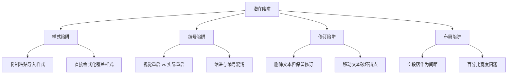

# Word 文档处理技能

<cite>
**本文档引用的文件**
- [word-docx/SKILL.md](file://skills/word-docx/SKILL.md)
- [office-document-specialist-suite/SKILL.md](file://skills/office-document-specialist-suite/SKILL.md)
- [my-pdf/SKILL.md](file://skills/my-pdf/SKILL.md)
- [init_skill.py](file://skills/skill-creator/scripts/init_skill.py)
</cite>

## 目录
1. [简介](#简介)
2. [项目结构](#项目结构)
3. [核心组件](#核心组件)
4. [架构概览](#架构概览)
5. [详细组件分析](#详细组件分析)
6. [依赖关系分析](#依赖关系分析)
7. [性能考虑](#性能考虑)
8. [故障排除指南](#故障排除指南)
9. [结论](#结论)

## 简介

OpenClaw 项目提供了专业的 Word 文档处理能力，通过多个专门的技能模块实现对 Microsoft Word (.docx) 文件的创建、检查、编辑和高级处理。该项目专注于处理包含修订跟踪、注释、字段、表格、模板或页面布局约束的复杂文档，确保在往返编辑过程中保持格式不漂移。

该系统特别适用于需要精确控制文档结构和样式的场景，包括法律、学术和商业审查文档的处理。通过理解 OOXML 结构、样式系统和编号机制，用户可以执行复杂的文档操作而不破坏原有的格式设置。

## 项目结构

OpenClaw 的 Word 文档处理功能主要分布在以下技能模块中：

**图表来源**
- [word-docx/SKILL.md:1-97](file://skills/word-docx/SKILL.md#L1-L97)
- [office-document-specialist-suite/SKILL.md:1-192](file://skills/office-document-specialist-suite/SKILL.md#L1-L192)

**章节来源**
- [word-docx/SKILL.md:1-97](file://skills/word-docx/SKILL.md#L1-L97)
- [office-document-specialist-suite/SKILL.md:1-192](file://skills/office-document-specialist-suite/SKILL.md#L1-L192)

## 核心组件

### Word 文档处理技能 (word-docx)

word-docx 技能是专门针对 .docx 文件处理的核心模块，提供以下关键功能：

#### OOXML 结构处理
- 将 .docx 视为 ZIP 包含的 XML 部分
- 关键部分包括 `word/document.xml`、`styles.xml`、`numbering.xml`、页眉页脚和关系文件
- 理解文本可能分布在多个运行中的概念

#### 样式管理系统
- 偏好命名样式而非直接格式化
- 层次化样式：段落样式、字符样式和直接格式化
- 在现有文件编辑时扩展当前样式系统

#### 编号和列表处理
- 列表和编号属于 Word 的编号定义系统
- `abstractNum`、`num` 和段落编号属性都很重要
- 区分缩进和编号的关系

**章节来源**
- [word-docx/SKILL.md:20-55](file://skills/word-docx/SKILL.md#L20-L55)

### 办公文档专家套件 (office-document-specialist-suite)

这是一个综合性的办公文档处理工具集，支持 Word、Excel 和 PowerPoint 的专业文档操作：

#### Python 库集成
- 使用 `python-docx` 处理 Word (.docx) 文档
- 使用 `openpyxl` 处理 Excel (.xlsx) 电子表格
- 使用 `python-pptx` 处理 PowerPoint (.pptx) 演示文稿

#### 自动化报告功能
- 创建专业报告和文档
- 管理样式和插入表格/图片
- 数据分析和自动电子表格生成
- 基于结构化数据的幻灯片演示文稿创建

**章节来源**
- [office-document-specialist-suite/SKILL.md:27-33](file://skills/office-document-specialist-suite/SKILL.md#L27-L33)
- [office-document-specialist-suite/SKILL.md:35-141](file://skills/office-document-specialist-suite/SKILL.md#L35-L141)

### PDF 处理技能 (my-pdf)

虽然主要关注 Word 文档，但 my-pdf 技能提供了重要的跨格式转换能力：

#### 文本和表格提取
- 使用 pdfplumber 进行布局感知的文本提取
- 高级表格提取并转换为 Excel 格式
- 支持扫描版 PDF 的 OCR 处理

#### 格式转换和处理
- DOCX 到 PDF 的转换（通过 LibreOffice CLI）
- XLSX 到 CSV 的转换
- PDF 表单填充和密码保护

**章节来源**
- [my-pdf/SKILL.md:154-234](file://skills/my-pdf/SKILL.md#L154-L234)

## 架构概览

OpenClaw 的 Word 文档处理采用分层架构设计，确保不同复杂度的任务能够得到适当的处理：

**图表来源**
- [word-docx/SKILL.md:25-28](file://skills/word-docx/SKILL.md#L25-L28)
- [office-document-specialist-suite/SKILL.md:37-59](file://skills/office-document-specialist-suite/SKILL.md#L37-L59)

## 详细组件分析

### OOXML 处理流程

**图表来源**
- [word-docx/SKILL.md:20-28](file://skills/word-docx/SKILL.md#L20-L28)

### 样式管理系统

**图表来源**
- [word-docx/SKILL.md:31-38](file://skills/word-docx/SKILL.md#L31-L38)

### 编号和列表处理

**图表来源**
- [word-docx/SKILL.md:39-45](file://skills/word-docx/SKILL.md#L39-L45)

**章节来源**
- [word-docx/SKILL.md:39-45](file://skills/word-docx/SKILL.md#L39-L45)

### Python 库集成架构

**图表来源**
- [office-document-specialist-suite/SKILL.md:27-33](file://skills/office-document-specialist-suite/SKILL.md#L27-L33)

**章节来源**
- [office-document-specialist-suite/SKILL.md:27-33](file://skills/office-document-specialist-suite/SKILL.md#L27-L33)

## 依赖关系分析

OpenClaw 的 Word 文档处理技能之间存在清晰的依赖关系：

**图表来源**
- [office-document-specialist-suite/SKILL.md:27-33](file://skills/office-document-specialist-suite/SKILL.md#L27-L33)
- [my-pdf/SKILL.md:154-170](file://skills/my-pdf/SKILL.md#L154-L170)

**章节来源**
- [office-document-specialist-suite/SKILL.md:27-33](file://skills/office-document-specialist-suite/SKILL.md#L27-L33)
- [my-pdf/SKILL.md:154-170](file://skills/my-pdf/SKILL.md#L154-L170)

## 性能考虑

### 处理策略优化

1. **选择合适的处理路径**
   - 简单读取任务使用结构保留读取路径
   - 新文件创建使用样式驱动生成
   - 现有文档深度编辑使用 OOXML 感知编辑

2. **内存管理**
   - 大型文档处理时注意内存使用
   - 批量操作时分批处理避免内存峰值

3. **I/O 优化**
   - 合理使用临时文件
   - 批量写入减少磁盘 I/O

### 错误处理策略

## 故障排除指南

### 常见问题和解决方案

#### 样式兼容性问题
- **问题**: 复制内容时导入了外部样式
- **解决方案**: 明确指定样式继承关系，避免样式冲突

#### 编号状态异常
- **问题**: 列表重启或编号错误
- **解决方案**: 检查 `abstractNum` 和 `num` 定义，确保编号状态正确

#### 修订跟踪问题
- **问题**: 修订标记与实际内容不匹配
- **解决方案**: 使用最小替换原则，避免大范围重写

#### 页面布局问题
- **问题**: 表格宽度在不同软件中表现不一致
- **解决方案**: 显式设置表格宽度，避免百分比或自动调整

**章节来源**
- [word-docx/SKILL.md:81-97](file://skills/word-docx/SKILL.md#L81-L97)

### 技术陷阱识别

**图表来源**
- [word-docx/SKILL.md:81-97](file://skills/word-docx/SKILL.md#L81-L97)

## 结论

OpenClaw 的 Word 文档处理技能提供了全面的专业文档处理能力。通过深入理解 OOXML 结构、样式系统和编号机制，用户可以处理从简单文档到复杂审查文档的各种需求。

该系统的分层架构设计确保了不同复杂度的任务能够得到适当的处理，而 Python 库集成则提供了强大的底层支持。无论是创建新的专业文档、编辑现有的复杂文档，还是进行跨格式转换，OpenClaw 都提供了可靠的解决方案。

关键优势包括：
- 精确的 OOXML 处理能力
- 完整的样式和编号系统支持  
- 强大的修订跟踪处理
- 跨格式转换能力
- 专业的错误处理和故障排除

这些特性使得 OpenClaw 成为了处理 Microsoft Word 文档的理想选择，特别是在需要保持格式完整性和处理复杂文档结构的场景中。