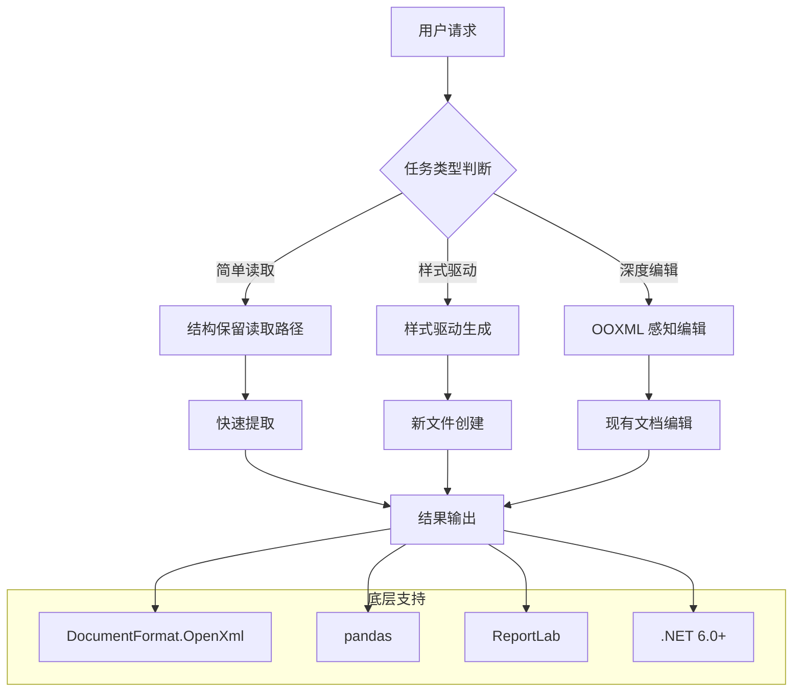
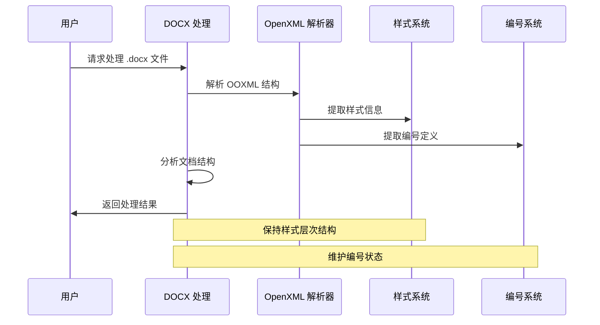
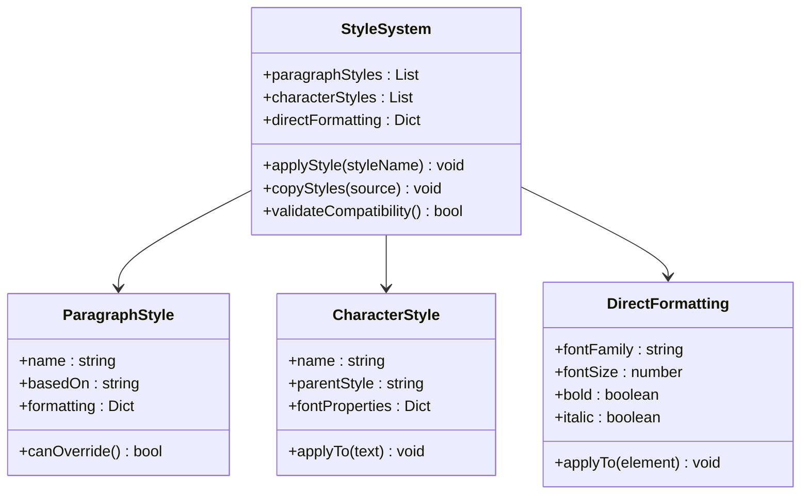
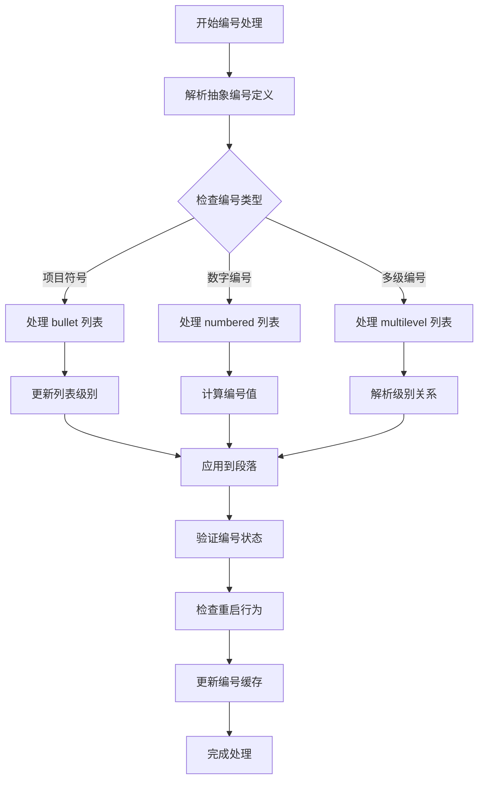
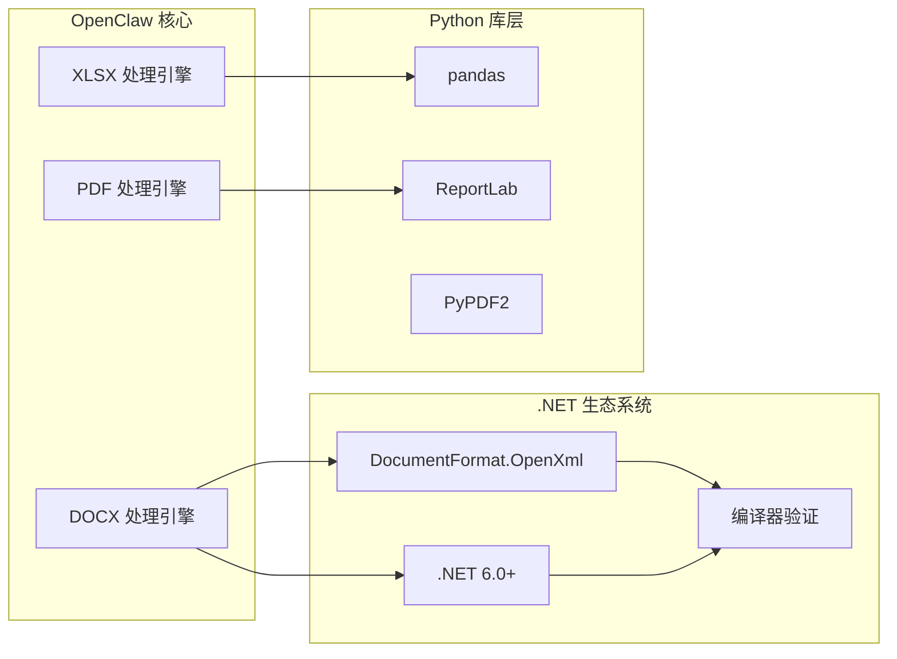
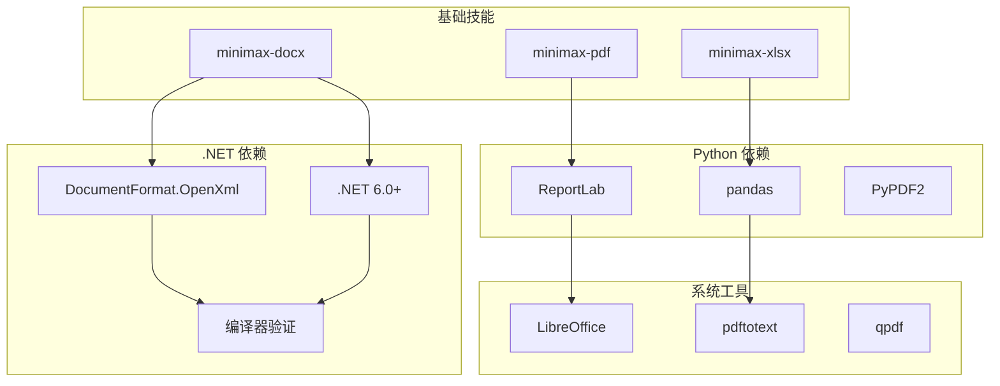
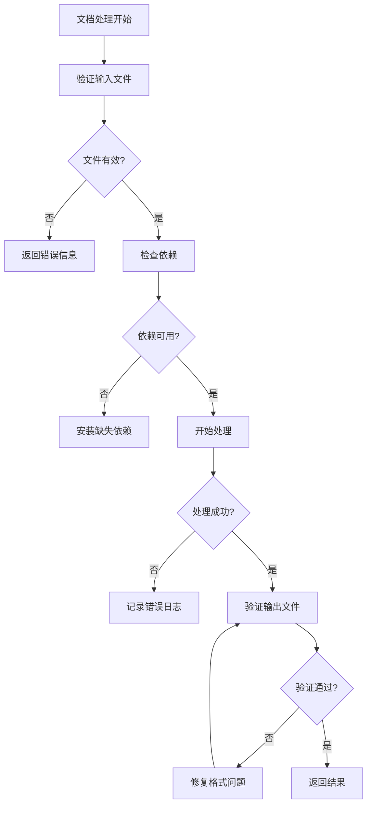
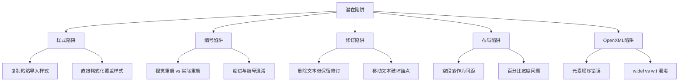

# Word 文档处理技能

<cite>
**本文档引用的文件**
- [minimax-docx/SKILL.md](file://skills/minimax-docx/SKILL.md)
- [minimax-pdf/SKILL.md](file://skills/minimax-pdf/SKILL.md)
- [minimax-xlsx/SKILL.md](file://skills/minimax-xlsx/SKILL.md)
- [SOUL.md](file://docs/reference/templates/agents/my-office-helper/SOUL.md)
- [word-docx/SKILL.md](file://apps/electron/release/mac-arm64/Bossim.app/Contents/Resources/openclaw/skills/word-docx/SKILL.md)
</cite>

## 更新摘要
**所做更改**
- 移除了关于已删除的word-docx技能的所有内容
- 更新了架构概览以反映当前可用的技能组合
- 添加了对minimax-docx技能的详细分析
- 更新了依赖关系图以显示实际存在的技能
- 修改了故障排除指南以反映当前的技术栈

## 目录
1. [简介](#简介)
2. [项目结构](#项目结构)
3. [核心组件](#核心组件)
4. [架构概览](#架构概览)
5. [详细组件分析](#详细组件分析)
6. [依赖关系分析](#依赖关系分析)
7. [性能考虑](#性能考虑)
8. [故障排除指南](#故障排除指南)
9. [结论](#结论)

## 简介

OpenClaw 项目提供了专业的 Word 文档处理能力，通过现代化的技能模块实现对 Microsoft Word (.docx) 文件的创建、检查、编辑和高级处理。该项目专注于处理包含修订跟踪、注释、字段、表格、模板或页面布局约束的复杂文档，确保在往返编辑过程中保持格式不漂移。

**重要更新**：原有的 word-docx 技能已被移除，现已被功能更强大、基于 .NET OpenXML SDK 的 minimax-docx 技能所取代。minimax-docx 技能提供了三个处理管道：(A) 从头创建新文档，(B) 在现有文档中填充实例，(C) 使用 XSD 验证门控检查应用模板格式。

该系统特别适用于需要精确控制文档结构和样式的场景，包括法律、学术和商业审查文档的处理。通过理解 OOXML 结构、样式系统和编号机制，用户可以执行复杂的文档操作而不破坏原有的格式设置。

## 项目结构

OpenClaw 的 Word 文档处理功能主要分布在以下技能模块中：

```mermaid
graph TB
subgraph "Word 文档处理技能"
A[minimax-docx 技能] --> A1[OpenXML SDK (.NET)]
A --> A2[样式管理]
A --> A3[编号系统]
A --> A4[修订跟踪]
B[minimax-pdf 技能] --> B1[PDF 转换]
B --> B2[文本提取]
B --> B3[表单处理]
C[minimax-xlsx 技能] --> C1[XLSX 处理]
C --> C2[公式验证]
C --> C3[财务格式]
end
subgraph "底层支持"
D[DocumentFormat.OpenXml] --> D1[文档创建]
D --> D2[内容编辑]
E[pandas] --> E1[数据分析]
F[ReportLab] --> F1[PDF 渲染]
end
A -.-> D
B -.-> F
C -.-> E
```

**图表来源**
- [minimax-docx/SKILL.md:1-47](file://skills/minimax-docx/SKILL.md#L1-L47)
- [minimax-pdf/SKILL.md:1-31](file://skills/minimax-pdf/SKILL.md#L1-L31)
- [minimax-xlsx/SKILL.md:1-24](file://skills/minimax-xlsx/SKILL.md#L1-L24)

**章节来源**
- [minimax-docx/SKILL.md:1-47](file://skills/minimax-docx/SKILL.md#L1-L47)
- [minimax-pdf/SKILL.md:1-31](file://skills/minimax-pdf/SKILL.md#L1-L31)
- [minimax-xlsx/SKILL.md:1-24](file://skills/minimax-xlsx/SKILL.md#L1-L24)

## 核心组件

### MiniMax DOCX 处理技能 (minimax-docx)

minimax-docx 是基于 .NET OpenXML SDK 的专业 Word 文档处理技能，提供以下关键功能：

#### OpenXML SDK (.NET) 集成
- 使用 DocumentFormat.OpenXml 库进行精确的 OOXML 操作
- 支持 .NET 6.0+ 环境下的高性能文档处理
- 提供编译器验证的 C# 代码示例和最佳实践

#### 样式管理系统
- 偏好命名样式而非直接格式化
- 层次化样式：段落样式、字符样式和直接格式化
- 在现有文件编辑时扩展当前样式系统

#### 编号和列表处理
- 列表和编号属于 Word 的编号定义系统
- `abstractNum`、`num` 和段落编号属性都很重要
- 区分缩进和编号的关系

**章节来源**
- [minimax-docx/SKILL.md:23-47](file://skills/minimax-docx/SKILL.md#L23-L47)

### MiniMax PDF 处理技能 (minimax-pdf)

这是一个专业的 PDF 文档处理工具，专注于视觉质量和设计一致性：

#### 设计系统驱动的 PDF 生成
- 使用基于令牌的设计系统：颜色、字体排版和间距
- 支持多种文档类型：报告、提案、简历、学术论文等
- 输出打印就绪的 PDF 文件

#### 表单填写和重新格式化
- 填充现有 PDF 表单字段
- 重新格式化现有文档以应用新的设计风格
- 支持从 Markdown、文本到 PDF 的转换

**章节来源**
- [minimax-pdf/SKILL.md:1-15](file://skills/minimax-pdf/SKILL.md#L1-L15)
- [minimax-pdf/SKILL.md:31-82](file://skills/minimax-pdf/SKILL.md#L31-L82)

### MiniMax XLSX 处理技能 (minimax-xlsx)

这是一个专业的 Excel 电子表格处理技能：

#### XML 直接编辑
- 使用 XML 模板从头创建 XLSX 文件
- 支持零格式损失的现有文件编辑
- 提供公式重新计算和验证功能

#### 财务格式标准
- 支持专业财务建模和分析
- 提供标准化的颜色编码系统
- 支持透视表、图表和复杂公式

**章节来源**
- [minimax-xlsx/SKILL.md:1-24](file://skills/minimax-xlsx/SKILL.md#L1-L24)
- [minimax-xlsx/SKILL.md:128-135](file://skills/minimax-xlsx/SKILL.md#L128-L135)

## 架构概览

OpenClaw 的 Word 文档处理采用现代化的分层架构设计，确保不同复杂度的任务能够得到适当的处理：



**图表来源**
- [minimax-docx/SKILL.md:90-114](file://skills/minimax-docx/SKILL.md#L90-L114)
- [minimax-pdf/SKILL.md:39-47](file://skills/minimax-pdf/SKILL.md#L39-L47)
- [minimax-xlsx/SKILL.md:34-43](file://skills/minimax-xlsx/SKILL.md#L34-L43)

## 详细组件分析

### OpenXML 处理流程



**图表来源**
- [minimax-docx/SKILL.md:20-28](file://skills/minimax-docx/SKILL.md#L20-L28)

### 样式管理系统



**图表来源**
- [minimax-docx/SKILL.md:31-38](file://skills/minimax-docx/SKILL.md#L31-L38)

### 编号和列表处理



**图表来源**
- [minimax-docx/SKILL.md:39-45](file://skills/minimax-docx/SKILL.md#L39-L45)

### 现代化技能架构



**图表来源**
- [minimax-docx/SKILL.md:10-17](file://skills/minimax-docx/SKILL.md#L10-L17)
- [minimax-pdf/SKILL.md:196-203](file://skills/minimax-pdf/SKILL.md#L196-L203)

**章节来源**
- [minimax-docx/SKILL.md:10-17](file://skills/minimax-docx/SKILL.md#L10-L17)
- [minimax-pdf/SKILL.md:196-203](file://skills/minimax-pdf/SKILL.md#L196-L203)

## 依赖关系分析

OpenClaw 的现代 Word 文档处理技能之间存在清晰的依赖关系：



**图表来源**
- [minimax-docx/SKILL.md:10-17](file://skills/minimax-docx/SKILL.md#L10-L17)
- [minimax-pdf/SKILL.md:196-203](file://skills/minimax-pdf/SKILL.md#L196-L203)
- [minimax-xlsx/SKILL.md:10-16](file://skills/minimax-xlsx/SKILL.md#L10-L16)

**章节来源**
- [minimax-docx/SKILL.md:10-17](file://skills/minimax-docx/SKILL.md#L10-L17)
- [minimax-pdf/SKILL.md:196-203](file://skills/minimax-pdf/SKILL.md#L196-L203)
- [minimax-xlsx/SKILL.md:10-16](file://skills/minimax-xlsx/SKILL.md#L10-L16)

## 性能考虑

### 处理策略优化

1. **选择合适的处理路径**
   - 简单读取任务使用结构保留读取路径
   - 新文件创建使用样式驱动生成
   - 现有文档深度编辑使用 OOXML 感知编辑

2. **内存管理**
   - 大型文档处理时注意内存使用
   - 批量操作时分批处理避免内存峰值

3. **I/O 优化**
   - 合理使用临时文件
   - 批量写入减少磁盘 I/O

### 错误处理策略



## 故障排除指南

### 常见问题和解决方案

#### 样式兼容性问题
- **问题**: 复制内容时导入了外部样式
- **解决方案**: 明确指定样式继承关系，避免样式冲突

#### 编号状态异常
- **问题**: 列表重启或编号错误
- **解决方案**: 检查 `abstractNum` 和 `num` 定义，确保编号状态正确

#### 修订跟踪问题
- **问题**: 修订标记与实际内容不匹配
- **解决方案**: 使用最小替换原则，避免大范围重写

#### 页面布局问题
- **问题**: 表格宽度在不同软件中表现不一致
- **解决方案**: 显式设置表格宽度，避免百分比或自动调整

#### OpenXML 元素顺序问题
- **问题**: 元素顺序错误导致文件损坏
- **解决方案**: 严格遵循元素顺序规则：`pPr` → `runs`，`rPr` → `t`/`br`/`tab`

**章节来源**
- [minimax-docx/SKILL.md:210-247](file://skills/minimax-docx/SKILL.md#L210-L247)

### 技术陷阱识别



**图表来源**
- [minimax-docx/SKILL.md:210-247](file://skills/minimax-docx/SKILL.md#L210-L247)

## 结论

OpenClaw 的现代 Word 文档处理技能提供了全面的专业文档处理能力。通过基于 .NET OpenXML SDK 的 minimax-docx 技能，用户可以处理从简单文档到复杂审查文档的各种需求。

**重要更新**：原有的 word-docx 技能已被功能更强大、基于 .NET OpenXML SDK 的 minimax-docx 技能所取代。minimax-docx 技能提供了三个处理管道：(A) 从头创建新文档，(B) 在现有文档中填充实例，(C) 使用 XSD 验证门控检查应用模板格式。

该系统的现代化架构设计确保了不同复杂度的任务能够得到适当的处理，而 .NET 生态系统的集成则提供了强大的底层支持。无论是创建新的专业文档、编辑现有的复杂文档，还是进行跨格式转换，OpenClaw 都提供了可靠的解决方案。

关键优势包括：
- 基于 .NET 的高性能 OpenXML 处理
- 完整的样式和编号系统支持  
- 强大的修订跟踪处理
- 编译器验证的代码质量保证
- 专业的错误处理和故障排除

这些特性使得 OpenClaw 成为了处理 Microsoft Word 文档的理想选择，特别是在需要保持格式完整性和处理复杂文档结构的场景中。