# 小红书自动化技能

<cite>
**本文档引用的文件**
- [README.md](file://README.md)
- [SKILL.md](file://skills/xiaohongshu/SKILL.md)
- [cdp_publish.py](file://skills/xiaohongshu/scripts/cdp_publish.py)
- [publish_pipeline.py](file://skills/xiaohongshu/scripts/publish_pipeline.py)
- [chrome_launcher.py](file://skills/xiaohongshu/scripts/chrome_launcher.py)
- [feed_explorer.py](file://skills/xiaohongshu/scripts/feed_explorer.py)
- [image_downloader.py](file://skills/xiaohongshu/scripts/image_downloader.py)
- [account_manager.py](file://skills/xiaohongshu/scripts/account_manager.py)
- [requirements.txt](file://skills/xiaohongshu/requirements.txt)
- [accounts.json.example](file://skills/xiaohongshu/config/accounts.json.example)
</cite>

## 目录
1. [简介](#简介)
2. [项目结构](#项目结构)
3. [核心组件](#核心组件)
4. [架构概览](#架构概览)
5. [详细组件分析](#详细组件分析)
6. [依赖关系分析](#依赖关系分析)
7. [性能考虑](#性能考虑)
8. [故障排除指南](#故障排除指南)
9. [结论](#结论)

## 简介

小红书自动化技能是 OpenClaw 项目中的一个重要组成部分，专门用于自动化小红书（Xiaohongshu）平台的内容发布和管理。该技能通过 Chrome DevTools Protocol (CDP) 实现对小红书网站的自动化操作，支持多种发布模式和内容管理功能。

该项目基于 Python 开发，提供了完整的命令行界面和模块化设计，能够处理从简单的图片发布到复杂的内容管理系统。技能的核心功能包括：

- **内容发布**：支持图文和视频内容的自动发布
- **账户管理**：多账户支持和配置管理
- **内容检索**：搜索、浏览和分析小红书内容
- **交互操作**：评论、点赞、收藏等社交互动
- **数据统计**：内容表现数据的抓取和分析

## 项目结构

小红书自动化技能采用模块化的项目结构，主要分为以下几个部分：

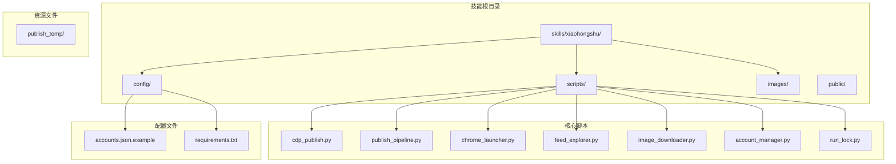

**图表来源**
- [SKILL.md:1-310](file://skills/xiaohongshu/SKILL.md#L1-L310)
- [requirements.txt:1-3](file://skills/xiaohongshu/requirements.txt#L1-L3)

**章节来源**
- [SKILL.md:1-310](file://skills/xiaohongshu/SKILL.md#L1-L310)
- [requirements.txt:1-3](file://skills/xiaohongshu/requirements.txt#L1-L3)

## 核心组件

小红书自动化技能由多个核心组件构成，每个组件都有特定的功能和职责：

### 主要组件概述

1. **XiaohongshuPublisher** - 主要的发布器类，负责与小红书网站进行交互
2. **PublishPipeline** - 发布流水线，协调整个发布过程
3. **ChromeLauncher** - Chrome 浏览器启动器，管理浏览器实例
4. **FeedExplorer** - 内容探索器，用于搜索和提取内容数据
5. **ImageDownloader** - 图像下载器，处理媒体文件下载
6. **AccountManager** - 账户管理器，管理多账户配置

### 组件关系图

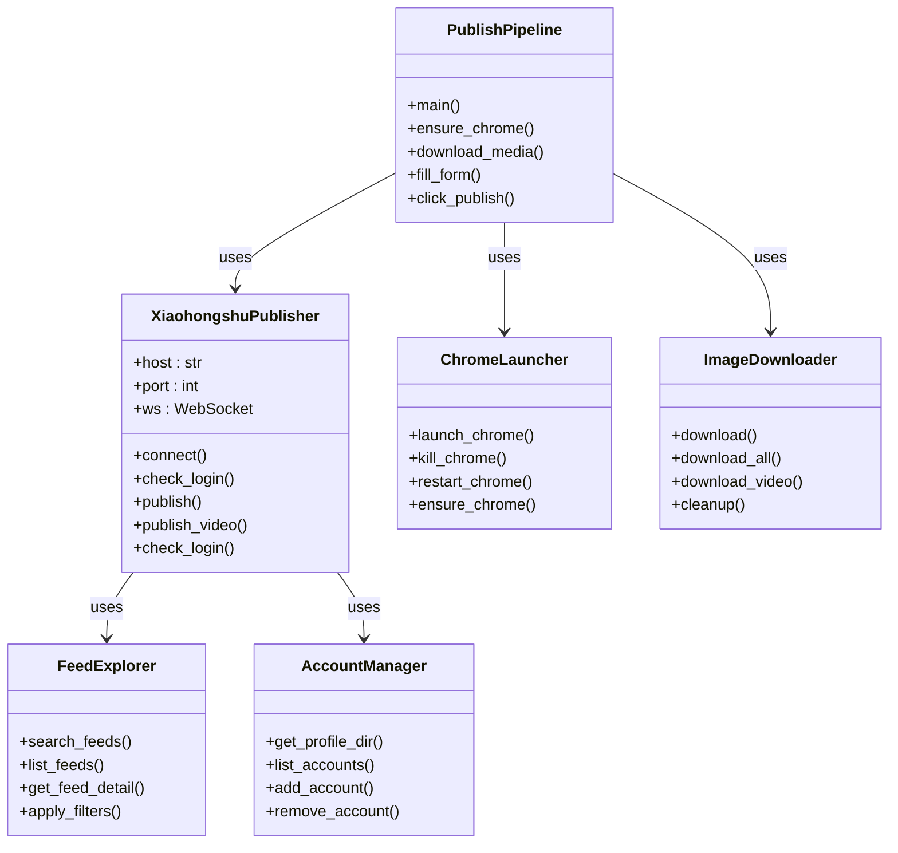

**图表来源**
- [cdp_publish.py:320-800](file://skills/xiaohongshu/scripts/cdp_publish.py#L320-L800)
- [publish_pipeline.py:307-630](file://skills/xiaohongshu/scripts/publish_pipeline.py#L307-L630)
- [chrome_launcher.py:111-334](file://skills/xiaohongshu/scripts/chrome_launcher.py#L111-L334)
- [feed_explorer.py:103-764](file://skills/xiaohongshu/scripts/feed_explorer.py#L103-L764)
- [image_downloader.py:21-201](file://skills/xiaohongshu/scripts/image_downloader.py#L21-L201)
- [account_manager.py:69-310](file://skills/xiaohongshu/scripts/account_manager.py#L69-L310)

**章节来源**
- [cdp_publish.py:320-800](file://skills/xiaohongshu/scripts/cdp_publish.py#L320-L800)
- [publish_pipeline.py:307-630](file://skills/xiaohongshu/scripts/publish_pipeline.py#L307-L630)
- [chrome_launcher.py:111-334](file://skills/xiaohongshu/scripts/chrome_launcher.py#L111-L334)

## 架构概览

小红书自动化技能采用分层架构设计，从底层的浏览器控制到上层的应用逻辑，形成了清晰的层次结构：

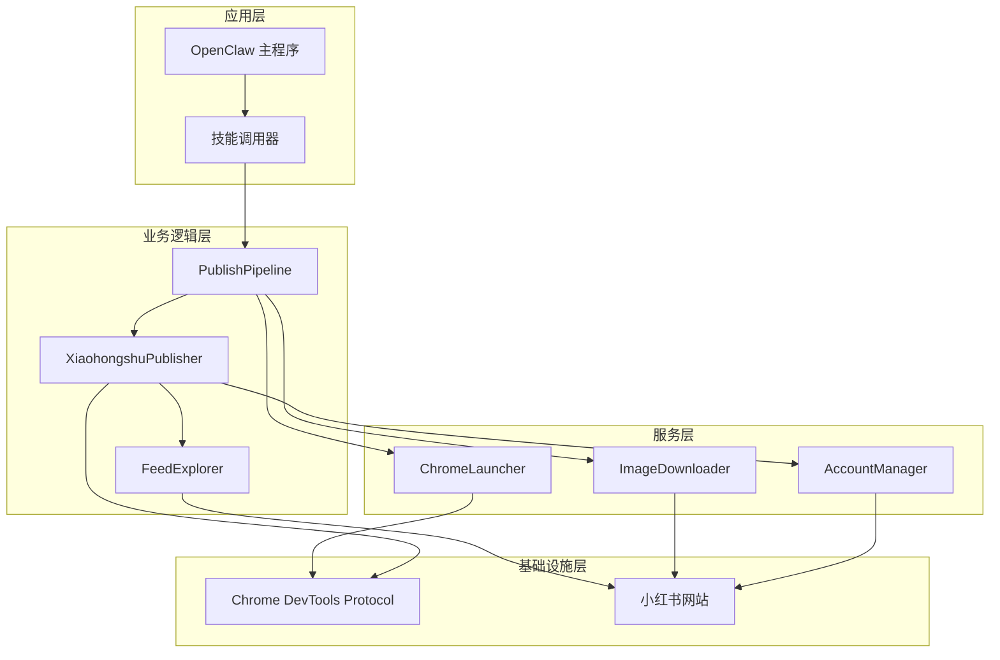

**图表来源**
- [publish_pipeline.py:307-630](file://skills/xiaohongshu/scripts/publish_pipeline.py#L307-L630)
- [cdp_publish.py:320-800](file://skills/xiaohongshu/scripts/cdp_publish.py#L320-L800)
- [chrome_launcher.py:111-334](file://skills/xiaohongshu/scripts/chrome_launcher.py#L111-L334)

### 数据流图

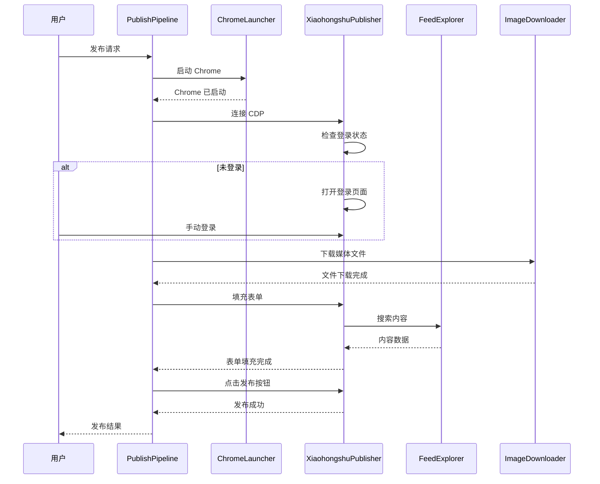

**图表来源**
- [publish_pipeline.py:502-620](file://skills/xiaohongshu/scripts/publish_pipeline.py#L502-L620)
- [cdp_publish.py:565-640](file://skills/xiaohongshu/scripts/cdp_publish.py#L565-L640)

**章节来源**
- [publish_pipeline.py:307-630](file://skills/xiaohongshu/scripts/publish_pipeline.py#L307-L630)
- [cdp_publish.py:320-800](file://skills/xiaohongshu/scripts/cdp_publish.py#L320-L800)

## 详细组件分析

### XiaohongshuPublisher 类分析

XiaohongshuPublisher 是整个技能的核心类，负责与小红书网站进行所有交互操作。

#### 核心功能特性

1. **CDP 连接管理** - 管理与 Chrome 浏览器的 WebSocket 连接
2. **登录状态检查** - 缓存和验证用户的登录状态
3. **内容发布** - 支持图文和视频内容的发布
4. **内容检索** - 搜索和提取小红书内容数据
5. **交互操作** - 执行点赞、收藏、评论等社交互动

#### 发布流程实现

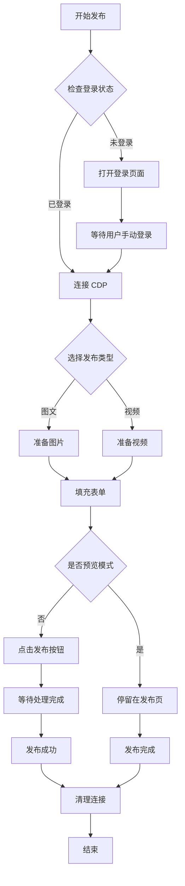

**图表来源**
- [cdp_publish.py:320-485](file://skills/xiaohongshu/scripts/cdp_publish.py#L320-L485)
- [publish_pipeline.py:536-620](file://skills/xiaohongshu/scripts/publish_pipeline.py#L536-L620)

**章节来源**
- [cdp_publish.py:320-800](file://skills/xiaohongshu/scripts/cdp_publish.py#L320-L800)
- [publish_pipeline.py:307-630](file://skills/xiaohongshu/scripts/publish_pipeline.py#L307-L630)

### PublishPipeline 分析

PublishPipeline 提供了统一的发布入口点，协调整个发布流程的各个步骤。

#### 流水线步骤

1. **Chrome 确保** - 确保 Chrome 浏览器正在运行
2. **登录检查** - 验证用户的登录状态
3. **媒体准备** - 下载和准备发布所需的媒体文件
4. **表单填充** - 自动填充发布表单
5. **发布执行** - 点击发布按钮并等待处理完成

#### 参数处理机制

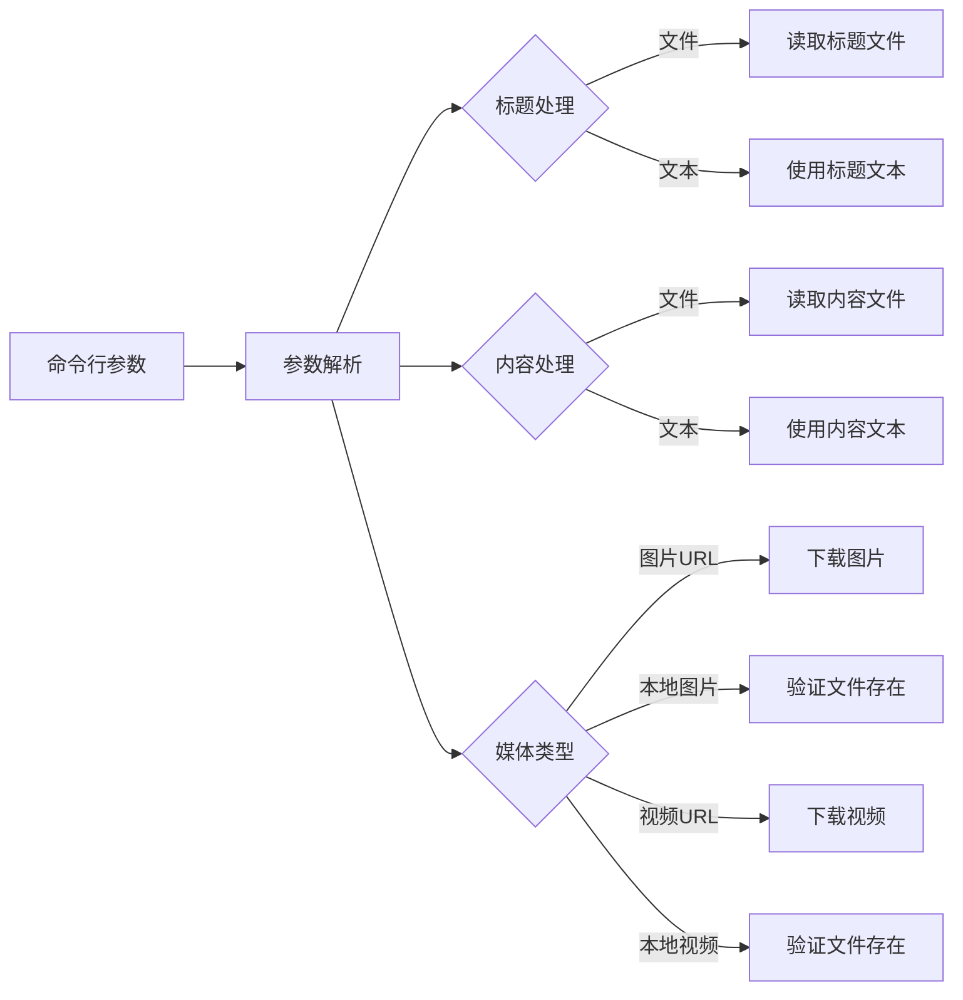

**图表来源**
- [publish_pipeline.py:307-480](file://skills/xiaohongshu/scripts/publish_pipeline.py#L307-L480)

**章节来源**
- [publish_pipeline.py:307-630](file://skills/xiaohongshu/scripts/publish_pipeline.py#L307-L630)

### ChromeLauncher 分析

ChromeLauncher 负责管理 Chrome 浏览器实例的生命周期。

#### 核心功能

1. **浏览器发现** - 自动查找系统中可用的 Chrome 安装
2. **实例启动** - 启动带有特定配置的 Chrome 实例
3. **进程管理** - 监控和控制 Chrome 进程
4. **多账户支持** - 为不同账户创建独立的用户数据目录

#### 启动策略

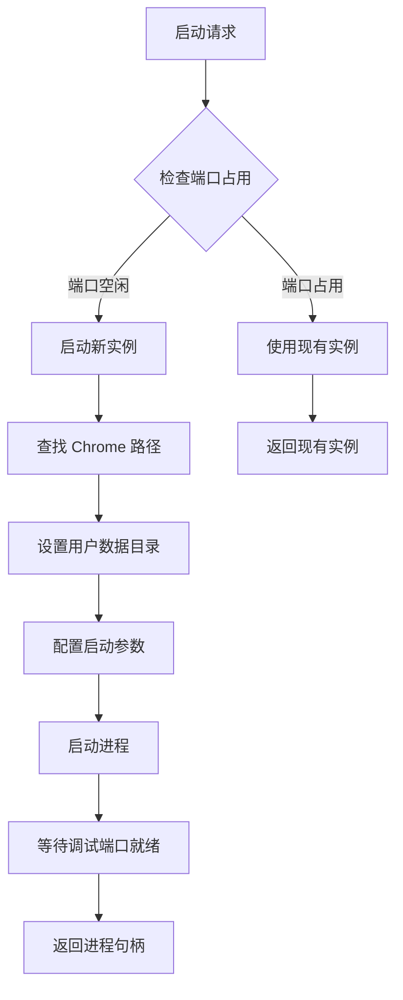

**图表来源**
- [chrome_launcher.py:111-176](file://skills/xiaohongshu/scripts/chrome_launcher.py#L111-L176)

**章节来源**
- [chrome_launcher.py:111-334](file://skills/xiaohongshu/scripts/chrome_launcher.py#L111-L334)

### FeedExplorer 分析

FeedExplorer 专注于小红书内容的搜索和详情提取。

#### 搜索功能

1. **关键词搜索** - 支持基于关键词的内容搜索
2. **过滤器应用** - 支持多种过滤条件（排序、类型、时间范围等）
3. **结果提取** - 从页面初始状态中提取内容数据

#### 详情获取

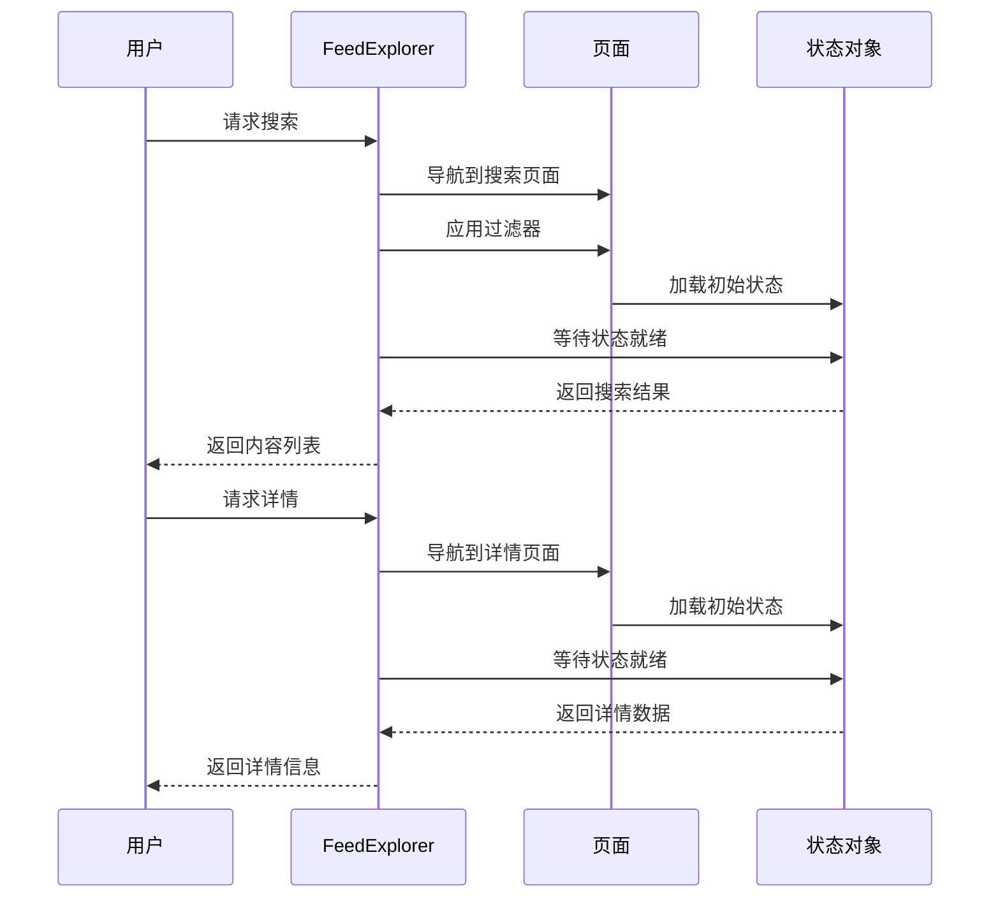

**图表来源**
- [feed_explorer.py:699-764](file://skills/xiaohongshu/scripts/feed_explorer.py#L699-L764)

**章节来源**
- [feed_explorer.py:103-764](file://skills/xiaohongshu/scripts/feed_explorer.py#L103-L764)

### ImageDownloader 分析

ImageDownloader 负责处理媒体文件的下载和管理。

#### 下载策略

1. **URL 解析** - 从 URL 中推断文件扩展名
2. **HTTP 请求** - 使用适当的请求头绕过热链接保护
3. **文件保存** - 将下载的文件保存到临时目录
4. **清理管理** - 自动清理下载的临时文件

#### 错误处理

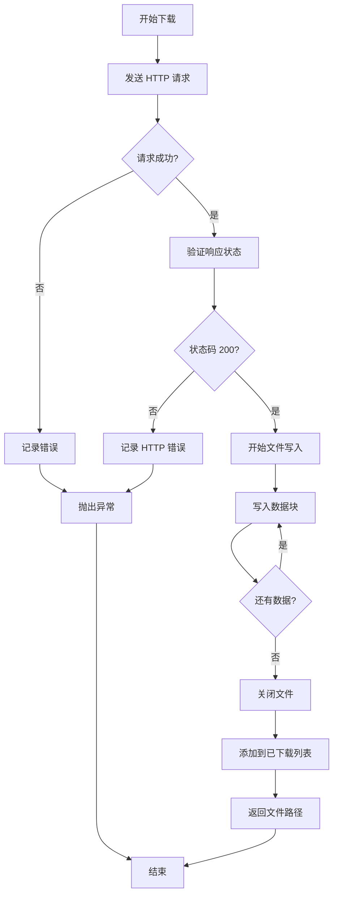

**图表来源**
- [image_downloader.py:80-150](file://skills/xiaohongshu/scripts/image_downloader.py#L80-L150)

**章节来源**
- [image_downloader.py:21-201](file://skills/xiaohongshu/scripts/image_downloader.py#L21-L201)

### AccountManager 分析

AccountManager 提供了完整的多账户管理功能。

#### 账户配置

1. **配置文件管理** - JSON 格式的账户配置存储
2. **配置文件结构** - 包含默认账户和账户列表
3. **配置文件示例** - 提供标准的配置文件模板

#### 账户操作

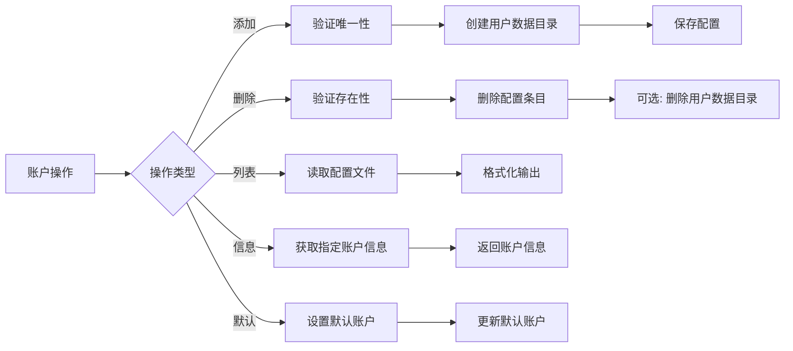

**图表来源**
- [account_manager.py:138-217](file://skills/xiaohongshu/scripts/account_manager.py#L138-L217)

**章节来源**
- [account_manager.py:69-310](file://skills/xiaohongshu/scripts/account_manager.py#L69-L310)

## 依赖关系分析

小红书自动化技能的依赖关系相对简单，主要依赖于标准库和少量第三方库。

### 依赖图

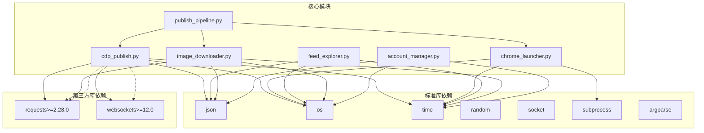

**图表来源**
- [requirements.txt:1-3](file://skills/xiaohongshu/requirements.txt#L1-L3)
- [cdp_publish.py:49-91](file://skills/xiaohongshu/scripts/cdp_publish.py#L49-L91)
- [publish_pipeline.py:47-72](file://skills/xiaohongshu/scripts/publish_pipeline.py#L47-L72)

### 外部依赖说明

1. **requests** - 用于 HTTP 请求和文件下载
2. **websockets** - 用于与 Chrome DevTools Protocol 通信

这些依赖关系确保了技能的稳定性和可靠性，同时保持了较低的外部依赖复杂度。

**章节来源**
- [requirements.txt:1-3](file://skills/xiaohongshu/requirements.txt#L1-L3)
- [cdp_publish.py:49-91](file://skills/xiaohongshu/scripts/cdp_publish.py#L49-L91)

## 性能考虑

小红书自动化技能在设计时充分考虑了性能优化，采用了多种策略来提高执行效率：

### 时间管理策略

1. **随机抖动** - 在关键操作之间添加随机延迟，模拟人类行为模式
2. **超时控制** - 为每个操作设置合理的超时时间
3. **重试机制** - 对网络请求和 CDP 操作实施智能重试

### 内存管理

1. **临时文件清理** - 自动清理下载的媒体文件
2. **连接池管理** - 有效管理 CDP 连接的生命周期
3. **资源释放** - 确保所有资源在使用后得到正确释放

### 并发处理

1. **异步操作** - 使用异步方式处理网络请求
2. **批量操作** - 支持批量下载和处理媒体文件
3. **进度跟踪** - 提供详细的执行进度信息

## 故障排除指南

### 常见问题及解决方案

#### Chrome 启动问题

**问题症状**：Chrome 无法启动或无法连接到 CDP

**可能原因**：
1. Chrome 路径未找到
2. 端口被其他进程占用
3. 用户数据目录权限问题

**解决步骤**：
1. 检查 Chrome 是否正确安装
2. 确认调试端口（默认 9222）未被占用
3. 验证用户数据目录的访问权限

#### 登录认证问题

**问题症状**：登录状态检查失败或频繁需要重新登录

**可能原因**：
1. 网络连接不稳定
2. Cookie 缓存过期
3. 账户被限制

**解决步骤**：
1. 检查网络连接质量
2. 清除登录缓存文件
3. 尝试重新登录

#### 发布失败问题

**问题症状**：内容发布过程中出现错误

**可能原因**：
1. 网络超时
2. 页面元素选择器失效
3. 媒体文件格式不支持

**解决步骤**：
1. 检查网络连接稳定性
2. 更新页面选择器定义
3. 验证媒体文件格式和大小

### 调试技巧

1. **启用详细日志** - 使用 `--verbose` 参数获取更多信息
2. **检查中间状态** - 在每个步骤后验证状态变化
3. **使用测试模式** - 先在预览模式下测试发布流程

**章节来源**
- [cdp_publish.py:316-318](file://skills/xiaohongshu/scripts/cdp_publish.py#L316-L318)
- [publish_pipeline.py:532-534](file://skills/xiaohongshu/scripts/publish_pipeline.py#L532-L534)

## 结论

小红书自动化技能是一个设计精良、功能完整的自动化解决方案。它通过模块化的设计和清晰的架构，实现了对小红书平台的全面自动化控制。

### 主要优势

1. **模块化设计** - 每个组件都有明确的职责和边界
2. **强大的功能集** - 支持从简单发布到复杂内容管理的所有功能
3. **良好的扩展性** - 易于添加新的功能和改进现有功能
4. **稳定的架构** - 基于成熟的 CDP 协议和 Python 生态系统

### 技术特点

1. **异步处理** - 使用现代异步编程技术提高性能
2. **错误处理** - 完善的错误处理和恢复机制
3. **配置灵活** - 支持多种配置选项和环境设置
4. **安全考虑** - 注重用户隐私和数据安全

### 未来发展方向

1. **功能增强** - 继续扩展内容管理和分析功能
2. **性能优化** - 进一步优化执行效率和资源使用
3. **用户体验** - 改进用户界面和交互体验
4. **集成扩展** - 支持更多第三方服务和平台

这个技能为 OpenClaw 项目提供了强大的内容发布能力，是构建智能自动化系统的重要组成部分。