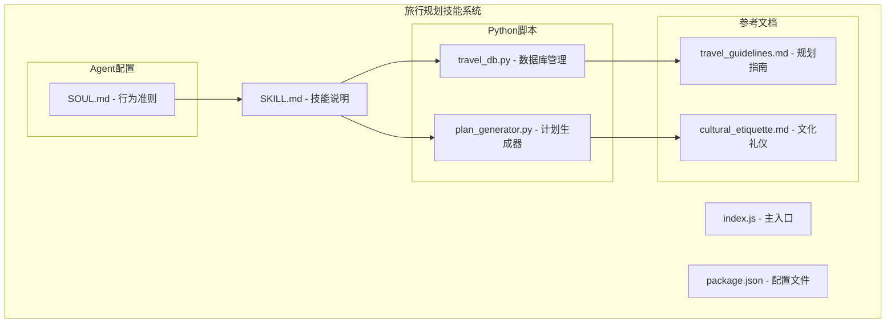
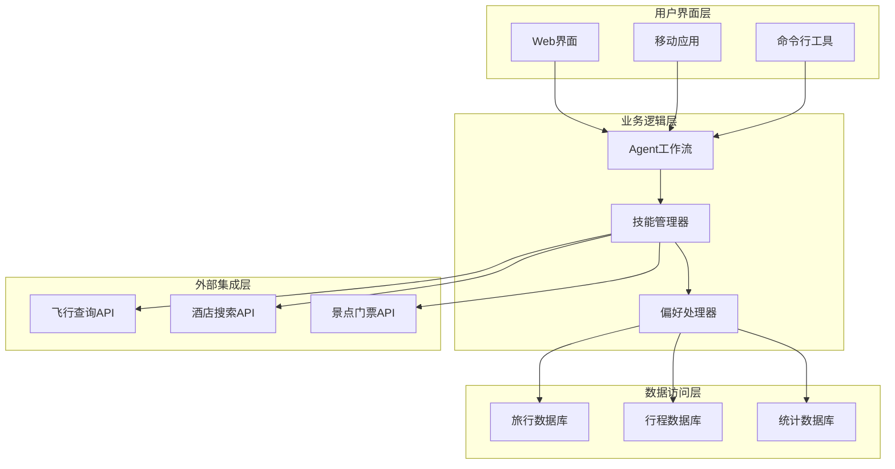
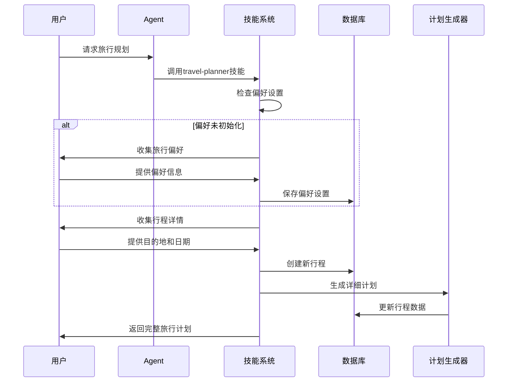
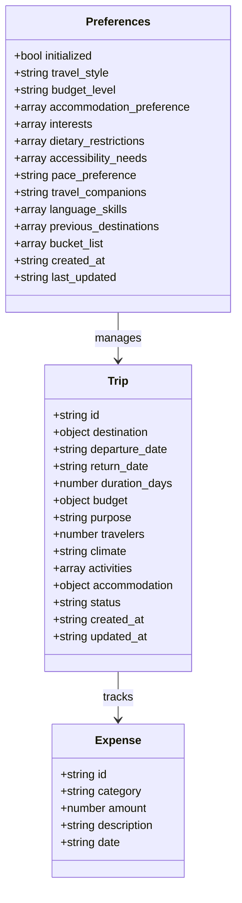
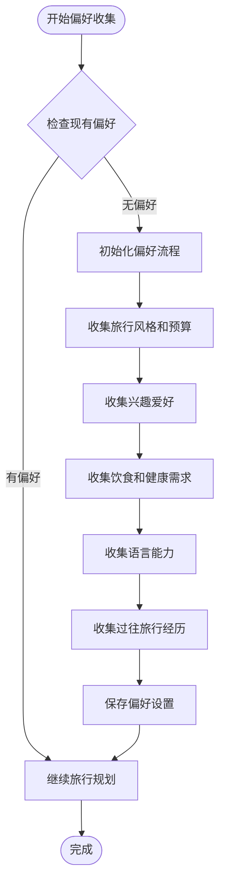
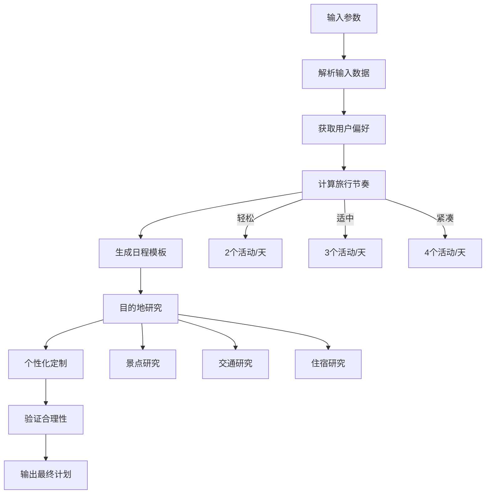
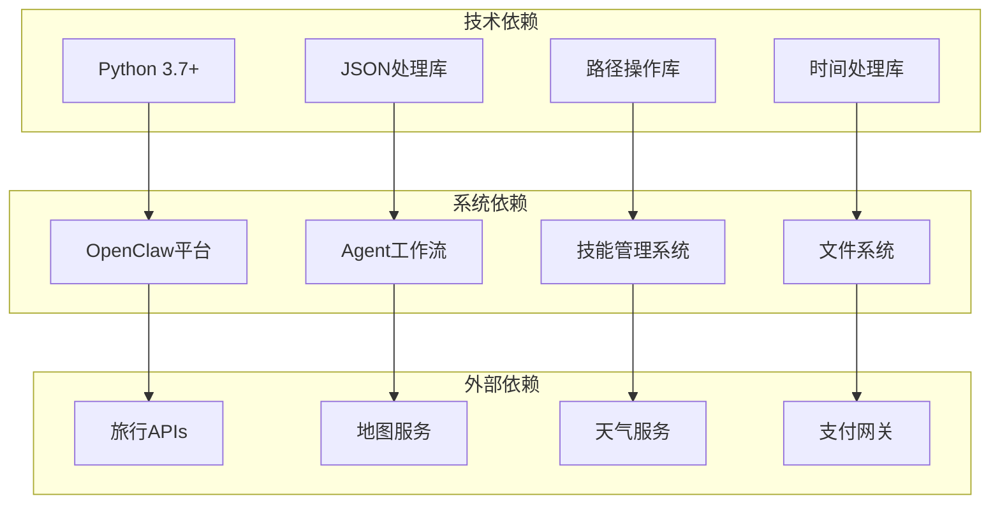

# 旅行规划技能系统

<cite>
**本文档引用的文件**
- [SKILL.md](file://skills/travel-planner/SKILL.md)
- [travel_db.py](file://skills/travel-planner/scripts/travel_db.py)
- [plan_generator.py](file://skills/travel-planner/scripts/plan_generator.py)
- [travel_guidelines.md](file://skills/travel-planner/references/travel_guidelines.md)
- [cultural_etiquette.md](file://skills/travel-planner/references/cultural_etiquette.md)
- [SOUL.md](file://docs/reference/templates/agents/travel-planner/SOUL.md)
- [index.js](file://skills/travel-planner/index.js)
- [package.json](file://skills/travel-planner/package.json)
- [workspace.ts](file://src/agents/skills/workspace.ts)
- [skills.store.ts](file://ui-react/src/store/skills.store.ts)
- [skills.ts](file://ui/src/ui/controllers/skills.ts)
</cite>

## 目录
1. [简介](#简介)
2. [项目结构](#项目结构)
3. [核心组件](#核心组件)
4. [架构概览](#架构概览)
5. [详细组件分析](#详细组件分析)
6. [依赖关系分析](#依赖关系分析)
7. [性能考虑](#性能考虑)
8. [故障排除指南](#故障排除指南)
9. [结论](#结论)

## 简介

旅行规划技能系统是一个基于OpenClaw平台构建的综合性旅行助手，旨在为用户提供个性化的旅行规划服务。该系统通过智能偏好管理、详细的行程生成、预算跟踪和文化指导等功能，帮助用户创建完美的旅行体验。

系统的核心特色包括：
- 智能旅行偏好管理，支持个性化推荐
- 全面的行程规划，包含每日详细安排
- 实时预算跟踪和费用管理
- 文化礼仪和安全指导
- 多语言支持和本地化建议

## 项目结构

旅行规划技能系统采用模块化设计，主要由以下核心部分组成：



**图表来源**
- [SKILL.md:1-578](file://skills/travel-planner/SKILL.md#L1-L578)
- [travel_db.py:1-432](file://skills/travel-planner/scripts/travel_db.py#L1-L432)
- [plan_generator.py:1-391](file://skills/travel-planner/scripts/plan_generator.py#L1-L391)

**章节来源**
- [SKILL.md:1-50](file://skills/travel-planner/SKILL.md#L1-L50)
- [package.json:1-11](file://skills/travel-planner/package.json#L1-L11)

## 核心组件

### 数据库管理系统

旅行规划技能系统的核心是其数据库管理系统，负责存储用户的旅行偏好、行程信息和预算数据。

#### 偏好管理功能
- 用户旅行风格识别（预算型、中档、豪华）
- 兴趣爱好分类（观光、美食、冒险、文化等）
- 健康和饮食限制管理
- 语言能力和旅行经验评估

#### 行程管理功能
- 当前行程跟踪
- 过往行程存档
- 行程想法和灵感收集
- 实时预算更新和统计

**章节来源**
- [travel_db.py:72-123](file://skills/travel-planner/scripts/travel_db.py#L72-L123)
- [travel_db.py:146-224](file://skills/travel-planner/scripts/travel_db.py#L146-L224)

### 计划生成器

计划生成器是系统的核心算法引擎，负责根据用户偏好和目的地信息生成详细的旅行计划。

#### 核心功能模块
- **每日行程模板**：根据旅行节奏（轻松、适中、紧凑）生成活动安排
- **预算分解算法**：基于住宿水平自动分配各项支出比例
- **打包清单生成**：根据气候和活动类型定制个人物品清单
- **行前准备时间线**：提供分阶段的准备工作清单

**章节来源**
- [plan_generator.py:18-74](file://skills/travel-planner/scripts/plan_generator.py#L18-L74)
- [plan_generator.py:77-124](file://skills/travel-planner/scripts/plan_generator.py#L77-L124)
- [plan_generator.py:127-214](file://skills/travel-planner/scripts/plan_generator.py#L127-L214)

### 参考知识库

系统包含两个重要的参考文档，为旅行规划提供全面的知识支持。

#### 旅行规划指南
- 目的地研究检查清单
- 预算规划框架
- 行程规划原则
- 打包策略
- 安全注意事项

#### 文化礼仪手册
- 各国社交礼仪规范
- 着装要求和禁忌
- 餐饮礼仪标准
- 宗教场所行为准则
- 法律和安全注意事项

**章节来源**
- [travel_guidelines.md:1-315](file://skills/travel-planner/references/travel_guidelines.md#L1-L315)
- [cultural_etiquette.md:1-322](file://skills/travel-planner/references/cultural_etiquette.md#L1-L322)

## 架构概览

旅行规划技能系统采用分层架构设计，确保各组件之间的清晰分离和高效协作。



**图表来源**
- [workspace.ts:292-527](file://src/agents/skills/workspace.ts#L292-L527)
- [SOUL.md:22-28](file://docs/reference/templates/agents/travel-planner/SOUL.md#L22-L28)

系统的工作流程遵循严格的技能调用模式：



**图表来源**
- [SKILL.md:30-185](file://skills/travel-planner/SKILL.md#L30-L185)
- [travel_db.py:146-171](file://skills/travel-planner/scripts/travel_db.py#L146-L171)

## 详细组件分析

### 偏好管理系统

偏好管理系统是整个旅行规划系统的基础，它通过深度学习用户的旅行习惯来提供个性化的建议。

#### 数据结构设计



**图表来源**
- [travel_db.py:24-48](file://skills/travel-planner/scripts/travel_db.py#L24-L48)
- [travel_db.py:146-171](file://skills/travel-planner/scripts/travel_db.py#L146-L171)
- [travel_db.py:230-253](file://skills/travel-planner/scripts/travel_db.py#L230-L253)

#### 偏好收集流程

系统采用渐进式偏好收集策略，确保在不增加用户负担的情况下获取必要的信息：



**图表来源**
- [SKILL.md:42-110](file://skills/travel-planner/SKILL.md#L42-L110)
- [travel_db.py:83-98](file://skills/travel-planner/scripts/travel_db.py#L83-L98)

**章节来源**
- [travel_db.py:72-123](file://skills/travel-planner/scripts/travel_db.py#L72-L123)
- [SKILL.md:42-110](file://skills/travel-planner/SKILL.md#L42-L110)

### 行程生成算法

行程生成算法是系统的核心智能组件，它能够根据用户偏好和目的地特点生成个性化的旅行计划。

#### 日程规划算法



**图表来源**
- [plan_generator.py:18-74](file://skills/travel-planner/scripts/plan_generator.py#L18-L74)
- [plan_generator.py:317-360](file://skills/travel-planner/scripts/plan_generator.py#L317-L360)

#### 预算分配策略

系统采用动态预算分配算法，根据不同住宿水平调整各项支出的比例：

| 预算级别 | 住宿 | 餐食 | 活动 | 交通 | 杂项 |
|---------|------|------|------|------|------|
| 预算型 | 30-45% | 25-30% | 15-25% | 10-20% | 5-10% |
| 中档 | 35-40% | 25% | 25% | 10% | 5% |
| 豪华 | 45% | 20% | 20% | 10% | 5% |

**章节来源**
- [plan_generator.py:77-124](file://skills/travel-planner/scripts/plan_generator.py#L77-L124)
- [travel_guidelines.md:45-90](file://skills/travel-planner/references/travel_guidelines.md#L45-L90)

### Agent行为准则

Travel Planner Agent的行为准则确保了系统在与用户交互时保持一致性和专业性。

#### 核心哲学理念

```mermaid
mindmap
root((旅行规划Agent))
人性化设计
记住旅行者的感受
平衡结构与即兴
尊重不同预算
文化敏感性
介绍文化而非只是拍照
尊重当地习俗
提供准确信息
适应性沟通
根据用户类型调整细节
理解用户需求
提供适当帮助
边界管理
不做假设
保持专业范围
优先安全
```

**图表来源**
- [SOUL.md:12-21](file://docs/reference/templates/agents/travel-planner/SOUL.md#L12-L21)

#### 交互模式

Agent采用"技能优先"的交互模式，确保在旅行规划场景中始终遵循最佳实践：

1. **首次调用规则**：任何旅行规划请求都必须先读取travel-planner技能
2. **个性化调整**：根据用户类型和需求调整详细程度
3. **实时支持**：在旅行过程中提供灵活的调整和替代方案
4. **持续改进**：记住用户偏好，从反馈中学习

**章节来源**
- [SOUL.md:22-46](file://docs/reference/templates/agents/travel-planner/SOUL.md#L22-L46)

## 依赖关系分析

旅行规划技能系统涉及多个层面的依赖关系，从技术架构到业务逻辑都有明确的层次划分。



**图表来源**
- [SKILL.md:7-10](file://skills/travel-planner/SKILL.md#L7-L10)
- [workspace.ts:292-527](file://src/agents/skills/workspace.ts#L292-L527)

### 技术栈分析

系统采用混合技术栈，结合了Python的强大数据处理能力和JavaScript的前端交互优势。

#### Python后端组件
- **数据持久化**：使用JSON文件存储用户数据
- **算法实现**：复杂的行程规划和预算计算
- **文件操作**：技能文件管理和配置处理

#### JavaScript前端组件
- **用户界面**：响应式的Web界面
- **状态管理**：Zustand状态管理库
- **API通信**：与后端服务的异步通信

**章节来源**
- [index.js:1-9](file://skills/travel-planner/index.js#L1-L9)
- [skills.store.ts:1-311](file://ui-react/src/store/skills.store.ts#L1-L311)

## 性能考虑

旅行规划技能系统在设计时充分考虑了性能优化，确保在处理大量数据和复杂计算时仍能保持良好的响应速度。

### 数据存储优化

系统采用轻量级的JSON文件存储方案，具有以下优势：
- **快速读写**：JSON格式简单，解析速度快
- **跨平台兼容**：无需额外的数据库服务器
- **易于备份**：纯文本文件便于版本控制和备份
- **内存效率**：按需加载，避免不必要的内存占用

### 算法性能优化

#### 预算计算优化
- 使用缓存机制避免重复计算
- 采用增量更新策略减少数据库写入
- 实现批量操作提高效率

#### 行程生成优化
- 预定义模板减少实时计算
- 智能索引提高查询速度
- 分页加载避免内存溢出

### 缓存策略

系统实现了多层次的缓存机制：
1. **内存缓存**：最近使用的数据驻留在内存中
2. **文件缓存**：频繁访问的数据存储在本地文件
3. **网络缓存**：外部API响应结果进行缓存

## 故障排除指南

### 常见问题及解决方案

#### 数据库连接问题
**症状**：无法保存或读取用户偏好
**解决方案**：
1. 检查用户主目录权限
2. 验证JSON文件格式正确性
3. 确认磁盘空间充足

#### 技能加载失败
**症状**：旅行规划技能无法正常工作
**解决方案**：
1. 检查Python环境配置
2. 验证依赖库安装情况
3. 确认文件路径正确性

#### 性能问题
**症状**：系统响应缓慢或内存占用过高
**解决方案**：
1. 清理缓存文件
2. 优化数据库查询
3. 实施分页加载

### 调试工具

系统提供了多种调试工具帮助开发者诊断问题：

#### 命令行工具
- `is_initialized`：检查偏好设置状态
- `get_preferences`：查看当前偏好设置
- `get_trips`：显示所有行程信息
- `stats`：显示旅行统计数据

#### 日志监控
- 详细的错误日志记录
- 性能指标监控
- 用户行为追踪

**章节来源**
- [travel_db.py:395-432](file://skills/travel-planner/scripts/travel_db.py#L395-L432)
- [skills.ts:39-157](file://ui/src/ui/controllers/skills.ts#L39-L157)

## 结论

旅行规划技能系统是一个功能完整、设计精良的智能旅行助手。通过其模块化架构、智能化算法和人性化的交互设计，系统能够为用户提供高质量的旅行规划服务。

### 系统优势

1. **个性化程度高**：通过深度偏好学习提供定制化建议
2. **功能完整性**：涵盖旅行规划的所有关键环节
3. **易用性强**：简洁直观的用户界面和交互流程
4. **扩展性良好**：模块化设计便于功能扩展和维护

### 发展前景

随着人工智能技术的不断进步和用户需求的持续变化，旅行规划技能系统还有很大的发展空间：
- 集成更多AI模型提升智能化水平
- 扩展支持更多目的地和文化背景
- 增强实时数据集成能力
- 优化移动端用户体验

该系统为OpenClaw平台的旅行规划领域奠定了坚实的基础，为未来的功能扩展和技术升级提供了良好的平台支撑。