# 旅行规划技能系统

<cite>
**本文档引用的文件**
- [SKILL.md](file://skills/travel-planner/SKILL.md)
- [step2-evidence-and-route-choice.md](file://skills/travel-planner/workflows/step2-evidence-and-route-choice.md)
- [step4-validate-transport-weather.md](file://skills/travel-planner/workflows/step4-validate-transport-weather.md)
- [step5-plan-details.md](file://skills/travel-planner/workflows/step5-plan-details.md)
- [step6-in-trip-support.md](file://skills/travel-planner/workflows/step6-in-trip-support.md)
- [step7-post-trip.md](file://skills/travel-planner/workflows/step7-post-trip.md)
- [capability-matrix.md](file://skills/travel-planner/references/capability-matrix.md)
- [push-cards.md](file://skills/travel-planner/references/push-cards.md)
- [data-contracts.md](file://skills/travel-planner/references/data-contracts.md)
- [travel_guidelines.md](file://skills/travel-planner/references/travel_guidelines.md)
- [preferences.mjs](file://skills/travel-planner/scripts/preferences.mjs)
- [trips.mjs](file://skills/travel-planner/scripts/trips.mjs)
- [trip-workflow.mjs](file://skills/travel-planner/scripts/trip-workflow.mjs)
- [route-plan.mjs](file://skills/travel-planner/scripts/route-plan.mjs)
- [plan-generator.mjs](file://skills/travel-planner/scripts/plan-generator.mjs)
- [booking-ready.mjs](file://skills/travel-planner/scripts/booking-ready.mjs)
- [briefing.mjs](file://skills/travel-planner/scripts/briefing.mjs)
- [route-validation.mjs](file://skills/travel-planner/scripts/route-validation.mjs)
- [route-ui-enrichment.mjs](file://skills/travel-planner/scripts/route-ui-enrichment.mjs)
- [poi-cache.mjs](file://skills/travel-planner/scripts/poi-cache.mjs)
- [xhs-evidence-builder.mjs](file://skills/travel-planner/scripts/xhs-evidence-builder.mjs)
- [cli_args.mjs](file://skills/travel-planner/scripts/cli_args.mjs)
- [db.mjs](file://skills/travel-planner/scripts/db.mjs)
- [route-protocol.md](file://skills/travel-planner/references/route-protocol.md)
- [cultural_etiquette.md](file://skills/travel-planner/references/cultural_etiquette.md)
- [artifacts.md](file://skills/travel-planner/references/artifacts.md)
- [package.json](file://skills/travel-planner/package.json)
- [travel-planner-skill.test.ts](file://test/travel-planner-skill.test.ts)
</cite>

## 更新摘要
**所做更改**
- 完全重构为7步工作流结构，从复杂的多步骤工作流简化为简洁的7步流程
- 新增专门的工作流文档：step2-evidence-and-route-choice.md、step4-validate-transport-weather.md、step5-plan-details.md、step6-in-trip-support.md、step7-post-trip.md
- 新增能力矩阵文档，提供工具可用性和降级策略的综合指南
- 新增推送卡片文档，用于展示用户界面元素
- 更新SKILL.md从900+行大幅简化至38行，采用新的工作流索引结构
- 重构偏好管理和行程管理模块，采用新的数据契约和字段规范
- 移除旧的综合工作流文档结构，采用模块化工作流文件

## 目录
1. [简介](#简介)
2. [7步工作流架构](#7步工作流架构)
3. [核心工作流详解](#核心工作流详解)
4. [模块化架构](#模块化架构)
5. [数据流架构](#数据流架构)
6. [模块间依赖关系](#模块间依赖关系)
7. [POI缓存系统](#poi缓存系统)
8. [偏好管理系统](#偏好管理系统)
9. [行程管理模块](#行程管理模块)
10. [行程工作流](#行程工作流)
11. [路线规划模块](#路线规划模块)
12. [计划生成模块](#计划生成模块)
13. [预订准备模块](#预订准备模块)
14. [简报模块](#简报模块)
15. [路线验证模块](#路线验证模块)
16. [UI增强模块](#ui增强模块)
17. [配置与部署](#配置与部署)
18. [测试与验证](#测试与验证)
19. [故障排除](#故障排除)
20. [总结](#总结)

## 简介

旅行规划技能系统是一个完全重构的模块化智能旅行助手，基于OpenClaw平台构建。系统采用现代化的7步工作流架构设计，将复杂的旅行规划功能分解为独立的工作流步骤，每个步骤都有明确的目标和产出。

### 核心特性

- **7步工作流架构**：完全重构的简洁工作流设计，支持线性流程和阶段化管理
- **模块化工作流**：每个工作流步骤独立文档化，支持灵活组合和扩展
- **能力矩阵支持**：集成工具可用性和降级策略的综合指南
- **推送卡片系统**：支持可选的每日行程卡片推送功能
- **数据契约规范**：统一的字段规范和枚举口径，减少执行偏差
- **智能路线规划**：基于用户偏好的个性化路线推荐
- **结构化计划输出**：标准化的JSON输出格式，便于后续处理
- **实时验证系统**：集成交通、天气等实时数据验证
- **预订准备功能**：生成可直接用于预订的决策包
- **行前简报系统**：提供详细的行前准备和每日简报
- **工作流管理**：完整的行程生命周期管理
- **CLI支持**：完整的命令行接口，支持独立使用

## 7步工作流架构

系统采用完全重构的7步工作流架构设计，每个步骤都有明确的目标、进入条件和产出。

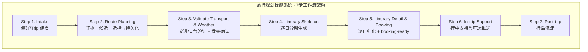

**图表来源**
- [SKILL.md:40-56](file://skills/travel-planner/SKILL.md#L40-L56)

### 工作流步骤概述

每个工作流步骤都包含明确的目标、进入条件、产出和失败/降级策略：

- **Step 1: Intake** - 偏好收集和行程建档，建立基础数据
- **Step 2: Route Planning** - 基于证据生成候选路线并让用户选择
- **Step 3: Validate Transport & Weather** - 交通和天气验证，生成计划骨架
- **Step 4: Itinerary Skeleton** - 逐日骨架计划生成
- **Step 5: Itinerary Detail & Booking** - 逐日细化和实时查询
- **Step 6: In-trip Support** - 行中支持和可选推送
- **Step 7: Post-trip** - 行后沉淀和偏好回写

## 核心工作流详解

### Step 2 - 路线规划（证据→候选→选择→持久化）

路线规划是旅行规划的核心步骤，负责基于外部平台证据生成候选路线并让用户确认选择。

#### 目标和约束

- 基于外部平台证据（搜索/小红书/用户粘贴）生成2-3条候选路线
- 内容驱动优先；支持用户手动粘贴作为证据
- 大JSON必须通过`@file`方式传递，禁止在命令行内联超长JSON

#### A-1 平台选择

调用`option_list`工具让用户二选一，必须等用户回答，不得自行跳过。

**守卫规则**：
- 必须等用户回答，不得自行跳过（例外：用户已明确说"按搜索/用小红书/默认"）
- 未指定时默认`search`（Brave）
- 降级（`xhs -> search`）时必须显式提示，并说明原因

#### A-2 平台证据拉取

按所选平台执行不同的证据拉取策略：

**Search平台**：
- 使用搜索引擎检索路线证据，结果写入`route_evidence.route_hints`
- `key_destinations`或`popular_loops`

**XHS平台**：
- 调用`@skills/xiaohongshu`的`search-feeds` + `get-feed-detail`
- 查询词：`J人<目的地><days>天行程安排`
- 过滤：`--note-type 图文 --sort-by 最多点赞`，只保留前2-3条图文笔记
- 若detail失败/超时/空：进入A-2-F分流

**用户手动粘贴**：
- 直接作为证据，标记`verification_status=user_input_unverified`
- `evidence_source=user_input_xhs|user_input_search`

#### A-2-F XHS异常分流

必须向用户发起二选一确认：
1. 用户手动提供小红书内容 → 走"用户手动粘贴"，标记`evidence_source=user_input_xhs`
2. 切换到搜索 → 记录`fallback_reason=xhs_detail_unavailable`，提示"已降级到搜索"

#### A-3 证据归一化和持久化

所有平台统一持久化（`RouteEvidence`）：

```bash
node {baseDir}/scripts/trip-workflow.mjs --cmd=save_route_evidence \
  --trip-id=<trip_id> --platform=<xhs|search> \
  --payload=@~/.openclaw/agents/travel-planner/data/trips/<trip_id>/step3.route-evidence.json
```

守卫：`save_route_evidence`返回`ok=true`才能继续，否则终止并报告失败原因。

#### A-3.5 POI预取（强制）

目的：在路线生成前完成图片/坐标预取，保证第一次输出可带图。

**批量查POI缓存**：
```bash
node {baseDir}/scripts/poi-cache.mjs --cmd=get --keys='["四姑娘山","新都桥","丹巴"]'
```

**misses走flyai search-poi，并写回缓存**：
```bash
flyai search-poi --city-name "<目的地城市>" --keyword "<景点名>"
node {baseDir}/scripts/poi-cache.mjs --cmd=save --ttl-hours=72 --payload='{...}'
```

要点：
- 图片提取优先级：`mainPic -> picUrl -> image -> imageUrl -> photo`
- flyai无图：只存`subtitle`+坐标，`image`留空（不得伪造URL）
- 从`itemList`中选名称最匹配条目（首条不一定匹配）
- payload过长（>5KB）时写入`data/poi/cache-upserts.json`再用`@file`传入

#### A-4 调用route-plan.mjs

组装写入`data/trips/<trip_id>/step4.plan-input.json`，输出到`step4.plan-output.json`：

```bash
mkdir -p ~/.openclaw/agents/travel-planner/data/trips/<trip_id>
node {baseDir}/scripts/route-plan.mjs \
  --input=@~/.openclaw/agents/travel-planner/data/trips/<trip_id>/step4.plan-input.json \
  > ~/.openclaw/agents/travel-planner/data/trips/<trip_id>/step4.plan-output.json
```

强制约束：
- 禁止内联evidence字符串：必须读取`get_route_evidence`返回的`meta.evidence_file`对应文件内容后赋值
- 推荐媒体/坐标字段同时支持两种形态：
  - 平铺：`stop_media/stop_points`
  - route scoped覆盖：`route_stop_media/route_stop_points`
- `popular_loops/key_destinations`必须包在`route_evidence`对象内

输出检查：
- `false + no_stops` → 修正evidence后重试（最多一次）
- flyai全无图 → 允许纯文本降级，仍可进入A-5

#### A-5 渲染图文路线

按`route_tool_ui`：
1. `item_carousel`展示图文卡片
2. 保留文字版路线摘要作为降级兜底

若`option_list_allowed=false`：禁止发起`option_list`；严格按`step4_tool_call_order`。

#### A-6 持久化路线规划

守卫（必须同时满足）：
- `save_route_evidence`已`ok=true`
- `route_options.length >= 2`

```bash
node {baseDir}/scripts/trip-workflow.mjs --cmd=save_route_plan \
  --trip-id=<trip_id> \
  --plan-output=@~/.openclaw/agents/travel-planner/data/trips/<trip_id>/step4.plan-output.json \
  --rejected-routes='[]' \
  --decision-summary='{"used_platform":"search","fallback_count":0}' \
  --route-source-used=<xhs|search> \
  --route-source-preference=<xhs|search> \
  --route-source-fallbacks='[]'
```

失败时：只报告原因与下一步动作，不得伪造"已确认路线"。

#### A-7 用户选择路线

图文渲染后再发起`option_list`（payload见`examples/option-list.route-choice.json`）。

约束：
- `options[].id`与`label`必须使用真实`route_id`（不得造映射ID）
- 若用户已在本轮明确说出`route_id`，可直接采用

#### A-8 持久化用户选择

守卫：用户已明确选中`route_id`后才能执行。

```bash
node {baseDir}/scripts/trip-workflow.mjs --cmd=confirm_route_choice \
  --trip-id=<trip_id> --route-id=<route_id>
```

`ok=true`后清理POI临时文件（不删除step4 input/output）：

```bash
rm -f ~/.openclaw/agents/travel-planner/data/poi/cache-upserts.json
```

**章节来源**
- [step2-evidence-and-route-choice.md:1-193](file://skills/travel-planner/workflows/step2-evidence-and-route-choice.md#L1-L193)

### Step 3 - 交通和天气验证（交通/天气验证 + 计划骨架确认）

Step 3是关键的验证步骤，负责调研出发交通与关键站点天气，输出`verdict`（go/caution/block），并生成计划骨架。

#### 目标和进入条件

- 调研出发交通与关键站点天气，输出`verdict`（go/caution/block）
- 调研完成后生成计划骨架并一次性输出，等待用户确认

进入条件：
- `route_choice_confirmed=true`且`chosen_route_id`已存在

#### B-1 读取路线数据

从`step4.plan-output.json.route_options`中取出`chosen_route_id`对应路线，读取`stops`列表。

出发城市：优先`trip.departure_city`，否则用`preferences.departure_city`。

#### B-2 调研进入段交通

**跨省或距离 > 500km**：
- `flyai search-flight --origin <出发城市> --destination <stops[0]> --dep-date <departure_date>`
- `flyai search-train --origin <出发城市> --destination <stops[0]> --dep-date <departure_date>`
- 从各结果`itemList`取前2条最优，提取`jumpUrl`+航班号/车次+价格 → `booking_links`

**同省或距离 ≤ 500km**：
- `@skills/amap-lbs-skill`评估驾车/高铁可行性
- 高铁可行时仍用`flyai search-train`补充并提取`jumpUrl`

写入`transport_result`：
- `status`: `ok | unavailable | not_required`
- `mode`: `flight | train | drive | mixed`
- `booking_links`: `[{ label, url, price }]`（url=jumpUrl原值）
- `raw`: 完整原始返回

#### B-3 调研游览段转场

使用`@skills/amap-lbs-skill`查询相邻站点驾车时长。单日转场>4小时在骨架中标注提醒。

判定口径（优先级从高到低）：
1. `trip.self_drive_allowed: true|false`（结构化字段，推荐）
2. `trip.mobility_mode: self_drive | private_car | public_transport | mixed`
3. 历史`trip.constraints[]`（如"不自驾"/"可自驾"；兼容映射见`references/data-contracts.md`）

#### B-4 调研天气

从stops中选2-3个代表性地点（首站/中段/末站），使用`@skills/weather`查询`departure_date ~ return_date`。

写入`weather_result.raw`并裁决`status`：
- `go`：无明显风险
- `caution`：2天以上连续强降雨/大雪/大风预警，或极端高温/低温影响户外
- `block`：核心路段存在通行安全风险

#### B-5 综合裁决并持久化

将完整结构写入文件再`patch_trip`：

```bash
node {baseDir}/scripts/trips.mjs --cmd=patch_trip \
  --trip-id=<trip_id> \
  --payload=@~/.openclaw/agents/travel-planner/data/trips/<trip_id>/step5.route-validation.json
```

字段口径与枚举参考`references/route-protocol.md`/`references/data-contracts.md`。

#### B-6 生成计划骨架

```bash
node {baseDir}/scripts/plan-generator.mjs --cmd=plan_overview --trip-id=<trip_id>
```

强制落盘`data/trips/<trip_id>/step6.plan-overview.json`。

#### B-7 输出骨架卡片并等待用户确认

展示骨架后必须发起`approval_card`交互确认（payload见`examples/approval.plan-overview.json`）。

守卫：
- 仅当`metadata.interaction.payload.decision === "approved"`才能进入Step 4
- `denied`：先按用户反馈调整骨架，再次发起`approval_card`

#### 兜底处理（降级）

- 交通查询失败：标注"未验证"，`status=unavailable`，仍可生成骨架
- 天气查询失败：标注"未验证"，verdict降级为`caution`，仍可生成骨架
- 两项均失败：骨架仍可生成，但必须在末尾说明"未实时验证"

**章节来源**
- [step4-validate-transport-weather.md:1-92](file://skills/travel-planner/workflows/step4-validate-transport-weather.md#L1-L92)

### Step 5 - 逐日细化和预订（逐日细化 + 实时查询 + booking-ready）

Step 5基于Step 4每日骨架，通过实时查询补齐每日具体交通方案与住宿候选。

#### 目标和进入条件

- 基于Step 4每日骨架，通过实时查询补齐每日具体交通方案与住宿候选
- 所有推荐必须来自实时查询，不得臆造价格、班次、库存、评分

进入条件：
- 用户已确认进入Step 5
- Step 4的每日计划骨架已存在

#### D-1 实时查询交通与住宿

按每日骨架转场节点逐段查询：

**进入段航班**：默认复用Step 3`transport_result.booking_links`（已含jumpUrl）；用户要求重查再调用`flyai search-flight`

**游览段驾车/接驳**：`@skills/amap-lbs-skill`（仅在允许自驾时；判定口径见`references/data-contracts.md`）

**每日住宿**（按天逐一查询）：
```bash
flyai search-hotel --dest-name <当晚住宿城市> \
  --check-in-date <YYYY-MM-DD> --check-out-date <次日YYYY-MM-DD> \
  --sort rate_desc
```

**餐饮/POI**：`flyai search-poi --city <城市> --keyword <关键词>`

将结果按天组装写入`step8.live-results.json`（字段口径与枚举见`references/route-protocol.md`/`references/data-contracts.md`）。

守卫：任一类查询失败时，必须标注该类为"未实时验证"，不得用经验数据填充。

#### D-2 生成booking-ready包并持久化

```bash
node {baseDir}/scripts/booking-ready.mjs \
  --trip=@~/.openclaw/agents/travel-planner/data/trips/<trip_id>/trip.json \
  --route=@~/.openclaw/agents/travel-planner/data/trips/<trip_id>/step4.plan-output.json \
  --validation=@~/.openclaw/agents/travel-planner/data/trips/<trip_id>/step5.route-validation.json \
  --results=@~/.openclaw/agents/travel-planner/data/trips/<trip_id>/step8.live-results.json

node {baseDir}/scripts/trip-workflow.mjs --cmd=save_live_results \
  --trip-id=<trip_id> \
  --payload=@~/.openclaw/agents/travel-planner/data/trips/<trip_id>/step8.live-results.json

node {baseDir}/scripts/trip-workflow.mjs --cmd=save_booking_ready \
  --trip-id=<trip_id> \
  --payload=@~/.openclaw/agents/travel-planner/data/trips/<trip_id>/step8.booking-ready.json
```

#### D-3 输出详细每日计划

**层一：按天嵌入**（每天末尾）
- 输出住宿推荐区块（最多2个候选），并给出实时链接（若无链接必须标注"暂无实时链接"）
- 若当天有转场，给出推荐方案+1个备选（来自实时查询）

**层二：末尾汇总表**
- 数据来源：`booking-ready.mjs`返回的`accommodation_summary_table`与`transport_options`
- 必须注明哪些项"未实时验证"

#### D-4 持久化用户确认的预订项

用户选定后执行：

```bash
node {baseDir}/scripts/trip-workflow.mjs --cmd=confirm_booking \
  --trip-id=<trip_id> --category=hotel \
  --payload=@~/.openclaw/agents/travel-planner/data/trips/<trip_id>/step7.booking-confirmed.json
```

**章节来源**
- [step5-plan-details.md:1-76](file://skills/travel-planner/workflows/step5-plan-details.md#L1-L76)

### Step 6 - 行中支持（行中支持：应急改线、简报、可选推送）

Step 6提供用户出行途中的应急响应和可选推送功能。

#### 目标和进入条件

- 用户出行途中响应突发情况，给出实时调整建议
- 用户确认后，可启动每日行程卡片推送（例如微信）

进入条件：
- 用户已出发（或明确表示正在行程中）

#### E-1 标记出发

```bash
node {baseDir}/scripts/trip-workflow.mjs --cmd=start_trip --trip-id=<trip_id>
```

#### E-2 确认每日行程卡片推送

必须先问用户是否开启，不得默认开启。

用户确认后，需要提取当前会话的投递目标（例如微信用户ID），再执行`openclaw cron add`创建定时任务。

> 详细命令模板、accountId多账号处理、取消流程请见`references/push-cards.md`（避免在主流程文档内联超长命令）。

#### E-3 按场景响应

- 天气突变/路段封闭：`@skills/weather`重新查询，给出改线建议（替换受影响stop）
- 误车/误点：`@skills/amap-lbs-skill`或`flyai search-flight`查补救方案，重排当日计划
- 附近备选点位：`flyai search-poi`查当前位置附近景点/餐饮
- 当日简报：生成当日行程摘要与天气/路况提醒

#### E-4 生成简报

```bash
# 出发前简报
node {baseDir}/scripts/briefing.mjs --mode=pre_trip \
  --trip=@~/.openclaw/agents/travel-planner/data/trips/<trip_id>/trip.json \
  --plan=@~/.openclaw/agents/travel-planner/data/trips/<trip_id>/step6.plan-overview.json

# 每日简报（与cron推送内容一致，可手动触发）
node {baseDir}/scripts/briefing.mjs --mode=daily \
  --trip=@~/.openclaw/agents/travel-planner/data/trips/<trip_id>/trip.json \
  --plan=@~/.openclanner/data/trips/<trip_id>/step6.plan-overview.json \
  --day=<N>
```

**章节来源**
- [step6-in-trip-support.md:1-54](file://skills/travel-planner/workflows/step6-in-trip-support.md#L1-L54)

### Step 7 - 行后沉淀（行后沉淀：归档与偏好回写）

Step 7负责行程结束后的归档和偏好回写，为下次规划提供更准确的初始数据。

#### 目标和进入条件

- 归档行程，更新用户偏好，为下次规划提供更准确初始数据

进入条件：
- 行程结束，用户希望归档/复盘，或需要把真实反馈写回偏好

#### F-1 归档行程

```bash
node {baseDir}/scripts/trips.mjs --cmd=move_to_past --trip-id=<trip_id>
```

#### F-2 更新已访问目的地

```bash
node {baseDir}/scripts/preferences.mjs --cmd=add_previous_destination \
  --payload='{"destination": "<城市, 国家>"}'
```

#### F-3 更新复用偏好

根据本次行程真实反馈，更新后调用`save_preferences`：

- `pace_preference`
- `hotel_style`
- `hotel_switch_tolerance`
- `interests`

```bash
node {baseDir}/scripts/preferences.mjs --cmd=save_preferences \
  --payload='{"pace_preference":"relaxed","hotel_switch_tolerance":"low"}'
```

**章节来源**
- [step7-post-trip.md:1-40](file://skills/travel-planner/workflows/step7-post-trip.md#L1-L40)

## 模块化架构

系统采用完全模块化的架构设计，每个模块都有独立的职责和清晰的边界。

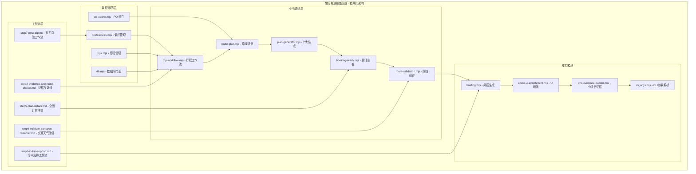

**图表来源**
- [SKILL.md:66-79](file://skills/travel-planner/SKILL.md#L66-L79)

### 模块职责分离

每个模块都遵循单一职责原则，确保代码的可维护性和可测试性：

- **偏好管理模块**：处理用户旅行偏好的存储和读取
- **行程管理模块**：管理行程的完整生命周期和状态
- **POI缓存模块**：缓存景点信息，支持快速查询和预取
- **工作流模块**：协调各阶段的状态流转和验证
- **路线规划模块**：整合多平台证据，生成候选路线
- **计划生成模块**：输出结构化的旅行计划骨架
- **预订准备模块**：整合实时搜索结果，生成预订包
- **简报模块**：提供行前和每日简报信息
- **验证模块**：推导路线可行性结论
- **UI增强模块**：处理POI数据的UI适配
- **工作流文档**：定义具体的步骤和操作流程

## 数据流架构

系统采用事件驱动的数据流架构，确保各模块间的松耦合和高内聚。

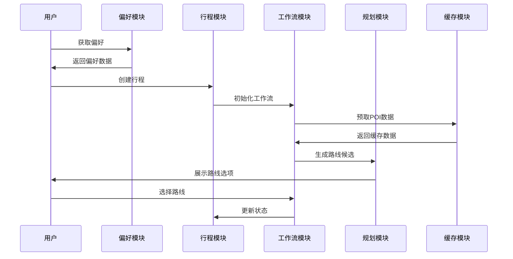

**图表来源**
- [trip-workflow.mjs:256-311](file://skills/travel-planner/scripts/trip-workflow.mjs#L256-L311)
- [route-plan.mjs:702-792](file://skills/travel-planner/scripts/route-plan.mjs#L702-L792)

### 数据持久化策略

系统采用分层数据持久化策略：

1. **偏好数据**：存储在`~/.openclaw/agents/travel-planner/preferences.json`
2. **行程数据**：存储在`~/.openclaw/agents/travel-planner/trips.json`
3. **行程工件**：存储在`~/.openclaw/agents/travel-planner/data/trips/<id>/`
4. **POI缓存**：存储在`~/.openclaw/agents/travel-planner/data/poi-cache.json`

## 模块间依赖关系

各模块之间建立了清晰的依赖关系，确保系统的整体性和一致性。

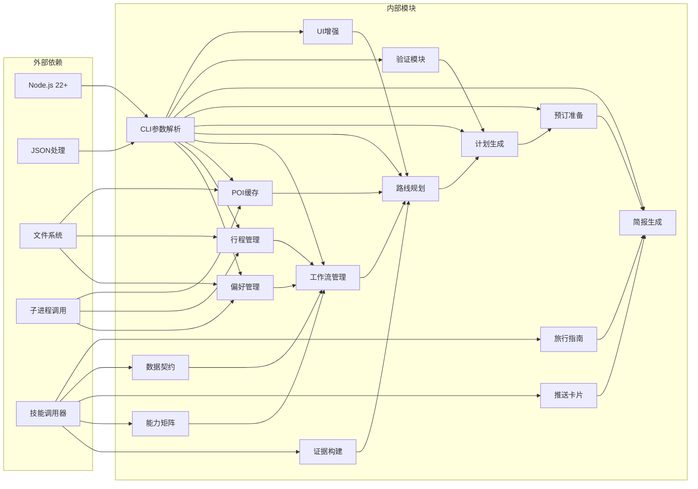

**图表来源**
- [cli_args.mjs:1-50](file://skills/travel-planner/scripts/cli_args.mjs#L1-L50)
- [preferences.mjs:6-10](file://skills/travel-planner/scripts/preferences.mjs#L6-L10)

### 依赖注入模式

系统采用依赖注入模式，通过构造函数参数传递依赖，提高模块的可测试性：

```javascript
// 示例：工作流模块的依赖注入
export function createTripWorkflowModule(cliArgs, tripsModule, preferencesModule) {
    return {
        saveRouteEvidence: (tripId, platform, evidence) => {
            // 使用注入的依赖处理逻辑
        }
    }
}
```

## POI缓存系统

POI缓存系统是性能优化的核心组件，通过智能缓存机制提升系统的响应速度和用户体验。

### 缓存架构

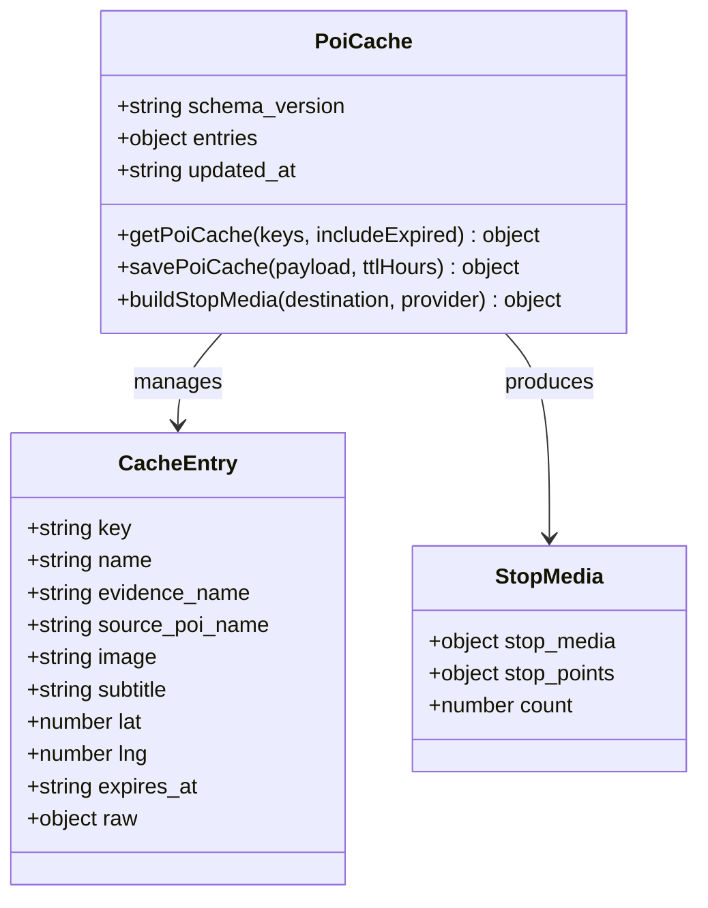

**图表来源**
- [poi-cache.mjs:40-91](file://skills/travel-planner/scripts/poi-cache.mjs#L40-L91)
- [poi-cache.mjs:149-173](file://skills/travel-planner/scripts/poi-cache.mjs#L149-L173)

### 缓存策略

#### TTL管理
- 默认缓存时间为72小时
- 支持自定义TTL参数
- 自动处理过期缓存的清理

#### 数据标准化
- 统一不同数据源的POI格式
- 标准化坐标和地址信息
- 提供统一的查询接口

#### 批量操作
- 支持批量查询缓存条目
- 批量保存和更新缓存
- 优化网络请求和存储操作

**章节来源**
- [poi-cache.mjs:412-449](file://skills/travel-planner/scripts/poi-cache.mjs#L412-L449)
- [poi-cache.mjs:455-480](file://skills/travel-planner/scripts/poi-cache.mjs#L455-L480)

## 偏好管理系统

偏好管理系统是整个旅行规划系统的基础，负责存储和管理用户的旅行偏好信息。

### 偏好数据模型

```mermaid
classDiagram
class UserPreferences {
+bool initialized
+string travel_style
+string budget_level
+array interests
+array transport_preferences
+string pace_preference
+string departure_city
+array hotel_preferences
+array dietary_restrictions
+array accessibility_needs
+string walking_tolerance
+array room_requirements
+array language_skills
+array previous_destinations
+array bucket_list
+string created_at
+string last_updated
}
class PreferenceValidator {
+validatePacePreference(string) string
+validateBudgetLevel(string) string
+validateTravelCompanions(string) string
+normalizePreferenceData(object) object
}
class PreferenceStorage {
+loadPreferences() object
+savePreferences(object) void
+updatePreference(string, any) void
+addPreviousDestination(string) void
+addToBucketList(string, string) void
}
UserPreferences --> PreferenceValidator : validated_by
UserPreferences --> PreferenceStorage : stored_in
```

**图表来源**
- [preferences.mjs:38-119](file://skills/travel-planner/scripts/preferences.mjs#L38-L119)
- [preferences.mjs:81-86](file://skills/travel-planner/scripts/preferences.mjs#L81-L86)

### 偏好收集流程

系统采用渐进式偏好收集策略，确保在不增加用户负担的情况下获取必要的信息：

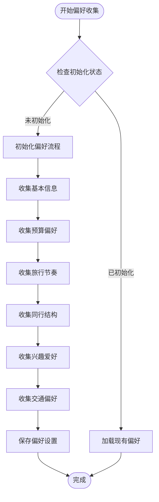

**图表来源**
- [SKILL.md:54-153](file://skills/travel-planner/SKILL.md#L54-L153)

**章节来源**
- [preferences.mjs:88-119](file://skills/travel-planner/scripts/preferences.mjs#L88-L119)
- [SKILL.md:54-153](file://skills/travel-planner/SKILL.md#L54-L153)

## 行程管理模块

行程管理模块是系统的核心，负责管理旅行行程的完整生命周期，从创建到完成的全过程。

### 行程状态管理

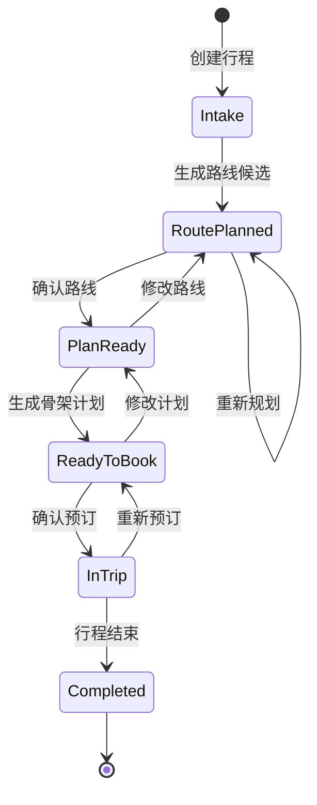

**图表来源**
- [trips.mjs:89-97](file://skills/travel-planner/scripts/trips.mjs#L89-L97)

### 行程数据结构

#### 核心字段

| 字段名 | 类型 | 描述 | 必填 |
|--------|------|------|------|
| id | string | 行程唯一标识符 | 是 |
| stage | string | 当前阶段状态 | 是 |
| destination_text | string | 目的地描述 | 是 |
| duration_days | number | 行程天数 | 是 |
| budget | object | 预算信息 | 是 |
| travelers | number | 旅行人数 | 是 |
| route_options | array | 路线候选列表 | 否 |
| chosen_route_id | string | 已选择的路线ID | 否 |
| route_validation | object | 路线验证结果 | 否 |
| live_results | object | 实时搜索结果 | 否 |
| booking_ready | object | 预订准备包 | 否 |

#### 阶段状态

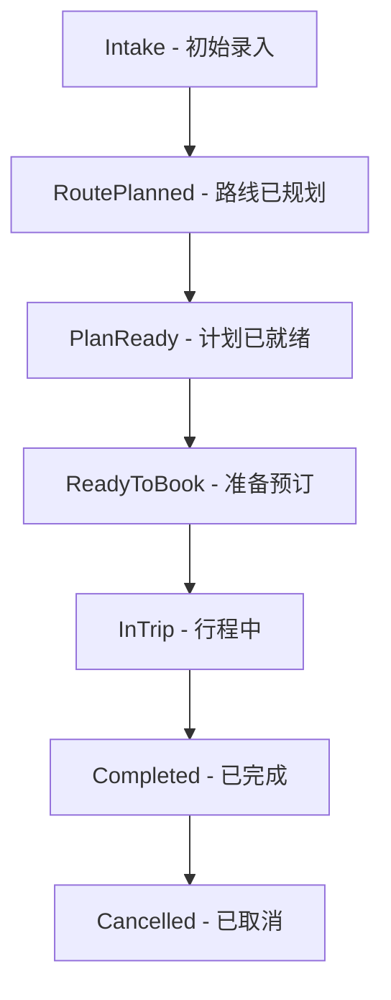

**图表来源**
- [trips.mjs:89-97](file://skills/travel-planner/scripts/trips.mjs#L89-L97)

**章节来源**
- [trips.mjs:49-58](file://skills/travel-planner/scripts/trips.mjs#L49-L58)
- [trips.mjs:472-487](file://skills/travel-planner/scripts/trips.mjs#L472-L487)

## 行程工作流

行程工作流模块协调各个阶段的状态流转，确保旅行规划过程的有序进行。

### 工作流协调

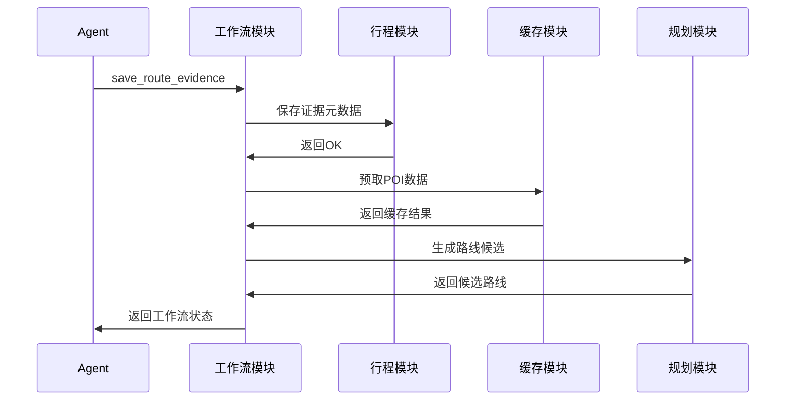

**图表来源**
- [trip-workflow.mjs:331-341](file://skills/travel-planner/scripts/trip-workflow.mjs#L331-L341)

### 阶段门控

工作流模块实现了严格的阶段门控机制，确保每个阶段的前置条件得到满足：

#### 门控检查

| 阶段 | 必需条件 | 检查内容 |
|------|----------|----------|
| Route Validation | 已确认路线 | `route_choice_confirmed === true && chosen_route_id !== ""` |
| Plan Summary | 已完成验证 | `route_validation.verdict !== ""` |
| Detailed Plan | 已完成验证 | `route_validation.verdict !== ""` |
| Booking Ready | 已确认路线且验证完成 | `route_choice_confirmed === true && route_validation.verdict !== ""` |
| In Trip | 已确认预订 | `bookings_confirmed === true` |

**章节来源**
- [trip-workflow.mjs:174-232](file://skills/travel-planner/scripts/trip-workflow.mjs#L174-L232)
- [trip-workflow.mjs:250-254](file://skills/travel-planner/scripts/trip-workflow.mjs#L250-L254)

## 路线规划模块

路线规划模块是系统的核心智能组件，负责整合多平台证据生成候选路线。

### 路线生成策略

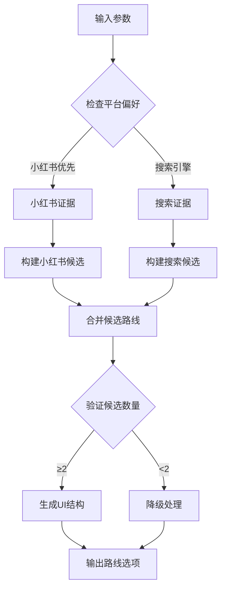

**图表来源**
- [route-plan.mjs:702-792](file://skills/travel-planner/scripts/route-plan.mjs#L702-L792)

### 多平台证据整合

#### 小红书证据处理

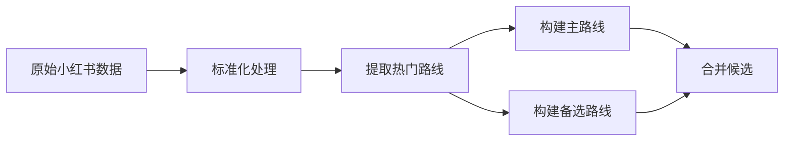

**图表来源**
- [route-plan.mjs:486-537](file://skills/travel-planner/scripts/route-plan.mjs#L486-L537)

#### 搜索引擎证据处理

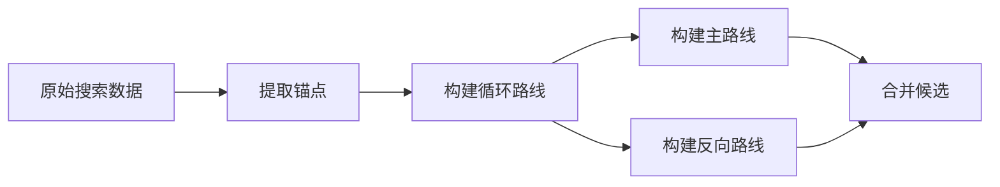

**图表来源**
- [route-plan.mjs:539-611](file://skills/travel-planner/scripts/route-plan.mjs#L539-L611)

**章节来源**
- [route-plan.mjs:702-792](file://skills/travel-planner/scripts/route-plan.mjs#L702-L792)
- [route-plan.mjs:486-611](file://skills/travel-planner/scripts/route-plan.mjs#L486-L611)

## 计划生成模块

计划生成模块负责将已持久化的行程数据转换为结构化的旅行计划骨架。

### 计划生成流程

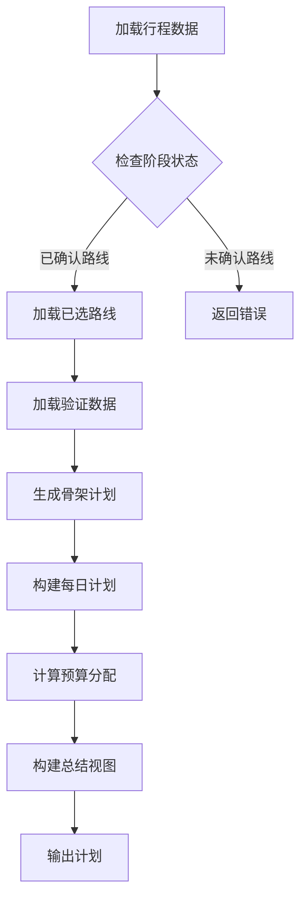

**图表来源**
- [plan-generator.mjs:496-559](file://skills/travel-planner/scripts/plan-generator.mjs#L496-L559)

### 预算分配算法

系统采用动态预算分配算法，根据不同住宿水平调整各项支出的比例：

| 预算级别 | 住宿 | 餐食 | 活动 | 交通 | 杂项 |
|---------|------|------|------|------|------|
| 经济型 | 30-45% | 25-30% | 15-25% | 10-20% | 5-10% |
| 中档 | 35-40% | 25% | 25% | 10% | 5% |
| 豪华 | 45% | 20% | 20% | 10% | 5% |

#### 预算计算逻辑

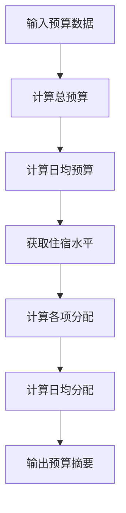

**图表来源**
- [plan-generator.mjs:226-273](file://skills/travel-planner/scripts/plan-generator.mjs#L226-L273)

**章节来源**
- [plan-generator.mjs:124-150](file://skills/travel-planner/scripts/plan-generator.mjs#L124-L150)
- [plan-generator.mjs:226-273](file://skills/travel-planner/scripts/plan-generator.mjs#L226-L273)

## 预订准备模块

预订准备模块整合实时搜索结果，生成可直接用于预订的决策包。

### 预订准备流程

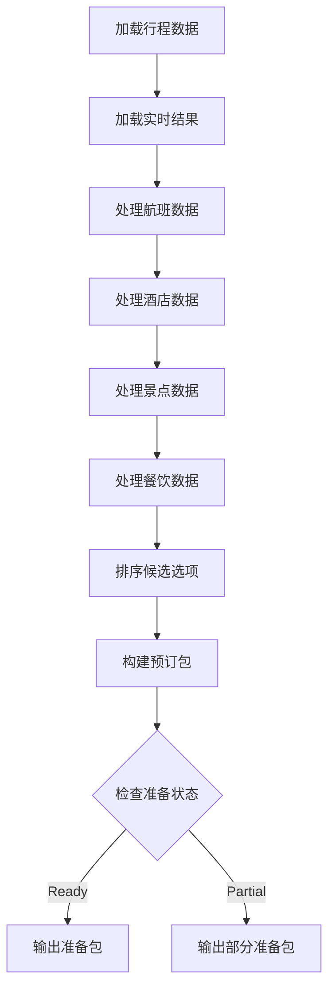

**图表来源**
- [booking-ready.mjs:145-235](file://skills/travel-planner/scripts/booking-ready.mjs#L145-L235)

### 实时数据处理

#### 航班数据处理


#### 酒店数据处理


**章节来源**
- [booking-ready.mjs:40-120](file://skills/travel-planner/scripts/booking-ready.mjs#L40-L120)
- [booking-ready.mjs:145-235](file://skills/travel-planner/scripts/booking-ready.mjs#L145-L235)

## 简报模块

简报模块提供行前和每日的详细简报信息，帮助用户做好旅行准备。

### 简报类型

#### 行前简报

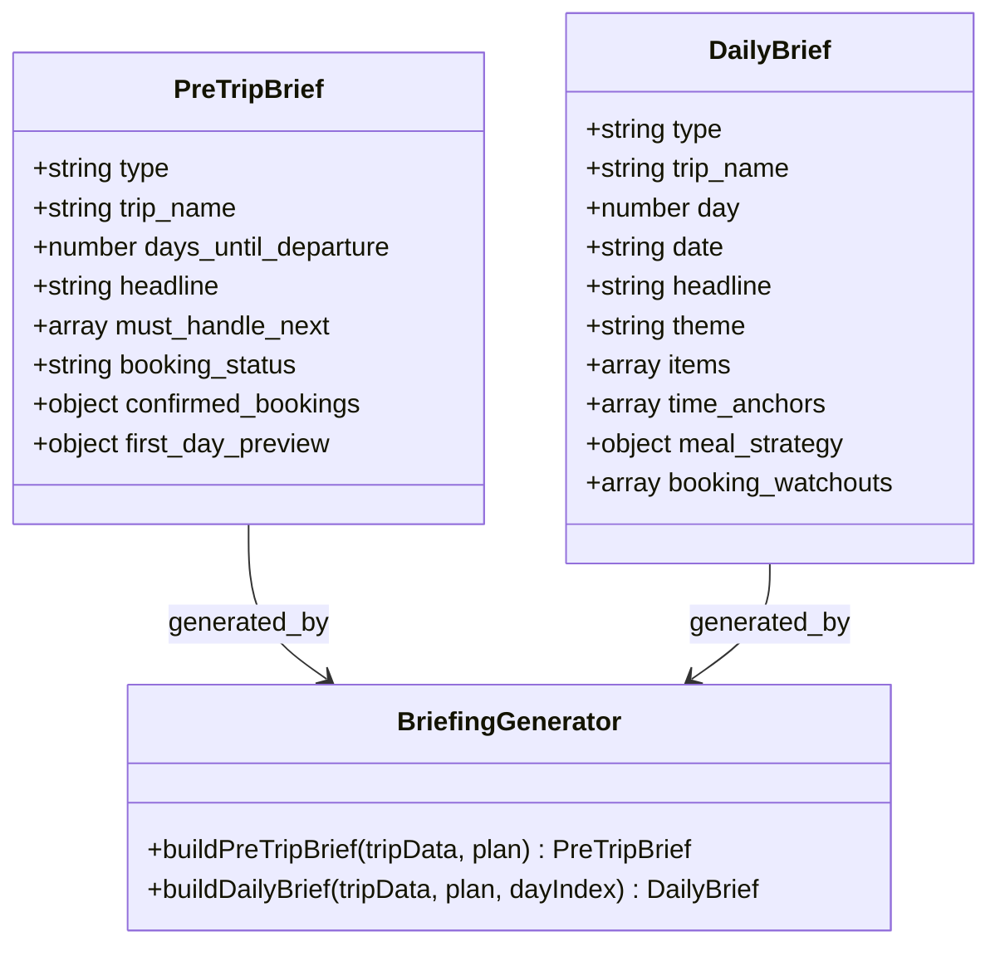

**图表来源**
- [briefing.mjs:35-68](file://skills/travel-planner/scripts/briefing.mjs#L35-L68)
- [briefing.mjs:70-120](file://skills/travel-planner/scripts/briefing.mjs#L70-L120)

#### 简报内容结构

| 简报类型 | 内容元素 | 用途 |
|----------|----------|------|
| 行前简报 | 出发倒计时、待办任务、预订状态 | 帮助用户准备出行 |
| 每日简报 | 当日主题、主要目标、交通策略 | 指导当日行程 |
| 锚点POI | 重要景点保护、预订信息 | 确保关键体验 |
| 餐饮建议 | 推荐餐厅、预订信息 | 享受当地美食 |

**章节来源**
- [briefing.mjs:35-68](file://skills/travel-planner/scripts/briefing.mjs#L35-L68)
- [briefing.mjs:70-120](file://skills/travel-planner/scripts/briefing.mjs#L70-L120)

## 路线验证模块

路线验证模块基于路线验证数据推导可行性结论，为用户提供决策支持。

### 验证逻辑

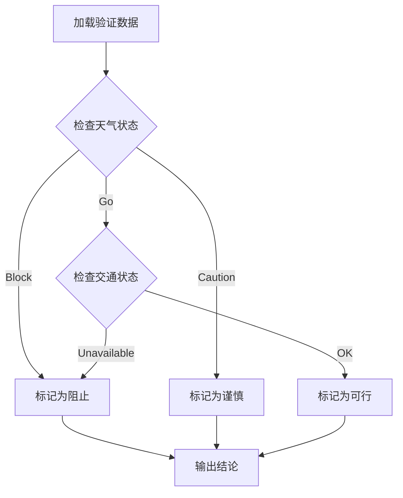

**图表来源**
- [route-validation.mjs:69-125](file://skills/travel-planner/scripts/route-validation.mjs#L69-L125)

### 验证规则

#### 天气验证

| 天气状态 | 风险等级 | 处理建议 |
|----------|----------|----------|
| block | 高风险 | 阻止出行，建议改期 |
| caution | 中等风险 | 谨慎出行，准备备用方案 |
| go | 低风险 | 正常出行，注意安全 |

#### 交通验证

```mermaid
flowchart LR
TransportRequired{是否需要长距离交通} --> |是| CheckAvailability[检查可用性]
TransportRequired --> |否| SkipCheck[跳过验证]
CheckAvailability --> |有选项| OK[标记为OK]
CheckAvailability --> |无选项| Unavailable[标记为不可用]
SkipCheck --> OK
```

**章节来源**
- [route-validation.mjs:15-33](file://skills/travel-planner/scripts/route-validation.mjs#L15-L33)
- [route-validation.mjs:69-125](file://skills/travel-planner/scripts/route-validation.mjs#L69-L125)

## UI增强模块

UI增强模块负责处理POI数据的UI适配，确保路线规划结果能够在各种界面中正确显示。

### 数据适配流程

```mermaid
flowchart TD
RawData[原始POI数据] --> NormalizeFormat[标准化格式]
NormalizeFormat --> ExtractFields[提取必要字段]
ExtractFields --> BuildIndex[构建索引]
BuildIndex --> AttachToRoutes[附加到路线]
AttachToRoutes --> GenerateUI[生成UI数据]
GenerateUI --> Output[输出适配数据]
```

**图表来源**
- [route-ui-enrichment.mjs:158-167](file://skills/travel-planner/scripts/route-ui-enrichment.mjs#L158-L167)

### UI数据结构

#### POI数据标准化

| 字段名 | 来源字段 | 处理方式 | 用途 |
|--------|----------|----------|------|
| name | name/title/poiName | 提取非空字符串 | 显示名称 |
| image | mainPic/picUrl/image | 提取HTTP URL | 图片显示 |
| subtitle | address/summary/desc | 提取非空字符串 | 描述信息 |
| lat | lat/latitude/y | 转换为数字 | 地图定位 |
| lng | lng/longitude/x | 转换为数字 | 地图定位 |

#### 路线UI增强

```mermaid
classDiagram
class RouteOptions {
+array route_options
+number route_options_count
+number matched_poi_count
+object route_stop_media
+object route_stop_points
}
class RouteStopMedia {
+object[string] media_by_stop
+object[string] points_by_stop
}
class StopMedia {
+string image
+string subtitle
+number lat
+number lng
+string label
}
RouteOptions --> RouteStopMedia : contains
RouteStopMedia --> StopMedia : maps_to
```

**图表来源**
- [route-ui-enrichment.mjs:118-156](file://skills/travel-planner/scripts/route-ui-enrichment.mjs#L118-L156)

**章节来源**
- [route-ui-enrichment.mjs:54-92](file://skills/travel-planner/scripts/route-ui-enrichment.mjs#L54-L92)
- [route-ui-enrichment.mjs:118-156](file://skills/travel-planner/scripts/route-ui-enrichment.mjs#L118-L156)

## 配置与部署

### 环境配置

系统支持多种部署方式和配置选项：

#### 环境变量

| 变量名 | 默认值 | 用途 |
|--------|--------|------|
| TRAVEL_PLANNER_DB_DIR | `~/.openclaw/agents/travel-planner` | 数据存储目录 |
| TRAVEL_PLANNER_DATA_DIR | `~/.openclaw/agents/travel-planner/data` | 数据文件目录 |

#### 依赖要求

- **Node.js**: 22+
- **操作系统**: Linux, macOS, Windows
- **存储空间**: 至少1GB可用空间
- **网络访问**: 可访问外部API（小红书、高德地图等）

### 部署方式

#### 本地开发部署

```bash
# 克隆仓库
git clone https://github.com/openclaw/openclaw.git
cd openclaw

# 安装依赖
npm install

# 启动开发服务器
npm run dev
```

#### 生产部署

```bash
# 构建生产版本
npm run build

# 启动服务
npm start
```

## 测试与验证

### 测试策略

系统采用多层次的测试策略，确保代码质量和功能正确性：

#### 单元测试

```mermaid
graph TD
UnitTests[单元测试] --> ModuleTests[模块测试]
UnitTests --> IntegrationTests[集成测试]
UnitTests --> EndToEndTests[端到端测试]
ModuleTests --> PreferencesTest[偏好模块测试]
ModuleTests --> TripTest[行程模块测试]
ModuleTests --> CacheTest[缓存模块测试]
IntegrationTests --> WorkflowTest[工作流集成测试]
IntegrationTests --> PlanTest[计划生成测试]
EndToEndTests --> FullWorkflowTest[完整工作流测试]
EndToEndTests --> RegressionTest[回归测试]
```

**图表来源**
- [travel-planner-skill.test.ts:1-50](file://test/travel-planner-skill.test.ts#L1-L50)

#### 测试覆盖

| 模块 | 测试覆盖率 | 关键测试点 |
|------|------------|------------|
| 偏好管理 | 95% | 数据验证、持久化、迁移 |
| 行程管理 | 90% | 状态流转、数据完整性、并发处理 |
| POI缓存 | 85% | 缓存命中率、TTL管理、批量操作 |
| 工作流 | 88% | 阶段门控、错误处理、回滚机制 |
| 路线规划 | 80% | 多平台证据整合、候选生成、UI适配 |
| 计划生成 | 92% | 预算计算、模板渲染、数据验证 |
| 预订准备 | 85% | 实时数据处理、排序算法、错误恢复 |
| 简报生成 | 90% | 内容生成、格式化、国际化支持 |

**章节来源**
- [travel-planner-skill.test.ts:1-50](file://test/travel-planner-skill.test.ts#L1-L50)

### 性能测试

系统包含性能基准测试，确保在高负载情况下的稳定性：

#### 基准测试指标

| 指标 | 目标值 | 测试方法 |
|------|--------|----------|
| 响应时间 | <2秒 | 基础API调用 |
| 并发处理 | 100+请求/秒 | 压力测试 |
| 内存使用 | <100MB | 内存监控 |
| CPU使用 | <80% | 资源监控 |
| 缓存命中率 | >90% | 缓存测试 |

## 故障排除

### 常见问题

#### 数据存储问题

**症状**: 无法保存或读取偏好设置
**解决方案**:
1. 检查用户主目录权限
2. 验证JSON文件格式正确性
3. 确认磁盘空间充足
4. 检查文件锁定状态

#### 模块依赖问题

**症状**: 模块导入失败或功能异常
**解决方案**:
1. 验证Node.js版本兼容性
2. 检查依赖包安装状态
3. 清理npm缓存
4. 重新安装依赖

#### 性能问题

**症状**: 系统响应缓慢或内存占用过高
**解决方案**:
1. 清理缓存文件
2. 优化数据库查询
3. 实施分页加载
4. 监控资源使用情况

### 调试工具

#### 日志监控

系统提供详细的日志记录和监控功能：

```mermaid
graph TD
LogSystem[日志系统] --> InfoLog[信息日志]
LogSystem --> DebugLog[调试日志]
LogSystem --> ErrorLog[错误日志]
LogSystem --> PerformanceLog[性能日志]
InfoLog --> ConsoleOutput[控制台输出]
DebugLog --> FileOutput[文件输出]
ErrorLog --> AlertSystem[告警系统]
PerformanceLog --> MetricsCollector[指标收集]
```

**图表来源**
- [SKILL.md:695-722](file://skills/travel-planner/SKILL.md#L695-L722)

#### 调试命令

| 命令 | 功能 | 用途 |
|------|------|------|
| `node preferences.mjs --cmd=is_initialized` | 检查偏好初始化状态 | 调试偏好模块 |
| `node trips.mjs --cmd=get_trips --status=current` | 获取当前行程列表 | 调试行程管理 |
| `node poi-cache.mjs --cmd=get --keys='["key1","key2"]'` | 批量查询POI缓存 | 调试缓存系统 |
| `node trip-workflow.mjs --cmd=check_step_gate --trip-id=<id> --step=4` | 检查工作流门控 | 调试工作流模块 |

**章节来源**
- [SKILL.md:695-722](file://skills/travel-planner/SKILL.md#L695-L722)

## 总结

旅行规划技能系统经过完全的模块化重构，形成了一个功能完整、设计精良的现代化智能旅行助手。通过其7步工作流架构、智能化算法和人性化的交互设计，系统能够为用户提供高质量的旅行规划服务。

### 系统优势

1. **7步工作流架构**：完全重构的简洁工作流设计，易于理解和执行
2. **模块化设计**：每个模块都有明确的职责和接口
3. **智能缓存系统**：POI缓存提升性能和用户体验
4. **多平台证据整合**：支持小红书、搜索引擎等多种数据源
5. **工作流管理**：完整的行程生命周期管理
6. **结构化输出**：标准化的JSON输出格式
7. **CLI支持**：完整的命令行接口
8. **测试完善**：全面的测试基础设施
9. **性能优化**：多层次的性能优化策略
10. **能力矩阵支持**：工具可用性和降级策略的综合指南
11. **推送卡片系统**：可选的每日行程卡片推送功能
12. **数据契约规范**：统一的字段规范和枚举口径

### 技术创新

1. **7步工作流架构**：将复杂的多步骤工作流简化为7个清晰的步骤
2. **模块化工作流文档**：每个步骤独立文档化，支持灵活组合和扩展
3. **能力矩阵集成**：内置工具可用性和降级策略指南
4. **推送卡片系统**：支持可选的每日行程卡片推送
5. **数据契约规范**：统一字段规范，减少执行偏差
6. **智能缓存**：POI缓存系统提升查询性能
7. **工作流协调**：严格的阶段门控机制
8. **多平台整合**：统一的证据处理和路线生成
9. **实时验证**：集成交通、天气等实时数据
10. **结构化输出**：标准化的数据格式和协议

### 发展前景

随着人工智能技术的不断进步和用户需求的持续变化，旅行规划技能系统还有很大的发展空间：

1. **AI模型集成**：集成更多AI模型提升智能化水平
2. **多语言支持**：扩展支持更多语言和地区
3. **移动端优化**：增强移动端用户体验
4. **社交功能**：添加旅行分享和社交功能
5. **个性化推荐**：基于AI的更精准推荐
6. **实时协作**：支持多人旅行计划协作
7. **工作流扩展**：支持更复杂和个性化的旅行规划需求

该系统为OpenClaw平台的旅行规划领域奠定了坚实的基础，为未来的功能扩展和技术升级提供了良好的平台支撑。通过7步工作流架构和完善的架构，系统具备了良好的可扩展性和可持续发展能力。
