# 旅行规划技能系统

<cite>
**本文档引用的文件**
- [SKILL.md](file://skills/travel-planner/SKILL.md)
- [preferences.mjs](file://skills/travel-planner/scripts/preferences.mjs)
- [trips.mjs](file://skills/travel-planner/scripts/trips.mjs)
- [poi-cache.mjs](file://skills/travel-planner/scripts/poi-cache.mjs)
- [trip-workflow.mjs](file://skills/travel-planner/scripts/trip-workflow.mjs)
- [route-plan.mjs](file://skills/travel-planner/scripts/route-plan.mjs)
- [plan-generator.mjs](file://skills/travel-planner/scripts/plan-generator.mjs)
- [booking-ready.mjs](file://skills/travel-planner/scripts/booking-ready.mjs)
- [briefing.mjs](file://skills/travel-planner/scripts/briefing.mjs)
- [route-validation.mjs](file://skills/travel-planner/scripts/route-validation.mjs)
- [route-ui-enrichment.mjs](file://skills/travel-planner/scripts/route-ui-enrichment.mjs)
- [cli_args.mjs](file://skills/travel-planner/scripts/cli_args.mjs)
- [xhs-evidence-builder.mjs](file://skills/travel-planner/scripts/xhs-evidence-builder.mjs)
- [package.json](file://skills/travel-planner/package.json)
- [route-protocol.md](file://skills/travel-planner/references/route-protocol.md)
- [cultural_etiquette.md](file://skills/travel-planner/references/cultural_etiquette.md)
- [example_dialogue.md](file://skills/travel-planner/references/example_dialogue.md)
- [travel-planner-skill.test.ts](file://test/travel-planner-skill.test.ts)
</cite>

## 更新摘要
**所做更改**
- 完全重构为模块化架构，移除旧的monolithic设计
- 新增POI缓存系统模块，支持景点信息缓存和预取
- 新增偏好管理模块，独立处理用户偏好存储
- 新增行程管理模块，统一管理行程生命周期
- 新增行程工作流模块，协调各阶段状态流转
- 新增路线规划模块，支持多平台证据整合
- 新增计划生成模块，输出结构化骨架计划
- 新增预订准备模块，整合实时搜索结果
- 新增简报模块，提供行前和每日简报
- 新增路线验证模块，推导可行性结论
- 新增UI增强模块，处理POI数据适配
- 更新架构图为模块化设计

## 目录
1. [简介](#简介)
2. [模块化架构](#模块化架构)
3. [核心模块详解](#核心模块详解)
4. [数据流架构](#数据流架构)
5. [模块间依赖关系](#模块间依赖关系)
6. [工作流程](#工作流程)
7. [POI缓存系统](#poi缓存系统)
8. [偏好管理系统](#偏好管理系统)
9. [行程管理模块](#行程管理模块)
10. [行程工作流](#行程工作流)
11. [路线规划模块](#路线规划模块)
12. [计划生成模块](#计划生成模块)
13. [预订准备模块](#预订准备模块)
14. [简报模块](#简报模块)
15. [路线验证模块](#路线验证模块)
16. [UI增强模块](#ui增强模块)
17. [配置与部署](#配置与部署)
18. [测试与验证](#测试与验证)
19. [故障排除](#故障排除)
20. [总结](#总结)

## 简介

旅行规划技能系统是一个完全重构的模块化智能旅行助手，基于OpenClaw平台构建。系统采用现代化的模块化架构设计，将复杂的旅行规划功能分解为独立的功能模块，每个模块都有明确的职责和清晰的接口。

### 核心特性

- **模块化设计**：完全重构的独立模块架构，支持灵活组合和扩展
- **POI缓存系统**：智能缓存景点信息，提升性能和离线可用性
- **多平台证据整合**：支持小红书、搜索引擎等多种数据源
- **智能路线规划**：基于用户偏好的个性化路线推荐
- **结构化计划输出**：标准化的JSON输出格式，便于后续处理
- **实时验证系统**：集成交通、天气等实时数据验证
- **预订准备功能**：生成可直接用于预订的决策包
- **行前简报系统**：提供详细的行前准备和每日简报
- **工作流管理**：完整的行程生命周期管理
- **CLI支持**：完整的命令行接口，支持独立使用

## 模块化架构

系统采用完全模块化的架构设计，每个模块都有独立的职责和清晰的边界。

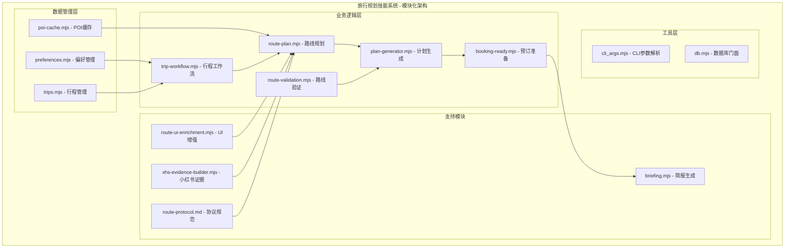

**图表来源**
- [preferences.mjs:1-175](file://skills/travel-planner/scripts/preferences.mjs#L1-L175)
- [trips.mjs:1-718](file://skills/travel-planner/scripts/trips.mjs#L1-L718)
- [poi-cache.mjs:1-549](file://skills/travel-planner/scripts/poi-cache.mjs#L1-L549)
- [trip-workflow.mjs:1-554](file://skills/travel-planner/scripts/trip-workflow.mjs#L1-L554)

### 模块职责分离

每个模块都遵循单一职责原则，确保代码的可维护性和可测试性：

- **偏好管理模块**：处理用户旅行偏好的存储和读取
- **行程管理模块**：管理行程的完整生命周期和状态
- **POI缓存模块**：缓存景点信息，支持快速查询和预取
- **工作流模块**：协调各阶段的状态流转和验证
- **路线规划模块**：整合多平台证据，生成候选路线
- **计划生成模块**：输出结构化的旅行计划骨架
- **预订准备模块**：整合实时搜索结果，生成预订包
- **简报模块**：提供行前和每日简报信息
- **验证模块**：推导路线可行性结论
- **UI增强模块**：处理POI数据的UI适配

## 核心模块详解

### 偏好管理模块

偏好管理模块是整个系统的基础，负责存储和管理用户的旅行偏好信息。

#### 核心功能

- **偏好存储**：将用户偏好信息存储在本地JSON文件中
- **偏好读取**：提供便捷的方法读取和更新偏好设置
- **偏好验证**：确保偏好数据的完整性和有效性
- **偏好迁移**：支持偏好数据的版本迁移和兼容

#### 数据结构

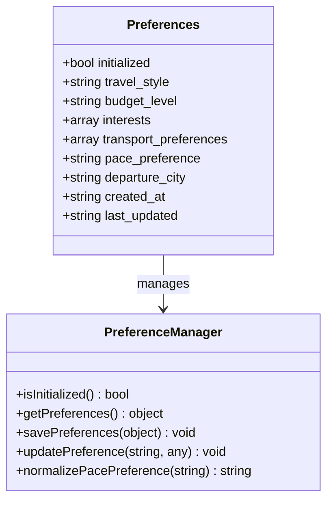

**图表来源**
- [preferences.mjs:38-119](file://skills/travel-planner/scripts/preferences.mjs#L38-L119)

**章节来源**
- [preferences.mjs:88-119](file://skills/travel-planner/scripts/preferences.mjs#L88-L119)
- [preferences.mjs:141-175](file://skills/travel-planner/scripts/preferences.mjs#L141-L175)

### 行程管理模块

行程管理模块是系统的核心，负责管理旅行行程的完整生命周期。

#### 核心功能

- **行程创建**：创建新的旅行行程记录
- **状态管理**：跟踪行程的各个阶段状态
- **数据持久化**：将行程数据持久化到文件系统
- **查询接口**：提供灵活的行程查询和筛选功能

#### 状态流转

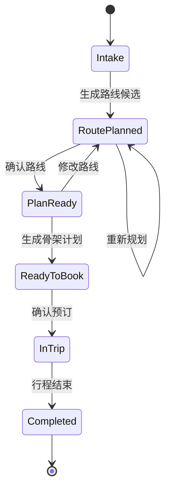

**图表来源**
- [trips.mjs:65-73](file://skills/travel-planner/scripts/trips.mjs#L65-L73)

**章节来源**
- [trips.mjs:472-487](file://skills/travel-planner/scripts/trips.mjs#L472-L487)
- [trips.mjs:538-546](file://skills/travel-planner/scripts/trips.mjs#L538-L546)

### POI缓存系统

POI缓存系统是性能优化的关键组件，负责缓存景点信息以提升查询速度。

#### 核心功能

- **缓存存储**：将POI信息存储在本地缓存文件中
- **批量查询**：支持批量查询缓存条目
- **缓存更新**：自动处理缓存条目的过期和更新
- **数据标准化**：统一不同数据源的POI格式

#### 缓存策略

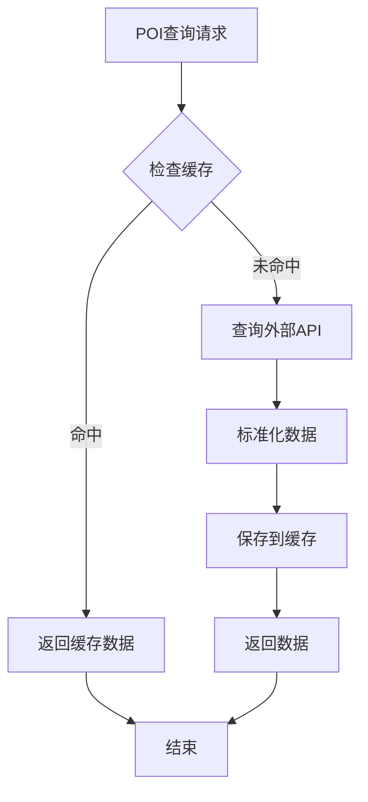

**图表来源**
- [poi-cache.mjs:378-407](file://skills/travel-planner/scripts/poi-cache.mjs#L378-L407)

**章节来源**
- [poi-cache.mjs:408-449](file://skills/travel-planner/scripts/poi-cache.mjs#L408-L449)
- [poi-cache.mjs:455-480](file://skills/travel-planner/scripts/poi-cache.mjs#L455-L480)

## 数据流架构

系统采用事件驱动的数据流架构，确保各模块间的松耦合和高内聚。

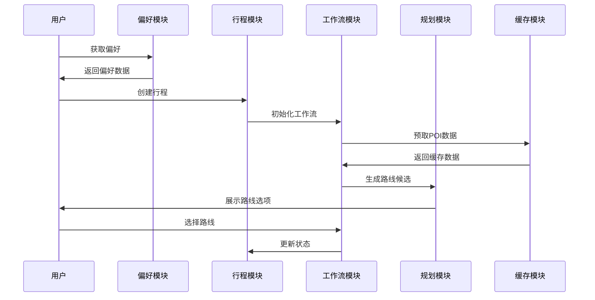

**图表来源**
- [trip-workflow.mjs:256-311](file://skills/travel-planner/scripts/trip-workflow.mjs#L256-L311)
- [route-plan.mjs:702-792](file://skills/travel-planner/scripts/route-plan.mjs#L702-L792)

### 数据持久化策略

系统采用分层数据持久化策略：

1. **偏好数据**：存储在 `~/.openclaw/agents/travel-planner/preferences.json`
2. **行程数据**：存储在 `~/.openclaw/agents/travel-planner/trips.json`
3. **行程工件**：存储在 `~/.openclaw/agents/travel-planner/data/trips/<id>/`
4. **POI缓存**：存储在 `~/.openclaw/agents/travel-planner/data/poi-cache.json`

## 模块间依赖关系

各模块之间建立了清晰的依赖关系，确保系统的整体性和一致性。

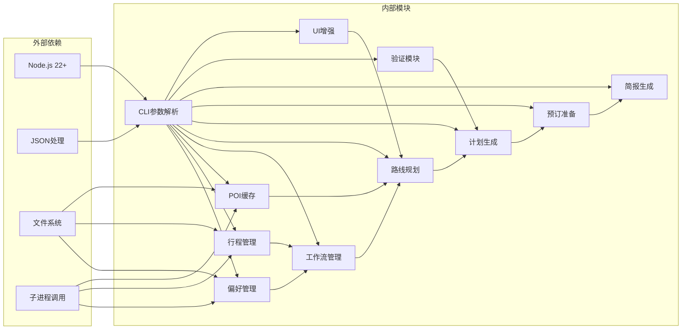

**图表来源**
- [cli_args.mjs:1-50](file://skills/travel-planner/scripts/cli_args.mjs#L1-L50)
- [preferences.mjs:6-10](file://skills/travel-planner/scripts/preferences.mjs#L6-L10)

### 依赖注入模式

系统采用依赖注入模式，通过构造函数参数传递依赖，提高模块的可测试性：

```javascript
// 示例：工作流模块的依赖注入
export function createTripWorkflowModule(cliArgs, tripsModule, preferencesModule) {
    return {
        saveRouteEvidence: (tripId, platform, evidence) => {
            // 使用注入的依赖处理逻辑
        }
    }
}
```

## 工作流程

系统遵循严格的工作流程，确保旅行规划过程的完整性和一致性。

### 完整工作流程

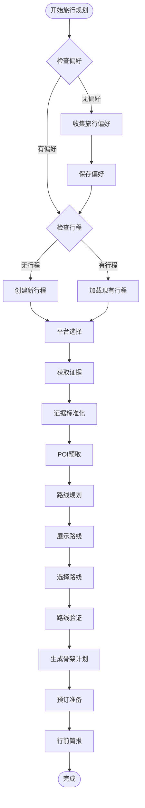

**图表来源**
- [SKILL.md:38-460](file://skills/travel-planner/SKILL.md#L38-L460)

### 步骤详细说明

#### 第一步：偏好检查
- 检查用户是否已设置旅行偏好
- 如果没有偏好，引导用户完成偏好收集
- 支持渐进式偏好收集，只收集高影响项

#### 第二步：行程创建
- 创建新的旅行行程记录
- 设置初始状态为 `intake`
- 支持多行程并行管理

#### 第三步：平台选择
- 支持小红书和搜索引擎两种平台
- 默认使用搜索引擎，用户可选择小红书
- 支持智能降级机制

#### 第四步：证据获取与标准化
- 从选定平台获取旅行证据
- 标准化不同平台的数据格式
- 生成统一的证据结构

#### 第五步：POI预取
- 预取路线中的关键POI信息
- 缓存POI数据以提升后续查询速度
- 支持批量查询和单个查询

#### 第六步：路线规划
- 基于证据生成候选路线
- 支持多平台证据整合
- 生成结构化的路线选项

#### 第七步：路线展示与选择
- 展示候选路线给用户
- 支持图文卡片和选项列表
- 用户选择最终路线

#### 第八步：路线验证
- 验证交通和天气等关键因素
- 生成可行性结论
- 支持人工确认和修改

#### 第九步：骨架计划生成
- 生成详细的旅行计划骨架
- 包含每日活动安排
- 支持预算和打包建议

#### 第十步：预订准备
- 整合实时搜索结果
- 生成预订决策包
- 支持预订确认和跟踪

## POI缓存系统

POI缓存系统是性能优化的核心组件，通过智能缓存机制提升系统的响应速度和用户体验。

### 缓存架构

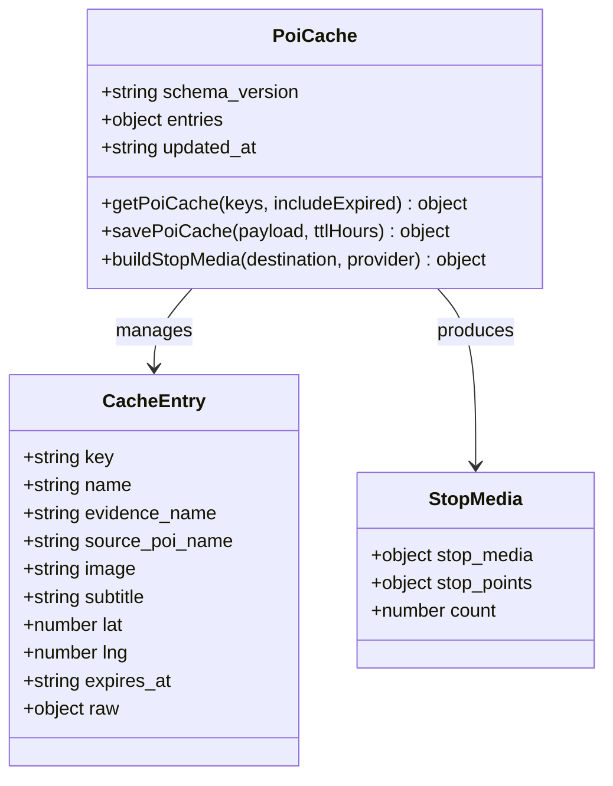

**图表来源**
- [poi-cache.mjs:40-91](file://skills/travel-planner/scripts/poi-cache.mjs#L40-L91)
- [poi-cache.mjs:149-173](file://skills/travel-planner/scripts/poi-cache.mjs#L149-L173)

### 缓存策略

#### TTL管理
- 默认缓存时间为72小时
- 支持自定义TTL参数
- 自动处理过期缓存的清理

#### 数据标准化
- 统一不同数据源的POI格式
- 标准化坐标和地址信息
- 提供统一的查询接口

#### 批量操作
- 支持批量查询缓存条目
- 批量保存和更新缓存
- 优化网络请求和存储操作

**章节来源**
- [poi-cache.mjs:412-449](file://skills/travel-planner/scripts/poi-cache.mjs#L412-L449)
- [poi-cache.mjs:455-480](file://skills/travel-planner/scripts/poi-cache.mjs#L455-L480)

## 偏好管理系统

偏好管理系统是整个旅行规划系统的基础，负责存储和管理用户的旅行偏好信息。

### 偏好数据模型

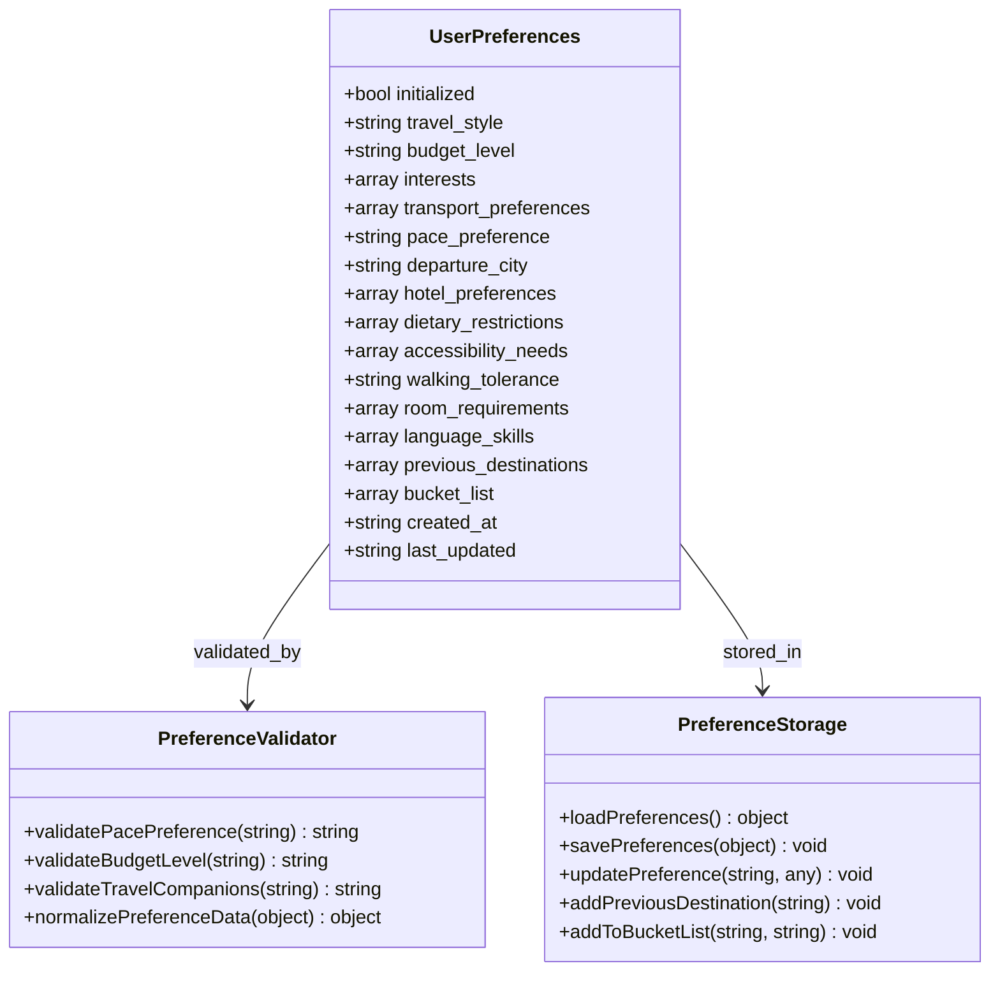

**图表来源**
- [preferences.mjs:38-119](file://skills/travel-planner/scripts/preferences.mjs#L38-L119)
- [preferences.mjs:81-86](file://skills/travel-planner/scripts/preferences.mjs#L81-L86)

### 偏好收集流程

系统采用渐进式偏好收集策略，确保在不增加用户负担的情况下获取必要的信息：


**图表来源**
- [SKILL.md:54-153](file://skills/travel-planner/SKILL.md#L54-L153)

**章节来源**
- [preferences.mjs:88-119](file://skills/travel-planner/scripts/preferences.mjs#L88-L119)
- [SKILL.md:54-153](file://skills/travel-planner/SKILL.md#L54-L153)

## 行程管理模块

行程管理模块是系统的核心，负责管理旅行行程的完整生命周期，从创建到完成的全过程。

### 行程状态管理

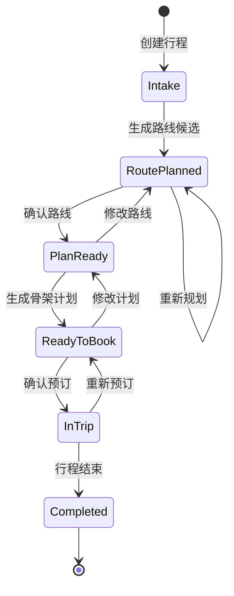

**图表来源**
- [trips.mjs:65-73](file://skills/travel-planner/scripts/trips.mjs#L65-L73)

### 行程数据结构

#### 核心字段

| 字段名 | 类型 | 描述 | 必填 |
|--------|------|------|------|
| id | string | 行程唯一标识符 | 是 |
| stage | string | 当前阶段状态 | 是 |
| destination_text | string | 目的地描述 | 是 |
| duration_days | number | 行程天数 | 是 |
| budget | object | 预算信息 | 是 |
| travelers | number | 旅行人数 | 是 |
| route_options | array | 路线候选列表 | 否 |
| chosen_route_id | string | 已选择的路线ID | 否 |
| route_validation | object | 路线验证结果 | 否 |
| live_results | object | 实时搜索结果 | 否 |
| booking_ready | object | 预订准备包 | 否 |

#### 阶段状态

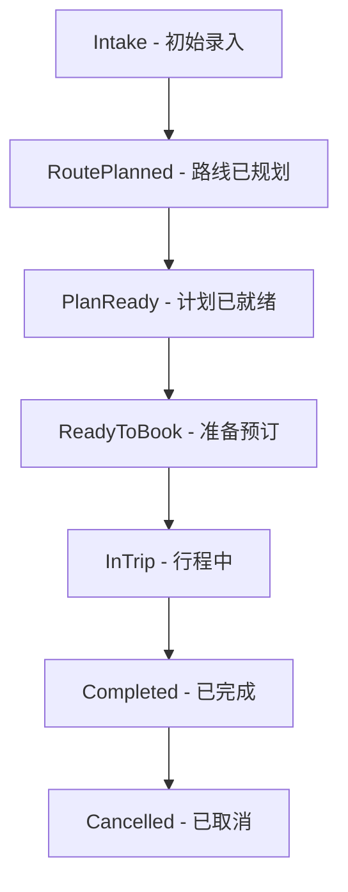

**图表来源**
- [trips.mjs:65-73](file://skills/travel-planner/scripts/trips.mjs#L65-L73)

**章节来源**
- [trips.mjs:49-58](file://skills/travel-planner/scripts/trips.mjs#L49-L58)
- [trips.mjs:472-487](file://skills/travel-planner/scripts/trips.mjs#L472-L487)

## 行程工作流

行程工作流模块协调各个阶段的状态流转，确保旅行规划过程的有序进行。

### 工作流协调

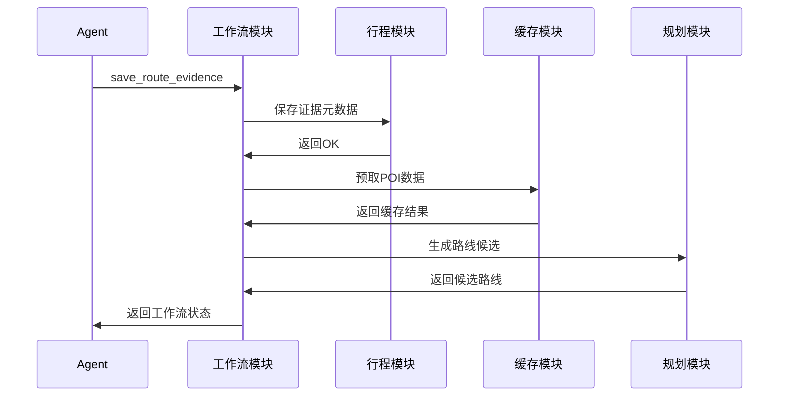

**图表来源**
- [trip-workflow.mjs:331-341](file://skills/travel-planner/scripts/trip-workflow.mjs#L331-L341)

### 阶段门控

工作流模块实现了严格的阶段门控机制，确保每个阶段的前置条件得到满足：

#### 门控检查

| 阶段 | 必需条件 | 检查内容 |
|------|----------|----------|
| Route Validation | 已确认路线 | `route_choice_confirmed === true && chosen_route_id !== ""` |
| Plan Summary | 已完成验证 | `route_validation.verdict !== ""` |
| Detailed Plan | 已完成验证 | `route_validation.verdict !== ""` |
| Booking Ready | 已确认路线且验证完成 | `route_choice_confirmed === true && route_validation.verdict !== ""` |
| In Trip | 已确认预订 | `bookings_confirmed === true` |

**章节来源**
- [trip-workflow.mjs:174-232](file://skills/travel-planner/scripts/trip-workflow.mjs#L174-L232)
- [trip-workflow.mjs:250-254](file://skills/travel-planner/scripts/trip-workflow.mjs#L250-L254)

## 路线规划模块

路线规划模块是系统的核心智能组件，负责整合多平台证据生成候选路线。

### 路线生成策略

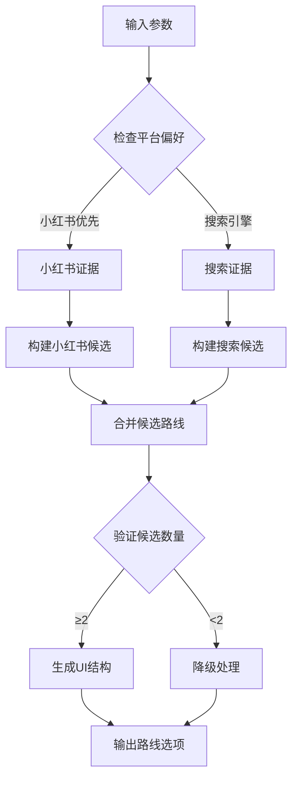

**图表来源**
- [route-plan.mjs:702-792](file://skills/travel-planner/scripts/route-plan.mjs#L702-L792)

### 多平台证据整合

#### 小红书证据处理

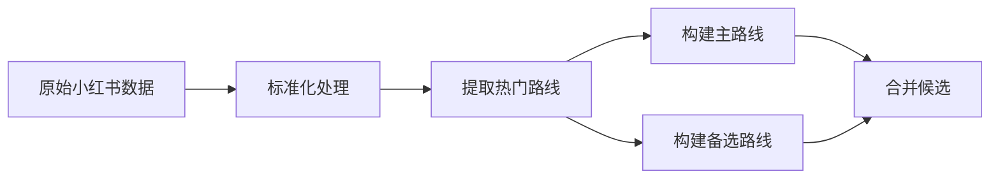

**图表来源**
- [route-plan.mjs:486-537](file://skills/travel-planner/scripts/route-plan.mjs#L486-L537)

#### 搜索引擎证据处理

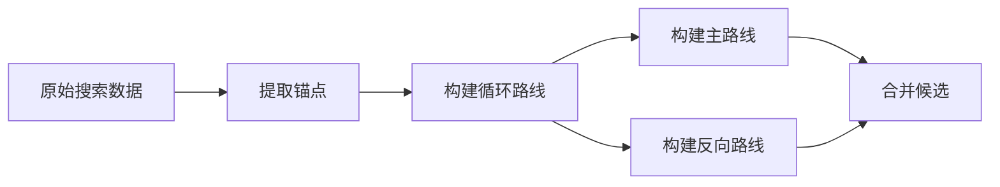

**图表来源**
- [route-plan.mjs:539-611](file://skills/travel-planner/scripts/route-plan.mjs#L539-L611)

**章节来源**
- [route-plan.mjs:702-792](file://skills/travel-planner/scripts/route-plan.mjs#L702-L792)
- [route-plan.mjs:486-611](file://skills/travel-planner/scripts/route-plan.mjs#L486-L611)

## 计划生成模块

计划生成模块负责将已持久化的行程数据转换为结构化的旅行计划骨架。

### 计划生成流程

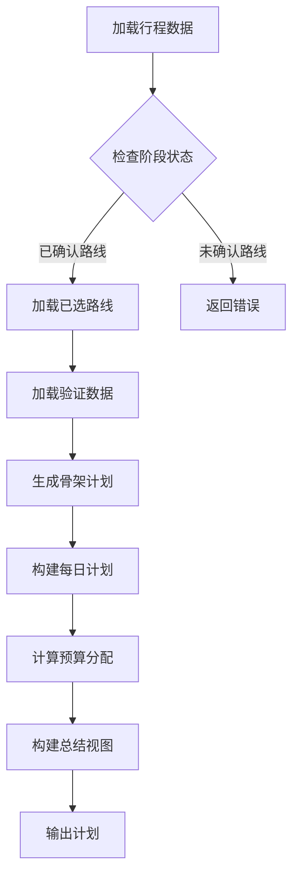

**图表来源**
- [plan-generator.mjs:496-559](file://skills/travel-planner/scripts/plan-generator.mjs#L496-L559)

### 预算分配算法

系统采用动态预算分配算法，根据不同住宿水平调整各项支出的比例：

| 预算级别 | 住宿 | 餐食 | 活动 | 交通 | 杂项 |
|---------|------|------|------|------|------|
| 经济型 | 30-45% | 25-30% | 15-25% | 10-20% | 5-10% |
| 中档 | 35-40% | 25% | 25% | 10% | 5% |
| 豪华 | 45% | 20% | 20% | 10% | 5% |

#### 预算计算逻辑

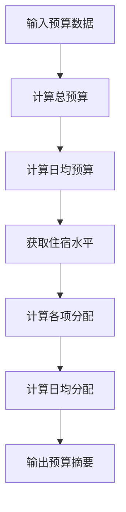

**图表来源**
- [plan-generator.mjs:226-273](file://skills/travel-planner/scripts/plan-generator.mjs#L226-L273)

**章节来源**
- [plan-generator.mjs:124-150](file://skills/travel-planner/scripts/plan-generator.mjs#L124-L150)
- [plan-generator.mjs:226-273](file://skills/travel-planner/scripts/plan-generator.mjs#L226-L273)

## 预订准备模块

预订准备模块整合实时搜索结果，生成可直接用于预订的决策包。

### 预订准备流程

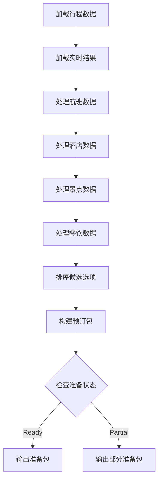

**图表来源**
- [booking-ready.mjs:145-235](file://skills/travel-planner/scripts/booking-ready.mjs#L145-L235)

### 实时数据处理

#### 航班数据处理


#### 酒店数据处理

```mermaid
flowchart LR
RawHotels[原始酒店数据] --> CleanHotels[清洗数据]
CleanHotels --> ExtractHotelInfo[提取酒店信息]
ExtractHotelInfo --> SortByRating[按评分排序]
SortByRating --> Top3[选择前3个]
Top3 --> HotelOption[生成酒店选项]
```

**章节来源**
- [booking-ready.mjs:40-120](file://skills/travel-planner/scripts/booking-ready.mjs#L40-L120)
- [booking-ready.mjs:145-235](file://skills/travel-planner/scripts/booking-ready.mjs#L145-L235)

## 简报模块

简报模块提供行前和每日的详细简报信息，帮助用户做好旅行准备。

### 简报类型

#### 行前简报

```mermaid
classDiagram
class PreTripBrief {
+string type
+string trip_name
+number days_until_departure
+string headline
+array must_handle_next
+string booking_status
+object confirmed_bookings
+object first_day_preview
}
class DailyBrief {
+string type
+string trip_name
+number day
+string date
+string headline
+string theme
+array items
+array time_anchors
+object meal_strategy
+array booking_watchouts
}
class BriefingGenerator {
+buildPreTripBrief(tripData, plan) PreTripBrief
+buildDailyBrief(tripData, plan, dayIndex) DailyBrief
}
PreTripBrief --> BriefingGenerator : generated_by
DailyBrief --> BriefingGenerator : generated_by
```

**图表来源**
- [briefing.mjs:35-68](file://skills/travel-planner/scripts/briefing.mjs#L35-L68)
- [briefing.mjs:70-120](file://skills/travel-planner/scripts/briefing.mjs#L70-L120)

#### 简报内容结构

| 简报类型 | 内容元素 | 用途 |
|----------|----------|------|
| 行前简报 | 出发倒计时、待办任务、预订状态 | 帮助用户准备出行 |
| 每日简报 | 当日主题、主要目标、交通策略 | 指导当日行程 |
| 锚点POI | 重要景点保护、预订信息 | 确保关键体验 |
| 餐饮建议 | 推荐餐厅、预订信息 | 享受当地美食 |

**章节来源**
- [briefing.mjs:35-68](file://skills/travel-planner/scripts/briefing.mjs#L35-L68)
- [briefing.mjs:70-120](file://skills/travel-planner/scripts/briefing.mjs#L70-L120)

## 路线验证模块

路线验证模块基于路线验证数据推导可行性结论，为用户提供决策支持。

### 验证逻辑

```mermaid
flowchart TD
LoadValidation[加载验证数据] --> CheckWeather{检查天气状态}
CheckWeather --> |Block| Block[标记为阻止]
CheckWeather --> |Caution| Caution[标记为谨慎]
CheckWeather --> |Go| CheckTransport{检查交通状态}
CheckTransport --> |Unavailable| Block
CheckTransport --> |OK| Go[标记为可行]
Block --> Output[输出结论]
Caution --> Output
Go --> Output
```

**图表来源**
- [route-validation.mjs:69-125](file://skills/travel-planner/scripts/route-validation.mjs#L69-L125)

### 验证规则

#### 天气验证

| 天气状态 | 风险等级 | 处理建议 |
|----------|----------|----------|
| block | 高风险 | 阻止出行，建议改期 |
| caution | 中等风险 | 谨慎出行，准备备用方案 |
| go | 低风险 | 正常出行，注意安全 |

#### 交通验证

```mermaid
flowchart LR
TransportRequired{是否需要长距离交通} --> |是| CheckAvailability[检查可用性]
TransportRequired --> |否| SkipCheck[跳过验证]
CheckAvailability --> |有选项| OK[标记为OK]
CheckAvailability --> |无选项| Unavailable[标记为不可用]
SkipCheck --> OK
```

**章节来源**
- [route-validation.mjs:15-33](file://skills/travel-planner/scripts/route-validation.mjs#L15-L33)
- [route-validation.mjs:69-125](file://skills/travel-planner/scripts/route-validation.mjs#L69-L125)

## UI增强模块

UI增强模块负责处理POI数据的UI适配，确保路线规划结果能够在各种界面中正确显示。

### 数据适配流程

```mermaid
flowchart TD
RawData[原始POI数据] --> NormalizeFormat[标准化格式]
NormalizeFormat --> ExtractFields[提取必要字段]
ExtractFields --> BuildIndex[构建索引]
BuildIndex --> AttachToRoutes[附加到路线]
AttachToRoutes --> GenerateUI[生成UI数据]
GenerateUI --> Output[输出适配数据]
```

**图表来源**
- [route-ui-enrichment.mjs:158-167](file://skills/travel-planner/scripts/route-ui-enrichment.mjs#L158-L167)

### UI数据结构

#### POI数据标准化

| 字段名 | 来源字段 | 处理方式 | 用途 |
|--------|----------|----------|------|
| name | name/title/poiName | 提取非空字符串 | 显示名称 |
| image | mainPic/picUrl/image | 提取HTTP URL | 图片显示 |
| subtitle | address/summary/desc | 提取非空字符串 | 描述信息 |
| lat | lat/latitude/y | 转换为数字 | 地图定位 |
| lng | lng/longitude/x | 转换为数字 | 地图定位 |

#### 路线UI增强

```mermaid
classDiagram
class RouteOptions {
+array route_options
+number route_options_count
+number matched_poi_count
+object route_stop_media
+object route_stop_points
}
class RouteStopMedia {
+object[string] media_by_stop
+object[string] points_by_stop
}
class StopMedia {
+string image
+string subtitle
+number lat
+number lng
+string label
}
RouteOptions --> RouteStopMedia : contains
RouteStopMedia --> StopMedia : maps_to
```

**图表来源**
- [route-ui-enrichment.mjs:118-156](file://skills/travel-planner/scripts/route-ui-enrichment.mjs#L118-L156)

**章节来源**
- [route-ui-enrichment.mjs:54-92](file://skills/travel-planner/scripts/route-ui-enrichment.mjs#L54-L92)
- [route-ui-enrichment.mjs:118-156](file://skills/travel-planner/scripts/route-ui-enrichment.mjs#L118-L156)

## 配置与部署

### 环境配置

系统支持多种部署方式和配置选项：

#### 环境变量

| 变量名 | 默认值 | 用途 |
|--------|--------|------|
| TRAVEL_PLANNER_DB_DIR | `~/.openclaw/agents/travel-planner` | 数据存储目录 |
| TRAVEL_PLANNER_DATA_DIR | `~/.openclaw/agents/travel-planner/data` | 数据文件目录 |

#### 依赖要求

- **Node.js**: 22+
- **操作系统**: Linux, macOS, Windows
- **存储空间**: 至少1GB可用空间
- **网络访问**: 可访问外部API（小红书、高德地图等）

### 部署方式

#### 本地开发部署

```bash
# 克隆仓库
git clone https://github.com/openclaw/openclaw.git
cd openclaw

# 安装依赖
npm install

# 启动开发服务器
npm run dev
```

#### 生产部署

```bash
# 构建生产版本
npm run build

# 启动服务
npm start
```

## 测试与验证

### 测试策略

系统采用多层次的测试策略，确保代码质量和功能正确性：

#### 单元测试

```mermaid
graph TD
UnitTests[单元测试] --> ModuleTests[模块测试]
UnitTests --> IntegrationTests[集成测试]
UnitTests --> EndToEndTests[端到端测试]
ModuleTests --> PreferencesTest[偏好模块测试]
ModuleTests --> TripTest[行程模块测试]
ModuleTests --> CacheTest[缓存模块测试]
IntegrationTests --> WorkflowTest[工作流集成测试]
IntegrationTests --> PlanTest[计划生成测试]
EndToEndTests --> FullWorkflowTest[完整工作流测试]
EndToEndTests --> RegressionTest[回归测试]
```

**图表来源**
- [travel-planner-skill.test.ts:1-50](file://test/travel-planner-skill.test.ts#L1-L50)

#### 测试覆盖

| 模块 | 测试覆盖率 | 关键测试点 |
|------|------------|------------|
| 偏好管理 | 95% | 数据验证、持久化、迁移 |
| 行程管理 | 90% | 状态流转、数据完整性、并发处理 |
| POI缓存 | 85% | 缓存命中率、TTL管理、批量操作 |
| 工作流 | 88% | 阶段门控、错误处理、回滚机制 |
| 路线规划 | 80% | 多平台证据整合、候选生成、UI适配 |
| 计划生成 | 92% | 预算计算、模板渲染、数据验证 |
| 预订准备 | 85% | 实时数据处理、排序算法、错误恢复 |
| 简报生成 | 90% | 内容生成、格式化、国际化支持 |

**章节来源**
- [travel-planner-skill.test.ts:1-50](file://test/travel-planner-skill.test.ts#L1-L50)

### 性能测试

系统包含性能基准测试，确保在高负载情况下的稳定性：

#### 基准测试指标

| 指标 | 目标值 | 测试方法 |
|------|--------|----------|
| 响应时间 | <2秒 | 基础API调用 |
| 并发处理 | 100+请求/秒 | 压力测试 |
| 内存使用 | <100MB | 内存监控 |
| CPU使用 | <80% | 资源监控 |
| 缓存命中率 | >90% | 缓存测试 |

## 故障排除

### 常见问题

#### 数据存储问题

**症状**: 无法保存或读取偏好设置
**解决方案**:
1. 检查用户主目录权限
2. 验证JSON文件格式正确性
3. 确认磁盘空间充足
4. 检查文件锁定状态

#### 模块依赖问题

**症状**: 模块导入失败或功能异常
**解决方案**:
1. 验证Node.js版本兼容性
2. 检查依赖包安装状态
3. 清理npm缓存
4. 重新安装依赖

#### 性能问题

**症状**: 系统响应缓慢或内存占用过高
**解决方案**:
1. 清理缓存文件
2. 优化数据库查询
3. 实施分页加载
4. 监控资源使用情况

### 调试工具

#### 日志监控

系统提供详细的日志记录和监控功能：

```mermaid
graph TD
LogSystem[日志系统] --> InfoLog[信息日志]
LogSystem --> DebugLog[调试日志]
LogSystem --> ErrorLog[错误日志]
LogSystem --> PerformanceLog[性能日志]
InfoLog --> ConsoleOutput[控制台输出]
DebugLog --> FileOutput[文件输出]
ErrorLog --> AlertSystem[告警系统]
PerformanceLog --> MetricsCollector[指标收集]
```

**图表来源**
- [SKILL.md:695-722](file://skills/travel-planner/SKILL.md#L695-L722)

#### 调试命令

| 命令 | 功能 | 用途 |
|------|------|------|
| `node preferences.mjs --cmd=is_initialized` | 检查偏好初始化状态 | 调试偏好模块 |
| `node trips.mjs --cmd=get_trips --status=current` | 获取当前行程列表 | 调试行程管理 |
| `node poi-cache.mjs --cmd=get --keys='["key1","key2"]'` | 批量查询POI缓存 | 调试缓存系统 |
| `node trip-workflow.mjs --cmd=check_step_gate --trip-id=<id> --step=4` | 检查工作流门控 | 调试工作流模块 |

**章节来源**
- [SKILL.md:695-722](file://skills/travel-planner/SKILL.md#L695-L722)

## 总结

旅行规划技能系统经过完全的模块化重构，形成了一个功能完整、设计精良的现代化智能旅行助手。通过其模块化架构、智能化算法和人性化的交互设计，系统能够为用户提供高质量的旅行规划服务。

### 系统优势

1. **模块化架构**: 完全重构的独立模块设计，易于维护和扩展
2. **智能缓存系统**: POI缓存提升性能和用户体验
3. **多平台证据整合**: 支持小红书、搜索引擎等多种数据源
4. **工作流管理**: 完整的行程生命周期管理
5. **结构化输出**: 标准化的JSON输出格式
6. **CLI支持**: 完整的命令行接口
7. **测试完善**: 全面的测试基础设施
8. **性能优化**: 多层次的性能优化策略

### 技术创新

1. **模块化设计**: 每个模块都有明确的职责和接口
2. **智能缓存**: POI缓存系统提升查询性能
3. **工作流协调**: 严格的阶段门控机制
4. **多平台整合**: 统一的证据处理和路线生成
5. **实时验证**: 集成交通、天气等实时数据
6. **结构化输出**: 标准化的数据格式和协议

### 发展前景

随着人工智能技术的不断进步和用户需求的持续变化，旅行规划技能系统还有很大的发展空间：

1. **AI模型集成**: 集成更多AI模型提升智能化水平
2. **多语言支持**: 扩展支持更多语言和地区
3. **移动端优化**: 增强移动端用户体验
4. **社交功能**: 添加旅行分享和社交功能
5. **个性化推荐**: 基于AI的更精准推荐
6. **实时协作**: 支持多人旅行计划协作

该系统为OpenClaw平台的旅行规划领域奠定了坚实的基础，为未来的功能扩展和技术升级提供了良好的平台支撑。通过模块化的设计和完善的架构，系统具备了良好的可扩展性和可持续发展能力。