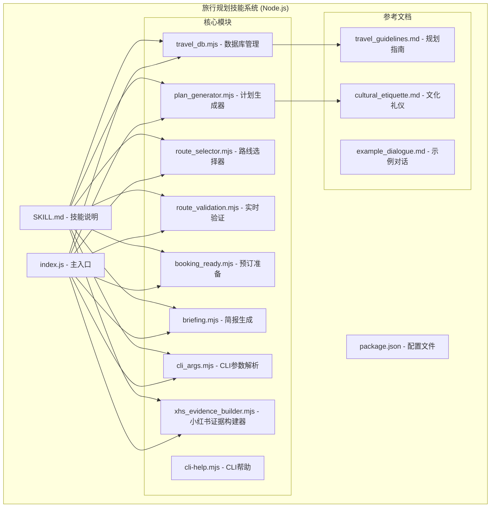
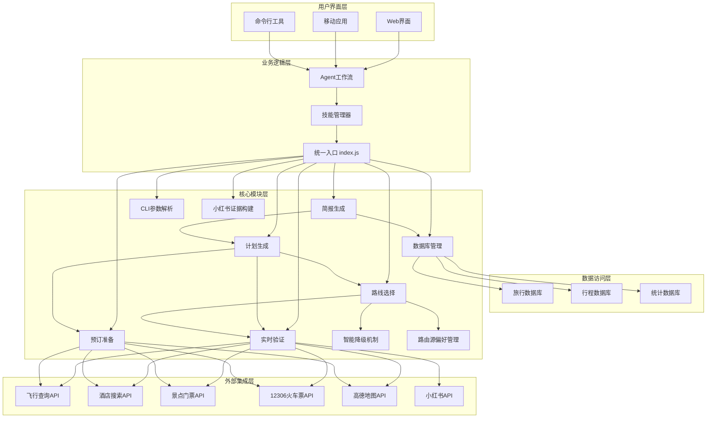
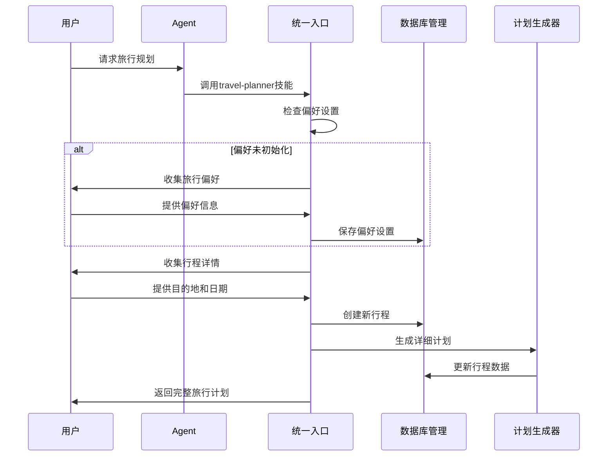
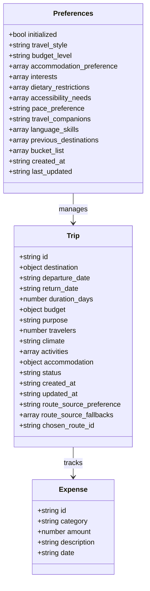
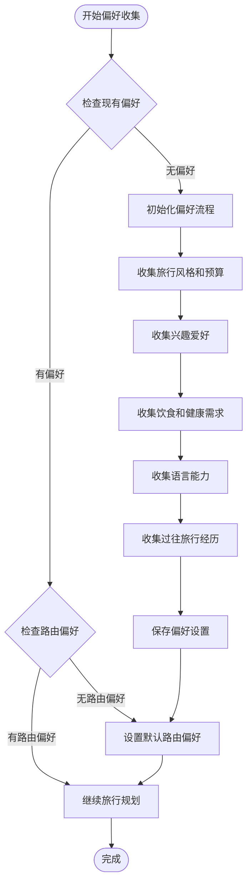
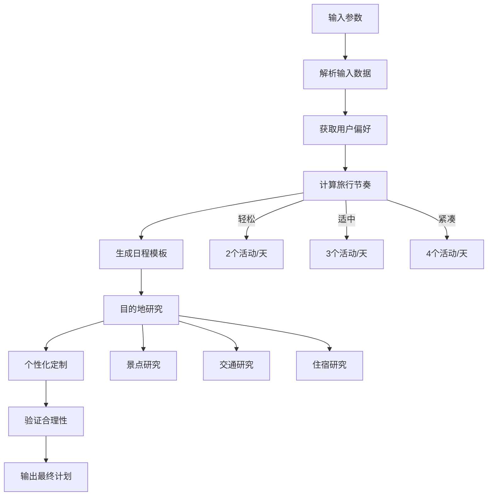
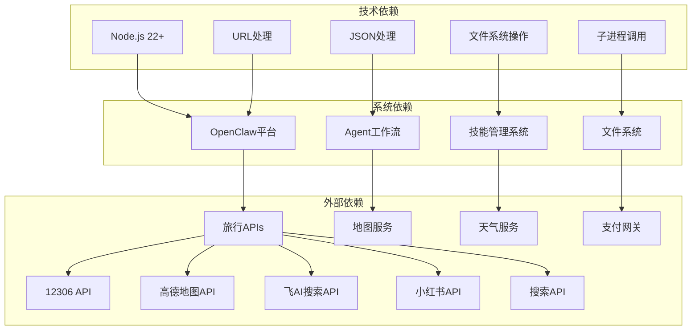

# 旅行规划技能系统

<cite>
**本文档引用的文件**
- [SKILL.md](file://skills/travel-planner/SKILL.md)
- [README.md](file://skills/travel-planner/README.md)
- [index.js](file://skills/travel-planner/index.js)
- [package.json](file://skills/travel-planner/package.json)
- [travel_db.mjs](file://skills/travel-planner/scripts/travel_db.mjs)
- [plan_generator.mjs](file://skills/travel-planner/scripts/plan_generator.mjs)
- [route_selector.mjs](file://skills/travel-planner/scripts/route_selector.mjs)
- [route_validation.mjs](file://skills/travel-planner/scripts/route_validation.mjs)
- [booking_ready.mjs](file://skills/travel-planner/scripts/booking_ready.mjs)
- [briefing.mjs](file://skills/travel-planner/scripts/briefing.mjs)
- [cli_args.mjs](file://skills/travel-planner/scripts/cli_args.mjs)
- [xhs_evidence_builder.mjs](file://skills/travel-planner/scripts/xhs_evidence_builder.mjs)
- [cli-help.mjs](file://skills/travel-planner/scripts/cli-help.mjs)
- [travel_guidelines.md](file://skills/travel-planner/references/travel_guidelines.md)
- [cultural_etiquette.md](file://skills/travel-planner/references/cultural_etiquette.md)
- [example_dialogue.md](file://skills/travel-planner/references/example_dialogue.md)
- [travel-planner-skill.test.ts](file://test/travel-planner-skill.test.ts)
- [workspace.ts](file://src/agents/skills/workspace.ts)
- [skills.store.ts](file://ui-react/src/store/skills.store.ts)
- [skills.ts](file://ui/src/ui/controllers/skills.ts)
</cite>

## 更新摘要
**所做更改**
- 新增路由源偏好系统(set_route_source_preference)功能，支持用户自定义路线来源平台
- 实现智能降级机制，支持小红书→高德地图→搜索引擎的自动切换
- 简化实时验证流程，引入轻验证(auto_validate)模式
- 新增天气风险评估功能，提供更全面的旅行风险预警
- 增强长距离交通判断逻辑，支持更精确的交通需求识别
- 新增小红书证据构建器，支持从搜索结果提取路线线索
- 完善测试覆盖，新增路由源偏好和智能降级相关测试

## 目录
1. [简介](#简介)
2. [项目结构](#项目结构)
3. [核心组件](#核心组件)
4. [架构概览](#架构概览)
5. [详细组件分析](#详细组件分析)
6. [依赖关系分析](#依赖关系分析)
7. [性能考虑](#性能考虑)
8. [故障排除指南](#故障排除指南)
9. [结论](#结论)

## 简介

旅行规划技能系统是一个基于OpenClaw平台构建的综合性旅行助手，现已完全重写为JavaScript/Node.js架构。该系统通过智能偏好管理、详细的行程生成、预算跟踪和文化指导等功能，帮助用户创建完美的旅行体验。

系统的核心特色包括：
- 智能旅行偏好管理，支持个性化推荐
- 全面的行程规划，包含每日详细安排
- 实时预算跟踪和费用管理
- 文化礼仪和安全指导
- 多语言支持和本地化建议
- 模块化设计，支持独立CLI使用
- 自动化验证和预订准备功能
- **新增** 路由源偏好系统，支持用户自定义路线来源平台
- **新增** 智能降级机制，实现多平台自动切换
- **新增** 轻验证模式，简化实时验证流程
- **新增** 天气风险评估，提供更全面的风险预警
- **新增** 小红书证据构建器，支持从搜索结果提取路线线索

## 项目结构

旅行规划技能系统采用现代化的Node.js模块化设计，主要由以下核心部分组成：



**图表来源**
- [SKILL.md:1-589](file://skills/travel-planner/SKILL.md#L1-L589)
- [index.js:1-374](file://skills/travel-planner/index.js#L1-L374)
- [travel_db.mjs:1-628](file://skills/travel-planner/scripts/travel_db.mjs#L1-L628)
- [plan_generator.mjs:1-710](file://skills/travel-planner/scripts/plan_generator.mjs#L1-L710)

**章节来源**
- [SKILL.md:1-50](file://skills/travel-planner/SKILL.md#L1-L50)
- [README.md:1-71](file://skills/travel-planner/README.md#L1-L71)
- [package.json:1-13](file://skills/travel-planner/package.json#L1-L13)

## 核心组件

### 数据库管理系统

旅行规划技能系统的核心是其现代化的数据库管理系统，负责存储用户的旅行偏好、行程信息和预算数据。

#### 偏好管理功能
- 用户旅行风格识别（预算型、中档、豪华）
- 兴趣爱好分类（观光、美食、冒险、文化等）
- 健康和饮食限制管理
- 语言能力和旅行经验评估

#### 行程管理功能
- 当前行程跟踪
- 过往行程存档
- 行程想法和灵感收集
- 实时预算更新和统计

**章节来源**
- [travel_db.mjs:82-119](file://skills/travel-planner/scripts/travel_db.mjs#L82-L119)
- [travel_db.mjs:167-190](file://skills/travel-planner/scripts/travel_db.mjs#L167-L190)

### 计划生成器

计划生成器是系统的核心算法引擎，负责根据用户偏好和目的地信息生成详细的旅行计划。

#### 核心功能模块
- **每日行程模板**：根据旅行节奏（轻松、适中、紧凑）生成活动安排
- **预算分解算法**：基于住宿水平自动分配各项支出比例
- **打包清单生成**：根据气候和活动类型定制个人物品清单
- **行前准备时间线**：提供分阶段的准备工作清单

**章节来源**
- [plan_generator.mjs:50-74](file://skills/travel-planner/scripts/plan_generator.mjs#L50-L74)
- [plan_generator.mjs:76-106](file://skills/travel-planner/scripts/plan_generator.mjs#L76-L106)
- [plan_generator.mjs:108-186](file://skills/travel-planner/scripts/plan_generator.mjs#L108-L186)

### 路线选择器

路线选择器是系统的核心路由算法，专门针对复杂目的地（如新疆、云南等）提供智能路线推荐。

#### 核心功能
- **目的地特定路由**：针对新疆等复杂目的地提供多条路线候选
- **评分系统**：基于预算、时间、兴趣等因素对路线进行综合评分
- **风险评估**：考虑季节、交通、体力等因素的风险评估
- **替代方案**：提供备选路线和拒绝理由
- **智能降级机制**：支持小红书→高德地图→搜索引擎的自动切换
- **路由源偏好**：支持用户自定义路线来源平台

**章节来源**
- [route_selector.mjs:58-255](file://skills/travel-planner/scripts/route_selector.mjs#L58-L255)
- [route_selector.mjs:297-316](file://skills/travel-planner/scripts/route_selector.mjs#L297-L316)

### 实时验证系统

实时验证系统负责在生成最终计划前进行各种验证检查。

#### 核心验证类型
- **航班验证**：验证出发/到达枢纽的选择是否最优
- **酒店验证**：验证酒店区域和价格是否符合预算
- **景点验证**：验证锚点景点的可用性和价值
- **交通验证**：验证境内交通的可行性（针对中国境内）
- **天气风险评估**：提供旅行窗口内的天气风险预警
- **轻验证模式**：简化验证流程，支持快速确认

**章节来源**
- [route_validation.mjs:38-124](file://skills/travel-planner/scripts/route_validation.mjs#L38-L124)
- [route_validation.mjs:126-178](file://skills/travel-planner/scripts/route_validation.mjs#L126-L178)
- [route_validation.mjs:248-301](file://skills/travel-planner/scripts/route_validation.mjs#L248-L301)

### 预订准备系统

预订准备系统将实时验证的结果整合为可直接用于预订的决策包。

#### 核心功能
- **选项排序**：根据价格、评分等维度对选项进行排序
- **决策建议**：提供明确的预订建议和注意事项
- **预算压力测试**：验证所选选项是否符合总预算
- **风险提示**：指出可能存在的预订风险

**章节来源**
- [booking_ready.mjs:94-166](file://skills/travel-planner/scripts/booking_ready.mjs#L94-L166)
- [booking_ready.mjs:168-203](file://skills/travel-planner/scripts/booking_ready.mjs#L168-L203)

### 简报生成系统

简报生成系统负责为旅行前和旅行期间提供结构化的简报信息。

#### 核心功能
- **行前简报**：提供出发前的最后检查清单和注意事项
- **每日简报**：为每一天提供详细的活动建议和注意事项
- **动态更新**：根据预订状态和实际情况动态更新简报内容

**章节来源**
- [briefing.mjs:41-76](file://skills/travel-planner/scripts/briefing.mjs#L41-L76)
- [briefing.mjs:78-129](file://skills/travel-planner/scripts/briefing.mjs#L78-L129)

### 小红书证据构建器

小红书证据构建器是专门处理小红书搜索结果的模块，用于从图文笔记中提取路线线索。

#### 核心功能
- **搜索查询构建**：根据目的地和天数生成搜索关键词
- **结果过滤**：过滤视频笔记，保留高质量图文内容
- **路线线索提取**：从笔记描述中提取热门路线和停留点
- **证据质量评估**：根据点赞数和内容质量评估证据可靠性

**章节来源**
- [xhs_evidence_builder.mjs:55-64](file://skills/travel-planner/scripts/xhs_evidence_builder.mjs#L55-L64)
- [xhs_evidence_builder.mjs:66-122](file://skills/travel-planner/scripts/xhs_evidence_builder.mjs#L66-L122)

## 架构概览

旅行规划技能系统采用现代化的Node.js模块化架构设计，确保各组件之间的清晰分离和高效协作。



**图表来源**
- [workspace.ts:292-527](file://src/agents/skills/workspace.ts#L292-L527)
- [index.js:144-245](file://skills/travel-planner/index.js#L144-L245)

系统的工作流程遵循严格的技能调用模式：



**图表来源**
- [SKILL.md:50-185](file://skills/travel-planner/SKILL.md#L50-L185)
- [travel_db.mjs:227-240](file://skills/travel-planner/scripts/travel_db.mjs#L227-L240)

## 详细组件分析

### 偏好管理系统

偏好管理系统是整个旅行规划系统的基础，它通过深度学习用户的旅行习惯来提供个性化的建议。

#### 数据结构设计



**图表来源**
- [travel_db.mjs:86-107](file://skills/travel-planner/scripts/travel_db.mjs#L86-L107)
- [travel_db.mjs:227-240](file://skills/travel-planner/scripts/travel_db.mjs#L227-L240)
- [travel_db.mjs:349-367](file://skills/travel-planner/scripts/travel_db.mjs#L349-L367)

#### 偏好收集流程

系统采用渐进式偏好收集策略，确保在不增加用户负担的情况下获取必要的信息：



**图表来源**
- [SKILL.md:60-95](file://skills/travel-planner/SKILL.md#L60-L95)
- [travel_db.mjs:177-183](file://skills/travel-planner/scripts/travel_db.mjs#L177-L183)

**章节来源**
- [travel_db.mjs:167-190](file://skills/travel-planner/scripts/travel_db.mjs#L167-L190)
- [SKILL.md:60-95](file://skills/travel-planner/SKILL.md#L60-L95)

### 行程生成算法

行程生成算法是系统的核心智能组件，它能够根据用户偏好和目的地特点生成个性化的旅行计划。

#### 日程规划算法



**图表来源**
- [plan_generator.mjs:50-74](file://skills/travel-planner/scripts/plan_generator.mjs#L50-L74)
- [plan_generator.mjs:108-186](file://skills/travel-planner/scripts/plan_generator.mjs#L108-L186)

#### 预算分配策略

系统采用动态预算分配算法，根据不同住宿水平调整各项支出的比例：

| 预算级别 | 住宿 | 餐食 | 活动 | 交通 | 杂项 |
|---------|------|------|------|------|------|
| 预算型 | 30-45% | 25-30% | 15-25% | 10-20% | 5-10% |
| 中档 | 35-40% | 25% | 25% | 10% | 5% |
| 豪华 | 45% | 20% | 20% | 10% | 5% |

**章节来源**
- [plan_generator.mjs:242-289](file://skills/travel-planner/scripts/plan_generator.mjs#L242-L289)
- [travel_guidelines.md:45-90](file://skills/travel-planner/references/travel_guidelines.md#L45-L90)

### Agent行为准则

Travel Planner Agent的行为准则确保了系统在与用户交互时保持一致性和专业性。

#### 核心哲学理念

```mermaid
mindmap
root((旅行规划Agent))
人性化设计
记住旅行者的感受
平衡结构与即兴
尊重不同预算
文化敏感性
介绍文化而非只是拍照
尊重当地习俗
提供准确信息
适应性沟通
根据用户类型调整细节
理解用户需求
提供适当帮助
边界管理
不做假设
保持专业范围
优先安全
```

#### 交互模式

Agent采用"技能优先"的交互模式，确保在旅行规划场景中始终遵循最佳实践：

1. **首次调用规则**：任何旅行规划请求都必须先读取travel-planner技能
2. **个性化调整**：根据用户类型和需求调整详细程度
3. **实时支持**：在旅行过程中提供灵活的调整和替代方案
4. **持续改进**：记住用户偏好，从反馈中学习

**章节来源**
- [SKILL.md:39-47](file://skills/travel-planner/SKILL.md#L39-L47)

### 路由源偏好系统

路由源偏好系统是新增的重要功能，允许用户自定义路线来源平台。

#### 核心功能
- **平台选择**：支持小红书(xhs)、高德地图(amap)、搜索引擎(web)、自动(auto)四种模式
- **智能降级**：当首选平台失败时自动切换到备选平台
- **偏好持久化**：将用户选择的偏好保存到数据库中
- **降级链管理**：记录降级历史和原因

**章节来源**
- [index.js:156-163](file://skills/travel-planner/index.js#L156-L163)
- [route_selector.mjs:196-236](file://skills/travel-planner/scripts/route_selector.mjs#L196-L236)

### 轻验证模式

轻验证模式是简化实时验证流程的重要功能。

#### 核心特性
- **计划优先**：默认不执行外部API调用，仅进行本地验证
- **用户确认**：在验证完成后要求用户确认才能进入下一步
- **灵活执行**：支持后续手动执行完整的验证流程
- **风险提示**：提供明确的风险评估和建议

**章节来源**
- [index.js:220-250](file://skills/travel-planner/index.js#L220-L250)
- [route_validation.mjs:259-334](file://skills/travel-planner/scripts/route_validation.mjs#L259-L334)

### 天气风险评估

天气风险评估功能提供更全面的旅行风险预警。

#### 核心功能
- **风险窗口检查**：在旅行窗口内检查天气风险
- **连续风险评估**：检测连续多日的恶劣天气
- **极端天气预警**：对极端高温/低温进行特别标记
- **活动强度匹配**：根据旅行节奏评估天气影响

**章节来源**
- [route_validation.mjs:169-202](file://skills/travel-planner/scripts/route_validation.mjs#L169-L202)

## 依赖关系分析

旅行规划技能系统涉及多个层面的依赖关系，从技术架构到业务逻辑都有明确的层次划分。



**图表来源**
- [SKILL.md:7-10](file://skills/travel-planner/SKILL.md#L7-L10)
- [workspace.ts:292-527](file://src/agents/skills/workspace.ts#L292-L527)

### 技术栈分析

系统采用现代化的Node.js技术栈，结合了ES6模块化、异步编程和强大的生态系统。

#### Node.js后端组件
- **模块化架构**：使用ES6模块系统组织代码
- **异步处理**：使用Promise和async/await处理异步操作
- **文件操作**：使用Node.js内置文件系统模块
- **子进程调用**：调用外部工具如flyai和12306

#### JavaScript前端组件
- **用户界面**：响应式的Web界面
- **状态管理**：Zustand状态管理库
- **API通信**：与后端服务的异步通信

**章节来源**
- [index.js:1-374](file://skills/travel-planner/index.js#L1-L374)
- [skills.store.ts:1-311](file://ui-react/src/store/skills.store.ts#L1-L311)

## 性能考虑

旅行规划技能系统在设计时充分考虑了性能优化，确保在处理大量数据和复杂计算时仍能保持良好的响应速度。

### 数据存储优化

系统采用轻量级的JSON文件存储方案，具有以下优势：
- **快速读写**：JSON格式简单，解析速度快
- **跨平台兼容**：无需额外的数据库服务器
- **易于备份**：纯文本文件便于版本控制和备份
- **内存效率**：按需加载，避免不必要的内存占用

### 算法性能优化

#### 预算计算优化
- 使用缓存机制避免重复计算
- 采用增量更新策略减少数据库写入
- 实现批量操作提高效率

#### 行程生成优化
- 预定义模板减少实时计算
- 智能索引提高查询速度
- 分页加载避免内存溢出

### 缓存策略

系统实现了多层次的缓存机制：
1. **内存缓存**：最近使用的数据驻留在内存中
2. **文件缓存**：频繁访问的数据存储在本地文件
3. **网络缓存**：外部API响应结果进行缓存

## 故障排除指南

### 常见问题及解决方案

#### 数据库连接问题
**症状**：无法保存或读取用户偏好
**解决方案**：
1. 检查用户主目录权限
2. 验证JSON文件格式正确性
3. 确认磁盘空间充足

#### 技能加载失败
**症状**：旅行规划技能无法正常工作
**解决方案**：
1. 检查Node.js环境配置
2. 验证依赖库安装情况
3. 确认文件路径正确性

#### 性能问题
**症状**：系统响应缓慢或内存占用过高
**解决方案**：
1. 清理缓存文件
2. 优化数据库查询
3. 实施分页加载

### 调试工具

系统提供了多种调试工具帮助开发者诊断问题：

#### 命令行工具
- `is_initialized`：检查偏好设置状态
- `get_preferences`：查看当前偏好设置
- `get_trips`：显示所有行程信息
- `stats`：显示旅行统计数据

#### 日志监控
- 详细的错误日志记录
- 性能指标监控
- 用户行为追踪

**章节来源**
- [travel_db.mjs:449-467](file://skills/travel-planner/scripts/travel_db.mjs#L449-L467)
- [skills.ts:39-157](file://ui/src/ui/controllers/skills.ts#L39-L157)

## 结论

旅行规划技能系统是一个功能完整、设计精良的现代化智能旅行助手。通过其模块化架构、智能化算法和人性化的交互设计，系统能够为用户提供高质量的旅行规划服务。

### 系统优势

1. **现代化架构**：基于Node.js的模块化设计，易于维护和扩展
2. **智能算法**：针对复杂目的地提供智能路线推荐
3. **自动化流程**：从路线框定到预订准备的完整自动化
4. **实时验证**：集成多种外部API进行实时验证
5. **结构化输出**：提供标准化的JSON输出格式
6. **CLI支持**：支持独立命令行使用
7. **测试完善**：包含完整的测试基础设施
8. **路由源偏好**：支持用户自定义路线来源平台
9. **智能降级**：实现多平台自动切换
10. **轻验证模式**：简化验证流程
11. **天气风险评估**：提供更全面的风险预警
12. **小红书证据构建**：支持从搜索结果提取路线线索

### 发展前景

随着人工智能技术的不断进步和用户需求的持续变化，旅行规划技能系统还有很大的发展空间：
- 集成更多AI模型提升智能化水平
- 扩展支持更多目的地和文化背景
- 增强实时数据集成能力
- 优化移动端用户体验
- 增加更多个性化推荐功能
- **新增** 更丰富的路由源支持
- **新增** 更智能的降级策略
- **新增** 更精准的风险评估模型

该系统为OpenClaw平台的旅行规划领域奠定了坚实的基础，为未来的功能扩展和技术升级提供了良好的平台支撑。
