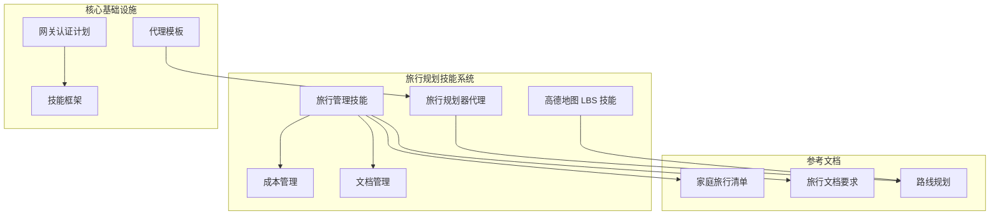
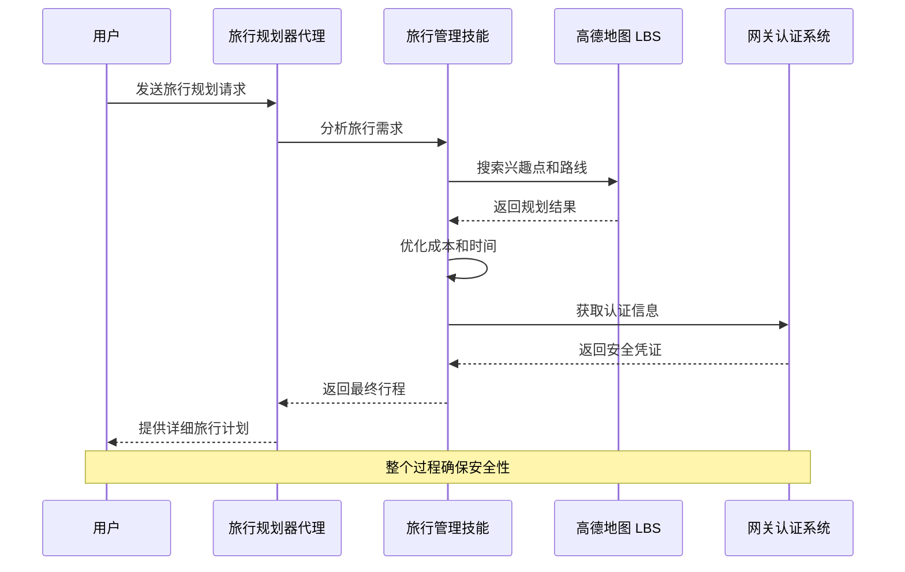
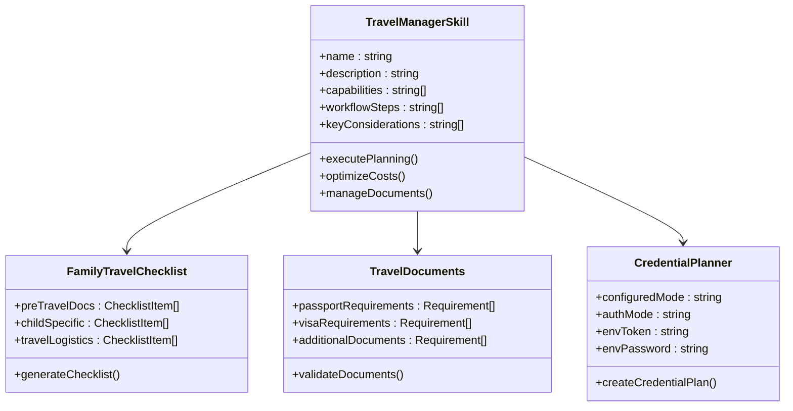
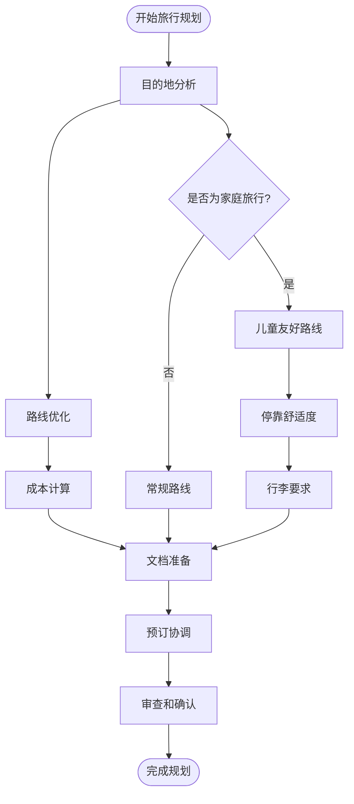
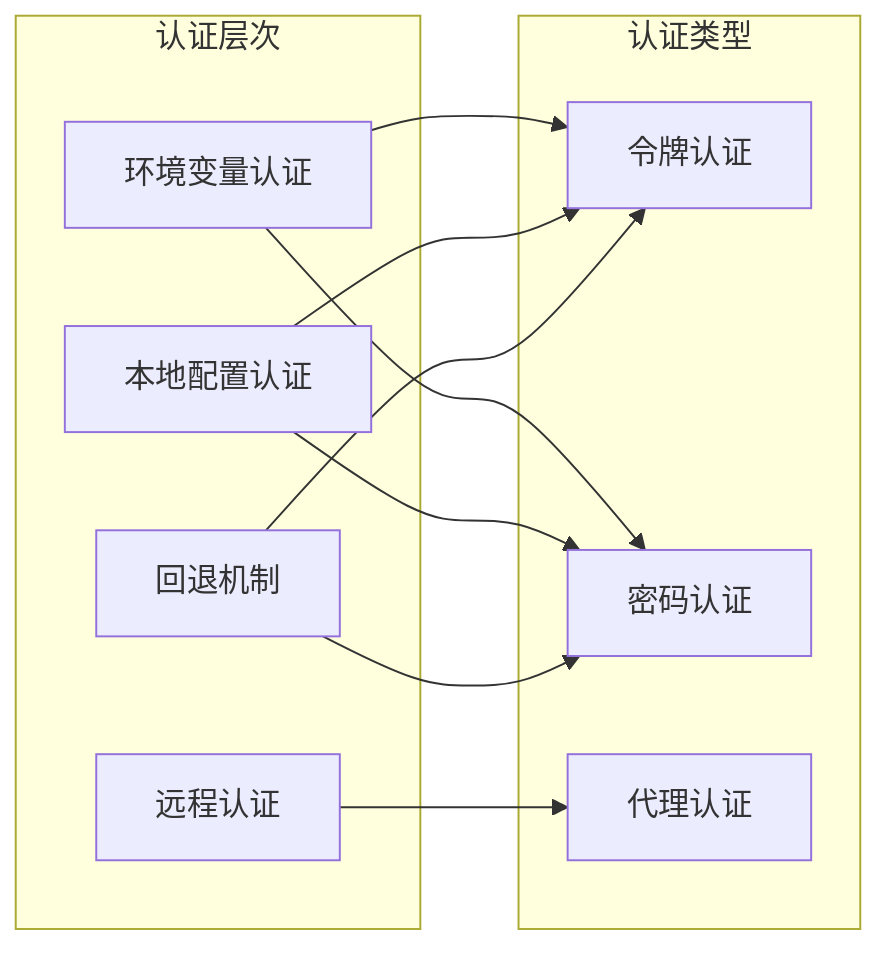
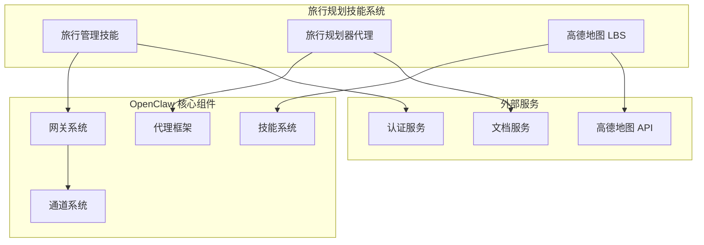

# 旅行规划技能系统

<cite>
**本文档引用的文件**
- [README.md](file://README.md)
- [SKILL.md](file://skills/travel-manager/SKILL.md)
- [_meta.json](file://skills/travel-manager/_meta.json)
- [family-travel-checklist.md](file://skills/travel-manager/references/family-travel-checklist.md)
- [travel-documents.md](file://skills/travel-manager/references/travel-documents.md)
- [SOUL.md](file://docs/reference/templates/agents/travel-planner/SOUL.md)
- [credential-planner.ts](file://src/gateway/credential-planner.ts)
- [index.js](file://skills/amap-lbs-skill/index.js)
</cite>

## 目录
1. [简介](#简介)
2. [项目结构](#项目结构)
3. [核心组件](#核心组件)
4. [架构概览](#架构概览)
5. [详细组件分析](#详细组件分析)
6. [依赖关系分析](#依赖关系分析)
7. [性能考虑](#性能考虑)
8. [故障排除指南](#故障排除指南)
9. [结论](#结论)

## 简介

旅行规划技能系统是 OpenClaw 个人 AI 助手平台中的一个综合性旅行规划解决方案。该系统旨在为用户提供国际旅行规划、多目的地行程管理和家庭旅行物流协调等全方位服务。

OpenClaw 是一个可在用户自己的设备上运行的个人 AI 助手，支持多种消息渠道（WhatsApp、Telegram、Slack、Discord 等），并提供本地化、快速且始终在线的体验。旅行规划技能系统作为其核心功能之一，专注于解决复杂的旅行规划需求。

## 项目结构

旅行规划技能系统主要由以下几个核心部分组成：

**图表来源**
- [SKILL.md:1-36](file://skills/travel-manager/SKILL.md#L1-L36)
- [SOUL.md:1-89](file://docs/reference/templates/agents/travel-planner/SOUL.md#L1-L89)

**章节来源**
- [README.md:21-560](file://README.md#L21-L560)

## 核心组件

### 旅行管理技能 (Travel Manager Skill)

旅行管理技能是整个系统的核心组件，提供了全面的旅行规划、预订和管理功能。其主要能力包括：

- **国际旅行规划**：支持跨国旅行的完整规划流程
- **多目的地行程创建**：处理复杂的多城市旅行安排
- **家庭旅行物流**：专门针对家庭旅行的特殊需求
- **成本优化**：智能计算和优化旅行成本
- **旅行文档管理**：自动化处理各种旅行必需文件

### 旅行规划器代理 (Travel Planner Agent)

旅行规划器代理基于精心设计的"灵魂"文档，确保代理的行为符合人类旅行者的需求和期望。其核心哲学包括：

- **人性化规划**：记住在陌生城市感到不知所措的感受
- **细节与灵活性平衡**：在结构化和即兴之间找到平衡
- **预算意识**：理解和尊重不同的旅行预算水平
- **文化敏感性**：教授尊重而非仅仅是拍照

### 高德地图 LBS 技能

该技能集成了高德地图的地理信息系统功能，提供：

- **兴趣点搜索**：自动搜索指定城市的各类兴趣点
- **路线规划**：根据用户需求规划最优路线
- **多模式导航**：支持步行、驾车、骑行等多种出行方式
- **实时交通信息**：集成实时交通状况分析

**章节来源**
- [SKILL.md:8-36](file://skills/travel-manager/SKILL.md#L8-L36)
- [SOUL.md:12-89](file://docs/reference/templates/agents/travel-planner/SOUL.md#L12-L89)

## 架构概览

旅行规划技能系统采用模块化架构设计，各个组件协同工作以提供完整的旅行规划服务：

**图表来源**
- [credential-planner.ts:137-216](file://src/gateway/credential-planner.ts#L137-L216)
- [index.js:286-321](file://skills/amap-lbs-skill/index.js#L286-L321)

## 详细组件分析

### 旅行管理技能架构

**图表来源**
- [SKILL.md:1-36](file://skills/travel-manager/SKILL.md#L1-L36)
- [family-travel-checklist.md:1-19](file://skills/travel-manager/references/family-travel-checklist.md#L1-L19)
- [travel-documents.md:1-15](file://skills/travel-manager/references/travel-documents.md#L1-L15)
- [credential-planner.ts:19-41](file://src/gateway/credential-planner.ts#L19-L41)

### 旅行规划工作流程

**图表来源**
- [SKILL.md:15-26](file://skills/travel-manager/SKILL.md#L15-L26)

### 安全认证机制

旅行规划技能系统采用多层次的安全认证机制：

**图表来源**
- [credential-planner.ts:45-117](file://src/gateway/credential-planner.ts#L45-L117)

**章节来源**
- [SKILL.md:1-36](file://skills/travel-manager/SKILL.md#L1-L36)
- [family-travel-checklist.md:1-19](file://skills/travel-manager/references/family-travel-checklist.md#L1-L19)
- [travel-documents.md:1-15](file://skills/travel-manager/references/travel-documents.md#L1-L15)
- [credential-planner.ts:137-216](file://src/gateway/credential-planner.ts#L137-L216)

## 依赖关系分析

旅行规划技能系统与其他 OpenClaw 组件存在紧密的依赖关系：

**图表来源**
- [README.md:144-176](file://README.md#L144-L176)
- [index.js:278-321](file://skills/amap-lbs-skill/index.js#L278-L321)

**章节来源**
- [README.md:144-176](file://README.md#L144-L176)

## 性能考虑

旅行规划技能系统在设计时充分考虑了性能优化：

### 认证性能优化
- **延迟最小化**：通过环境变量优先级减少认证查找时间
- **缓存策略**：合理使用认证信息缓存避免重复验证
- **回退机制**：智能选择最有效的认证路径

### 规划算法优化
- **多目标优化**：同时考虑时间、成本和舒适度
- **启发式搜索**：使用智能算法减少计算复杂度
- **增量更新**：支持部分重新计算而非完全重算

### 资源管理
- **内存优化**：合理管理兴趣点和路线数据
- **网络优化**：批量请求和连接复用
- **并发处理**：支持多用户同时规划

## 故障排除指南

### 常见问题及解决方案

**认证失败**
- 检查环境变量设置是否正确
- 验证本地配置文件格式
- 确认远程认证服务可用性

**规划结果不准确**
- 检查高德地图 API 密钥配置
- 验证输入参数的有效性
- 确认网络连接状态

**性能问题**
- 检查系统资源使用情况
- 优化数据库查询
- 实施适当的缓存策略

**章节来源**
- [credential-planner.ts:68-81](file://src/gateway/credential-planner.ts#L68-L81)

## 结论

旅行规划技能系统代表了 OpenClaw 平台在人工智能旅行服务领域的创新成果。通过整合先进的规划算法、丰富的参考文档和严格的安全认证机制，该系统为用户提供了专业级的旅行规划体验。

系统的主要优势包括：

1. **全面的功能覆盖**：从基础的路线规划到复杂的家庭旅行管理
2. **人性化的设计理念**：基于真实的旅行体验和需求
3. **强大的技术架构**：模块化设计确保了系统的可扩展性和维护性
4. **严格的安全保障**：多层次的认证机制保护用户隐私和数据安全

未来的发展方向可能包括：
- 集成更多第三方旅行服务提供商
- 增强人工智能个性化推荐能力
- 扩展多语言支持范围
- 优化移动端用户体验

通过持续的技术创新和服务优化，旅行规划技能系统将继续为用户创造价值，成为个人旅行规划的理想助手。