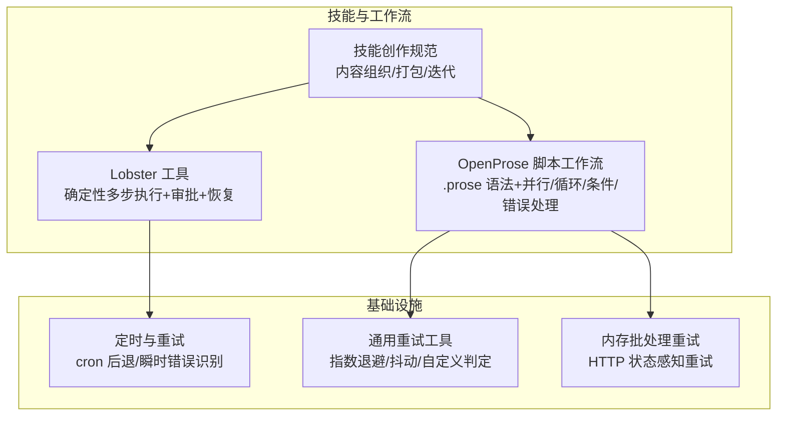
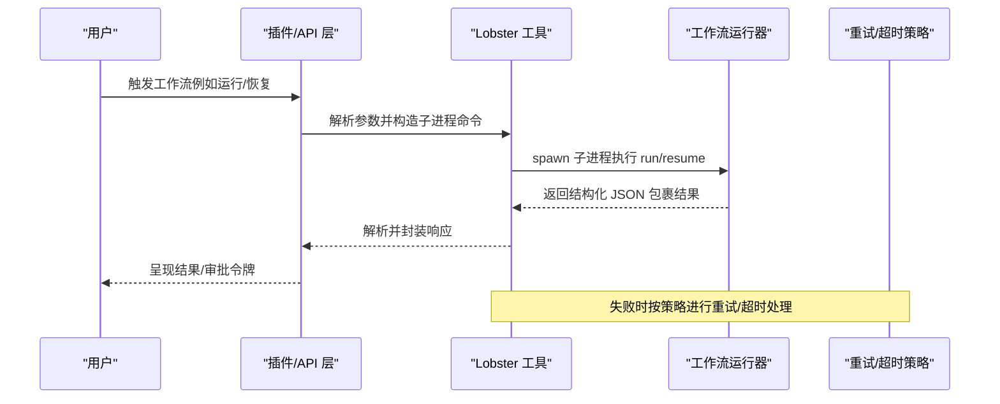
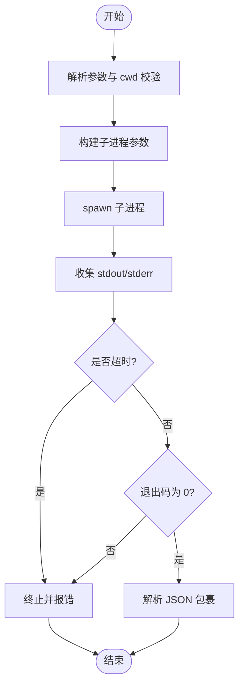
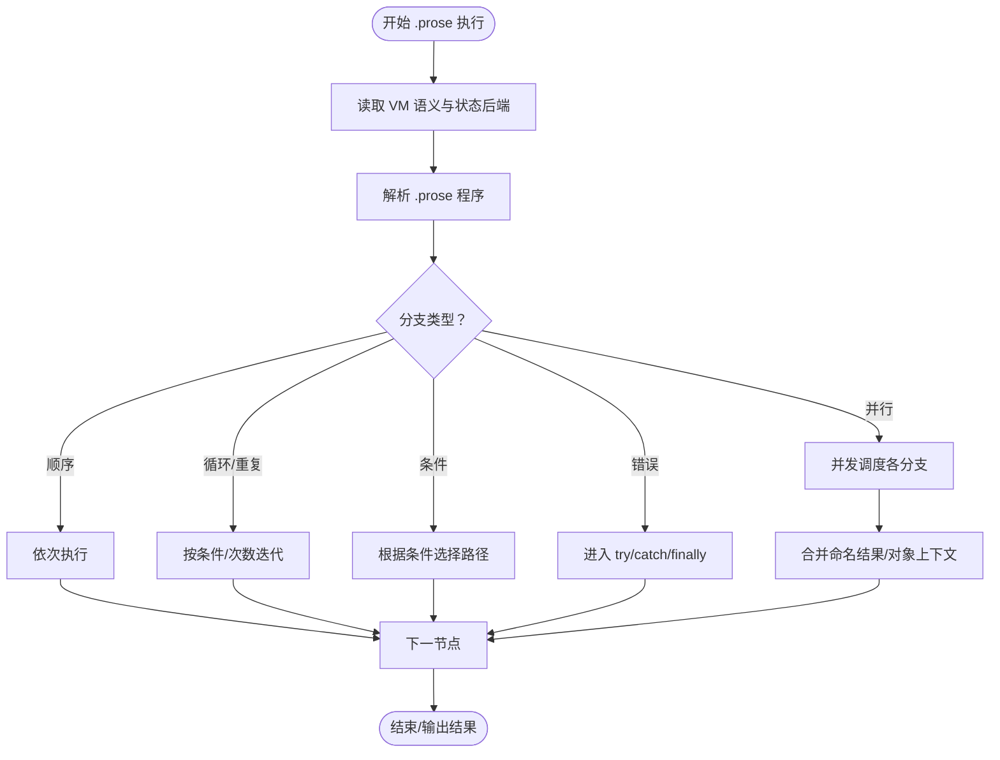
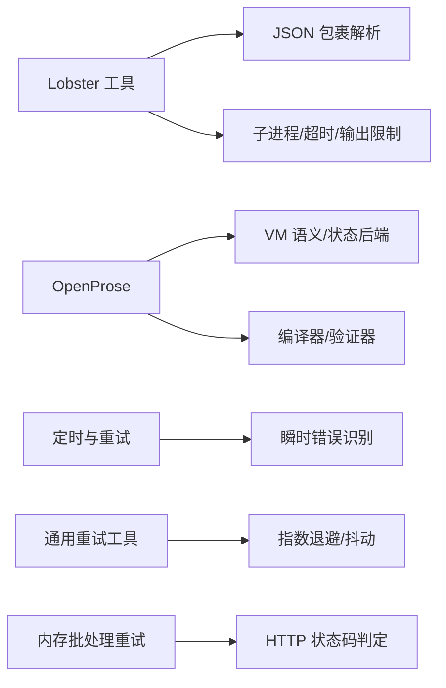

# 工作流技能

<cite>
**本文引用的文件**   
- [lobster-tool.ts](file://extensions/lobster/src/lobster-tool.ts)
- [SKILL.md（Lobster）](file://extensions/lobster/SKILL.md)
- [SKILL.md（Skill Creator）](file://skills/skill-creator/SKILL.md)
- [SKILL.md（OpenProse）](file://extensions/open-prose/skills/prose/SKILL.md)
- [compiler.md（OpenProse）](file://extensions/open-prose/skills/prose/compiler.md)
- [16-parallel-reviews.prose](file://extensions/open-prose/skills/prose/examples/16-parallel-reviews.prose)
- [21-pipeline-operations.prose](file://extensions/open-prose/skills/prose/examples/21-pipeline-operations.prose)
- [22-error-handling.prose](file://extensions/open-prose/skills/prose/examples/22-error-handling.prose)
- [timer.ts](file://src/cron/service/timer.ts)
- [retry.test.ts](file://src/infra/retry.test.ts)
- [batch-http.test.ts](file://src/memory/batch-http.test.ts)
- [lobster.md（工具文档）](file://docs/tools/lobster.md)
</cite>

## 目录

1. [引言](#引言)
2. [项目结构](#项目结构)
3. [核心组件](#核心组件)
4. [架构总览](#架构总览)
5. [详细组件分析](#详细组件分析)
6. [依赖关系分析](#依赖关系分析)
7. [性能考量](#性能考量)
8. [故障排查指南](#故障排查指南)
9. [结论](#结论)
10. [附录](#附录)

## 引言

本文件系统化阐述“工作流技能”的设计理念与实现机制，覆盖多步骤任务编排、条件分支与并行执行策略、变量传递与状态管理、配置语法与运行时行为，并通过可复用的示例（数据处理流水线、自动化报告生成、跨平台同步任务）展示落地路径。同时给出错误处理、重试机制与监控告警的实现建议，以及性能优化、资源管理与成本控制的最佳实践。

## 项目结构

工作流技能在本仓库中主要由三类能力构成：

- 本地工作流运行器：Lobster 工作流运行工具，提供确定性、可审批、可恢复的多步工具序列执行。
- 脚本式工作流语言：OpenProse（.prose 文件），支持会话（session）作为原子任务单元，提供并行、循环、条件、错误处理、命名块与参数化组合等能力。
- 技能体系与创作规范：Skill Creator 提供技能设计原则、内容组织与打包流程，确保工作流技能具备可维护性与可复用性。

图示来源

- [lobster-tool.ts:210-267](file://extensions/lobster/src/lobster-tool.ts#L210-L267)
- [SKILL.md（Lobster）:1-98](file://extensions/lobster/SKILL.md#L1-L98)
- [SKILL.md（OpenProse）:1-324](file://extensions/open-prose/skills/prose/SKILL.md#L1-L324)
- [timer.ts:122-149](file://src/cron/service/timer.ts#L122-L149)
- [retry.test.ts:1-42](file://src/infra/retry.test.ts#L1-L42)
- [batch-http.test.ts:45-78](file://src/memory/batch-http.test.ts#L45-L78)

章节来源

- [lobster-tool.ts:210-267](file://extensions/lobster/src/lobster-tool.ts#L210-L267)
- [SKILL.md（Lobster）:1-98](file://extensions/lobster/SKILL.md#L1-L98)
- [SKILL.md（OpenProse）:1-324](file://extensions/open-prose/skills/prose/SKILL.md#L1-L324)
- [timer.ts:122-149](file://src/cron/service/timer.ts#L122-L149)
- [retry.test.ts:1-42](file://src/infra/retry.test.ts#L1-L42)
- [batch-http.test.ts:45-78](file://src/memory/batch-http.test.ts#L45-L78)

## 核心组件

- Lobster 工作流工具
  - 将用户请求转换为子进程调用，返回结构化 JSON 包裹结果；支持运行与恢复两种动作，内置超时与输出大小限制，便于在受限环境中安全执行。
- OpenProse 工作流语言
  - 使用 .prose 文件描述多智能体/多步骤工作流，支持并行分支、命名结果、对象上下文注入、循环与条件、错误捕获与抛出、嵌套组合与参数化块。
- 技能创作与分发
  - 以 SKILL.md 为核心元数据与说明，配合 scripts/、references/、assets/ 组织可复用脚本、参考文档与输出资源，遵循“渐进披露”原则降低上下文开销。

章节来源

- [lobster-tool.ts:210-267](file://extensions/lobster/src/lobster-tool.ts#L210-L267)
- [SKILL.md（Lobster）:1-98](file://extensions/lobster/SKILL.md#L1-L98)
- [SKILL.md（OpenProse）:1-324](file://extensions/open-prose/skills/prose/SKILL.md#L1-L324)
- [SKILL.md（Skill Creator）:1-373](file://skills/skill-creator/SKILL.md#L1-L373)

## 架构总览

下图展示了从用户意图到工作流执行与结果返回的关键路径，以及与重试/监控的集成点。

图示来源

- [lobster-tool.ts:232-267](file://extensions/lobster/src/lobster-tool.ts#L232-L267)
- [timer.ts:122-149](file://src/cron/service/timer.ts#L122-L149)
- [retry.test.ts:1-42](file://src/infra/retry.test.ts#L1-L42)

## 详细组件分析

### Lobster 工具：确定性多步工作流执行

- 设计要点
  - 明确的动作模型：run/resume；参数校验严格，避免非法输入导致的运行时异常。
  - 安全沙箱：限制相对工作目录范围，防止越权访问；清理调试环境变量，避免泄露。
  - 结构化输出：统一 JSON 包裹，包含状态、输出与审批令牌，便于上层消费。
  - 资源约束：超时与最大输出字节限制，防止资源滥用。
- 运行时行为
  - run：解析 pipeline 与参数，启动子进程执行；解析最终 JSON 包裹，返回给调用方。
  - resume：根据令牌与批准标志继续执行，支持审批后恢复。
- 错误处理
  - 子进程非零退出码统一转为错误；输出超过上限或超时触发终止与报错；解析失败抛出明确错误。

图示来源

- [lobster-tool.ts:29-48](file://extensions/lobster/src/lobster-tool.ts#L29-L48)
- [lobster-tool.ts:183-208](file://extensions/lobster/src/lobster-tool.ts#L183-L208)
- [lobster-tool.ts:50-143](file://extensions/lobster/src/lobster-tool.ts#L50-L143)
- [lobster-tool.ts:145-181](file://extensions/lobster/src/lobster-tool.ts#L145-L181)
- [lobster-tool.ts:250-267](file://extensions/lobster/src/lobster-tool.ts#L250-L267)

章节来源

- [lobster-tool.ts:210-267](file://extensions/lobster/src/lobster-tool.ts#L210-L267)
- [SKILL.md（Lobster）:1-98](file://extensions/lobster/SKILL.md#L1-L98)
- [lobster.md（工具文档）:1-24](file://docs/tools/lobster.md#L1-L24)

### OpenProse：脚本式工作流语言

- 语法与语义
  - 会话（session）作为最小执行单元，可传入上下文；支持并行（parallel）、循环（loop/repeat）、条件（until）、错误处理（try/catch/finally/throw）。
  - 支持命名并行结果注入后续会话上下文，或使用对象简写一次性传递多个结果。
  - 可定义可复用块（block）并带参数，支持在并行/顺序中嵌套组合。
- 示例映射
  - 并行评审：多路并行执行不同维度的审查，再统一合成报告。
  - 流水线操作：对集合进行过滤、映射、规约等函数式变换，支持 pmap 并行映射。
  - 错误处理：基础 try/catch、带错误变量的上下文处理、finally 清理、嵌套错误处理与并行中的错误处理、自定义抛错。

图示来源

- [SKILL.md（OpenProse）:137-324](file://extensions/open-prose/skills/prose/SKILL.md#L137-L324)
- [compiler.md（OpenProse）:1296-1360](file://extensions/open-prose/skills/prose/compiler.md#L1296-L1360)
- [16-parallel-reviews.prose:1-20](file://extensions/open-prose/skills/prose/examples/16-parallel-reviews.prose#L1-L20)
- [21-pipeline-operations.prose:1-36](file://extensions/open-prose/skills/prose/examples/21-pipeline-operations.prose#L1-L36)
- [22-error-handling.prose:1-52](file://extensions/open-prose/skills/prose/examples/22-error-handling.prose#L1-L52)

章节来源

- [SKILL.md（OpenProse）:1-324](file://extensions/open-prose/skills/prose/SKILL.md#L1-L324)
- [compiler.md（OpenProse）:1296-1360](file://extensions/open-prose/skills/prose/compiler.md#L1296-L1360)
- [16-parallel-reviews.prose:1-20](file://extensions/open-prose/skills/prose/examples/16-parallel-reviews.prose#L1-L20)
- [21-pipeline-operations.prose:1-36](file://extensions/open-prose/skills/prose/examples/21-pipeline-operations.prose#L1-L36)
- [22-error-handling.prose:1-52](file://extensions/open-prose/skills/prose/examples/22-error-handling.prose#L1-L52)

### 技能创作与分发：可维护的工作流资产

- 内容组织
  - SKILL.md：元数据（name/description）与正文（触发条件、使用场景、最佳实践）。
  - scripts/：可确定性执行的脚本，避免反复编写。
  - references/：按需加载的参考文档，避免挤占上下文窗口。
  - assets/：用于输出的模板/资源文件。
- 渐进披露
  - 元数据始终在上下文中；正文仅在触发时加载；引用资源按需读取。
- 打包与验证
  - 自动校验 frontmatter、命名与目录结构、描述质量与资源引用，产出 .skill 归档。

章节来源

- [SKILL.md（Skill Creator）:1-373](file://skills/skill-creator/SKILL.md#L1-L373)

## 依赖关系分析

- Lobster 工具依赖
  - 子进程执行与环境隔离（cwd 限制、NODE_OPTIONS 清理）。
  - JSON 包裹解析与错误归一化。
- OpenProse 依赖
  - VM 语义与状态后端（文件系统/上下文/SQLite/PostgreSQL）。
  - 编译器/验证器按需加载，避免上下文膨胀。
- 重试与监控
  - cron 后退与瞬时错误识别（速率限制、网络、超时、服务端错误）。
  - 通用重试工具支持指数退避、抖动与自定义判定。
  - 内存批处理重试基于 HTTP 状态码进行条件重试并附加状态信息。

图示来源

- [lobster-tool.ts:145-181](file://extensions/lobster/src/lobster-tool.ts#L145-L181)
- [timer.ts:122-149](file://src/cron/service/timer.ts#L122-L149)
- [retry.test.ts:1-42](file://src/infra/retry.test.ts#L1-L42)
- [batch-http.test.ts:45-78](file://src/memory/batch-http.test.ts#L45-L78)

章节来源

- [timer.ts:122-149](file://src/cron/service/timer.ts#L122-L149)
- [retry.test.ts:1-42](file://src/infra/retry.test.ts#L1-L42)
- [batch-http.test.ts:45-78](file://src/memory/batch-http.test.ts#L45-L78)

## 性能考量

- 上下文窗口与加载策略
  - 遵循“渐进披露”，将长文档拆分为 references/，仅在需要时加载，减少 token 消耗。
- 并行与批处理
  - 在 OpenProse 中利用 parallel 与 pmap 并行化计算密集型任务；在 Lobster 中通过并行工具链缩短端到端时间。
- 资源约束
  - 设置合理的超时与输出大小上限，避免单次执行占用过多资源。
- 重试与退避
  - 对瞬时错误采用指数退避+抖动，结合状态码判定，降低抖动与拥塞风险。
- 成本控制
  - 优先使用本地确定性执行（Lobster）替代多次 LLM 推理；对高频外部调用进行缓存与批处理。

## 故障排查指南

- Lobster 工具
  - cwd 越界：检查相对路径是否超出网关工作目录。
  - 输出过大/超时：调整 maxStdoutBytes 与 timeoutMs；查看 stderr 获取具体失败原因。
  - JSON 包裹解析失败：确认子进程输出是否被前置日志污染，确保最终输出为合法 JSON。
- OpenProse 工作流
  - 并行分支失败：利用 try/catch/finally 捕获与清理；必要时使用 on-fail 策略继续其他分支。
  - 循环/条件死锁：为 loop/repeat 提供明确终止条件，避免无限执行。
  - 状态后端不可用：切换到更简单的状态模式（如 in-context），或安装所需 CLI（sqlite3/psql）。
- 重试与监控
  - cron 后退：检查瞬时错误匹配规则与退避表；对 429/5xx 等进行针对性处理。
  - 通用重试：确认 shouldRetry 判定逻辑与退避参数；观察 onRetry 回调中的延迟分布。
  - 内存批处理：关注状态码与附加错误信息，定位上游服务问题。

章节来源

- [lobster-tool.ts:29-48](file://extensions/lobster/src/lobster-tool.ts#L29-L48)
- [lobster-tool.ts:145-181](file://extensions/lobster/src/lobster-tool.ts#L145-L181)
- [timer.ts:122-149](file://src/cron/service/timer.ts#L122-L149)
- [retry.test.ts:1-42](file://src/infra/retry.test.ts#L1-L42)
- [batch-http.test.ts:45-78](file://src/memory/batch-http.test.ts#L45-L78)

## 结论

工作流技能通过“确定性执行 + 可审批 + 可恢复”的 Lobster 工具与“脚本式工作流语言 + 多维组合能力”的 OpenProse，实现了从简单到复杂的多步骤任务编排。配合技能创作规范与重试/监控机制，既能保证可维护性与可复用性，也能在生产环境中稳定运行并持续优化性能与成本。

## 附录

- 复杂工作流示例思路
  - 数据处理流水线：使用 OpenProse 的 pmap 并行处理数据集，再通过 reduce/规约生成汇总报告；在 Lobster 中串联下载、清洗、入库与通知步骤，并在关键环节设置审批门。
  - 自动化报告生成：OpenProse 中定义“研究-提炼-整合-格式化”的流水线，命名并行结果用于上下文注入；在 Lobster 中封装为一次调用，支持恢复与重试。
  - 跨平台同步任务：OpenProse 中并行拉取多源数据，统一去重与标准化；Lobster 中串接写入与告警，设置审批与回滚策略。
