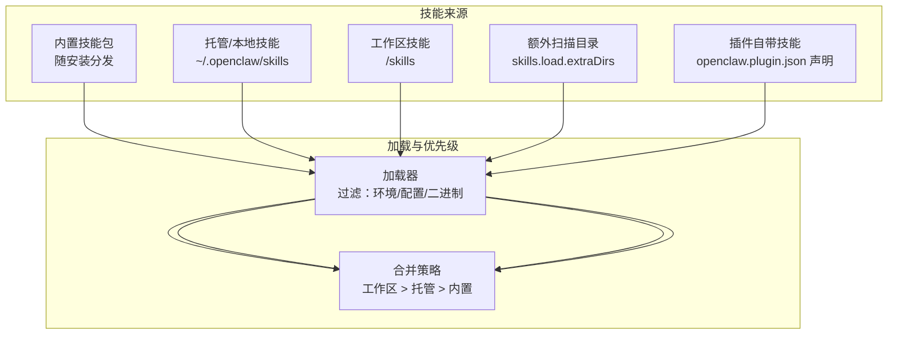
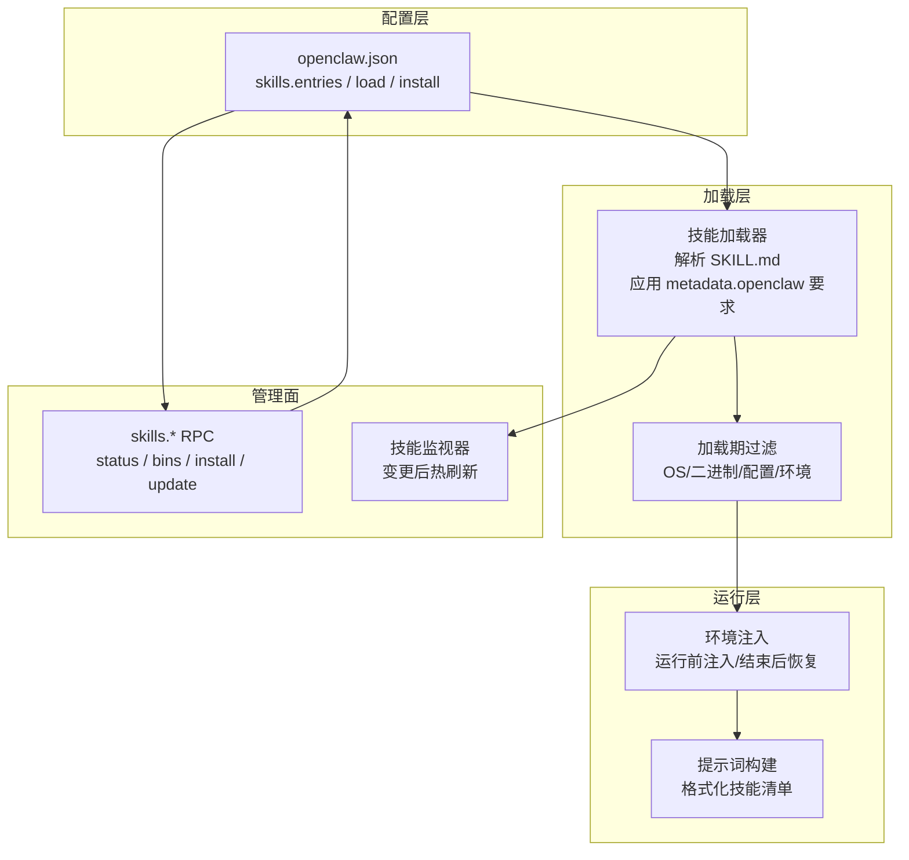
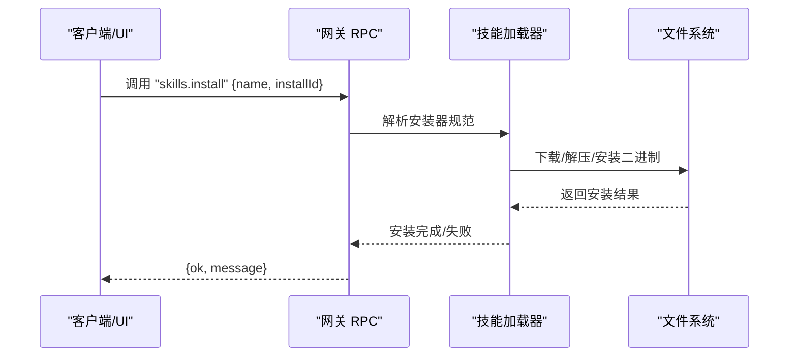
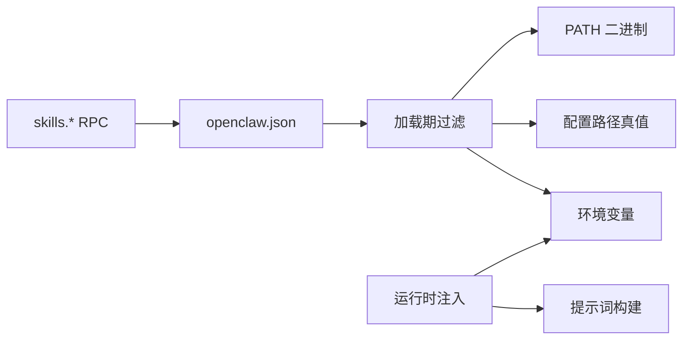

# 技能平台

<cite>
**本文引用的文件**
- [README.md](file://README.md)
- [skills.md](file://docs/tools/skills.md)
- [creating-skills.md](file://docs/tools/creating-skills.md)
- [skills-config.md](file://docs/tools/skills-config.md)
- [skills.ts](file://src/agents/skills.ts)
- [skills.ts（网关服务端方法）](file://src/gateway/server-methods/skills.ts)
- [openclaw.plugin.json（memory-core 插件）](file://extensions/memory-core/openclaw.plugin.json)
- [SKILL.md（skill-creator）](file://skills/skill-creator/SKILL.md)
</cite>

## 目录

1. [简介](#简介)
2. [项目结构](#项目结构)
3. [核心组件](#核心组件)
4. [架构总览](#架构总览)
5. [详细组件分析](#详细组件分析)
6. [依赖关系分析](#依赖关系分析)
7. [性能考量](#性能考量)
8. [故障排查指南](#故障排查指南)
9. [结论](#结论)
10. [附录](#附录)

## 简介

本文件为 OpenClaw 技能平台的综合文档，覆盖内置技能、工作区技能与插件技能的管理机制；解释技能的安装、配置与执行流程；提供技能开发指南、模板使用与最佳实践；并给出权限控制与性能优化建议，以及技能市场、版本管理与依赖处理机制。

## 项目结构

OpenClaw 的技能体系由“内置技能包 + 工作区技能 + 插件技能 + 可选托管技能目录”构成，加载顺序与优先级明确，并支持按环境、配置与二进制存在性进行“加载期筛选”。

图示来源

- [skills.md: 13-48:13-48](file://docs/tools/skills.md#L13-L48)

章节来源

- [skills.md: 13-48:13-48](file://docs/tools/skills.md#L13-L48)
- [README.md: 312-316:312-316](file://README.md#L312-L316)

## 核心组件

- 技能元数据与格式：遵循 AgentSkills 规范，要求 SKILL.md 具备 YAML 前言（name、description 等），支持 metadata.openclaw 扩展字段用于加载门控与安装器定义。
- 加载与过滤：在加载时根据 OS、PATH 二进制、配置路径真值、环境变量等条件筛选可启用技能。
- 配置与覆盖：通过 openclaw.json 的 skills.entries 对单个技能进行启用/禁用、注入 env/apiKey、自定义配置项。
- 运行时环境注入：在一次会话运行开始时注入技能所需环境变量，结束后恢复。
- 技能快照与热更新：会话启动时快照已启用技能列表，支持监视器热刷新。
- 网关能力：提供 skills.status、skills.bins、skills.install、skills.update 等 RPC 方法，便于 UI 或外部工具查询与管理技能。

章节来源

- [skills.md: 78-187:78-187](file://docs/tools/skills.md#L78-L187)
- [skills.ts: 1-47:1-47](file://src/agents/skills.ts#L1-L47)
- [skills.ts（网关服务端方法）: 57-204:57-204](file://src/gateway/server-methods/skills.ts#L57-L204)

## 架构总览

技能平台围绕“加载期筛选 + 运行期注入 + 网关管理”的三段式设计展开，既保证安全可控，又兼顾灵活性与可观测性。

图示来源

- [skills.ts: 36-46:36-46](file://src/agents/skills.ts#L36-L46)
- [skills.ts（网关服务端方法）: 57-204:57-204](file://src/gateway/server-methods/skills.ts#L57-L204)
- [skills-config.md: 13-39:13-39](file://docs/tools/skills-config.md#L13-L39)

## 详细组件分析

### 组件一：技能加载与优先级

- 来源优先级：工作区技能 > 托管/本地技能 > 内置技能；可通过 skills.load.extraDirs 注入额外扫描目录（最低优先级）。
- 多代理场景：每个代理拥有独立工作区，因此 per-agent 技能仅该代理可见；共享技能位于托管目录或通过 extraDirs 指定的共享目录。
- 插件技能：当插件启用时，其声明的 skills 目录参与加载与优先级计算，可通过 metadata.openclaw.requires.config 进行门控。

章节来源

- [skills.md: 13-48:13-48](file://docs/tools/skills.md#L13-L48)

### 组件二：加载期门控与安装器

- 门控字段（metadata.openclaw）：
  - os：限定平台
  - requires.bins / requires.anyBins：PATH 必须存在
  - requires.env / requires.config：环境变量或配置路径需满足
  - always：无条件包含
  - install：安装器规范（brew/node/go/download 等）
- 安装偏好：preferBrew、nodeManager（npm/pnpm/yarn/bun，默认 npm；注意 Bun 不推荐用于 WhatsApp/Telegram）
- 沙箱注意事项：若会话沙箱启用，容器内也需具备相应二进制；可通过 agents.defaults.sandbox.docker.setupCommand 安装。

章节来源

- [skills.md: 106-187:106-187](file://docs/tools/skills.md#L106-L187)
- [skills-config.md: 13-39:13-39](file://docs/tools/skills-config.md#L13-L39)

### 组件三：配置覆盖与运行时注入

- 配置覆盖（skills.entries）：
  - enabled：显式启用/禁用
  - env：仅在进程未设置时注入
  - apiKey：便捷写法，支持明文或 SecretRef 对象
  - 自定义 config 字段：用于技能内部逻辑
- 运行时注入：
  - 会话开始时读取元数据，应用 env/apiKey 到 process.env
  - 构建系统提示词时注入可用技能清单
  - 会话结束恢复原始环境

章节来源

- [skills.md: 189-246:189-246](file://docs/tools/skills.md#L189-L246)
- [skills-config.md: 54-78:54-78](file://docs/tools/skills-config.md#L54-L78)

### 组件四：技能监视与热更新

- 默认监视工作区与托管目录下的 SKILL.md 变更，去抖后刷新技能快照
- 新会话开始时应用最新快照；若启用技能监视，变更会在下一次会话轮次生效

章节来源

- [skills.md: 242-267:242-267](file://docs/tools/skills.md#L242-L267)

### 组件五：远程节点与 macOS 技能弹性

- 当网关运行于 Linux，且连接了允许 system.run 的 macOS 节点时，可在节点上探测到所需二进制后，将 macOS 专属技能视为可执行
- 此行为依赖节点上报命令支持与 system.run 探针；节点离线时技能仍可见但可能无法调用

章节来源

- [skills.md: 248-252:248-252](file://docs/tools/skills.md#L248-L252)

### 组件六：网关 RPC 与技能管理

- skills.status：返回当前工作区技能状态（含远程节点弹性）
- skills.bins：汇总所有工作区已启用技能所需的二进制清单
- skills.install：按安装器规范安装指定技能
- skills.update：更新 openclaw.json 中的 skills.entries 项（enabled/env/apiKey）

图示来源

- [skills.ts（网关服务端方法）: 114-145:114-145](file://src/gateway/server-methods/skills.ts#L114-L145)

章节来源

- [skills.ts（网关服务端方法）: 57-204:57-204](file://src/gateway/server-methods/skills.ts#L57-L204)

### 组件七：技能开发与模板

- 开发步骤：创建工作区目录 → 编写 SKILL.md（含 YAML 前言与正文）→ 可选添加 scripts/references/assets → 刷新或重启网关以发现
- 最佳实践：简洁、安全、测试先行；对 bash 类操作避免任意命令注入风险
- 内置“技能创作者”技能提供模板化流程与组织建议（脚本/参考/资源分离、渐进披露、命名规范等）

章节来源

- [creating-skills.md: 17-59:17-59](file://docs/tools/creating-skills.md#L17-L59)
- [SKILL.md（skill-creator）: 46-373:46-373](file://skills/skill-creator/SKILL.md#L46-L373)

### 组件八：插件技能集成

- 插件可在 openclaw.plugin.json 中声明 skills 目录，启用后作为普通技能参与加载与优先级
- 可通过 metadata.openclaw.requires.config 对插件配置进行门控

章节来源

- [skills.md: 41-48:41-48](file://docs/tools/skills.md#L41-L48)
- [openclaw.plugin.json（memory-core 插件）: 1-10:1-10](file://extensions/memory-core/openclaw.plugin.json#L1-L10)

## 依赖关系分析

- 配置依赖：openclaw.json 的 skills.\* 字段驱动加载、安装与运行时行为
- 环境依赖：PATH 二进制、配置路径真值、环境变量
- 运行时依赖：会话沙箱内的二进制与网络访问能力
- 网络依赖：下载型安装器需要外网访问与合适的归档格式支持

图示来源

- [skills.md: 106-187:106-187](file://docs/tools/skills.md#L106-L187)
- [skills-config.md: 13-39:13-39](file://docs/tools/skills-config.md#L13-L39)
- [skills.ts（网关服务端方法）: 57-204:57-204](file://src/gateway/server-methods/skills.ts#L57-L204)

章节来源

- [skills.md: 106-187:106-187](file://docs/tools/skills.md#L106-L187)
- [skills-config.md: 13-39:13-39](file://docs/tools/skills-config.md#L13-L39)
- [skills.ts（网关服务端方法）: 57-204:57-204](file://src/gateway/server-methods/skills.ts#L57-L204)

## 性能考量

- 提示词中的技能清单开销是确定性的：基础开销约 195 字符，每技能约 97 字符 + XML 转义后的字段长度；按常见模型估算，约 4 字符≈1 令牌
- 建议：
  - 控制技能数量与描述长度，减少 XML 转义带来的膨胀
  - 使用“技能监视器”在开发阶段快速热更新，避免频繁重启
  - 在多代理场景中合理划分 per-agent 与共享技能，降低无关上下文

章节来源

- [skills.md: 269-286:269-286](file://docs/tools/skills.md#L269-L286)

## 故障排查指南

- 未知代理 ID：检查 agentId 是否在已知代理列表中
- 请求参数无效：确认 skills.status/skills.install/skills.update 的参数校验
- 二进制缺失：使用 skills.bins 汇总当前启用技能所需二进制，逐一排查 PATH 与安装器
- 安装失败：核对安装器类型（brew/node/go/download）、平台过滤、网络可达性与归档格式
- 环境变量未注入：确认 process.env 未被提前覆盖；在沙箱场景下使用 agents.defaults.sandbox.docker.env 或自定义镜像
- 远程节点不可用：macOS 节点离线会导致 macOS 专属技能不可用，待重连后恢复

章节来源

- [skills.ts（网关服务端方法）: 58-90:58-90](file://src/gateway/server-methods/skills.ts#L58-L90)
- [skills.ts（网关服务端方法）: 114-145:114-145](file://src/gateway/server-methods/skills.ts#L114-L145)
- [skills.ts（网关服务端方法）: 146-203:146-203](file://src/gateway/server-methods/skills.ts#L146-L203)

## 结论

OpenClaw 技能平台通过“可声明的元数据 + 可配置的门控 + 可观测的 RPC 管理”，实现了从开发、安装、配置到执行的全链路闭环。结合工作区与共享技能的优先级策略、远程节点弹性与沙箱安全模型，既能满足个人定制化需求，也能在多代理与分布式环境下保持一致体验。

## 附录

### A. 技能市场与版本管理

- ClawHub 是公共技能注册表，支持浏览、安装、更新与同步
- 安装/更新/同步常用命令：
  - 安装到工作区：clawhub install <skill-slug>
  - 更新全部：clawhub update --all
  - 同步扫描/发布：clawhub sync --all

章节来源

- [skills.md: 50-67:50-67](file://docs/tools/skills.md#L50-L67)

### B. 权限与安全

- 第三方技能视为不受信任代码，建议沙箱运行并限制高危工具
- workspace 与 extraDirs 的发现仅接受受控根目录内的合法路径
- secrets 注入仅作用于宿主进程（非沙箱），避免泄露至日志与提示词

章节来源

- [skills.md: 69-76:69-76](file://docs/tools/skills.md#L69-L76)

### C. 配置参考要点

- skills.allowBundled：仅允许特定内置技能
- skills.load.extraDirs：追加扫描目录（最低优先级）
- skills.load.watch/watchDebounceMs：监视与去抖
- skills.install.preferBrew/nodeManager：安装器偏好
- skills.entries.<skillKey>：启用/禁用、env、apiKey、自定义 config

章节来源

- [skills-config.md: 13-78:13-78](file://docs/tools/skills-config.md#L13-L78)
