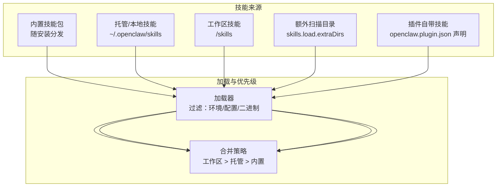
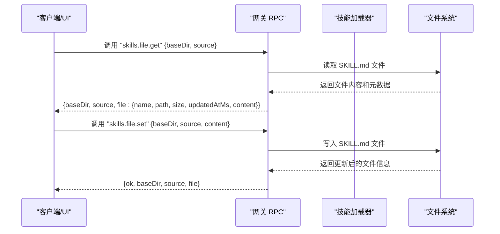
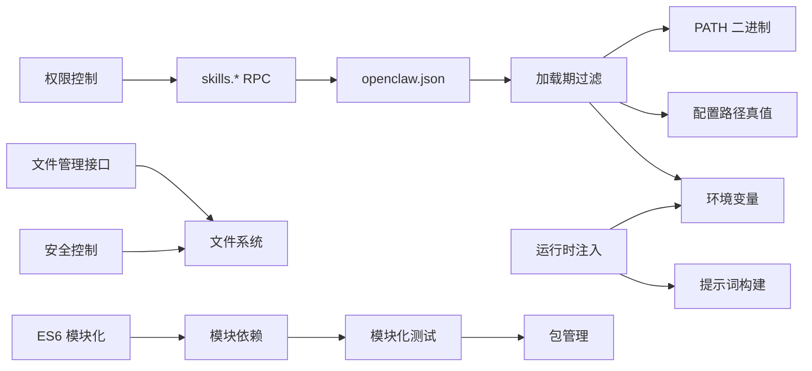

# 技能平台

<cite>
**本文引用的文件**
- [README.md](file://README.md)
- [skills.md](file://docs/tools/skills.md)
- [creating-skills.md](file://docs/tools/creating-skills.md)
- [skills-config.md](file://docs/tools/skills-config.md)
- [skills.ts](file://src/agents/skills.ts)
- [skills.ts（网关服务端方法）](file://src/gateway/server-methods/skills.ts)
- [agents-models-skills.ts](file://src/gateway/protocol/schema/agents-models-skills.ts)
- [skills.ts（UI类型定义）](file://ui-react/src/types/skills.ts)
- [skills.store.ts](file://ui-react/src/store/skills.store.ts)
- [SkillsPage.tsx](file://ui-react/src/pages/SkillsPage.tsx)
- [openclaw.plugin.json（memory-core 插件）](file://extensions/memory-core/openclaw.plugin.json)
- [SKILL.md（skill-creator）](file://skills/skill-creator/SKILL.md)
- [SKILL.md（lobster）](file://extensions/lobster/SKILL.md)
- [SKILL.md（discord）](file://skills/discord/SKILL.md)
- [method-scopes.ts](file://src/gateway/method-scopes.ts)
- [server-methods-list.ts](file://src/gateway/server-methods-list.ts)
- [fs-safe.ts](file://src/infra/fs-safe.ts)
- [travel-planner/SKILL.md](file://skills/travel-planner/SKILL.md)
- [travel-planner/package.json](file://skills/travel-planner/package.json)
- [travel-planner/scripts/db.mjs](file://skills/travel-planner/scripts/db.mjs)
- [travel-planner/scripts/route-plan.mjs](file://skills/travel-planner/scripts/route-plan.mjs)
- [travel-planner/scripts/plan-generator.mjs](file://skills/travel-planner/scripts/plan-generator.mjs)
- [travel-planner/scripts/booking-ready.mjs](file://skills/travel-planner/scripts/booking-ready.mjs)
- [travel-planner/scripts/route-validation.mjs](file://skills/travel-planner/scripts/route-validation.mjs)
- [travel-planner/scripts/xhs-evidence-builder.mjs](file://skills/travel-planner/scripts/xhs-evidence-builder.mjs)
- [travel-planner/scripts/cli_args.mjs](file://skills/travel-planner/scripts/cli_args.mjs)
- [travel-planner/scripts/briefing.mjs](file://skills/travel-planner/scripts/briefing.mjs)
- [travel-planner-skill.test.ts](file://test/travel-planner-skill.test.ts)
</cite>

## 更新摘要
**所做更改**
- 新增旅行规划技能现代化改造章节，详细介绍 JavaScript 模块化开发模式
- 更新技能开发指南，增加模块化架构和最佳实践
- 新增 JavaScript 模块化开发模式章节，涵盖 ES6 模块导入导出、CLI 参数解析和测试策略
- 更新技能文件管理功能，增加对 JavaScript 模块的支持
- 新增旅行规划技能的模块化架构分析和开发指南

## 目录
1. [简介](#简介)
2. [项目结构](#项目结构)
3. [核心组件](#核心组件)
4. [架构总览](#架构总览)
5. [详细组件分析](#详细组件分析)
6. [依赖关系分析](#依赖关系分析)
7. [性能考量](#性能考量)
8. [故障排查指南](#故障排查指南)
9. [结论](#结论)
10. [附录](#附录)

## 简介
本文件为 OpenClaw 技能平台的综合文档，覆盖内置技能、工作区技能与插件技能的管理机制；解释技能的安装、配置与执行流程；提供技能开发指南、模板使用与最佳实践；并给出权限控制与性能优化建议，以及技能市场、版本管理与依赖处理机制。

**更新** 本版本新增了旅行规划技能的现代化改造内容，展示了基于 JavaScript 模块化开发的全新架构模式。技能平台现已支持 ES6 模块导入导出、统一的 CLI 参数解析、模块化测试策略等现代开发实践，为技能开发提供了更加规范和高效的开发体验。

## 项目结构
OpenClaw 的技能体系由"内置技能包 + 工作区技能 + 插件技能 + 可选托管技能目录"构成，加载顺序与优先级明确，并支持按环境、配置与二进制存在性进行"加载期筛选"。

```mermaid
graph TB
subgraph "技能来源"
A["内置技能包<br/>随安装分发"]
B["托管/本地技能<br/>~/.openclaw/skills"]
C["工作区技能<br/><workspace>/skills"]
D["额外扫描目录<br/>skills.load.extraDirs"]
E["插件自带技能<br/>openclaw.plugin.json 声明"]
end
subgraph "加载与优先级"
F["加载器<br/>过滤：环境/配置/二进制"]
G["合并策略<br/>工作区 > 托管 > 内置"]
end
A --> F --> G
B --> F --> G
C --> F --> G
D --> F
E --> F --> G
```

**图示来源**
- [skills.md: 13-48:13-48](file://docs/tools/skills.md#L13-L48)

**章节来源**
- [skills.md: 13-48:13-48](file://docs/tools/skills.md#L13-L48)
- [README.md: 312-316:312-316](file://README.md#L312-L316)

## 核心组件
- 技能元数据与格式：遵循 AgentSkills 规范，要求 SKILL.md 具备 YAML 前言（name、description 等），支持 metadata.openclaw 扩展字段用于加载门控与安装器定义。
- 加载与过滤：在加载时根据 OS、PATH 二进制、配置路径真值、环境变量等条件筛选可启用技能。
- 配置与覆盖：通过 openclaw.json 的 skills.entries 对单个技能进行启用/禁用、注入 env/apiKey、自定义配置项。
- 运行时环境注入：在一次会话运行开始时注入技能所需环境变量，结束后恢复。
- 技能快照与热更新：会话启动时快照已启用技能列表，支持监视器热刷新。
- **新增** 技能文件管理：提供 skills.file.get 和 skills.file.set RPC 方法，支持读取和编辑 SKILL.md 文件内容。
- **新增** 安全文件操作：使用安全的文件操作函数，拒绝硬链接，限制在指定根目录内，确保文件系统的安全性。
- **新增** JavaScript 模块化开发：旅行规划技能采用 ES6 模块化架构，支持 import/export 导入导出、统一 CLI 参数解析和模块化测试。
- 网关能力：提供 skills.status、skills.bins、skills.install、skills.update 等 RPC 方法，便于 UI 或外部工具查询与管理技能。

**章节来源**
- [skills.md: 78-187:78-187](file://docs/tools/skills.md#L78-L187)
- [skills.ts: 1-47:1-47](file://src/agents/skills.ts#L1-L47)
- [skills.ts（网关服务端方法）: 57-204:57-204](file://src/gateway/server-methods/skills.ts#L57-L204)

## 架构总览
技能平台围绕"加载期筛选 + 运行期注入 + 网关管理 + 文件管理"的四段式设计展开，既保证安全可控，又兼顾灵活性与可观测性。

```mermaid
graph TB
subgraph "配置层"
CFG["openclaw.json<br/>skills.entries / load / install"]
end
subgraph "加载层"
LOADER["技能加载器<br/>解析 SKILL.md<br/>应用 metadata.openclaw 要求"]
FILTER["加载期过滤<br/>OS/二进制/配置/环境"]
end
subgraph "运行层"
ENV["环境注入<br/>运行前注入/结束后恢复"]
PROMPT["提示词构建<br/>格式化技能清单"]
end
subgraph "管理面"
RPC["skills.* RPC<br/>status / bins / install / update / file.get / file.set"]
WATCH["技能监视器<br/>变更后热刷新"]
SECURITY["安全控制<br/>硬链接拒绝/路径限制"]
FILEMGR["技能文件管理<br/>get/set SKILL.md"]
END
subgraph "开发层"
MODULES["JavaScript 模块化<br/>ES6 导入导出<br/>统一 CLI 解析"]
TESTS["模块化测试<br/>单元测试 + 集成测试"]
BUNDLING["包管理<br/>package.json 配置"]
END
CFG --> LOADER --> FILTER --> ENV
ENV --> PROMPT
CFG --> RPC
LOADER --> WATCH
RPC --> CFG
FILEMGR --> RPC
SECURITY --> FILEMGR
MODULES --> TESTS
TESTS --> BUNDLING
```

**图示来源**
- [skills.ts: 36-46:36-46](file://src/agents/skills.ts#L36-L46)
- [skills.ts（网关服务端方法）: 57-204:57-204](file://src/gateway/server-methods/skills.ts#L57-L204)
- [skills-config.md: 13-39:13-39](file://docs/tools/skills-config.md#L13-L39)

## 详细组件分析

### 组件一：技能加载与优先级
- 来源优先级：工作区技能 > 托管/本地技能 > 内置技能；可通过 skills.load.extraDirs 注入额外扫描目录（最低优先级）。
- 多代理场景：每个代理拥有独立工作区，因此 per-agent 技能仅该代理可见；共享技能位于托管目录或通过 extraDirs 指定的共享目录。
- 插件技能：当插件启用时，其声明的 skills 目录参与加载与优先级计算，可通过 metadata.openclaw.requires.config 进行门控。

**章节来源**
- [skills.md: 13-48:13-48](file://docs/tools/skills.md#L13-L48)

### 组件二：加载期门控与安装器
- 门控字段（metadata.openclaw）：
  - os：限定平台
  - requires.bins / requires.anyBins：PATH 必须存在
  - requires.env / requires.config：环境变量或配置路径需满足
  - always：无条件包含
  - install：安装器规范（brew/node/go/download 等）
- 安装偏好：preferBrew、nodeManager（npm/pnpm/yarn/bun，默认 npm；注意 Bun 不推荐用于 WhatsApp/Telegram）
- 沙箱注意事项：若会话沙箱启用，容器内也需具备相应二进制；可通过 agents.defaults.sandbox.docker.setupCommand 安装。

**章节来源**
- [skills.md: 106-187:106-187](file://docs/tools/skills.md#L106-L187)
- [skills-config.md: 13-39:13-39](file://docs/tools/skills-config.md#L13-L39)

### 组件三：配置覆盖与运行时注入
- 配置覆盖（skills.entries）：
  - enabled：显式启用/禁用
  - env：仅在进程未设置时注入
  - apiKey：便捷写法，支持明文或 SecretRef 对象
  - 自定义 config 字段：用于技能内部逻辑
- 运行时注入：
  - 会话开始时读取元数据，应用 env/apiKey 到 process.env
  - 构建系统提示词时注入可用技能清单
  - 会话结束恢复原始环境

**章节来源**
- [skills.md: 189-246:189-246](file://docs/tools/skills.md#L189-L246)
- [skills-config.md: 54-78:54-78](file://docs/tools/skills-config.md#L54-L78)

### 组件四：技能监视与热更新
- 默认监视工作区与托管目录下的 SKILL.md 变更，去抖后刷新技能快照
- 新会话开始时应用最新快照；若启用技能监视，变更会在下一次会话轮次生效

**章节来源**
- [skills.md: 242-267:242-267](file://docs/tools/skills.md#L242-L267)

### 组件五：远程节点与 macOS 技能弹性
- 当网关运行于 Linux，且连接了允许 system.run 的 macOS 节点时，可在节点上探测到所需二进制后，将 macOS 专属技能视为可执行
- 此行为依赖节点上报命令支持与 system.run 探针；节点离线时技能仍可见但可能无法调用

**章节来源**
- [skills.md: 248-252:248-252](file://docs/tools/skills.md#L248-L252)

### 组件六：网关 RPC 与技能管理
- skills.status：返回当前工作区技能状态（含远程节点弹性）
- skills.bins：汇总所有工作区已启用技能所需的二进制清单
- skills.install：按安装器规范安装指定技能
- skills.update：更新 openclaw.json 中的 skills.entries 项（enabled/env/apiKey）
- **新增** skills.file.get：获取指定技能的 SKILL.md 文件内容
- **新增** skills.file.set：编辑指定技能的 SKILL.md 文件内容

```mermaid
sequenceDiagram
participant Client as "客户端/UI"
participant GW as "网关 RPC"
participant Loader as "技能加载器"
participant FS as "文件系统"
Client->>GW : 调用 "skills.file.get" {baseDir, source}
GW->>FS : 读取 SKILL.md 文件
FS-->>GW : 返回文件内容和元数据
GW-->>Client : {baseDir, source, file : {name, path, size, updatedAtMs, content}}
Client->>GW : 调用 "skills.file.set" {baseDir, source, content}
GW->>FS : 写入 SKILL.md 文件
FS-->>GW : 返回更新后的文件信息
GW-->>Client : {ok, baseDir, source, file}
```

**图示来源**
- [skills.ts（网关服务端方法）: 175-279:175-279](file://src/gateway/server-methods/skills.ts#L175-L279)

**章节来源**
- [skills.ts（网关服务端方法）: 57-204:57-204](file://src/gateway/server-methods/skills.ts#L57-L204)

### 组件七：技能文件管理接口
- **skills.file.get**：获取技能的 SKILL.md 文件内容，返回文件名、路径、大小、最后修改时间戳和内容
- **skills.file.set**：编辑技能的 SKILL.md 文件内容，支持安全的文件写入和权限检查
- **安全机制**：使用安全的文件操作函数，拒绝硬链接，限制在指定根目录内
- **权限控制**：只允许写入用户可写的技能源（workspace 和 managed），内置技能源为只读

**章节来源**
- [agents-models-skills.ts: 219-265:219-265](file://src/gateway/protocol/schema/agents-models-skills.ts#L219-L265)
- [skills.ts（网关服务端方法）: 175-279:175-279](file://src/gateway/server-methods/skills.ts#L175-L279)

### 组件八：安全文件操作机制
- **路径安全验证**：使用 `resolvePathWithinRoot` 函数确保文件路径在指定根目录内
- **硬链接拒绝**：通过 `rejectHardlinks: true` 参数拒绝硬链接文件的访问
- **文件类型检查**：确保只允许读取常规文件，拒绝目录和符号链接
- **写入安全**：使用 `writeFileWithinRoot` 函数确保写入操作在安全的根目录范围内
- **权限控制**：通过 `isWritableSkillSource` 函数限制只有 workspace 和 managed 技能可以被编辑

**章节来源**
- [fs-safe.ts: 177-228:177-228](file://src/infra/fs-safe.ts#L177-L228)
- [fs-safe.ts: 380-417:380-417](file://src/infra/fs-safe.ts#L380-L417)
- [skills.ts（网关服务端方法）: 91-93:91-93](file://src/gateway/server-methods/skills.ts#L91-L93)

### 组件九：UI 集成与技能编辑
- **UI 类型定义**：在前端类型定义中包含技能文件管理相关的类型和接口
- **状态管理**：使用 Zustand 状态管理库实现技能文件的获取和保存
- **页面组件**：SkillsPage 组件提供技能详情页面，支持 SKILL.md 文件的加载和编辑
- **实时预览**：编辑器支持实时预览 SKILL.md 内容，支持草稿保存和撤销
- **错误处理**：完善的错误处理机制，包括网络连接问题和文件操作错误

**章节来源**
- [skills.ts（UI类型定义）: 63-101:63-101](file://ui-react/src/types/skills.ts#L63-L101)
- [skills.store.ts: 244-268:244-268](file://ui-react/src/store/skills.store.ts#L244-L268)
- [SkillsPage.tsx: 74-97:74-97](file://ui-react/src/pages/SkillsPage.tsx#L74-L97)

### 组件十：技能开发与模板
- 开发步骤：创建工作区目录 → 编写 SKILL.md（含 YAML 前言与正文）→ 可选添加 scripts/references/assets → 刷新或重启网关以发现
- 最佳实践：简洁、安全、测试先行；对 bash 类操作避免任意命令注入风险
- 内置"技能创作者"技能提供模板化流程与组织建议（脚本/参考/资源分离、渐进披露、命名规范等）
- **新增** 文件管理：通过 skills.file.get/getSkillFile 获取 SKILL.md 内容，通过 skills.file.set/saveSkillFile 保存编辑后的文件
- **新增** JavaScript 模块化开发：采用 ES6 模块导入导出、统一 CLI 参数解析、模块化测试策略

**章节来源**
- [creating-skills.md: 17-59:17-59](file://docs/tools/creating-skills.md#L17-L59)
- [SKILL.md（skill-creator）: 46-373:46-373](file://skills/skill-creator/SKILL.md#L46-L373)

### 组件十一：插件技能集成
- 插件可在 openclaw.plugin.json 中声明 skills 目录，启用后作为普通技能参与加载与优先级
- 可通过 metadata.openclaw.requires.config 对插件配置进行门控

**章节来源**
- [skills.md: 41-48:41-48](file://docs/tools/skills.md#L41-L48)
- [openclaw.plugin.json（memory-core 插件）: 1-10:1-10](file://extensions/memory-core/openclaw.plugin.json#L1-L10)

### 组件十二：旅行规划技能现代化改造
- **ES6 模块化架构**：采用 import/export 导入导出语法，支持模块间的清晰依赖关系
- **统一 CLI 参数解析**：通过 `cli_args.mjs` 提供一致的命令行参数解析和验证机制
- **模块化测试策略**：使用 Vitest 进行单元测试，支持模块导入和模拟测试环境
- **包管理配置**：通过 `package.json` 的 `"type": "module"` 启用 ES6 模块支持
- **模块间通信**：各模块通过函数导出和导入进行解耦，支持独立测试和维护

**章节来源**
- [travel-planner/SKILL.md: 1-447:1-447](file://skills/travel-planner/SKILL.md#L1-L447)
- [travel-planner/package.json: 1-12:1-12](file://skills/travel-planner/package.json#L1-L12)
- [travel-planner/scripts/db.mjs: 1-837:1-837](file://skills/travel-planner/scripts/db.mjs#L1-L837)
- [travel-planner/scripts/route-plan.mjs: 1-285:1-285](file://skills/travel-planner/scripts/route-plan.mjs#L1-L285)
- [travel-planner/scripts/plan-generator.mjs: 1-703:1-703](file://skills/travel-planner/scripts/plan-generator.mjs#L1-L703)
- [travel-planner/scripts/booking-ready.mjs: 1-260:1-260](file://skills/travel-planner/scripts/booking-ready.mjs#L1-L260)
- [travel-planner/scripts/route-validation.mjs: 1-382:1-382](file://skills/travel-planner/scripts/route-validation.mjs#L1-L382)
- [travel-planner/scripts/xhs-evidence-builder.mjs: 1-183:1-183](file://skills/travel-planner/scripts/xhs-evidence-builder.mjs#L1-L183)
- [travel-planner/scripts/cli_args.mjs: 1-187:1-187](file://skills/travel-planner/scripts/cli_args.mjs#L1-L187)
- [travel-planner/scripts/briefing.mjs: 1-149:1-149](file://skills/travel-planner/scripts/briefing.mjs#L1-L149)
- [travel-planner-skill.test.ts: 1-429:1-429](file://test/travel-planner-skill.test.ts#L1-L429)

### 组件十三：JavaScript 模块化开发模式详解
- **模块导入导出**：使用 ES6 模块语法，支持具名导入和默认导入，提高代码可读性和维护性
- **CLI 参数解析**：统一的 `runScript` 工厂函数，消除重复的命令行参数解析样板代码
- **模块间依赖**：通过明确的导入路径建立模块间的依赖关系，支持独立测试和重构
- **测试策略**：模块化测试支持函数级别的单元测试，通过模拟导入测试独立功能
- **开发工具链**：支持现代 Node.js ES6 模块特性，包括 `import.meta.url` 和动态导入

**章节来源**
- [travel-planner/scripts/cli_args.mjs: 155-187:155-187](file://skills/travel-planner/scripts/cli_args.mjs#L155-L187)
- [travel-planner/scripts/db.mjs: 15-15:15-15](file://skills/travel-planner/scripts/db.mjs#L15-L15)
- [travel-planner/scripts/route-plan.mjs: 3-3:1-1](file://skills/travel-planner/scripts/route-plan.mjs#L1-L1)
- [travel-planner/scripts/plan-generator.mjs: 10-15:10-15](file://skills/travel-planner/scripts/plan-generator.mjs#L10-L15)
- [travel-planner/scripts/booking-ready.mjs: 1-1:1-1](file://skills/travel-planner/scripts/booking-ready.mjs#L1-L1)
- [travel-planner/scripts/route-validation.mjs: 1-1:1-1](file://skills/travel-planner/scripts/route-validation.mjs#L1-L1)
- [travel-planner/scripts/xhs-evidence-builder.mjs: 1-1:1-1](file://skills/travel-planner/scripts/xhs-evidence-builder.mjs#L1-L1)
- [travel-planner/scripts/briefing.mjs: 1-1:1-1](file://skills/travel-planner/scripts/briefing.mjs#L1-L1)

## 依赖关系分析
- 配置依赖：openclaw.json 的 skills.* 字段驱动加载、安装与运行时行为
- 环境依赖：PATH 二进制、配置路径真值、环境变量
- 运行时依赖：会话沙箱内的二进制与网络访问能力
- 网络依赖：下载型安装器需要外网访问与合适的归档格式支持
- **新增** 文件系统依赖：技能文件管理功能依赖安全的文件操作和权限控制
- **新增** 权限依赖：方法访问需要适当的授权级别（READ_SCOPE/WRITE_SCOPE）
- **新增** 模块化依赖：旅行规划技能采用 ES6 模块化架构，支持模块间的清晰依赖关系

```mermaid
graph LR
CFG["openclaw.json"] --> LOAD["加载期过滤"]
LOAD --> BIN["PATH 二进制"]
LOAD --> CONF["配置路径真值"]
LOAD --> ENV["环境变量"]
RUNTIME["运行时注入"] --> ENV
RUNTIME --> PROMPT["提示词构建"]
RPC["skills.* RPC"] --> CFG
FILEMGR["文件管理接口"] --> FS["文件系统"]
SECURITY["安全控制"] --> FS
AUTH["权限控制"] --> RPC
MODULES["ES6 模块化"] --> DEPS["模块依赖"]
DEPS --> TESTS["模块化测试"]
TESTS --> BUNDLING["包管理"]
```

**图示来源**
- [skills.md: 106-187:106-187](file://docs/tools/skills.md#L106-L187)
- [skills-config.md: 13-39:13-39](file://docs/tools/skills-config.md#L13-L39)
- [skills.ts（网关服务端方法）: 57-204:57-204](file://src/gateway/server-methods/skills.ts#L57-L204)

**章节来源**
- [skills.md: 106-187:106-187](file://docs/tools/skills.md#L106-L187)
- [skills-config.md: 13-39:13-39](file://docs/tools/skills-config.md#L13-L39)
- [skills.ts（网关服务端方法）: 57-204:57-204](file://src/gateway/server-methods/skills.ts#L57-L204)

## 性能考量
- 提示词中的技能清单开销是确定性的：基础开销约 195 字符，每技能约 97 字符 + XML 转义后的字段长度；按常见模型估算，约 4 字符≈1 令牌
- 建议：
  - 控制技能数量与描述长度，减少 XML 转义带来的膨胀
  - 使用"技能监视器"在开发阶段快速热更新，避免频繁重启
  - 在多代理场景中合理划分 per-agent 与共享技能，降低无关上下文
  - **新增** 文件管理操作应避免频繁读写 SKILL.md，建议批量编辑后再保存
  - **新增** 使用去抖机制处理文件变更事件，避免过度刷新
  - **新增** JavaScript 模块化架构支持按需加载，减少不必要的模块初始化开销

**章节来源**
- [skills.md: 269-286:269-286](file://docs/tools/skills.md#L269-L286)

## 故障排查指南
- 未知代理 ID：检查 agentId 是否在已知代理列表中
- 请求参数无效：确认 skills.status/skills.install/skills.update 的参数校验
- 二进制缺失：使用 skills.bins 汇总当前启用技能所需二进制，逐一排查 PATH 与安装器
- 安装失败：核对安装器类型（brew/node/go/download）、平台过滤、网络可达性与归档格式
- 环境变量未注入：确认 process.env 未被提前覆盖；在沙箱场景下使用 agents.defaults.sandbox.docker.env 或自定义镜像
- 远程节点不可用：macOS 节点离线会导致 macOS 专属技能不可用，待重连后恢复
- **新增** 文件管理错误：检查技能源是否为可写（workspace/managed），确认文件路径在根目录内，验证权限设置
- **新增** 权限不足：确认调用者具有适当的授权级别（READ_SCOPE/WRITE_SCOPE），检查方法范围配置
- **新增** 文件操作异常：检查安全文件操作函数的错误码，如 invalid-path、outside-workspace、not-found 等
- **新增** JavaScript 模块化问题：检查 ES6 模块导入路径、模块导出函数、CLI 参数解析错误
- **新增** 测试失败：验证模块导入、模拟函数、测试环境配置和断言逻辑

**章节来源**
- [skills.ts（网关服务端方法）: 58-90:58-90](file://src/gateway/server-methods/skills.ts#L58-L90)
- [skills.ts（网关服务端方法）: 114-145:114-145](file://src/gateway/server-methods/skills.ts#L114-L145)
- [skills.ts（网关服务端方法）: 146-203:146-203](file://src/gateway/server-methods/skills.ts#L146-L203)

## 结论
OpenClaw 技能平台通过"可声明的元数据 + 可配置的门控 + 可观测的 RPC 管理 + 可编辑的文件管理"，实现了从开发、安装、配置到执行的全链路闭环。结合工作区与共享技能的优先级策略、远程节点弹性与沙箱安全模型，既能满足个人定制化需求，也能在多代理与分布式环境下保持一致体验。新增的技能文件管理功能进一步提升了技能开发的便利性和效率，同时通过严格的安全控制确保文件系统的完整性。**新增的旅行规划技能现代化改造展示了基于 JavaScript 模块化开发的全新架构模式，采用 ES6 模块导入导出、统一 CLI 参数解析和模块化测试策略，为技能开发提供了更加规范和高效的开发体验。**

## 附录

### A. 技能市场与版本管理
- ClawHub 是公共技能注册表，支持浏览、安装、更新与同步
- 安装/更新/同步常用命令：
  - 安装到工作区：clawhub install <skill-slug>
  - 更新全部：clawhub update --all
  - 同步扫描/发布：clawhub sync --all

**章节来源**
- [skills.md: 50-67:50-67](file://docs/tools/skills.md#L50-L67)

### B. 权限与安全
- 第三方技能视为不受信任代码，建议沙箱运行并限制高危工具
- workspace 与 extraDirs 的发现仅接受受控根目录内的合法路径
- secrets 注入仅作用于宿主进程（非沙箱），避免泄露至日志与提示词
- **新增** 文件管理安全：使用安全的文件操作函数，拒绝硬链接，限制在指定根目录内
- **新增** 方法权限控制：skills.file.get 属于 READ_SCOPE，skills.file.set 属于 WRITE_SCOPE
- **新增** JavaScript 模块化安全：ES6 模块导入导出提供更好的代码组织和安全隔离

**章节来源**
- [skills.md: 69-76:69-76](file://docs/tools/skills.md#L69-L76)
- [method-scopes.ts: 67:67](file://src/gateway/method-scopes.ts#L67)
- [method-scopes.ts: 118:118](file://src/gateway/method-scopes.ts#L118)

### C. 配置参考要点
- skills.allowBundled：仅允许特定内置技能
- skills.load.extraDirs：追加扫描目录（最低优先级）
- skills.load.watch/watchDebounceMs：监视与去抖
- skills.install.preferBrew/nodeManager：安装器偏好
- skills.entries.<skillKey>：启用/禁用、env、apiKey、自定义 config

**章节来源**
- [skills-config.md: 13-78:13-78](file://docs/tools/skills-config.md#L13-L78)

### D. 技能文件管理 API 参考
- **skills.file.get**：获取技能文件内容
  - 参数：baseDir（技能目录绝对路径）、source（技能源标识）
  - 返回：文件元数据和内容
  - 权限：READ_SCOPE
  - 安全：拒绝硬链接，限制在根目录内
- **skills.file.set**：编辑技能文件内容
  - 参数：baseDir、source、content（新的 SKILL.md 内容）
  - 返回：更新后的文件信息
  - 权限：WRITE_SCOPE
  - 安全：仅允许写入 workspace 和 managed 技能源
- **适用范围**：仅适用于用户可写的技能源（workspace/managed），内置技能源为只读

**章节来源**
- [agents-models-skills.ts: 219-265:219-265](file://src/gateway/protocol/schema/agents-models-skills.ts#L219-L265)
- [skills.ts（网关服务端方法）: 175-279:175-279](file://src/gateway/server-methods/skills.ts#L175-L279)
- [server-methods-list.ts: 49-50:49-50](file://src/gateway/server-methods-list.ts#L49-L50)

### E. UI 集成参考
- **前端状态管理**：使用 Zustand 实现技能文件的异步获取和保存
- **组件集成**：SkillsPage 组件提供完整的技能文件编辑界面
- **错误处理**：完善的错误捕获和用户反馈机制
- **实时预览**：编辑器支持实时 Markdown 渲染

**章节来源**
- [skills.store.ts: 244-268:244-268](file://ui-react/src/store/skills.store.ts#L244-L268)
- [SkillsPage.tsx: 74-124:74-124](file://ui-react/src/pages/SkillsPage.tsx#L74-L124)

### F. JavaScript 模块化开发指南
- **ES6 模块导入导出**：使用 `import` 和 `export` 语法，支持具名导入和默认导入
- **统一 CLI 参数解析**：通过 `cli_args.mjs` 提供一致的命令行参数解析和验证机制
- **模块工厂函数**：使用 `runScript` 工厂函数消除重复的命令行处理样板代码
- **模块间通信**：通过函数导出和导入建立清晰的模块间依赖关系
- **测试策略**：支持模块导入和模拟测试，验证独立功能的正确性
- **开发工具链**：支持现代 Node.js ES6 模块特性，包括 `import.meta.url` 和动态导入

**章节来源**
- [travel-planner/package.json: 4:4](file://skills/travel-planner/package.json#L4-L4)
- [travel-planner/scripts/cli_args.mjs: 155-187:155-187](file://skills/travel-planner/scripts/cli_args.mjs#L155-L187)
- [travel-planner/scripts/db.mjs: 15-15:15-15](file://skills/travel-planner/scripts/db.mjs#L15-L15)
- [travel-planner/scripts/route-plan.mjs: 3-3:1-1](file://skills/travel-planner/scripts/route-plan.mjs#L1-L1)
- [travel-planner/scripts/plan-generator.mjs: 10-15:10-15](file://skills/travel-planner/scripts/plan-generator.mjs#L10-L15)
- [travel-planner/scripts/booking-ready.mjs: 1-1:1-1](file://skills/travel-planner/scripts/booking-ready.mjs#L1-L1)
- [travel-planner/scripts/route-validation.mjs: 1-1:1-1](file://skills/travel-planner/scripts/route-validation.mjs#L1-L1)
- [travel-planner/scripts/xhs-evidence-builder.mjs: 1-1:1-1](file://skills/travel-planner/scripts/xhs-evidence-builder.mjs#L1-L1)
- [travel-planner/scripts/briefing.mjs: 1-1:1-1](file://skills/travel-planner/scripts/briefing.mjs#L1-L1)
- [travel-planner-skill.test.ts: 17-33:17-33](file://test/travel-planner-skill.test.ts#L17-L33)

### G. 旅行规划技能架构分析
- **模块化设计**：采用单一职责原则，每个模块负责特定功能领域
- **数据持久化**：通过 `db.mjs` 统一管理偏好和行程数据，支持 JSON 文件存储
- **工作流编排**：通过 `plan-generator.mjs` 组合各个模块的输出，生成完整的旅行计划
- **实时验证**：通过 `route-validation.mjs` 和 `booking-ready.mjs` 提供实时数据验证和决策支持
- **证据处理**：通过 `xhs-evidence-builder.mjs` 规范化小红书搜索结果，支持路线框定
- **简报生成**：通过 `briefing.mjs` 生成行前和每日简报，提供行程指导

**章节来源**
- [travel-planner/SKILL.md: 38-447:38-447](file://skills/travel-planner/SKILL.md#L38-L447)
- [travel-planner/scripts/db.mjs: 127-165:127-165](file://skills/travel-planner/scripts/db.mjs#L127-L165)
- [travel-planner/scripts/plan-generator.mjs: 534-654:534-654](file://skills/travel-planner/scripts/plan-generator.mjs#L534-L654)
- [travel-planner/scripts/route-validation.mjs: 275-361:275-361](file://skills/travel-planner/scripts/route-validation.mjs#L275-L361)
- [travel-planner/scripts/booking-ready.mjs: 145-235:145-235](file://skills/travel-planner/scripts/booking-ready.mjs#L145-L235)
- [travel-planner/scripts/xhs-evidence-builder.mjs: 104-164:104-164](file://skills/travel-planner/scripts/xhs-evidence-builder.mjs#L104-L164)
- [travel-planner/scripts/briefing.mjs: 35-120:35-120](file://skills/travel-planner/scripts/briefing.mjs#L35-L120)