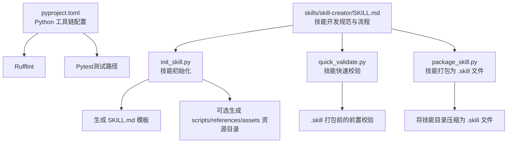
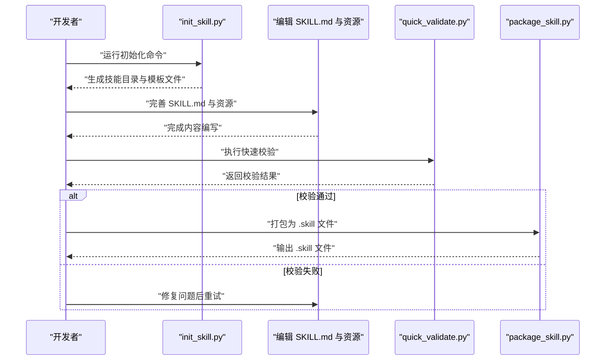
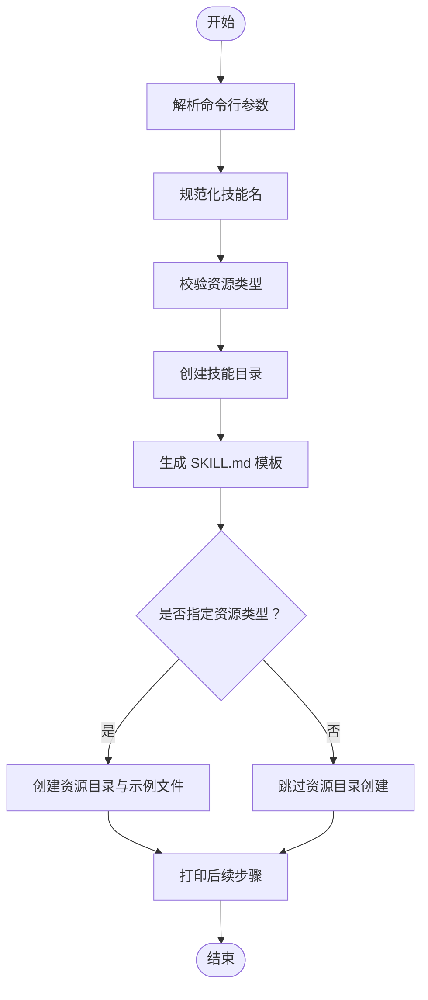
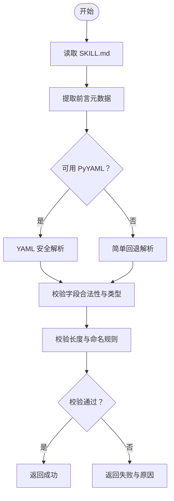
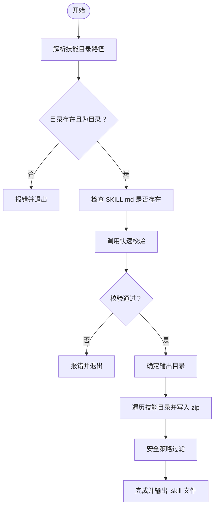
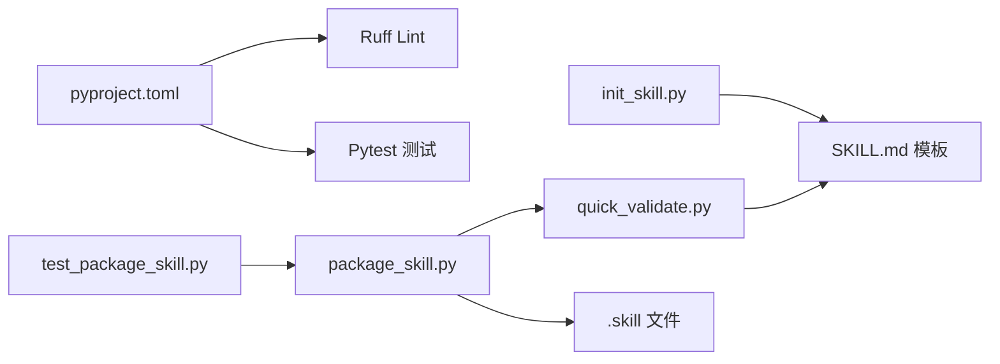

# 开发环境设置

<cite>
**本文引用的文件**
- [skills/skill-creator/scripts/init_skill.py](file://skills/skill-creator/scripts/init_skill.py)
- [skills/skill-creator/scripts/package_skill.py](file://skills/skill-creator/scripts/package_skill.py)
- [skills/skill-creator/scripts/quick_validate.py](file://skills/skill-creator/scripts/quick_validate.py)
- [skills/skill-creator/scripts/test_package_skill.py](file://skills/skill-creator/scripts/test_package_skill.py)
- [skills/skill-creator/SKILL.md](file://skills/skill-creator/SKILL.md)
- [pyproject.toml](file://pyproject.toml)
</cite>

## 目录

1. [简介](#简介)
2. [项目结构](#项目结构)
3. [核心组件](#核心组件)
4. [架构总览](#架构总览)
5. [详细组件分析](#详细组件分析)
6. [依赖关系分析](#依赖关系分析)
7. [性能考虑](#性能考虑)
8. [故障排查指南](#故障排查指南)
9. [结论](#结论)
10. [附录](#附录)

## 简介

本指南面向希望在 OpenClaw 技能生态中进行技能开发与发布的工程师，系统讲解如何搭建 Python 开发环境、安装与配置工具链，并基于仓库内的技能开发工具完成“技能项目初始化、校验与打包”的完整流程。文档同时提供常见问题排查与环境验证方法，帮助快速上手并稳定产出高质量技能包。

## 项目结构

本次文档聚焦于“技能开发工具”相关目录与文件，尤其是技能初始化、校验与打包脚本，以及用于约束 Python 工具链的配置文件。下图展示与技能开发环境直接相关的文件与职责：

图表来源

- [pyproject.toml:1-11](file://pyproject.toml#L1-L11)
- [skills/skill-creator/SKILL.md:1-373](file://skills/skill-creator/SKILL.md#L1-L373)
- [skills/skill-creator/scripts/init_skill.py:1-379](file://skills/skill-creator/scripts/init_skill.py#L1-L379)
- [skills/skill-creator/scripts/quick_validate.py:1-160](file://skills/skill-creator/scripts/quick_validate.py#L1-L160)
- [skills/skill-creator/scripts/package_skill.py:1-140](file://skills/skill-creator/scripts/package_skill.py#L1-L140)

章节来源

- [pyproject.toml:1-11](file://pyproject.toml#L1-L11)
- [skills/skill-creator/SKILL.md:1-373](file://skills/skill-creator/SKILL.md#L1-L373)

## 核心组件

- Python 环境与工具链
  - 使用 Python 3.10 作为目标版本，配合 Ruff 进行代码风格检查与静态检查，Pytest 用于测试发现与执行。
- 技能初始化工具
  - 提供命令行脚本，用于根据模板生成新的技能目录、SKILL.md 与可选资源目录（scripts、references、assets），并支持示例文件生成。
- 快速校验工具
  - 在打包前对技能进行最小化校验，确保 SKILL.md 前言元数据格式正确、字段合法且满足命名与长度限制。
- 技能打包工具
  - 将技能目录打包为 .skill 文件（zip），内置安全策略：拒绝打包符号链接、排除特定目录、防止路径逃逸等。

章节来源

- [pyproject.toml:1-11](file://pyproject.toml#L1-L11)
- [skills/skill-creator/scripts/init_skill.py:1-379](file://skills/skill-creator/scripts/init_skill.py#L1-L379)
- [skills/skill-creator/scripts/quick_validate.py:1-160](file://skills/skill-creator/scripts/quick_validate.py#L1-L160)
- [skills/skill-creator/scripts/package_skill.py:1-140](file://skills/skill-creator/scripts/package_skill.py#L1-L140)

## 架构总览

下图展示“技能开发工作流”的端到端流程，从初始化、编辑、校验到打包分发：

图表来源

- [skills/skill-creator/scripts/init_skill.py:320-379](file://skills/skill-creator/scripts/init_skill.py#L320-L379)
- [skills/skill-creator/scripts/quick_validate.py:67-149](file://skills/skill-creator/scripts/quick_validate.py#L67-L149)
- [skills/skill-creator/scripts/package_skill.py:28-112](file://skills/skill-creator/scripts/package_skill.py#L28-L112)

## 详细组件分析

### 组件一：技能初始化工具（init_skill.py）

- 功能概述
  - 依据模板生成新的技能目录，包含 SKILL.md 与可选的 scripts、references、assets 目录；可选择生成示例文件。
- 关键特性
  - 规范化技能名（小写、连字符、去重）、标题化显示名、资源类型校验、错误处理与下一步提示。
- 使用方式
  - 命令行参数包括技能名、输出路径、资源类型列表与是否生成示例。
- 输出产物
  - 新建技能目录、SKILL.md 模板、按需创建资源目录与示例文件。

图表来源

- [skills/skill-creator/scripts/init_skill.py:194-318](file://skills/skill-creator/scripts/init_skill.py#L194-L318)

章节来源

- [skills/skill-creator/scripts/init_skill.py:1-379](file://skills/skill-creator/scripts/init_skill.py#L1-L379)
- [skills/skill-creator/SKILL.md:263-293](file://skills/skill-creator/SKILL.md#L263-L293)

### 组件二：技能快速校验工具（quick_validate.py）

- 功能概述
  - 对 SKILL.md 的前言元数据进行最小化校验，确保字段存在、格式正确、命名与长度符合规范。
- 校验要点
  - 支持使用 PyYAML 解析或简单回退解析；仅允许受控字段；禁止使用尖括号；限制名称与描述长度。
- 返回值
  - 成功/失败状态与提示信息，便于在打包前阻断问题。

图表来源

- [skills/skill-creator/scripts/quick_validate.py:19-149](file://skills/skill-creator/scripts/quick_validate.py#L19-L149)

章节来源

- [skills/skill-creator/scripts/quick_validate.py:1-160](file://skills/skill-creator/scripts/quick_validate.py#L1-L160)

### 组件三：技能打包工具（package_skill.py）

- 功能概述
  - 将技能目录打包为 .skill 文件（zip），内置多项安全策略，确保打包过程安全可控。
- 安全策略
  - 拒绝符号链接（文件与目录）；排除特定目录（如 .git、**pycache** 等）；防止路径逃逸；避免将输出归档写入自身。
- 输出产物
  - 生成与技能同名的 .skill 文件，内部保留原始目录结构。

图表来源

- [skills/skill-creator/scripts/package_skill.py:28-112](file://skills/skill-creator/scripts/package_skill.py#L28-L112)

章节来源

- [skills/skill-creator/scripts/package_skill.py:1-140](file://skills/skill-creator/scripts/package_skill.py#L1-L140)
- [skills/skill-creator/scripts/test_package_skill.py:33-157](file://skills/skill-creator/scripts/test_package_skill.py#L33-L157)

### 组件四：技能开发规范与流程（SKILL.md）

- 内容定位
  - 作为技能开发的权威指南，定义技能的结构、命名、资源组织与发布流程。
- 关键流程
  - 理解技能场景 → 规划可复用内容（scripts/references/assets）→ 初始化技能 → 编辑与测试 → 打包 → 迭代优化。
- 实践建议
  - 始终在初始化后先完善 SKILL.md 的前言元数据与触发条件描述；仅在必要时创建资源目录；使用示例开关生成模板文件以加速起步。

章节来源

- [skills/skill-creator/SKILL.md:201-373](file://skills/skill-creator/SKILL.md#L201-L373)

## 依赖关系分析

- Python 工具链
  - Ruff：lint 规则与目标 Python 版本由 pyproject.toml 配置；建议在本地与 CI 中统一执行。
  - Pytest：测试路径指向 skills 目录，便于在技能开发阶段进行单元测试与回归测试。
- 脚本间依赖
  - package_skill.py 依赖 quick_validate.py 的校验能力；init_skill.py 与 package_skill.py 均面向技能目录与 SKILL.md 文件。
- 安全与合规
  - package_skill.py 内置安全策略，test_package_skill.py 提供安全行为的回归测试覆盖。

图表来源

- [pyproject.toml:1-11](file://pyproject.toml#L1-L11)
- [skills/skill-creator/scripts/init_skill.py:284-294](file://skills/skill-creator/scripts/init_skill.py#L284-L294)
- [skills/skill-creator/scripts/quick_validate.py:67-149](file://skills/skill-creator/scripts/quick_validate.py#L67-L149)
- [skills/skill-creator/scripts/package_skill.py:17-112](file://skills/skill-creator/scripts/package_skill.py#L17-L112)
- [skills/skill-creator/scripts/test_package_skill.py:19-31](file://skills/skill-creator/scripts/test_package_skill.py#L19-L31)

章节来源

- [pyproject.toml:1-11](file://pyproject.toml#L1-L11)
- [skills/skill-creator/scripts/package_skill.py:17-112](file://skills/skill-creator/scripts/package_skill.py#L17-L112)
- [skills/skill-creator/scripts/test_package_skill.py:19-31](file://skills/skill-creator/scripts/test_package_skill.py#L19-L31)

## 性能考虑

- 初始化阶段
  - 脚本仅进行文件系统写入与少量字符串处理，耗时极短；资源示例生成会增加少量 IO。
- 校验阶段
  - 快速校验仅读取并解析 SKILL.md 的前言部分，复杂度低；若未安装 PyYAML，将使用回退解析逻辑，仍保持高效。
- 打包阶段
  - 打包为 zip 文件，时间与技能目录大小、文件数量成正比；建议避免在技能中包含过大二进制文件；排除不必要的中间产物可缩短打包时间。

## 故障排查指南

- Python 版本不匹配
  - 现象：Ruff 或其他工具报版本不兼容。
  - 处理：确保本地 Python 版本与 pyproject.toml 中的 target-version 一致（Python 3.10）。
- PyYAML 缺失导致校验失败
  - 现象：快速校验提示不支持的 YAML 语法或缺少 PyYAML。
  - 处理：安装 PyYAML 后重试；或简化前言元数据以适应回退解析。
- 路径错误或权限不足
  - 现象：初始化或打包时报路径不存在、无法创建目录或写入失败。
  - 处理：确认输出路径存在且具备写权限；避免使用相对路径引发歧义。
- 符号链接被拒绝
  - 现象：打包时报跳过符号链接或打包失败。
  - 处理：移除技能目录中的符号链接；将所需文件复制到技能目录内。
- 路径逃逸风险
  - 现象：打包过程中检测到文件逃逸技能根目录。
  - 处理：检查文件路径与软链接，确保所有文件均位于技能目录内。
- 描述中包含非法字符
  - 现象：快速校验提示描述中包含尖括号等非法字符。
  - 处理：删除或替换非法字符，确保描述简洁清晰。
- 资源类型参数错误
  - 现象：初始化时报未知资源类型。
  - 处理：仅使用 scripts、references、assets 三种资源类型，且逗号分隔无多余空格。

章节来源

- [pyproject.toml:1-11](file://pyproject.toml#L1-L11)
- [skills/skill-creator/scripts/quick_validate.py:83-149](file://skills/skill-creator/scripts/quick_validate.py#L83-L149)
- [skills/skill-creator/scripts/package_skill.py:75-111](file://skills/skill-creator/scripts/package_skill.py#L75-L111)
- [skills/skill-creator/scripts/test_package_skill.py:65-110](file://skills/skill-creator/scripts/test_package_skill.py#L65-L110)

## 结论

通过本指南，您可以在本地快速搭建与仓库一致的 Python 开发环境，并利用 init_skill.py、quick_validate.py 与 package_skill.py 完成从“技能初始化、内容完善、快速校验”到“安全打包”的全流程。遵循 SKILL.md 的设计原则与安全策略，可显著提升技能质量与交付效率。

## 附录

- 环境搭建步骤（概要）
  - 安装 Python 3.10（与 pyproject.toml target-version 一致）
  - 安装 Ruff 与 Pytest（参考 pyproject.toml 中的 lint 规则与测试路径）
  - 克隆仓库并在 skills/skill-creator/scripts 下运行 init_skill.py 初始化新技能
  - 使用 quick_validate.py 在打包前进行快速校验
  - 使用 package_skill.py 将技能打包为 .skill 文件
- 环境验证清单
  - Python 版本：确认为 3.10
  - 工具链：Ruff 可运行；Pytest 可扫描到 skills 目录
  - 初始化：init_skill.py 能成功生成 SKILL.md 与资源目录
  - 校验：quick_validate.py 对标准 SKILL.md 返回“有效”
  - 打包：package_skill.py 能生成 .skill 文件且无安全告警
