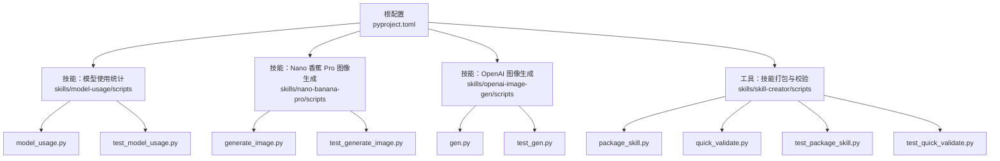
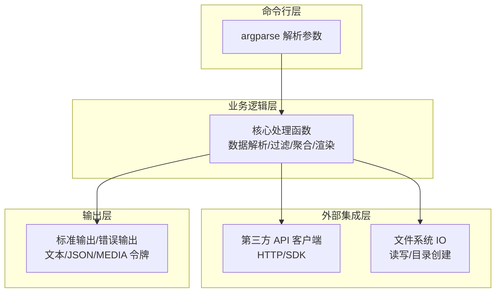
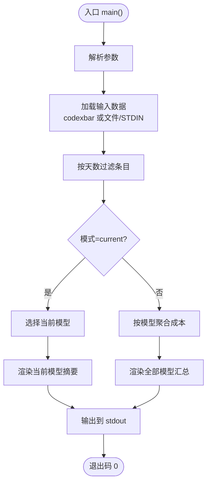
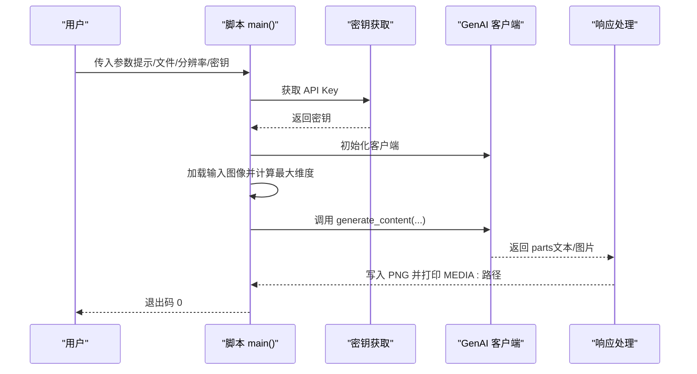
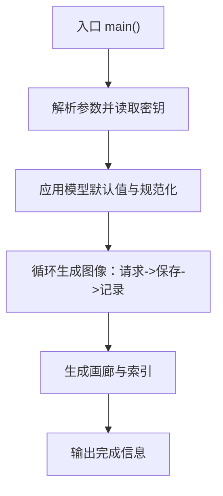
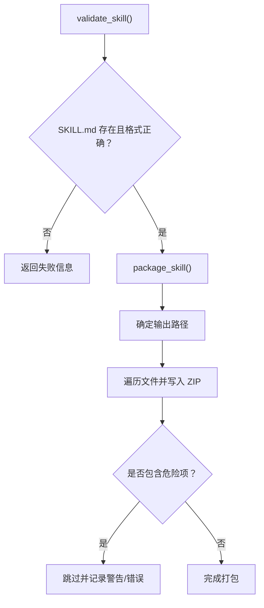

# Python脚本开发

<cite>
**本文引用的文件**
- [pyproject.toml](file://pyproject.toml)
- [model_usage.py](file://skills/model-usage/scripts/model_usage.py)
- [test_model_usage.py](file://skills/model-usage/scripts/test_model_usage.py)
- [generate_image.py](file://skills/nano-banana-pro/scripts/generate_image.py)
- [test_generate_image.py](file://skills/nano-banana-pro/scripts/test_generate_image.py)
- [gen.py](file://skills/openai-image-gen/scripts/gen.py)
- [test_gen.py](file://skills/openai-image-gen/scripts/test_gen.py)
- [package_skill.py](file://skills/skill-creator/scripts/package_skill.py)
- [quick_validate.py](file://skills/skill-creator/scripts/quick_validate.py)
- [test_package_skill.py](file://skills/skill-creator/scripts/test_package_skill.py)
- [test_quick_validate.py](file://skills/skill-creator/scripts/test_quick_validate.py)
- [SKILL.md（技能创建器）](file://skills/skill-creator/SKILL.md)
</cite>

## 目录

1. [简介](#简介)
2. [项目结构](#项目结构)
3. [核心组件](#核心组件)
4. [架构总览](#架构总览)
5. [详细组件分析](#详细组件分析)
6. [依赖分析](#依赖分析)
7. [性能考虑](#性能考虑)
8. [故障排查指南](#故障排查指南)
9. [结论](#结论)
10. [附录](#附录)

## 简介

本指南面向在 OpenClaw 技能体系中编写 Python 脚本的开发者，系统讲解脚本结构设计、输入参数处理、API 调用实现、输出结果格式化、测试框架使用、依赖管理与环境配置、错误处理与异常捕获、调试技巧以及性能优化建议。文档以仓库内真实可用的脚本为范例，覆盖图像生成、模型使用统计等典型场景，并提供可直接参考的实现路径。

## 项目结构

OpenClaw 的 Python 脚本主要位于各技能的 scripts 目录中，采用“单文件可执行脚本 + 单元测试”的组织方式，便于打包分发与独立运行。根目录提供统一的 Python 工具链与测试配置，确保风格一致与质量可控。

图表来源

- [pyproject.toml:1-11](file://pyproject.toml#L1-L11)
- [model_usage.py:1-321](file://skills/model-usage/scripts/model_usage.py#L1-L321)
- [generate_image.py:1-236](file://skills/nano-banana-pro/scripts/generate_image.py#L1-L236)
- [gen.py:1-329](file://skills/openai-image-gen/scripts/gen.py#L1-L329)
- [package_skill.py:1-140](file://skills/skill-creator/scripts/package_skill.py#L1-L140)
- [quick_validate.py:1-160](file://skills/skill-creator/scripts/quick_validate.py#L1-L160)

章节来源

- [pyproject.toml:1-11](file://pyproject.toml#L1-L11)

## 核心组件

- 模型使用统计脚本：解析本地成本日志，按模型聚合消费并支持文本/JSON 输出；具备参数解析、数据过滤、聚合与渲染能力。
- 图像生成脚本（Nano 香蕉 Pro）：通过 Gemini API 生成或编辑图像，支持分辨率与宽高比选择、多图合成、输出 PNG 并兼容 OpenClaw 媒体令牌。
- 图像生成脚本（OpenAI）：封装 OpenAI Images API 请求，支持多模型参数规范化、输出目录与画廊生成。
- 技能打包与校验：对技能目录进行安全打包与基础校验，保障分发一致性与安全性。

章节来源

- [model_usage.py:1-321](file://skills/model-usage/scripts/model_usage.py#L1-L321)
- [generate_image.py:1-236](file://skills/nano-banana-pro/scripts/generate_image.py#L1-L236)
- [gen.py:1-329](file://skills/openai-image-gen/scripts/gen.py#L1-L329)
- [package_skill.py:1-140](file://skills/skill-creator/scripts/package_skill.py#L1-L140)
- [quick_validate.py:1-160](file://skills/skill-creator/scripts/quick_validate.py#L1-L160)

## 架构总览

下图展示 OpenClaw 中 Python 脚本的通用运行时架构：命令行入口解析参数，调用业务函数处理数据，必要时发起外部 API 请求，最终将结果以文本或 JSON 输出，同时遵循 OpenClaw 的媒体附件约定。

图表来源

- [model_usage.py:246-321](file://skills/model-usage/scripts/model_usage.py#L246-L321)
- [generate_image.py:72-236](file://skills/nano-banana-pro/scripts/generate_image.py#L72-L236)
- [gen.py:243-329](file://skills/openai-image-gen/scripts/gen.py#L243-L329)

## 详细组件分析

### 组件一：模型使用统计（model_usage.py）

- 输入参数处理：支持 provider、mode、model、input、days、format、pretty 等参数，使用正整数校验与日期解析。
- 数据加载与解析：优先从 codexbar CLI 获取 JSON，其次支持从文件或 stdin 读取；提取每日条目并按天数过滤。
- 聚合与渲染：按模型聚合成本，支持当前模型自动选择与最新日成本查询；输出文本或 JSON。
- 错误处理：对外部命令失败、JSON 解析失败、输入格式不支持等情况抛出明确错误信息。

图表来源

- [model_usage.py:246-321](file://skills/model-usage/scripts/model_usage.py#L246-L321)

章节来源

- [model_usage.py:1-321](file://skills/model-usage/scripts/model_usage.py#L1-L321)
- [test_model_usage.py:1-41](file://skills/model-usage/scripts/test_model_usage.py#L1-L41)

### 组件二：图像生成（Nano 香蕉 Pro，generate_image.py）

- 参数与依赖声明：使用脚本注释声明 Python 版本与依赖，避免导入阶段的缓慢错误。
- API 密钥获取：优先命令行参数，其次环境变量，未提供则直接报错并退出。
- 输入图像处理：限制最多 14 张，计算最大维度用于自动分辨率推断。
- 输出控制：支持分辨率与宽高比；将响应中的图片保存为 PNG，必要时转换模式；输出 MEDIA: 令牌以便聊天平台自动附加。

图表来源

- [generate_image.py:72-236](file://skills/nano-banana-pro/scripts/generate_image.py#L72-L236)

章节来源

- [generate_image.py:1-236](file://skills/nano-banana-pro/scripts/generate_image.py#L1-L236)
- [test_generate_image.py:1-37](file://skills/nano-banana-pro/scripts/test_generate_image.py#L1-L37)

### 组件三：图像生成（OpenAI，gen.py）

- 参数规范化：针对不同模型支持的参数（style、background、output-format）进行校验与归一化，不支持的参数发出警告并忽略。
- 请求构建：构造请求体与头部，发送 POST 请求至 Images API；支持 b64_json 与 URL 两种返回形式。
- 输出组织：创建输出目录，生成 HTML 画廊与 prompts.json，保证 XSS 防护与文件名转义。

图表来源

- [gen.py:243-329](file://skills/openai-image-gen/scripts/gen.py#L243-L329)

章节来源

- [gen.py:1-329](file://skills/openai-image-gen/scripts/gen.py#L1-L329)
- [test_gen.py:1-141](file://skills/openai-image-gen/scripts/test_gen.py#L1-L141)

### 组件四：技能打包与校验（package_skill.py、quick_validate.py）

- 快速校验：检查 SKILL.md 存在性、前端 YAML 格式、允许键集合、名称/描述约束等；无 PyYAML 时使用回退解析器。
- 打包流程：执行校验后，遍历技能目录，排除敏感目录与符号链接，写入 ZIP 归档，避免输出文件自引用。

图表来源

- [quick_validate.py:67-150](file://skills/skill-creator/scripts/quick_validate.py#L67-L150)
- [package_skill.py:28-112](file://skills/skill-creator/scripts/package_skill.py#L28-L112)

章节来源

- [quick_validate.py:1-160](file://skills/skill-creator/scripts/quick_validate.py#L1-L160)
- [package_skill.py:1-140](file://skills/skill-creator/scripts/package_skill.py#L1-L140)
- [test_quick_validate.py:1-73](file://skills/skill-creator/scripts/test_quick_validate.py#L1-L73)
- [test_package_skill.py:1-160](file://skills/skill-creator/scripts/test_package_skill.py#L1-L160)
- [SKILL.md（技能创建器）:335-347](file://skills/skill-creator/SKILL.md#L335-L347)

## 依赖分析

- 语言与工具链
  - Python 版本要求：脚本注释中声明最低版本（如 3.10），确保跨平台兼容。
  - 代码风格与静态检查：根配置定义了 ruff 的目标版本与规则集。
  - 测试框架：pytest 配置在根目录，测试路径与文件命名规范集中管理。
- 第三方库
  - 图像生成类脚本依赖对应 SDK（如 google-genai、Pillow）与 urllib 等标准库。
  - 模型使用统计脚本依赖子进程调用外部 CLI（codexbar）与标准库。
- 安全与隔离
  - 打包时排除敏感目录与符号链接，防止路径逃逸与恶意内容进入分发包。

章节来源

- [pyproject.toml:1-11](file://pyproject.toml#L1-L11)
- [generate_image.py:2-8](file://skills/nano-banana-pro/scripts/generate_image.py#L2-L8)
- [model_usage.py:10-17](file://skills/model-usage/scripts/model_usage.py#L10-L17)

## 性能考虑

- I/O 与网络
  - 尽量批量处理与缓存必要的中间状态，避免重复解析与请求。
  - 对于大文件（图像）操作，优先使用流式处理与内存映射，减少峰值内存占用。
- 外部调用
  - 合理设置超时与重试策略，避免阻塞主线程；对不可靠接口增加指数退避。
- 输出与渲染
  - 文本/HTML 渲染尽量惰性生成，仅在必要时拼接字符串；JSON 序列化使用紧凑格式以降低体积。
- 可观测性
  - 在关键路径添加轻量级计时与计数，便于定位热点；对异常路径记录上下文信息但避免泄露敏感数据。

## 故障排查指南

- 常见问题定位
  - 参数错误：检查 argparse 的类型转换与边界条件（如正整数、日期格式）。
  - 外部依赖缺失：确认 CLI（codexbar）或环境变量（API Key）是否就绪。
  - 文件系统异常：权限不足、路径不存在、符号链接与路径逃逸被拒绝。
- 调试技巧
  - 使用最小复现：构造最小输入样例，逐步缩小范围。
  - 日志与输出：在关键节点打印上下文信息，区分 stdout 与 stderr。
  - 单元测试：针对边界条件与异常分支编写用例，验证行为一致性。
- 性能优化
  - 减少不必要的 I/O 与网络往返；对可缓存的数据进行本地缓存。
  - 对长耗时任务拆分为可中断的步骤，提供进度反馈。

章节来源

- [model_usage.py:20-48](file://skills/model-usage/scripts/model_usage.py#L20-L48)
- [generate_image.py:112-120](file://skills/nano-banana-pro/scripts/generate_image.py#L112-L120)
- [gen.py:157-207](file://skills/openai-image-gen/scripts/gen.py#L157-L207)

## 结论

OpenClaw 的 Python 脚本开发遵循“清晰的命令行接口 + 明确的输入输出 + 全面的测试覆盖 + 安全的打包流程”这一范式。通过模块化的函数设计、稳健的错误处理与严格的依赖管理，这些脚本能够稳定地集成到更广泛的自动化工作流中。建议在新脚本开发中复用现有模式，保持一致的风格与质量标准。

## 附录

- 实战示例路径
  - 图像生成（Gemini）：[generate_image.py:72-236](file://skills/nano-banana-pro/scripts/generate_image.py#L72-L236)
  - 图像生成（OpenAI）：[gen.py:243-329](file://skills/openai-image-gen/scripts/gen.py#L243-L329)
  - 模型使用统计：[model_usage.py:246-321](file://skills/model-usage/scripts/model_usage.py#L246-L321)
  - 技能打包与校验：[package_skill.py:28-112](file://skills/skill-creator/scripts/package_skill.py#L28-L112)、[quick_validate.py:67-150](file://skills/skill-creator/scripts/quick_validate.py#L67-L150)
- 测试用例路径
  - 模型使用统计测试：[test_model_usage.py:1-41](file://skills/model-usage/scripts/test_model_usage.py#L1-L41)
  - 图像生成（Nano 香蕉 Pro）测试：[test_generate_image.py:1-37](file://skills/nano-banana-pro/scripts/test_generate_image.py#L1-L37)
  - 图像生成（OpenAI）测试：[test_gen.py:1-141](file://skills/openai-image-gen/scripts/test_gen.py#L1-L141)
  - 技能打包测试：[test_package_skill.py:1-160](file://skills/skill-creator/scripts/test_package_skill.py#L1-L160)
  - 技能校验测试：[test_quick_validate.py:1-73](file://skills/skill-creator/scripts/test_quick_validate.py#L1-L73)
- 环境与配置
  - Python 工具链与测试配置：[pyproject.toml:1-11](file://pyproject.toml#L1-L11)
  - 技能打包使用说明：[SKILL.md（技能创建器）:335-347](file://skills/skill-creator/SKILL.md#L335-L347)
