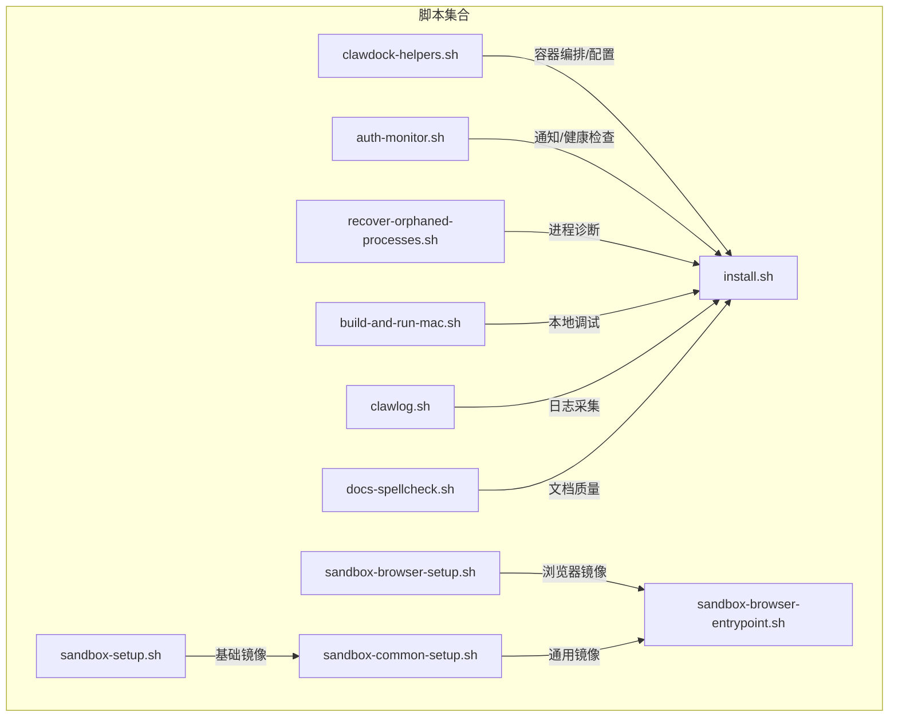
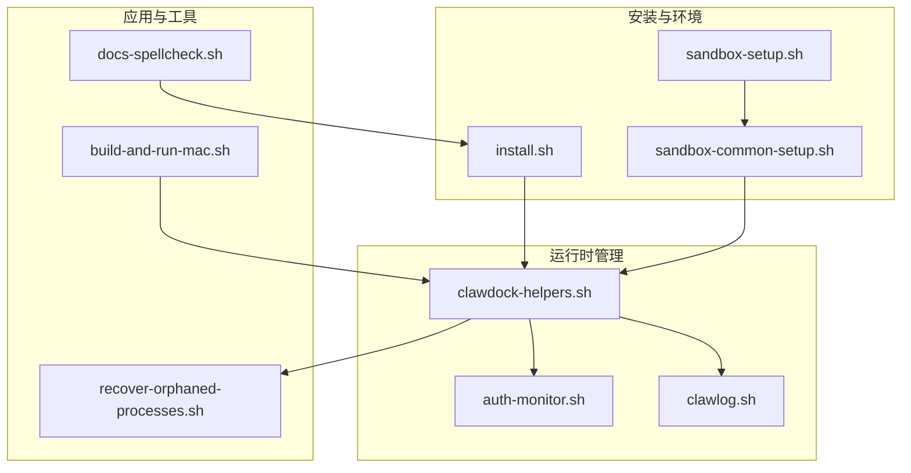
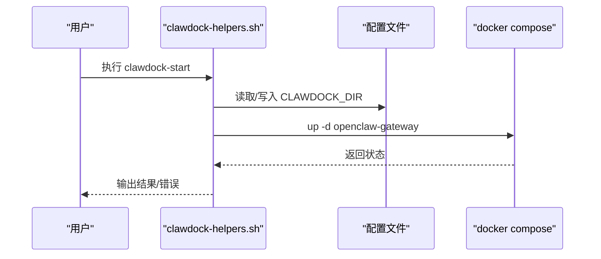
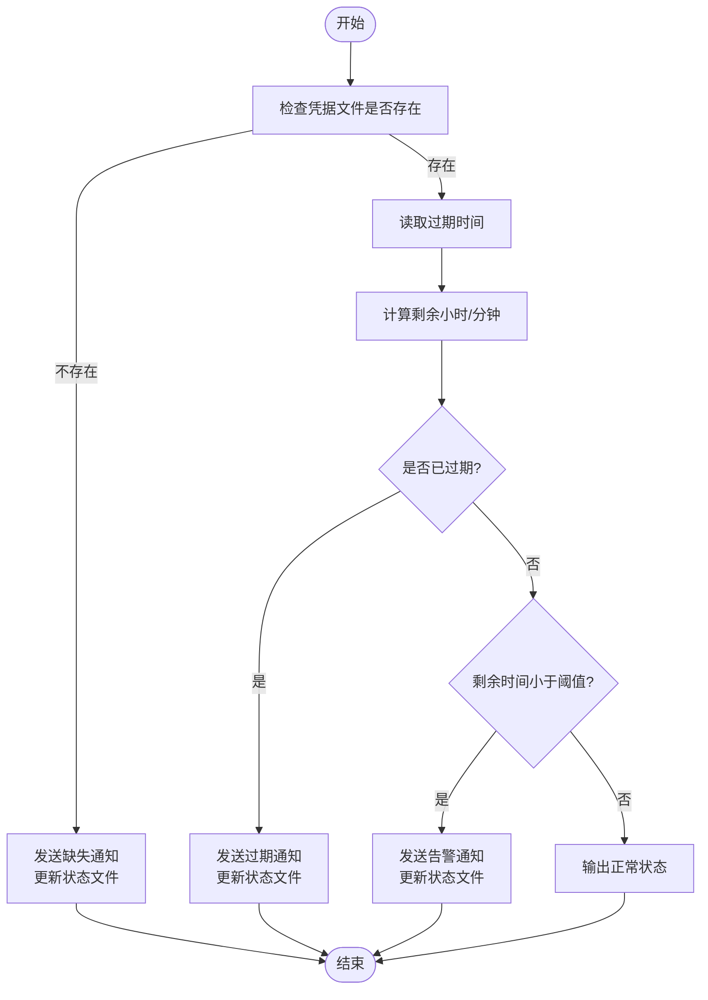
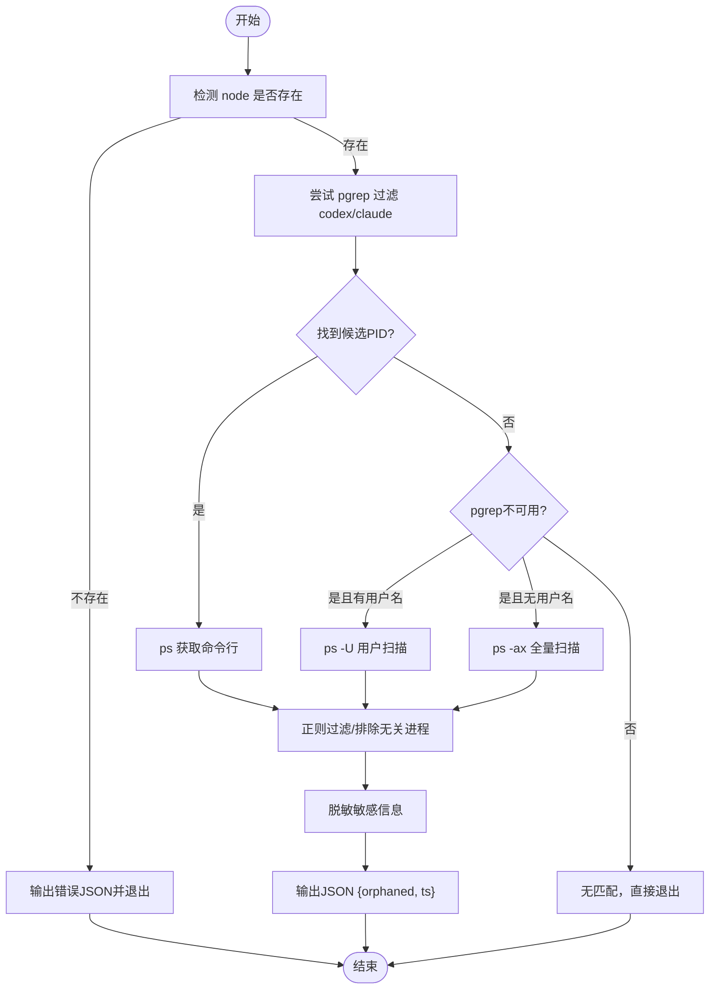
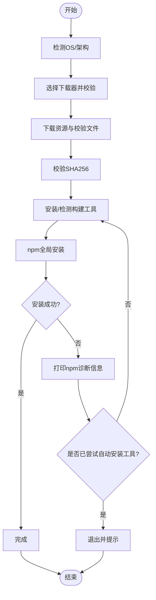
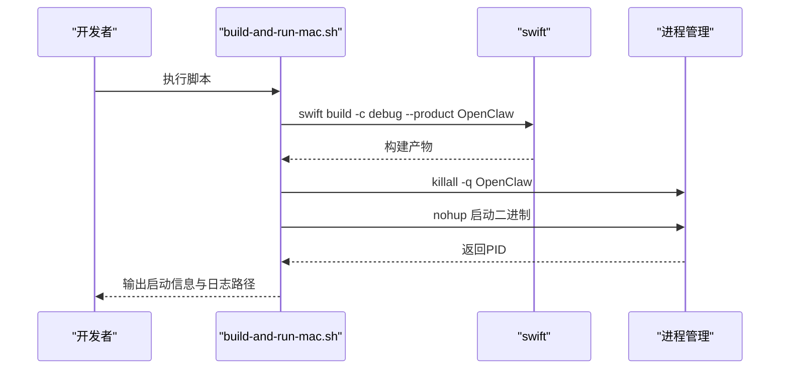
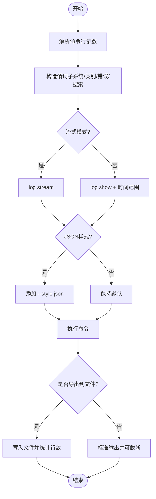
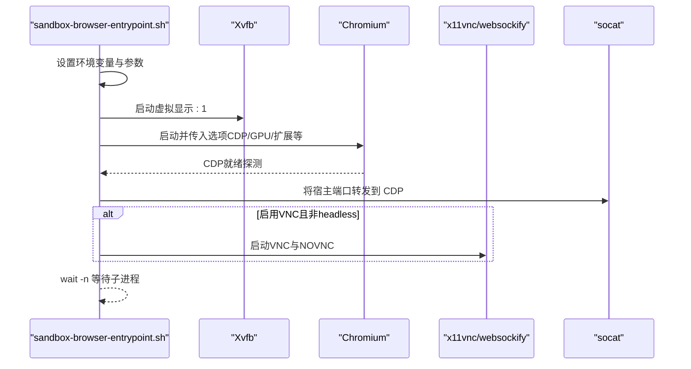
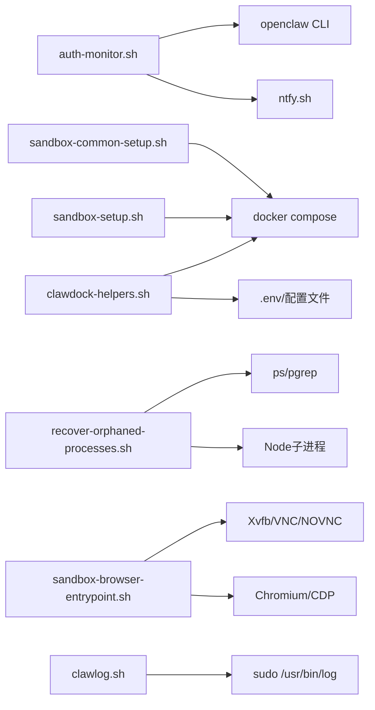

# Shell脚本开发

<cite>
**本文引用的文件**
- [scripts/shell-helpers/clawdock-helpers.sh](file://scripts/shell-helpers/clawdock-helpers.sh)
- [scripts/auth-monitor.sh](file://scripts/auth-monitor.sh)
- [scripts/recover-orphaned-processes.sh](file://scripts/recover-orphaned-processes.sh)
- [scripts/install.sh](file://scripts/install.sh)
- [scripts/build-and-run-mac.sh](file://scripts/build-and-run-mac.sh)
- [scripts/clawlog.sh](file://scripts/clawlog.sh)
- [scripts/sandbox-setup.sh](file://scripts/sandbox-setup.sh)
- [scripts/sandbox-browser-setup.sh](file://scripts/sandbox-browser-setup.sh)
- [scripts/sandbox-common-setup.sh](file://scripts/sandbox-common-setup.sh)
- [scripts/sandbox-browser-entrypoint.sh](file://scripts/sandbox-browser-entrypoint.sh)
- [scripts/docs-spellcheck.sh](file://scripts/docs-spellcheck.sh)
</cite>

## 目录

1. [简介](#简介)
2. [项目结构](#项目结构)
3. [核心组件](#核心组件)
4. [架构总览](#架构总览)
5. [详细组件分析](#详细组件分析)
6. [依赖关系分析](#依赖关系分析)
7. [性能考量](#性能考量)
8. [故障排查指南](#故障排查指南)
9. [结论](#结论)
10. [附录](#附录)

## 简介

本指南面向希望在OpenClaw生态中进行Shell脚本开发与运维的工程师，系统讲解如何使用Bash实现系统命令调用、进程管理、文件操作、参数处理、条件判断、循环控制与函数定义，并结合仓库中的真实脚本示例（如容器化网关管理、认证过期监控、日志采集、沙箱浏览器入口、安装器等）说明调试、错误处理与性能优化策略。同时覆盖跨平台兼容性与安全编程实践，帮助你在多平台环境中稳定运行Shell自动化任务。

## 项目结构

仓库中与Shell脚本开发直接相关的核心目录与文件如下：

- scripts/shell-helpers/clawdock-helpers.sh：Docker容器网关的便捷操作封装，演示参数解析、子命令分发、环境读取与容器交互。
- scripts/auth-monitor.sh：定时任务脚本，用于检测第三方认证状态并在临期或过期时发送通知。
- scripts/recover-orphaned-processes.sh：扫描并诊断孤儿进程，输出JSON结果，展示复杂流程控制与跨语言协作。
- scripts/install.sh：跨平台安装器，包含终端交互、下载器选择、包管理器适配、错误诊断与重试逻辑。
- scripts/build-and-run-mac.sh：本地Swift应用构建与启动脚本，体现进程管理与日志输出。
- scripts/clawlog.sh：macOS统一日志工具，展示高级过滤、时间范围、搜索、导出与sudo权限处理。
- scripts/sandbox-\*.sh系列：Docker沙箱镜像构建与浏览器入口脚本，涵盖环境变量、端口映射、图形与VNC支持。
- scripts/docs-spellcheck.sh：文档拼写检查脚本，演示外部工具检测与自动安装流程。

**图表来源**

- [scripts/shell-helpers/clawdock-helpers.sh:1-418](file://scripts/shell-helpers/clawdock-helpers.sh#L1-L418)
- [scripts/auth-monitor.sh:1-90](file://scripts/auth-monitor.sh#L1-L90)
- [scripts/recover-orphaned-processes.sh:1-192](file://scripts/recover-orphaned-processes.sh#L1-L192)
- [scripts/install.sh:1-800](file://scripts/install.sh#L1-L800)
- [scripts/build-and-run-mac.sh:1-19](file://scripts/build-and-run-mac.sh#L1-L19)
- [scripts/clawlog.sh:1-322](file://scripts/clawlog.sh#L1-L322)
- [scripts/sandbox-setup.sh:1-8](file://scripts/sandbox-setup.sh#L1-L8)
- [scripts/sandbox-browser-setup.sh:1-8](file://scripts/sandbox-browser-setup.sh#L1-L8)
- [scripts/sandbox-common-setup.sh:1-55](file://scripts/sandbox-common-setup.sh#L1-L55)
- [scripts/sandbox-browser-entrypoint.sh:1-128](file://scripts/sandbox-browser-entrypoint.sh#L1-L128)
- [scripts/docs-spellcheck.sh:1-45](file://scripts/docs-spellcheck.sh#L1-L45)

**章节来源**

- [scripts/shell-helpers/clawdock-helpers.sh:1-418](file://scripts/shell-helpers/clawdock-helpers.sh#L1-L418)
- [scripts/install.sh:1-800](file://scripts/install.sh#L1-L800)

## 核心组件

- 容器化网关助手（clawdock-helpers.sh）
  - 功能：封装容器启动/停止/重启、日志查看、状态查询、进入容器、执行CLI命令、健康检查、令牌配置、设备配对等。
  - 关键点：参数校验、环境变量读取、配置持久化、容器内命令执行、跨平台打开浏览器。
- 认证过期监控（auth-monitor.sh）
  - 功能：周期性检查第三方认证剩余有效期，按阈值发出通知；避免频繁重复提醒。
  - 关键点：状态文件记录、时间计算、外部工具调用（curl、jq）、条件分支与优先级。
- 孤儿进程恢复（recover-orphaned-processes.sh）
  - 功能：扫描可能遗留的编码代理进程，输出JSON并清洗敏感信息。
  - 关键点：pgrep/ps组合、正则过滤、跨平台路径解析、Node子进程调用与错误兜底。
- 跨平台安装器（install.sh）
  - 功能：检测系统与架构、选择下载器、安装依赖、引导交互式安装、错误诊断与重试。
  - 关键点：颜色输出、TTY检测、包管理器适配、自动安装缺失构建工具、npm失败诊断。
- macOS本地构建与运行（build-and-run-mac.sh）
  - 功能：Swift构建、终止旧进程、后台启动、记录PID与日志。
  - 关键点：进程管理、nohup与后台启动、日志重定向。
- 日志采集工具（clawlog.sh）
  - 功能：macOS统一日志系统下的日志筛选、流式输出、导出、错误模式、服务器输出过滤。
  - 关键点：sudo免密检测、谓词构造、时间范围、搜索与分类过滤、JSON输出。
- 沙箱与浏览器（sandbox-\*.sh）
  - 功能：构建基础/通用沙箱镜像，设置DISPLAY与Chrome参数，启用VNC/NOVNC，暴露CDP端口。
  - 关键点：环境变量注入、端口计算与转发、Xvfb/VNC服务、进程等待与清理。
- 文档拼写检查（docs-spellcheck.sh）
  - 功能：自动检测codespell可用性，按字典与忽略列表执行检查。
  - 关键点：外部工具检测与安装、用户目录pip路径解析。

**章节来源**

- [scripts/shell-helpers/clawdock-helpers.sh:160-304](file://scripts/shell-helpers/clawdock-helpers.sh#L160-L304)
- [scripts/auth-monitor.sh:68-89](file://scripts/auth-monitor.sh#L68-L89)
- [scripts/recover-orphaned-processes.sh:32-38](file://scripts/recover-orphaned-processes.sh#L32-L38)
- [scripts/install.sh:253-269](file://scripts/install.sh#L253-L269)
- [scripts/build-and-run-mac.sh:9-18](file://scripts/build-and-run-mac.sh#L9-L18)
- [scripts/clawlog.sh:149-218](file://scripts/clawlog.sh#L149-L218)
- [scripts/sandbox-browser-entrypoint.sh:19-97](file://scripts/sandbox-browser-entrypoint.sh#L19-L97)
- [scripts/docs-spellcheck.sh:23-44](file://scripts/docs-spellcheck.sh#L23-L44)

## 架构总览

下图展示了Shell脚本在OpenClaw中的典型工作流：安装器负责环境准备，容器助手负责网关生命周期管理，监控脚本负责健康预警，日志脚本负责问题定位，沙箱脚本负责隔离与浏览器能力。

**图表来源**

- [scripts/install.sh:1-800](file://scripts/install.sh#L1-L800)
- [scripts/sandbox-setup.sh:1-8](file://scripts/sandbox-setup.sh#L1-L8)
- [scripts/sandbox-common-setup.sh:1-55](file://scripts/sandbox-common-setup.sh#L1-L55)
- [scripts/shell-helpers/clawdock-helpers.sh:1-418](file://scripts/shell-helpers/clawdock-helpers.sh#L1-L418)
- [scripts/auth-monitor.sh:1-90](file://scripts/auth-monitor.sh#L1-L90)
- [scripts/clawlog.sh:1-322](file://scripts/clawlog.sh#L1-L322)
- [scripts/build-and-run-mac.sh:1-19](file://scripts/build-and-run-mac.sh#L1-L19)
- [scripts/recover-orphaned-processes.sh:1-192](file://scripts/recover-orphaned-processes.sh#L1-L192)
- [scripts/docs-spellcheck.sh:1-45](file://scripts/docs-spellcheck.sh#L1-L45)

## 详细组件分析

### 组件A：容器网关助手（clawdock-helpers.sh）

- 设计要点
  - 命令分发：通过函数名映射到具体动作（启动、停止、日志、状态、进入容器、执行CLI、健康检查、令牌配置、设备配对等）。
  - 配置持久化：将项目根目录保存至用户配置文件，避免每次手动指定。
  - 容器交互：基于docker compose文件动态组装参数，支持额外配置文件叠加。
  - 令牌与健康：从环境文件读取令牌，注入容器执行健康检查；提供一键修复令牌流程。
  - 用户引导：提供帮助菜单与分步指引，降低上手成本。
- 参数与条件
  - 使用位置参数与内部函数组合实现子命令解析；通过环境变量控制行为（如是否显示警告过滤）。
- 循环与函数
  - 自动检测常见路径并提示确认；循环等待容器就绪；多处函数拆分职责。
- 错误处理
  - 对缺失文件、无效路径、容器命令失败等情况返回非零退出码；对用户输入进行简单校验。
- 性能与健壮性
  - 优先使用pgrep减少全量进程扫描；对容器命令采用延迟加载与缓存配置。

**图表来源**

- [scripts/shell-helpers/clawdock-helpers.sh:160-178](file://scripts/shell-helpers/clawdock-helpers.sh#L160-L178)

**章节来源**

- [scripts/shell-helpers/clawdock-helpers.sh:74-134](file://scripts/shell-helpers/clawdock-helpers.sh#L74-L134)
- [scripts/shell-helpers/clawdock-helpers.sh:160-275](file://scripts/shell-helpers/clawdock-helpers.sh#L160-L275)

### 组件B：认证过期监控（auth-monitor.sh）

- 设计要点
  - 周期性检查第三方认证剩余时间，根据阈值触发不同优先级的通知。
  - 通过状态文件限制通知频率，避免刷屏。
  - 支持多种通知渠道（OpenClaw消息与ntfy推送），并记录最近一次通知时间。
- 参数与条件
  - 通过环境变量配置告警阈值、通知目标；使用jq解析认证过期时间。
- 流程控制
  - 分支处理“已过期”“即将过期”“正常”三种情形；分别输出不同优先级消息。
- 错误处理
  - 缺少凭据文件时立即报错并退出；网络请求失败时静默跳过。

**图表来源**

- [scripts/auth-monitor.sh:68-89](file://scripts/auth-monitor.sh#L68-L89)

**章节来源**

- [scripts/auth-monitor.sh:1-90](file://scripts/auth-monitor.sh#L1-L90)

### 组件C：孤儿进程恢复（recover-orphaned-processes.sh）

- 设计要点
  - 使用pgrep预筛选候选PID，再通过ps精确获取命令行；排除无关进程。
  - 通过Node子进程调用系统工具，收集进程启动时间、工作目录、命令行等信息。
  - 对命令行中的敏感信息进行脱敏，避免泄露。
- 参数与条件
  - 无外部参数；通过环境变量USER/LANG等辅助识别当前用户。
- 流程控制
  - 先尝试pgrep，若不可用则回退到用户级扫描或全量扫描；最后统一清洗与输出。
- 错误处理
  - 当缺少必要工具时输出带时间戳的JSON错误对象；对缓冲区异常进行类型判断与降级。

**图表来源**

- [scripts/recover-orphaned-processes.sh:99-191](file://scripts/recover-orphaned-processes.sh#L99-L191)

**章节来源**

- [scripts/recover-orphaned-processes.sh:1-192](file://scripts/recover-orphaned-processes.sh#L1-L192)

### 组件D：跨平台安装器（install.sh）

- 设计要点
  - 检测操作系统与架构，选择合适的下载器（curl/wget），并进行SHA校验。
  - 交互式安装：通过TTY检测决定是否启用可视化UI（gum），否则使用颜色输出。
  - 包管理器适配：针对Linux发行版自动安装构建工具链（make/cmake/gcc/python等）。
  - npm失败诊断：自动识别缺失构建工具并引导安装，失败时打印详细诊断信息。
- 参数与条件
  - 通过环境变量控制版本、通道、是否跳过引导等；内部函数实现条件分支。
- 流程控制
  - 多阶段安装计划（检测、下载、校验、安装、后处理），每个步骤可静默或带进度条。
- 错误处理
  - 对下载器缺失、包管理器不支持、npm安装失败等情况给出明确提示与建议。

**图表来源**

- [scripts/install.sh:253-269](file://scripts/install.sh#L253-L269)
- [scripts/install.sh:568-620](file://scripts/install.sh#L568-L620)
- [scripts/install.sh:784-800](file://scripts/install.sh#L784-L800)

**章节来源**

- [scripts/install.sh:1-800](file://scripts/install.sh#L1-L800)

### 组件E：macOS本地构建与运行（build-and-run-mac.sh）

- 设计要点
  - Swift构建、终止旧进程、后台启动应用并将日志重定向到文件。
- 参数与条件
  - 无外部参数；通过固定产品名与构建路径组织流程。
- 流程控制
  - 顺序执行：构建 → 杀进程 → 启动 → 记录PID与日志路径。

**图表来源**

- [scripts/build-and-run-mac.sh:9-18](file://scripts/build-and-run-mac.sh#L9-L18)

**章节来源**

- [scripts/build-and-run-mac.sh:1-19](file://scripts/build-and-run-mac.sh#L1-L19)

### 组件F：日志采集工具（clawlog.sh）

- 设计要点
  - 基于macOS统一日志系统，支持时间范围、类别过滤、错误模式、搜索、导出、JSON输出。
  - 通过sudo免密检测避免频繁密码提示；提供详尽的帮助与示例。
- 参数与条件
  - 解析短选项与长选项，构造谓词字符串；对用户输入进行转义以防止注入。
- 流程控制
  - 分支处理流式与非流式两种模式；根据tail开关决定截断输出。
- 错误处理
  - 对未知选项、sudo权限不足、无匹配日志等情况给出明确提示。

**图表来源**

- [scripts/clawlog.sh:155-218](file://scripts/clawlog.sh#L155-L218)
- [scripts/clawlog.sh:240-284](file://scripts/clawlog.sh#L240-L284)

**章节来源**

- [scripts/clawlog.sh:1-322](file://scripts/clawlog.sh#L1-L322)

### 组件G：沙箱与浏览器（sandbox-\*.sh）

- 设计要点
  - 基础镜像与通用镜像构建脚本：支持自定义包列表、安装pnpm/bun、Linuxbrew路径、最终用户等。
  - 浏览器入口脚本：设置DISPLAY、用户数据目录、远程调试端口、禁用扩展与GPU标志、启用VNC/NOVNC、端口转发与进程等待。
- 参数与条件
  - 通过环境变量控制端口、头像模式、禁用标志、VNC密码等；对布尔值进行大小写与取值兼容。
- 流程控制
  - 端口计算与范围绑定、Xvfb/VNC/NOVNC服务启动、Chrome进程启动与健康探测、进程等待回收。

**图表来源**

- [scripts/sandbox-browser-entrypoint.sh:19-127](file://scripts/sandbox-browser-entrypoint.sh#L19-L127)

**章节来源**

- [scripts/sandbox-setup.sh:1-8](file://scripts/sandbox-setup.sh#L1-L8)
- [scripts/sandbox-browser-setup.sh:1-8](file://scripts/sandbox-browser-setup.sh#L1-L8)
- [scripts/sandbox-common-setup.sh:1-55](file://scripts/sandbox-common-setup.sh#L1-L55)
- [scripts/sandbox-browser-entrypoint.sh:1-128](file://scripts/sandbox-browser-entrypoint.sh#L1-L128)

### 组件H：文档拼写检查（docs-spellcheck.sh）

- 设计要点
  - 检测codespell是否存在，不存在则尝试通过python3 -m pip安装到用户目录；支持写回修正。
- 参数与条件
  - 支持--write模式；通过字典与忽略列表提升准确性。
- 错误处理
  - 若工具始终不可用，输出错误并退出。

**章节来源**

- [scripts/docs-spellcheck.sh:1-45](file://scripts/docs-spellcheck.sh#L1-L45)

## 依赖关系分析

- 内部依赖
  - clawdock-helpers.sh依赖docker compose配置文件与环境变量；与install.sh共享容器化部署思路。
  - auth-monitor.sh依赖第三方认证凭据与通知工具；与clawlog.sh共同构成监控与可观测性闭环。
  - recover-orphaned-processes.sh依赖ps/pgrep与Node子进程；与install.sh在工具链准备方面互补。
  - sandbox-\*.sh依赖Docker与Xvfb/VNC/NOVNC工具链；与clawdock-helpers.sh在容器运行层面协同。
- 外部依赖
  - curl/wget/jq/sudo/log等系统工具；macOS上的Xcode命令行工具；Linux上的包管理器与构建工具链。
- 可能的耦合风险
  - 依赖工具版本差异导致行为不一致；sudo免密策略不当引发权限问题；容器端口冲突影响调试。

**图表来源**

- [scripts/auth-monitor.sh:44-62](file://scripts/auth-monitor.sh#L44-L62)
- [scripts/shell-helpers/clawdock-helpers.sh:137-144](file://scripts/shell-helpers/clawdock-helpers.sh#L137-L144)
- [scripts/recover-orphaned-processes.sh:102-122](file://scripts/recover-orphaned-processes.sh#L102-L122)
- [scripts/sandbox-browser-entrypoint.sh:38-97](file://scripts/sandbox-browser-entrypoint.sh#L38-L97)
- [scripts/clawlog.sh:288-320](file://scripts/clawlog.sh#L288-L320)

**章节来源**

- [scripts/auth-monitor.sh:1-90](file://scripts/auth-monitor.sh#L1-L90)
- [scripts/shell-helpers/clawdock-helpers.sh:1-418](file://scripts/shell-helpers/clawdock-helpers.sh#L1-L418)
- [scripts/recover-orphaned-processes.sh:1-192](file://scripts/recover-orphaned-processes.sh#L1-L192)
- [scripts/sandbox-browser-entrypoint.sh:1-128](file://scripts/sandbox-browser-entrypoint.sh#L1-L128)
- [scripts/clawlog.sh:1-322](file://scripts/clawlog.sh#L1-L322)

## 性能考量

- I/O与网络
  - 使用管道与临时文件减少中间变量开销；在日志导出场景中先执行命令再截断，避免不必要的内存复制。
- 进程与并发
  - 在沙箱入口脚本中使用wait -n等待子进程，避免僵尸进程；合理设置渲染进程数量上限以平衡性能与稳定性。
- 资源占用
  - 在容器与沙箱场景中禁用不必要的GPU与扩展，降低资源消耗；通过端口复用与范围绑定避免冲突。
- 可观测性
  - 使用统一日志与健康检查接口，缩短问题定位时间；在安装器中保留详细日志以便回溯。

[本节为通用指导，无需特定文件引用]

## 故障排查指南

- 容器相关
  - 症状：容器无法启动或找不到compose文件
  - 排查：确认CLAWDOCK_DIR与compose文件路径；检查额外配置文件是否存在；查看容器状态与日志。
  - 参考
    - [scripts/shell-helpers/clawdock-helpers.sh:74-134](file://scripts/shell-helpers/clawdock-helpers.sh#L74-L134)
    - [scripts/shell-helpers/clawdock-helpers.sh:137-144](file://scripts/shell-helpers/clawdock-helpers.sh#L137-L144)
- 认证过期
  - 症状：收到过期或即将过期通知
  - 排查：检查凭据文件是否存在与格式正确；核对阈值配置；确认通知渠道可用。
  - 参考
    - [scripts/auth-monitor.sh:68-89](file://scripts/auth-monitor.sh#L68-L89)
- 孤儿进程
  - 症状：发现遗留的编码代理进程
  - 排查：运行诊断脚本获取JSON输出；检查命令行是否包含敏感信息；确认系统工具可用。
  - 参考
    - [scripts/recover-orphaned-processes.sh:32-38](file://scripts/recover-orphaned-processes.sh#L32-L38)
    - [scripts/recover-orphaned-processes.sh:153-183](file://scripts/recover-orphaned-processes.sh#L153-L183)
- 安装失败
  - 症状：npm安装失败或构建工具缺失
  - 排查：查看npm诊断日志；根据提示自动安装缺失工具；确认包管理器可用。
  - 参考
    - [scripts/install.sh:743-782](file://scripts/install.sh#L743-L782)
    - [scripts/install.sh:656-672](file://scripts/install.sh#L656-L672)
- 日志不可见
  - 症状：需要sudo权限才能看到完整日志
  - 排查：配置sudo免密；检查子系统与类别过滤；确认时间范围与搜索条件。
  - 参考
    - [scripts/clawlog.sh:20-33](file://scripts/clawlog.sh#L20-L33)
    - [scripts/clawlog.sh:288-320](file://scripts/clawlog.sh#L288-L320)
- 沙箱与浏览器
  - 症状：端口冲突、VNC不可用、CDP连接失败
  - 排查：调整端口与范围；检查Xvfb/VNC/NOVNC服务；验证Chrome启动参数。
  - 参考
    - [scripts/sandbox-browser-entrypoint.sh:48-52](file://scripts/sandbox-browser-entrypoint.sh#L48-L52)
    - [scripts/sandbox-browser-entrypoint.sh:106-127](file://scripts/sandbox-browser-entrypoint.sh#L106-L127)

**章节来源**

- [scripts/shell-helpers/clawdock-helpers.sh:74-134](file://scripts/shell-helpers/clawdock-helpers.sh#L74-L134)
- [scripts/auth-monitor.sh:68-89](file://scripts/auth-monitor.sh#L68-L89)
- [scripts/recover-orphaned-processes.sh:32-38](file://scripts/recover-orphaned-processes.sh#L32-L38)
- [scripts/install.sh:743-782](file://scripts/install.sh#L743-L782)
- [scripts/clawlog.sh:20-33](file://scripts/clawlog.sh#L20-L33)
- [scripts/sandbox-browser-entrypoint.sh:48-52](file://scripts/sandbox-browser-entrypoint.sh#L48-L52)

## 结论

通过以上组件与流程的梳理，你可以将Shell脚本作为OpenClaw生态中的基础设施：从安装准备、容器编排、健康监控、日志采集到沙箱与浏览器能力，形成一套完整的自动化与可观测体系。遵循本文的参数处理、条件判断、循环控制与函数定义范式，配合错误处理与性能优化策略，可以在多平台环境下稳定地交付高质量的Shell自动化方案。

[本节为总结，无需特定文件引用]

## 附录

- 实践建议
  - 使用set -euo pipefail统一错误处理策略；为关键路径添加超时与重试。
  - 对外部工具进行存在性检查与降级策略；在TTY不可用时切换到非交互模式。
  - 在输出敏感信息前进行脱敏处理；仅在必要时使用sudo并最小化权限范围。
  - 通过环境变量与配置文件解耦行为；为常用操作提供帮助与示例。
- 参考文件
  - [scripts/shell-helpers/clawdock-helpers.sh:1-418](file://scripts/shell-helpers/clawdock-helpers.sh#L1-L418)
  - [scripts/auth-monitor.sh:1-90](file://scripts/auth-monitor.sh#L1-L90)
  - [scripts/recover-orphaned-processes.sh:1-192](file://scripts/recover-orphaned-processes.sh#L1-L192)
  - [scripts/install.sh:1-800](file://scripts/install.sh#L1-L800)
  - [scripts/build-and-run-mac.sh:1-19](file://scripts/build-and-run-mac.sh#L1-L19)
  - [scripts/clawlog.sh:1-322](file://scripts/clawlog.sh#L1-L322)
  - [scripts/sandbox-setup.sh:1-8](file://scripts/sandbox-setup.sh#L1-L8)
  - [scripts/sandbox-browser-setup.sh:1-8](file://scripts/sandbox-browser-setup.sh#L1-L8)
  - [scripts/sandbox-common-setup.sh:1-55](file://scripts/sandbox-common-setup.sh#L1-L55)
  - [scripts/sandbox-browser-entrypoint.sh:1-128](file://scripts/sandbox-browser-entrypoint.sh#L1-L128)
  - [scripts/docs-spellcheck.sh:1-45](file://scripts/docs-spellcheck.sh#L1-L45)
