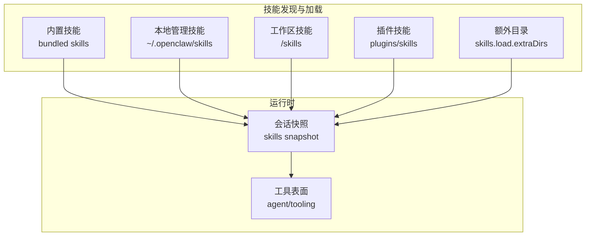
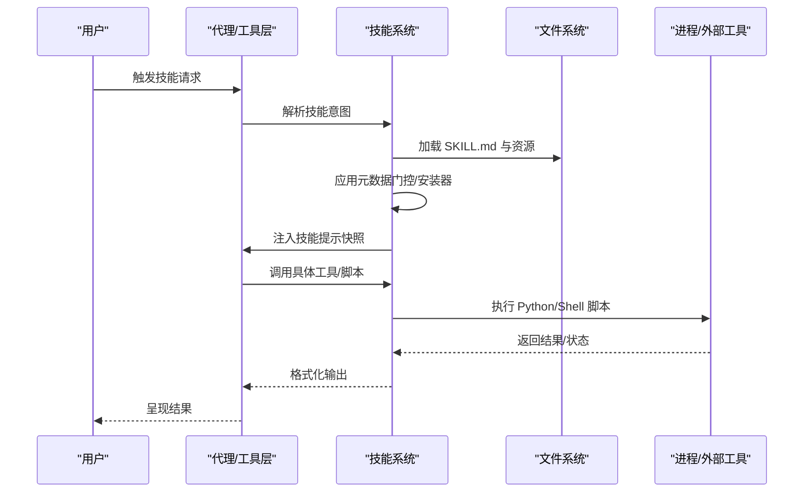
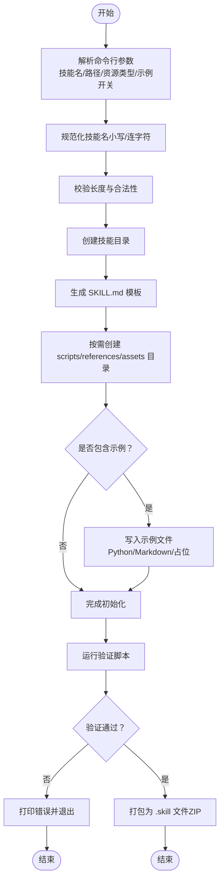
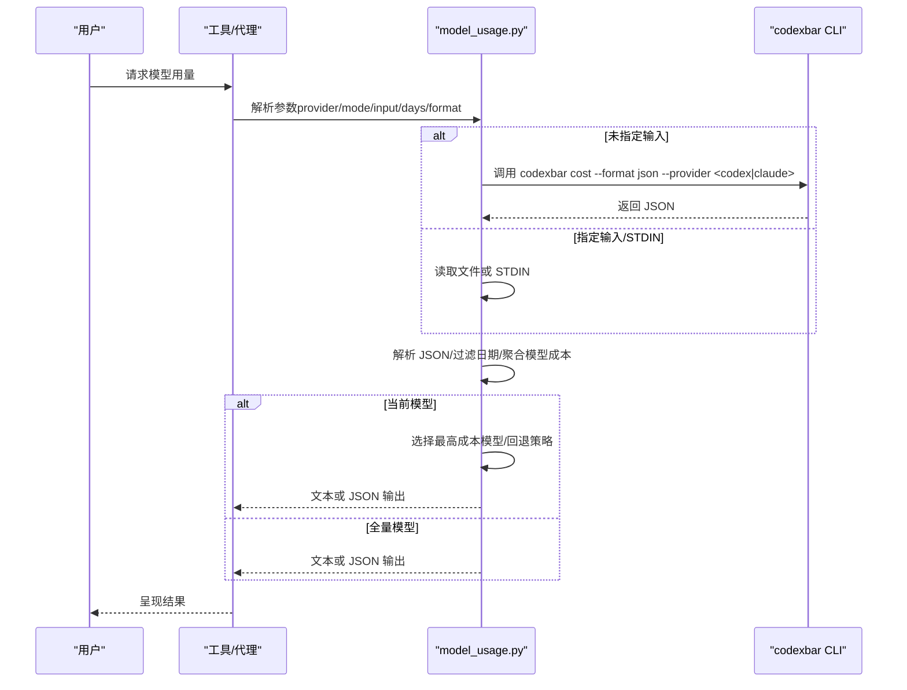
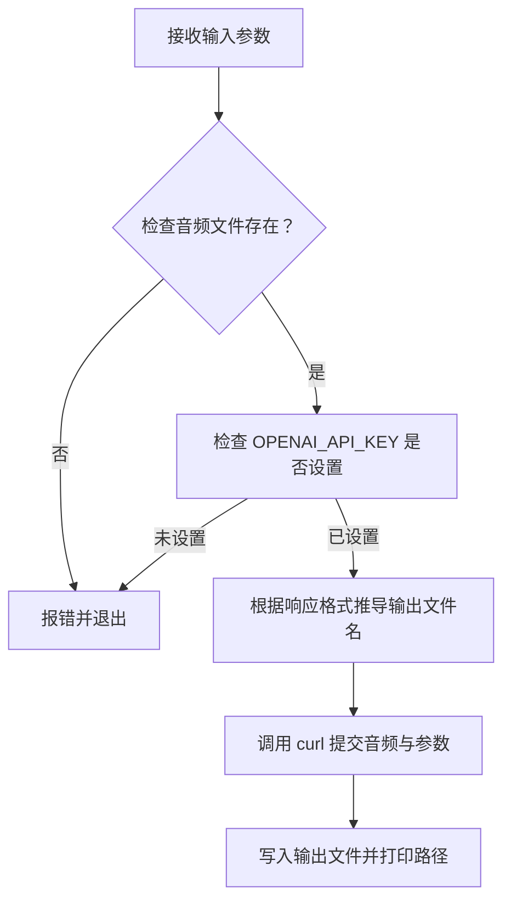
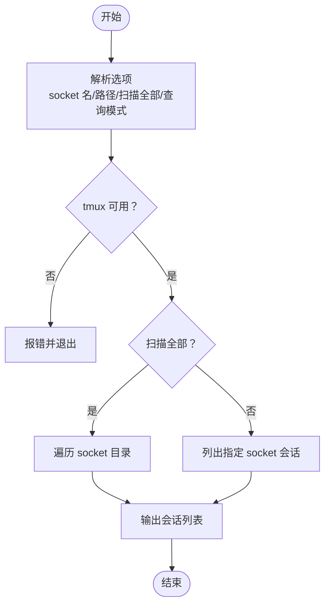
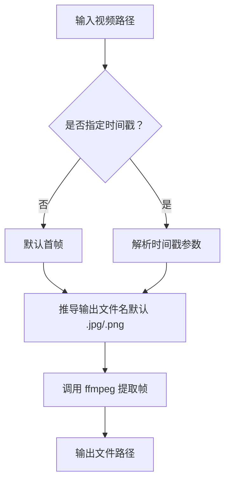
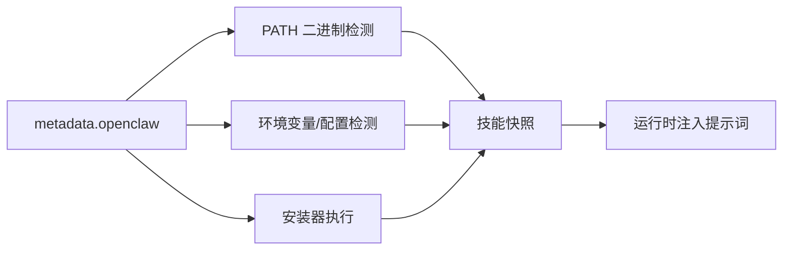

# 技能代码开发

<cite>
**本文档引用的文件**
- [README.md](file://README.md)
- [creating-skills.md](file://docs/tools/creating-skills.md)
- [skills.md](file://docs/tools/skills.md)
- [SKILL.md](file://skills/skill-creator/SKILL.md)
- [init_skill.py](file://skills/skill-creator/scripts/init_skill.py)
- [package_skill.py](file://skills/skill-creator/scripts/package_skill.py)
- [model-usage/SKILL.md](file://skills/model-usage/SKILL.md)
- [model_usage.py](file://skills/model-usage/scripts/model_usage.py)
- [openai-whisper-api/SKILL.md](file://skills/openai-whisper-api/SKILL.md)
- [transcribe.sh](file://skills/openai-whisper-api/scripts/transcribe.sh)
- [tmux/SKILL.md](file://skills/tmux/SKILL.md)
- [find-sessions.sh](file://skills/tmux/scripts/find-sessions.sh)
- [video-frames/SKILL.md](file://skills/video-frames/SKILL.md)
</cite>

## 目录

1. [简介](#简介)
2. [项目结构](#项目结构)
3. [核心组件](#核心组件)
4. [架构总览](#架构总览)
5. [详细组件分析](#详细组件分析)
6. [依赖关系分析](#依赖关系分析)
7. [性能考量](#性能考量)
8. [故障排查指南](#故障排查指南)
9. [结论](#结论)
10. [附录](#附录)

## 简介

本指南面向在 OpenClaw 平台上开发“技能（Skills）”的工程师与高级用户，系统讲解如何编写技能的核心代码逻辑，覆盖 Python 脚本开发、Shell 脚本编写以及多语言混合开发的最佳实践。文档从技能函数的设计原则出发，阐述输入参数处理、输出结果格式化与错误处理机制，并通过多种类型技能（API 调用、文件操作、系统命令等）的实现示例，帮助读者建立可复用、可维护、可测试的技能工程体系。

## 项目结构

OpenClaw 的技能生态由“技能目录 + SKILL.md + 可选脚本/资源”构成，支持三种加载优先级：工作区技能（最高）→ 本地管理技能 → 内置技能（最低）。技能通过元数据进行环境/配置/二进制依赖的门控，运行时按会话快照缓存，支持热更新。

图示来源

- [skills.md:13-40](file://docs/tools/skills.md#L13-L40)
- [skills.md:254-267](file://docs/tools/skills.md#L254-L267)

章节来源

- [skills.md:13-40](file://docs/tools/skills.md#L13-L40)
- [skills.md:254-267](file://docs/tools/skills.md#L254-L267)

## 核心组件

- 技能定义文件 SKILL.md：采用 YAML 前言元数据 + Markdown 指令体，用于向模型说明“何时使用、如何使用、可用资源”。前言元数据包含 name、description、homepage、user-invocable、command-dispatch 等关键字段；指令体描述工作流、参考与资源定位。
- 可执行脚本：Python（数据处理、API 调用、日志解析）、Shell（系统命令封装、外部工具集成），通过 {baseDir} 占位符引用技能根路径，避免硬编码。
- 资源组织：scripts/（可执行代码）、references/（按需加载的参考文档）、assets/（模板与输出素材）。
- 元数据门控：通过 metadata.openclaw.requires 配置 PATH 工具、环境变量、配置项，结合安装器清单实现跨平台自动安装。

章节来源

- [creating-skills.md:13-59](file://docs/tools/creating-skills.md#L13-L59)
- [skills.md:78-105](file://docs/tools/skills.md#L78-L105)
- [skills.md:106-187](file://docs/tools/skills.md#L106-L187)

## 架构总览

技能在运行时的生命周期：加载阶段（扫描、解析、门控、安装器执行）、会话阶段（快照注入提示词、按需加载资源）、执行阶段（调用工具或脚本、返回结果）。

图示来源

- [skills.md:242-247](file://docs/tools/skills.md#L242-L247)
- [skills.md:230-241](file://docs/tools/skills.md#L230-L241)

章节来源

- [skills.md:230-247](file://docs/tools/skills.md#L230-L247)

## 详细组件分析

### 组件A：技能初始化与打包流水线（Python）

该组件提供“从零到一”的脚手架能力，包含规范化命名、模板生成、资源目录创建、示例文件注入、验证与打包为 .skill 文件。

图示来源

- [init_skill.py:255-317](file://skills/skill-creator/scripts/init_skill.py#L255-L317)
- [package_skill.py:28-112](file://skills/skill-creator/scripts/package_skill.py#L28-L112)

章节来源

- [init_skill.py:194-317](file://skills/skill-creator/scripts/init_skill.py#L194-L317)
- [package_skill.py:28-112](file://skills/skill-creator/scripts/package_skill.py#L28-L112)

### 组件B：模型用量统计（Python 脚本）

该技能演示了“外部 CLI + JSON 解析 + 结构化输出”的典型模式：通过 codexbar CLI 获取成本数据，解析每日条目，聚合模型成本，支持当前模型与全量模型两种模式，并可输出文本或 JSON。

图示来源

- [model_usage.py:246-320](file://skills/model-usage/scripts/model_usage.py#L246-L320)
- [model-usage/SKILL.md:33-70](file://skills/model-usage/SKILL.md#L33-L70)

章节来源

- [model_usage.py:34-72](file://skills/model-usage/scripts/model_usage.py#L34-L72)
- [model_usage.py:111-159](file://skills/model-usage/scripts/model_usage.py#L111-L159)
- [model_usage.py:246-320](file://skills/model-usage/scripts/model_usage.py#L246-L320)
- [model-usage/SKILL.md:33-70](file://skills/model-usage/SKILL.md#L33-L70)

### 组件C：音频转录（Shell 脚本）

该技能通过 curl 调用 OpenAI Audio Transcriptions API，支持多种参数（模型、语言、提示、输出格式），并自动推导输出文件名。

图示来源

- [transcribe.sh:12-86](file://skills/openai-whisper-api/scripts/transcribe.sh#L12-L86)
- [openai-whisper-api/SKILL.md:20-53](file://skills/openai-whisper-api/SKILL.md#L20-L53)

章节来源

- [transcribe.sh:12-86](file://skills/openai-whisper-api/scripts/transcribe.sh#L12-L86)
- [openai-whisper-api/SKILL.md:20-53](file://skills/openai-whisper-api/SKILL.md#L20-L53)

### 组件D：tmux 会话控制（Shell + Python 辅助）

该技能提供 tmux 交互式会话的远程控制能力，包括会话枚举、捕获面板输出、发送按键、窗口/窗格导航等。配套 Shell 脚本用于扫描多个 tmux socket。

图示来源

- [find-sessions.sh:51-113](file://skills/tmux/scripts/find-sessions.sh#L51-L113)
- [tmux/SKILL.md:12-154](file://skills/tmux/SKILL.md#L12-L154)

章节来源

- [find-sessions.sh:51-113](file://skills/tmux/scripts/find-sessions.sh#L51-L113)
- [tmux/SKILL.md:12-154](file://skills/tmux/SKILL.md#L12-L154)

### 组件E：视频帧提取（Shell 脚本）

该技能基于 ffmpeg 提供视频帧提取与缩略图生成能力，支持首帧、指定时间戳抽取，并给出输出建议。

图示来源

- [video-frames/SKILL.md:29-47](file://skills/video-frames/SKILL.md#L29-L47)

章节来源

- [video-frames/SKILL.md:29-47](file://skills/video-frames/SKILL.md#L29-L47)

### 组件F：技能函数设计原则（输入/输出/错误处理）

- 输入参数处理
  - 明确必填与可选参数，提供默认值与取值范围约束（如正整数校验）。
  - 支持文件路径、STDIN、外部命令输出等多种输入来源。
  - 使用占位符 {baseDir} 引用技能根目录，避免硬编码。
- 输出结果格式化
  - 提供文本与 JSON 两种输出模式，JSON 支持美化与排序。
  - 对数值型指标进行统一格式化（货币、日期等）。
- 错误处理机制
  - 外部命令缺失时抛出明确异常并指引安装。
  - JSON 解析失败时报告错误上下文。
  - 参数非法时返回非零退出码并打印帮助信息。

章节来源

- [model_usage.py:20-28](file://skills/model-usage/scripts/model_usage.py#L20-L28)
- [model_usage.py:34-48](file://skills/model-usage/scripts/model_usage.py#L34-L48)
- [model_usage.py:246-320](file://skills/model-usage/scripts/model_usage.py#L246-L320)
- [transcribe.sh:12-52](file://skills/openai-whisper-api/scripts/transcribe.sh#L12-L52)
- [transcribe.sh:59-86](file://skills/openai-whisper-api/scripts/transcribe.sh#L59-L86)

## 依赖关系分析

- 元数据门控
  - requires.bins：PATH 中必需二进制（宿主与沙箱容器均需满足）。
  - requires.env/config：环境变量或配置项存在性校验。
  - install：安装器清单，支持 brew/npm/go/download 等。
- 运行时依赖
  - Python 脚本依赖标准库与第三方库（通过安装器或沙箱镜像提供）。
  - Shell 脚本依赖系统工具（如 curl、ffmpeg、tmux）。
- 安全与隔离
  - 第三方技能视为不受信任代码，建议沙箱运行。
  - 环境变量注入仅作用于单次代理运行周期。

图示来源

- [skills.md:106-187](file://docs/tools/skills.md#L106-L187)
- [skills.md:230-241](file://docs/tools/skills.md#L230-L241)

章节来源

- [skills.md:106-187](file://docs/tools/skills.md#L106-L187)
- [skills.md:230-241](file://docs/tools/skills.md#L230-L241)

## 性能考量

- 上下文开销估算
  - 技能列表注入提示词具有确定性开销：基础 195 字符 + 每技能约 97 字符 + XML 实体转义膨胀。
  - 不同模型分词器差异导致 token 数量估算不同，建议关注长描述与多技能场景的成本变化。
- 会话快照
  - 会话启动时对“可选技能”进行快照，后续轮次复用，变更生效于新会话。
  - 支持技能监视器热更新，适合开发调试期频繁迭代。

章节来源

- [skills.md:269-286](file://docs/tools/skills.md#L269-L286)
- [skills.md:242-247](file://docs/tools/skills.md#L242-L247)

## 故障排查指南

- 外部工具缺失
  - 症状：脚本报错提示找不到命令或安装失败。
  - 排查：确认 PATH 中是否存在所需二进制；查看安装器清单与平台过滤条件。
- 环境变量未设置
  - 症状：API 调用失败或认证错误。
  - 排查：在配置文件中注入 apiKey 或 env，或确保系统环境变量已设置。
- JSON 解析异常
  - 症状：解析失败或数据结构不符合预期。
  - 排查：检查输入来源（CLI 输出/文件/STDIN），确认 JSON 格式与字段类型。
- 权限与沙箱限制
  - 症状：脚本在沙箱内无法执行或访问受限。
  - 排查：在沙箱镜像中预装依赖，或调整安装器与 setupCommand。

章节来源

- [model_usage.py:34-48](file://skills/model-usage/scripts/model_usage.py#L34-L48)
- [transcribe.sh:59-62](file://skills/openai-whisper-api/scripts/transcribe.sh#L59-L62)
- [skills.md:69-76](file://docs/tools/skills.md#L69-L76)

## 结论

通过标准化的 SKILL.md 元数据、清晰的资源组织与健壮的脚本实现，OpenClaw 技能体系实现了“可发现、可执行、可扩展”的工程化目标。遵循本文档的输入/输出/错误处理设计原则与多语言混合开发实践，可在保证安全性的同时，快速构建高质量、高复用性的技能。

## 附录

- 快速开始
  - 创建技能目录与 SKILL.md，按需添加 scripts/references/assets。
  - 使用初始化脚本生成模板与示例，再运行验证与打包流程。
- 参考文档
  - 技能创建与最佳实践：[创建技能:1-59](file://docs/tools/creating-skills.md#L1-L59)
  - 技能规范与加载机制：[技能:1-303](file://docs/tools/skills.md#L1-L303)
