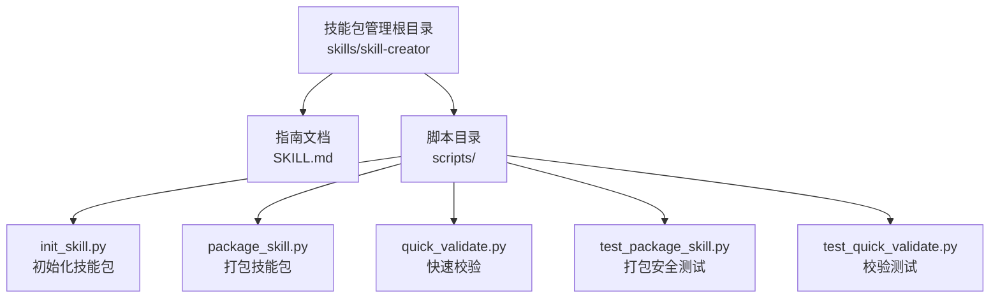
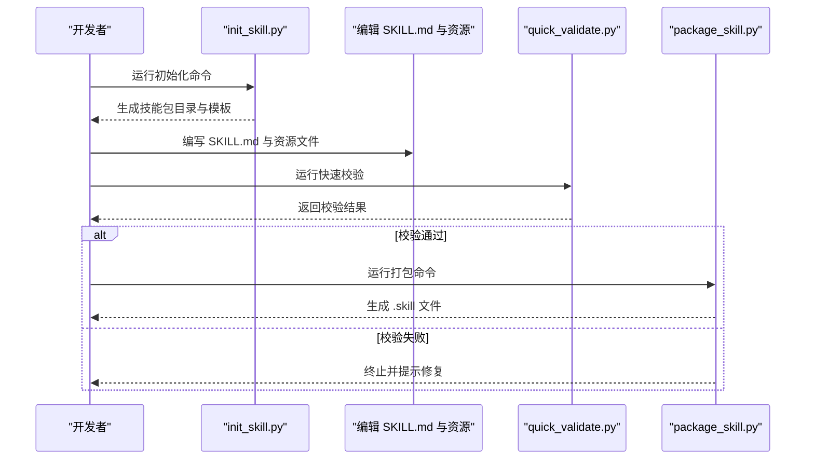
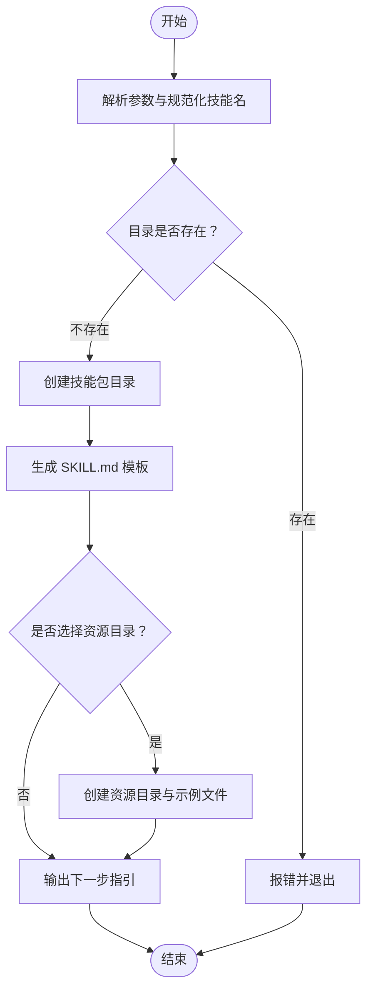
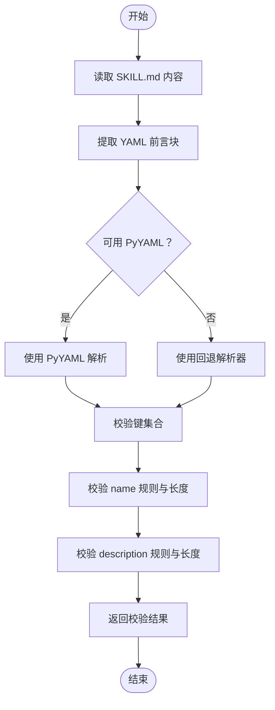
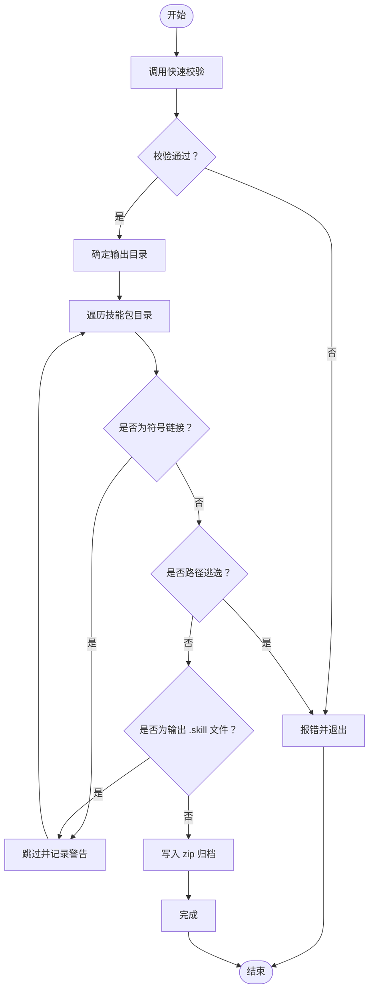
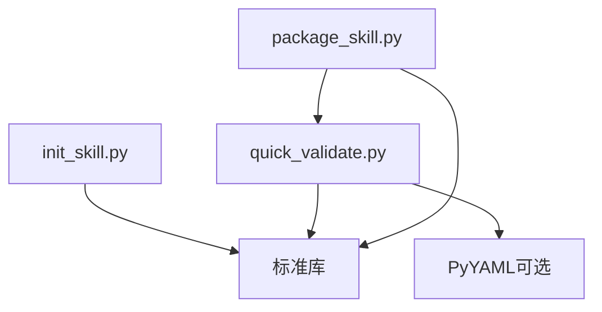

# 技能包管理

<cite>
**本文引用的文件**
- [skills/skill-creator/SKILL.md](file://skills/skill-creator/SKILL.md)
- [skills/skill-creator/scripts/init_skill.py](file://skills/skill-creator/scripts/init_skill.py)
- [skills/skill-creator/scripts/package_skill.py](file://skills/skill-creator/scripts/package_skill.py)
- [skills/skill-creator/scripts/quick_validate.py](file://skills/skill-creator/scripts/quick_validate.py)
- [skills/skill-creator/scripts/test_package_skill.py](file://skills/skill-creator/scripts/test_package_skill.py)
- [skills/skill-creator/scripts/test_quick_validate.py](file://skills/skill-creator/scripts/test_quick_validate.py)
</cite>

## 目录

1. [简介](#简介)
2. [项目结构](#项目结构)
3. [核心组件](#核心组件)
4. [架构总览](#架构总览)
5. [详细组件分析](#详细组件分析)
6. [依赖分析](#依赖分析)
7. [性能考虑](#性能考虑)
8. [故障排查指南](#故障排查指南)
9. [结论](#结论)
10. [附录](#附录)

## 简介

本指南围绕 OpenClaw 仓库中的“技能包管理”能力展开，重点介绍如何使用 skill-creator 工具完成技能包的初始化、打包与验证。文档覆盖技能包的目录结构、配置文件（SKILL.md）格式与元数据规范，给出从项目初始化到最终发布的完整流程，并说明版本管理、依赖声明与兼容性检查的实践方式。同时提供发布、安装与更新机制说明，以及最佳实践与常见问题解决方案。

## 项目结构

技能包管理相关的核心位于 skills/skill-creator 目录，其中包含：

- 指南文档 SKILL.md：定义技能包的结构、元数据规范与创作流程
- 脚本集合 scripts/：
  - init_skill.py：初始化新技能包目录与模板
  - package_skill.py：将技能包打包为可分发的 .skill 文件
  - quick_validate.py：对技能包进行快速校验（前置验证）
  - 测试用例：test_package_skill.py 与 test_quick_validate.py，用于回归测试与安全行为验证

图表来源

- [skills/skill-creator/SKILL.md](file://skills/skill-creator/SKILL.md)
- [skills/skill-creator/scripts/init_skill.py](file://skills/skill-creator/scripts/init_skill.py)
- [skills/skill-creator/scripts/package_skill.py](file://skills/skill-creator/scripts/package_skill.py)
- [skills/skill-creator/scripts/quick_validate.py](file://skills/skill-creator/scripts/quick_validate.py)
- [skills/skill-creator/scripts/test_package_skill.py](file://skills/skill-creator/scripts/test_package_skill.py)
- [skills/skill-creator/scripts/test_quick_validate.py](file://skills/skill-creator/scripts/test_quick_validate.py)

章节来源

- [skills/skill-creator/SKILL.md](file://skills/skill-creator/SKILL.md)
- [skills/skill-creator/scripts/init_skill.py](file://skills/skill-creator/scripts/init_skill.py)
- [skills/skill-creator/scripts/package_skill.py](file://skills/skill-creator/scripts/package_skill.py)
- [skills/skill-creator/scripts/quick_validate.py](file://skills/skill-creator/scripts/quick_validate.py)
- [skills/skill-creator/scripts/test_package_skill.py](file://skills/skill-creator/scripts/test_package_skill.py)
- [skills/skill-creator/scripts/test_quick_validate.py](file://skills/skill-creator/scripts/test_quick_validate.py)

## 核心组件

- 指南文档 SKILL.md：定义技能包的结构、元数据字段、资源组织方式与创作原则，是技能包设计与评审的权威依据。
- 初始化脚本 init_skill.py：根据模板生成技能包目录结构与 SKILL.md 初始内容，支持按需创建 scripts/、references/、assets/ 资源目录，并可选生成示例文件。
- 快速校验脚本 quick_validate.py：对 SKILL.md 的 YAML 前言元数据进行基础校验，确保必填字段、命名规范与长度限制等符合要求。
- 打包脚本 package_skill.py：在通过校验后，将技能包目录打包为 .skill 文件（zip），并执行安全策略（拒绝符号链接、防止路径逃逸、避免输出文件自包含）。

章节来源

- [skills/skill-creator/SKILL.md](file://skills/skill-creator/SKILL.md)
- [skills/skill-creator/scripts/init_skill.py](file://skills/skill-creator/scripts/init_skill.py)
- [skills/skill-creator/scripts/quick_validate.py](file://skills/skill-creator/scripts/quick_validate.py)
- [skills/skill-creator/scripts/package_skill.py](file://skills/skill-creator/scripts/package_skill.py)

## 架构总览

技能包管理的端到端流程如下：从初始化模板开始，编写 SKILL.md 与资源文件，随后进行快速校验，最后打包为 .skill 文件供分发与安装。

图表来源

- [skills/skill-creator/scripts/init_skill.py](file://skills/skill-creator/scripts/init_skill.py)
- [skills/skill-creator/scripts/quick_validate.py](file://skills/skill-creator/scripts/quick_validate.py)
- [skills/skill-creator/scripts/package_skill.py](file://skills/skill-creator/scripts/package_skill.py)

## 详细组件分析

### 组件一：初始化脚本 init_skill.py

职责与特性：

- 接收技能名与输出路径参数，规范化技能名为 hyphen-case，并限制最大长度
- 可选创建 scripts/、references/、assets/ 资源目录
- 生成 SKILL.md 模板，包含 TODO 提示与结构化建议
- 支持可选示例文件生成，便于快速上手
- 输出下一步操作指引

图表来源

- [skills/skill-creator/scripts/init_skill.py](file://skills/skill-creator/scripts/init_skill.py)

章节来源

- [skills/skill-creator/scripts/init_skill.py](file://skills/skill-creator/scripts/init_skill.py)

### 组件二：快速校验脚本 quick_validate.py

职责与特性：

- 读取 SKILL.md 并提取 YAML 前言块
- 使用 PyYAML 或回退解析器进行解析
- 校验允许的元数据键集合（name、description、license、allowed-tools、metadata）
- 校验 name 字段的字符集、连字符规则与长度上限
- 校验 description 的字符集与长度上限
- 返回布尔值与错误信息

图表来源

- [skills/skill-creator/scripts/quick_validate.py](file://skills/skill-creator/scripts/quick_validate.py)

章节来源

- [skills/skill-creator/scripts/quick_validate.py](file://skills/skill-creator/scripts/quick_validate.py)

### 组件三：打包脚本 package_skill.py

职责与特性：

- 校验技能包目录存在性与 SKILL.md 存在性
- 调用快速校验前置校验
- 安全策略：
  - 拒绝符号链接（文件与目录）
  - 防止路径逃逸（检测解析后路径是否超出技能包根目录）
  - 避免将输出 .skill 文件自身写入归档
- 将技能包目录压缩为 .skill 文件（zip），保持相对路径结构

图表来源

- [skills/skill-creator/scripts/package_skill.py](file://skills/skill-creator/scripts/package_skill.py)
- [skills/skill-creator/scripts/quick_validate.py](file://skills/skill-creator/scripts/quick_validate.py)

章节来源

- [skills/skill-creator/scripts/package_skill.py](file://skills/skill-creator/scripts/package_skill.py)
- [skills/skill-creator/scripts/quick_validate.py](file://skills/skill-creator/scripts/quick_validate.py)

### 组件四：测试用例

- test_package_skill.py：验证打包的安全行为，包括符号链接处理、路径逃逸防护、输出文件自包含规避等
- test_quick_validate.py：验证 YAML 前言格式、换行符处理与回退解析器的兼容性

章节来源

- [skills/skill-creator/scripts/test_package_skill.py](file://skills/skill-creator/scripts/test_package_skill.py)
- [skills/skill-creator/scripts/test_quick_validate.py](file://skills/skill-creator/scripts/test_quick_validate.py)

## 依赖分析

- 组件内聚与耦合
  - init_skill.py 仅依赖标准库，独立性强
  - quick_validate.py 优先使用 PyYAML，若不可用则使用内置回退解析器，具备良好的环境适应性
  - package_skill.py 依赖 quick_validate.py 的前置校验逻辑，形成“先校验再打包”的控制流
- 外部依赖
  - PyYAML（可选）：用于更严格的 YAML 解析；未安装时使用回退解析器
  - 标准库：argparse、pathlib、zipfile、yaml、re、sys 等

图表来源

- [skills/skill-creator/scripts/init_skill.py](file://skills/skill-creator/scripts/init_skill.py)
- [skills/skill-creator/scripts/quick_validate.py](file://skills/skill-creator/scripts/quick_validate.py)
- [skills/skill-creator/scripts/package_skill.py](file://skills/skill-creator/scripts/package_skill.py)

章节来源

- [skills/skill-creator/scripts/init_skill.py](file://skills/skill-creator/scripts/init_skill.py)
- [skills/skill-creator/scripts/quick_validate.py](file://skills/skill-creator/scripts/quick_validate.py)
- [skills/skill-creator/scripts/package_skill.py](file://skills/skill-creator/scripts/package_skill.py)

## 性能考虑

- 校验阶段
  - quick_validate.py 对 SKILL.md 的解析与正则匹配开销极低，适合在本地频繁运行
- 打包阶段
  - package_skill.py 采用单次遍历与增量写入，时间复杂度近似 O(N)，N 为技能包中文件数量
  - 压缩算法为 ZIP_DEFLATED，兼顾压缩率与速度
- 资源组织
  - 建议将大体量参考文档放入 references/，以减少上下文窗口占用，提升推理效率

## 故障排查指南

- 初始化失败
  - 报错“技能包目录已存在”：请更换技能名或输出路径
  - 报错“技能名必须包含至少一个字母或数字”：请提供合法的技能名
  - 报错“--examples 需要设置 --resources”：启用示例前必须指定资源类型
- 校验失败
  - “缺少必填字段”：确保 SKILL.md 前言包含 name 与 description
  - “name 不符合规则”：仅允许小写字母、数字与连字符，且不能以连字符开头或结尾，不能有连续连字符
  - “description 过长或包含非法字符”：长度不超过 1024，不得包含尖括号
  - “未安装 PyYAML”：回退解析器可处理简单键值对，但不支持复杂嵌套结构
- 打包失败
  - “符号链接被拒绝”：请移除或替换为普通文件
  - “路径逃逸”：确认所有文件均位于技能包根目录下
  - “输出文件自包含”：避免将输出目录设为技能包根目录

章节来源

- [skills/skill-creator/scripts/init_skill.py](file://skills/skill-creator/scripts/init_skill.py)
- [skills/skill-creator/scripts/quick_validate.py](file://skills/skill-creator/scripts/quick_validate.py)
- [skills/skill-creator/scripts/package_skill.py](file://skills/skill-creator/scripts/package_skill.py)

## 结论

通过 skill-creator 工具链，OpenClaw 提供了标准化、可审计的技能包生命周期管理方案。借助 SKILL.md 元数据规范与资源组织原则，结合 init_skill.py、quick_validate.py 与 package_skill.py 的自动化流程，开发者可以高效地创建、验证与分发高质量技能包。建议在团队内统一遵循指南文档中的创作原则与命名规范，持续完善技能包质量与复用性。

## 附录

### 技能包目录结构与元数据规范

- 必备文件
  - SKILL.md：包含 YAML 前言与正文内容
- 可选资源目录
  - scripts/：可执行脚本（Python/Bash 等）
  - references/：参考文档，按主题拆分，避免重复
  - assets/：输出使用的资源文件（模板、图标、字体等）
- 元数据字段
  - name：技能名称（hyphen-case，长度≤64）
  - description：触发与使用场景描述（长度≤1024，不含尖括号）
  - license、allowed-tools、metadata：可选扩展字段

章节来源

- [skills/skill-creator/SKILL.md](file://skills/skill-creator/SKILL.md)

### 版本管理、依赖声明与兼容性检查

- 版本管理
  - 建议在 SKILL.md 中通过 description 或 references/ 文档维护变更历史与兼容性说明
- 依赖声明
  - 若脚本依赖外部工具或语言运行时，请在 SKILL.md 的“前置条件”或 references/ 中明确列出
- 兼容性检查
  - 在不同平台与 Python 环境下运行 quick_validate.py 与 init_skill.py，确保跨平台一致性

章节来源

- [skills/skill-creator/scripts/quick_validate.py](file://skills/skill-creator/scripts/quick_validate.py)
- [skills/skill-creator/SKILL.md](file://skills/skill-creator/SKILL.md)

### 发布流程、安装方法与更新机制

- 发布流程
  - 初始化：使用 init_skill.py 生成模板
  - 编辑：完善 SKILL.md 与资源文件
  - 校验：运行 quick_validate.py 确保通过
  - 打包：运行 package_skill.py 生成 .skill 文件
- 安装方法
  - 将 .skill 文件作为归档包进行分发；安装时解压至目标位置即可
- 更新机制
  - 新版本以新版本号重新打包并替换旧 .skill 文件；用户可按需升级

章节来源

- [skills/skill-creator/scripts/init_skill.py](file://skills/skill-creator/scripts/init_skill.py)
- [skills/skill-creator/scripts/quick_validate.py](file://skills/skill-creator/scripts/quick_validate.py)
- [skills/skill-creator/scripts/package_skill.py](file://skills/skill-creator/scripts/package_skill.py)

### 最佳实践建议

- 严格遵守命名规范与元数据完整性
- 将重复性工作沉淀为 scripts/，将细节知识沉淀为 references/
- 控制 SKILL.md 正文字数，必要时拆分为多个参考文件
- 在 CI 中集成 quick_validate.py，确保每次变更均通过校验
- 对于大型参考文档，提供清晰的导航与索引，避免深度嵌套引用

章节来源

- [skills/skill-creator/SKILL.md](file://skills/skill-creator/SKILL.md)
