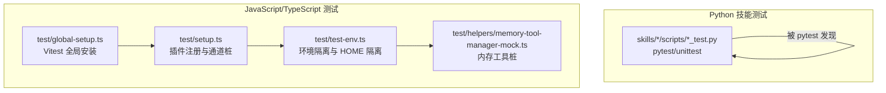
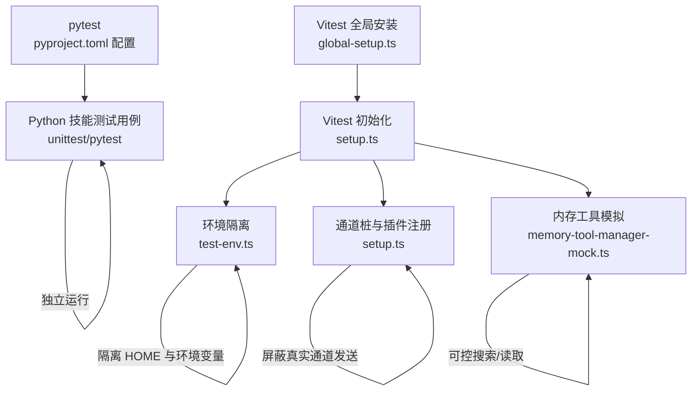
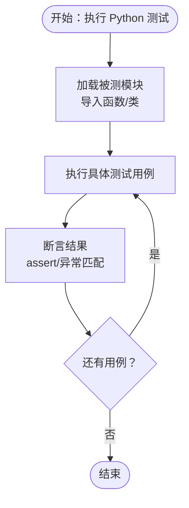
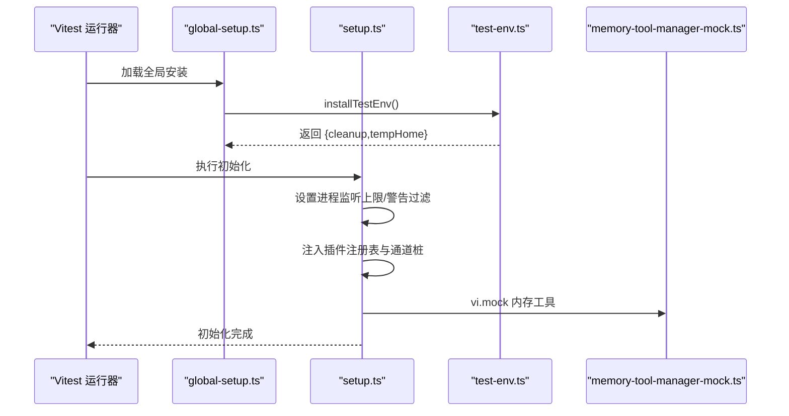
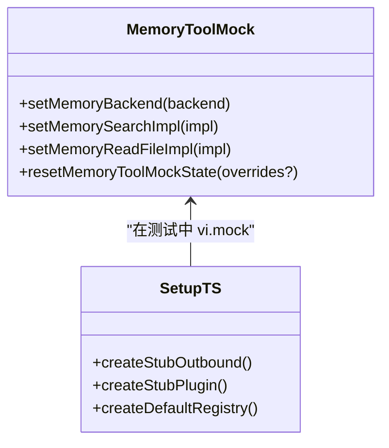
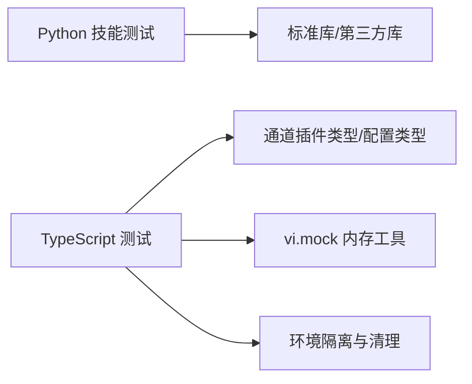

# 技能测试框架

<cite>
**本文档引用的文件**
- [pyproject.toml](file://pyproject.toml)
- [skills/model-usage/scripts/test_model_usage.py](file://skills/model-usage/scripts/test_model_usage.py)
- [skills/openai-image-gen/scripts/test_gen.py](file://skills/openai-image-gen/scripts/test_gen.py)
- [skills/skill-creator/scripts/test_package_skill.py](file://skills/skill-creator/scripts/test_package_skill.py)
- [skills/skill-creator/scripts/test_quick_validate.py](file://skills/skill-creator/scripts/test_quick_validate.py)
- [test/global-setup.ts](file://test/global-setup.ts)
- [test/setup.ts](file://test/setup.ts)
- [test/test-env.ts](file://test/test-env.ts)
- [test/helpers/memory-tool-manager-mock.ts](file://test/helpers/memory-tool-manager-mock.ts)
</cite>

## 目录

1. [引言](#引言)
2. [项目结构](#项目结构)
3. [核心组件](#核心组件)
4. [架构总览](#架构总览)
5. [详细组件分析](#详细组件分析)
6. [依赖分析](#依赖分析)
7. [性能考虑](#性能考虑)
8. [故障排除指南](#故障排除指南)
9. [结论](#结论)
10. [附录](#附录)

## 引言

本文件系统化梳理 OpenClaw 技能测试框架的设计与实现，覆盖单元测试、集成测试与端到端测试的策略与实践。文档重点阐述以下方面：

- 测试框架的组织方式与运行机制（pytest 配置、Vitest 全局设置）
- 不同类型技能的测试示例：Python 脚本工具函数测试、文件与输出安全测试、打包与校验流程测试
- 测试数据准备、模拟对象使用与测试环境隔离
- 持续集成中的测试自动化与覆盖率分析建议

## 项目结构

OpenClaw 的测试体系由两类主要部分构成：

- Python 技能脚本测试：位于各技能目录下的 scripts 子目录中，使用 unittest 或 pytest 编写，测试范围包括参数解析、格式规范化、文件生成与安全防护等
- JavaScript/TypeScript 应用测试：位于 test 目录及各子模块的 vitest.\*.config.ts 中，采用 Vitest 进行单元与集成测试，配合全局初始化与环境隔离

**图表来源**

- [pyproject.toml:8-11](file://pyproject.toml#L8-L11)
- [test/global-setup.ts:1-7](file://test/global-setup.ts#L1-L7)
- [test/setup.ts:1-201](file://test/setup.ts#L1-L201)
- [test/test-env.ts:54-143](file://test/test-env.ts#L54-L143)
- [test/helpers/memory-tool-manager-mock.ts:1-66](file://test/helpers/memory-tool-manager-mock.ts#L1-L66)

**章节来源**

- [pyproject.toml:8-11](file://pyproject.toml#L8-L11)
- [test/global-setup.ts:1-7](file://test/global-setup.ts#L1-L7)
- [test/setup.ts:1-201](file://test/setup.ts#L1-L201)
- [test/test-env.ts:54-143](file://test/test-env.ts#L54-L143)
- [test/helpers/memory-tool-manager-mock.ts:1-66](file://test/helpers/memory-tool-manager-mock.ts#L1-L66)

## 核心组件

- pytest 配置与发现规则：通过 pyproject.toml 指定测试目录与文件命名模式，确保 Python 技能测试可被统一发现与执行
- Vitest 全局初始化：global-setup.ts 安装测试环境；setup.ts 注入插件注册表、通道桩与进程警告过滤；test-env.ts 提供 HOME 隔离与环境变量清理
- 内存工具模拟：memory-tool-manager-mock.ts 将内存搜索与读取接口替换为可控制的桩实现，便于在测试中注入行为与断言

**章节来源**

- [pyproject.toml:8-11](file://pyproject.toml#L8-L11)
- [test/global-setup.ts:1-7](file://test/global-setup.ts#L1-L7)
- [test/setup.ts:1-201](file://test/setup.ts#L1-L201)
- [test/test-env.ts:54-143](file://test/test-env.ts#L54-L143)
- [test/helpers/memory-tool-manager-mock.ts:1-66](file://test/helpers/memory-tool-manager-mock.ts#L1-L66)

## 架构总览

下图展示了测试框架在不同层面的交互关系：Python 技能测试由 pytest 驱动，TypeScript 测试由 Vitest 驱动，二者共享统一的环境隔离与全局初始化策略。

**图表来源**

- [pyproject.toml:8-11](file://pyproject.toml#L8-L11)
- [test/global-setup.ts:1-7](file://test/global-setup.ts#L1-L7)
- [test/setup.ts:1-201](file://test/setup.ts#L1-L201)
- [test/test-env.ts:54-143](file://test/test-env.ts#L54-L143)
- [test/helpers/memory-tool-manager-mock.ts:1-66](file://test/helpers/memory-tool-manager-mock.ts#L1-L66)

## 详细组件分析

### Python 技能测试组件

- 测试策略
  - 单元测试：针对纯函数与工具函数进行断言，验证输入规范化、错误处理与边界条件
  - 安全性测试：对文件生成与输出进行 XSS 与路径逃逸防护验证
  - 回归测试：对打包与快速校验流程进行平台差异与路径合法性检查
- 示例用例
  - 参数与日期处理：正整数解析、按天过滤条目
  - 输出格式与样式规范化：大小写归一化、空白处理、不支持选项的告警
  - 文件与 HTML 安全：gallery 输出的转义与内容一致性
  - 打包与校验：符号链接跳过、路径越界拒绝、嵌套文件包含、自输出目录保护

**图表来源**

- [skills/model-usage/scripts/test_model_usage.py:13-37](file://skills/model-usage/scripts/test_model_usage.py#L13-L37)
- [skills/openai-image-gen/scripts/test_gen.py:15-141](file://skills/openai-image-gen/scripts/test_gen.py#L15-L141)
- [skills/skill-creator/scripts/test_package_skill.py:50-157](file://skills/skill-creator/scripts/test_package_skill.py#L50-L157)
- [skills/skill-creator/scripts/test_quick_validate.py:23-68](file://skills/skill-creator/scripts/test_quick_validate.py#L23-L68)

**章节来源**

- [skills/model-usage/scripts/test_model_usage.py:13-37](file://skills/model-usage/scripts/test_model_usage.py#L13-L37)
- [skills/openai-image-gen/scripts/test_gen.py:15-141](file://skills/openai-image-gen/scripts/test_gen.py#L15-L141)
- [skills/skill-creator/scripts/test_package_skill.py:50-157](file://skills/skill-creator/scripts/test_package_skill.py#L50-L157)
- [skills/skill-creator/scripts/test_quick_validate.py:23-68](file://skills/skill-creator/scripts/test_quick_validate.py#L23-L68)

### TypeScript/Vitest 组件

- 全局初始化与环境隔离
  - global-setup.ts 在进程启动时安装测试环境并返回清理函数
  - test-env.ts 将 HOME 与 XDG 系列目录重定向至临时目录，删除敏感环境变量，避免污染真实状态
- 插件与通道桩
  - setup.ts 创建默认插件注册表，为多种通道提供桩实现，屏蔽真实网络发送
  - 通过 vi.mock 替换外部 OAuth 等模块，减少真实依赖
- 内存工具模拟
  - memory-tool-manager-mock.ts 将内存搜索与读取替换为可注入实现，便于断言行为与注入测试数据

**图表来源**

- [test/global-setup.ts:1-7](file://test/global-setup.ts#L1-L7)
- [test/setup.ts:1-201](file://test/setup.ts#L1-L201)
- [test/test-env.ts:54-143](file://test/test-env.ts#L54-L143)
- [test/helpers/memory-tool-manager-mock.ts:1-66](file://test/helpers/memory-tool-manager-mock.ts#L1-L66)

**章节来源**

- [test/global-setup.ts:1-7](file://test/global-setup.ts#L1-L7)
- [test/setup.ts:1-201](file://test/setup.ts#L1-L201)
- [test/test-env.ts:54-143](file://test/test-env.ts#L54-L143)
- [test/helpers/memory-tool-manager-mock.ts:1-66](file://test/helpers/memory-tool-manager-mock.ts#L1-L66)

### 测试数据准备与模拟对象

- Python 测试
  - 使用临时目录与临时文件模拟外部资源，确保测试可重复且无副作用
  - 对依赖外部库（如 YAML 解析）进行降级或替换，保证在缺失依赖时仍可运行
- TypeScript 测试
  - 使用 vi.mock 替换真实模块，注入可控行为（如 OAuth、内存工具）
  - 通过 createStubOutbound 与 createStubPlugin 构造通道桩，屏蔽真实网络调用

**图表来源**

- [test/helpers/memory-tool-manager-mock.ts:1-66](file://test/helpers/memory-tool-manager-mock.ts#L1-L66)
- [test/setup.ts:65-182](file://test/setup.ts#L65-L182)

**章节来源**

- [test/helpers/memory-tool-manager-mock.ts:1-66](file://test/helpers/memory-tool-manager-mock.ts#L1-L66)
- [test/setup.ts:65-182](file://test/setup.ts#L65-L182)

### 测试环境配置

- Python
  - 通过 pyproject.toml 指定测试目录与文件命名模式，pytest 自动发现并执行
- TypeScript
  - global-setup.ts 与 setup.ts 提供统一初始化入口
  - test-env.ts 在进程启动前隔离 HOME 与 XDG 目录，删除敏感环境变量，避免真实状态污染

**章节来源**

- [pyproject.toml:8-11](file://pyproject.toml#L8-L11)
- [test/global-setup.ts:1-7](file://test/global-setup.ts#L1-L7)
- [test/setup.ts:1-201](file://test/setup.ts#L1-L201)
- [test/test-env.ts:54-143](file://test/test-env.ts#L54-L143)

## 依赖分析

- Python 技能测试依赖关系
  - 各技能脚本测试仅依赖被测函数与标准库，耦合度低，便于独立运行
  - 通过临时目录与临时文件管理外部资源，降低对系统状态的依赖
- TypeScript 测试依赖关系
  - setup.ts 依赖通道插件类型与配置类型，构造统一的桩实现
  - memory-tool-manager-mock.ts 依赖 vitest 的 vi.mock 能力，替换内存工具模块
  - global-setup.ts 与 test-env.ts 彼此协作，确保测试环境的一致性

**图表来源**

- [skills/openai-image-gen/scripts/test_gen.py:1-141](file://skills/openai-image-gen/scripts/test_gen.py#L1-L141)
- [test/helpers/memory-tool-manager-mock.ts:1-66](file://test/helpers/memory-tool-manager-mock.ts#L1-L66)
- [test/test-env.ts:54-143](file://test/test-env.ts#L54-L143)

**章节来源**

- [skills/openai-image-gen/scripts/test_gen.py:1-141](file://skills/openai-image-gen/scripts/test_gen.py#L1-L141)
- [test/helpers/memory-tool-manager-mock.ts:1-66](file://test/helpers/memory-tool-manager-mock.ts#L1-L66)
- [test/test-env.ts:54-143](file://test/test-env.ts#L54-L143)

## 性能考虑

- 测试并发与隔离
  - 使用临时 HOME 与 XDG 目录避免磁盘争用与状态冲突
  - 在 Vitest 中提升最大监听器数量以减少事件循环警告开销
- 减少真实依赖
  - 通过 vi.mock 替换外部服务调用，缩短测试执行时间
  - 在 Python 测试中对可选依赖进行降级处理，避免因缺失依赖导致测试失败
- 缓存与复用
  - 在 TypeScript 测试中复用默认插件注册表，减少每次测试的初始化成本

[本节为通用指导，无需特定文件来源]

## 故障排除指南

- 环境变量泄漏
  - 症状：测试间相互影响或访问到真实凭据
  - 处理：确认 test-env.ts 已正确设置临时 HOME 与 XDG 目录，并删除敏感变量
- 符号链接与路径逃逸
  - 症状：打包产物包含不应包含的外部文件
  - 处理：参考技能打包测试用例，确保符号链接与越界路径被拒绝
- 内存工具行为异常
  - 症状：内存搜索或读取结果不符合预期
  - 处理：通过 memory-tool-manager-mock.ts 注入可控实现并断言行为
- 通道发送未生效
  - 症状：消息未实际发送但测试通过
  - 处理：确认 setup.ts 中已创建通道桩并拦截真实发送逻辑

**章节来源**

- [test/test-env.ts:54-143](file://test/test-env.ts#L54-L143)
- [skills/skill-creator/scripts/test_package_skill.py:65-127](file://skills/skill-creator/scripts/test_package_skill.py#L65-L127)
- [test/helpers/memory-tool-manager-mock.ts:1-66](file://test/helpers/memory-tool-manager-mock.ts#L1-L66)
- [test/setup.ts:65-88](file://test/setup.ts#L65-L88)

## 结论

OpenClaw 技能测试框架通过明确的分层设计与严格的环境隔离，实现了 Python 与 TypeScript 双栈测试的统一与高效。Python 技能测试侧重于工具函数与流程安全性，TypeScript 测试则聚焦于系统集成与通道交互。结合模拟对象与全局初始化，测试具备高可重复性与可维护性，适合在持续集成中大规模运行。

[本节为总结性内容，无需特定文件来源]

## 附录

### 测试框架使用指南

- Python 测试
  - 运行方式：pytest 自动发现 skills 目录下的 test\_\*.py 文件
  - 断言方法：使用 unittest.TestCase 或 pytest 断言，结合临时目录与 capsys 进行 I/O 捕获
- TypeScript 测试
  - 运行方式：Vitest 通过 vitest.config.ts 与各 scoped config 启动
  - 断言方法：使用 vitest API（如 expect、vi.mock），在 setup.ts 中注入桩与注册表

**章节来源**

- [pyproject.toml:8-11](file://pyproject.toml#L8-L11)
- [test/global-setup.ts:1-7](file://test/global-setup.ts#L1-L7)
- [test/setup.ts:1-201](file://test/setup.ts#L1-L201)

### 测试类型与示例映射

- API 调用测试：通过通道桩模拟发送流程，断言发送参数与返回值
- 文件操作测试：使用临时目录与临时文件，验证文件生成、转义与路径合法性
- 系统命令测试：在 Python 测试中通过 capsys 捕获标准错误，验证告警信息

**章节来源**

- [skills/openai-image-gen/scripts/test_gen.py:28-36](file://skills/openai-image-gen/scripts/test_gen.py#L28-L36)
- [skills/skill-creator/scripts/test_package_skill.py:65-109](file://skills/skill-creator/scripts/test_package_skill.py#L65-L109)

### 持续集成与覆盖率

- 自动化：在 CI 中分别运行 Python 与 TypeScript 测试套件，确保环境隔离与并发安全
- 覆盖率：建议在 CI 中收集并报告覆盖率指标，结合桩与隔离策略提升覆盖率稳定性

[本节为通用指导，无需特定文件来源]
