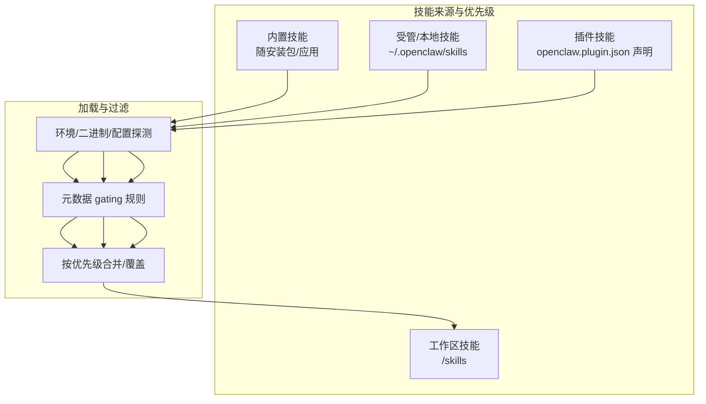
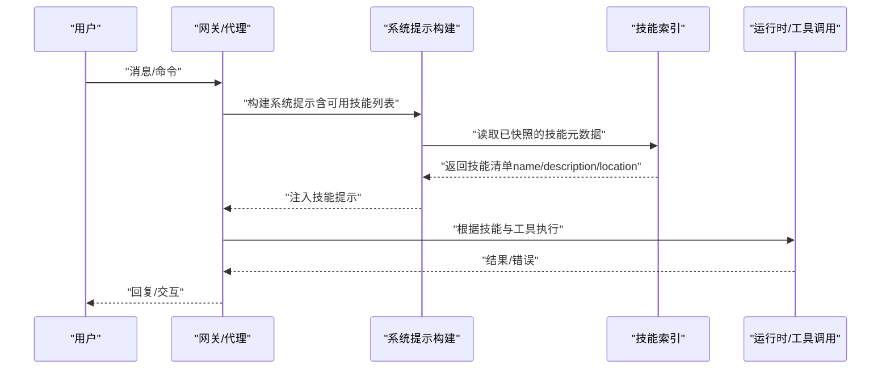
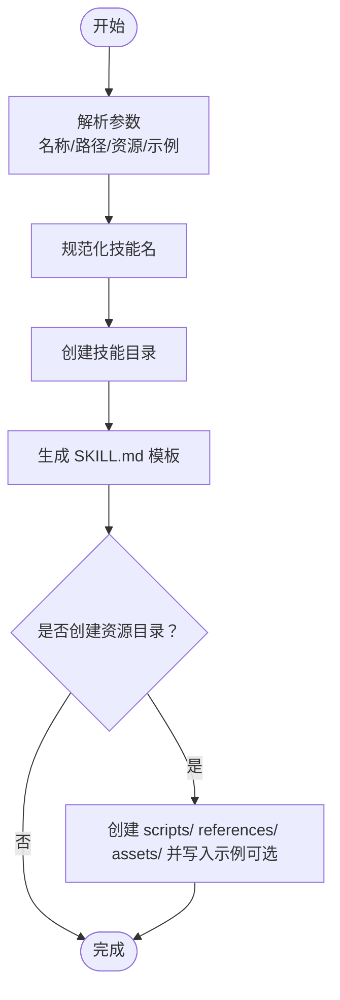
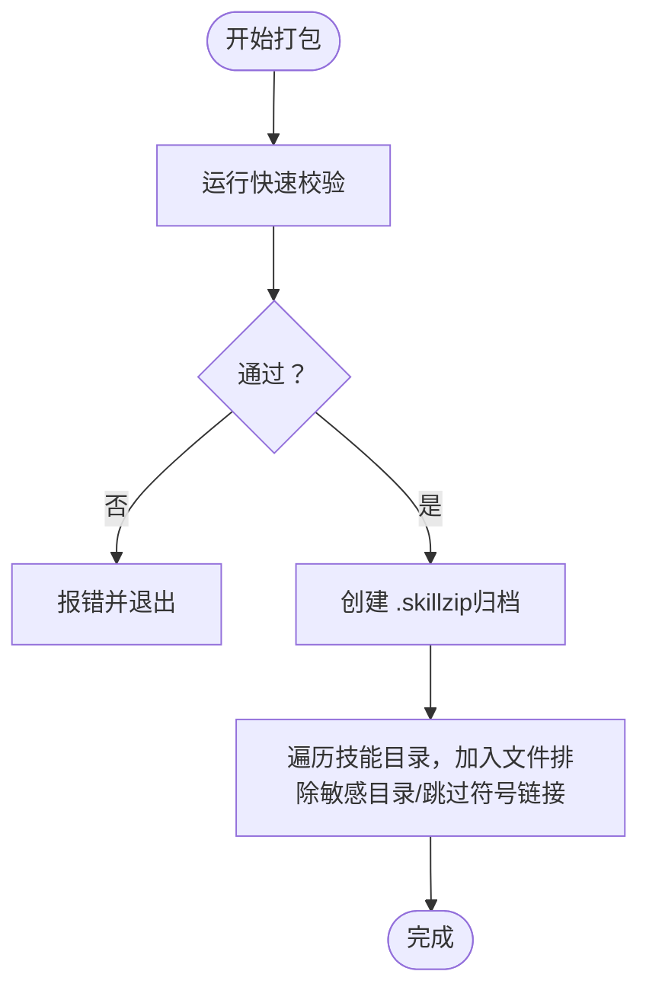
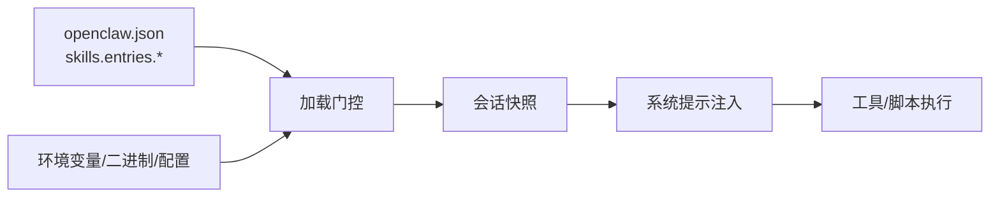

# 技能开发

<cite>
**本文引用的文件**
- [技能：创建与管理](file://docs/tools/creating-skills.md)
- [技能：位置与优先级、加载规则与配置注入](file://docs/tools/skills.md)
- [技能配置参考](file://docs/tools/skills-config.md)
- [技能创建器：SKILL.md 模板与最佳实践](file://skills/skill-creator/SKILL.md)
- [技能创建器：初始化脚本 init_skill.py](file://skills/skill-creator/scripts/init_skill.py)
- [技能创建器：打包脚本 package_skill.py](file://skills/skill-creator/scripts/package_skill.py)
- [技能创建器：快速校验脚本 quick_validate.py（片段）](file://skills/skill-creator/scripts/quick_validate.py)
- [示例技能：1Password](file://skills/1password/SKILL.md)
- [示例技能：Canvas](file://skills/canvas/SKILL.md)
- [示例技能：模型用量统计](file://skills/model-usage/SKILL.md)
- [示例技能：Lobster（多步工作流）](file://extensions/lobster/SKILL.md)
- [系统提示构建：可用技能注入](file://src/agents/system-prompt.ts)
- [端到端测试辅助：写入 SKILL.md](file://src/agents/skills.e2e-test-helpers.ts)
- [端到端测试辅助：用例覆盖（含可选元数据与正文）](file://src/agents/skills.e2e-test-helpers.test.ts)
- [入门指南：安装与首次运行](file://docs/start/getting-started.md)
</cite>

## 目录

1. [简介](#简介)
2. [项目结构](#项目结构)
3. [核心组件](#核心组件)
4. [架构总览](#架构总览)
5. [详细组件分析](#详细组件分析)
6. [依赖分析](#依赖分析)
7. [性能考虑](#性能考虑)
8. [故障排查指南](#故障排查指南)
9. [结论](#结论)
10. [附录](#附录)

## 简介

本指南面向希望从零开始在 OpenClaw 中开发自定义技能的工程师与产品人员。内容覆盖技能项目初始化、代码结构设计、配置文件编写、测试验证、打包与分发、版本管理等全流程。同时解释技能元数据、输入输出规范、权限声明与错误处理等核心概念，并提供可操作的开发流程与最佳实践。

## 项目结构

OpenClaw 的“技能”以目录形式存在，每个技能目录包含一个用于指导模型使用的 SKILL.md 文件，以及可选的 scripts/、references/、assets/ 等资源目录。技能来源分为三类，且具有明确的加载优先级与过滤规则：

- 内置技能（随安装包或应用自带）
- 受管/本地技能（用户主目录下的受管目录）
- 工作区技能（当前工作空间内）

此外，插件可自带技能目录；ClawHub 提供公共技能注册表，支持安装、更新与同步。

图表来源

- [技能：位置与优先级、加载规则与配置注入:13-48](file://docs/tools/skills.md#L13-L48)

章节来源

- [技能：位置与优先级、加载规则与配置注入:13-48](file://docs/tools/skills.md#L13-L48)
- [技能：创建与管理:17-48](file://docs/tools/creating-skills.md#L17-L48)

## 核心组件

- SKILL.md：技能的“元数据 + 使用说明”，决定何时触发与如何被模型使用。遵循单行 YAML frontmatter 与 Markdown 正文的 AgentSkills 规范。
- 资源目录：
  - scripts/：可执行脚本（Python/Bash 等），适合重复性高、需要确定性的任务。
  - references/：按需加载的参考文档，避免挤占上下文窗口。
  - assets/：不直接加载到上下文的输出资源（模板、图标、字体等）。
- 配置与注入：
  - 全局配置文件中对技能进行启用/禁用、环境变量注入、API 密钥注入、安装偏好等控制。
  - 运行时按会话快照缓存“可用技能列表”，减少重复计算。
- 安全与沙箱：
  - 第三方技能视为不受信代码；建议在沙箱中运行高风险工具。
  - 沙箱容器内的二进制依赖需在容器内准备，而非仅宿主机存在。

章节来源

- [技能：创建与管理:13-59](file://docs/tools/creating-skills.md#L13-L59)
- [技能：位置与优先级、加载规则与配置注入:78-187](file://docs/tools/skills.md#L78-L187)
- [技能配置参考:13-78](file://docs/tools/skills-config.md#L13-L78)

## 架构总览

下图展示从“用户请求/触发”到“技能执行”的关键路径，以及技能元数据如何影响系统提示与可用工具选择。

图表来源

- [系统提示构建：可用技能注入:20-36](file://src/agents/system-prompt.ts#L20-L36)
- [技能：位置与优先级、加载规则与配置注入:242-247](file://docs/tools/skills.md#L242-L247)

章节来源

- [系统提示构建：可用技能注入:20-36](file://src/agents/system-prompt.ts#L20-L36)
- [技能：位置与优先级、加载规则与配置注入:242-247](file://docs/tools/skills.md#L242-L247)

## 详细组件分析

### 组件一：技能元数据与触发规则

- 必填字段：name、description。前者用于匹配触发，后者用于系统提示中的简要说明。
- 可选元数据（单行 JSON）：
  - openclaw.requires.\*：二进制、环境变量、配置项的存在性要求。
  - openclaw.os：平台限定。
  - openclaw.install：安装器描述（brew/npm/go/download 等），用于 UI/CLI 自动安装。
  - openclaw.primaryEnv：与 per-skill apiKey 对应的环境变量名。
- 加载门控：未显式元数据时默认可用；可通过 always、os、requires 等字段精确控制。
- 用户交互开关：
  - user-invocable：是否暴露为用户斜杠命令。
  - disable-model-invocation：是否从模型提示中排除该技能（仍可通过用户调用）。
  - command-dispatch/tool/arg-mode：当设置为 tool 时，斜杠命令直接派发给指定工具，参数透传策略由 arg-mode 决定。

章节来源

- [技能：创建与管理:27-41](file://docs/tools/creating-skills.md#L27-L41)
- [技能：位置与优先级、加载规则与配置注入:80-187](file://docs/tools/skills.md#L80-L187)

### 组件二：技能目录结构与资源组织

- 目录骨架：技能根目录包含 SKILL.md 与可选的 scripts/、references/、assets/。
- 资源设计原则：
  - scripts/：确定性、可复用、可独立执行。
  - references/：长文档、API 参考、Schema 等，按需加载。
  - assets/：模板、图标、字体等，用于最终输出而非上下文加载。
- 不建议放入的文件：README、INSTALLATION_GUIDE、CHANGELOG 等“过程性文档”。

章节来源

- [技能创建器：SKILL.md 模板与最佳实践:46-112](file://skills/skill-creator/SKILL.md#L46-L112)

### 组件三：初始化与模板（init_skill.py）

- 功能：生成标准化技能目录，包含带 TODO 的 SKILL.md 模板与可选的资源目录。
- 支持选项：
  - --resources：选择创建 scripts、references、assets 之一或组合。
  - --examples：在资源目录中生成示例文件（脚本/参考/资产占位）。
- 名称规范化：自动转为小写连字符命名，长度限制与非法字符清理。
- 输出：打印下一步指引（编辑 SKILL.md、添加/定制资源、运行校验器）。

图表来源

- [技能创建器：初始化脚本 init_skill.py:255-318](file://skills/skill-creator/scripts/init_skill.py#L255-L318)

章节来源

- [技能创建器：初始化脚本 init_skill.py:1-379](file://skills/skill-creator/scripts/init_skill.py#L1-L379)

### 组件四：打包与安全（package_skill.py）

- 功能：将技能目录打包为 .skill 文件（zip），便于分发与版本化管理。
- 校验前置：调用快速校验模块，确保 YAML frontmatter、目录结构、描述质量等符合要求。
- 安全约束：
  - 拒绝打包符号链接。
  - 排除 .git、node_modules 等目录。
  - 防止文件逃逸（相对路径越界）。
- 输出：生成 <skill-name>.skill 文件，包含完整目录结构。

图表来源

- [技能创建器：打包脚本 package_skill.py:28-112](file://skills/skill-creator/scripts/package_skill.py#L28-L112)

章节来源

- [技能创建器：打包脚本 package_skill.py:1-140](file://skills/skill-creator/scripts/package_skill.py#L1-L140)

### 组件五：快速校验（quick_validate.py）

- 校验要点（节选）：
  - name/description 存在且类型正确。
  - description 不得包含尖括号，长度限制。
  - 其他字段（如 metadata）格式与范围检查。
- 用途：作为 init_skill.py 与 package_skill.py 的前置校验，保证技能质量与一致性。

章节来源

- [技能创建器：快速校验脚本 quick_validate.py（片段）:136-159](file://skills/skill-creator/scripts/quick_validate.py#L136-L159)

### 组件六：示例技能剖析

- 1Password：展示元数据 gating（二进制、安装器）、安全约束（tmux 会话）、参考文档组织。
- Canvas：展示复杂工作流（节点桥接、URL 结构、Live Reload）、配置注入、调试步骤。
- 模型用量统计：展示脚本化摘要、输入/输出约定、参考文档引用。
- Lobster：展示多步工作流、审批闸门、恢复令牌、结构化输出协议。

章节来源

- [示例技能：1Password:1-71](file://skills/1password/SKILL.md#L1-L71)
- [示例技能：Canvas:1-199](file://skills/canvas/SKILL.md#L1-L199)
- [示例技能：模型用量统计:1-70](file://skills/model-usage/SKILL.md#L1-L70)
- [示例技能：Lobster（多步工作流）:1-98](file://extensions/lobster/SKILL.md#L1-L98)

### 组件七：系统提示与技能注入

- 系统提示中会注入“可用技能列表”，帮助模型在多技能场景下做出选择。
- 选择策略：优先最具体技能；仅在选定后才读取对应 SKILL.md 的正文。

章节来源

- [系统提示构建：可用技能注入:20-36](file://src/agents/system-prompt.ts#L20-L36)

### 组件八：测试与回归（端到端测试辅助）

- 辅助函数：可写入带元数据、正文与 frontmatterExtra 的 SKILL.md，用于测试。
- 用例覆盖：验证可选元数据、正文为空、frontmatterExtra 清理等边界行为。

章节来源

- [端到端测试辅助：写入 SKILL.md:4-30](file://src/agents/skills.e2e-test-helpers.ts#L4-L30)
- [端到端测试辅助：用例覆盖（含可选元数据与正文）:41-76](file://src/agents/skills.e2e-test-helpers.test.ts#L41-L76)

## 依赖分析

- 技能加载依赖于：
  - 环境变量与二进制存在性（PATH/环境变量/配置项）。
  - 平台 os 限定。
  - 插件技能的 openclaw.plugin.json 声明。
- 运行时依赖：
  - 会话快照缓存“可用技能列表”，变更在新会话生效。
  - 沙箱运行时，容器内需具备所需二进制与网络能力。

图表来源

- [技能：位置与优先级、加载规则与配置注入:106-187](file://docs/tools/skills.md#L106-L187)
- [技能配置参考:13-78](file://docs/tools/skills-config.md#L13-L78)

章节来源

- [技能：位置与优先级、加载规则与配置注入:106-187](file://docs/tools/skills.md#L106-L187)
- [技能配置参考:13-78](file://docs/tools/skills-config.md#L13-L78)

## 性能考虑

- 上下文开销估算：
  - 当存在技能时，系统提示中会注入紧凑的 XML 列表，基础开销约 195 字符；每技能额外约 97+字段长度（XML 转义后可能膨胀）。
  - 建议控制 SKILL.md 正文字数，将细节移至 references/ 按需加载。
- 会话快照：
  - 技能列表在会话开始时快照，后续回合复用，减少重复扫描与提示拼接成本。
- 令牌成本：
  - 不同模型的字符/令牌比不同，建议在设计阶段评估技能数量与描述长度对成本的影响。

章节来源

- [技能：位置与优先级、加载规则与配置注入:269-286](file://docs/tools/skills.md#L269-L286)

## 故障排查指南

- 无法加载技能
  - 检查 gating 条件（二进制、环境变量、配置项）是否满足。
  - 确认平台 os 限制与 openclaw.plugin.json 声明。
- 未显示为用户可调用
  - 检查 user-invocable 与 disable-model-invocation 设置。
- 沙箱内不可用
  - 确认容器内已安装所需二进制，必要时在 agents.defaults.sandbox.docker.setupCommand 中预装。
- 安全与权限
  - 第三方技能视为不受信；优先沙箱运行，避免在宿主注入敏感环境变量。
- 打包失败
  - 检查是否存在符号链接、文件逃逸风险、资源目录排除规则是否误删。
- 调试 Canvas
  - 根绑定模式与节点期望的 URL 不一致会导致白屏；确认 gateway.bind 与实际访问地址匹配。

章节来源

- [技能：位置与优先级、加载规则与配置注入:69-187](file://docs/tools/skills.md#L69-L187)
- [技能配置参考:67-78](file://docs/tools/skills-config.md#L67-L78)
- [示例技能：Canvas:151-180](file://skills/canvas/SKILL.md#L151-L180)

## 结论

OpenClaw 的技能体系以 SKILL.md 为核心，结合资源目录与配置注入，实现“可发现、可控制、可扩展”的能力边界。通过标准化的初始化、校验、打包流程，可以高效地从零构建高质量技能，并在多平台、多会话环境中稳定运行。建议在设计阶段即考虑上下文成本、安全边界与可维护性，以获得更好的用户体验与工程收益。

## 附录

### 开发流程示例（从需求到发布）

- 需求分析：明确触发条件、目标域、工具链与输出形态。
- 初始化：使用 init_skill.py 生成模板与资源目录。
- 编写 SKILL.md：完善元数据与正文，拆分 references/ 与 assets/。
- 实现脚本：在 scripts/ 中实现确定性逻辑，确保可测试与可维护。
- 测试验证：本地运行 openclaw agent --message "use my new skill"，或使用端到端测试辅助函数。
- 打包分发：使用 package_skill.py 生成 .skill 文件，配合 ClawHub 或私有仓库进行分发。
- 版本管理：基于 .skill 文件的 zip 结构进行版本化管理，记录变更与兼容性。

章节来源

- [技能：创建与管理:17-59](file://docs/tools/creating-skills.md#L17-L59)
- [技能创建器：初始化脚本 init_skill.py:273-293](file://skills/skill-creator/scripts/init_skill.py#L273-L293)
- [技能创建器：打包脚本 package_skill.py:340-348](file://skills/skill-creator/scripts/package_skill.py#L340-L348)
- [入门指南：安装与首次运行:28-77](file://docs/start/getting-started.md#L28-L77)
