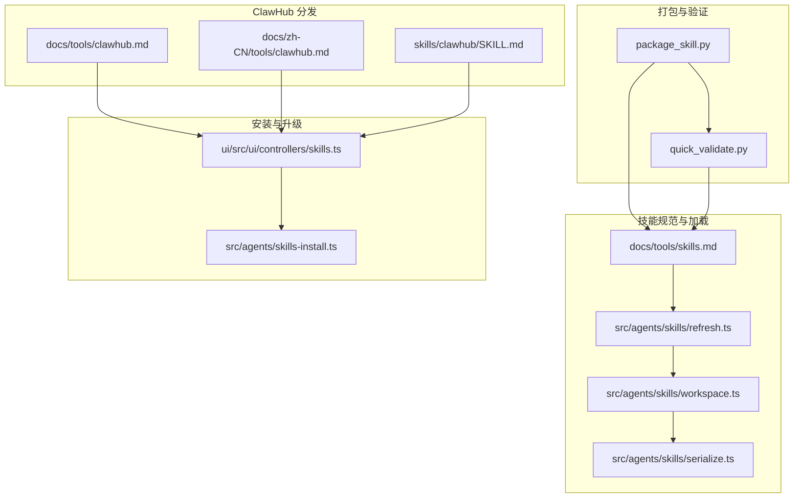
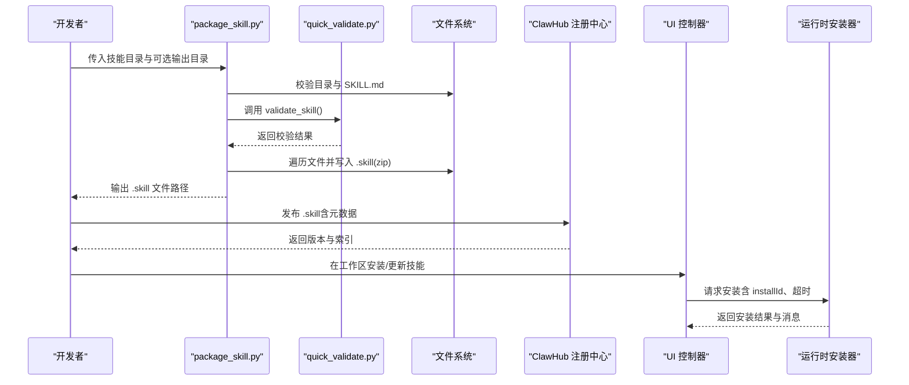
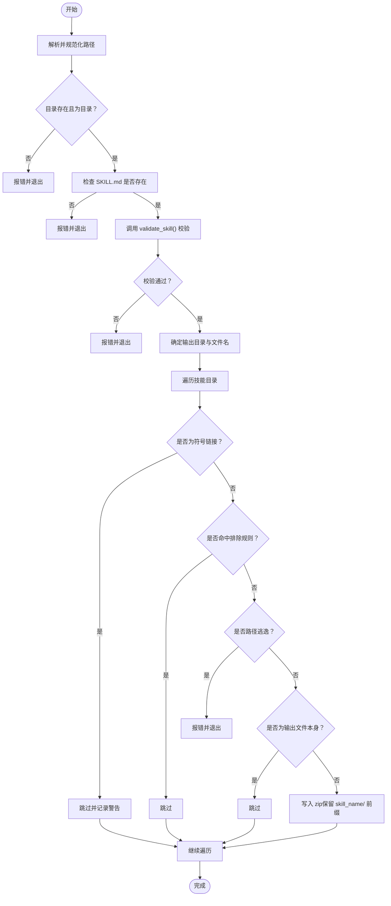
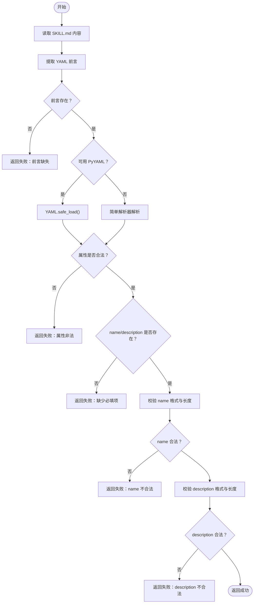
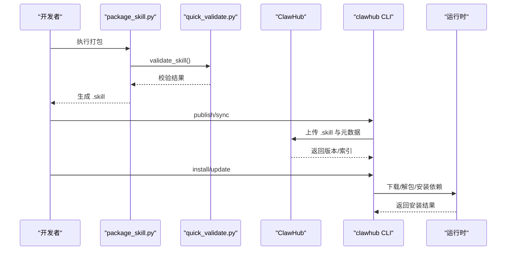
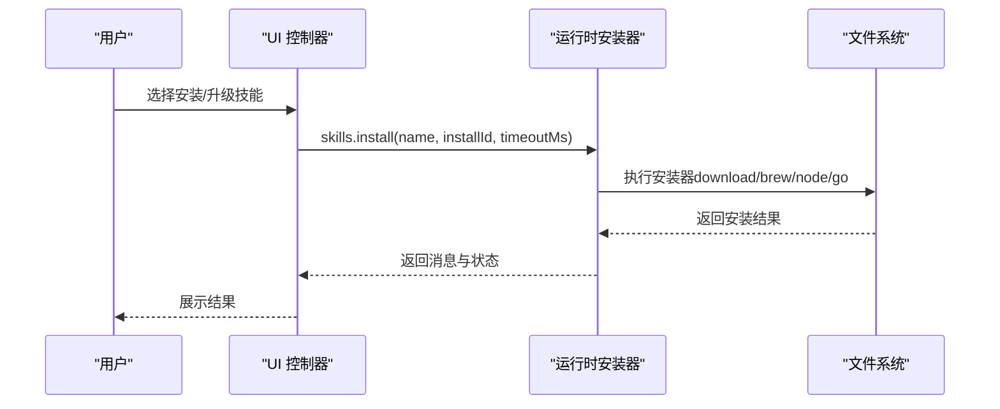
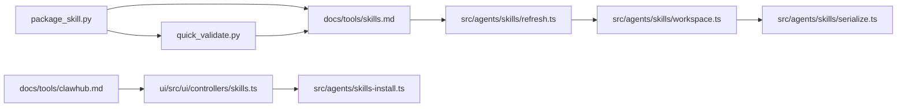

# 技能打包与分发

<cite>
**本文引用的文件**   
- [package_skill.py](file://skills/skill-creator/scripts/package_skill.py)
- [quick_validate.py](file://skills/skill-creator/scripts/quick_validate.py)
- [SKILL.md（技能创建器）](file://skills/skill-creator/SKILL.md)
- [SKILL.md（ClawHub 技能）](file://skills/clawhub/SKILL.md)
- [技能系统（英文）](file://docs/tools/skills.md)
- [ClawHub（英文）](file://docs/tools/clawhub.md)
- [ClawHub（中文）](file://docs/zh-CN/tools/clawhub.md)
- [技能 CLI 参考](file://docs/cli/skills.md)
- [技能安装与升级（前端控制器）](file://ui/src/ui/controllers/skills.ts)
- [技能安装（运行时）](file://src/agents/skills-install.ts)
- [技能快照与刷新（运行时）](file://src/agents/skills/refresh.ts)
- [技能工作区构建（运行时）](file://src/agents/skills/workspace.ts)
- [技能序列化（并发控制）](file://src/agents/skills/serialize.ts)
</cite>

## 目录

1. [简介](#简介)
2. [项目结构](#项目结构)
3. [核心组件](#核心组件)
4. [架构总览](#架构总览)
5. [详细组件分析](#详细组件分析)
6. [依赖关系分析](#依赖关系分析)
7. [性能考量](#性能考量)
8. [故障排除指南](#故障排除指南)
9. [结论](#结论)
10. [附录](#附录)

## 简介

本指南面向希望创建、打包、验证并分发 OpenClaw 技能的开发者与运维人员。文档围绕以下目标展开：

- 全面解析技能打包脚本的功能：压缩、元数据提取与格式校验、安全过滤与输出命名。
- 规范技能打包标准流程：文件过滤、依赖检查、版本管理与发布。
- 提供技能分发最佳实践：ClawHub 平台使用、技能市场发布流程与同步策略。
- 覆盖技能版本控制、更新机制与兼容性管理。
- 给出安装、卸载与升级操作指南，并提供常见问题排查方法。

## 项目结构

与“技能打包与分发”直接相关的代码与文档主要分布在如下位置：

- 打包与验证脚本：skills/skill-creator/scripts
- 技能规范与加载机制：docs/tools/skills.md
- ClawHub 使用与发布：docs/tools/clawhub.md 与 docs/zh-CN/tools/clawhub.md
- 技能安装与升级（运行时与 UI 控制器）：src/agents/skills-install.ts 与 ui/src/ui/controllers/skills.ts
- 技能快照与刷新：src/agents/skills/refresh.ts
- 技能工作区构建与序列化：src/agents/skills/workspace.ts、src/agents/skills/serialize.ts

**图示来源**

- [package_skill.py:1-140](file://skills/skill-creator/scripts/package_skill.py#L1-L140)
- [quick_validate.py:1-160](file://skills/skill-creator/scripts/quick_validate.py#L1-L160)
- [技能系统（英文）:1-303](file://docs/tools/skills.md#L1-L303)
- [技能快照与刷新（运行时）:84-167](file://src/agents/skills/refresh.ts#L84-L167)
- [技能工作区构建（运行时）:567-584](file://src/agents/skills/workspace.ts#L567-L584)
- [技能序列化（并发控制）:1-14](file://src/agents/skills/serialize.ts#L1-L14)
- [ClawHub（英文）:1-88](file://docs/tools/clawhub.md#L1-L88)
- [ClawHub（中文）:1-158](file://docs/zh-CN/tools/clawhub.md#L1-L158)
- [SKILL.md（ClawHub 技能）:1-78](file://skills/clawhub/SKILL.md#L1-L78)
- [技能安装与升级（前端控制器）:125-157](file://ui/src/ui/controllers/skills.ts#L125-L157)
- [技能安装（运行时）:392-439](file://src/agents/skills-install.ts#L392-L439)

**章节来源**

- [package_skill.py:1-140](file://skills/skill-creator/scripts/package_skill.py#L1-L140)
- [quick_validate.py:1-160](file://skills/skill-creator/scripts/quick_validate.py#L1-L160)
- [技能系统（英文）:1-303](file://docs/tools/skills.md#L1-L303)

## 核心组件

- 打包脚本 package_skill.py
  - 功能：将技能目录打包为 .skill 文件（zip），在打包前执行快速验证；严格过滤符号链接与敏感目录；确保输出文件名与目录结构正确。
  - 关键点：输入路径校验、SKILL.md 存在性校验、调用 quick_validate.validate_skill 进行前置校验、排除 .git/**pycache**/node_modules 等目录、禁止打包符号链接、输出文件名为 skill_name.skill。
- 快速验证脚本 quick_validate.py
  - 功能：对 SKILL.md 的 YAML 前言进行解析与校验，确保必需字段存在且格式合规；支持回退解析器（无 PyYAML 时）。
  - 关键点：允许属性集合、name 与 description 的格式与长度限制、描述中不允许尖括号、必要时回退到简单解析器。
- 技能规范与加载（docs/tools/skills.md）
  - 功能：定义技能目录结构、加载顺序与优先级、环境注入、能力门控（requires）、安装器配置等。
  - 关键点：三类技能来源与优先级、metadata.openclaw 能力门控、安装器类型与参数、远程节点与沙箱注意事项。
- ClawHub 分发（docs/tools/clawhub.md 与 docs/zh-CN/tools/clawhub.md）
  - 功能：公共技能注册中心，提供搜索、安装、更新、发布、同步等 CLI 能力。
  - 关键点：默认安装目录、工作区优先级、版本选择、同步策略与并发控制。
- 运行时安装与升级（src/agents/skills-install.ts 与 ui/src/ui/controllers/skills.ts）
  - 功能：根据 SKILL.md 中的 metadata.openclaw.install 列表执行安装；UI 层发起请求并反馈结果。
  - 关键点：安装器种类（download、brew、node 等）、超时控制、错误处理与警告收集。

**章节来源**

- [package_skill.py:28-112](file://skills/skill-creator/scripts/package_skill.py#L28-L112)
- [quick_validate.py:67-149](file://skills/skill-creator/scripts/quick_validate.py#L67-L149)
- [技能系统（英文）:1-303](file://docs/tools/skills.md#L1-L303)
- [ClawHub（英文）:1-88](file://docs/tools/clawhub.md#L1-L88)
- [ClawHub（中文）:1-158](file://docs/zh-CN/tools/clawhub.md#L1-L158)
- [技能安装与升级（前端控制器）:125-157](file://ui/src/ui/controllers/skills.ts#L125-L157)
- [技能安装（运行时）:392-439](file://src/agents/skills-install.ts#L392-L439)

## 架构总览

下图展示从“技能打包”到“运行时加载”的关键流转：

**图示来源**

- [package_skill.py:28-112](file://skills/skill-creator/scripts/package_skill.py#L28-L112)
- [quick_validate.py:67-149](file://skills/skill-creator/scripts/quick_validate.py#L67-L149)
- [ClawHub（英文）:115-139](file://docs/tools/clawhub.md#L115-L139)
- [技能安装与升级（前端控制器）:125-157](file://ui/src/ui/controllers/skills.ts#L125-L157)
- [技能安装（运行时）:392-439](file://src/agents/skills-install.ts#L392-L439)

## 详细组件分析

### 组件A：技能打包脚本 package_skill.py

- 输入与输出
  - 输入：技能目录路径（必须存在且为目录）、可选输出目录。
  - 输出：生成 .skill 文件（zip），文件名为 skill_name.skill。
- 处理逻辑
  - 路径与存在性校验：目录存在且为目录；SKILL.md 存在。
  - 调用 validate_skill 进行前置校验，失败则终止。
  - 排除规则：.git、.svn、.hg、**pycache**、node_modules；跳过符号链接；避免将输出文件自身写入归档。
  - 归档结构：保持 skill_name/ 前缀，按相对路径写入 zip。
- 错误处理
  - 目录不存在、非目录、SKILL.md 缺失、校验失败、写入异常、路径逃逸（escape）等情况均返回 None 并打印错误信息。
- 性能与复杂度
  - 时间复杂度近似 O(N)，N 为技能目录内文件数量；空间复杂度 O(1)（逐文件写入 zip）。
- 安全性
  - 明确拒绝符号链接；对路径逃逸进行检测；输出文件不会被写入自身。

**图示来源**

- [package_skill.py:28-112](file://skills/skill-creator/scripts/package_skill.py#L28-L112)

**章节来源**

- [package_skill.py:28-112](file://skills/skill-creator/scripts/package_skill.py#L28-L112)

### 组件B：快速验证脚本 quick_validate.py

- 前言解析
  - 支持 YAML 解析（优先）与简单回退解析器（无 PyYAML 时）。
- 校验规则
  - 允许属性集合：name、description、license、allowed-tools、metadata。
  - 必填项：name、description。
  - name 格式：小写字母、数字、短横线组成，不含连续短横线，首尾不为短横线，长度不超过阈值。
  - description 格式：字符串，不含尖括号，长度上限。
- 错误处理
  - 前言缺失、格式非法、属性非法、读取失败等均返回 False 与错误信息。

**图示来源**

- [quick_validate.py:67-149](file://skills/skill-creator/scripts/quick_validate.py#L67-L149)

**章节来源**

- [quick_validate.py:67-149](file://skills/skill-creator/scripts/quick_validate.py#L67-L149)

### 组件C：技能打包标准流程（文件过滤、依赖检查、版本管理）

- 文件过滤
  - 排除目录：.git、.svn、.hg、**pycache**、node_modules。
  - 排除符号链接：打包过程中跳过符号链接。
  - 输出文件保护：若输出文件位于技能目录内，避免将自身写入归档。
- 依赖检查
  - 运行时门控：通过 metadata.openclaw.requires.bins/env/config 在加载时检查二进制、环境变量与配置项。
  - 安装器：metadata.openclaw.install 定义安装器（brew/node/go/download 等），运行时按偏好选择安装。
- 版本管理
  - 发布版本：ClawHub 支持语义化版本号与标签（如 latest）。
  - 同步策略：支持按 patch/minor/major 自动提升版本，支持 dry-run 与并发控制。
  - 更新机制：安装/更新命令基于哈希匹配与版本解析，支持强制覆盖与批量更新。

**图示来源**

- [package_skill.py:28-112](file://skills/skill-creator/scripts/package_skill.py#L28-L112)
- [quick_validate.py:67-149](file://skills/skill-creator/scripts/quick_validate.py#L67-L149)
- [ClawHub（英文）:115-139](file://docs/tools/clawhub.md#L115-L139)
- [技能系统（英文）:106-187](file://docs/tools/skills.md#L106-L187)

**章节来源**

- [package_skill.py:75-112](file://skills/skill-creator/scripts/package_skill.py#L75-L112)
- [quick_validate.py:98-149](file://skills/skill-creator/scripts/quick_validate.py#L98-L149)
- [技能系统（英文）:106-187](file://docs/tools/skills.md#L106-L187)
- [ClawHub（英文）:115-139](file://docs/tools/clawhub.md#L115-L139)

### 组件D：技能分发最佳实践（ClawHub 平台与技能市场）

- 平台定位
  - 公共技能注册中心，提供搜索、安装、更新、发布、同步与报告能力。
- 使用要点
  - 默认安装目录与工作区优先级；支持指定版本安装与更新；支持批量更新与强制覆盖。
  - 同步命令支持多根目录扫描、自动版本提升、变更日志与并发控制。
- 技能市场发布
  - 发布时需提供 slug/name/version/changelog/tags 等元数据；ClawHub 解析元数据并分配版本，建立索引供发现与审计。

**章节来源**

- [ClawHub（英文）:1-88](file://docs/tools/clawhub.md#L1-L88)
- [ClawHub（中文）:1-158](file://docs/zh-CN/tools/clawhub.md#L1-L158)
- [SKILL.md（技能创建器）:349-373](file://skills/skill-creator/SKILL.md#L349-L373)

### 组件E：技能安装、卸载与升级（操作指南）

- 安装
  - 通过 UI 或 CLI 触发安装请求，运行时根据 metadata.openclaw.install 选择安装器并执行。
  - 支持超时控制与错误消息返回。
- 升级
  - 支持指定版本或最新版本；支持强制覆盖与批量更新。
  - 运行时通过快照刷新与监听机制实现热重载。
- 卸载
  - 文档未提供直接卸载命令；可通过禁用或删除技能目录实现；注意工作区优先级高于托管目录。

**图示来源**

- [技能安装与升级（前端控制器）:125-157](file://ui/src/ui/controllers/skills.ts#L125-L157)
- [技能安装（运行时）:392-439](file://src/agents/skills-install.ts#L392-L439)

**章节来源**

- [技能安装与升级（前端控制器）:125-157](file://ui/src/ui/controllers/skills.ts#L125-L157)
- [技能安装（运行时）:392-439](file://src/agents/skills-install.ts#L392-L439)

### 组件F：版本控制、更新机制与兼容性管理

- 版本控制
  - 发布时采用语义化版本号；同步时支持 patch/minor/major 自动提升。
- 更新机制
  - 安装/更新命令基于哈希匹配与版本解析；支持 --force 强制覆盖。
  - 运行时通过快照版本与监听机制实现热重载，变更在下次会话生效。
- 兼容性管理
  - metadata.openclaw.requires.bins/env/config 用于在加载时过滤不兼容技能。
  - 远程节点与沙箱场景下，需确保容器内具备所需二进制与网络权限。

**章节来源**

- [技能系统（英文）:106-187](file://docs/tools/skills.md#L106-L187)
- [技能快照与刷新（运行时）:84-167](file://src/agents/skills/refresh.ts#L84-L167)
- [技能工作区构建（运行时）:567-584](file://src/agents/skills/workspace.ts#L567-L584)

## 依赖关系分析

- 打包脚本依赖快速验证模块进行前置校验，二者共同保证技能元数据与结构合规。
- 运行时安装器依赖 SKILL.md 中的 metadata.openclaw.install 与 requires 字段，实现自动化安装与门控。
- UI 控制器负责发起安装请求，运行时安装器负责实际执行，二者通过 RPC/HTTP 通信。
- 技能快照与刷新模块维护全局与工作区的快照版本，确保变更在会话边界生效。

**图示来源**

- [package_skill.py:17-17](file://skills/skill-creator/scripts/package_skill.py#L17-L17)
- [quick_validate.py:11-14](file://skills/skill-creator/scripts/quick_validate.py#L11-L14)
- [技能系统（英文）:1-303](file://docs/tools/skills.md#L1-L303)
- [技能快照与刷新（运行时）:84-167](file://src/agents/skills/refresh.ts#L84-L167)
- [技能工作区构建（运行时）:567-584](file://src/agents/skills/workspace.ts#L567-L584)
- [技能序列化（并发控制）:1-14](file://src/agents/skills/serialize.ts#L1-L14)
- [ClawHub（英文）:1-88](file://docs/tools/clawhub.md#L1-L88)
- [技能安装与升级（前端控制器）:125-157](file://ui/src/ui/controllers/skills.ts#L125-L157)
- [技能安装（运行时）:392-439](file://src/agents/skills-install.ts#L392-L439)

**章节来源**

- [package_skill.py:17-17](file://skills/skill-creator/scripts/package_skill.py#L17-L17)
- [quick_validate.py:11-14](file://skills/skill-creator/scripts/quick_validate.py#L11-L14)
- [技能系统（英文）:1-303](file://docs/tools/skills.md#L1-L303)
- [技能快照与刷新（运行时）:84-167](file://src/agents/skills/refresh.ts#L84-L167)
- [技能工作区构建（运行时）:567-584](file://src/agents/skills/workspace.ts#L567-L584)
- [技能序列化（并发控制）:1-14](file://src/agents/skills/serialize.ts#L1-L14)
- [ClawHub（英文）:1-88](file://docs/tools/clawhub.md#L1-L88)
- [技能安装与升级（前端控制器）:125-157](file://ui/src/ui/controllers/skills.ts#L125-L157)
- [技能安装（运行时）:392-439](file://src/agents/skills-install.ts#L392-L439)

## 性能考量

- 打包阶段
  - 遍历文件树为 O(N)，zip 写入为流式；建议避免在技能目录中存放超大二进制文件，减少打包时间。
  - 排除 node_modules 与 **pycache** 可显著降低遍历与压缩体积。
- 运行时
  - 技能快照在会话开始时构建并在同会话内复用，减少重复扫描与构建成本。
  - 监听机制仅关注 SKILL.md 变更，避免对大型数据集的无效监控。
- 并发控制
  - 序列化函数确保同一 key 的任务串行执行，避免并发安装导致的资源竞争。

**章节来源**

- [技能快照与刷新（运行时）:84-167](file://src/agents/skills/refresh.ts#L84-L167)
- [技能工作区构建（运行时）:567-584](file://src/agents/skills/workspace.ts#L567-L584)
- [技能序列化（并发控制）:1-14](file://src/agents/skills/serialize.ts#L1-L14)

## 故障排除指南

- 打包失败
  - 症状：找不到 SKILL.md、校验失败、路径逃逸、写入异常。
  - 排查：确认技能目录结构与 SKILL.md 前言格式；检查是否存在符号链接；确认输出目录可写。
- 安装失败
  - 症状：二进制缺失、环境变量未设置、配置项为假值。
  - 排查：检查 metadata.openclaw.requires.bins/env/config；确认安装器类型与偏好设置；查看运行时返回的错误消息。
- 更新冲突
  - 症状：本地文件与已发布版本不匹配。
  - 排查：使用 --force 强制覆盖；确认版本号与标签；检查同步策略与并发设置。
- 运行时未生效
  - 症状：技能未出现在系统提示或不可用。
  - 排查：确认工作区优先级；检查快照版本与监听是否启用；重启会话以触发快照刷新。

**章节来源**

- [package_skill.py:41-112](file://skills/skill-creator/scripts/package_skill.py#L41-L112)
- [quick_validate.py:72-149](file://skills/skill-creator/scripts/quick_validate.py#L72-L149)
- [技能系统（英文）:106-187](file://docs/tools/skills.md#L106-L187)
- [技能快照与刷新（运行时）:84-167](file://src/agents/skills/refresh.ts#L84-L167)
- [技能安装（运行时）:392-439](file://src/agents/skills-install.ts#L392-L439)

## 结论

通过 package_skill.py 与 quick_validate.py 的组合，开发者可以高效地完成技能的结构与元数据校验；借助 ClawHub 的公共注册中心，技能得以标准化发布与分发；运行时的快照与监听机制保障了技能在会话内的稳定加载与热重载。遵循本文档的打包流程、版本管理与兼容性策略，可显著提升技能开发与运维效率。

## 附录

- 相关 CLI 参考
  - 技能检查与可用性诊断：openclaw skills list/info/check
- 技能来源与优先级
  - Bundled → Managed/Local（~/.openclaw/skills）→ Workspace（<workspace>/skills）

**章节来源**

- [技能 CLI 参考:1-27](file://docs/cli/skills.md#L1-L27)
- [技能系统（英文）:13-40](file://docs/tools/skills.md#L13-L40)
