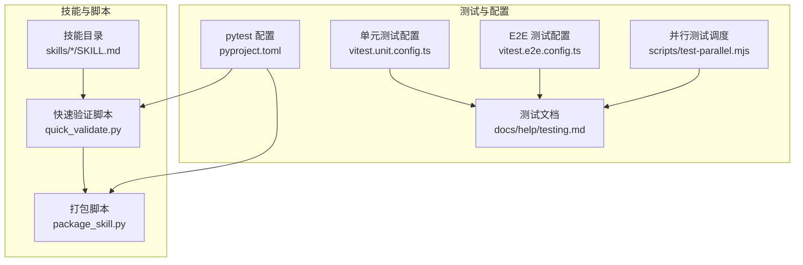
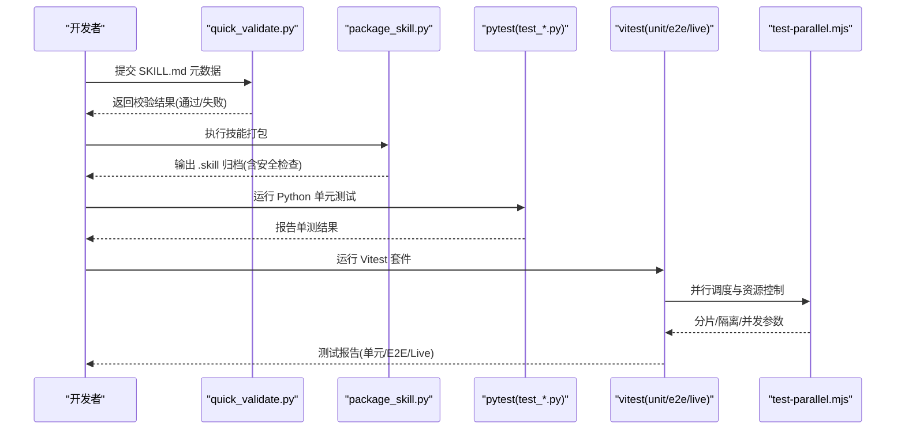
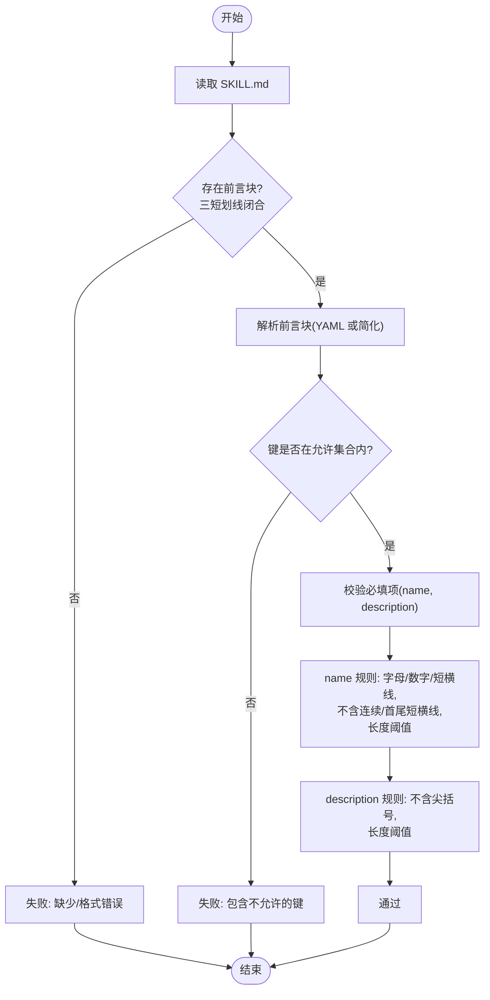
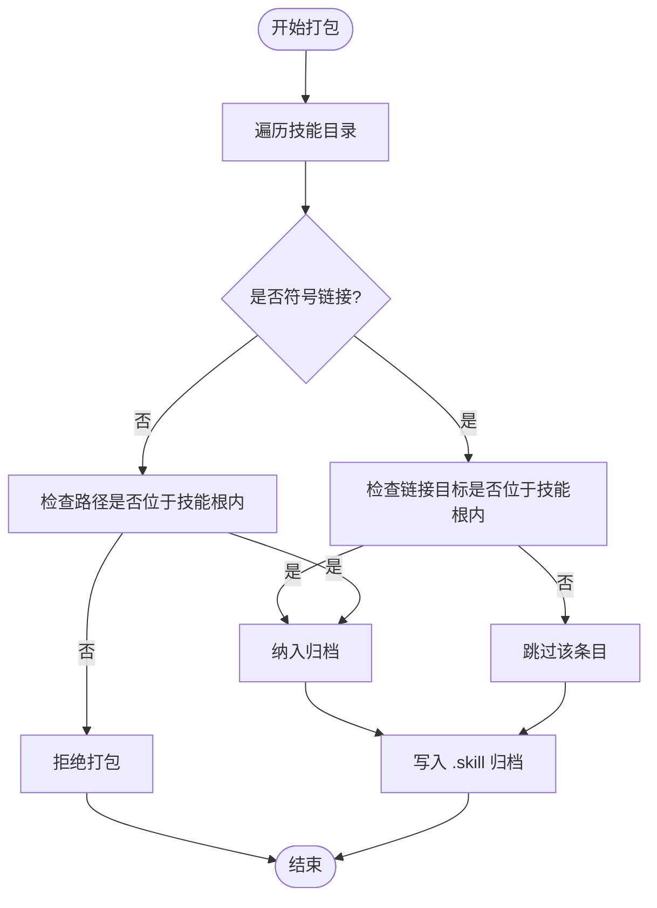
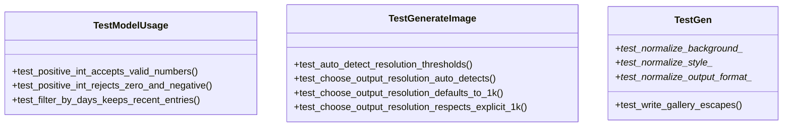
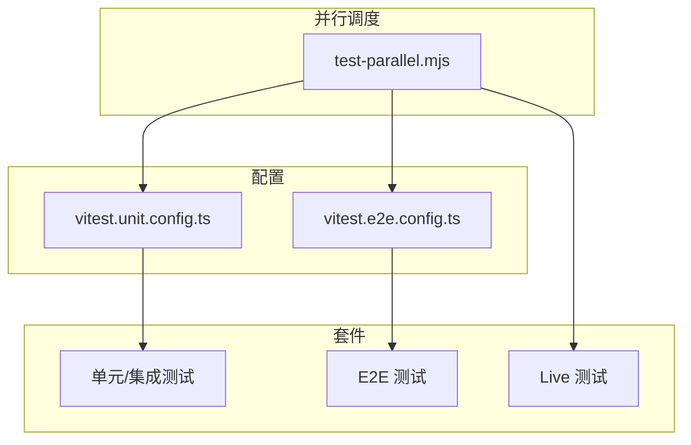
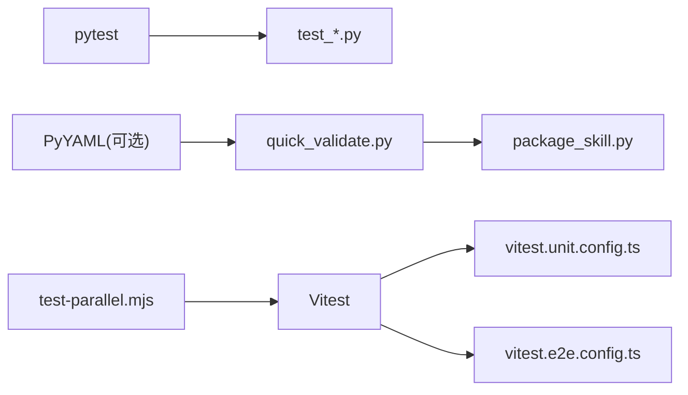

# 技能测试与验证

<cite>
**本文引用的文件**
- [quick_validate.py](file://skills/skill-creator/scripts/quick_validate.py)
- [test_quick_validate.py](file://skills/skill-creator/scripts/test_quick_validate.py)
- [package_skill.py](file://skills/skill-creator/scripts/package_skill.py)
- [test_package_skill.py](file://skills/skill-creator/scripts/test_package_skill.py)
- [test_model_usage.py](file://skills/model-usage/scripts/test_model_usage.py)
- [test_generate_image.py](file://skills/nano-banana-pro/scripts/test_generate_image.py)
- [test_gen.py](file://skills/openai-image-gen/scripts/test_gen.py)
- [pyproject.toml](file://pyproject.toml)
- [testing.md](file://docs/help/testing.md)
- [test-parallel.mjs](file://scripts/test-parallel.mjs)
- [vitest.unit.config.ts](file://vitest.unit.config.ts)
- [vitest.e2e.config.ts](file://vitest.e2e.config.ts)
</cite>

## 目录

1. [引言](#引言)
2. [项目结构](#项目结构)
3. [核心组件](#核心组件)
4. [架构总览](#架构总览)
5. [详细组件分析](#详细组件分析)
6. [依赖关系分析](#依赖关系分析)
7. [性能考量](#性能考量)
8. [故障排查指南](#故障排查指南)
9. [结论](#结论)
10. [附录](#附录)

## 引言

本指南面向技能（Skill）开发与发布流程中的“测试与验证”，目标是帮助开发者系统性地设计与执行测试策略，确保技能在功能正确性、安全性、可维护性与稳定性方面满足质量门禁。文档覆盖以下主题：

- 技能测试的重要性与测试策略设计原则
- quick_validate.py 的功能与使用方法（自动测试流程与验证规则）
- 单元测试编写指南（test\_\*.py 组织与 pytest 框架使用）
- 集成测试、性能测试与边界条件测试方法
- 测试数据准备、模拟环境搭建与测试报告分析
- 测试覆盖率要求与质量门禁标准

## 项目结构

本仓库采用多语言混合工程：TypeScript/Vitest 用于前端/后端与集成测试；Python 脚本用于技能元数据校验与打包安全检查；文档提供测试套件与运行方式说明。

**图表来源**

- [quick_validate.py:1-160](file://skills/skill-creator/scripts/quick_validate.py#L1-L160)
- [package_skill.py](file://skills/skill-creator/scripts/package_skill.py)
- [pyproject.toml:8-11](file://pyproject.toml#L8-L11)
- [vitest.unit.config.ts:1-31](file://vitest.unit.config.ts#L1-L31)
- [vitest.e2e.config.ts:1-33](file://vitest.e2e.config.ts#L1-L33)
- [test-parallel.mjs:1-500](file://scripts/test-parallel.mjs#L1-L500)
- [testing.md:1-415](file://docs/help/testing.md#L1-L415)

**章节来源**

- [pyproject.toml:8-11](file://pyproject.toml#L8-L11)
- [testing.md:10-120](file://docs/help/testing.md#L10-L120)

## 核心组件

- 快速验证器（quick_validate.py）：对技能元数据（SKILL.md 前言块）进行格式与字段校验，保证技能清单与分发一致性。
- 打包安全检查（package_skill.py + test_package_skill.py）：对技能归档过程进行安全扫描，拒绝外部链接与越界路径，避免敏感信息泄露。
- Python 单元测试（test\_\*.py）：覆盖模型用量过滤、图像生成参数规范化等辅助逻辑，使用 pytest 约定式组织。
- Vitest 测试套件（unit/e2e/live）：通过并行调度脚本与配置文件，实现多层级测试覆盖与资源隔离。

**章节来源**

- [quick_validate.py:67-149](file://skills/skill-creator/scripts/quick_validate.py#L67-L149)
- [test_package_skill.py:33-157](file://skills/skill-creator/scripts/test_package_skill.py#L33-L157)
- [test_model_usage.py:1-41](file://skills/model-usage/scripts/test_model_usage.py#L1-L41)
- [test_generate_image.py:1-37](file://skills/nano-banana-pro/scripts/test_generate_image.py#L1-L37)
- [test_gen.py:1-141](file://skills/openai-image-gen/scripts/test_gen.py#L1-L141)

## 架构总览

下图展示从“技能源码”到“测试与验证”的整体流程：元数据校验、打包安全检查、Python 单测与 Vitest 多级测试套件协同工作。

**图表来源**

- [quick_validate.py:152-160](file://skills/skill-creator/scripts/quick_validate.py#L152-L160)
- [package_skill.py](file://skills/skill-creator/scripts/package_skill.py)
- [test_package_skill.py:50-157](file://skills/skill-creator/scripts/test_package_skill.py#L50-L157)
- [test_model_usage.py:13-37](file://skills/model-usage/scripts/test_model_usage.py#L13-L37)
- [test-parallel.mjs:129-199](file://scripts/test-parallel.mjs#L129-L199)

## 详细组件分析

### 快速验证器（quick_validate.py）

- 功能概述
  - 解析 SKILL.md 前言块（支持 YAML 或简化回退解析），校验必需字段与格式约束。
  - 对名称与描述进行正则与长度限制，确保命名规范与内容安全。
- 关键验证规则
  - 前言块必须以三短划线围起且闭合；若安装了 PyYAML 则使用其解析，否则启用简化解析器。
  - 允许属性集合限定为 name、description、license、allowed-tools、metadata；出现未允许键将被拒绝。
  - name 必填，需为小写字母、数字与短横线组成，不含连续短横线，首尾不为短横线，长度不超过阈值。
  - description 必填，不含尖括号，长度上限；同时禁止在无 PyYAML 时使用复杂语法。
- 使用方法
  - 命令行：传入技能目录路径，返回状态码与提示信息。
  - 可作为预提交钩子或 CI 步骤，保障上游质量门禁。

**图表来源**

- [quick_validate.py:19-149](file://skills/skill-creator/scripts/quick_validate.py#L19-L149)

**章节来源**

- [quick_validate.py:1-160](file://skills/skill-creator/scripts/quick_validate.py#L1-L160)
- [test_quick_validate.py:13-72](file://skills/skill-creator/scripts/test_quick_validate.py#L13-L72)

### 打包安全检查（package_skill.py + test_package_skill.py）

- 安全目标
  - 防止将外部路径或符号链接指向的文件打包进技能归档，避免敏感信息外泄。
  - 确保输出归档不包含越界路径，防止目录穿越。
- 关键行为
  - 正常文件打包：归档包含 SKILL.md 与脚本文件。
  - 符号链接处理：跳过链接到外部文件或目录的条目。
  - 越界路径检测：当检测到路径解析后超出技能根目录时，拒绝打包。
  - 自引用输出：若输出目录等于技能根目录，归档中排除自身，避免自包含。
- 测试用例覆盖
  - 正常打包、嵌套文件、符号链接文件/目录、越界路径、自输出场景。

**图表来源**

- [package_skill.py](file://skills/skill-creator/scripts/package_skill.py)
- [test_package_skill.py:65-157](file://skills/skill-creator/scripts/test_package_skill.py#L65-L157)

**章节来源**

- [package_skill.py](file://skills/skill-creator/scripts/package_skill.py)
- [test_package_skill.py:33-157](file://skills/skill-creator/scripts/test_package_skill.py#L33-L157)

### Python 单元测试（pytest）

- 测试组织
  - 文件命名约定：test\_\*.py，位于各技能脚本目录下。
  - pytest 配置：通过 pyproject.toml 指定测试路径与文件模式。
- 示例能力
  - 模型用量过滤：校验按天数筛选逻辑。
  - 图像生成参数规范化：校验背景、风格、输出格式的合法化与异常处理。
  - 参数类型校验：正整数参数的边界与异常抛出。
- 最佳实践
  - 使用参数化测试覆盖边界值与典型输入。
  - 使用临时目录与断言捕获输出，确保测试隔离与可重复性。
  - 对涉及外部依赖（如文件系统）的逻辑，尽量通过 mock 或临时文件夹隔离。

**图表来源**

- [test_model_usage.py:13-37](file://skills/model-usage/scripts/test_model_usage.py#L13-L37)
- [test_generate_image.py:13-37](file://skills/nano-banana-pro/scripts/test_generate_image.py#L13-L37)
- [test_gen.py:15-141](file://skills/openai-image-gen/scripts/test_gen.py#L15-L141)

**章节来源**

- [pyproject.toml:8-11](file://pyproject.toml#L8-L11)
- [test_model_usage.py:1-41](file://skills/model-usage/scripts/test_model_usage.py#L1-L41)
- [test_generate_image.py:1-37](file://skills/nano-banana-pro/scripts/test_generate_image.py#L1-L37)
- [test_gen.py:1-141](file://skills/openai-image-gen/scripts/test_gen.py#L1-L141)

### Vitest 多级测试套件（unit/e2e/live）

- 套件定位
  - 单元/集成：纯内存、进程内集成，稳定快速，适合高频回归。
  - E2E：网关多实例、WebSocket/HTTP 表面、配对流程等端到端行为。
  - Live：真实提供商与模型，验证“今日可用性”，包含成本与速率限制考量。
- 并行与隔离
  - 通过 scripts/test-parallel.mjs 实现多泳道并行、分片与资源上限控制。
  - 单元套件默认使用 vmForks 提升启动速度，部分高冲突文件强制 fork 隔离。
  - E2E 明确使用 process forks 以避免模块状态泄漏。
- 运行建议
  - 日常开发：优先运行单元套件与覆盖率门禁。
  - 网络/协议变更：追加 E2E 套件。
  - 提供商问题回归：使用 Live 套件并缩小模型/提供商白名单。

**图表来源**

- [test-parallel.mjs:129-199](file://scripts/test-parallel.mjs#L129-L199)
- [vitest.unit.config.ts:11-30](file://vitest.unit.config.ts#L11-L30)
- [vitest.e2e.config.ts:20-32](file://vitest.e2e.config.ts#L20-L32)

**章节来源**

- [testing.md:38-120](file://docs/help/testing.md#L38-L120)
- [test-parallel.mjs:1-500](file://scripts/test-parallel.mjs#L1-L500)
- [vitest.unit.config.ts:1-31](file://vitest.unit.config.ts#L1-L31)
- [vitest.e2e.config.ts:1-33](file://vitest.e2e.config.ts#L1-L33)

## 依赖关系分析

- Python 测试依赖
  - pytest：统一的测试运行与断言框架。
  - PyYAML（可选）：增强前言块解析能力；未安装时使用内置简化解析器。
- TypeScript/Vitest 测试依赖
  - Vitest：多套件测试与并行执行。
  - Node 进程池：vmForks/forks 选择，兼顾性能与隔离。
- 工具链耦合
  - quick_validate.py 与 package_skill.py 在技能分发流水线中强耦合，前者负责“准入校验”，后者负责“打包安全”。

**图表来源**

- [pyproject.toml:8-11](file://pyproject.toml#L8-L11)
- [quick_validate.py:11-14](file://skills/skill-creator/scripts/quick_validate.py#L11-L14)
- [package_skill.py](file://skills/skill-creator/scripts/package_skill.py)
- [vitest.unit.config.ts:1-31](file://vitest.unit.config.ts#L1-L31)
- [vitest.e2e.config.ts:1-33](file://vitest.e2e.config.ts#L1-L33)
- [test-parallel.mjs:1-500](file://scripts/test-parallel.mjs#L1-L500)

**章节来源**

- [pyproject.toml:8-11](file://pyproject.toml#L8-L11)
- [quick_validate.py:11-14](file://skills/skill-creator/scripts/quick_validate.py#L11-L14)
- [package_skill.py](file://skills/skill-creator/scripts/package_skill.py)
- [vitest.unit.config.ts:1-31](file://vitest.unit.config.ts#L1-L31)
- [vitest.e2e.config.ts:1-33](file://vitest.e2e.config.ts#L1-L33)
- [test-parallel.mjs:1-500](file://scripts/test-parallel.mjs#L1-L500)

## 性能考量

- 单元测试
  - 优先使用 vmForks 提升导入/编译阶段性能；对高冲突文件强制 fork 隔离。
  - 通过并行分片与工作线程上限控制，平衡吞吐与稳定性。
- E2E 测试
  - 默认使用 process forks 降低跨文件状态泄漏风险；可通过环境变量调整并发度。
- Live 测试
  - 真实提供商调用成本高、波动大，建议使用白名单与重试策略，避免全量运行。
- 资源管理
  - CI 中根据平台与负载动态调整 worker 数量，避免 OOM 与超卖。

[本节为通用指导，无需列出具体文件来源]

## 故障排查指南

- 快速验证失败
  - 检查 SKILL.md 前言块是否闭合、键名是否在允许集合内、name/description 是否符合规则。
  - 若未安装 PyYAML，简化解析器不支持复杂语法，应改用简单键值对。
- 打包失败
  - 排查是否存在符号链接指向外部路径或目录；确认路径解析未越界。
  - 若输出目录与技能根相同，归档会排除自身，属预期行为。
- Python 单测异常
  - 使用临时目录与最小化输入复现；关注参数化用例的边界值。
  - 对 I/O 相关断言，确保文件内容转义与编码一致。
- Vitest 套件不稳定
  - 单元套件切换至 forks 隔离高冲突文件；E2E 明确使用 forks。
  - 在 CI 上根据平台与负载调整 worker 数量，避免极端负载缩放。

**章节来源**

- [quick_validate.py:83-96](file://skills/skill-creator/scripts/quick_validate.py#L83-L96)
- [test_package_skill.py:111-127](file://skills/skill-creator/scripts/test_package_skill.py#L111-L127)
- [test_gen.py:100-141](file://skills/openai-image-gen/scripts/test_gen.py#L100-L141)
- [test-parallel.mjs:304-324](file://scripts/test-parallel.mjs#L304-L324)
- [vitest.e2e.config.ts:24-28](file://vitest.e2e.config.ts#L24-L28)

## 结论

技能测试与验证应贯穿“准入—打包—单测—多级回归”的全流程：以 quick_validate.py 与 package_skill.py 构建“安全与合规”的前置防线；以 pytest 与 Vitest 多级套件保障功能正确性与稳定性；以并行调度与资源控制提升效率与可靠性。结合覆盖率门禁与质量门禁，持续迭代测试策略，确保技能在不同环境与提供商条件下可靠交付。

[本节为总结性内容，无需列出具体文件来源]

## 附录

### 测试策略设计原则

- 可观测性：所有测试均应产生明确的成功/失败信号与失败原因。
- 可重复性：测试数据与环境应可重现，必要时使用临时目录与固定种子。
- 边界优先：优先覆盖空值、极值、非法字符与异常分支。
- 成本可控：Live 测试应使用白名单与重试策略，避免全量运行。

### Python 单元测试编写指南

- 文件组织：每个功能模块对应一个 test*\*.py，函数命名使用 test*\* 前缀。
- 断言风格：使用 pytest 断言与参数化，减少重复代码。
- 依赖管理：对可选依赖（如 PyYAML）提供降级路径与兼容测试。

**章节来源**

- [pyproject.toml:8-11](file://pyproject.toml#L8-L11)
- [test_model_usage.py:13-37](file://skills/model-usage/scripts/test_model_usage.py#L13-L37)
- [test_generate_image.py:13-37](file://skills/nano-banana-pro/scripts/test_generate_image.py#L13-L37)
- [test_gen.py:15-141](file://skills/openai-image-gen/scripts/test_gen.py#L15-L141)

### 集成测试与 E2E 测试方法

- 集成测试：在进程内模拟网关/代理交互，验证路由、认证、工具调用链路。
- E2E 测试：启动多实例网关，验证 WebSocket/HTTP 表面、节点配对与网络握手。
- 运行方式：参考测试文档中的命令与环境变量，按需开启并行与静默输出。

**章节来源**

- [testing.md:60-120](file://docs/help/testing.md#L60-L120)
- [vitest.e2e.config.ts:20-32](file://vitest.e2e.config.ts#L20-L32)

### 性能测试与边界条件测试

- 性能测试：在本地或 CI 中对热点路径进行基准测量，记录耗时与内存占用。
- 边界条件：覆盖空输入、超长字符串、特殊字符、异常返回码与超时场景。

[本节为通用指导，无需列出具体文件来源]

### 测试数据准备与模拟环境

- 测试数据：使用临时目录与最小化 fixture，避免污染工作区。
- 模拟环境：对文件系统、网络与外部服务使用 mock 或容器化替代方案。

[本节为通用指导，无需列出具体文件来源]

### 测试报告分析与质量门禁

- 报告分析：关注失败用例的堆栈、断言点与输入上下文，定位根因。
- 质量门禁：建议在 CI 中设置“全量 gate（构建+检查+测试）”与“覆盖率门禁”，仅在必要时放宽 Live 测试范围。

**章节来源**

- [testing.md:21-36](file://docs/help/testing.md#L21-L36)
