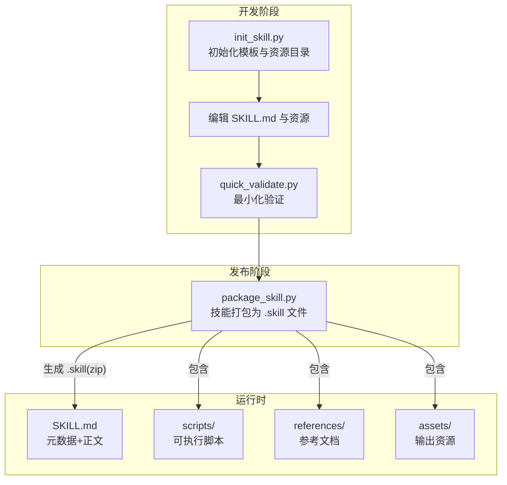
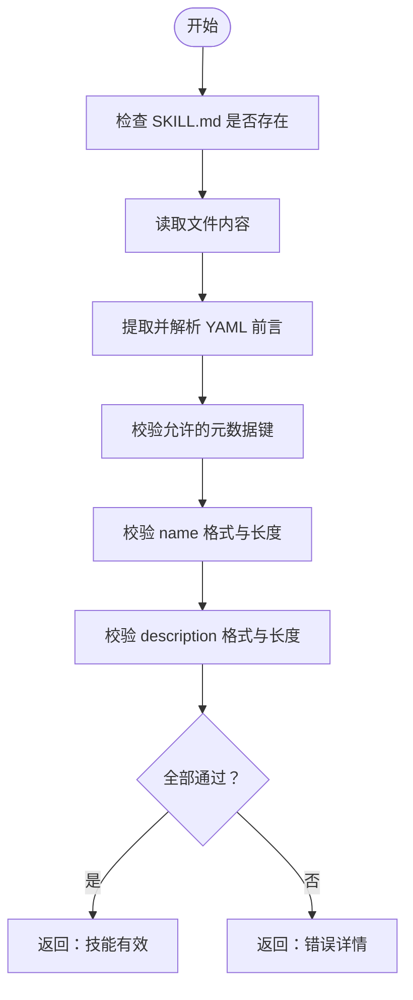
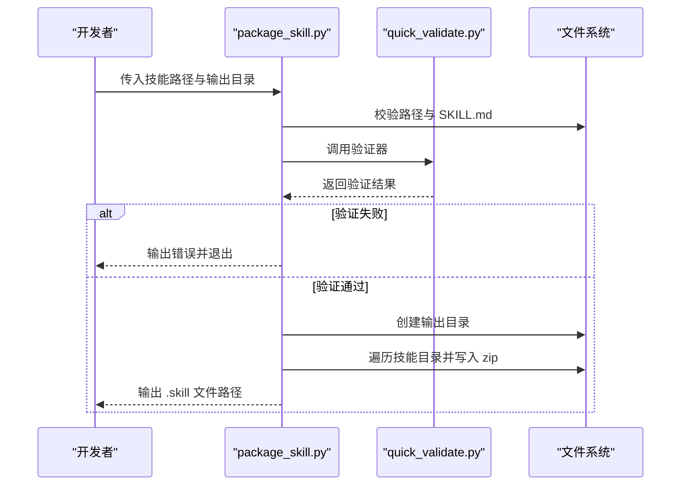
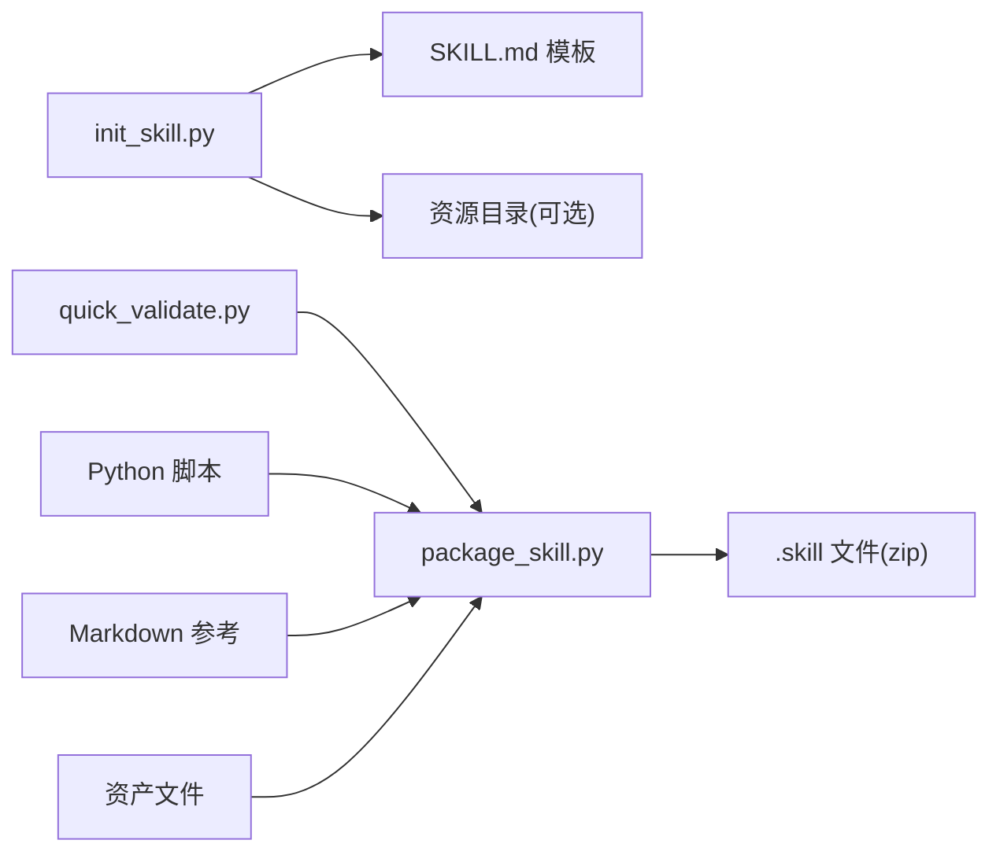

# 技能项目结构

<cite>
**本文档引用的文件**
- [skills/skill-creator/SKILL.md](file://skills/skill-creator/SKILL.md)
- [skills/skill-creator/scripts/package_skill.py](file://skills/skill-creator/scripts/package_skill.py)
- [skills/skill-creator/scripts/init_skill.py](file://skills/skill-creator/scripts/init_skill.py)
- [skills/skill-creator/scripts/quick_validate.py](file://skills/skill-creator/scripts/quick_validate.py)
- [skills/1password/SKILL.md](file://skills/1password/SKILL.md)
- [skills/canvas/SKILL.md](file://skills/canvas/SKILL.md)
- [skills/discord/SKILL.md](file://skills/discord/SKILL.md)
- [skills/github/SKILL.md](file://skills/github/SKILL.md)
- [skills/model-usage/scripts/model_usage.py](file://skills/model-usage/scripts/model_usage.py)
- [skills/nano-banana-pro/scripts/generate_image.py](file://skills/nano-banana-pro/scripts/generate_image.py)
</cite>

## 目录

1. [简介](#简介)
2. [项目结构](#项目结构)
3. [核心组件](#核心组件)
4. [架构总览](#架构总览)
5. [详细组件分析](#详细组件分析)
6. [依赖关系分析](#依赖关系分析)
7. [性能考虑](#性能考虑)
8. [故障排查指南](#故障排查指南)
9. [结论](#结论)
10. [附录](#附录)

## 简介

本文件系统性阐述“技能项目”的标准目录结构与文件组织方式，重点说明 SKILL.md 配置文件的作用与格式要求，解释项目元数据（技能名称、描述、触发条件、许可证等）的定义规范，并详细介绍 package_skill.py 脚本的功能与使用方法，包括技能打包流程与发布准备要点。最后提供最佳实践与命名规范，帮助开发者创建符合标准的技能项目。

## 项目结构

技能项目采用“模块化、自包含”的目录组织方式，每个技能以独立文件夹呈现，根目录包含必需的 SKILL.md 与可选的资源目录：scripts/（可执行代码）、references/（参考文档）、assets/（输出资源）。该结构遵循“元数据优先加载、正文按需加载、资源按需执行”的上下文窗口优化原则。

- 标准目录结构
  - 技能根目录：技能名称（仅小写字母、数字、连字符）
  - 必需文件：SKILL.md（含 YAML 前言元数据）
  - 可选资源：
    - scripts/：可直接执行的脚本（Python/Bash 等）
    - references/：按需加载的参考文档
    - assets/：用于最终输出的模板、图标、字体等

- 示例与对比
  - 1Password 技能展示了元数据扩展字段（如 homepage、metadata、allowed-tools），体现技能的生态集成能力
  - Canvas 技能提供了完整的架构图与操作流程，便于理解技能边界与交互路径
  - GitHub 技能强调了“何时使用/不使用”的明确边界，提升触发准确性

**章节来源**

- [skills/skill-creator/SKILL.md:46-126](file://skills/skill-creator/SKILL.md#L46-L126)
- [skills/1password/SKILL.md:1-23](file://skills/1password/SKILL.md#L1-L23)
- [skills/canvas/SKILL.md:13-199](file://skills/canvas/SKILL.md#L13-L199)
- [skills/discord/SKILL.md:1-6](file://skills/discord/SKILL.md#L1-L6)
- [skills/github/SKILL.md:1-29](file://skills/github/SKILL.md#L1-L29)

## 核心组件

- SKILL.md 元数据与正文
  - 元数据（YAML 前言）：name、description、license、allowed-tools、metadata 等
  - 正文（Markdown）：使用说明、工作流、参考链接、注意事项
- 资源目录
  - scripts/：确定性任务与重复性逻辑，支持直接执行
  - references/：长文档与参考材料，按需加载
  - assets/：模板与素材，不进入上下文窗口
- 验证与打包工具链
  - quick_validate.py：最小化验证器，检查元数据格式与关键字段
  - package_skill.py：将技能打包为 .skill 文件（zip），内置安全校验
  - init_skill.py：生成标准化模板，辅助初始化与资源目录创建

**章节来源**

- [skills/skill-creator/SKILL.md:63-126](file://skills/skill-creator/SKILL.md#L63-L126)
- [skills/skill-creator/scripts/quick_validate.py:67-149](file://skills/skill-creator/scripts/quick_validate.py#L67-L149)
- [skills/skill-creator/scripts/package_skill.py:28-112](file://skills/skill-creator/scripts/package_skill.py#L28-L112)
- [skills/skill-creator/scripts/init_skill.py:255-317](file://skills/skill-creator/scripts/init_skill.py#L255-L317)

## 架构总览

下图展示技能项目从“初始化”到“打包发布”的端到端流程，以及各组件之间的依赖关系。

**图表来源**

- [skills/skill-creator/scripts/init_skill.py:255-317](file://skills/skill-creator/scripts/init_skill.py#L255-L317)
- [skills/skill-creator/scripts/quick_validate.py:67-149](file://skills/skill-creator/scripts/quick_validate.py#L67-L149)
- [skills/skill-creator/scripts/package_skill.py:28-112](file://skills/skill-creator/scripts/package_skill.py#L28-L112)

**章节来源**

- [skills/skill-creator/scripts/package_skill.py:28-112](file://skills/skill-creator/scripts/package_skill.py#L28-L112)
- [skills/skill-creator/scripts/quick_validate.py:67-149](file://skills/skill-creator/scripts/quick_validate.py#L67-L149)

## 详细组件分析

### 组件一：SKILL.md 元数据与正文

- 元数据字段
  - name：技能名称（hyphen-case，长度限制，禁止特殊字符）
  - description：触发与使用说明（长度限制，禁止尖括号）
  - license：许可证标识（可选）
  - allowed-tools：允许使用的工具列表（可选）
  - metadata：扩展元数据（可选，用于平台集成或安装指引）
- 正文结构建议
  - 概述：技能目标与适用场景
  - 工作流：步骤化操作指南
  - 参考：指向 references/ 的链接
  - 注意事项：安全与合规约束

- 示例参考
  - 1Password：包含 homepage、metadata（安装与依赖声明）
  - Discord：包含 allowed-tools 与 emoji 标识
  - GitHub：包含 metadata（多平台安装方案）

**章节来源**

- [skills/skill-creator/SKILL.md:319-349](file://skills/skill-creator/SKILL.md#L319-L349)
- [skills/1password/SKILL.md:1-23](file://skills/1password/SKILL.md#L1-L23)
- [skills/discord/SKILL.md:1-6](file://skills/discord/SKILL.md#L1-L6)
- [skills/github/SKILL.md:1-29](file://skills/github/SKILL.md#L1-L29)

### 组件二：资源目录与组织策略

- scripts/
  - 用途：确定性任务、重复性逻辑、可直接执行
  - 建议：保持脚本单一职责，便于测试与维护
- references/
  - 用途：长文档、API 参考、Schema、流程指南
  - 建议：避免与 SKILL.md 重复，仅保留必要信息
- assets/
  - 用途：模板、图标、字体、样本数据等
  - 建议：不进入上下文窗口，仅在输出中使用

- 示例参考
  - model-usage：包含模型用量统计脚本与测试用例
  - nano-banana-pro：包含图像生成脚本与依赖声明

**章节来源**

- [skills/skill-creator/SKILL.md:70-100](file://skills/skill-creator/SKILL.md#L70-L100)
- [skills/model-usage/scripts/model_usage.py:1-321](file://skills/model-usage/scripts/model_usage.py#L1-L321)
- [skills/nano-banana-pro/scripts/generate_image.py:1-236](file://skills/nano-banana-pro/scripts/generate_image.py#L1-L236)

### 组件三：快速验证器（quick_validate.py）

- 功能概述
  - 校验 SKILL.md 是否存在
  - 解析并校验 YAML 前言格式
  - 校验 name 与 description 的类型、内容与长度
  - 支持无 PyYAML 环境下的简单解析
- 关键规则
  - name：hyphen-case，长度 ≤ 64，不含连续或首尾连字符
  - description：长度 ≤ 1024，不含尖括号
  - 允许属性集合：name、description、license、allowed-tools、metadata

**图表来源**

- [skills/skill-creator/scripts/quick_validate.py:67-149](file://skills/skill-creator/scripts/quick_validate.py#L67-L149)

**章节来源**

- [skills/skill-creator/scripts/quick_validate.py:67-149](file://skills/skill-creator/scripts/quick_validate.py#L67-L149)

### 组件四：技能打包器（package_skill.py）

- 功能概述
  - 在打包前自动调用验证器
  - 将技能目录打包为 .skill 文件（zip）
  - 安全限制：拒绝符号链接；禁止输出文件写入自身；排除常见隐藏目录
- 打包流程
  1. 校验输入路径与 SKILL.md 存在
  2. 调用验证器
  3. 创建输出目录（若指定）
  4. 遍历技能目录，过滤符号链接与排除项
  5. 写入 zip，保持相对路径
  6. 输出成功信息

**图表来源**

- [skills/skill-creator/scripts/package_skill.py:28-112](file://skills/skill-creator/scripts/package_skill.py#L28-L112)
- [skills/skill-creator/scripts/quick_validate.py:67-149](file://skills/skill-creator/scripts/quick_validate.py#L67-L149)

**章节来源**

- [skills/skill-creator/scripts/package_skill.py:28-112](file://skills/skill-creator/scripts/package_skill.py#L28-L112)

### 组件五：技能初始化器（init_skill.py）

- 功能概述
  - 生成标准化 SKILL.md 模板
  - 可选创建 scripts/、references/、assets/ 目录
  - 提供示例文件（可选）
- 命名与规范化
  - 自动将用户输入规范化为 hyphen-case，长度限制，去除多余连字符
- 使用提示
  - 初始化后编辑 TODO，完善描述与结构
  - 按需添加资源目录与示例

**章节来源**

- [skills/skill-creator/scripts/init_skill.py:194-225](file://skills/skill-creator/scripts/init_skill.py#L194-L225)
- [skills/skill-creator/scripts/init_skill.py:255-317](file://skills/skill-creator/scripts/init_skill.py#L255-L317)

## 依赖关系分析

- 组件耦合
  - package_skill.py 依赖 quick_validate.py 进行前置校验
  - init_skill.py 与 package_skill.py 均面向同一技能目录结构
- 外部依赖
  - PyYAML（可选）：用于更严格的 YAML 解析
  - 系统命令：如 GitHub 技能中的 gh、1Password 技能中的 op
- 安全与一致性
  - 打包阶段严格排除符号链接与敏感目录，确保分发安全
  - 验证阶段统一校验元数据格式，减少运行期错误

**图表来源**

- [skills/skill-creator/scripts/init_skill.py:255-317](file://skills/skill-creator/scripts/init_skill.py#L255-L317)
- [skills/skill-creator/scripts/quick_validate.py:67-149](file://skills/skill-creator/scripts/quick_validate.py#L67-L149)
- [skills/skill-creator/scripts/package_skill.py:28-112](file://skills/skill-creator/scripts/package_skill.py#L28-L112)

**章节来源**

- [skills/skill-creator/scripts/package_skill.py:75-112](file://skills/skill-creator/scripts/package_skill.py#L75-L112)
- [skills/skill-creator/scripts/quick_validate.py:83-107](file://skills/skill-creator/scripts/quick_validate.py#L83-L107)

## 性能考虑

- 上下文窗口优化
  - 元数据（name + description）始终在上下文中，应简洁明确
  - SKILL.md 正文按需加载，建议控制在合理长度内
  - references/ 仅在需要时加载，避免一次性塞满上下文
- 资源执行效率
  - scripts/ 可直接执行，减少上下文传输开销
  - assets/ 不进入上下文，仅在输出中使用，降低 token 消耗
- 打包与分发
  - .skill 文件为 zip，便于网络传输与缓存
  - 排除隐藏目录与符号链接，保证包体整洁与安全

[本节为通用指导，无需特定文件引用]

## 故障排查指南

- 验证失败
  - 检查 SKILL.md 是否存在且 YAML 前言格式正确
  - 确认 name 与 description 符合长度与字符规则
  - 若未安装 PyYAML，将使用简单解析器，注意语法限制
- 打包失败
  - 确保技能目录中无符号链接
  - 检查输出目录权限与磁盘空间
  - 避免将输出文件写入技能根目录内部
- 运行期问题
  - scripts/ 中的外部命令（如 gh、op）需提前安装并配置
  - references/ 文档过大时，建议拆分为多个文件并提供清晰导航

**章节来源**

- [skills/skill-creator/scripts/quick_validate.py:83-149](file://skills/skill-creator/scripts/quick_validate.py#L83-L149)
- [skills/skill-creator/scripts/package_skill.py:82-111](file://skills/skill-creator/scripts/package_skill.py#L82-L111)

## 结论

技能项目通过标准化的目录结构与严格的元数据规范，实现了“可发现、可执行、可分发”的能力边界。借助 init_skill.py、quick_validate.py 与 package_skill.py，开发者可以高效地完成技能的初始化、验证与打包，确保质量与安全性。遵循本文的最佳实践与命名规范，有助于构建高质量、易维护的技能生态。

[本节为总结性内容，无需特定文件引用]

## 附录

### A. SKILL.md 元数据字段清单

- 必填
  - name：hyphen-case，长度 ≤ 64
  - description：字符串，长度 ≤ 1024，不含尖括号
- 可选
  - license：许可证标识
  - allowed-tools：允许使用的工具列表
  - metadata：扩展元数据（如安装指引、平台集成）

**章节来源**

- [skills/skill-creator/scripts/quick_validate.py:98-147](file://skills/skill-creator/scripts/quick_validate.py#L98-L147)
- [skills/skill-creator/SKILL.md:319-349](file://skills/skill-creator/SKILL.md#L319-L349)

### B. 目录与文件命名规范

- 技能根目录：仅允许小写字母、数字、连字符，长度 ≤ 64
- 资源目录：scripts/、references/、assets/（按需创建）
- 文件：SKILL.md 必须位于技能根目录

**章节来源**

- [skills/skill-creator/scripts/quick_validate.py:16-134](file://skills/skill-creator/scripts/quick_validate.py#L16-L134)
- [skills/skill-creator/SKILL.md:214-221](file://skills/skill-creator/SKILL.md#L214-L221)

### C. 使用示例与参考

- 初始化新技能
  - 使用 init_skill.py 生成模板与资源目录
- 编辑与验证
  - 完成 SKILL.md 与资源后，使用 quick_validate.py 进行最小化验证
- 打包与发布
  - 使用 package_skill.py 生成 .skill 文件，准备分发

**章节来源**

- [skills/skill-creator/SKILL.md:263-373](file://skills/skill-creator/SKILL.md#L263-L373)
- [skills/skill-creator/scripts/package_skill.py:114-136](file://skills/skill-creator/scripts/package_skill.py#L114-L136)
