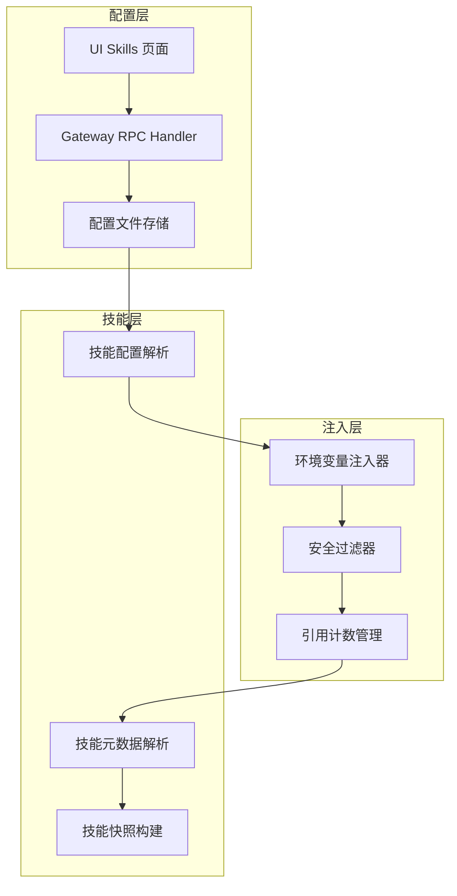
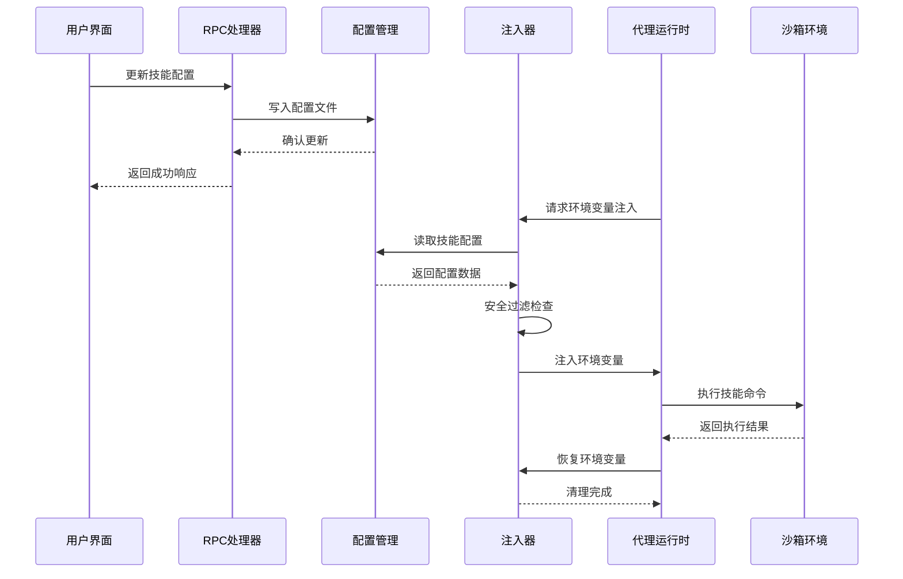
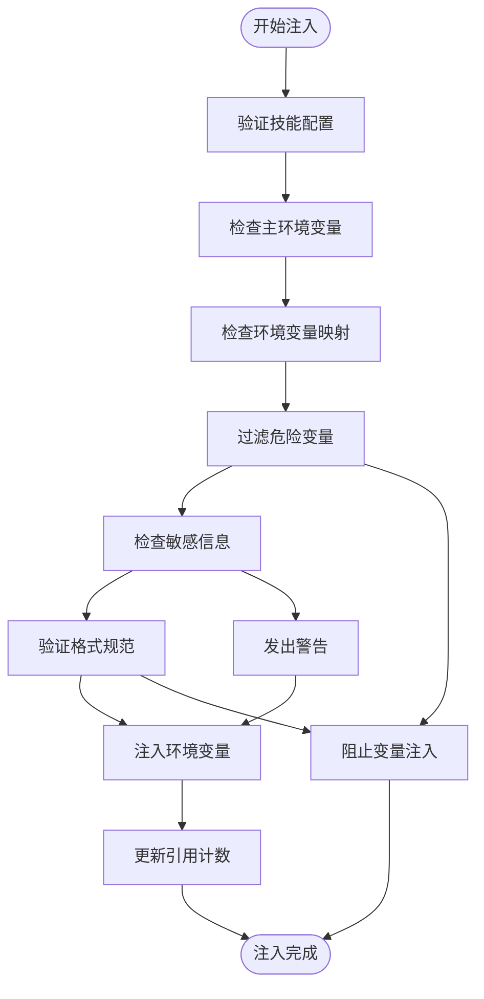
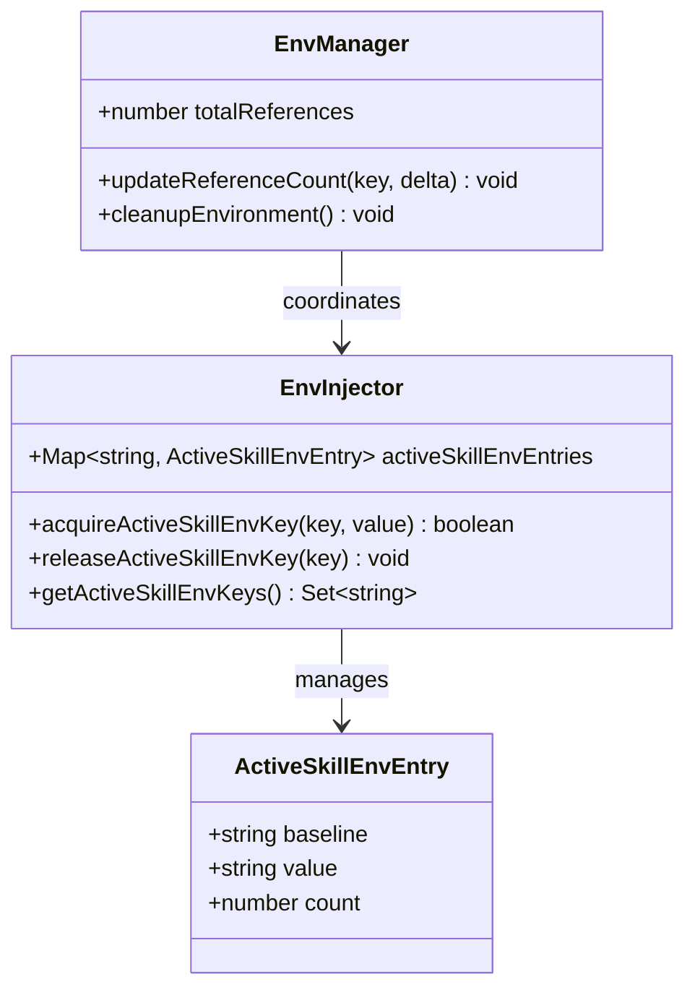
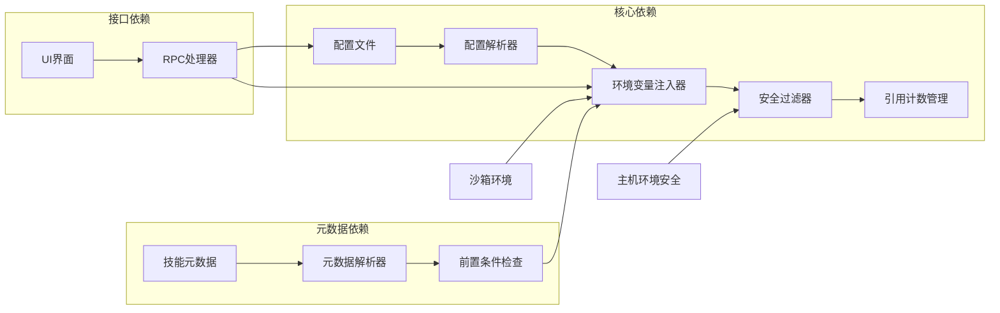
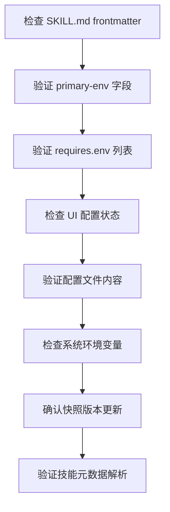

# 技能环境变量加载机制

<cite>
**本文档引用的文件**
- [src/agents/skills/env-overrides.ts](file://src/agents/skills/env-overrides.ts)
- [src/agents/skills/config.ts](file://src/agents/skills/config.ts)
- [src/agents/skills/workspace.ts](file://src/agents/skills/workspace.ts)
- [src/agents/skills/frontmatter.ts](file://src/agents/skills/frontmatter.ts)
- [src/agents/sandbox/sanitize-env-vars.ts](file://src/agents/sandbox/sanitize-env-vars.ts)
- [src/infra/host-env-security.ts](file://src/infra/host-env-security.ts)
- [src/config/types.skills.ts](file://src/config/types.skills.ts)
- [src/gateway/server-methods/skills.ts](file://src/gateway/server-methods/skills.ts)
- [ui-react/docs/skill-env-loading.md](file://ui-react/docs/skill-env-loading.md)
- [skills/openai-image-gen/SKILL.md](file://skills/openai-image-gen/SKILL.md)
- [skills/openai-whisper/SKILL.md](file://skills/openai-whisper/SKILL.md)
</cite>

## 目录
1. [简介](#简介)
2. [项目结构](#项目结构)
3. [核心组件](#核心组件)
4. [架构概览](#架构概览)
5. [详细组件分析](#详细组件分析)
6. [依赖关系分析](#依赖关系分析)
7. [性能考虑](#性能考虑)
8. [故障排除指南](#故障排除指南)
9. [结论](#结论)

## 简介

OpenClaw 的技能环境变量加载机制是一个精心设计的安全框架，它确保技能在运行时能够访问所需的环境变量，同时防止潜在的安全威胁。该机制通过将用户在 UI 中配置的 API 密钥和环境变量自动注入到进程环境中，实现了无缝的技能执行体验。

该系统的核心特点包括：
- **自动注入**：技能运行前自动注入配置的环境变量
- **安全过滤**：严格的环境变量安全检查和过滤
- **引用计数**：支持多并发运行的安全环境管理
- **透明恢复**：运行结束后自动清理和恢复环境状态

## 项目结构

技能环境变量加载机制涉及以下关键模块：

**图表来源**
- [src/gateway/server-methods/skills.ts:312-369](file://src/gateway/server-methods/skills.ts#L312-L369)
- [src/agents/skills/env-overrides.ts:213-262](file://src/agents/skills/env-overrides.ts#L213-L262)
- [src/agents/skills/config.ts:24-37](file://src/agents/skills/config.ts#L24-L37)

**章节来源**
- [src/agents/skills/env-overrides.ts:1-263](file://src/agents/skills/env-overrides.ts#L1-L263)
- [src/agents/skills/config.ts:1-104](file://src/agents/skills/config.ts#L1-L104)

## 核心组件

### 环境变量注入器

环境变量注入器是整个机制的核心组件，负责将配置的环境变量安全地注入到进程环境中。它具有以下关键功能：

- **配置解析**：从 OpenClaw 配置文件中读取技能配置
- **安全验证**：验证环境变量的安全性和有效性
- **注入控制**：精确控制哪些环境变量可以被注入
- **生命周期管理**：管理环境变量的注入和恢复

### 安全过滤器

安全过滤器提供了多层次的安全保护：

- **危险变量检测**：识别可能影响系统安全的环境变量
- **敏感信息保护**：防止敏感 API 密钥的意外泄露
- **模式匹配**：使用正则表达式模式匹配潜在威胁
- **自定义规则**：支持用户自定义的安全规则

### 引用计数管理

引用计数机制确保了多并发环境下的安全性：

- **并发支持**：允许多个技能同时运行而不互相干扰
- **状态跟踪**：跟踪每个环境变量的使用状态
- **自动清理**：在不再需要时自动清理环境变量
- **基线恢复**：恢复到注入前的原始环境状态

**章节来源**
- [src/agents/skills/env-overrides.ts:136-203](file://src/agents/skills/env-overrides.ts#L136-L203)
- [src/agents/sandbox/sanitize-env-vars.ts:62-102](file://src/agents/sandbox/sanitize-env-vars.ts#L62-L102)

## 架构概览

技能环境变量加载机制采用分层架构设计，确保了功能的模块化和安全性：

**图表来源**
- [ui-react/docs/skill-env-loading.md:13-42](file://ui-react/docs/skill-env-loading.md#L13-L42)
- [src/gateway/server-methods/skills.ts:312-369](file://src/gateway/server-methods/skills.ts#L312-L369)
- [src/agents/skills/env-overrides.ts:213-262](file://src/agents/skills/env-overrides.ts#L213-L262)

## 详细组件分析

### 环境变量注入流程

环境变量注入过程遵循严格的步骤顺序：

#### 步骤1：配置验证
系统首先验证技能配置是否存在且有效。只有当用户在 UI 中为特定技能保存了 API 密钥或环境变量时，配置才被视为有效。

#### 步骤2：主环境变量注入
如果技能声明了 `primaryEnv` 字段，系统会检查该环境变量是否可以在当前环境中安全注入。这涉及到检查系统环境变量是否已经存在以及是否由技能系统管理。

#### 步骤3：环境变量映射
系统遍历技能配置中的所有环境变量，检查它们是否可以被安全地注入到进程环境中。

#### 步骤4：安全过滤
所有待注入的环境变量都会经过严格的安全检查，包括危险变量检测和敏感信息保护。

#### 步骤5：引用计数管理
对于成功注入的环境变量，系统会更新其引用计数，确保多并发环境下的正确管理。

**章节来源**
- [ui-react/docs/skill-env-loading.md:61-115](file://ui-react/docs/skill-env-loading.md#L61-L115)
- [src/agents/skills/env-overrides.ts:136-203](file://src/agents/skills/env-overrides.ts#L136-L203)

### 安全过滤机制

安全过滤机制采用了多层次的防护策略：

**图表来源**
- [src/agents/sandbox/sanitize-env-vars.ts:62-102](file://src/agents/sandbox/sanitize-env-vars.ts#L62-L102)
- [src/infra/host-env-security.ts:59-81](file://src/infra/host-env-security.ts#L59-L81)

### 引用计数管理

引用计数机制确保了多并发环境下的安全性：

**图表来源**
- [src/agents/skills/env-overrides.ts:14-71](file://src/agents/skills/env-overrides.ts#L14-L71)

**章节来源**
- [src/agents/skills/env-overrides.ts:33-71](file://src/agents/skills/env-overrides.ts#L33-L71)
- [ui-react/docs/skill-env-loading.md:159-171](file://ui-react/docs/skill-env-loading.md#L159-L171)

### 主环境变量自动推断

系统支持智能的主环境变量推断机制：

| 推断类型 | 条件 | 结果 |
|---------|------|------|
| 显式声明 | `metadata.openclaw.primaryEnv` 存在 | 使用指定的主环境变量 |
| 顶层声明 | `primary-env` frontmatter 字段存在 | 使用指定的主环境变量 |
| 自动推断 | `requires.env` 恰好有一个元素 | 使用该唯一元素作为主环境变量 |
| 无推断 | 多个或空的 `requires.env` | 不进行自动推断 |

**章节来源**
- [src/agents/skills/frontmatter.ts:197-220](file://src/agents/skills/frontmatter.ts#L197-L220)
- [ui-react/docs/skill-env-loading.md:226-288](file://ui-react/docs/skill-env-loading.md#L226-L288)

## 依赖关系分析

技能环境变量加载机制涉及多个相互依赖的组件：

**图表来源**
- [src/config/types.skills.ts:3-8](file://src/config/types.skills.ts#L3-L8)
- [src/agents/skills/config.ts:24-37](file://src/agents/skills/config.ts#L24-L37)
- [src/gateway/server-methods/skills.ts:312-369](file://src/gateway/server-methods/skills.ts#L312-L369)

**章节来源**
- [src/agents/skills/workspace.ts:567-584](file://src/agents/skills/workspace.ts#L567-L584)
- [src/agents/skills/env-overrides.ts:236-262](file://src/agents/skills/env-overrides.ts#L236-L262)

## 性能考虑

技能环境变量加载机制在设计时充分考虑了性能优化：

### 缓存策略
- **快照缓存**：技能快照具有版本缓存，避免频繁重新构建
- **配置缓存**：配置解析结果进行缓存，减少重复计算
- **元数据缓存**：技能元数据解析结果缓存，提高查询效率

### 并发优化
- **引用计数**：支持多并发环境下的高效资源管理
- **原子操作**：环境变量注入和恢复操作的原子性保证
- **最小化锁定**：尽量减少锁的持有时间

### 内存管理
- **及时清理**：运行结束后立即清理环境变量
- **内存池**：使用内存池减少频繁分配
- **垃圾回收**：合理利用 JavaScript 的垃圾回收机制

## 故障排除指南

### 常见问题及解决方案

| 问题编号 | 问题描述 | 触发条件 | 解决方案 |
|---------|---------|---------|---------|
| A | 无技能配置 | 用户从未在 UI 配置技能 | 在 UI Skills 页面保存 API key 或环境变量 |
| B | 系统环境变量冲突 | `process.env[primaryEnv]` 已存在 | 检查 shell 配置，移除冲突的 `export` 语句 |
| C | 缺少 `primary-env` 声明 | SKILL.md 未声明主环境变量 | 添加 `primary-env: OPENAI_API_KEY` 字段 |
| D | API 密钥为空 | UI 中未填写 API 密钥 | 在 UI 中填入并保存有效的 API 密钥 |
| E | 环境变量覆盖冲突 | `skillConfig.env` 中同名键存在 | 确保 env 字段与 API 密钥保持一致 |
| F | 外部环境变量干扰 | 系统环境变量已设置 | 清除系统环境变量，让配置管理系统接管 |
| G | 敏感变量未声明 | SKILL.md 未声明 `requires.env` | 添加 `requires: env: [MY_KEY]` 字段 |

### 调试检查清单

**图表来源**
- [ui-react/docs/skill-env-loading.md:212-222](file://ui-react/docs/skill-env-loading.md#L212-L222)

**章节来源**
- [ui-react/docs/skill-env-loading.md:117-128](file://ui-react/docs/skill-env-loading.md#L117-L128)
- [ui-react/docs/skill-env-loading.md:212-222](file://ui-react/docs/skill-env-loading.md#L212-L222)

## 结论

OpenClaw 的技能环境变量加载机制通过精心设计的安全架构，实现了环境变量管理的自动化、安全化和高效化。该机制不仅简化了用户的使用体验，还通过多层次的安全防护确保了系统的安全性。

### 主要优势

1. **安全性**：通过严格的安全过滤和危险变量检测，防止潜在的安全威胁
2. **易用性**：用户无需手动配置环境变量，系统自动完成注入和管理
3. **可靠性**：通过引用计数和生命周期管理，确保多并发环境下的稳定性
4. **可维护性**：清晰的代码结构和完善的错误处理机制

### 技术亮点

- **智能推断**：支持主环境变量的自动推断，减少用户配置负担
- **快照缓存**：通过快照机制提高性能，避免频繁重新构建
- **并发安全**：引用计数机制确保多并发环境下的正确性
- **透明管理**：自动注入和恢复，用户无需关心底层实现细节

该机制为 OpenClaw 的技能系统提供了坚实的基础，使得用户可以专注于技能的实际使用，而无需担心复杂的环境配置问题。