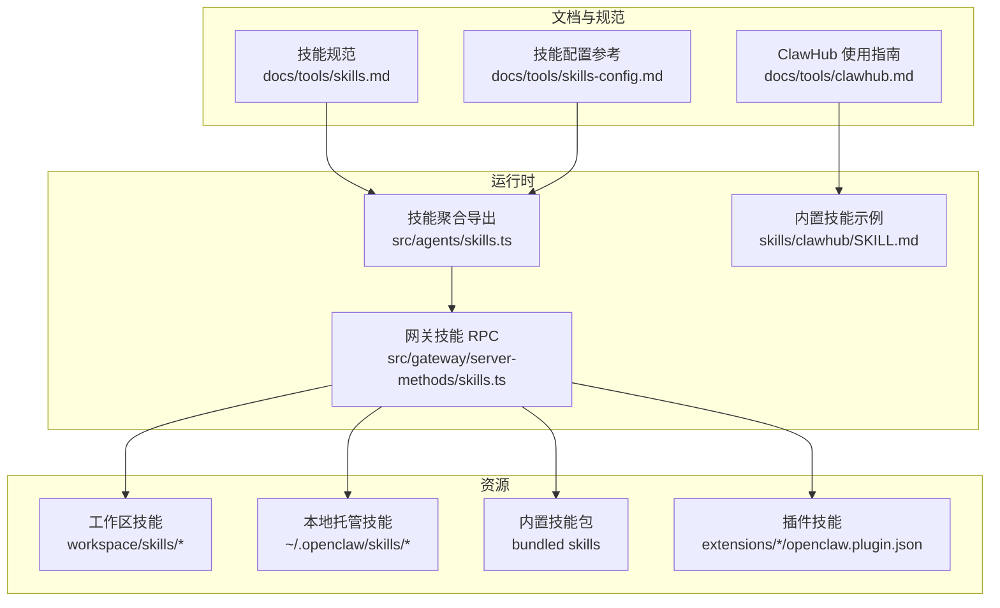
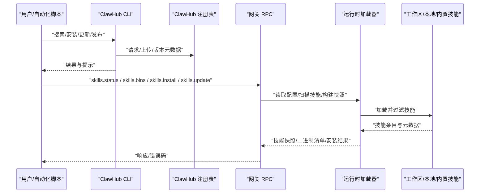
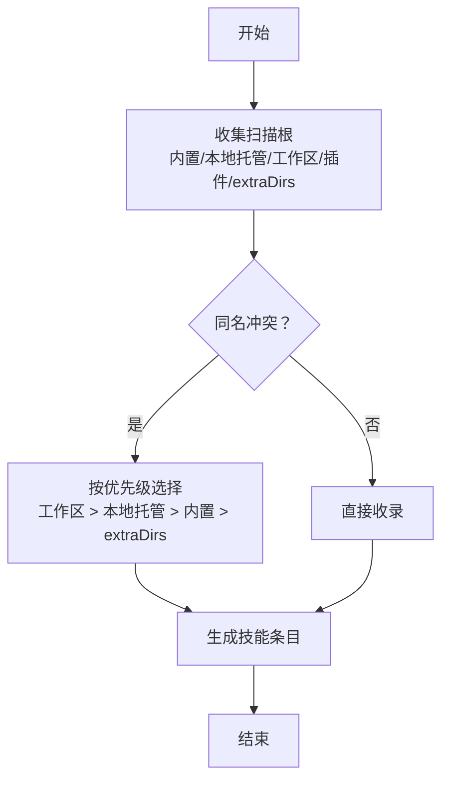
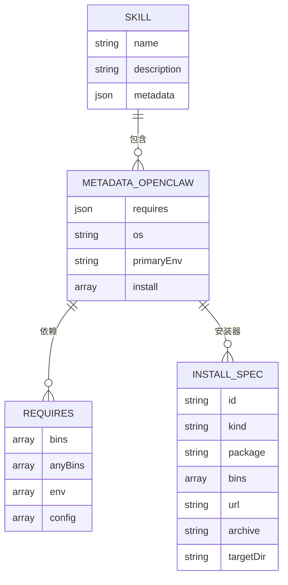
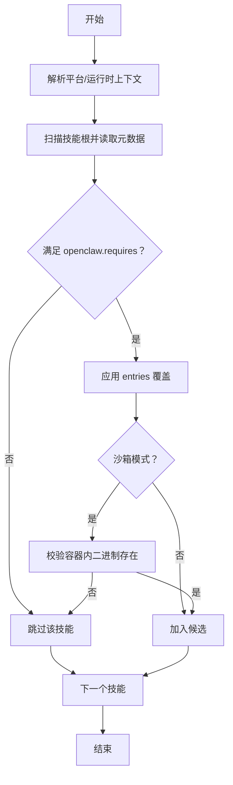
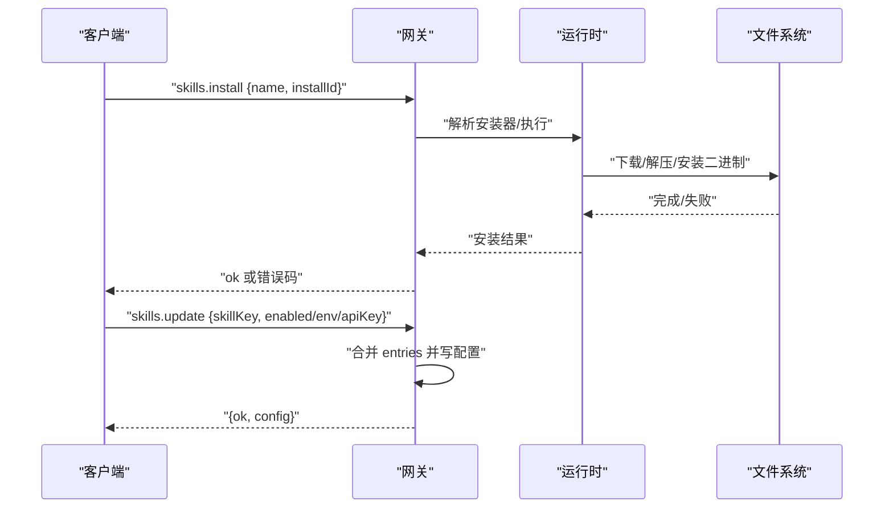
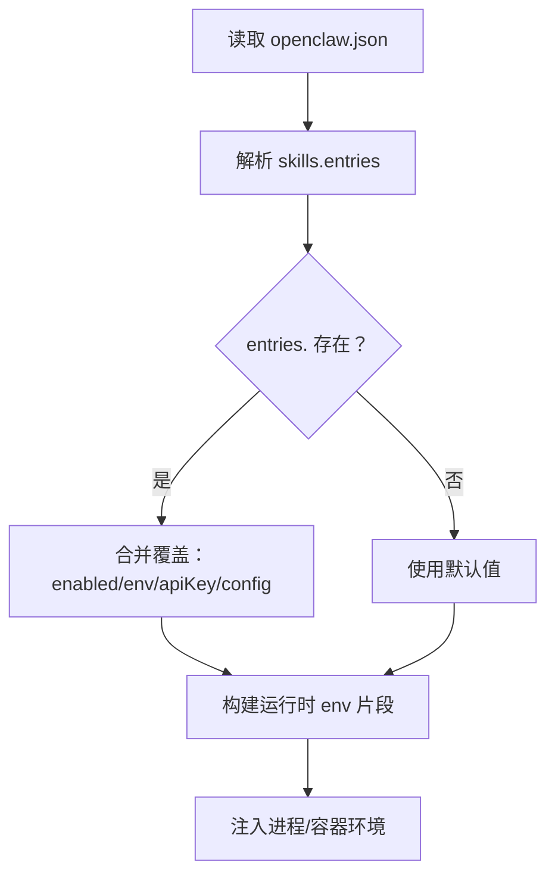
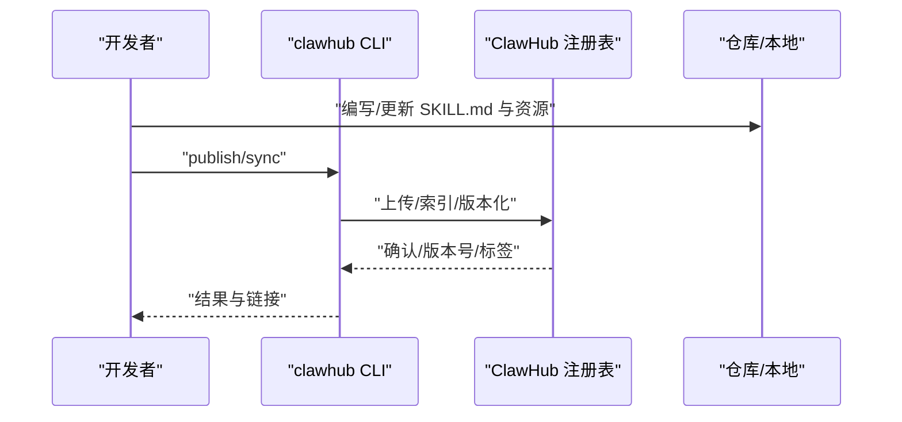
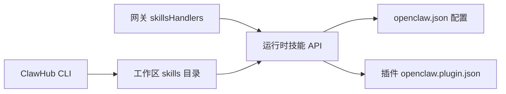

# 技能管理

<cite>
**本文引用的文件**
- [skills.md](file://docs/tools/skills.md)
- [skills-config.md](file://docs/tools/skills-config.md)
- [clawhub.md](file://docs/tools/clawhub.md)
- [skills.ts](file://src/agents/skills.ts)
- [skills.ts（网关服务端）](file://src/gateway/server-methods/skills.ts)
- [clawhub/SKILL.md](file://skills/clawhub/SKILL.md)
- [openclaw.plugin.json（示例）](file://extensions/diffs/openclaw.plugin.json)
</cite>

## 目录

1. [简介](#简介)
2. [项目结构](#项目结构)
3. [核心组件](#核心组件)
4. [架构总览](#架构总览)
5. [详细组件分析](#详细组件分析)
6. [依赖分析](#依赖分析)
7. [性能考虑](#性能考虑)
8. [故障排查指南](#故障排查指南)
9. [结论](#结论)
10. [附录](#附录)

## 简介

本文件系统化阐述 OpenClaw 的“技能管理”能力：包括技能的安装、更新、卸载与状态监控；技能目录结构与加载优先级；配置文件格式与环境注入；依赖解析与装闸规则；生命周期与版本控制；冲突与并发处理；高级配置、权限与安全；批量管理与自动化部署；以及技能市场（ClawHub）的使用与社区贡献流程。

## 项目结构

技能管理涉及文档、核心运行时、网关 RPC 方法、内置技能与插件技能等多层协作：

- 文档层：技能规范、配置参考、ClawHub 使用指南
- 运行时层：技能加载、过滤、快照、命令构建、环境注入
- 网关层：RPC 接口（状态查询、二进制收集、安装、更新）
- 资源层：内置技能、工作区技能、扩展插件技能
- 市场层：ClawHub CLI 与注册表

图表来源

- [skills.md:1-303](file://docs/tools/skills.md#L1-L303)
- [skills-config.md:1-78](file://docs/tools/skills-config.md#L1-L78)
- [clawhub.md:1-258](file://docs/tools/clawhub.md#L1-L258)
- [skills.ts:1-47](file://src/agents/skills.ts#L1-L47)
- [skills.ts（网关服务端）:1-205](file://src/gateway/server-methods/skills.ts#L1-L205)
- [clawhub/SKILL.md:1-78](file://skills/clawhub/SKILL.md#L1-L78)

章节来源

- [skills.md:1-303](file://docs/tools/skills.md#L1-L303)
- [skills-config.md:1-78](file://docs/tools/skills-config.md#L1-L78)
- [clawhub.md:1-258](file://docs/tools/clawhub.md#L1-L258)
- [skills.ts:1-47](file://src/agents/skills.ts#L1-L47)
- [skills.ts（网关服务端）:1-205](file://src/gateway/server-methods/skills.ts#L1-L205)
- [clawhub/SKILL.md:1-78](file://skills/clawhub/SKILL.md#L1-L78)

## 核心组件

- 技能加载与过滤
  - 加载顺序与优先级：工作区技能 > 本地托管技能 > 内置技能；可额外追加扫描目录
  - 装闸规则：平台、二进制、环境变量、配置项、沙箱内二进制存在性
  - 快照与热重载：会话开始时快照，支持监听变更后在下一轮生效
- 配置与覆盖
  - 全局配置 openclaw.json 下 skills 字段：允许/禁用、环境注入、API Key、安装偏好
  - per-skill entries 映射到技能名或 metadata.openclaw.skillKey
- 网关 RPC
  - skills.status：按 agentId 汇总技能可用性与二进制清单
  - skills.bins：汇总所有工作区已启用技能所需的二进制
  - skills.install：调用安装器执行安装
  - skills.update：在线修改技能配置（启用/禁用、env、apiKey）
- 市场与发布
  - ClawHub 提供搜索、安装、更新、发布、同步备份等能力
  - CLI 默认写入工作区 skills 目录，重启会话后生效

章节来源

- [skills.md:13-77](file://docs/tools/skills.md#L13-L77)
- [skills-config.md:13-78](file://docs/tools/skills-config.md#L13-L78)
- [skills.ts（网关服务端）:57-205](file://src/gateway/server-methods/skills.ts#L57-L205)
- [clawhub.md:118-258](file://docs/tools/clawhub.md#L118-L258)

## 架构总览

技能管理由“文档规范 + 运行时加载 + 网关接口 + 市场工具”构成闭环。

图表来源

- [skills.ts（网关服务端）:57-205](file://src/gateway/server-methods/skills.ts#L57-L205)
- [skills.ts:36-47](file://src/agents/skills.ts#L36-L47)
- [clawhub.md:118-258](file://docs/tools/clawhub.md#L118-L258)

## 详细组件分析

### 组件一：技能目录结构与加载优先级

- 三类来源
  - 内置技能：随安装包分发
  - 本地托管技能：~/.openclaw/skills
  - 工作区技能：<workspace>/skills
- 优先级：工作区 > 本地托管 > 内置
- 可通过 skills.load.extraDirs 追加扫描目录（最低优先级）
- 插件可通过 openclaw.plugin.json 声明自身 skills 目录，参与同一优先级规则

图表来源

- [skills.md:13-48](file://docs/tools/skills.md#L13-L48)

章节来源

- [skills.md:13-48](file://docs/tools/skills.md#L13-L48)

### 组件二：技能格式与元数据（AgentSkills + Pi 兼容）

- 必要字段：name、description
- 元数据要求：单行 JSON 对象，metadata.openclaw 下定义装闸与安装器
- 关键元数据键
  - openclaw.requires：bins/anyBins、env、config
  - openclaw.os：平台白名单
  - openclaw.primaryEnv：与 skills.entries.<key>.apiKey 对应
  - openclaw.install：安装器数组（brew/node/go/download）
- 使用约定：{baseDir} 引用技能根路径；支持 user-invocable、disable-model-invocation、command-dispatch 等

图表来源

- [skills.md:78-187](file://docs/tools/skills.md#L78-L187)

章节来源

- [skills.md:78-187](file://docs/tools/skills.md#L78-L187)

### 组件三：依赖解析与装闸算法

- 装闸条件
  - 平台匹配（os）
  - PATH 中二进制存在（requires.bins/anyBins）
  - 环境变量存在或已在配置中提供（requires.env）
  - 配置路径为真（requires.config）
  - 沙箱内二进制存在（容器内需额外准备）
- 解析流程
  - 读取 SKILL.md 元数据
  - 依据运行平台与 PATH 判定候选集
  - 结合 openclaw.json 的 entries 覆盖（enabled/env/apiKey/config）
  - 生成最终“可执行技能”列表

图表来源

- [skills.md:106-187](file://docs/tools/skills.md#L106-L187)

章节来源

- [skills.md:106-187](file://docs/tools/skills.md#L106-L187)

### 组件四：生命周期管理（安装、更新、卸载、状态监控）

- 安装
  - 通过网关 skills.install 触发安装器执行
  - 支持超时参数；返回安装结果
- 更新
  - skills.update 在线修改技能 entries（enabled/env/apiKey）
  - 写回配置文件，下次新会话生效
- 卸载
  - 删除工作区或本地托管目录中的技能文件夹
  - 重新扫描后不再纳入候选
- 状态监控
  - skills.status 返回每个 agent 的技能可用性与二进制清单
  - skills.bins 汇总所有工作区已启用技能所需二进制

图表来源

- [skills.ts（网关服务端）:114-203](file://src/gateway/server-methods/skills.ts#L114-L203)

章节来源

- [skills.ts（网关服务端）:57-205](file://src/gateway/server-methods/skills.ts#L57-L205)

### 组件五：配置文件格式与环境注入

- 配置入口：~/.openclaw/openclaw.json 下 skills 字段
- 主要子项
  - allowBundled：仅允许特定内置技能
  - load.extraDirs/watch/watchDebounceMs：扫描与监听
  - install.preferBrew/nodeManager：安装偏好
  - entries.<skillKey>：enabled/env/apiKey/config
- 环境注入
  - 运行时按需注入 process.env（仅对宿主运行有效）
  - 沙箱场景需通过 agents.defaults.sandbox.docker.env 或自定义镜像注入

图表来源

- [skills-config.md:13-78](file://docs/tools/skills-config.md#L13-L78)
- [skills.md:189-241](file://docs/tools/skills.md#L189-L241)

章节来源

- [skills-config.md:13-78](file://docs/tools/skills-config.md#L13-L78)
- [skills.md:189-241](file://docs/tools/skills.md#L189-L241)

### 组件六：版本控制与冲突解决

- 版本控制
  - 内置技能版本随安装包；工作区/本地托管技能版本由用户维护
  - ClawHub 发布采用语义化版本，支持标签（如 latest）
- 冲突解决
  - 同名技能按优先级覆盖：工作区 > 本地托管 > 内置 > extraDirs
  - 插件技能与内置/托管同规则；若插件未启用则不参与加载
- 并发与一致性
  - 监听器去抖（watchDebounceMs）降低频繁刷新
  - 会话内复用快照，跨会话生效新配置

章节来源

- [skills.md:13-48](file://docs/tools/skills.md#L13-L48)
- [skills-config.md:17-21](file://docs/tools/skills-config.md#L17-L21)

### 组件七：权限控制与安全

- 第三方技能视为不受信代码，建议沙箱执行
- 环境注入仅影响当前 agent 运行，非全局 shell
- 二进制探测在宿主进行；沙箱内需提前准备
- 敏感信息（API Key）建议使用 SecretRef 或受控注入

章节来源

- [skills.md:69-77](file://docs/tools/skills.md#L69-L77)

### 组件八：批量管理与自动化部署

- 批量安装/更新
  - ClawHub CLI 支持 --all 与 --force
  - 网关 skills.update 支持批量修改 entries
- 自动化部署
  - 通过 CI/CD 将技能目录与 openclaw.json 部署到目标机器
  - 使用 skills.bins 与远程节点能力（system.run 允许时）动态评估 macOS-only 技能
- 故障恢复
  - 回滚至上一个稳定版本（ClawHub 标签）
  - 清理冲突目录，恢复默认 entries

章节来源

- [clawhub.md:152-221](file://docs/tools/clawhub.md#L152-L221)
- [skills.ts（网关服务端）:91-113](file://src/gateway/server-methods/skills.ts#L91-L113)

### 组件九：技能市场（ClawHub）使用与社区贡献

- 使用流程
  - 登录、搜索、安装、更新、发布、同步备份
  - 默认写入工作区 skills 目录，重启会话后生效
- 社区贡献
  - 发布新版本、评论与评分、举报不当内容
  - 成为版主后可审核与管理

图表来源

- [clawhub.md:160-221](file://docs/tools/clawhub.md#L160-L221)
- [clawhub/SKILL.md:44-78](file://skills/clawhub/SKILL.md#L44-L78)

章节来源

- [clawhub.md:1-258](file://docs/tools/clawhub.md#L1-L258)
- [clawhub/SKILL.md:1-78](file://skills/clawhub/SKILL.md#L1-L78)

## 依赖分析

- 运行时与网关
  - 网关 skillsHandlers 依赖运行时的技能加载与状态构建函数
  - 运行时导出统一的技能类型与快照构建 API
- 插件与技能
  - 插件通过 openclaw.plugin.json 声明 skills 目录，参与同一加载与优先级体系
- 市场与工作区
  - ClawHub CLI 将技能写入工作区，OpenClaw 在下一次会话加载

图表来源

- [skills.ts（网关服务端）:1-25](file://src/gateway/server-methods/skills.ts#L1-L25)
- [skills.ts:1-35](file://src/agents/skills.ts#L1-L35)
- [openclaw.plugin.json（示例）](file://extensions/diffs/openclaw.plugin.json)

章节来源

- [skills.ts（网关服务端）:1-25](file://src/gateway/server-methods/skills.ts#L1-L25)
- [skills.ts:1-35](file://src/agents/skills.ts#L1-L35)
- [openclaw.plugin.json（示例）](file://extensions/diffs/openclaw.plugin.json)

## 性能考虑

- 快照与热重载
  - 会话开始时缓存技能快照，减少重复解析成本
  - 监听器去抖（watchDebounceMs）避免频繁刷新
- 提示词开销
  - 技能列表注入提示词有确定字符开销，注意技能数量与字段长度
- 沙箱启动
  - 预先准备容器内二进制，避免首次运行时安装导致延迟

章节来源

- [skills.md:242-286](file://docs/tools/skills.md#L242-L286)

## 故障排查指南

- 常见问题
  - 二进制缺失：检查 PATH 与沙箱内 setupCommand
  - 环境变量未注入：确认 entries.env 与 process.env 注入时机
  - 权限不足：沙箱内需网络、可写根 FS、root 用户
- 排查步骤
  - 使用 skills.status 查看技能可用性
  - 使用 skills.bins 检查缺失的二进制
  - 使用 skills.update 修正 entries 配置
  - 重启会话以应用配置变更

章节来源

- [skills.ts（网关服务端）:57-113](file://src/gateway/server-methods/skills.ts#L57-L113)
- [skills-config.md:67-78](file://docs/tools/skills-config.md#L67-L78)

## 结论

OpenClaw 的技能管理以“规范 + 运行时 + 网关 + 市场”的方式形成闭环：通过明确的目录优先级、严格的装闸规则、可配置的环境注入与快照机制，确保技能在多代理、多平台、多沙箱场景下的可控与可维护。配合 ClawHub 的公共注册表与 CLI 工具链，实现了从发现、安装、更新到发布的完整自动化流程。

## 附录

- 相关文件路径
  - 技能规范与加载：docs/tools/skills.md
  - 技能配置参考：docs/tools/skills-config.md
  - ClawHub 使用指南：docs/tools/clawhub.md
  - 运行时技能聚合导出：src/agents/skills.ts
  - 网关技能 RPC：src/gateway/server-methods/skills.ts
  - 内置 ClawHub 技能：skills/clawhub/SKILL.md
  - 插件声明示例：extensions/\*/openclaw.plugin.json
