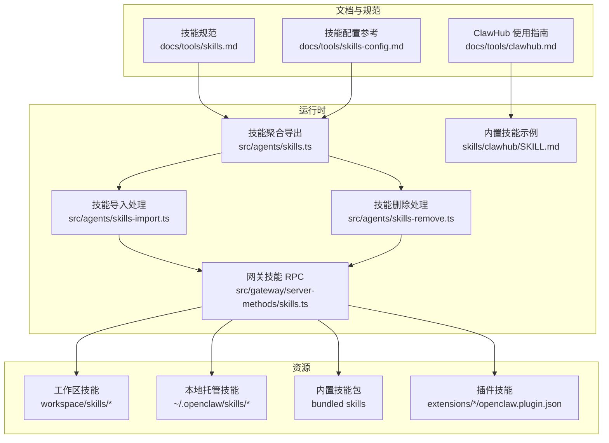
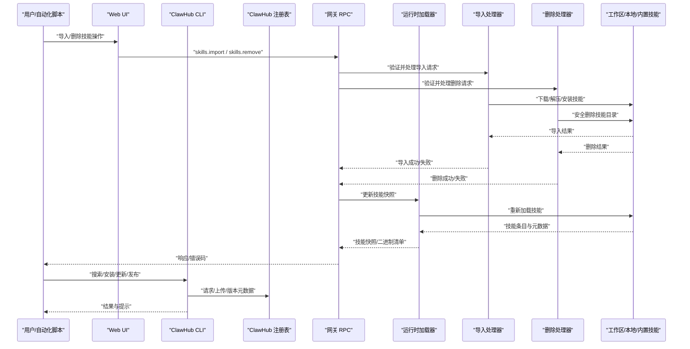
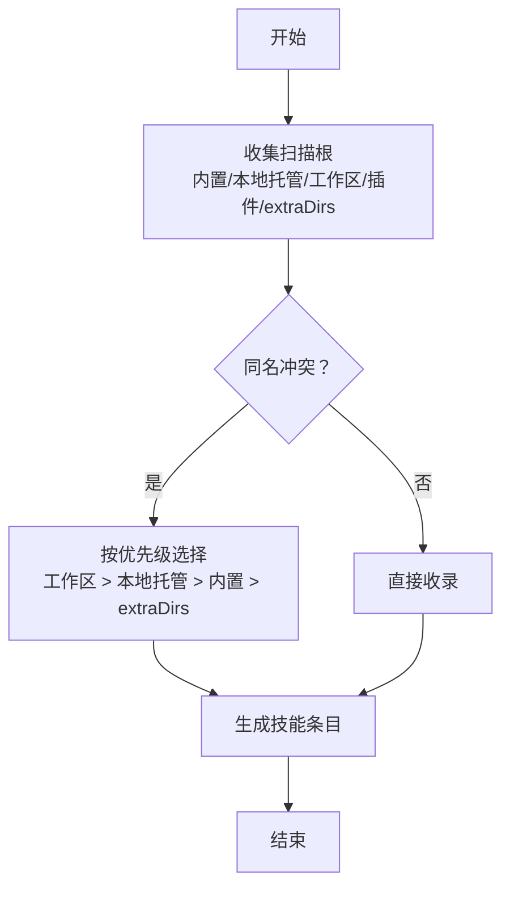
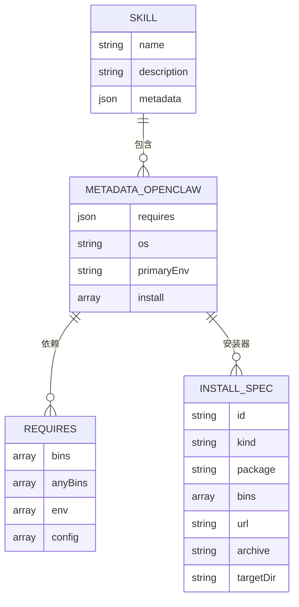
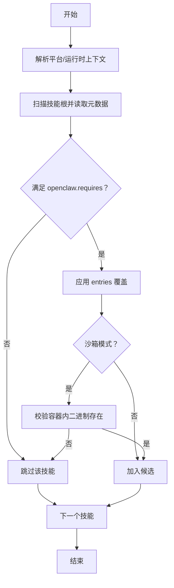
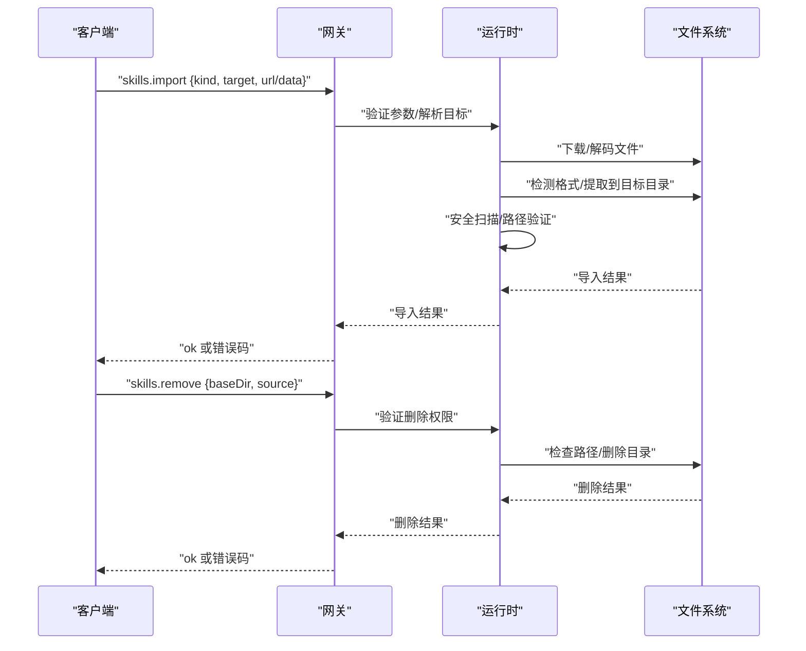
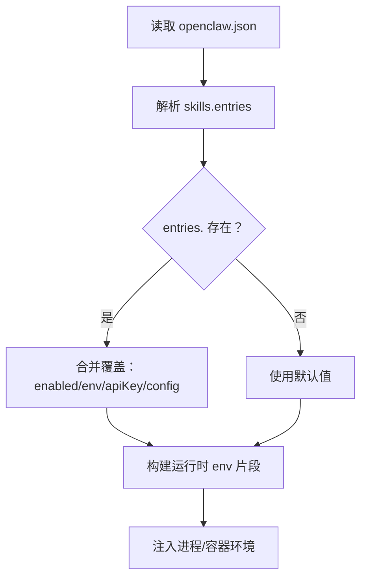
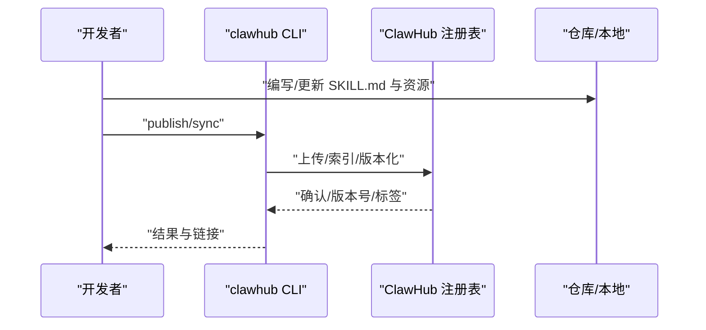
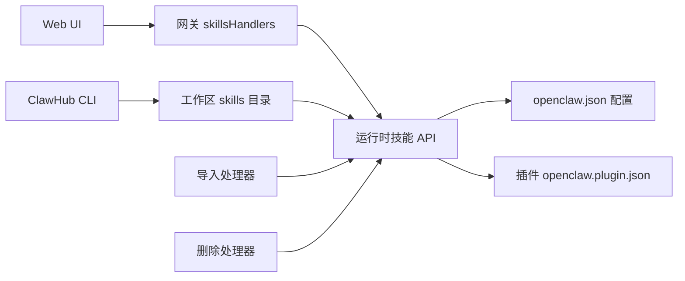

# 技能管理

<cite>
**本文引用的文件**
- [skills.md](file://docs/tools/skills.md)
- [skills-config.md](file://docs/tools/skills-config.md)
- [clawhub.md](file://docs/tools/clawhub.md)
- [skills.ts](file://src/agents/skills.ts)
- [skills.ts（网关服务端）](file://src/gateway/server-methods/skills.ts)
- [skills-import.ts](file://src/agents/skills-import.ts)
- [skills-remove.ts](file://src/agents/skills-remove.ts)
- [agents-models-skills.ts](file://src/gateway/protocol/schema/agents-models-skills.ts)
- [skills.store.ts](file://ui-react/src/store/skills.store.ts)
- [AddSkillDialog.tsx](file://ui-react/src/components/skills/AddSkillDialog.tsx)
- [SkillsPage.tsx](file://ui-react/src/pages/SkillsPage.tsx)
- [clawhub/SKILL.md](file://skills/clawhub/SKILL.md)
- [openclaw.plugin.json（示例）](file://extensions/diffs/openclaw.plugin.json)
</cite>

## 更新摘要

**变更内容**

- 新增技能导入功能（skills.import RPC方法），支持从URL和文件导入技能
- 新增技能删除功能（skills.remove RPC方法），支持安全删除已安装技能
- 添加导入/删除的安全机制和验证规则
- 更新UI组件以支持新的导入/删除操作
- 扩展技能生命周期管理文档

## 目录

1. [简介](#简介)
2. [项目结构](#项目结构)
3. [核心组件](#核心组件)
4. [架构总览](#架构总览)
5. [详细组件分析](#详细组件分析)
6. [依赖分析](#依赖分析)
7. [性能考虑](#性能考虑)
8. [故障排查指南](#故障排查指南)
9. [结论](#结论)
10. [附录](#附录)

## 简介

本文件系统化阐述 OpenClaw 的"技能管理"能力：包括技能的安装、更新、卸载与状态监控；技能目录结构与加载优先级；配置文件格式与环境注入；依赖解析与装闸规则；生命周期与版本控制；冲突与并发处理；高级配置、权限与安全；批量管理与自动化部署；以及技能市场（ClawHub）的使用与社区贡献流程。

**更新** 新增了技能导入和删除功能，支持从URL和文件导入技能，以及安全删除已安装技能的能力。

## 项目结构

技能管理涉及文档、核心运行时、网关 RPC 方法、内置技能与插件技能等多层协作：

- 文档层：技能规范、配置参考、ClawHub 使用指南
- 运行时层：技能加载、过滤、快照、命令构建、环境注入、导入/删除处理
- 网关层：RPC 接口（状态查询、二进制收集、安装、更新、导入、删除）
- 资源层：内置技能、工作区技能、扩展插件技能
- 市场层：ClawHub CLI 与注册表

**图表来源**

- [skills.md:1-303](file://docs/tools/skills.md#L1-L303)
- [skills-config.md:1-78](file://docs/tools/skills-config.md#L1-L78)
- [clawhub.md:1-258](file://docs/tools/clawhub.md#L1-L258)
- [skills.ts:1-47](file://src/agents/skills.ts#L1-L47)
- [skills-import.ts:1-366](file://src/agents/skills-import.ts#L1-L366)
- [skills-remove.ts:1-99](file://src/agents/skills-remove.ts#L1-L99)
- [skills.ts（网关服务端）:1-286](file://src/gateway/server-methods/skills.ts#L1-L286)
- [clawhub/SKILL.md:1-78](file://skills/clawhub/SKILL.md#L1-L78)

**章节来源**

- [skills.md:1-303](file://docs/tools/skills.md#L1-L303)
- [skills-config.md:1-78](file://docs/tools/skills-config.md#L1-L78)
- [clawhub.md:1-258](file://docs/tools/clawhub.md#L1-L258)
- [skills.ts:1-47](file://src/agents/skills.ts#L1-L47)
- [skills-import.ts:1-366](file://src/agents/skills-import.ts#L1-L366)
- [skills-remove.ts:1-99](file://src/agents/skills-remove.ts#L1-L99)
- [skills.ts（网关服务端）:1-286](file://src/gateway/server-methods/skills.ts#L1-L286)
- [clawhub/SKILL.md:1-78](file://skills/clawhub/SKILL.md#L1-L78)

## 核心组件

- 技能加载与过滤
  - 加载顺序与优先级：工作区技能 > 本地托管技能 > 内置技能；可额外追加扫描目录
  - 装闸规则：平台、二进制、环境变量、配置项、沙箱内二进制存在性
  - 快照与热重载：会话开始时快照，支持监听变更后在下一轮生效
- 配置与覆盖
  - 全局配置 openclaw.json 下 skills 字段：允许/禁用、环境注入、API Key、安装偏好
  - per-skill entries 映射到技能名或 metadata.openclaw.skillKey
- 网关 RPC
  - skills.status：按 agentId 汇总技能可用性与二进制清单
  - skills.bins：汇总所有工作区已启用技能所需的二进制
  - skills.install：调用安装器执行安装
  - skills.update：在线修改技能配置（启用/禁用、env、apiKey）
  - **skills.import**：从URL或上传文件导入新技能，支持工作区或全局安装
  - **skills.remove**：安全删除已安装的技能目录
- 市场与发布
  - ClawHub 提供搜索、安装、更新、发布、同步备份等能力
  - CLI 默认写入工作区 skills 目录，重启会话后生效

**更新** 新增了 skills.import 和 skills.remove RPC 方法，提供完整的技能导入和删除能力。

**章节来源**

- [skills.md:13-77](file://docs/tools/skills.md#L13-L77)
- [skills-config.md:13-78](file://docs/tools/skills-config.md#L13-L78)
- [skills.ts（网关服务端）:57-286](file://src/gateway/server-methods/skills.ts#L57-L286)
- [clawhub.md:118-258](file://docs/tools/clawhub.md#L118-L258)

## 架构总览

技能管理由"文档规范 + 运行时加载 + 网关接口 + 市场工具 + 导入/删除处理"构成闭环。

**图表来源**

- [skills.ts（网关服务端）:57-286](file://src/gateway/server-methods/skills.ts#L57-L286)
- [skills-import.ts:224-365](file://src/agents/skills-import.ts#L224-L365)
- [skills-remove.ts:36-98](file://src/agents/skills-remove.ts#L36-L98)
- [skills.ts:36-47](file://src/agents/skills.ts#L36-L47)
- [clawhub.md:118-258](file://docs/tools/clawhub.md#L118-L258)

## 详细组件分析

### 组件一：技能目录结构与加载优先级

- 三类来源
  - 内置技能：随安装包分发
  - 本地托管技能：~/.openclaw/skills
  - 工作区技能：<workspace>/skills
- 优先级：工作区 > 本地托管 > 内置
- 可通过 skills.load.extraDirs 追加扫描目录（最低优先级）
- 插件可通过 openclaw.plugin.json 声明自身 skills 目录，参与同一优先级规则

**图表来源**

- [skills.md:13-48](file://docs/tools/skills.md#L13-L48)

**章节来源**

- [skills.md:13-48](file://docs/tools/skills.md#L13-L48)

### 组件二：技能格式与元数据（AgentSkills + Pi 兼容）

- 必要字段：name、description
- 元数据要求：单行 JSON 对象，metadata.openclaw 下定义装闸与安装器
- 关键元数据键
  - openclaw.requires：bins/anyBins、env、config
  - openclaw.os：平台白名单
  - openclaw.primaryEnv：与 skills.entries.<key>.apiKey 对应
  - openclaw.install：安装器数组（brew/node/go/download）
- 使用约定：{baseDir} 引用技能根路径；支持 user-invocable、disable-model-invocation、command-dispatch 等

**图表来源**

- [skills.md:78-187](file://docs/tools/skills.md#L78-L187)

**章节来源**

- [skills.md:78-187](file://docs/tools/skills.md#L78-L187)

### 组件三：依赖解析与装闸算法

- 装闸条件
  - 平台匹配（os）
  - PATH 中二进制存在（requires.bins/anyBins）
  - 环境变量存在或已在配置中提供（requires.env）
  - 配置路径为真（requires.config）
  - 沙箱内二进制存在（容器内需额外准备）
- 解析流程
  - 读取 SKILL.md 元数据
  - 依据运行平台与 PATH 判定候选集
  - 结合 openclaw.json 的 entries 覆盖（enabled/env/apiKey/config）
  - 生成最终"可执行技能"列表

**图表来源**

- [skills.md:106-187](file://docs/tools/skills.md#L106-L187)

**章节来源**

- [skills.md:106-187](file://docs/tools/skills.md#L106-L187)

### 组件四：生命周期管理（安装、更新、卸载、状态监控、导入、删除）

#### 传统生命周期管理

- 安装
  - 通过网关 skills.install 触发安装器执行
  - 支持超时参数；返回安装结果
- 更新
  - skills.update 在线修改技能 entries（enabled/env/apiKey）
  - 写回配置文件，下次新会话生效
- 卸载
  - 删除工作区或本地托管目录中的技能文件夹
  - 重新扫描后不再纳入候选
- 状态监控
  - skills.status 返回每个 agent 的技能可用性与二进制清单
  - skills.bins 汇总所有工作区已启用技能所需二进制

#### 新增的导入和删除功能

- 技能导入（skills.import）
  - 支持两种导入方式：kind=url（从远程URL下载）和 kind=upload（从base64数据导入）
  - 支持两种安装目标：target=workspace（工作区，最高优先级）和 target=managed（全局，跨工作区共享）
  - 自动检测压缩包格式（.zip、.tar.gz、.tgz、.tar.bz2、.tbz2）
  - 安全验证：路径遍历防护、文件类型检测、恶意内容扫描
  - 支持超时控制和进度反馈
- 技能删除（skills.remove）
  - 仅允许删除用户安装的技能（source=openclaw-workspace或openclaw-managed）
  - 安全验证：绝对路径检查、父目录验证、路径遍历防护
  - 递归删除但保持父目录结构
  - 删除后自动更新技能快照

**图表来源**

- [skills.ts（网关服务端）:210-284](file://src/gateway/server-methods/skills.ts#L210-L284)
- [skills-import.ts:224-365](file://src/agents/skills-import.ts#L224-L365)
- [skills-remove.ts:36-98](file://src/agents/skills-remove.ts#L36-L98)

**章节来源**

- [skills.ts（网关服务端）:57-286](file://src/gateway/server-methods/skills.ts#L57-L286)
- [skills-import.ts:1-366](file://src/agents/skills-import.ts#L1-L366)
- [skills-remove.ts:1-99](file://src/agents/skills-remove.ts#L1-L99)

### 组件五：配置文件格式与环境注入

- 配置入口：~/.openclaw/openclaw.json 下 skills 字段
- 主要子项
  - allowBundled：仅允许特定内置技能
  - load.extraDirs/watch/watchDebounceMs：扫描与监听
  - install.preferBrew/nodeManager：安装偏好
  - entries.<skillKey>：enabled/env/apiKey/config
- 环境注入
  - 运行时按需注入 process.env（仅对宿主运行有效）
  - 沙箱场景需通过 agents.defaults.sandbox.docker.env 或自定义镜像注入

**图表来源**

- [skills-config.md:13-78](file://docs/tools/skills-config.md#L13-L78)
- [skills.md:189-241](file://docs/tools/skills.md#L189-L241)

**章节来源**

- [skills-config.md:13-78](file://docs/tools/skills-config.md#L13-L78)
- [skills.md:189-241](file://docs/tools/skills.md#L189-L241)

### 组件六：版本控制与冲突解决

- 版本控制
  - 内置技能版本随安装包；工作区/本地托管技能版本由用户维护
  - ClawHub 发布采用语义化版本，支持标签（如 latest）
- 冲突解决
  - 同名技能按优先级覆盖：工作区 > 本地托管 > 内置 > extraDirs
  - 插件技能与内置/托管同规则；若插件未启用则不参与加载
  - **导入的新技能遵循相同优先级规则**
- 并发与一致性
  - 监听器去抖（watchDebounceMs）降低频繁刷新
  - 会话内复用快照，跨会话生效新配置
  - **导入/删除操作后自动触发快照更新**

**更新** 导入的新技能同样遵循技能优先级规则，并在操作后自动更新技能快照。

**章节来源**

- [skills.md:13-48](file://docs/tools/skills.md#L13-L48)
- [skills-config.md:17-21](file://docs/tools/skills-config.md#L17-L21)

### 组件七：权限控制与安全

- 第三方技能视为不受信代码，建议沙箱执行
- 环境注入仅影响当前 agent 运行，非全局 shell
- 二进制探测在宿主进行；沙箱内需提前准备
- 敏感信息（API Key）建议使用 SecretRef 或受控注入
- **导入安全机制**
  - 路径遍历攻击防护（assertCanonicalPathWithinBase）
  - 文件类型检测和格式验证
  - 恶意内容扫描（scanAndWarn）
  - URL协议限制（仅支持http/https）
- **删除安全机制**
  - 仅允许删除用户安装的技能（openclaw-workspace/openclaw-managed）
  - 绝对路径检查和父目录验证
  - 递归删除但保持目录结构完整性

**更新** 新增了导入和删除操作的安全机制，包括路径遍历防护、文件类型检测、恶意内容扫描等。

**章节来源**

- [skills.md:69-77](file://docs/tools/skills.md#L69-L77)
- [skills-import.ts:347-365](file://src/agents/skills-import.ts#L347-L365)
- [skills-remove.ts:39-88](file://src/agents/skills-remove.ts#L39-L88)

### 组件八：批量管理与自动化部署

- 批量安装/更新
  - ClawHub CLI 支持 --all 与 --force
  - 网关 skills.update 支持批量修改 entries
  - **批量导入：支持从URL或文件批量导入多个技能**
- 自动化部署
  - 通过 CI/CD 将技能目录与 openclaw.json 部署到目标机器
  - 使用 skills.bins 与远程节点能力（system.run 允许时）动态评估 macOS-only 技能
  - **自动化导入：支持在部署脚本中自动导入必需的技能**
- 故障恢复
  - 回滚至上一个稳定版本（ClawHub 标签）
  - 清理冲突目录，恢复默认 entries
  - **故障恢复：支持删除损坏的导入技能或回滚到之前的版本**

**更新** 扩展了批量管理和自动化部署能力，包括批量导入和故障恢复机制。

**章节来源**

- [clawhub.md:152-221](file://docs/tools/clawhub.md#L152-L221)
- [skills.ts（网关服务端）:91-113](file://src/gateway/server-methods/skills.ts#L91-L113)

### 组件九：技能市场（ClawHub）使用与社区贡献

- 使用流程
  - 登录、搜索、安装、更新、发布、同步备份
  - 默认写入工作区 skills 目录，重启会话后生效
  - **支持从ClawHub直接导入技能到工作区或全局**
- 社区贡献
  - 发布新版本、评论与评分、举报不当内容
  - 成为版主后可审核与管理

**图表来源**

- [clawhub.md:160-221](file://docs/tools/clawhub.md#L160-L221)
- [clawhub/SKILL.md:44-78](file://skills/clawhub/SKILL.md#L44-L78)

**章节来源**

- [clawhub.md:1-258](file://docs/tools/clawhub.md#L1-L258)
- [clawhub/SKILL.md:1-78](file://skills/clawhub/SKILL.md#L1-L78)

### 组件十：UI组件与交互体验

#### 技能导入界面

- 支持两种导入模式：URL导入和文件上传
- 目标选择：工作区安装（最高优先级）或全局安装
- 实时验证：URL格式检查、文件类型检测
- 进度反馈：导入过程中的状态显示和警告信息
- 自动刷新：导入成功后自动重新加载技能列表

#### 技能删除界面

- 安全确认：删除前的二次确认对话框
- 权限验证：仅显示可删除的技能（用户安装的技能）
- 实时状态：删除按钮的状态根据技能来源动态变化
- 错误处理：删除失败时的详细错误信息

**章节来源**

- [skills.store.ts:206-236](file://ui-react/src/store/skills.store.ts#L206-L236)
- [AddSkillDialog.tsx:1-296](file://ui-react/src/components/skills/AddSkillDialog.tsx#L1-L296)
- [SkillsPage.tsx:1-139](file://ui-react/src/pages/SkillsPage.tsx#L1-L139)

## 依赖分析

- 运行时与网关
  - 网关 skillsHandlers 依赖运行时的技能加载与状态构建函数
  - 运行时导出统一的技能类型与快照构建 API
  - **新增依赖：导入处理器（importSkill）和删除处理器（removeSkill）**
- 插件与技能
  - 插件通过 openclaw.plugin.json 声明 skills 目录，参与同一加载与优先级体系
- 市场与工作区
  - ClawHub CLI 将技能写入工作区，OpenClaw 在下一次会话加载
- **UI与RPC**
  - Web UI 通过 skills.store.ts 调用 skills.import 和 skills.remove RPC
  - AddSkillDialog.tsx 提供导入界面，SkillsPage.tsx 展示技能列表

**图表来源**

- [skills.ts（网关服务端）:1-25](file://src/gateway/server-methods/skills.ts#L1-L25)
- [skills.ts:1-35](file://src/agents/skills.ts#L1-L35)
- [skills-import.ts:1-12](file://src/agents/skills-import.ts#L1-L12)
- [skills-remove.ts:1-5](file://src/agents/skills-remove.ts#L1-L5)
- [openclaw.plugin.json（示例）](file://extensions/diffs/openclaw.plugin.json)

**章节来源**

- [skills.ts（网关服务端）:1-25](file://src/gateway/server-methods/skills.ts#L1-L25)
- [skills.ts:1-35](file://src/agents/skills.ts#L1-L35)
- [skills-import.ts:1-12](file://src/agents/skills-import.ts#L1-L12)
- [skills-remove.ts:1-5](file://src/agents/skills-remove.ts#L1-L5)
- [openclaw.plugin.json（示例）](file://extensions/diffs/openclaw.plugin.json)

## 性能考虑

- 快照与热重载
  - 会话开始时缓存技能快照，减少重复解析成本
  - 监听器去抖（watchDebounceMs）避免频繁刷新
  - **导入/删除操作后触发快照更新，确保状态一致性**
- 提示词开销
  - 技能列表注入提示词有确定字符开销，注意技能数量与字段长度
- 沙箱启动
  - 预先准备容器内二进制，避免首次运行时安装导致延迟
- **导入性能优化**
  - 支持超时控制（默认300秒，范围1-900秒）
  - 分阶段验证：URL验证、格式检测、提取验证
  - 异步处理：下载和解压过程异步执行

**更新** 新增了导入操作的性能考虑，包括超时控制和分阶段验证机制。

**章节来源**

- [skills.md:242-286](file://docs/tools/skills.md#L242-L286)
- [skills-import.ts:224-226](file://src/agents/skills-import.ts#L224-L226)

## 故障排查指南

- 常见问题
  - 二进制缺失：检查 PATH 与沙箱内 setupCommand
  - 环境变量未注入：确认 entries.env 与 process.env 注入时机
  - 权限不足：沙箱内需网络、可写根 FS、root 用户
  - **导入失败：URL不可访问、文件格式不支持、磁盘空间不足**
  - **删除失败：权限不足、路径不正确、技能已被其他进程占用**
- 排查步骤
  - 使用 skills.status 查看技能可用性
  - 使用 skills.bins 检查缺失的二进制
  - 使用 skills.update 修正 entries 配置
  - **使用 skills.import 验证导入参数和目标位置**
  - **使用 skills.remove 检查删除权限和路径**
  - 重启会话以应用配置变更

**更新** 新增了导入和删除相关的故障排查指南。

**章节来源**

- [skills.ts（网关服务端）:57-113](file://src/gateway/server-methods/skills.ts#L57-L113)
- [skills-config.md:67-78](file://docs/tools/skills-config.md#L67-L78)

## 结论

OpenClaw 的技能管理以"规范 + 运行时 + 网关 + 市场 + 导入/删除处理"的方式形成完整闭环：通过明确的目录优先级、严格的装闸规则、可配置的环境注入与快照机制，确保技能在多代理、多平台、多沙箱场景下的可控与可维护。配合 ClawHub 的公共注册表与 CLI 工具链，实现了从发现、安装、更新到发布的完整自动化流程。**新增的导入和删除功能进一步增强了技能管理的灵活性和安全性，支持从多种来源获取技能并提供安全的删除机制。**

## 附录

- 相关文件路径
  - 技能规范与加载：docs/tools/skills.md
  - 技能配置参考：docs/tools/skills-config.md
  - ClawHub 使用指南：docs/tools/clawhub.md
  - 运行时技能聚合导出：src/agents/skills.ts
  - 网关技能 RPC：src/gateway/server-methods/skills.ts
  - 技能导入处理：src/agents/skills-import.ts
  - 技能删除处理：src/agents/skills-remove.ts
  - RPC参数定义：src/gateway/protocol/schema/agents-models-skills.ts
  - 内置 ClawHub 技能：skills/clawhub/SKILL.md
  - 插件声明示例：extensions/\*/openclaw.plugin.json
  - Web UI技能管理：ui-react/src/store/skills.store.ts
  - 导入对话框：ui-react/src/components/skills/AddSkillDialog.tsx
  - 技能页面：ui-react/src/pages/SkillsPage.tsx
