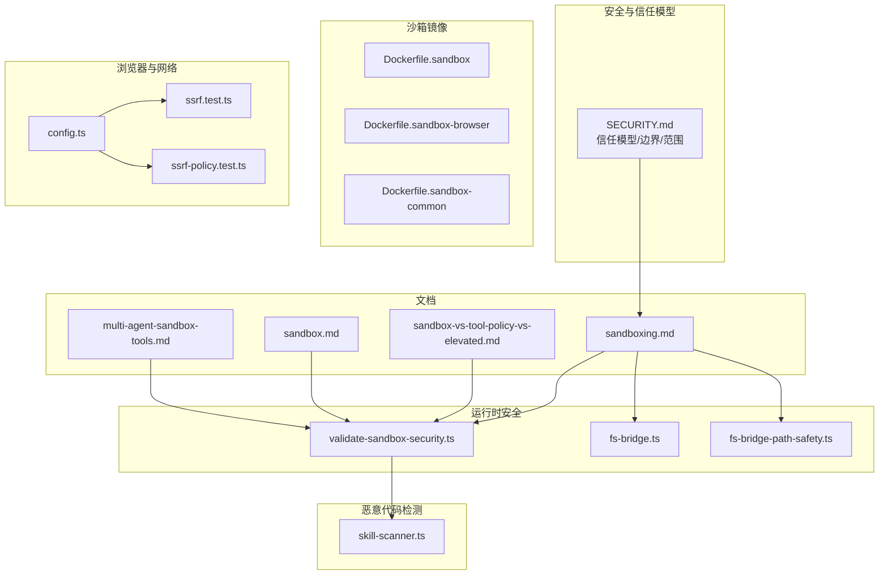
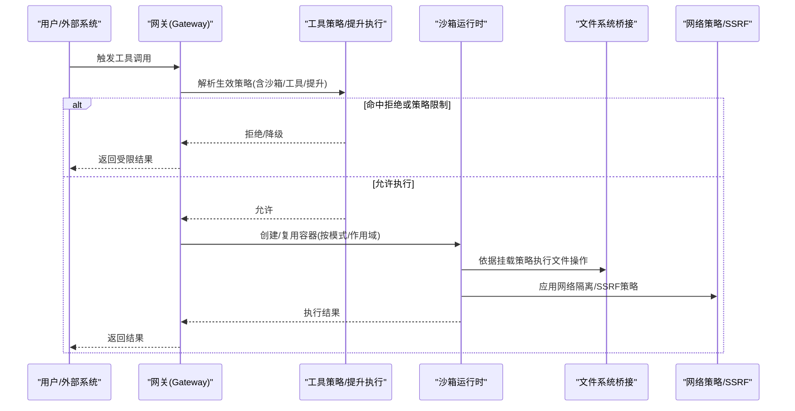
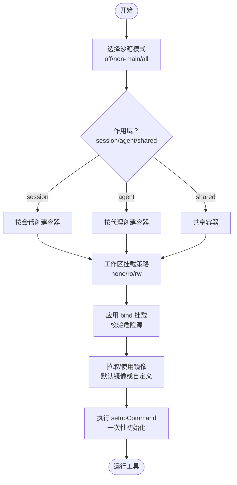
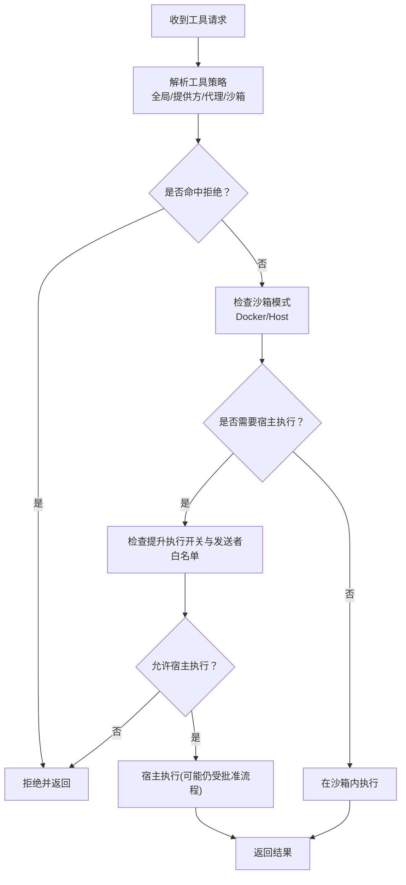
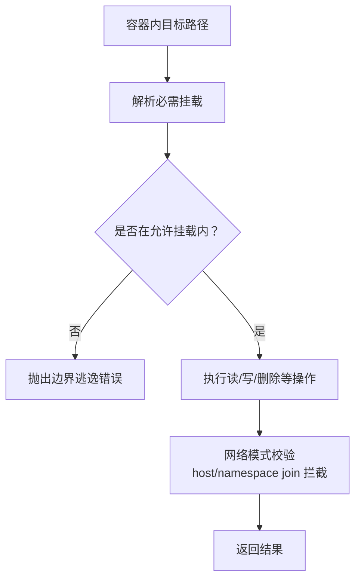
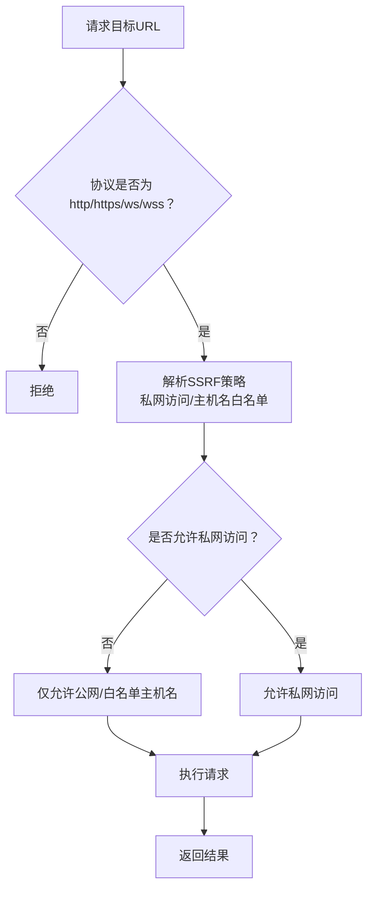
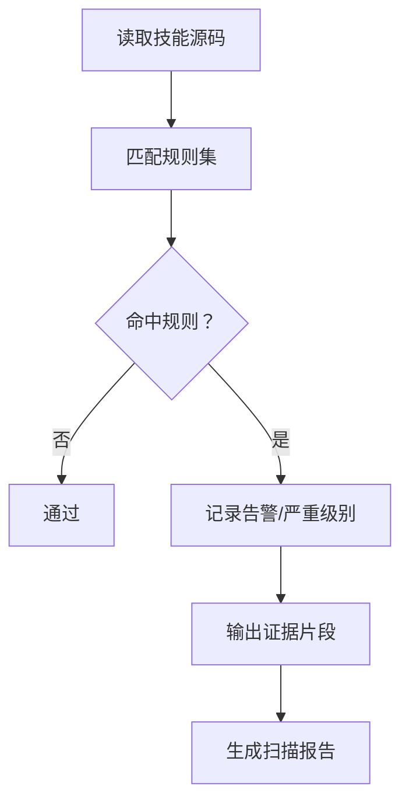
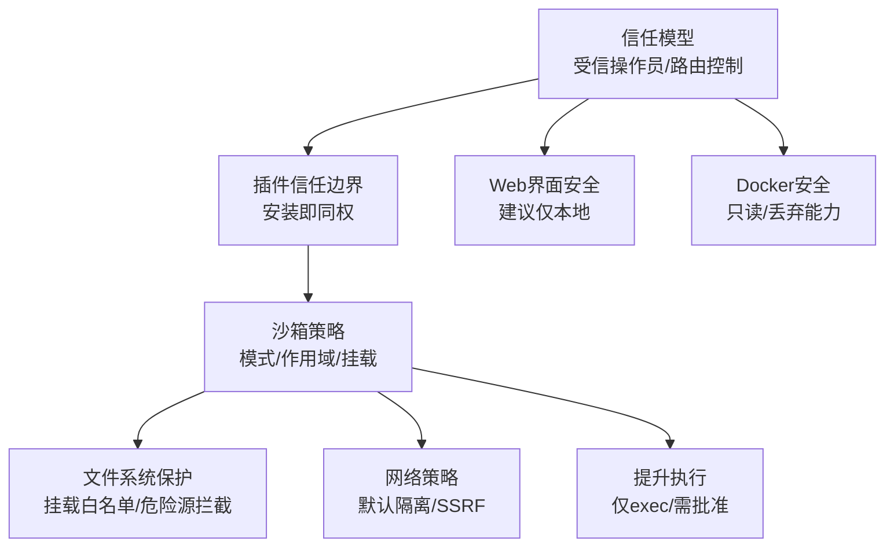
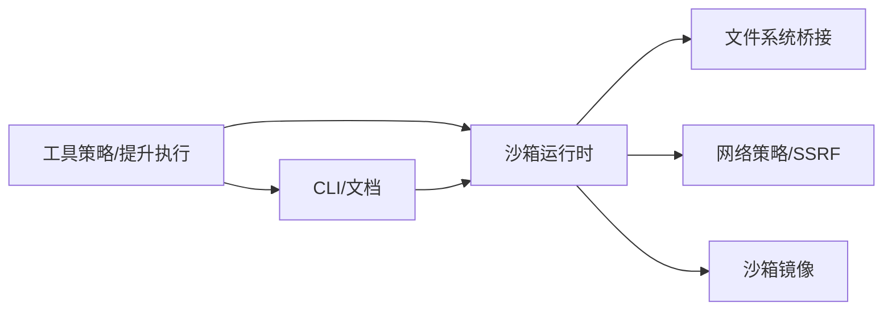

# 插件安全与沙箱

<cite>
**本文引用的文件**
- [SECURITY.md](file://SECURITY.md)
- [Dockerfile.sandbox](file://Dockerfile.sandbox)
- [Dockerfile.sandbox-browser](file://Dockerfile.sandbox-browser)
- [Dockerfile.sandbox-common](file://Dockerfile.sandbox-common)
- [sandboxing.md](file://docs/gateway/sandboxing.md)
- [sandbox-vs-tool-policy-vs-elevated.md](file://docs/gateway/sandbox-vs-tool-policy-vs-elevated.md)
- [sandbox.md](file://docs/cli/sandbox.md)
- [multi-agent-sandbox-tools.md](file://docs/tools/multi-agent-sandbox-tools.md)
- [validate-sandbox-security.ts](file://src/agents/sandbox/validate-sandbox-security.ts)
- [fs-bridge.ts](file://src/agents/sandbox/fs-bridge.ts)
- [fs-bridge-path-safety.ts](file://src/agents/sandbox/fs-bridge-path-safety.ts)
- [config.ts](file://src/browser/config.ts)
- [ssrf.test.ts](file://src/infra/net/ssrf.test.ts)
- [skill-scanner.ts](file://src/security/skill-scanner.ts)
- [ssrf-policy.test.ts](file://src/plugin-sdk/ssrf-policy.test.ts)
</cite>

## 目录

1. [简介](#简介)
2. [项目结构](#项目结构)
3. [核心组件](#核心组件)
4. [架构总览](#架构总览)
5. [详细组件分析](#详细组件分析)
6. [依赖关系分析](#依赖关系分析)
7. [性能考量](#性能考量)
8. [故障排查指南](#故障排查指南)
9. [结论](#结论)
10. [附录](#附录)

## 简介

本文件聚焦于 OpenClaw 的插件安全与沙箱机制，系统阐述安全模型、访问控制与权限管理，以及沙箱隔离、资源限制与安全策略。内容覆盖网络访问控制、文件系统保护、进程隔离、SSRF 防护、输入验证与恶意代码检测，并提供安全配置指南、威胁模型分析、防护最佳实践，以及安全审计、漏洞扫描与应急响应机制。

## 项目结构

围绕插件与沙箱安全的关键目录与文件如下：

- 安全策略与信任模型：SECURITY.md
- 沙箱镜像构建：Dockerfile.sandbox、Dockerfile.sandbox-browser、Dockerfile.sandbox-common
- 文档化沙箱与工具策略：docs/gateway/sandboxing.md、docs/gateway/sandbox-vs-tool-policy-vs-elevated.md、docs/cli/sandbox.md、docs/tools/multi-agent-sandbox-tools.md
- 运行时安全校验与文件系统桥接：src/agents/sandbox/validate-sandbox-security.ts、src/agents/sandbox/fs-bridge.ts、src/agents/sandbox/fs-bridge-path-safety.ts
- 浏览器 SSRF 策略与测试：src/browser/config.ts、src/infra/net/ssrf.test.ts、src/plugin-sdk/ssrf-policy.test.ts
- 恶意代码检测（技能扫描）：src/security/skill-scanner.ts

**图表来源**

- [SECURITY.md](file://SECURITY.md)
- [Dockerfile.sandbox](file://Dockerfile.sandbox)
- [Dockerfile.sandbox-browser](file://Dockerfile.sandbox-browser)
- [Dockerfile.sandbox-common](file://Dockerfile.sandbox-common)
- [sandboxing.md](file://docs/gateway/sandboxing.md)
- [sandbox-vs-tool-policy-vs-elevated.md](file://docs/gateway/sandbox-vs-tool-policy-vs-elevated.md)
- [sandbox.md](file://docs/cli/sandbox.md)
- [multi-agent-sandbox-tools.md](file://docs/tools/multi-agent-sandbox-tools.md)
- [validate-sandbox-security.ts](file://src/agents/sandbox/validate-sandbox-security.ts)
- [fs-bridge.ts](file://src/agents/sandbox/fs-bridge.ts)
- [fs-bridge-path-safety.ts](file://src/agents/sandbox/fs-bridge-path-safety.ts)
- [config.ts](file://src/browser/config.ts)
- [ssrf.test.ts](file://src/infra/net/ssrf.test.ts)
- [ssrf-policy.test.ts](file://src/plugin-sdk/ssrf-policy.test.ts)
- [skill-scanner.ts](file://src/security/skill-scanner.ts)

**章节来源**

- [SECURITY.md](file://SECURITY.md)
- [sandboxing.md](file://docs/gateway/sandboxing.md)
- [sandbox-vs-tool-policy-vs-elevated.md](file://docs/gateway/sandbox-vs-tool-policy-vs-elevated.md)
- [sandbox.md](file://docs/cli/sandbox.md)
- [multi-agent-sandbox-tools.md](file://docs/tools/multi-agent-sandbox-tools.md)

## 核心组件

- 信任模型与边界
  - 采用“受信任操作员”模型，不假设多租户对抗性边界；认证通过即为该网关的信任操作员；会话标识仅作路由控制，非主机级授权边界。
  - 插件/扩展作为网关可信计算基的一部分，安装启用即获得与本地同权执行能力，安全报告需展示越界（未认证加载、策略/沙箱绕过等），而非仅展示受信插件的恶意行为。
- 沙箱隔离与容器运行
  - 工具执行可在 Docker 容器中进行以降低影响面；默认可关闭，由配置控制（agents.defaults.sandbox.mode）。网关进程常驻宿主，工具执行在启用时进入隔离沙箱。
  - 提供通用沙箱镜像与浏览器沙箱镜像，支持自定义镜像与一次性初始化命令（setupCommand）。
- 访问控制与权限管理
  - 三层控制：沙箱运行位置（Sandbox）、工具策略（Tool Policy）、提升执行（Elevated）。
  - 工具策略包含全局/按提供方/按代理的允许/拒绝列表，以及沙箱内工具策略；sandbox.explain 可诊断生效策略与修复建议。
- 文件系统保护
  - 通过挂载白名单与路径边界检查，防止越界访问；对 bind 挂载进行安全校验，阻止危险源（如 /etc、/proc、/sys、/dev 及其父路径）。
- 网络访问控制与 SSRF 防护
  - 默认禁用 host 网络与容器命名空间加入；提供受信网络模式与可选的危险放行开关；浏览器 SSRF 策略支持受信私有网络访问与主机名后缀白名单。
- 恶意代码检测
  - 技能扫描器基于启发式规则检测潜在数据外泄、混淆代码与凭据收集等风险模式。

**章节来源**

- [SECURITY.md](file://SECURITY.md)
- [sandboxing.md](file://docs/gateway/sandboxing.md)
- [sandbox-vs-tool-policy-vs-elevated.md](file://docs/gateway/sandbox-vs-tool-policy-vs-elevated.md)
- [fs-bridge-path-safety.ts](file://src/agents/sandbox/fs-bridge-path-safety.ts)
- [validate-sandbox-security.ts](file://src/agents/sandbox/validate-sandbox-security.ts)
- [config.ts](file://src/browser/config.ts)
- [skill-scanner.ts](file://src/security/skill-scanner.ts)

## 架构总览

下图展示从“工具调用”到“沙箱执行”的整体流程，以及与“工具策略”“提升执行”“文件系统桥接”“网络策略”的交互关系。

**图表来源**

- [sandboxing.md](file://docs/gateway/sandboxing.md)
- [sandbox-vs-tool-policy-vs-elevated.md](file://docs/gateway/sandbox-vs-tool-policy-vs-elevated.md)
- [fs-bridge.ts](file://src/agents/sandbox/fs-bridge.ts)
- [validate-sandbox-security.ts](file://src/agents/sandbox/validate-sandbox-security.ts)
- [config.ts](file://src/browser/config.ts)

## 详细组件分析

### 组件A：沙箱隔离与容器运行

- 模式与作用域
  - 模式：off（不在沙箱）、non-main（仅非主会话）、all（全部会话）。
  - 作用域：session（每会话一个容器）、agent（每代理一个容器）、shared（所有被沙箱会话共享一个容器）。
- 工作区访问
  - none（沙箱工作区）、ro（只读挂载至 /agent 或 /workspace）、rw（读写挂载至 /workspace）。
- 自定义挂载与安全
  - 支持 host:container:mode 的 bind 挂载；默认阻止危险源；敏感挂载应使用只读。
- 镜像与初始化
  - 默认镜像 openclaw-sandbox:bookworm-slim；可通过脚本构建常用镜像；setupCommand 在容器创建后一次性执行。
- 浏览器沙箱
  - 提供专用浏览器镜像，默认无网络；支持 CDP 入口限制、noVNC 密码保护、可选宿主控制。

**图表来源**

- [sandboxing.md](file://docs/gateway/sandboxing.md)
- [Dockerfile.sandbox](file://Dockerfile.sandbox)
- [Dockerfile.sandbox-common](file://Dockerfile.sandbox-common)
- [Dockerfile.sandbox-browser](file://Dockerfile.sandbox-browser)

**章节来源**

- [sandboxing.md](file://docs/gateway/sandboxing.md)
- [Dockerfile.sandbox](file://Dockerfile.sandbox)
- [Dockerfile.sandbox-common](file://Dockerfile.sandbox-common)
- [Dockerfile.sandbox-browser](file://Dockerfile.sandbox-browser)

### 组件B：访问控制与权限管理（策略三元）

- 三元控制
  - 沙箱：决定工具在 Docker 还是宿主运行。
  - 工具策略：决定可用工具集合（全局/按提供方/按代理/沙箱内）。
  - 提升执行：仅针对 exec 的“回到宿主”通道，不授予额外工具。
- 策略优先级与修复
  - deny 优先；allow 非空时其余默认拒绝；sandbox.explain 可输出生效策略与修复键路径。

**图表来源**

- [sandbox-vs-tool-policy-vs-elevated.md](file://docs/gateway/sandbox-vs-tool-policy-vs-elevated.md)
- [sandbox.md](file://docs/cli/sandbox.md)

**章节来源**

- [sandbox-vs-tool-policy-vs-elevated.md](file://docs/gateway/sandbox-vs-tool-policy-vs-elevated.md)
- [sandbox.md](file://docs/cli/sandbox.md)

### 组件C：文件系统保护与路径安全

- 路径边界与挂载
  - 通过“必需挂载”解析与“边界内打开”策略，确保容器内操作仅限于允许挂载范围内。
- 绑定挂载安全校验
  - 对危险源（如 /etc、/proc、/sys、/dev 及其父路径）进行拦截；支持通过选项允许特定来源（需严格评估）。
- 网络模式安全
  - 默认禁止 host 网络与容器命名空间加入；必要时可通过危险开关放行，但需明确信任边界。

**图表来源**

- [fs-bridge-path-safety.ts](file://src/agents/sandbox/fs-bridge-path-safety.ts)
- [fs-bridge.ts](file://src/agents/sandbox/fs-bridge.ts)
- [validate-sandbox-security.ts](file://src/agents/sandbox/validate-sandbox-security.ts)

**章节来源**

- [fs-bridge-path-safety.ts](file://src/agents/sandbox/fs-bridge-path-safety.ts)
- [fs-bridge.ts](file://src/agents/sandbox/fs-bridge.ts)
- [validate-sandbox-security.ts](file://src/agents/sandbox/validate-sandbox-security.ts)

### 组件D：网络访问控制与 SSRF 防护

- 浏览器 SSRF 策略
  - 默认启用受信网络模式；可通过 allowPrivateNetwork 或 dangerouslyAllowPrivateNetwork 控制私网访问；支持 allowedHostnames 与 hostnameAllowlist。
- 网络模式校验
  - 默认禁止 host 网络与 container:\* 命名空间加入；必要时可开启危险开关。
- 单元测试覆盖
  - 对私网 IP、公有 IP、非法 IPv4/IPv6、主机名等进行分类测试，确保策略正确。

**图表来源**

- [config.ts](file://src/browser/config.ts)
- [ssrf.test.ts](file://src/infra/net/ssrf.test.ts)
- [ssrf-policy.test.ts](file://src/plugin-sdk/ssrf-policy.test.ts)

**章节来源**

- [config.ts](file://src/browser/config.ts)
- [ssrf.test.ts](file://src/infra/net/ssrf.test.ts)
- [ssrf-policy.test.ts](file://src/plugin-sdk/ssrf-policy.test.ts)

### 组件E：恶意代码检测（技能扫描）

- 规则类别
  - 数据外泄：文件读取+网络发送组合。
  - 混淆代码：十六进制编码、超长 base64 解码等。
  - 凭据收集：环境变量读取+网络发送组合。
- 处理流程
  - 截断证据文本，避免噪声；对匹配项给出严重级别与提示信息。

**图表来源**

- [skill-scanner.ts](file://src/security/skill-scanner.ts)

**章节来源**

- [skill-scanner.ts](file://src/security/skill-scanner.ts)

### 概念总览

- 信任模型
  - 不假设多租户对抗性边界；认证通过即为信任操作员；会话标识仅路由，不作主机级授权。
- 插件信任边界
  - 插件/扩展为可信计算基一部分；安装启用即视为与本地同权；报告需展示越界，否则不构成安全漏洞。
- 运维建议
  - Web 界面建议仅本地使用；Docker 运行建议只读根文件系统、丢弃多余能力；定期重建沙箱容器以应用镜像/配置更新。

[此图为概念性总览，无需图表来源]

**章节来源**

- [SECURITY.md](file://SECURITY.md)
- [sandboxing.md](file://docs/gateway/sandboxing.md)
- [sandbox.md](file://docs/cli/sandbox.md)

## 依赖关系分析

- 组件耦合
  - 策略层（工具策略/提升执行）与运行时层（沙箱）解耦，通过“sandbox.explain”统一诊断。
  - 文件系统桥接与网络策略分别独立校验，共同构成容器内边界。
- 外部依赖
  - Docker 容器运行时；浏览器沙箱镜像；Node.js 版本安全补丁要求。
- 循环依赖
  - 当前模块间为单向依赖（策略→运行时→容器），未见循环。

**图表来源**

- [sandbox-vs-tool-policy-vs-elevated.md](file://docs/gateway/sandbox-vs-tool-policy-vs-elevated.md)
- [sandboxing.md](file://docs/gateway/sandboxing.md)
- [fs-bridge.ts](file://src/agents/sandbox/fs-bridge.ts)
- [validate-sandbox-security.ts](file://src/agents/sandbox/validate-sandbox-security.ts)
- [config.ts](file://src/browser/config.ts)

**章节来源**

- [sandbox-vs-tool-policy-vs-elevated.md](file://docs/gateway/sandbox-vs-tool-policy-vs-elevated.md)
- [sandboxing.md](file://docs/gateway/sandboxing.md)
- [fs-bridge.ts](file://src/agents/sandbox/fs-bridge.ts)
- [validate-sandbox-security.ts](file://src/agents/sandbox/validate-sandbox-security.ts)
- [config.ts](file://src/browser/config.ts)

## 性能考量

- 容器生命周期
  - 默认闲置与最大存活时间可配置；频繁使用的代理会保持容器运行，减少冷启动开销。
- 镜像与初始化
  - 常用镜像包含必要工具链，减少首次安装成本；setupCommand 仅在容器创建时执行一次。
- 网络隔离
  - 默认无网络可降低容器间通信与外部暴露风险，但需注意包安装与网络需求的平衡。

[本节为一般性指导，无需章节来源]

## 故障排查指南

- 常见问题
  - “非主”模式导致意外沙箱化：确认会话主键与模式设置；必要时改为 off 或显式为特定代理关闭。
  - 工具仍可用：检查过滤顺序（全局→代理→沙箱→子代理），deny 优先，allow 非空时其余默认拒绝。
  - 容器未按代理隔离：检查作用域设置为 agent；默认为 session。
- 诊断工具
  - 使用 openclaw sandbox explain 查看生效模式、作用域、工作区访问与修复键路径。
  - 使用 openclaw sandbox recreate 强制移除旧容器并按新配置重建。
- 安全校验
  - bind 挂载危险源拦截、网络模式 host/namespace join 默认拒绝；必要时通过危险开关放行并评估风险。

**章节来源**

- [sandbox.md](file://docs/cli/sandbox.md)
- [sandbox-vs-tool-policy-vs-elevated.md](file://docs/gateway/sandbox-vs-tool-policy-vs-elevated.md)
- [multi-agent-sandbox-tools.md](file://docs/tools/multi-agent-sandbox-tools.md)
- [validate-sandbox-security.ts](file://src/agents/sandbox/validate-sandbox-security.ts)

## 结论

OpenClaw 的插件安全与沙箱体系以“受信操作员”为核心信任边界，结合三层控制（沙箱/工具策略/提升执行）、严格的文件系统与网络策略、以及技能扫描与 SSRF 防护，形成多层纵深防御。通过文档化配置、CLI 诊断与容器化隔离，既满足个人助理场景下的易用性，又能在企业级部署中提供可审计、可治理的安全保障。

[本节为总结性内容，无需章节来源]

## 附录

### 安全配置清单（摘要）

- 沙箱
  - 模式：根据场景选择 off/non-main/all；默认推荐 non-main 以兼顾聊天与安全。
  - 作用域：session/agent/shared；高隔离场景建议 agent 或 shared。
  - 工作区访问：优先 ro；rw 仅在必要时开启。
  - 自定义挂载：避免危险源；敏感路径使用只读。
- 工具策略
  - 使用工具组（group:\*）快速收敛；deny 优先；allow 非空时其余默认拒绝。
  - 按代理细化策略；沙箱内工具策略独立配置。
- 提升执行
  - 仅针对 exec；启用需严格白名单与批准流程。
- 浏览器与网络
  - 默认受信网络；谨慎放行私网访问；使用主机名后缀白名单。
  - Docker 运行建议只读根文件系统、丢弃多余能力。
- 运维
  - 定期重建沙箱容器；使用 openclaw security audit 检查风险项；关注 Node.js 安全补丁版本。

**章节来源**

- [sandboxing.md](file://docs/gateway/sandboxing.md)
- [sandbox-vs-tool-policy-vs-elevated.md](file://docs/gateway/sandbox-vs-tool-policy-vs-elevated.md)
- [multi-agent-sandbox-tools.md](file://docs/tools/multi-agent-sandbox-tools.md)
- [config.ts](file://src/browser/config.ts)
- [SECURITY.md](file://SECURITY.md)
