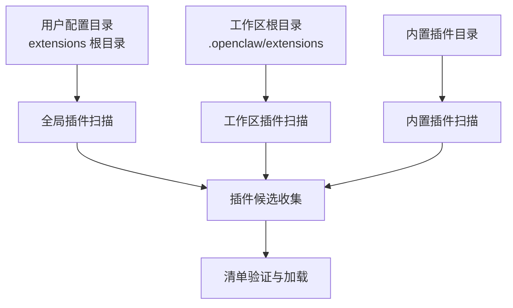
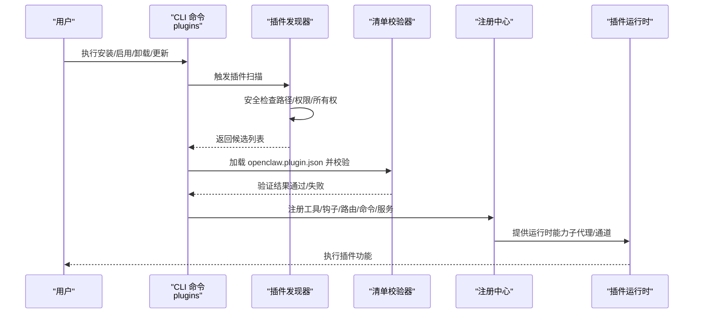
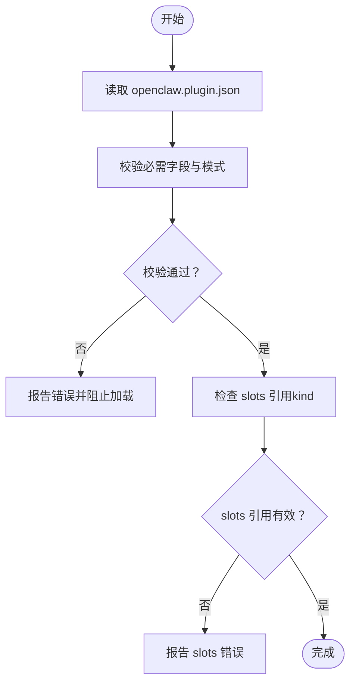
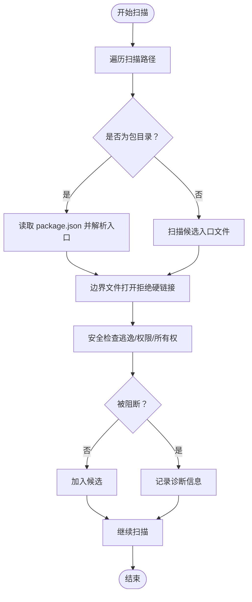
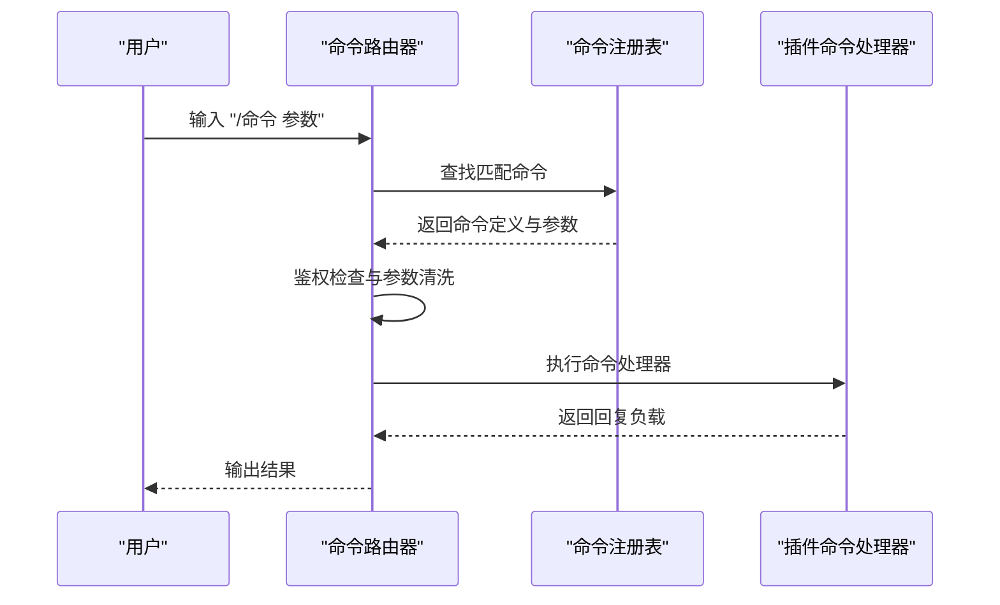
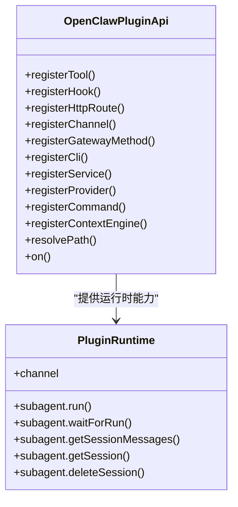
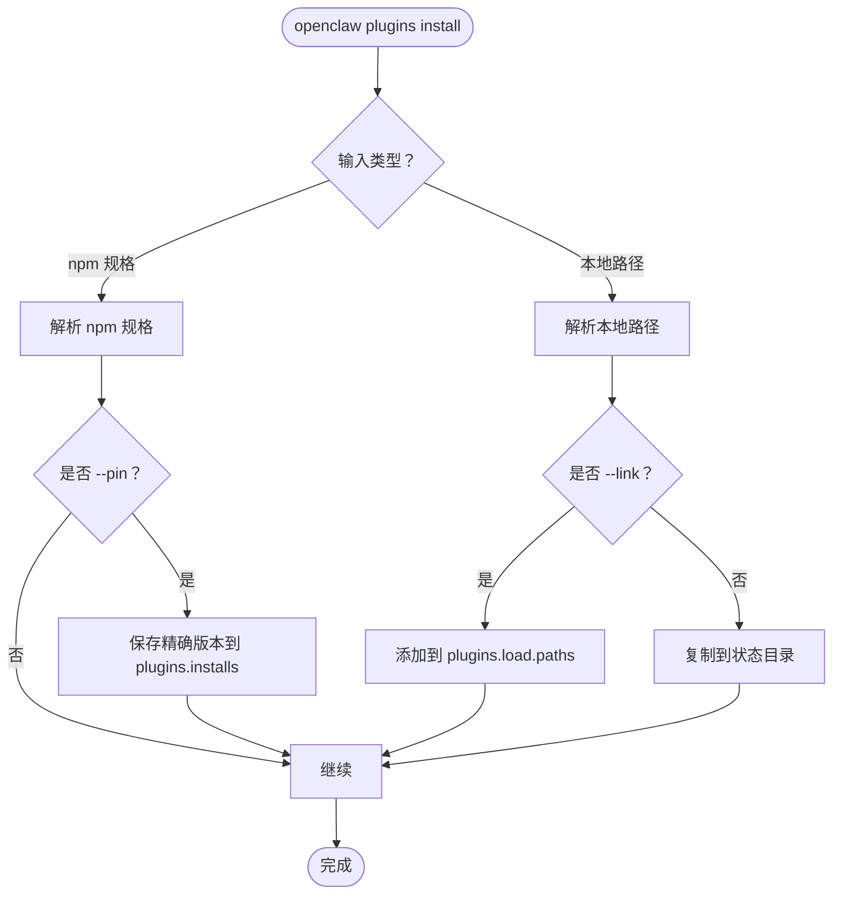
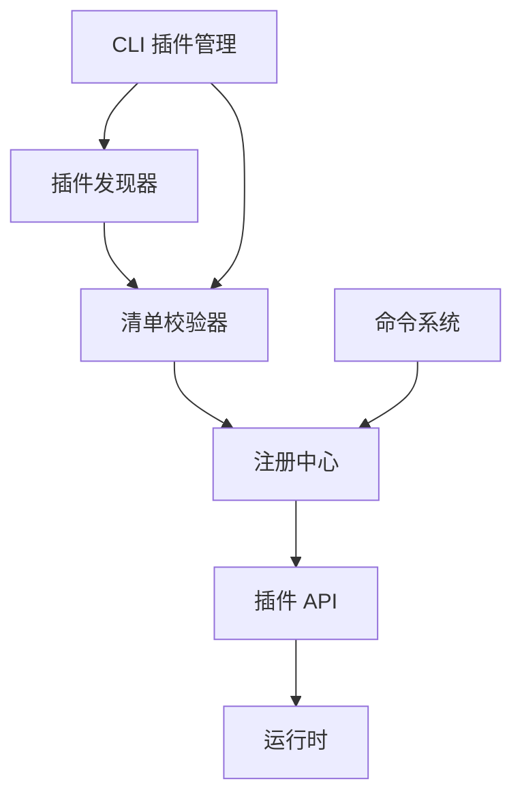

# 插件市场与分发

<cite>
**本文档引用的文件**
- [README.md](file://README.md)
- [docs/plugins/manifest.md](file://docs/plugins/manifest.md)
- [docs/plugins/community.md](file://docs/plugins/community.md)
- [docs/cli/plugins.md](file://docs/cli/plugins.md)
- [src/plugin-sdk/index.ts](file://src/plugin-sdk/index.ts)
- [src/plugins/types.ts](file://src/plugins/types.ts)
- [src/plugins/runtime/types.ts](file://src/plugins/runtime/types.ts)
- [src/plugins/config-schema.ts](file://src/plugins/config-schema.ts)
- [src/plugins/discovery.ts](file://src/plugins/discovery.ts)
- [src/plugins/commands.ts](file://src/plugins/commands.ts)
- [extensions/acpx/openclaw.plugin.json](file://extensions/acpx/openclaw.plugin.json)
- [extensions/diffs/openclaw.plugin.json](file://extensions/diffs/openclaw.plugin.json)
- [extensions/memory-core/openclaw.plugin.json](file://extensions/memory-core/openclaw.plugin.json)
- [extensions/diffs/index.ts](file://extensions/diffs/index.ts)
- [extensions/memory-core/index.ts](file://extensions/memory-core/index.ts)
</cite>

## 目录

1. [简介](#简介)
2. [项目结构](#项目结构)
3. [核心组件](#核心组件)
4. [架构总览](#架构总览)
5. [详细组件分析](#详细组件分析)
6. [依赖关系分析](#依赖关系分析)
7. [性能考虑](#性能考虑)
8. [故障排除指南](#故障排除指南)
9. [结论](#结论)
10. [附录](#附录)

## 简介

本文件系统性阐述 OpenClaw 的插件市场与分发机制，覆盖插件注册、审核与发布流程；插件市场平台、搜索与发现机制；版本管理、依赖解析与自动更新；安装、配置与卸载的自动化流程；以及打包、签名与分发的最佳实践。同时包含质量评估、用户评价与社区贡献机制的建议。

## 项目结构

OpenClaw 将插件生态分为三类来源：

- 内置插件（bundled）：随产品发行但默认禁用，需显式启用
- 全局插件（global）：位于用户配置目录下的 extensions 根目录
- 工作区插件（workspace）：位于工作区根目录下的 .openclaw/extensions

插件通过 openclaw.plugin.json 清单进行声明与校验，清单中包含插件标识、配置模式、能力声明（如 kind、channels、providers、skills）等元数据。

图表来源

- [src/plugins/discovery.ts:618-711](file://src/plugins/discovery.ts#L618-L711)

章节来源

- [src/plugins/discovery.ts:618-711](file://src/plugins/discovery.ts#L618-L711)
- [docs/plugins/manifest.md:9-76](file://docs/plugins/manifest.md#L9-L76)

## 核心组件

- 插件清单与模式校验：每个插件必须提供 openclaw.plugin.json，并包含 id 与 configSchema。空配置模式允许无参数配置。
- 插件 API：提供注册工具、钩子、HTTP 路由、命令、服务、通道适配器、网关方法、CLI 扩展等能力。
- 运行时接口：支持子代理运行、等待、会话消息查询与删除，以及通道能力访问。
- 命令注册：插件可注册自有命令，优先于内置命令处理，具备鉴权与参数校验。
- 发现与安全：扫描路径、硬链接拒绝、权限检查、路径逃逸检测、世界可写检查、可疑所有权检查。

章节来源

- [src/plugins/types.ts:248-306](file://src/plugins/types.ts#L248-L306)
- [src/plugins/runtime/types.ts:51-63](file://src/plugins/runtime/types.ts#L51-L63)
- [src/plugins/config-schema.ts:13-33](file://src/plugins/config-schema.ts#L13-L33)
- [src/plugins/commands.ts:108-154](file://src/plugins/commands.ts#L108-L154)
- [src/plugins/discovery.ts:117-251](file://src/plugins/discovery.ts#L117-L251)

## 架构总览

下图展示从插件发现到加载、注册与运行的整体流程：

图表来源

- [src/plugins/discovery.ts:618-711](file://src/plugins/discovery.ts#L618-L711)
- [docs/cli/plugins.md:19-103](file://docs/cli/plugins.md#L19-L103)
- [src/plugins/types.ts:248-306](file://src/plugins/types.ts#L248-L306)

## 详细组件分析

### 组件A：插件清单与模式校验

- 必填字段：id、configSchema
- 可选字段：kind、channels、providers、skills、name、description、uiHints、version
- 校验规则：未知 channels 键为错误；plugins.entries、plugins.allow、plugins.deny、plugins.slots.\* 必须引用可发现的插件 id；缺失或损坏清单导致验证失败；禁用插件保留配置并在 Doctor 中警告
- 运行时仅用于发现与验证，实际模块仍按需加载

图表来源

- [docs/plugins/manifest.md:18-76](file://docs/plugins/manifest.md#L18-L76)

章节来源

- [docs/plugins/manifest.md:9-76](file://docs/plugins/manifest.md#L9-L76)

### 组件B：插件发现与安全策略

- 扫描顺序：extraPaths → workspace → bundled → global（全局插件在内置之后）
- 安全策略：
  - 拒绝硬链接包入口
  - 检测路径逃逸（source 不在 root 内）
  - 检测世界可写目录
  - 检测可疑所有权（非 root 且 UID 不匹配）
- 缓存：支持基于环境变量的发现缓存窗口，避免启动时频繁扫描

图表来源

- [src/plugins/discovery.ts:394-616](file://src/plugins/discovery.ts#L394-L616)

章节来源

- [src/plugins/discovery.ts:618-711](file://src/plugins/discovery.ts#L618-L711)

### 组件C：插件命令系统

- 命令注册：插件可注册以 "/" 开头的命令，名称需满足正则与不与内置命令冲突
- 匹配逻辑：区分是否接受参数；未开启参数时提供参数将不匹配
- 执行流程：鉴权检查、参数清洗、上下文构造、执行、异常捕获与安全返回
- 列表输出：支持生成帮助菜单与各渠道原生命令映射

图表来源

- [src/plugins/commands.ts:183-301](file://src/plugins/commands.ts#L183-L301)

章节来源

- [src/plugins/commands.ts:108-154](file://src/plugins/commands.ts#L108-L154)
- [src/plugins/commands.ts:183-301](file://src/plugins/commands.ts#L183-L301)

### 组件D：插件 API 与运行时

- API 能力：注册工具、钩子、HTTP 路由、通道适配器、网关方法、CLI、服务、提供者、命令、上下文引擎、生命周期钩子、路径解析
- 运行时能力：子代理运行/等待/查询会话/删除会话；通道能力访问
- 类型与钩子：提供完整的事件钩子类型体系，覆盖模型解析、提示构建、消息收发、工具调用、会话生命周期、网关启停等

图表来源

- [src/plugins/types.ts:263-306](file://src/plugins/types.ts#L263-L306)
- [src/plugins/runtime/types.ts:51-63](file://src/plugins/runtime/types.ts#L51-L63)

章节来源

- [src/plugins/types.ts:248-306](file://src/plugins/types.ts#L248-L306)
- [src/plugins/runtime/types.ts:1-64](file://src/plugins/runtime/types.ts#L1-L64)

### 组件E：CLI 插件管理

- 支持命令：list、info、enable、disable、uninstall、doctor、update、install
- 安装策略：仅支持 registry 规范的 npm 规格；裸规格与 @latest 默认稳定轨道；支持 --link 本地开发；支持 --pin 固定版本
- 卸载策略：清理 plugins.entries、plugins.installs、允许列表与 plugins.load.paths；内存插件重置为 memory-core
- 更新策略：仅对 npm 安装的插件生效；若完整性哈希变化，会提示确认

图表来源

- [docs/cli/plugins.md:19-103](file://docs/cli/plugins.md#L19-L103)

章节来源

- [docs/cli/plugins.md:19-103](file://docs/cli/plugins.md#L19-L103)

### 组件F：社区插件与质量评估

- 列表要求：npm 发布、GitHub 公开源码、清晰文档与问题跟踪、维护信号（活跃维护/响应）
- 提交流程：PR 添加条目，包含名称、npm 包名、仓库地址、简述、安装命令
- 审查标准：实用、文档完善、安全可靠；低质量包装、不明归属或不维护的包可能被拒绝

章节来源

- [docs/plugins/community.md:9-52](file://docs/plugins/community.md#L9-L52)

## 依赖关系分析

- 插件发现依赖文件系统扫描与边界文件读取，确保安全性
- 插件 API 与运行时解耦，便于扩展与测试
- 命令系统独立于插件 API，但共享配置与鉴权上下文
- CLI 作为外部入口，协调发现、校验与注册流程

图表来源

- [src/plugins/discovery.ts:618-711](file://src/plugins/discovery.ts#L618-L711)
- [docs/cli/plugins.md:19-103](file://docs/cli/plugins.md#L19-L103)
- [src/plugins/types.ts:248-306](file://src/plugins/types.ts#L248-L306)

章节来源

- [src/plugins/discovery.ts:618-711](file://src/plugins/discovery.ts#L618-L711)
- [docs/cli/plugins.md:19-103](file://docs/cli/plugins.md#L19-L103)
- [src/plugins/types.ts:248-306](file://src/plugins/types.ts#L248-L306)

## 性能考虑

- 发现缓存：通过环境变量控制缓存窗口，减少重复扫描开销
- 安全检查前置：在加载前完成路径与权限检查，避免无效加载
- 命令执行短路：未匹配或鉴权失败快速返回，降低系统负担
- 子代理运行：异步等待与会话查询，避免阻塞主流程

## 故障排除指南

- 清单错误：缺失或损坏的 openclaw.plugin.json 会导致验证失败；使用 Doctor 检查插件错误
- 权限问题：世界可写目录、路径逃逸、可疑所有权会被阻断并记录诊断信息
- 命令冲突：插件命令与内置命令冲突或命名非法将无法注册
- 更新确认：当完整性哈希变化时，需要确认后才继续更新

章节来源

- [docs/plugins/manifest.md:53-63](file://docs/plugins/manifest.md#L53-L63)
- [src/plugins/discovery.ts:216-227](file://src/plugins/discovery.ts#L216-L227)
- [src/plugins/commands.ts:78-97](file://src/plugins/commands.ts#L78-L97)
- [docs/cli/plugins.md:100-103](file://docs/cli/plugins.md#L100-L103)

## 结论

OpenClaw 的插件市场与分发机制以清单驱动、安全优先为核心设计原则。通过严格的清单校验、安全的发现策略与完善的 CLI 管理能力，实现了从注册、审核到发布的全链路自动化。配合命令系统与运行时接口，插件可在不破坏系统安全的前提下灵活扩展能力。社区贡献与质量评估机制进一步保障了生态的健康与可持续发展。

## 附录

### 插件清单示例与字段说明

- 示例：ACPX、Diffs、Memory-Core 插件清单展示了 id、configSchema、uiHints、skills 等字段的实际应用
- 字段说明：id（必填）、configSchema（必填）、kind（可选）、channels（可选）、providers（可选）、skills（可选）、name（可选）、description（可选）、uiHints（可选）、version（可选）

章节来源

- [extensions/acpx/openclaw.plugin.json:1-106](file://extensions/acpx/openclaw.plugin.json#L1-L106)
- [extensions/diffs/openclaw.plugin.json:1-183](file://extensions/diffs/openclaw.plugin.json#L1-L183)
- [extensions/memory-core/openclaw.plugin.json:1-10](file://extensions/memory-core/openclaw.plugin.json#L1-L10)

### 插件实现示例

- Diffs 插件：注册工具、HTTP 路由与生命周期钩子，提供差异查看与渲染能力
- Memory-Core 插件：注册内存搜索与获取工具，并提供 CLI 命令

章节来源

- [extensions/diffs/index.ts:14-45](file://extensions/diffs/index.ts#L14-L45)
- [extensions/memory-core/index.ts:4-39](file://extensions/memory-core/index.ts#L4-L39)
