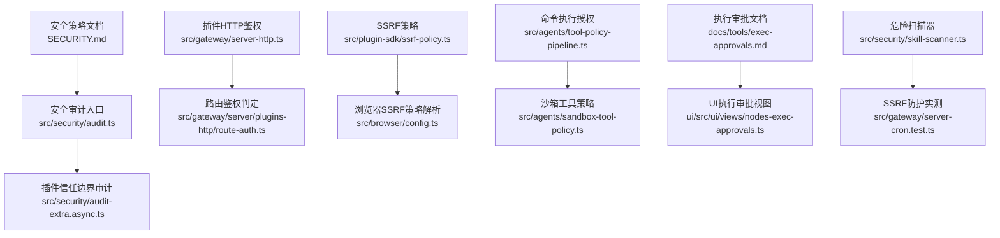
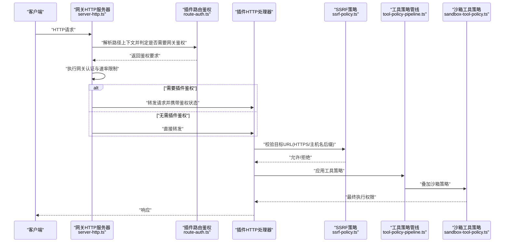
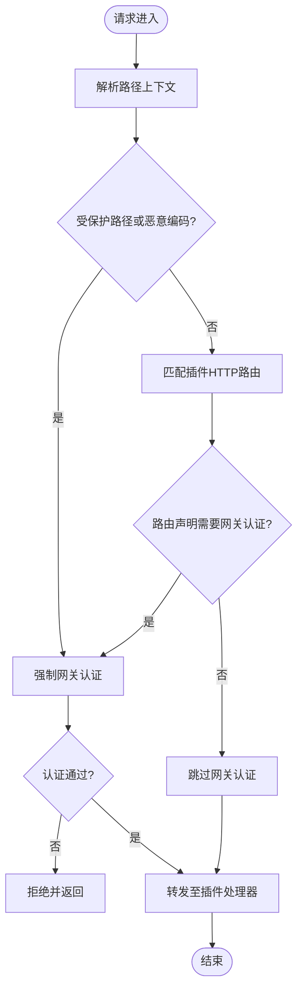
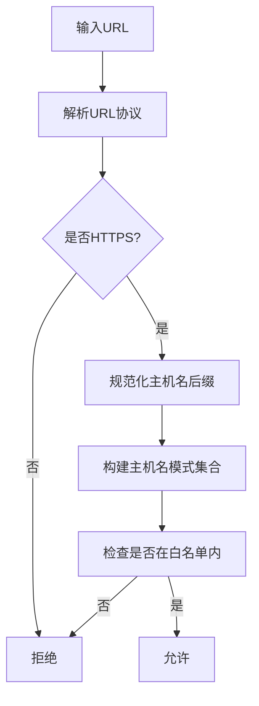
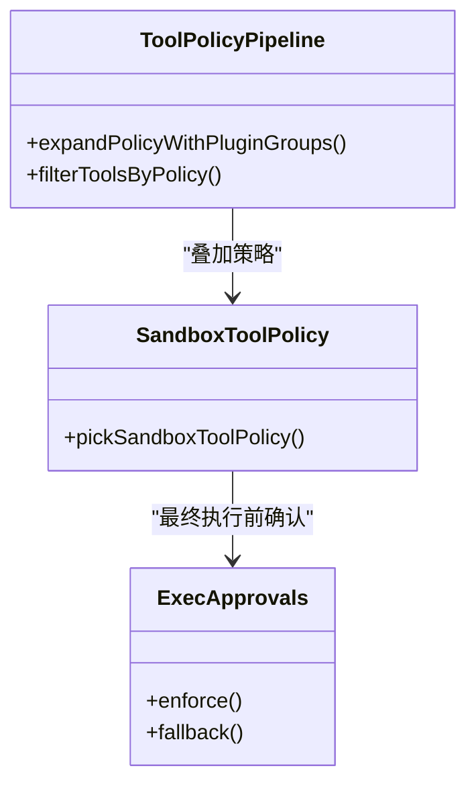
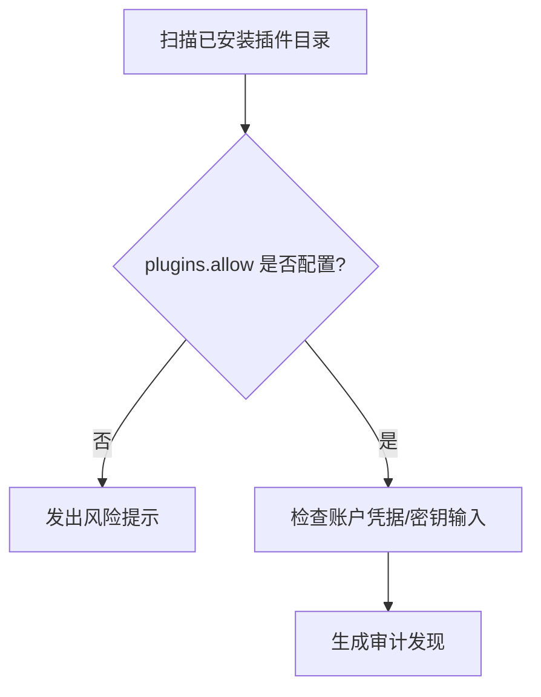
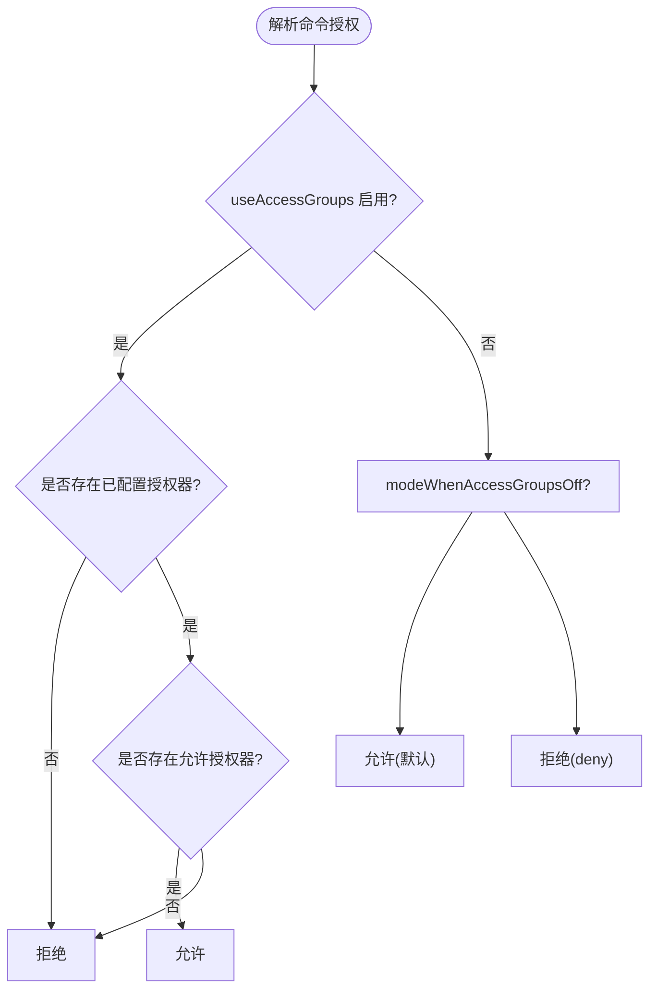
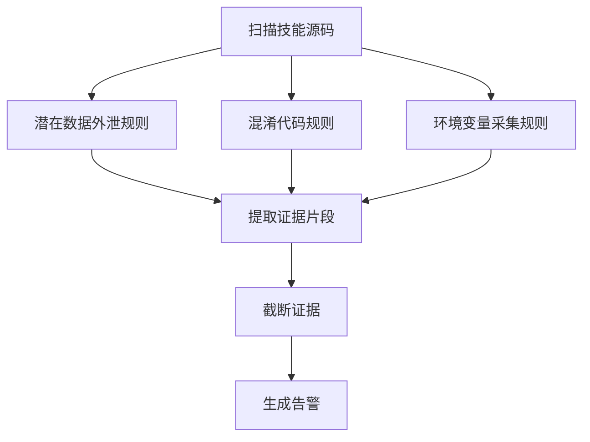
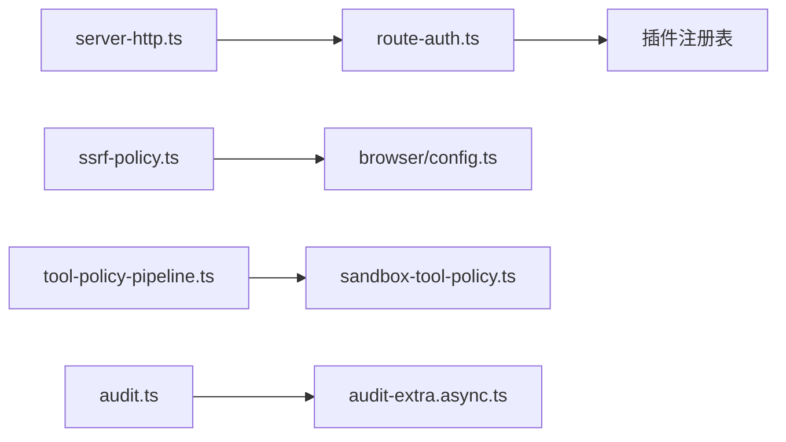

# 安全策略

<cite>
**本文引用的文件**
- [SECURITY.md](file://SECURITY.md)
- [docs/cli/security.md](file://docs/cli/security.md)
- [src/security/audit.ts](file://src/security/audit.ts)
- [src/security/audit-extra.async.ts](file://src/security/audit-extra.async.ts)
- [src/gateway/server-http.ts](file://src/gateway/server-http.ts)
- [src/gateway/server/plugins-http/route-auth.ts](file://src/gateway/server/plugins-http/route-auth.ts)
- [src/plugin-sdk/ssrf-policy.ts](file://src/plugin-sdk/ssrf-policy.ts)
- [src/browser/config.ts](file://src/browser/config.ts)
- [src/channels/command-gating.test.ts](file://src/channels/command-gating.test.ts)
- [src/plugin-sdk/root-alias.cjs](file://src/plugin-sdk/root-alias.cjs)
- [src/agents/tool-policy-pipeline.ts](file://src/agents/tool-policy-pipeline.ts)
- [src/agents/sandbox-tool-policy.ts](file://src/agents/sandbox-tool-policy.ts)
- [docs/tools/exec-approvals.md](file://docs/tools/exec-approvals.md)
- [ui/src/ui/views/nodes-exec-approvals.ts](file://ui/src/ui/views/nodes-exec-approvals.ts)
- [src/gateway/server.plugin-http-auth.test.ts](file://src/gateway/server.plugin-http-auth.test.ts)
- [src/gateway/server-cron.test.ts](file://src/gateway/server-cron.test.ts)
- [src/security/skill-scanner.ts](file://src/security/skill-scanner.ts)
</cite>

## 目录

1. [引言](#引言)
2. [项目结构](#项目结构)
3. [核心组件](#核心组件)
4. [架构总览](#架构总览)
5. [详细组件分析](#详细组件分析)
6. [依赖关系分析](#依赖关系分析)
7. [性能考量](#性能考量)
8. [故障排查指南](#故障排查指南)
9. [结论](#结论)
10. [附录](#附录)

## 引言

本文件系统化梳理 OpenClaw 插件安全策略，覆盖插件开发与运行时的安全考虑、防护机制与最佳实践。重点包括：

- SSRF 攻击防护：主机名后缀白名单、HTTPS 强制、私网访问策略
- HTTP 请求认证与授权：插件 HTTP 路由鉴权、网关令牌校验、速率限制
- 命令执行授权：工具策略、沙箱策略、执行审批（exec approvals）
- 配置方法、实施细节与监控机制
- 漏洞检测、风险评估与应急响应流程
- 身份验证、授权控制与访问审计
- 安全测试方法、渗透测试与合规性检查

## 项目结构

围绕“安全策略”的关键代码与文档分布如下：

- 安全策略与报告：SECURITY.md、docs/cli/security.md、src/security/audit.ts
- 插件 HTTP 认证边界：src/gateway/server-http.ts、src/gateway/server/plugins-http/route-auth.ts、src/gateway/server.plugin-http-auth.test.ts
- SSRF 策略：src/plugin-sdk/ssrf-policy.ts、src/browser/config.ts
- 命令执行授权：src/agents/tool-policy-pipeline.ts、src/agents/sandbox-tool-policy.ts、docs/tools/exec-approvals.md、ui/src/ui/views/nodes-exec-approvals.ts
- 工具授权与访问组：src/channels/command-gating.test.ts、src/plugin-sdk/root-alias.cjs
- 插件信任边界与审计：src/security/audit-extra.async.ts
- 危险扫描与合规：src/security/skill-scanner.ts
- SSRF 防护实测：src/gateway/server-cron.test.ts

**图表来源**

- [SECURITY.md:1-288](file://SECURITY.md#L1-L288)
- [src/security/audit.ts:1-200](file://src/security/audit.ts#L1-L200)
- [src/security/audit-extra.async.ts:526-552](file://src/security/audit-extra.async.ts#L526-L552)
- [src/gateway/server-http.ts:285-346](file://src/gateway/server-http.ts#L285-L346)
- [src/gateway/server/plugins-http/route-auth.ts:1-31](file://src/gateway/server/plugins-http/route-auth.ts#L1-L31)
- [src/plugin-sdk/ssrf-policy.ts:1-86](file://src/plugin-sdk/ssrf-policy.ts#L1-L86)
- [src/browser/config.ts:101-136](file://src/browser/config.ts#L101-L136)
- [src/agents/tool-policy-pipeline.ts:104-108](file://src/agents/tool-policy-pipeline.ts#L104-L108)
- [src/agents/sandbox-tool-policy.ts:1-37](file://src/agents/sandbox-tool-policy.ts#L1-L37)
- [docs/tools/exec-approvals.md:1-26](file://docs/tools/exec-approvals.md#L1-L26)
- [ui/src/ui/views/nodes-exec-approvals.ts:173-213](file://ui/src/ui/views/nodes-exec-approvals.ts#L173-L213)
- [src/security/skill-scanner.ts:175-216](file://src/security/skill-scanner.ts#L175-L216)
- [src/gateway/server-cron.test.ts:89-142](file://src/gateway/server-cron.test.ts#L89-L142)

**章节来源**

- [SECURITY.md:1-288](file://SECURITY.md#L1-L288)
- [docs/cli/security.md:1-72](file://docs/cli/security.md#L1-L72)

## 核心组件

- 安全审计与报告：集中于安全审计入口与扩展审计模块，覆盖配置暴露面、通道安全、日志与密钥、沙箱与节点等维度，并支持 JSON 输出与自动修复建议。
- 插件 HTTP 鉴权：在网关层对插件 HTTP 路由进行鉴权判定，结合路径上下文、受保护路径与路由声明强制网关认证。
- SSRF 防护：通过主机名后缀白名单、HTTPS 强制与浏览器侧策略解析，统一到共享的 SSRF 保护机制。
- 命令执行授权：工具策略与沙箱策略叠加，执行审批作为额外的人机交互/弹窗确认守门人。
- 插件信任边界：插件以“受信任代码”加载于网关进程中，需通过 allowlist 与策略严格约束。
- 危险扫描与合规：内置扫描规则识别潜在数据外泄、混淆代码与环境变量读取等高危模式。

**章节来源**

- [src/security/audit.ts:1131-1156](file://src/security/audit.ts#L1131-L1156)
- [src/security/audit-extra.async.ts:526-552](file://src/security/audit-extra.async.ts#L526-L552)
- [src/gateway/server-http.ts:285-346](file://src/gateway/server-http.ts#L285-L346)
- [src/gateway/server/plugins-http/route-auth.ts:15-30](file://src/gateway/server/plugins-http/route-auth.ts#L15-L30)
- [src/plugin-sdk/ssrf-policy.ts:42-55](file://src/plugin-sdk/ssrf-policy.ts#L42-L55)
- [src/browser/config.ts:101-136](file://src/browser/config.ts#L101-L136)
- [src/agents/tool-policy-pipeline.ts:104-108](file://src/agents/tool-policy-pipeline.ts#L104-L108)
- [src/agents/sandbox-tool-policy.ts:21-37](file://src/agents/sandbox-tool-policy.ts#L21-L37)
- [docs/tools/exec-approvals.md:10-26](file://docs/tools/exec-approvals.md#L10-L26)
- [SECURITY.md:104-131](file://SECURITY.md#L104-L131)
- [src/security/skill-scanner.ts:175-216](file://src/security/skill-scanner.ts#L175-L216)

## 架构总览

下图展示从客户端请求到插件 HTTP 路由处理、鉴权与 SSRF 防护的整体流程，以及与工具策略、沙箱策略和执行审批的关系。

**图表来源**

- [src/gateway/server-http.ts:285-346](file://src/gateway/server-http.ts#L285-L346)
- [src/gateway/server/plugins-http/route-auth.ts:15-30](file://src/gateway/server/plugins-http/route-auth.ts#L15-L30)
- [src/plugin-sdk/ssrf-policy.ts:42-55](file://src/plugin-sdk/ssrf-policy.ts#L42-L55)
- [src/agents/tool-policy-pipeline.ts:104-108](file://src/agents/tool-policy-pipeline.ts#L104-L108)
- [src/agents/sandbox-tool-policy.ts:21-37](file://src/agents/sandbox-tool-policy.ts#L21-L37)

## 详细组件分析

### 组件A：插件 HTTP 鉴权与安全头

- 路由鉴权判定：根据路径上下文、受保护路径与路由声明决定是否强制网关认证。
- 网关认证阶段：在请求进入插件处理前执行认证与速率限制；若未满足则中断并返回。
- 安全响应头：默认注入安全响应头，可选启用 HSTS。

**图表来源**

- [src/gateway/server/plugins-http/route-auth.ts:15-30](file://src/gateway/server/plugins-http/route-auth.ts#L15-L30)
- [src/gateway/server-http.ts:285-346](file://src/gateway/server-http.ts#L285-L346)
- [src/gateway/server.plugin-http-auth.test.ts:84-111](file://src/gateway/server.plugin-http-auth.test.ts#L84-L111)

**章节来源**

- [src/gateway/server/plugins-http/route-auth.ts:1-31](file://src/gateway/server/plugins-http/route-auth.ts#L1-L31)
- [src/gateway/server-http.ts:285-346](file://src/gateway/server-http.ts#L285-L346)
- [src/gateway/server.plugin-http-auth.test.ts:84-111](file://src/gateway/server.plugin-http-auth.test.ts#L84-L111)

### 组件B：SSRF 攻击防护

- 主机名后缀白名单：支持通配符与去重，转换为精确主机名模式。
- HTTPS 强制：仅允许 HTTPS URL，否则拒绝。
- 浏览器侧策略：根据配置解析允许私有网络、允许主机名列表与主机名后缀白名单。

**图表来源**

- [src/plugin-sdk/ssrf-policy.ts:42-55](file://src/plugin-sdk/ssrf-policy.ts#L42-L55)
- [src/plugin-sdk/ssrf-policy.ts:65-85](file://src/plugin-sdk/ssrf-policy.ts#L65-L85)
- [src/browser/config.ts:101-136](file://src/browser/config.ts#L101-L136)

**章节来源**

- [src/plugin-sdk/ssrf-policy.ts:1-86](file://src/plugin-sdk/ssrf-policy.ts#L1-L86)
- [src/browser/config.ts:101-136](file://src/browser/config.ts#L101-L136)

### 组件C：命令执行授权与执行审批

- 工具策略：按代理与插件组展开，过滤可用工具。
- 沙箱策略：允许叠加 alsoAllow 或隐式 allow-all，deny 优先。
- 执行审批：作为额外守门人，要求策略、允许清单与用户确认三者一致才放行。

**图表来源**

- [src/agents/tool-policy-pipeline.ts:104-108](file://src/agents/tool-policy-pipeline.ts#L104-L108)
- [src/agents/sandbox-tool-policy.ts:21-37](file://src/agents/sandbox-tool-policy.ts#L21-L37)
- [docs/tools/exec-approvals.md:10-26](file://docs/tools/exec-approvals.md#L10-L26)

**章节来源**

- [src/agents/tool-policy-pipeline.ts:104-108](file://src/agents/tool-policy-pipeline.ts#L104-L108)
- [src/agents/sandbox-tool-policy.ts:1-37](file://src/agents/sandbox-tool-policy.ts#L1-L37)
- [docs/tools/exec-approvals.md:1-26](file://docs/tools/exec-approvals.md#L1-L26)
- [ui/src/ui/views/nodes-exec-approvals.ts:173-213](file://ui/src/ui/views/nodes-exec-approvals.ts#L173-L213)

### 组件D：插件信任边界与审计

- 插件信任模型：插件作为受信任代码加载，安装即授予本地主机同等信任级别。
- 允许清单：推荐使用 plugins.allow 固定可信插件 ID。
- 审计发现：收集插件安装目录、配置项与敏感输入，提示潜在风险。

**图表来源**

- [src/security/audit-extra.async.ts:526-552](file://src/security/audit-extra.async.ts#L526-L552)
- [SECURITY.md:104-131](file://SECURITY.md#L104-L131)

**章节来源**

- [src/security/audit-extra.async.ts:526-552](file://src/security/audit-extra.async.ts#L526-L552)
- [SECURITY.md:104-131](file://SECURITY.md#L104-L131)

### 组件E：工具授权与访问组

- 访问组开关：当启用访问组时，必须存在已配置且允许的授权器；否则默认拒绝。
- 未启用访问组时：默认允许，可通过 modeWhenAccessGroupsOff 控制为 deny。

**图表来源**

- [src/channels/command-gating.test.ts:7-46](file://src/channels/command-gating.test.ts#L7-L46)
- [src/plugin-sdk/root-alias.cjs:35-52](file://src/plugin-sdk/root-alias.cjs#L35-L52)

**章节来源**

- [src/channels/command-gating.test.ts:1-46](file://src/channels/command-gating.test.ts#L1-L46)
- [src/plugin-sdk/root-alias.cjs:35-52](file://src/plugin-sdk/root-alias.cjs#L35-L52)

### 组件F：危险扫描与合规

- 规则集：检测文件读取+网络发送组合、十六进制编码序列、大段 base64 解码、环境变量读取+网络发送等。
- 证据截断：对长证据进行截断，便于报告展示。

**图表来源**

- [src/security/skill-scanner.ts:175-216](file://src/security/skill-scanner.ts#L175-L216)

**章节来源**

- [src/security/skill-scanner.ts:175-216](file://src/security/skill-scanner.ts#L175-L216)

## 依赖关系分析

- 网关 HTTP 层依赖插件路由鉴权模块，后者再依赖插件注册表与路径上下文解析。
- SSRF 策略被浏览器配置解析与插件 SDK 使用，形成统一的出站访问控制。
- 工具策略与沙箱策略共同决定最终执行权限，执行审批作为补充守门人。
- 安全审计模块聚合多类发现，形成统一报告。

**图表来源**

- [src/gateway/server-http.ts:285-346](file://src/gateway/server-http.ts#L285-L346)
- [src/gateway/server/plugins-http/route-auth.ts:1-31](file://src/gateway/server/plugins-http/route-auth.ts#L1-L31)
- [src/plugin-sdk/ssrf-policy.ts:1-86](file://src/plugin-sdk/ssrf-policy.ts#L1-L86)
- [src/browser/config.ts:101-136](file://src/browser/config.ts#L101-L136)
- [src/agents/tool-policy-pipeline.ts:104-108](file://src/agents/tool-policy-pipeline.ts#L104-L108)
- [src/agents/sandbox-tool-policy.ts:1-37](file://src/agents/sandbox-tool-policy.ts#L1-L37)
- [src/security/audit.ts:1131-1156](file://src/security/audit.ts#L1131-L1156)
- [src/security/audit-extra.async.ts:526-552](file://src/security/audit-extra.async.ts#L526-L552)

**章节来源**

- [src/gateway/server-http.ts:285-346](file://src/gateway/server-http.ts#L285-L346)
- [src/gateway/server/plugins-http/route-auth.ts:1-31](file://src/gateway/server/plugins-http/route-auth.ts#L1-L31)
- [src/plugin-sdk/ssrf-policy.ts:1-86](file://src/plugin-sdk/ssrf-policy.ts#L1-L86)
- [src/browser/config.ts:101-136](file://src/browser/config.ts#L101-L136)
- [src/agents/tool-policy-pipeline.ts:104-108](file://src/agents/tool-policy-pipeline.ts#L104-L108)
- [src/agents/sandbox-tool-policy.ts:1-37](file://src/agents/sandbox-tool-policy.ts#L1-L37)
- [src/security/audit.ts:1131-1156](file://src/security/audit.ts#L1131-L1156)
- [src/security/audit-extra.async.ts:526-552](file://src/security/audit-extra.async.ts#L526-L552)

## 性能考量

- 审计扫描：深度探测可能带来额外延迟，建议在 CI 中使用 JSON 输出与阈值控制。
- SSRF 校验：主机名规范化与集合查询为轻量操作，通常不影响请求时延。
- 执行审批：弹窗确认会阻塞执行，应合理配置 allowlist 与策略以减少误报。

## 故障排查指南

- 审计与修复
  - 使用安全审计命令生成报告与修复建议，关注关键/警告项并按指引调整。
  - 参考 CLI 文档中 JSON 输出与修复范围，避免误改核心暴露面。
- 插件 HTTP 鉴权
  - 若插件路由无法访问，检查路由声明 auth 字段与路径上下文解析结果。
  - 确认网关认证配置与速率限制策略未误伤合法请求。
- SSRF 防护
  - 确认目标 URL 为 HTTPS，主机名在白名单中；必要时调整浏览器 SSRF 策略。
  - 对 Cron/Webhook 出站场景，确保使用受保护的 fetch 封装。
- 命令执行授权
  - 检查工具策略与沙箱策略叠加后的最终权限。
  - 在无 UI 的环境下，执行审批回退为拒绝，需提前配置 allowlist。

**章节来源**

- [docs/cli/security.md:17-72](file://docs/cli/security.md#L17-L72)
- [src/gateway/server.plugin-http-auth.test.ts:84-111](file://src/gateway/server.plugin-http-auth.test.ts#L84-L111)
- [src/gateway/server-cron.test.ts:89-142](file://src/gateway/server-cron.test.ts#L89-L142)
- [docs/tools/exec-approvals.md:10-26](file://docs/tools/exec-approvals.md#L10-L26)

## 结论

OpenClaw 的插件安全策略以“信任边界清晰、最小权限、多重守门人”为核心设计：

- 插件 HTTP 鉴权与安全响应头确保路由层安全；
- SSRF 策略统一出站访问控制；
- 工具策略、沙箱策略与执行审批构成命令执行的纵深防御；
- 安全审计与危险扫描持续发现与加固风险点。

建议在生产环境中：

- 明确 plugins.allow 白名单；
- 严格配置工具策略与沙箱策略；
- 启用执行审批并优化 allowlist；
- 使用安全审计与扫描工具定期评估风险。

## 附录

- 报告与披露：遵循安全策略文档中的披露流程与接受标准。
- 运行时要求：确保 Node.js 版本满足安全补丁要求；容器部署时采用只读根文件系统与能力降级。

**章节来源**

- [SECURITY.md:1-288](file://SECURITY.md#L1-L288)
- [SECURITY.md:246-288](file://SECURITY.md#L246-L288)
