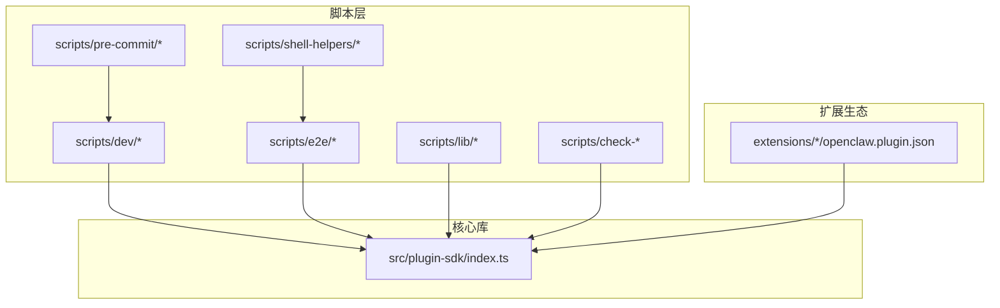
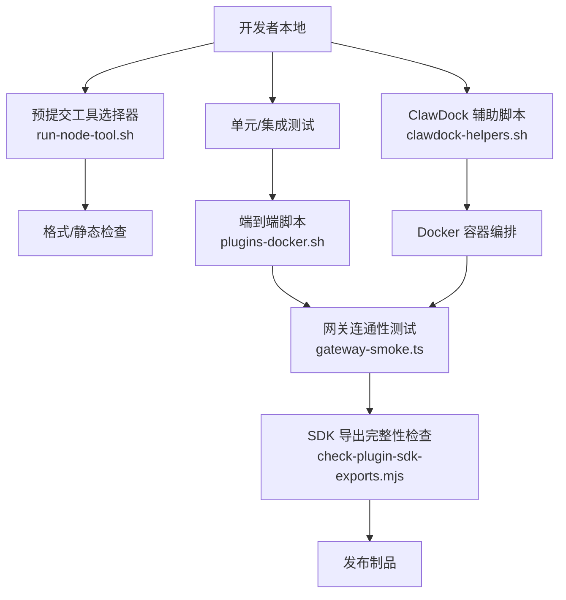
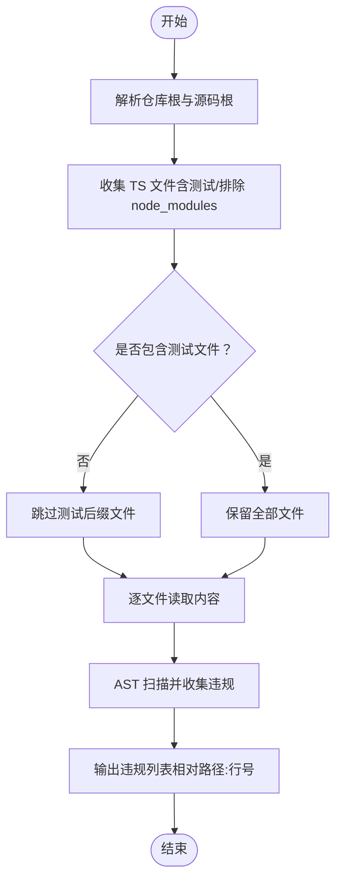
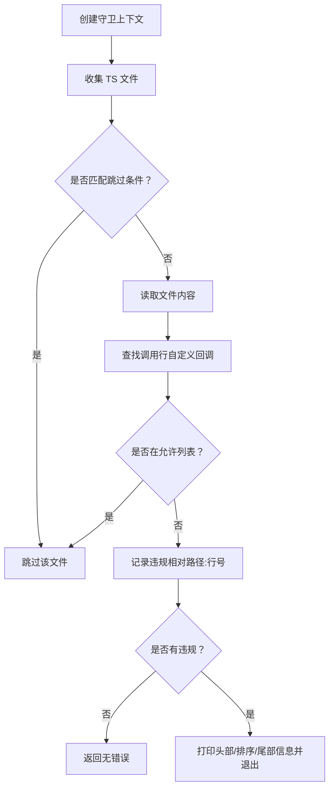
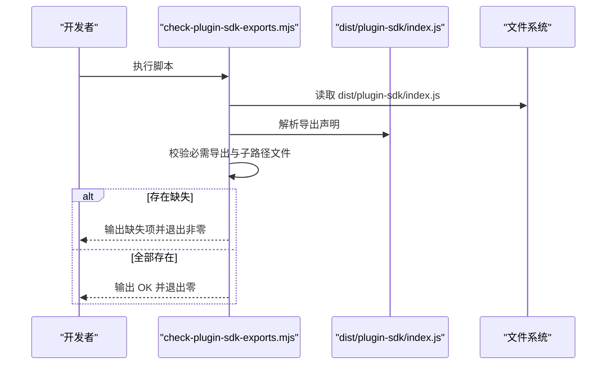
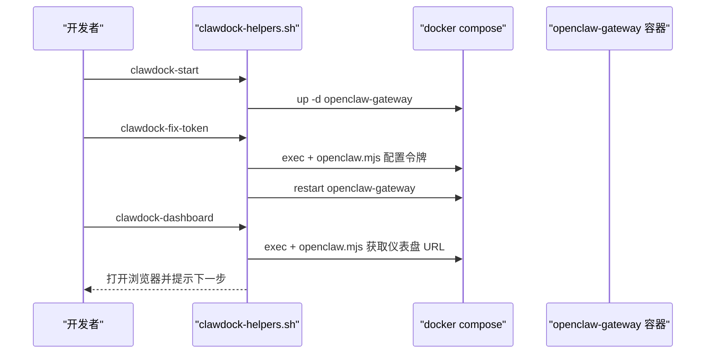
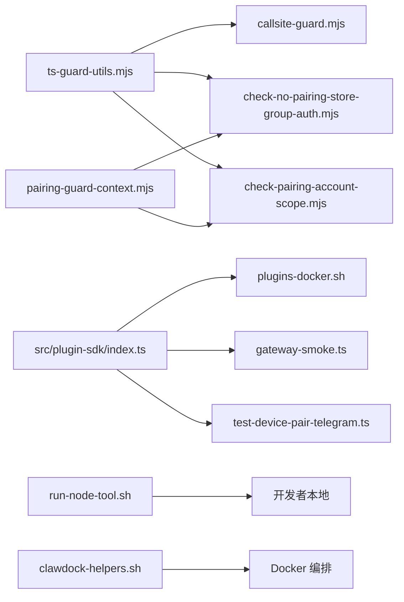

# 开发工具

<cite>
**本文引用的文件**
- [scripts/dev/gateway-smoke.ts](file://scripts/dev/gateway-smoke.ts)
- [scripts/dev/test-device-pair-telegram.ts](file://scripts/dev/test-device-pair-telegram.ts)
- [scripts/e2e/plugins-docker.sh](file://scripts/e2e/plugins-docker.sh)
- [scripts/lib/ts-guard-utils.mjs](file://scripts/lib/ts-guard-utils.mjs)
- [scripts/lib/callsite-guard.mjs](file://scripts/lib/callsite-guard.mjs)
- [scripts/lib/pairing-guard-context.mjs](file://scripts/lib/pairing-guard-context.mjs)
- [scripts/check-plugin-sdk-exports.mjs](file://scripts/check-plugin-sdk-exports.mjs)
- [scripts/check-no-pairing-store-group-auth.mjs](file://scripts/check-no-pairing-store-group-auth.mjs)
- [scripts/check-pairing-account-scope.mjs](file://scripts/check-pairing-account-scope.mjs)
- [scripts/check-composite-action-input-interpolation.py](file://scripts/check-composite-action-input-interpolation.py)
- [scripts/pre-commit/run-node-tool.sh](file://scripts/pre-commit/run-node-tool.sh)
- [scripts/shell-helpers/clawdock-helpers.sh](file://scripts/shell-helpers/clawdock-helpers.sh)
- [src/plugin-sdk/index.ts](file://src/plugin-sdk/index.ts)
- [extensions/*/openclaw.plugin.json](file://extensions/acpx/openclaw.plugin.json)
</cite>

## 目录

1. [简介](#简介)
2. [项目结构](#项目结构)
3. [核心组件](#核心组件)
4. [架构总览](#架构总览)
5. [详细组件分析](#详细组件分析)
6. [依赖关系分析](#依赖关系分析)
7. [性能考量](#性能考量)
8. [故障排查指南](#故障排查指南)
9. [结论](#结论)
10. [附录](#附录)

## 简介

本文件系统化梳理 OpenClaw 插件开发工具集，覆盖工具函数、辅助类与实用程序，重点包括：

- 测试工具：端到端脚本、参数解析与命令执行
- 兼容性与发布校验：插件 SDK 导出完整性检查
- 参数解析与类型安全：TypeScript 文件扫描与调用点守卫
- 开发环境与调试：Docker 工具链、预提交工具选择器
- 代码质量与合规：复合 Action 输入插值检查、配对访问守卫
- 常用开发模式与最佳实践：模板与流程建议

目标是帮助插件开发者快速上手、稳定交付，并在 CI 与本地环境中保持一致的质量标准。

## 项目结构

围绕“插件开发工具”的相关目录与文件组织如下：

- scripts/dev：开发者调试脚本（网关连通性、设备配对）
- scripts/e2e：端到端安装与加载验证（Docker 镜像内运行）
- scripts/lib：通用工具库（TS 文件收集、调用点守卫、上下文）
- scripts/check-\*：发布前/质量门禁检查（SDK 导出、配对作用域、输入插值）
- scripts/pre-commit：预提交工具执行器（自动选择 pnpm/bun/npm）
- scripts/shell-helpers：ClawDock Docker 辅助脚本（一键启动、健康检查、配对）
- src/plugin-sdk：插件 SDK 汇总导出入口，供插件运行时使用
- extensions/\*：官方扩展清单文件（openclaw.plugin.json），定义插件元数据与配置模式

**图表来源**

- [scripts/dev/gateway-smoke.ts:1-76](file://scripts/dev/gateway-smoke.ts#L1-L76)
- [scripts/e2e/plugins-docker.sh:1-225](file://scripts/e2e/plugins-docker.sh#L1-L225)
- [scripts/lib/ts-guard-utils.mjs:1-158](file://scripts/lib/ts-guard-utils.mjs#L1-L158)
- [scripts/check-plugin-sdk-exports.mjs:1-158](file://scripts/check-plugin-sdk-exports.mjs#L1-L158)
- [scripts/pre-commit/run-node-tool.sh:1-32](file://scripts/pre-commit/run-node-tool.sh#L1-L32)
- [scripts/shell-helpers/clawdock-helpers.sh:1-418](file://scripts/shell-helpers/clawdock-helpers.sh#L1-L418)
- [src/plugin-sdk/index.ts:1-826](file://src/plugin-sdk/index.ts#L1-L826)
- [extensions/acpx/openclaw.plugin.json](file://extensions/acpx/openclaw.plugin.json)

**章节来源**

- [scripts/dev/gateway-smoke.ts:1-76](file://scripts/dev/gateway-smoke.ts#L1-L76)
- [scripts/e2e/plugins-docker.sh:1-225](file://scripts/e2e/plugins-docker.sh#L1-L225)
- [scripts/lib/ts-guard-utils.mjs:1-158](file://scripts/lib/ts-guard-utils.mjs#L1-L158)
- [scripts/check-plugin-sdk-exports.mjs:1-158](file://scripts/check-plugin-sdk-exports.mjs#L1-L158)
- [scripts/pre-commit/run-node-tool.sh:1-32](file://scripts/pre-commit/run-node-tool.sh#L1-L32)
- [scripts/shell-helpers/clawdock-helpers.sh:1-418](file://scripts/shell-helpers/clawdock-helpers.sh#L1-L418)
- [src/plugin-sdk/index.ts:1-826](file://src/plugin-sdk/index.ts#L1-L826)
- [extensions/acpx/openclaw.plugin.json](file://extensions/acpx/openclaw.plugin.json)

## 核心组件

- TypeScript 文件扫描与违规收集工具：递归收集 TS 文件、过滤测试文件、基于 AST 扫描违规、统一输出路径与行号
- 调用点守卫：按相对路径白名单跳过、允许特定调用站点、排序输出违规列表
- 配对访问守卫上下文：限定源码根目录（src、extensions），生成仓库根与绝对路径解析器
- 插件 SDK 导出完整性检查：编译产物中提取命名导出集合，校验关键导出与子路径文件是否存在
- 复合 Action 输入插值检查：禁止在 composite run 中直接插值 inputs.\*，需改用 env 变量
- 预提交工具选择器：自动检测 pnpm/bun/npm 并执行工具，避免环境差异
- ClawDock Docker 辅助：一键启动/停止/重启容器、查看日志、健康检查、打开仪表盘、配对设备
- 插件清单与配置：各扩展的 openclaw.plugin.json 定义插件元信息与配置模式

**章节来源**

- [scripts/lib/ts-guard-utils.mjs:1-158](file://scripts/lib/ts-guard-utils.mjs#L1-L158)
- [scripts/lib/callsite-guard.mjs:1-46](file://scripts/lib/callsite-guard.mjs#L1-L46)
- [scripts/lib/pairing-guard-context.mjs:1-14](file://scripts/lib/pairing-guard-context.mjs#L1-L14)
- [scripts/check-plugin-sdk-exports.mjs:1-158](file://scripts/check-plugin-sdk-exports.mjs#L1-L158)
- [scripts/check-composite-action-input-interpolation.py:1-82](file://scripts/check-composite-action-input-interpolation.py#L1-L82)
- [scripts/pre-commit/run-node-tool.sh:1-32](file://scripts/pre-commit/run-node-tool.sh#L1-L32)
- [scripts/shell-helpers/clawdock-helpers.sh:1-418](file://scripts/shell-helpers/clawdock-helpers.sh#L1-L418)
- [src/plugin-sdk/index.ts:1-826](file://src/plugin-sdk/index.ts#L1-L826)
- [extensions/acpx/openclaw.plugin.json](file://extensions/acpx/openclaw.plugin.json)

## 架构总览

下图展示“工具链”如何贯穿开发、测试与发布阶段：

**图表来源**

- [scripts/pre-commit/run-node-tool.sh:1-32](file://scripts/pre-commit/run-node-tool.sh#L1-L32)
- [scripts/e2e/plugins-docker.sh:1-225](file://scripts/e2e/plugins-docker.sh#L1-L225)
- [scripts/dev/gateway-smoke.ts:1-76](file://scripts/dev/gateway-smoke.ts#L1-L76)
- [scripts/check-plugin-sdk-exports.mjs:1-158](file://scripts/check-plugin-sdk-exports.mjs#L1-L158)
- [scripts/shell-helpers/clawdock-helpers.sh:1-418](file://scripts/shell-helpers/clawdock-helpers.sh#L1-L418)

## 详细组件分析

### 组件A：TypeScript 文件扫描与违规收集工具

- 功能要点
  - 支持从多个源码根收集 TS 文件，可选择是否包含测试文件
  - 过滤 node_modules，默认忽略不存在路径
  - 提供 AST 辅助函数（定位行号、属性名文本、表达式解包）
  - 统一收集文件级违规，输出相对路径与行号
- 使用场景
  - 自定义静态检查规则（如调用点守卫、配对访问守卫）
  - 在 CI 中批量扫描源码，生成结构化报告
- 性能与复杂度
  - 递归遍历目录树，时间复杂度 O(N)，N 为文件数
  - 可通过 skipFile 与 extraTestSuffixes 控制扫描范围

**图表来源**

- [scripts/lib/ts-guard-utils.mjs:21-109](file://scripts/lib/ts-guard-utils.mjs#L21-L109)

**章节来源**

- [scripts/lib/ts-guard-utils.mjs:1-158](file://scripts/lib/ts-guard-utils.mjs#L1-L158)

### 组件B：调用点守卫

- 功能要点
  - 基于仓库根与源码根，收集 TS 文件
  - 支持按相对路径跳过、允许特定调用站点
  - 可关闭排序或自定义排序，统一输出格式
- 使用场景
  - 禁止在某些模块中调用特定 API 或路径
  - 强制规范调用位置，降低耦合风险

**图表来源**

- [scripts/lib/callsite-guard.mjs:9-45](file://scripts/lib/callsite-guard.mjs#L9-L45)

**章节来源**

- [scripts/lib/callsite-guard.mjs:1-46](file://scripts/lib/callsite-guard.mjs#L1-L46)

### 组件C：配对访问守卫上下文

- 功能要点
  - 限定源码根为 src 与 extensions
  - 提供仓库根解析与绝对路径拼接能力
- 使用场景
  - 与配对访问守卫脚本配合，确保只扫描与插件生态相关的源码

**章节来源**

- [scripts/lib/pairing-guard-context.mjs:1-14](file://scripts/lib/pairing-guard-context.mjs#L1-L14)

### 组件D：插件 SDK 导出完整性检查

- 功能要点
  - 读取构建产物中的最终导出语句，提取命名导出集合
  - 校验关键导出项与子路径文件（JS/DTS）是否存在
  - 用于防止运行时缺失导出导致插件崩溃
- 使用场景
  - 发布前回归保护，避免遗漏导出或子路径文件

**图表来源**

- [scripts/check-plugin-sdk-exports.mjs:1-158](file://scripts/check-plugin-sdk-exports.mjs#L1-L158)

**章节来源**

- [scripts/check-plugin-sdk-exports.mjs:1-158](file://scripts/check-plugin-sdk-exports.mjs#L1-L158)

### 组件E：复合 Action 输入插值检查

- 功能要点
  - 扫描 .github/actions 下的 composite action
  - 禁止在 run 行或多行脚本中直接插值 inputs.\*
  - 要求改用 env: 并引用 shell 变量
- 使用场景
  - GitHub Actions 安全与一致性规范

**章节来源**

- [scripts/check-composite-action-input-interpolation.py:1-82](file://scripts/check-composite-action-input-interpolation.py#L1-L82)

### 组件F：预提交工具选择器

- 功能要点
  - 自动检测 pnpm/bun/npm 并执行工具
  - 若均不可用则报错
- 使用场景
  - 统一团队开发环境，避免工具链差异

**章节来源**

- [scripts/pre-commit/run-node-tool.sh:1-32](file://scripts/pre-commit/run-node-tool.sh#L1-L32)

### 组件G：ClawDock Docker 辅助脚本

- 功能要点
  - 自动发现/保存 OpenClaw 项目路径
  - 封装 docker compose 命令，提供启动/停止/重启/日志/状态
  - 健康检查、仪表盘打开、设备配对列表与批准
  - 一键修复网关令牌配置并重启服务
- 使用场景
  - 快速搭建本地网关环境，进行插件联调与端到端验证

**图表来源**

- [scripts/shell-helpers/clawdock-helpers.sh:160-353](file://scripts/shell-helpers/clawdock-helpers.sh#L160-L353)

**章节来源**

- [scripts/shell-helpers/clawdock-helpers.sh:1-418](file://scripts/shell-helpers/clawdock-helpers.sh#L1-L418)

### 组件H：端到端插件安装与加载验证

- 功能要点
  - 构建 Docker 镜像并运行
  - 写入演示插件与清单，验证 plugins list 的 JSON 输出
  - 校验工具、网关方法、CLI 命令、服务均已注册且状态为 loaded
  - 测试 tgz、本地目录、npm file: 三种安装方式
- 使用场景
  - 验证插件加载器、清单解析、安装流程的稳定性

**章节来源**

- [scripts/e2e/plugins-docker.sh:1-225](file://scripts/e2e/plugins-docker.sh#L1-L225)

### 组件I：网关连通性与健康检查

- 功能要点
  - 解析网关 URL，建立 WebSocket 客户端
  - 连接时携带最小/最大协议版本、客户端标识、语言与用户代理
  - 角色与权限示例（operator），认证使用令牌
  - 请求健康检查与会话历史，输出结果并关闭连接
- 使用场景
  - 快速验证网关可用性与基本功能

**章节来源**

- [scripts/dev/gateway-smoke.ts:1-76](file://scripts/dev/gateway-smoke.ts#L1-L76)

### 组件J：设备配对命令测试（Telegram）

- 功能要点
  - 解析命令行参数（聊天 ID、账户 ID）
  - 加载配置与插件，匹配 /pair 命令并执行
  - 将结果文本发送回 Telegram
- 使用场景
  - 验证插件命令解析与渠道适配

**章节来源**

- [scripts/dev/test-device-pair-telegram.ts:1-63](file://scripts/dev/test-device-pair-telegram.ts#L1-L63)

### 组件K：插件 SDK 汇总导出

- 功能要点
  - 汇总导出插件开发所需类型、工具函数、通道适配器、HTTP 注册、配置模式等
  - 作为插件运行时的统一入口，保证跨通道一致性
- 使用场景
  - 插件开发时的“一站式” API 访问

**章节来源**

- [src/plugin-sdk/index.ts:1-826](file://src/plugin-sdk/index.ts#L1-L826)

## 依赖关系分析

- 工具库依赖
  - ts-guard-utils.mjs 为核心扫描与 AST 工具，被 callsite-guard.mjs 与多个检查脚本复用
  - pairing-guard-context.mjs 为配对相关检查提供上下文
- 脚本间耦合
  - check-plugin-sdk-exports.mjs 依赖构建产物（dist）
  - plugins-docker.sh 依赖 openclaw.plugin.json 清单
  - gateway-smoke.ts 依赖网关服务与令牌
- 外部依赖
  - 预提交脚本自动探测 pnpm/bun/npm
  - ClawDock 依赖 docker compose 与项目 .env

**图表来源**

- [scripts/lib/ts-guard-utils.mjs:1-158](file://scripts/lib/ts-guard-utils.mjs#L1-L158)
- [scripts/lib/callsite-guard.mjs:1-46](file://scripts/lib/callsite-guard.mjs#L1-L46)
- [scripts/lib/pairing-guard-context.mjs:1-14](file://scripts/lib/pairing-guard-context.mjs#L1-L14)
- [scripts/check-no-pairing-store-group-auth.mjs:1-181](file://scripts/check-no-pairing-store-group-auth.mjs#L1-L181)
- [scripts/check-pairing-account-scope.mjs:1-101](file://scripts/check-pairing-account-scope.mjs#L1-L101)
- [src/plugin-sdk/index.ts:1-826](file://src/plugin-sdk/index.ts#L1-L826)
- [scripts/e2e/plugins-docker.sh:1-225](file://scripts/e2e/plugins-docker.sh#L1-L225)
- [scripts/dev/gateway-smoke.ts:1-76](file://scripts/dev/gateway-smoke.ts#L1-L76)
- [scripts/dev/test-device-pair-telegram.ts:1-63](file://scripts/dev/test-device-pair-telegram.ts#L1-L63)
- [scripts/pre-commit/run-node-tool.sh:1-32](file://scripts/pre-commit/run-node-tool.sh#L1-L32)
- [scripts/shell-helpers/clawdock-helpers.sh:1-418](file://scripts/shell-helpers/clawdock-helpers.sh#L1-L418)

**章节来源**

- [scripts/lib/ts-guard-utils.mjs:1-158](file://scripts/lib/ts-guard-utils.mjs#L1-L158)
- [scripts/lib/callsite-guard.mjs:1-46](file://scripts/lib/callsite-guard.mjs#L1-L46)
- [scripts/lib/pairing-guard-context.mjs:1-14](file://scripts/lib/pairing-guard-context.mjs#L1-L14)
- [scripts/check-no-pairing-store-group-auth.mjs:1-181](file://scripts/check-no-pairing-store-group-auth.mjs#L1-L181)
- [scripts/check-pairing-account-scope.mjs:1-101](file://scripts/check-pairing-account-scope.mjs#L1-L101)
- [src/plugin-sdk/index.ts:1-826](file://src/plugin-sdk/index.ts#L1-L826)
- [scripts/e2e/plugins-docker.sh:1-225](file://scripts/e2e/plugins-docker.sh#L1-L225)
- [scripts/dev/gateway-smoke.ts:1-76](file://scripts/dev/gateway-smoke.ts#L1-L76)
- [scripts/dev/test-device-pair-telegram.ts:1-63](file://scripts/dev/test-device-pair-telegram.ts#L1-L63)
- [scripts/pre-commit/run-node-tool.sh:1-32](file://scripts/pre-commit/run-node-tool.sh#L1-L32)
- [scripts/shell-helpers/clawdock-helpers.sh:1-418](file://scripts/shell-helpers/clawdock-helpers.sh#L1-L418)

## 性能考量

- 文件扫描
  - 通过跳过 node_modules 与按后缀过滤，减少 IO 与解析开销
  - 对大仓库建议限制 sourceRoots 与使用 skipFile 进一步缩小范围
- AST 扫描
  - 单文件 AST 解析成本低；若规则较多，可考虑缓存中间结果或分批执行
- CI 串行 vs 并行
  - 静态检查与端到端脚本可在 CI 中并行执行，缩短总耗时
- Docker 端到端
  - 预构建镜像与复用缓存层，避免重复安装依赖

[本节为通用指导，无需具体文件分析]

## 故障排查指南

- 网关连通性失败
  - 检查 URL 与令牌是否正确传入或环境变量是否设置
  - 查看握手事件与健康检查响应，确认协议版本与角色权限
- 插件未加载或状态异常
  - 使用 plugins list --json 校验插件状态与已注册项
  - 确认 openclaw.plugin.json 的 id 与 configSchema 正确
- SDK 导出缺失
  - 执行 check-plugin-sdk-exports.mjs，核对命名导出与子路径文件
  - 重新构建并确认 dist 输出完整
- 预提交工具执行失败
  - 确认 pnpm/bun/npm 是否安装并可执行
  - 使用 run-node-tool.sh 包装工具调用
- GitHub Actions 输入插值错误
  - 将 inputs.\* 替换为 env 变量并在 run 中引用
- Docker 环境问题
  - 使用 clawdock-helpers.sh 的健康检查与日志命令定位问题
  - 重新配置令牌并重启网关

**章节来源**

- [scripts/dev/gateway-smoke.ts:1-76](file://scripts/dev/gateway-smoke.ts#L1-L76)
- [scripts/e2e/plugins-docker.sh:1-225](file://scripts/e2e/plugins-docker.sh#L1-L225)
- [scripts/check-plugin-sdk-exports.mjs:1-158](file://scripts/check-plugin-sdk-exports.mjs#L1-L158)
- [scripts/pre-commit/run-node-tool.sh:1-32](file://scripts/pre-commit/run-node-tool.sh#L1-L32)
- [scripts/check-composite-action-input-interpolation.py:1-82](file://scripts/check-composite-action-input-interpolation.py#L1-L82)
- [scripts/shell-helpers/clawdock-helpers.sh:1-418](file://scripts/shell-helpers/clawdock-helpers.sh#L1-L418)

## 结论

本工具集以“可复用工具库 + 场景化脚本 + 质量门禁 + Docker 辅助”的方式，覆盖插件开发的全生命周期。通过标准化的扫描与校验机制、清晰的使用场景与参数约定，以及一键化的 Docker 调试工具，能够显著提升开发效率与交付质量。

[本节为总结，无需具体文件分析]

## 附录

### 常用开发模式与模板

- 端到端验证模板
  - 使用 plugins-docker.sh 的安装与加载流程，结合 openclaw.plugin.json 定义插件元信息
- 网关连通性模板
  - 通过 gateway-smoke.ts 的参数与请求序列，快速验证连接、健康与历史接口
- 设备配对命令模板
  - 使用 test-device-pair-telegram.ts 的命令匹配与执行流程，适配其他渠道

**章节来源**

- [scripts/e2e/plugins-docker.sh:1-225](file://scripts/e2e/plugins-docker.sh#L1-L225)
- [scripts/dev/gateway-smoke.ts:1-76](file://scripts/dev/gateway-smoke.ts#L1-L76)
- [scripts/dev/test-device-pair-telegram.ts:1-63](file://scripts/dev/test-device-pair-telegram.ts#L1-L63)

### 最佳实践

- 在 CI 中并行执行静态检查与端到端脚本
- 使用 run-node-tool.sh 统一工具链，避免环境差异
- 发布前执行 check-plugin-sdk-exports.mjs，确保导出完整
- 遵循 GitHub Actions 安全规范，避免直接插值 inputs.\*

**章节来源**

- [scripts/pre-commit/run-node-tool.sh:1-32](file://scripts/pre-commit/run-node-tool.sh#L1-L32)
- [scripts/check-plugin-sdk-exports.mjs:1-158](file://scripts/check-plugin-sdk-exports.mjs#L1-L158)
- [scripts/check-composite-action-input-interpolation.py:1-82](file://scripts/check-composite-action-input-interpolation.py#L1-L82)
